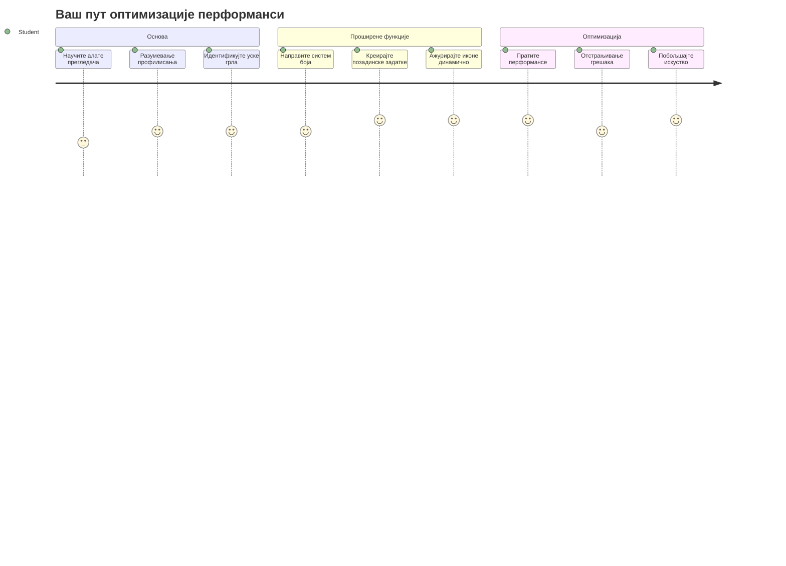
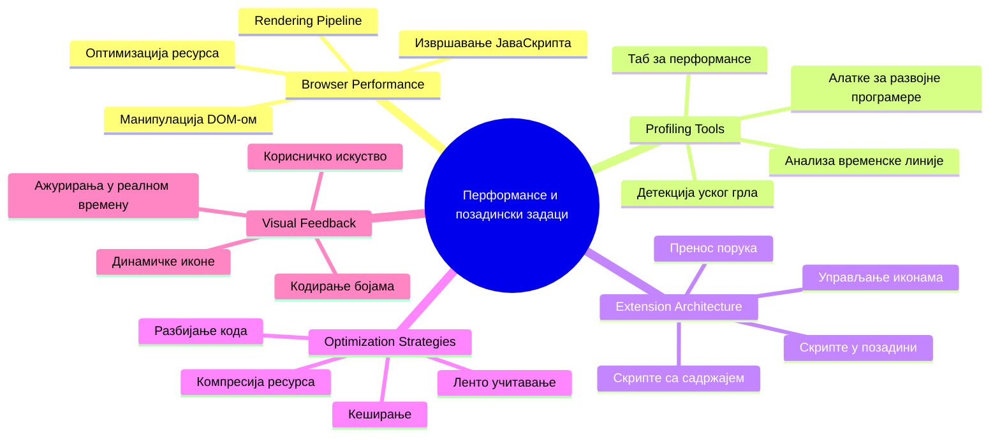
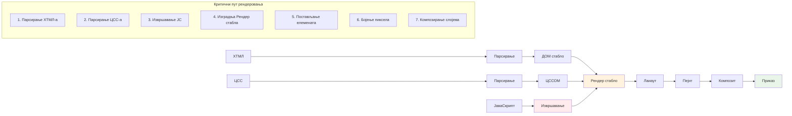
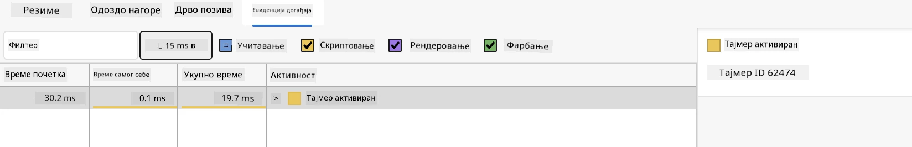
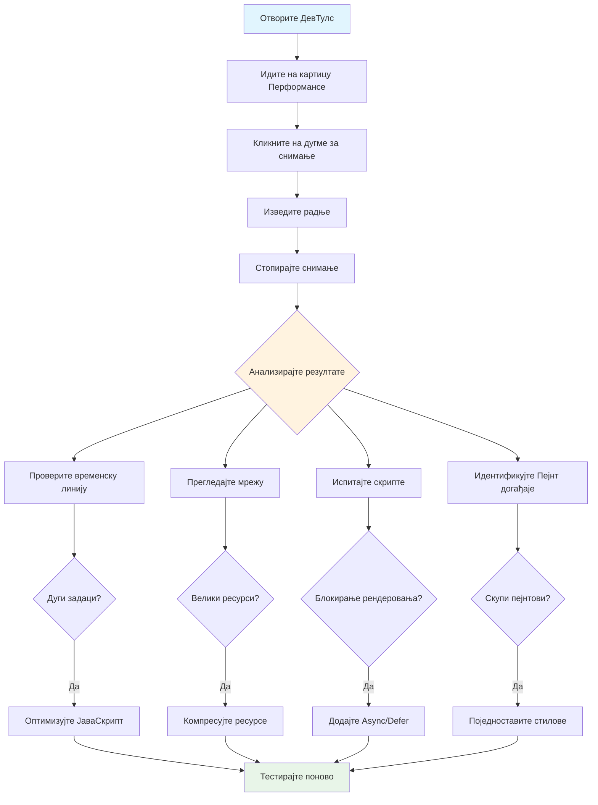
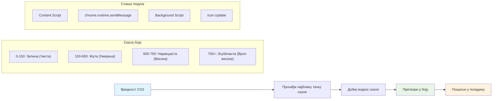
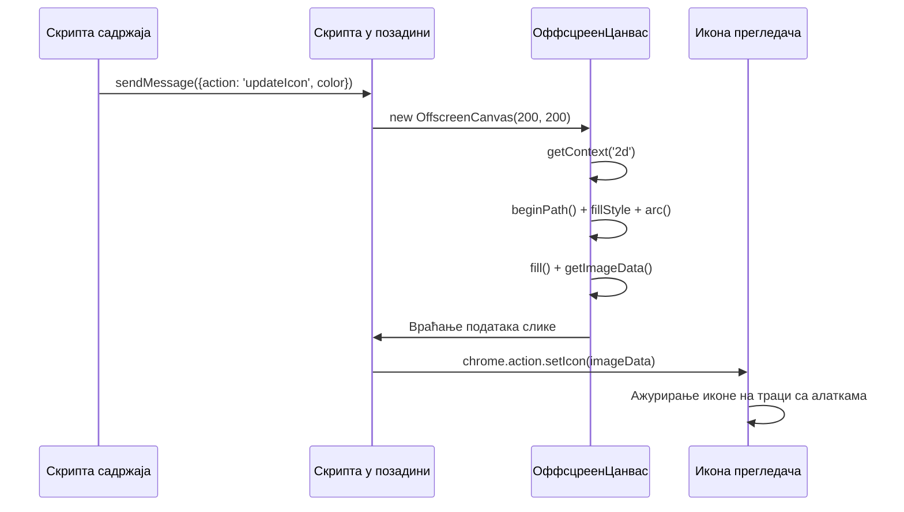
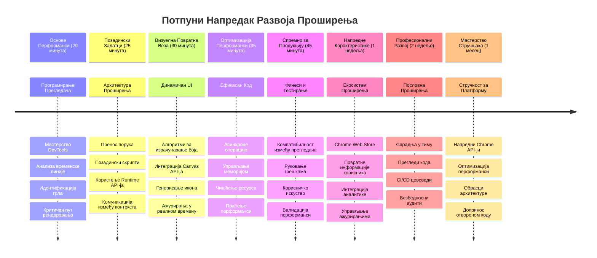

# Пројекат проширења прегледача, део 3: Сазнајте о позадинским задацима и перформансама


Јесте ли се икада питали шта чини да нека проширења прегледача делују брзо и одзивно, док друга изгледају успорено? Тајна лежи у ономе што се дешава иза кулиса. Док корисници кликају по интерфејсу вашег проширења, постоји цео свет позадинских процеса који тихо управљају преузимањем података, ажурирањем икона и системским ресурсима.

Ово је наша последња лекција у серији проширења за прегледаче, и учинићемо да ваш трагач за угљеничким отиском ради глатко. Додаћете динамичка ажурирања икона и научити како да уочите проблеме са перформансама пре него што постану стварни проблеми. Као подешавање тркачког аутомобила – мале оптимизације могу направити велику разлику у функционисању свега.

Када завршимо, имаћете углађено проширење и разумеваћете принципе перформанси који раздвајају добре веб апликације од одличних. Уронимо у свет оптимизације прегледача.

## Пре-предавачки квиз

[Пре-предавачки квиз](https://ff-quizzes.netlify.app/web/quiz/27)

### Увод

У нашим претходним лекцијама направили сте формулар, повезали га са API-јем, и приступили асинхроном преузимању података. Ваше проширење лепо добија облик.

Сада треба да додамо завршне детаље – као што је променa боје иконе проширења на основу угљеничних података. Ово ме подсећа како је NASA морала да оптимизује сваки систем на Аполо свемирском броду. Није било места за изгубљена циклуса или меморију јер је живот зависио од перформанси. Иако наше проширење прегледача није толико критично, исти принципи важе – ефикасан код ствара боље корисничко искуство.


## Основе веб перформанси

Када ваш код ради ефикасно, људи могу стварно *осетити* разлику. Знате онај тренутак када страница одмах учита или анимација тече глатко? То је добар рад на делу.

Перформансе нису само брзина – већ стварање веб искустава која делују природно уместо громогласно и фрустрирајуће. У раним данима рачунарства, Грејс Хопер је чувала наносекунду (делић жице дугачке око тридесет центиметара) на свом столу да покаже колико светлост путује у једну милијардитину секунде. Био је то њен начин објашњења колико свака микросекунда значи у рачунарству. Истражимо алате детектива који помажу да схватите шта успорава ствари.

> „Перформансе веб сајта су око две ствари: колико брзо се страница учитава и колико брзо код на њој ради.“ -- [Зак Гросбарт](https://www.smashingmagazine.com/2012/06/javascript-profiling-chrome-developer-tools/)

Тема како учинити веб сајтове блиставо брзима на свим врстама уређаја, за све врсте корисника, у свакој врсти ситуација, разумљиво је обимна. Ево неких ствари које треба имати на уму када градите стандардни веб пројекат или проширење прегледача.

Први корак у оптимизацији вашег сајта је разумевање онога што се заиста дешава испод хаубе. Срећом, ваш прегледач долази са моћним алатима за детекцију уграђеним.


Да бисте отворили Developer Tools у Edge-у, кликните те три тачке у горњем десном углу, затим идите на More Tools > Developer Tools. Или користите тастерску пречицу: `Ctrl` + `Shift` + `I` на Виндоус-у или `Option` + `Command` + `I` на Mac-у. Једном када сте тамо, кликните на таб Performance – овде ћете обављати истраживање.

**Ево вашег сета алата за детективе перформанси:**
- **Отворите** Developer Tools (користићете их непрестано као програмер!)
- **Идите** на таб Performance – схватите га као фитнес трацкер ваше веб апликације
- **Притисните** дугме Record и пратите страницу у акцији
- **Проучите** резултате да откријете шта успорава

Ајде да пробамо ово. Отворите сајт (Microsoft.com добро функционише) и кликните на дугме 'Record'. Сада освежите страницу и пратите како профајлер снима све што се дешава. Када зауставите снимање, видећете детаљан преглед како прегледач „скриптује“, „рендерује“ и „црта“ страницу. Подсећа ме како контролна мисија прати сваки систем током лансирања ракете – добијате податке у реалном времену о томе шта се тачно дешава и када.


✅ [Microsoft документација](https://docs.microsoft.com/microsoft-edge/devtools-guide/performance/?WT.mc_id=academic-77807-sagibbon) има још пуно детаља ако желите дубље да уроните

> Препорука стручњака: Обришите кеш прегледача пре тестирања да бисте видели како ваш сајт ради за прве посетиоце – обично је знатно другачије него при поновним посетама!

Изаберите елементе у временској линији профила да се увећате и погледате догађаје који се дешавају док се ваша страница учитава.

Погледајте кратак преглед перформанси странице тако што ћете изабрати део временске линије профила и погледати сажетак:


Погледајте панел дневника догађаја да бисте проверили да ли је неки догађај трајао дуже од 15 ms:



✅ Упознајте свој профајлер! Отворите девелопер алате на овом сајту и погледајте да ли има било каквих уских грла. Који је најспорији ресурс? Који најбржи?


## На шта обратити пажњу током профилисања

Покретање профајлера је само почетак – права вештина је знати шта вам ти шарени графикони заправо говоре. Не брините, научићете да их читате. Искусни програмери су научили да препознају знакове упозорења пре него што они постану озбиљни проблеми.

Хајде да причамо о уобичајеним осумњиченима – перформансним проблемима који се често увуку у веб пројекте. Као што је Марија Кири пажљиво пратити ниво зрачења у својој лабораторији, морамо пазити на одређене шаблоне који сигнализирају могуће проблеме. Превенција ових још у раној фази много ће вас (и ваше кориснике) поштедети фрустрација.

**Величине ресурса**: Веб сајтови током година постају „тежи“, а велики део те додатне тежине долази од слика. Као да у дигиталне кофере стављамо све више ствари.

✅ Погледајте [Internet Archive](https://httparchive.org/reports/page-weight) да видите како су странице расли током времена – прилично је занимљиво.

**Ево како да оптимизујете ресурсе:**
- **Компресујте** слике! Модерни формати као WebP драматично смањују величину фајлова
- **Достављајте** одговарајућу величину слике за сваки уређај – нема потребе слања великих десктоп слика на телефоне
- **Минификујте** ваш CSS и JavaScript – сваки бајт је важан
- **Користите** лењо учитавање тако да се слике преузимају тек кад корисници заиста скролују до њих

**Пролажења кроз DOM**: Прегледач мора да гради свој Document Object Model на основу кода који пишете, па је у интересу добре перформансе странице да смањите број ознака, користећи и стилизујући само оно што страница заиста треба. У том контексту, вишак CSS-а повезан са страницом може бити оптимизован; стилови који су потребни само на једној страници не морају бити укључени у главни стилски фајл, на пример.

**Кључне стратегије за оптимизацију DOM-а:**
- **Минимизира** број HTML елемената и нивоа угњежђивања
- **Уклња** неискоришћена CSS правила и ефикасно консолидује стилске листе
- **Организује** CSS да учитава само оно што је потребно за сваку страницу
- **Структурира** HTML семантички за боље парсирање од стране прегледача

**JavaScript**: Свако ко ради са JavaScript-ом треба да пази на 'render-blocking' скрипте које морају бити учитане пре него што се DOM може наставити парсирати и приказати у прегледачу. Размотрите коришћење `defer` атрибута са inline скриптама (као што је учињено у модула Terrarium).

**Модерне технике оптимизације JavaScript-а:**
- **Користи** `defer` атрибут за учитавање скрипти након парсирања DOM-а
- **Имплементира** дељење кода да би учитавао само неопходни JavaScript
- **Примењује** лењо учитавање за не-критичне функције
- **Минимизује** примену тешких библиотека и фрејмворка када је могуће

✅ Испробајте неке сајтове помоћу [Site Speed Test website](https://www.webpagetest.org/) да сазнате више о уобичајеним проверама које се раде за одређивање перформанси сајта.

### 🔄 **Педагошки преглед**
**Разумевање перформанси**: Пре него што направите функције проширења, уверите се да можете:
- ✅ Објаснити критични пут рендеровања од HTML-а до пиксела
- ✅ Препознати уобичајена уска грла у перформансама веб апликација
- ✅ Користити алате за развој у прегледачу да бисте профилисали перформансе странице
- ✅ Разумети како величина ресурса и сложеност DOM-а утичу на брзину

**Брзи самотест**: Шта се дешава када имате render-blocking JavaScript?
*Одговор: Прегледач мора да преузме и изврши скрипту пре него што може наставити парсирање HTML-а и рендеровање странице*

**Утицај перформанси у стварном свету**:
- **100 ms одлагања**: Корисници примете успоравање
- **1 секунду одлагања**: Корисници почињу да губе пажњу
- **3+ секунде**: 40% корисника напушта страницу
- **Мобилне мреже**: Перформансе су још важније

Сада када имате идеју како прегледач рендерује ресурсе које шаљете, погледајмо последње кораке до завршетка вашег проширења:

### Направите функцију за израчунавање боје

Сада ћемо направити функцију која претвара нумеричке податке у значајне боје. Замислите је као систем семафора – зелена за чисту енергију, црвена за високу угљеничну интензивност.

Ова функција ће узети податке о CO2 из нашег API-ја и одредити која боја најбоље представља утицај на животну средину. Слично као како научници користе кодирање боја у топлотним мапама да визуализују комплексне податке – од температура океана до формирања звезда. Додајмо ово у `/src/index.js`, одмах након оних `const` променљивих које смо раније подесили:


```javascript
function calculateColor(value) {
	// Дефиниши скалу за интензитет CO2 (грами по kWh)
	const co2Scale = [0, 150, 600, 750, 800];
	// Одговарајуће боје од зелене (чиста) до тамно браон (висок угљеник)
	const colors = ['#2AA364', '#F5EB4D', '#9E4229', '#381D02', '#381D02'];

	// Пронађи најближу вредност на скали за наш улаз
	const closestNum = co2Scale.sort((a, b) => {
		return Math.abs(a - value) - Math.abs(b - value);
	})[0];
	
	console.log(`${value} is closest to ${closestNum}`);
	
	// Пронађи индекс за мапирање боје
	const num = (element) => element > closestNum;
	const scaleIndex = co2Scale.findIndex(num);

	const closestColor = colors[scaleIndex];
	console.log(scaleIndex, closestColor);

	// Пошаљи поруку за ажурирање боје позадинском скрипту
	chrome.runtime.sendMessage({ action: 'updateIcon', value: { color: closestColor } });
}
```

**Разлажемо ову паметну функцију:**
- **Поставља** два низа – један за нивое CO2, други за боје (зелена = чиста, браон = прљава!)
- **Проналази** најближи одговор стварној CO2 вредности коришћењем сортирања низа
- **Узима** одговарајућу боју користећи метод findIndex()
- **Шаље** поруку Chrome позадинском скрипту са изабраном бојом
- **Користи** template literals (обрнуте наводнике) за чисто форматирање стрингова
- **Одржава** све организованим коришћењем const декларација

`chrome.runtime` [API](https://developer.chrome.com/extensions/runtime) је као нервни систем вашег проширења – обавља сву позадинску комуникацију и задатке:

> „Користите chrome.runtime API да бисте приступили позадинској страници, вратили детаље о манифесту и слушали и одговарали на догађаје у животном циклусу апликације или проширења. Такође можете користити овај API да конвертујете релативне путеве URL-ова у у потпуности квалификоване URL-ове.“

**Зашто је Chrome Runtime API тако користан:**
- **Дозвољава** различитим деловима вашег проширења да комуницирају
- **Рукова** позадинским задацима без замрзавања корисничког интерфејса
- **Управља** догађајима животног циклуса вашег проширења
- **Олакшава** слање порука између скрипти

✅ Ако развијате ово проширење за Edge, можда ће вас изненадити то што користите chrome API. Новије верзије Edge прегледача раде на Chromium енджину, тако да можете користити ове алате.


> **Савет стручњака**: Ако желите да профилишете проширење прегледача, покрените девелопер алате из саме екстензије, јер је то посебан прегледачки инстанц. То вам омогућава приступ метрикама перформанси специфичним за екстензију.

### Поставите подразумевану боју иконе

Пре него што почнемо са преузимањем стварних података, дајмо нашем проширењу почетну тачку. Нико не воли да гледа празну или слампу иконицу. Почећемо са зеленом бојом да корисници одмах виде да проширење ради од момента када га инсталирају.

У вашој `init()` функцији, подесите ту подразумевану зелену икону:

```javascript
chrome.runtime.sendMessage({
	action: 'updateIcon',
	value: {
		color: 'green',
	},
});
```

**Оно што ова иницијализација постиже:**
- **Поставља** неутралну зелену као подразумевано стање
- **Обезбеђује** тренутне визуелне повратне информације када се проширење покрене
- **Успоставља** образац комуникације са позадинским скриптом
- **Обезбеђује** да корисници виде функционално проширење пре учитавања података

### Позовите функцију, извршите позив

Сада повежимо све тако да када стигну свежи CO2 подаци, ваша икона аутоматски ажурира боју. Као да повезујете последњи круг у електронском уређају – одједном сви појединачни делови раде као један систем.

Додајте овај ред одмах након што добијете CO2 податке из API-ја:

```javascript
// Након преузимања података о CO2 са API-ja
// нека CO2 буде data.data[0].intensity.actual;
calculateColor(CO2);
```

**Ова интеграција постиже:**
- **Повезује** проток података API-ја са системом визуелне индикације
- **Покреће** аутоматске обнове иконе када стигну нови подаци
- **Обезбеђује** визуелне повратне информације у реалном времену на основу тренутне угљеничне интензивности
- **Одржава** раздвајање брине о преузимању података и логици приказа

И на крају, у `/dist/background.js`, додајте слушаоца за ове позадинске позиве:

```javascript
// Ослушкуј поруке из скрипте садржаја
chrome.runtime.onMessage.addListener(function (msg, sender, sendResponse) {
	if (msg.action === 'updateIcon') {
		chrome.action.setIcon({ imageData: drawIcon(msg.value) });
	}
});

// Цртај динамичку икону користећи Canvas API
// Позајмљено из energy lollipop екстензије - лепа функција!
function drawIcon(value) {
	// Креирај offscreen canvas ради боље перформансе
	const canvas = new OffscreenCanvas(200, 200);
	const context = canvas.getContext('2d');

	// Цртај обојени круг који представља интензитет угљеника
	context.beginPath();
	context.fillStyle = value.color;
	context.arc(100, 100, 50, 0, 2 * Math.PI);
	context.fill();

	// Врати податке слике за прегледачку икону
	return context.getImageData(50, 50, 100, 100);
}
```

**Ево шта ова позадинска скрипта ради:**
- **Слуша** поруке из вашег главног скрипта (као рецепционар који прима позиве)
- **Обрађује** захтеве 'updateIcon' за промену иконе на траци са алаткама
- **Прави** нове иконе у лету користећи Canvas API
- **Црта** једноставан обојени круг који приказује тренутну угљеничну интензивност
- **Ажурира** вашу траку са алаткама прегледача свеже иконе
- **Користи** OffscreenCanvas за глатке перформансе (без блокирања UI)

✅ Више ћете научити о Canvas API-ју у [лекцијама о свемирској игри](../../6-space-game/2-drawing-to-canvas/README.md).


### 🔄 **Педагошки преглед**
**Целокупно разумевање проширења**: Потврдите своје знање целог система:
- ✅ Како ради пренос порука између различитих скрипти у проширењу?
- ✅ Зашто користимо OffscreenCanvas уместо уобичајеног Canvas-а за перформансе?
- ✅ Коју улогу игра Chrome Runtime API у архитектури додатака?
- ✅ Како алгоритам за рачунање боја мапира податке на визуелну повратну информацију?

**Разматрања о перформансама**: Ваш додатак сада демонстрира:
- **Ефикасно слање порука**: Чиста комуникација између скриптних контекста
- **Оптимизовано рендеровање**: OffscreenCanvas спречава блокирање корисничког интерфејса
- **Ажурирања у реалном времену**: Динамичне промене икона на основу живих података
- **Управљање меморијом**: Правилно чишћење и руковање ресурсима

**Време је да тестирате ваш додатак:**
- **Изградите** све са `npm run build`
- **Поново учитајте** ваш додатак у прегледачу (не заборавите овај корак)
- **Отворите** ваш додатак и посматрајте како икона мења боје
- **Проверите** како реагује на стварне податке о угљенику са целог света

Сада ћете одмах знати да ли је добар тренутак за прање веша или треба да сачекате чистију енергију. Управо сте направили нешто заиста корисно и усвојили знања о перформансама прегледача.

## GitHub Copilot Agent Изазов 🚀

Користите Agent режим за завршетак следећег изазова:

**Опис:** Побољшајте могућности праћења перформанси додатка тако што ћете додати функцију која прати и приказује време учитавања различитих компоненти додатка.

**Упутство:** Направите систем за праћење перформанси додатка који мери и бележи време потребно за дохватање CO2 података са API-ја, рачунање боја и ажурирање иконе. Додајте функцију `performanceTracker` која користи Performance API за мерење ових операција и приказује резултате у конзоли прегледача са временским ознаком и метриком трајања.

Сазнајте више о [agent режиму](https://code.visualstudio.com/blogs/2025/02/24/introducing-copilot-agent-mode) овде.

## 🚀 Изазов

Ево једне занимљиве детективске мисије: изаберите неколико open source сајтова који постоје годинама (помислите на Wikipedia, GitHub или Stack Overflow) и прегледајте њихову историју комита. Можете ли приметити где су направили побољшања у перформансама? Који проблеми су се најчешће појављивали?

**Ваш приступ истрази:**
- **Претражите** поруке комита за речи као „оптимизуј“, „перформансе“ или „брже“
- **Тражите** појавне обрасце – да ли стално исправљају исте типове проблема?
- **Идентификујте** уобичајене узроке који успоравају веб сајтове
- **Поделите** своја сазнања – други програмери уче из примера из стварног света

## Квиз после предавања

[Квиз после предавања](https://ff-quizzes.netlify.app/web/quiz/28)

## Преглед и Самостални Рад

Размотрите пријаву на [билтен о перформансама](https://perf.email/)

Истражите неке од начина на које прегледачи мере веб перформансе гледајући кроз Performance табове у алатима за развој. Да ли примећујете неке значајне разлике?

### ⚡ **Шта можете урадити у наредних 5 минута**
- [ ] Отворите Task Manager прегледача (Shift+Esc у Chrome-у) да видите употребу ресурса додатка
- [ ] Користите Performance таб у DevTools-у за снимање и анализу перформанси веб странице
- [ ] Проверите страницу Extensions у прегледачу како бисте видели који додаци утичу на време покретања
- [ ] Пробно искључите екстензије да бисте видели разлике у перформансама

### 🎯 **Шта можете постићи у овом сату**
- [ ] Завршите квиз после лекције и разумете концепте перформанси
- [ ] Имплементирајте background скрипту за ваш додатак
- [ ] Научите коришћење browser.alarms за ефикасне позадинске задатке
- [ ] Вежбајте слање порука између content скрипти и background скрипти
- [ ] Мерите и оптимизујте потрошњу ресурса вашег додатка

### 📅 **Ваш недељни пут ка познавању перформанси**
- [ ] Направите високо перформантан додатак за прегледач са позадинским функцијама
- [ ] Савладајте service worker-е и модерну архитектуру додатака
- [ ] Имплементирајте ефикасне стратегије синхронизације и кеширања података
- [ ] Научите напредне технике дебаговања перформанси додатака
- [ ] Оптимизујте ваш додатак и за функционалност и за ресурсе
- [ ] Креирајте свеобухватне тестове за сценарије перформанси додатака

### 🌟 **Ваш месечни корак до мајсторства у оптимизацији**
- [ ] Креирајте додатке за прегледач компанијског квалитета са оптималним перформансама
- [ ] Научите о Web Worker-има, Service Worker-има и модерним веб перформансама
- [ ] Доприносите open source пројектима фокусираним на оптимизацију перформанси
- [ ] Савладајте инфраструктуру прегледача и напредне технике дебаговања
- [ ] Направите алате за праћење перформанси и водиче са најбољим праксама
- [ ] Постаните експерт за перформансе који помаже оптимизацији веб апликација

## 🎯 Временска линија мајсторства вашег додатка за прегледач


### 🛠️ Ваш комплетан алат за развој додатака

Након завршетка ове трилогије, савладали сте:
- **Архитектуру прегледача**: Дубоко разумевање интеграције додатака са системом прегледача
- **Профилисање перформанси**: Способност препознавања и решавања ужих грла уз помоћ алата за развој
- **Асинхроног програмирања**: Модерни JavaScript обрасци за одзивне, неблокирајуће операције
- **Интеграцију API-ја**: Дохватање спољних података са аутентификацијом и руковањем грешкама
- **Визуелни дизајн**: Динамичка ажурирања UI и графичка генерација базирана на Canvas-у
- **Пренос порука**: Комуникацију између скрипти у архитектури додатака
- **Корисничко искуство**: Стања учитавања, руковање грешкама и интуитивне интеракције
- **Вештине за продукцију**: Тестирање, дебаговање и оптимизација за реалну примену

**Примена у стварном свету**: Ваше вештине развоја додатака се директно примењују у:
- **Прогресивним веб апликацијама**: Слична архитектура и обрасци перформанси
- **Electron Desktop апликацијама**: Крос-платформ апликације користећи веб технологије
- **Мобилним хибридним апликацијама**: Cordova/PhoneGap развој кроз веб API-је
- **Ентерпрајз веб апликацијама**: Комплексни контролни панели и алати за продуктивност
- **Chrome DevTools додатцима**: Напредни алати и дебаговање за програмере
- **Интеграцији Web API-ја**: Све апликације које комуницирају са спољним сервисима

**Професионални утицај**: Сада можете:
- **Направити** додатке за прегледаче спремне за продукцију од концепта до имплементације
- **Оптимизовати** перформансе веб апликација уз стандардне алате за профилисање
- **Архитектуирати** скалабилне системе са правилном поделом одговорности
- **Дебаговати** сложене асинхроне операције и комуникацију између контекста
- **Допринети** open source пројектима додатака и стандардима за прегледаче

**Могућности за даљи развој**:
- **Developer Chrome Web Store-a**: Објављујте додатке за милионе корисника
- **Web Performance Engineer**: Специјализујте се за оптимизацију и корисничко искуство
- **Browser Platform Developer**: Доприносите развоју браузерских енджина
- **Extension Framework Creator**: Креирајте алате за друге програмере
- **Developer Relations**: Делите знање кроз предавања и креирање садржаја

🌟 **Постигнуће откључано**: Направили сте комплетан, функционалан додатак за прегледач који показује професионалне праксе и модерне веб стандарде!

## Задатак

[Анализирајте сајт за перформансе](assignment.md)

---

<!-- CO-OP TRANSLATOR DISCLAIMER START -->
**Одрицање одговорности**:  
Овај документ је преведен уз помоћ услуге за аутоматски превод [Co-op Translator](https://github.com/Azure/co-op-translator). Иако тежимо тачности, имајте у виду да аутоматски преводи могу да садрже грешке или нетачности. Оригинални документ на његовом изворном језику треба сматрати ауторитетом. За кључне информације препоручује се професионални људски превод. Нисмо одговорни за било каква неспоразумевања или погрешна тумачења настала коришћењем овог превода.
<!-- CO-OP TRANSLATOR DISCLAIMER END -->