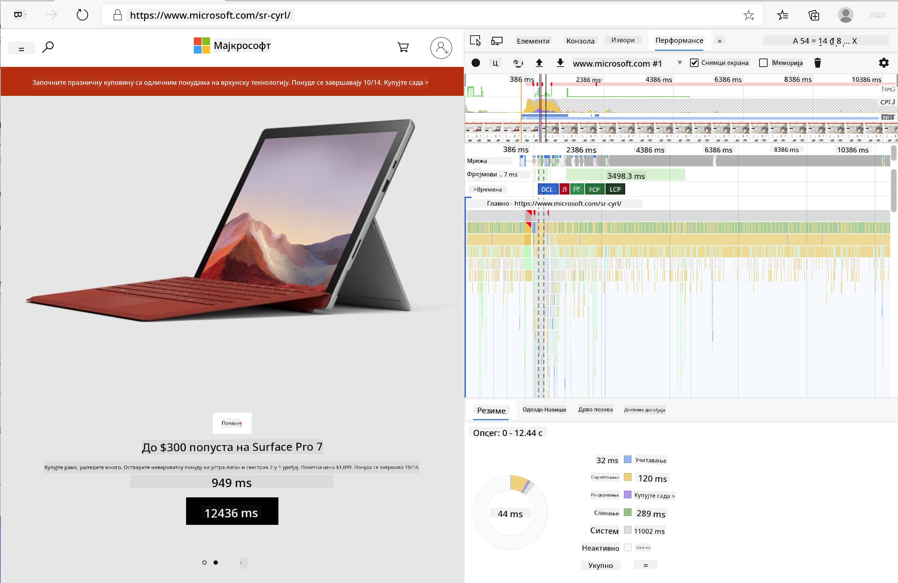
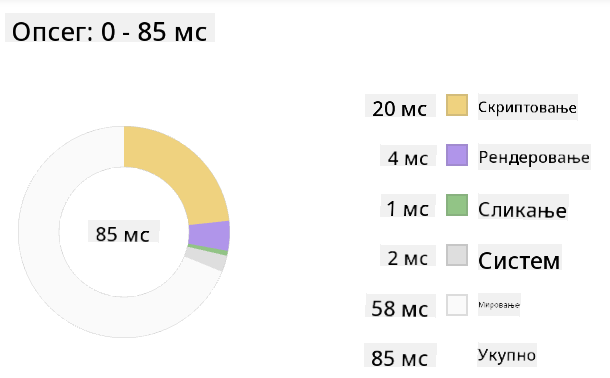
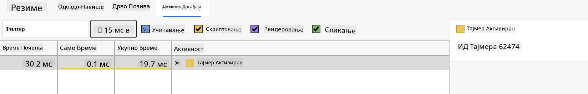

<!--
CO_OP_TRANSLATOR_METADATA:
{
  "original_hash": "f198c6b817b4b2a99749f4662e7cae98",
  "translation_date": "2025-08-28T10:10:20+00:00",
  "source_file": "5-browser-extension/3-background-tasks-and-performance/README.md",
  "language_code": "sr"
}
-->
# Пројекат проширења за претраживач, део 3: Сазнајте више о позадинским задацима и перформансама

## Квиз пре предавања

[Квиз пре предавања](https://ff-quizzes.netlify.app/web/quiz/27)

### Увод

У претходне две лекције овог модула, научили сте како да направите форму и простор за приказ података преузетих са API-ја. То је веома уобичајен начин креирања веб присуства на интернету. Чак сте научили како да асинхроно преузимате податке. Ваше проширење за претраживач је скоро завршено.

Остало је да управљате неким позадинским задацима, укључујући освежавање боје иконе проширења, па је ово одличан тренутак да разговарамо о томе како претраживач управља оваквим задацима. Размислимо о овим задацима претраживача у контексту перформанси ваших веб ресурса док их градите.

## Основе веб перформанси

> "Перформансе вебсајта се односе на две ствари: колико брзо се страница учитава и колико брзо код на њој ради." -- [Зак Гросбарт](https://www.smashingmagazine.com/2012/06/javascript-profiling-chrome-developer-tools/)

Тема како учинити ваше вебсајтове изузетно брзим на свим врстама уређаја, за све врсте корисника, у свим врстама ситуација, није изненађујуће обимна. Ево неких тачака које треба имати на уму док градите стандардни веб пројекат или проширење за претраживач.

Прва ствар коју треба да урадите да бисте осигурали да ваш сајт ради ефикасно је да прикупите податке о његовим перформансама. Прво место за то су алати за програмере у вашем веб претраживачу. У Edge-у, можете изабрати дугме "Подешавања и још" (икона три тачке у горњем десном углу претраживача), затим отићи на Више алата > Алатке за програмере и отворити картицу Перформансе. Такође можете користити пречице на тастатури `Ctrl` + `Shift` + `I` на Windows-у или `Option` + `Command` + `I` на Mac-у да отворите алатке за програмере.

Картица Перформансе садржи алат за профилисање. Отворите вебсајт (пробајте, на пример, [https://www.microsoft.com](https://www.microsoft.com/?WT.mc_id=academic-77807-sagibbon)) и кликните на дугме 'Сними', затим освежите сајт. Прекините снимање у било ком тренутку, и моћи ћете да видите рутине које се генеришу за 'скрипт', 'рендер' и 'цртање' сајта:



✅ Посетите [Microsoft документацију](https://docs.microsoft.com/microsoft-edge/devtools-guide/performance/?WT.mc_id=academic-77807-sagibbon) о панелу Перформансе у Edge-у

> Савет: да бисте добили тачно очитавање времена покретања вашег вебсајта, очистите кеш претраживача

Изаберите елементе временске линије профила да бисте зумирали догађаје који се дешавају док се ваша страница учитава.

Добијте снимак перформанси ваше странице тако што ћете изабрати део временске линије профила и погледати панел са резимеом:



Проверите панел са логом догађаја да видите да ли је неки догађај трајао дуже од 15 ms:



✅ Упознајте свој профилер! Отворите алатке за програмере на овом сајту и видите да ли постоје уска грла. Који је ресурс са најспоријим учитавањем? Најбржим?

## Провере профилисања

Уопштено, постоје неке "проблематичне области" које сваки веб програмер треба да прати приликом изградње сајта како би избегао непријатна изненађења када дође време за пуштање у продукцију.

**Величине ресурса**: Веб је постао 'тежи', а самим тим и спорији, током последњих неколико година. Део те тежине има везе са употребом слика.

✅ Прегледајте [Архиву интернета](https://httparchive.org/reports/page-weight) за историјски преглед тежине страница и више.

Добра пракса је да осигурате да су ваше слике оптимизоване и испоручене у одговарајућој величини и резолуцији за ваше кориснике.

**Пролази кроз DOM**: Претраживач мора да изгради свој Модел објеката документа (DOM) на основу кода који пишете, па је у интересу добрих перформанси странице да ваши тагови буду минимални, користећи и стилизујући само оно што страници треба. У том смислу, вишак CSS-а повезан са страницом могао би бити оптимизован; стилови који треба да се користе само на једној страници не морају бити укључени у главни стилски лист, на пример.

**JavaScript**: Сваки JavaScript програмер треба да пази на скрипте које блокирају рендеровање и које морају бити учитане пре него што остатак DOM-а може бити обрађен и приказан у претраживачу. Размислите о коришћењу `defer` са вашим уграђеним скриптама (као што је урађено у модулу Terrarium).

✅ Испробајте неке сајтове на [вебсајту за тестирање брзине сајта](https://www.webpagetest.org/) да бисте сазнали више о уобичајеним проверама које се раде за одређивање перформанси сајта.

Сада када имате идеју о томе како претраживач приказује ресурсе које му шаљете, погледајмо последње ствари које треба да урадите да бисте завршили своје проширење:

### Направите функцију за израчунавање боје

Радећи у `/src/index.js`, додајте функцију под називом `calculateColor()` након серије `const` променљивих које сте поставили да бисте добили приступ DOM-у:

```JavaScript
function calculateColor(value) {
	let co2Scale = [0, 150, 600, 750, 800];
	let colors = ['#2AA364', '#F5EB4D', '#9E4229', '#381D02', '#381D02'];

	let closestNum = co2Scale.sort((a, b) => {
		return Math.abs(a - value) - Math.abs(b - value);
	})[0];
	console.log(value + ' is closest to ' + closestNum);
	let num = (element) => element > closestNum;
	let scaleIndex = co2Scale.findIndex(num);

	let closestColor = colors[scaleIndex];
	console.log(scaleIndex, closestColor);

	chrome.runtime.sendMessage({ action: 'updateIcon', value: { color: closestColor } });
}
```

Шта се овде дешава? Прослеђујете вредност (интензитет угљеника) из API позива који сте завршили у претходној лекцији, а затим израчунавате колико је његова вредност близу индекса представљеног у низу боја. Затим шаљете ту најближу вредност боје преко chrome runtime-а.

Chrome.runtime има [API](https://developer.chrome.com/extensions/runtime) који обрађује све врсте позадинских задатака, а ваше проширење то користи:

> "Користите chrome.runtime API да бисте преузели позадинску страницу, вратили детаље о манифесту и слушали и одговарали на догађаје у животном циклусу апликације или проширења. Такође можете користити овај API да конвертујете релативну путању URL-ова у потпуно квалификоване URL-ове."

✅ Ако развијате ово проширење за Edge, можда ће вас изненадити што користите chrome API. Новије верзије Edge претраживача раде на Chromium претраживачком механизму, тако да можете користити ове алате.

> Напомена: ако желите да профилишете проширење за претраживач, покрените алатке за програмере из самог проширења, јер је оно свој засебан претраживачки инстанц.

### Поставите подразумевану боју иконе

Сада, у функцији `init()`, поставите икону да буде генеричка зелена на почетку тако што ћете поново позвати chrome-ову акцију `updateIcon`:

```JavaScript
chrome.runtime.sendMessage({
	action: 'updateIcon',
		value: {
			color: 'green',
		},
});
```

### Позовите функцију, извршите позив

Затим, позовите ту функцију коју сте управо креирали тако што ћете је додати у promise који враћа C02Signal API:

```JavaScript
//let CO2...
calculateColor(CO2);
```

И на крају, у `/dist/background.js`, додајте слушач за ове позадинске позиве акција:

```JavaScript
chrome.runtime.onMessage.addListener(function (msg, sender, sendResponse) {
	if (msg.action === 'updateIcon') {
		chrome.browserAction.setIcon({ imageData: drawIcon(msg.value) });
	}
});
//borrowed from energy lollipop extension, nice feature!
function drawIcon(value) {
	let canvas = document.createElement('canvas');
	let context = canvas.getContext('2d');

	context.beginPath();
	context.fillStyle = value.color;
	context.arc(100, 100, 50, 0, 2 * Math.PI);
	context.fill();

	return context.getImageData(50, 50, 100, 100);
}
```

У овом коду, додајете слушач за било које поруке које стижу до менаџера позадинских задатака. Ако се зове 'updateIcon', онда се следећи код извршава да би се нацртала икона одговарајуће боје користећи Canvas API.

✅ Више ћете научити о Canvas API-ју у [лекцијама о свемирској игри](../../6-space-game/2-drawing-to-canvas/README.md).

Сада, поново изградите своје проширење (`npm run build`), освежите и покрените своје проширење, и гледајте како се боја мења. Да ли је добро време за обављање неког посла или прање судова? Сада знате!

Честитамо, направили сте корисно проширење за претраживач и научили више о томе како претраживач ради и како профилисати његове перформансе.

---

## 🚀 Изазов

Истражите неке вебсајтове отвореног кода који постоје већ дуго времена, и, на основу њихове историје на GitHub-у, покушајте да утврдите како су оптимизовани током година за перформансе, ако уопште. Која је најчешћа проблематична тачка?

## Квиз после предавања

[Квиз после предавања](https://ff-quizzes.netlify.app/web/quiz/28)

## Преглед и самостално учење

Размислите о пријављивању на [билтен о перформансама](https://perf.email/)

Истражите неке од начина на које претраживачи процењују веб перформансе тако што ћете прегледати картице перформанси у њиховим веб алатима. Да ли налазите неке велике разлике?

## Задатак

[Анализирајте сајт за перформансе](assignment.md)

---

**Одрицање од одговорности**:  
Овај документ је преведен коришћењем услуге за превођење помоћу вештачке интелигенције [Co-op Translator](https://github.com/Azure/co-op-translator). Иако се трудимо да обезбедимо тачност, молимо вас да имате у виду да аутоматизовани преводи могу садржати грешке или нетачности. Оригинални документ на његовом изворном језику треба сматрати ауторитативним извором. За критичне информације препоручује се професионални превод од стране људи. Не преузимамо одговорност за било каква погрешна тумачења или неспоразуме који могу настати услед коришћења овог превода.