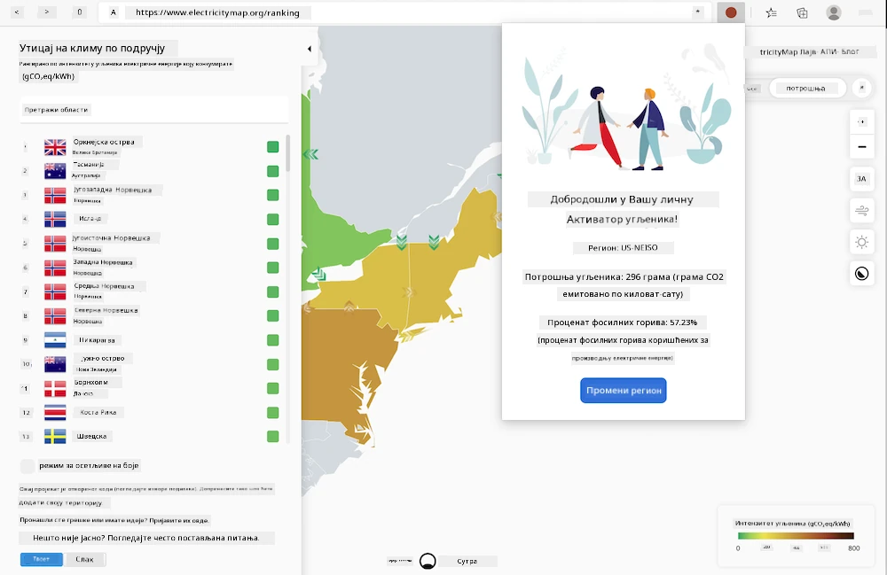

# Изградња екстензије за прегледач

Изградња екстензија за прегледаче је забаван и занимљив начин да размислите о перформансама ваших апликација док правите другачију врсту веб ресурса. Овај модул укључује лекције о томе како прегледачи функционишу, како да поставите екстензију за прегледач, како да направите форму, позовете API, користите локално складиште, као и како да процените перформансе вашег веб сајта и побољшате их.

Направићете екстензију за прегледач која ради на Edge, Chrome и Firefox прегледачима. Ова екстензија, која је попут мини веб сајта прилагођеног веома специфичном задатку, проверава [C02 Signal API](https://www.co2signal.com) за употребу електричне енергије и интензитет угљеника у одређеном региону, и враћа очитавање о угљеничком отиску тог региона.

Ову екстензију корисник може позвати ад хок након што унесе API кључ и код региона у форму, како би утврдио локалну употребу електричне енергије и тиме добио податке који могу утицати на његове одлуке о употреби електричне енергије. На пример, можда би било пожељно одложити сушење веша (активност са високим угљеничким интензитетом) током периода велике употребе електричне енергије у вашем региону.

### Теме

1. [О прегледачима](1-about-browsers/README.md)
2. [Форме и локално складиште](2-forms-browsers-local-storage/README.md)
3. [Позадински задаци и перформансе](3-background-tasks-and-performance/README.md)

### Захвалнице

## Захвалнице

Идеју за овај веб карбонски тригер понудио је Асим Хусеин, лидер у Microsoft-у за тим Green Cloud Advocacy и аутор [Green Principles](https://principles.green/). Првобитно је то био [пројекат веб сајта](https://github.com/jlooper/green).

Структура екстензије за прегледач била је инспирисана [Adebola Adeniran-овом COVID екстензијом](https://github.com/onedebos/covtension).

Концепт иза система 'тачка' иконе предложен је структуром иконе екстензије за прегледач [Energy Lollipop](https://energylollipop.com/) за емисије у Калифорнији.

Ове лекције су написане са ♥️ од стране [Jen Looper](https://www.twitter.com/jenlooper).

---

**Одрицање од одговорности**:  
Овај документ је преведен коришћењем услуге за превођење помоћу вештачке интелигенције [Co-op Translator](https://github.com/Azure/co-op-translator). Иако тежимо тачности, молимо вас да имате у виду да аутоматски преводи могу садржати грешке или нетачности. Оригинални документ на његовом изворном језику треба сматрати ауторитативним извором. За критичне информације препоручује се професионални превод од стране људи. Не преузимамо одговорност за било каква погрешна тумачења или неспоразуме који могу настати услед коришћења овог превода.