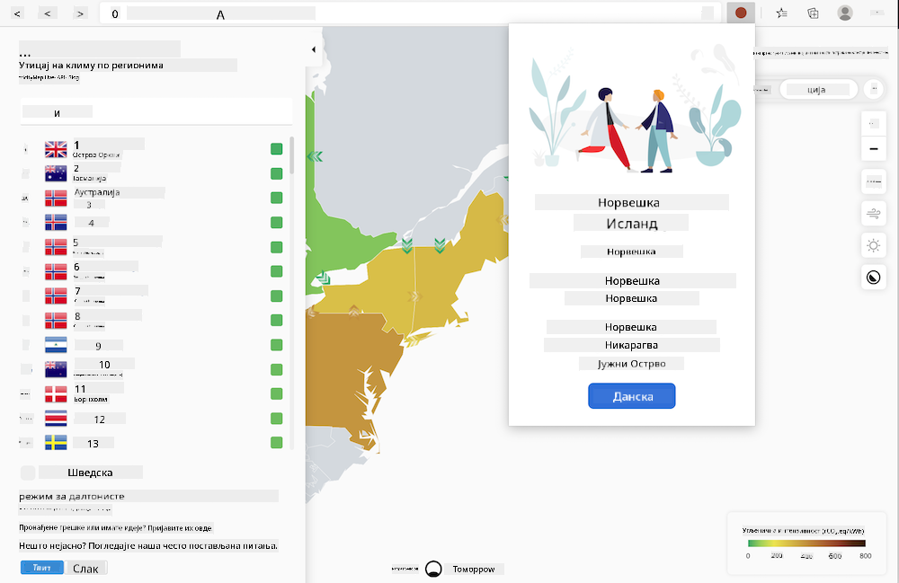

<!--
CO_OP_TRANSLATOR_METADATA:
{
  "original_hash": "9361268ca430b2579375009e1eceb5e5",
  "translation_date": "2025-08-28T10:12:44+00:00",
  "source_file": "5-browser-extension/solution/translation/README.fr.md",
  "language_code": "sr"
}
-->
# Екстензија за прегледач Carbon Trigger: Завршен код

Користећи API C02 Signal од tmrow за праћење потрошње електричне енергије, направите екстензију за прегледач како бисте могли директно у свом прегледачу добијати подсетнике о потрошњи електричне енергије у вашем региону. Коришћење ове екстензије ће вам помоћи да доносите одлуке о својим активностима на основу ових информација.



## Почетак

Потребно је да имате инсталиран [npm](https://npmjs.com). Преузмите копију овог кода у неки фолдер на вашем рачунару.

Инсталирајте све потребне пакете:

```
npm install
```

Направите екстензију помоћу webpack-а:

```
npm run build
```

Да бисте инсталирали на Edge, користите мени „три тачке“ у горњем десном углу прегледача да пронађете панел за екстензије. Одатле изаберите „Учитајте распаковану екстензију“ да бисте додали нову екстензију. На упиту отворите фолдер 'dist' и екстензија ће се учитати. Да бисте је користили, биће вам потребан API кључ за CO2 Signal API ([набавите га овде путем е-поште](https://www.co2signal.com/) - унесите своју е-пошту у поље на тој страници) и [код за ваш регион](http://api.electricitymap.org/v3/zones) који одговара [Мапи електричне енергије](https://www.electricitymap.org/map) (на пример, за Бостон користим 'US-NEISO').


Када унесете API кључ и регион у интерфејс екстензије, обојена тачка у траци екстензија вашег прегледача треба да се промени како би одразила потрошњу енергије у вашем региону и дала вам индикатор о активностима које троше енергију, а које би било прикладно обављати. Концепт иза овог система „тачака“ инспирисан је [екстензијом Energy Lollipop](https://energylollipop.com/) за емисије у Калифорнији.

---

**Одрицање од одговорности**:  
Овај документ је преведен коришћењем услуге за превођење помоћу вештачке интелигенције [Co-op Translator](https://github.com/Azure/co-op-translator). Иако настојимо да обезбедимо тачност, молимо вас да имате у виду да аутоматски преводи могу садржати грешке или нетачности. Оригинални документ на изворном језику треба сматрати ауторитативним извором. За критичне информације препоручује се професионални превод од стране људи. Не сносимо одговорност за било каква неспоразумевања или погрешна тумачења која могу произаћи из коришћења овог превода.