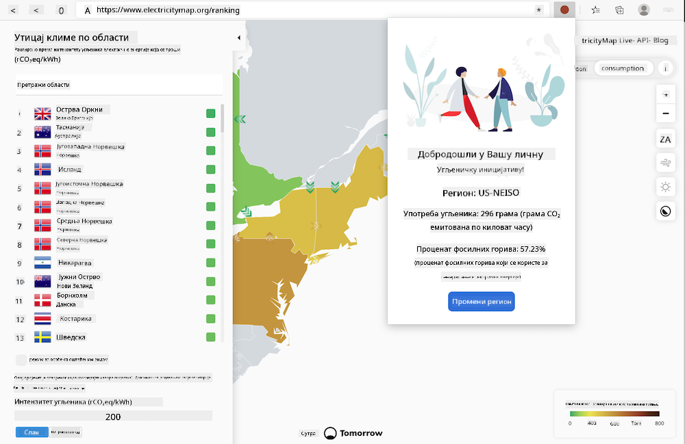

<!--
CO_OP_TRANSLATOR_METADATA:
{
  "original_hash": "9361268ca430b2579375009e1eceb5e5",
  "translation_date": "2025-08-27T22:53:21+00:00",
  "source_file": "5-browser-extension/solution/translation/README.fr.md",
  "language_code": "sr"
}
-->
# Екстензија за прегледач Carbon Trigger: Завршен Код

Користећи API C02 Signal од tmrow за праћење потрошње електричне енергије, направите екстензију за прегледач како бисте могли директно у вашем прегледачу добијати подсетнике о потрошњи електричне енергије у вашем региону. Коришћење ове екстензије ће вам помоћи да донесете одлуке о вашим активностима на основу ових информација.



## Почетак

Потребно је да имате инсталиран [npm](https://npmjs.com). Преузмите копију овог кода у фасциклу на вашем рачунару.

Инсталирајте све потребне пакете:

```
npm install
```

Изградите екстензију помоћу webpack-а:

```
npm run build
```

Да бисте инсталирали на Edge, користите мени са 'три тачке' у горњем десном углу прегледача да бисте пронашли панел за Екстензије. Одатле изаберите 'Учитај декомпресовану екстензију' да бисте учитали нову екстензију. Отворите фасциклу 'dist' када се то затражи, и екстензија ће се учитати. Да бисте је користили, биће вам потребан API кључ за CO2 Signal API ([набавите га овде путем е-поште](https://www.co2signal.com/) - унесите вашу е-пошту у поље на овој страници) и [код за ваш регион](http://api.electricitymap.org/v3/zones) који одговара [Мапи електричне енергије](https://www.electricitymap.org/map) (на пример, у Бостону користим 'US-NEISO').


Када унесете API кључ и регион у интерфејс екстензије, обојена тачка у траци екстензије прегледача треба да се промени како би одразила потрошњу енергије у вашем региону и дала вам индикатор о активностима које троше енергију, а које би било прикладно обављати. Концепт иза овог система 'тачака' инспирисан је [екстензијом Energy Lollipop](https://energylollipop.com/) за емисије у Калифорнији.

---

**Одрицање од одговорности**:  
Овај документ је преведен коришћењем услуге за превођење помоћу вештачке интелигенције [Co-op Translator](https://github.com/Azure/co-op-translator). Иако се трудимо да обезбедимо тачност, молимо вас да имате у виду да аутоматизовани преводи могу садржати грешке или нетачности. Оригинални документ на његовом изворном језику треба сматрати ауторитативним извором. За критичне информације препоручује се професионални превод од стране људског преводиоца. Не преузимамо одговорност за било каква погрешна тумачења или неспоразуме који могу произаћи из коришћења овог превода.