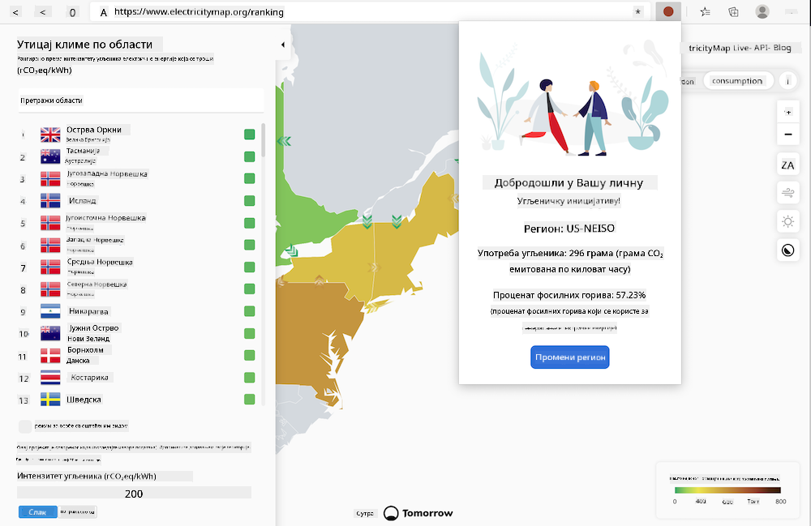
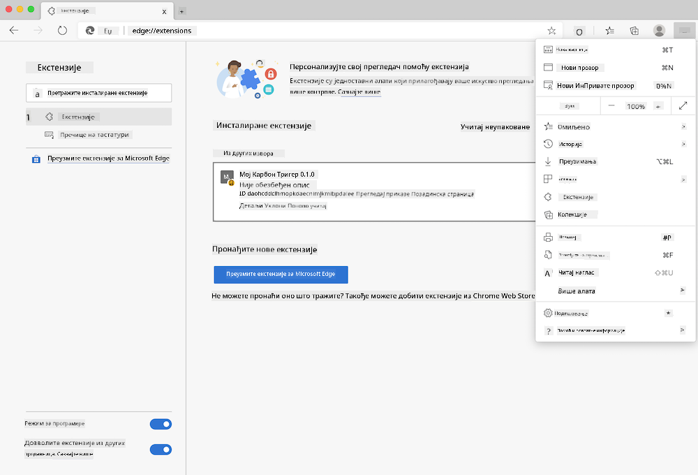

<!--
CO_OP_TRANSLATOR_METADATA:
{
  "original_hash": "3f5e6821e0febccfc5d05e7c944d9e3d",
  "translation_date": "2025-08-28T10:12:07+00:00",
  "source_file": "5-browser-extension/solution/translation/README.ja.md",
  "language_code": "sr"
}
-->
# Карбон Триггер: Екстензија за прегледач - Завршен код

Користећи C02 Signal API од tmrow, направићемо екстензију за прегледач која приказује подсетник о томе колико је велика потрошња електричне енергије у вашем региону. Ова екстензија ће вам омогућити да пратите потрошњу струје и доносите одлуке о својим активностима на основу тих информација.



## Увод

Потребно је да имате инсталиран [npm](https://npmjs.com). Преузмите копију овог кода у фасциклу на вашем рачунару.

Инсталирајте све потребне пакете.

```
npm install
```

Изградите екстензију користећи webpack.

```
npm run build
```

Да бисте инсталирали екстензију на Edge, пронађите панел „Екстензије“ у менију са „три тачке“ у горњем десном углу прегледача. Одатле изаберите „Load Unpacked“ и учитајте нову екстензију. Када се појави упит, отворите фасциклу „dist“, и екстензија ће бити учитана. Да бисте је користили, потребан вам је API кључ за CO2 Signal API ([набавите га овде путем е-поште](https://www.co2signal.com/) - унесите вашу е-пошту у поље на тој страници) и [код за ваш регион](http://api.electricitymap.org/v3/zones) који је компатибилан са [Electricity Map](https://www.electricitymap.org/map) (на пример, за Бостон користите 'US-NEISO').



Када унесете API кључ и регион у интерфејс екстензије, боја тачке која се приказује на траци екстензија у вашем прегледачу ће се променити. Ова тачка одражава потрошњу енергије у вашем региону и помаже вам да одлучите које активности су прикладне у том тренутку. Концепт овог „система тачке“ инспирисан је [Energy Lollipop екстензијом](https://energylollipop.com/) за праћење емисија у Калифорнији.

---

**Одрицање од одговорности**:  
Овај документ је преведен коришћењем услуге за превођење помоћу вештачке интелигенције [Co-op Translator](https://github.com/Azure/co-op-translator). Иако се трудимо да превод буде тачан, молимо вас да имате у виду да аутоматизовани преводи могу садржати грешке или нетачности. Оригинални документ на његовом изворном језику треба сматрати меродавним извором. За критичне информације препоручује се професионални превод од стране људског преводиоца. Не преузимамо одговорност за било каква погрешна тумачења или неспоразуме који могу настати услед коришћења овог превода.