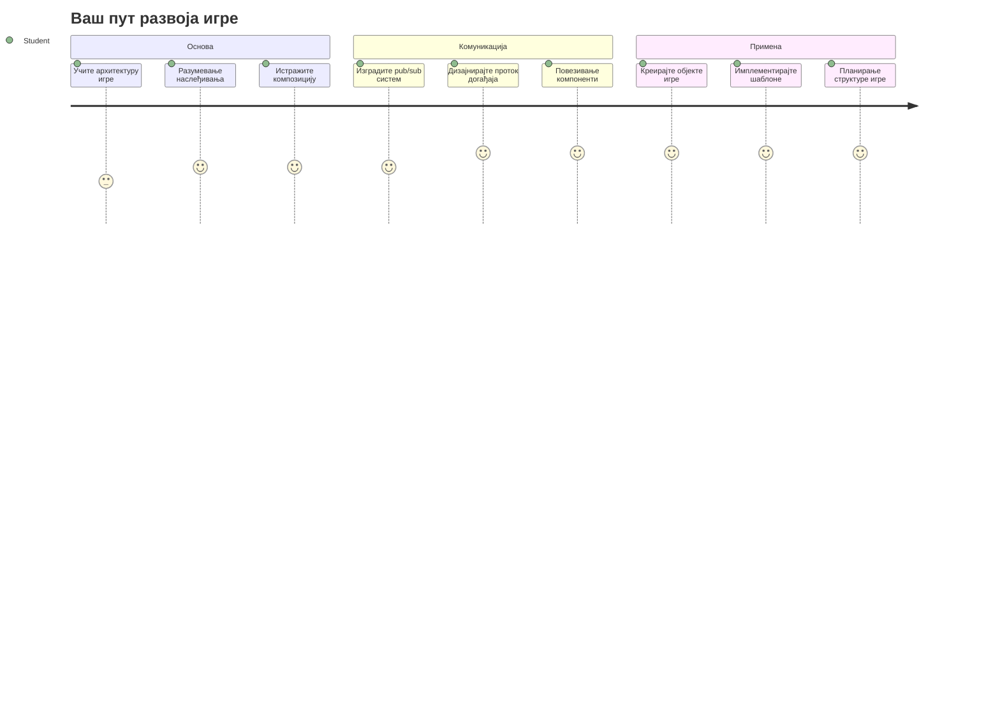
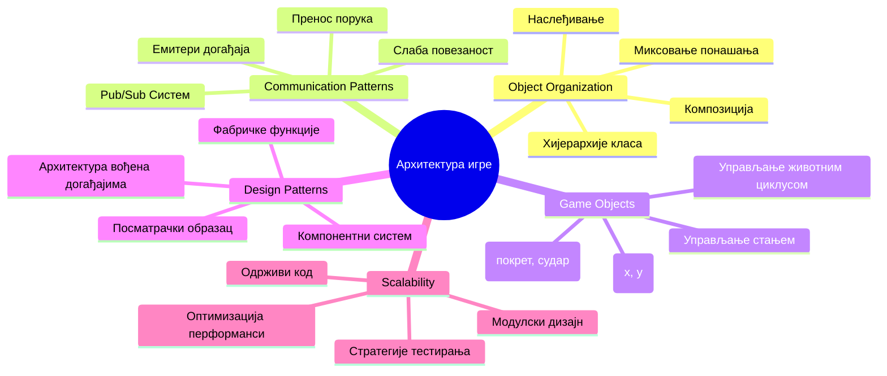
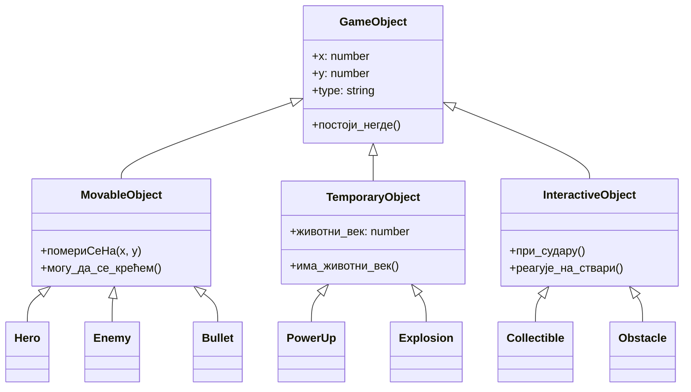
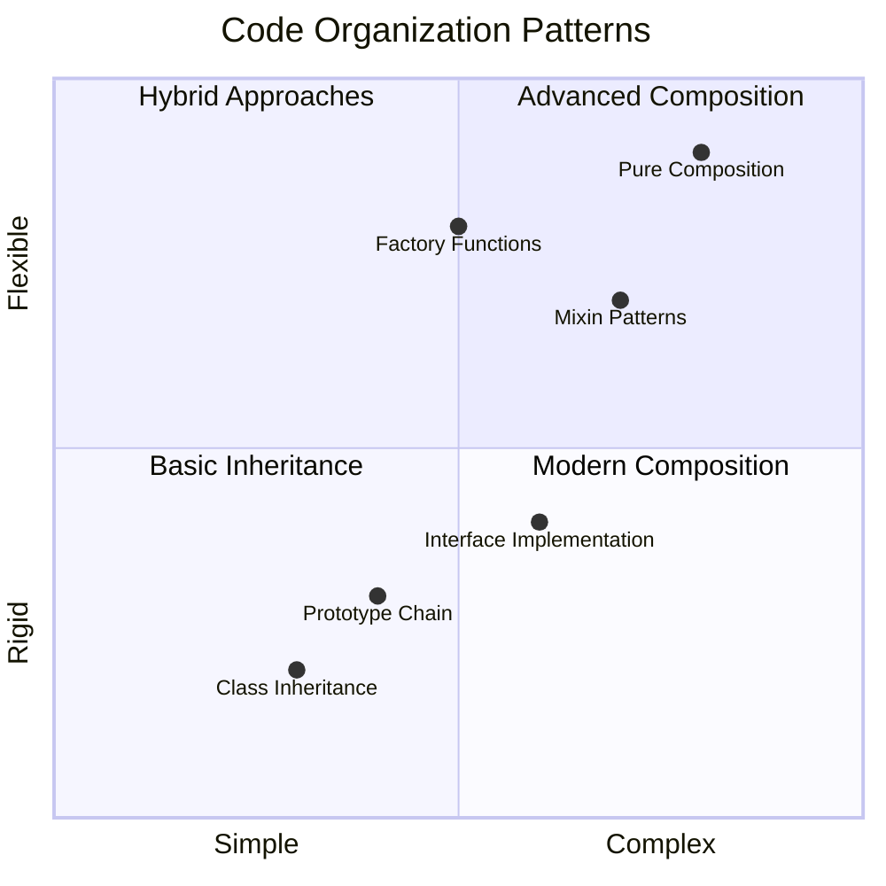
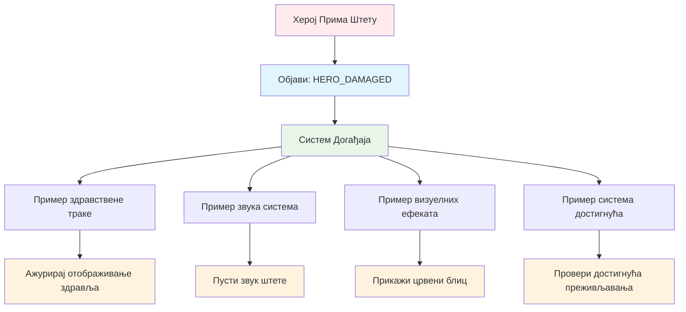
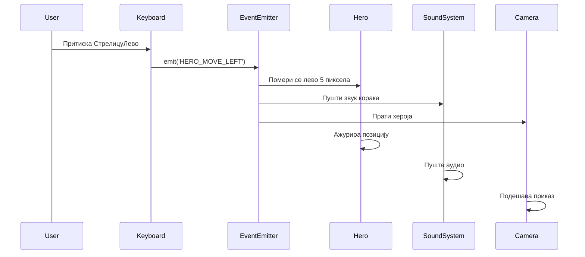
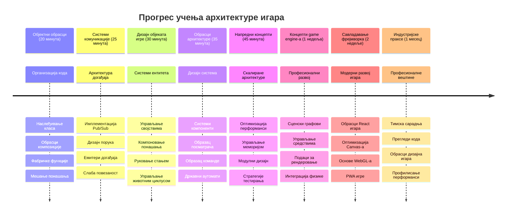

<!--
CO_OP_TRANSLATOR_METADATA:
{
  "original_hash": "a6332a7bb4d0be3bfd24199c83993777",
  "translation_date": "2026-01-07T07:59:59+00:00",
  "source_file": "6-space-game/1-introduction/README.md",
  "language_code": "sr"
}
-->
# Изградња свемирске игре део 1: Увод




Баш као што мисијска контрола NASA координише више система током лансирања у свемир, ми ћемо изградити свемирску игру која демонстрира како различити делови програма могу беспрекорно сарађивати. Уз прављење нечега што можете стварно играти, научићете основне концепте програмирања који се примењују на било који софтверски пројекат.

Истражићемо два основна приступа организовању кода: наслеђивање и композицију. Ово нису само академски концепти – то су исти обрасци који покрећу све од видео игара до банкарских система. Такође ћемо имплементирати комуникациони систем који се зове pub/sub и који ради као комуникационе мреже коришћене у свемирским летелицама, омогућавајући различитим компонентама да деле информације без стварања зависности.

До краја ове серије, разумећете како да градите апликације које могу да се проширују и развијају – без обзира да ли развијате игре, веб апликације или било који други софтверски систем.


## Квиз пре предавања

[Пре-предавачки квиз](https://ff-quizzes.netlify.app/web/quiz/29)

## Наслеђивање и композиција у развоју игара

Како пројекти расту у сложености, организација кода постаје кључна. Оно што почиње као једноставан скрипт може постати тешко одрживо без одговарајуће структуре – слично као што су мисије Аполо захтевале пажљиву координацију између хиљада компоненти.

Истражићемо два основна приступа за организовање кода: наслеђивање и композицију. Свако има посебне предности, а разумевање оба помаже да изаберете прави приступ за различите ситуације. Ове концепте ћемо демонстрирати кроз нашу свемирску игру, у којој хероји, непријатељи, појачивачи и други објекти морају ефикасно да међусобно делују.

✅ Једна од најпознатијих књига о програмирању икада написаних односи се на [дизајн обрасце](https://en.wikipedia.org/wiki/Design_Patterns).

У свакој игри имате `game objects` – интерактивне елементе који попуњавају ваш свет игре. Хероји, непријатељи, појачивачи и визуелни ефекти су сви game objects. Сваки постоји на одређеним координатама на екрану користећи `x` и `y` вредности, слично као кад се цртају тачке у координатном систему.

Иако су визуелно различити, ти објекти често деле основна понашања:

- **Постоје негде** – сваки објекат има x и y координате да игра зна где да га црта
- **Многи могу да се крећу** – хероји трче, непријатељи јуре, метци лећу преко екрана
- **Имају животни век** – неки трају вечно, други (као експлозије) се појављују кратко па нестану
- **Реагују на догађаје** – када се ствари сударе, појачивачи се сакупљају, траке здравља се ажурирају

✅ Размислите о игри као што је Pac-Man. Можете ли идентификовати четири типа објеката наведена горе у овој игри?


### Изражавање понашања кроз код

Сад кад разумете заједничка понашања game objects, хајде да истражимо како да их имплементирамо у JavaScript-у. Понашање објеката можете изразити кроз методе везане за класе или појединачне објекте, а постоји више приступа које можете изабрати.

**Приступ заснован на класама**

Класе и наслеђивање пружају структуиран приступ организовању game objects. Као што је Карл Линејев развио систем таксономске класификације, ви почињете базном класом која садржи заједничка својства, а затим правите специјализоване класе које наследјују те основе и додају специфичне способности.

✅ Наслеђивање је важан концепт који треба разумети. Сазнајте више у [MDN чланку о наслеђивању](https://developer.mozilla.org/docs/Web/JavaScript/Inheritance_and_the_prototype_chain).

Ево како можете имплементирати game objects користећи класе и наслеђивање:

```javascript
// Корак 1: Направите основну класу GameObject
class GameObject {
  constructor(x, y, type) {
    this.x = x;
    this.y = y;
    this.type = type;
  }
}
```

**Разложимо ово корак по корак:**
- Креирамо основни шаблон који сваки game object може користити
- Конструктор чува где се објекат налази (`x`, `y`) и о каквом се типу ради
- Ово постаје основа на којој ће сви ваши game objects бити изграђени

```javascript
// Корак 2: Додајте могућност кретања кроз наслеђивање
class Movable extends GameObject {
  constructor(x, y, type) {
    super(x, y, type); // Позовите конструктор родитеља
  }

  // Додајте могућност кретања на нову позицију
  moveTo(x, y) {
    this.x = x;
    this.y = y;
  }
}
```

**У горе наведеном смо:**
- **Проширили** класу GameObject да додамо функционалност кретања
- **Позвали** конструктор родитеља користећи `super()` да иницијализујемо наследјена својства
- **Додали** метод `moveTo()` који ажурира позицију објекта

```javascript
// Корак 3: Креирајте специфичне типове играћих објеката
class Hero extends Movable {
  constructor(x, y) {
    super(x, y, 'Hero'); // Аутоматски подесите тип
  }
}

class Tree extends GameObject {
  constructor(x, y) {
    super(x, y, 'Tree'); // Дрвеће не треба покрет
  }
}

// Корак 4: Користите своје играће објекте
const hero = new Hero(0, 0);
hero.moveTo(5, 5); // Херој може да се креће!

const tree = new Tree(10, 15);
// tree.moveTo() би изазвало грешку - дрвеће не може да се креће
```

**Разумевање ових концепата:**
- **Креира** специјализоване типове објеката који наследјују одговарајућа понашања
- **Демонстрира** како наслеђивање омогућава селективно укључивање функција
- **Показује** да хероји могу да се крећу док дрвеће остаје на месту
- **Илуструје** како хијерархија класа спречава неадекватне радње

✅ Узмите неколико минута да поново замислите хероја из Pac-Man-а (нпр. Inky, Pinky или Blinky) и како би био написан у JavaScript-у.

**Приступ композиције**

Композиција следи филозофију модуларног дизајна, слично као што инжењери дизајнирају свемирске летелице са заменљивим компонентама. Уместо да наслеђујете од родитељске класе, комбинујете специфична понашања да бисте направили објекте са тачно потребном функционалношћу. Овај приступ нуди флексибилност без крутих хијерархијских ограничења.

```javascript
// Корак 1: Креирајте основне објекте понашања
const gameObject = {
  x: 0,
  y: 0,
  type: ''
};

const movable = {
  moveTo(x, y) {
    this.x = x;
    this.y = y;
  }
};
```

**Ово је шта овај код ради:**
- **Дефинише** основни `gameObject` са својствима позиције и типа
- **Креира** одвојени објекат понашања `movable` са функционалношћу кретања
- **Раздваја** бриге држећи податке о позицији и логику кретања независним

```javascript
// Корак 2: Саставите објекте комбинујући понашања
const movableObject = { ...gameObject, ...movable };

// Корак 3: Креирајте фабричке функције за различите типове објеката
function createHero(x, y) {
  return {
    ...movableObject,
    x,
    y,
    type: 'Hero'
  };
}

function createStatic(x, y, type) {
  return {
    ...gameObject,
    x,
    y,
    type
  };
}
```

**У горе наведеном смо:**
- **Комбиновали** основна својства објекта и понашање кретања користећи spread синтаксу
- **Креирали** фабричке функције које враћају прилагођене објекте
- **Омогућили** флексибилну изградњу објеката без крутих хијерархија класа
- **Дозволили** објектима да имају баш она понашања која су им потребна

```javascript
// Корак 4: Креирајте и користите ваше састављене објекте
const hero = createHero(10, 10);
hero.moveTo(5, 5); // Ради савршено!

const tree = createStatic(0, 0, 'Tree');
// tree.moveTo() није дефинисан - није састављено понашање кретања
```

**Кључне појединости за памћење:**
- **Компоновање** објеката мешањем понашања уместо њиховог наслеђивања
- **Пружа** више флексибилности него круте наслеђиване хијерархије
- **Дозвољава** објектима да имају управо оне карактеристике које су им потребне
- **Користи** модерни JavaScript spread синтакс за чисту комбинацију објеката 

```

**Which Pattern Should You Choose?**

**Which Pattern Should You Choose?**



> 💡 **Корисни савет**: Оба шаблона имају своје место у савременом JavaScript развоју. Класе добро функционишу за јасно дефинисане хијерархије, док композиција сјаји када вам је потребна максимална флексибилност.
> 
**Када користити који приступ:**
- **Изаберите** наслеђивање када постоје јасни односи "је-један" (попут да је Херој *је* покретни објекат)
- **Изаберите** композицију када вам требају односи "има-један" (попут да Херој *има* способност кретања)
- **Узмите у обзир** преференције вашег тима и захтеве пројекта
- **Запамтите** да можете мешати оба приступа у истој апликацији

### 🔄 **Педагошки преглед**
**Разумевање организације објеката**: Пре него што пређете на комуникационе обрасце, уверите се да можете:
- ✅ Објаснити разлику између наслеђивања и композиције
- ✅ Идентификовати када користити класе, а када фабричке функције
- ✅ Разумети како `super()` кључна реч ради у наслеђивању
- ✅ Препознати предности сваког приступа у развоју игара

**Брзи само-тест**: Како бисте направили Летећег Непријатеља који може и да се креће и да лети?
- **Приступ наслеђивања**: `class FlyingEnemy extends Movable`
- **Приступ композиције**: `{ ...movable, ...flyable, ...gameObject }`

**Веза са стварним светом**: Ови обрасци се појављују свуда:
- **React компоненете**: Props (композиција) против наслеђивања класа
- **Играчки мотори**: Entity-component системи користе композицију
- **Мобилне апликације**: UI фрејмворкови често користе наслеђивања

## Комуникациони обрасци: Pub/Sub систем

Како апликације постају сложеније, управљање комуникацијом између компоненти постаје изазовно. Образац објави-претплати се (pub/sub) решава овај проблем користећи принципе сличне радиодифузији – један предајник може достићи више прималаца без знања ко све слуша.

Размислите шта се дешава када херој претрпи штету: трака здравља се ажурира, звукови се пуштају, визуелна повратна информација се приказује. Уместо да се објекат хероја директно повезује са овим системима, pub/sub омогућава хероју да емитује поруку „претрпела штету“. Сваки систем који треба да одговори може да се претплати на ову врсту поруке и реагује у складу са тим.

✅ **Pub/Sub** значи 'publish-subscribe' (објави-претплати)


### Разумевање Pub/Sub архитектуре

Образац pub/sub одржава делове ваше апликације лабаво повезаним, што значи да могу да раде заједно без директне зависности један од другог. Ово одвајање чини ваш код лакшим за одржавање, тестирање и флексибилним према променама.

**Главни актери у pub/sub:**
- **Поруке** – Једноставне текстуалне ознаке као што су `'PLAYER_SCORED'` које описују шта се десило (плус додатне информације)
- **Објављивачи** – Објекти који вичу „Нешто се десило!“ свима који слушају
- **Претплатници** – Објекти који кажу „Бризим о том догађају“ и реагују када се деси
- **Систем догађаја** – посредник који брине да поруке стигну правим слушаоцима

### Изградња система догађаја

Хајде да направимо једноставан али јак систем догађаја који демонстрира ове концепте:

```javascript
// Корак 1: Креирајте класу EventEmitter
class EventEmitter {
  constructor() {
    this.listeners = {}; // Сачувајте све слушаоце догађаја
  }
  
  // Региструјте слушаоца за одређени тип поруке
  on(message, listener) {
    if (!this.listeners[message]) {
      this.listeners[message] = [];
    }
    this.listeners[message].push(listener);
  }
  
  // Пошаљите поруку свим регистрованим слушаоцима
  emit(message, payload = null) {
    if (this.listeners[message]) {
      this.listeners[message].forEach(listener => {
        listener(message, payload);
      });
    }
  }
}
```

**Разлагање шта се овде дешава:**
- **Прави** централни систем за управљање догађајима користећи једноставну класу
- **Чува** слушаоце у објекту организованом по врсти поруке
- **Региструје** нове слушаоце користећи методу `on()`
- **Емитује** поруке свим заинтересованим слушаоцима користећи `emit()`
- **Подржава** опционе податке за преношење релевантних информација

### Све спојити: Практичан пример

Хајде да видимо овај систем у акцији! Направићемо једноставан систем кретања који показује колико pub/sub може бити чист и флексибилан:

```javascript
// Корак 1: Дефинишите ваше типове порука
const Messages = {
  HERO_MOVE_LEFT: 'HERO_MOVE_LEFT',
  HERO_MOVE_RIGHT: 'HERO_MOVE_RIGHT',
  ENEMY_SPOTTED: 'ENEMY_SPOTTED'
};

// Корак 2: Креирајте ваш систем догађаја и објекте игре
const eventEmitter = new EventEmitter();
const hero = createHero(0, 0);
```

**Ово је шта овај код ради:**
- **Дефинише** објекат константи да спречи грешке у именима порука
- **Креира** инстанцу emitera догађаја за управљање целокупном комуникацијом
- **Иницијализује** хероја на почетној позицији

```javascript
// Корак 3: Подесите слушаоце догађаја (претплатнике)
eventEmitter.on(Messages.HERO_MOVE_LEFT, () => {
  hero.moveTo(hero.x - 5, hero.y);
  console.log(`Hero moved to position: ${hero.x}, ${hero.y}`);
});

eventEmitter.on(Messages.HERO_MOVE_RIGHT, () => {
  hero.moveTo(hero.x + 5, hero.y);
  console.log(`Hero moved to position: ${hero.x}, ${hero.y}`);
});
```

**У горе наведеном смо:**
- **Регистровали** слушаоце догађаја који реагују на поруке кретања
- **Ажурирали** позицију хероја на основу правца кретања
- **Додали** конзол логовање за праћење промена позиције хероја
- **Раздвојили** логику кретања од управљања улазом

```javascript
// Корак 4: Повежите унос са тастатуре са догађајима (издаваоцима)
window.addEventListener('keydown', (event) => {
  switch(event.key) {
    case 'ArrowLeft':
      eventEmitter.emit(Messages.HERO_MOVE_LEFT);
      break;
    case 'ArrowRight':
      eventEmitter.emit(Messages.HERO_MOVE_RIGHT);
      break;
  }
});
```

**Разумевање ових концепата:**
- **Повезује** унос са тастатуре и догађаје игре без јаке повезаности
- **Омогућава** систему уноса да комуницира са игровним објектима индиректно
- **Дозвољава** више система да реагују на исте улазне догађаје
- **Олакшава** промену тастатурских командa или додавање нових метода уноса


> 💡 **Корисни савет**: Лепота овог обрасца је у флексибилности! Лако можете додати звучне ефекте, тресење екрана или ефекте честица једноставним додавањем више слушалаца догађаја – без потребе да мењате постојећи код за тастатуру или кретање.
> 
**Зашто ћете волети овај приступ:**
- Додавање нових функција постаје супер једноставно – само се претплатите на догађаје који вас интересују
- Више ствари може реактивно да одговара на исти догађај без мешања
- Тестирање постаје много лакше јер сваки део ради независно
- Када нешто поквари, тачно знате где да тражите

### Зашто Pub/Sub добро функционише при скалирању

Образац pub/sub одржава једноставност како апликације расту у сложености. Без обзира да ли управљате десетинама непријатеља, динамичким ажурирањима UI или звучним системима, образац се прилагођава повећању обима без потребе за архитектонским променама. Нове функције се интегришу у постојећи систем догађаја без утицаја на већ успостављену функционалност.

> ⚠️ **Честа грешка**: Немојте рано правити превише специфичних врста порука. Почните са широким категоријама и прецизирајте како ваше потребе постану јасније.
> 
**Најбоље праксе које треба пратити:**
- **Групишите** повезане поруке у логичке категорије
- **Користите** описне називе који јасно говоре шта се десило
- **Одржавајте** свој терет поруке једноставним и фокусираним
- **Документујте** типове порука за тимски рад

### 🔄 **Педагошки преглед**
**Разумевање архитектуре вођене догађајима**: Потврдите своје разумевање целокупног система:
- ✅ Како образац pub/sub спречава јаку повезаност између компоненти?
- ✅ Зашто је лакше додавати нове функције са архитектуром вођеном догађајима?
- ✅ Коју улогу EventEmitter има у комуникационом току?
- ✅ Како константе порука спречавају грешке и побољшавају одрживост?

**Дизајнерски изазов**: Како бисте решили ове сценарије у игри помоћу pub/sub?
1. **Непријатељ умире**: Ажурирај резултат, пусти звук, појави појачивач, уклони са екрана
2. **Ниво завршен**: Утами музику, прикажи UI, сачувај напредак, учитај следећи ниво
3. **Појачивач сакупљен**: Повећа способности, ажурира UI, пусти ефекат, покренути тајмер

**Професионална веза**: Овај образац се појављује у:
- **Frontend фрејмворцима**: React/Vue системи догађаја
- **Backend сервисима**: Микросервисна комуникација
- **Играчким моторима**: Unity систем догађаја
- **Мобилном развоју**: iOS/Android системи за обавештења

---

## GitHub Copilot Agent изазов 🚀

Користите Agent режим да решите следећи изазов:

**Опис:** Креирајте једноставан систем game objects користећи и наслеђивање и pub/sub образац. Имплементираћете базичну игру у којој различити објекти могу комуницирати путем догађаја без директног познавања једни других.

**Задатак:** Креирајте JavaScript систем игре са следећим захтевима: 1) Направите основну класу GameObject са x, y координатама и својством типа. 2) Направите класу Hero која наслеђује GameObject и може да се креће. 3) Направите класу Enemy која наслеђује GameObject и може да гони хероја. 4) Имплементирајте класу EventEmitter за pub/sub образац. 5) Подесите слушаоце догађаја тако да када херој помери позицију, близу непријатељи приме догађај 'HERO_MOVED' и ажурирају своју позицију да се померају према хероју. Укључите console.log изјаве да прикажете комуникацију између објеката.

Сазнајте више о [agent режиму](https://code.visualstudio.com/blogs/2025/02/24/introducing-copilot-agent-mode) овде.

## 🚀 Изазов
Размислите како патерн јавно-претплатник (pub-sub) може да унапреди архитектуру игре. Идентификујте који би компоненти требало да емитују догађаје и како систем треба да реагује. Дизајнирајте концепт игре и мапирајте комуникационе обрасце између њених компонената.

## Квиз након предавања

[Квиз након предавања](https://ff-quizzes.netlify.app/web/quiz/30)

## Ревизија и самостудија

Сазнајте више о Pub/Sub тако што ћете [прочитати о томе](https://docs.microsoft.com/azure/architecture/patterns/publisher-subscriber/?WT.mc_id=academic-77807-sagibbon).

### ⚡ **Шта можете урадити у наредних 5 минута**
- [ ] Отворите било коју HTML5 игру онлајн и анализирајте њен код користећи DevTools
- [ ] Креирајте једноставан HTML5 Canvas елемент и нацртајте основни облик
- [ ] Искористите `setInterval` за креирање једноставне анимационе петље
- [ ] Истражите Canvas API документацију и испробајте неку методу цртања

### 🎯 **Шта можете постићи у овом сату**
- [ ] Завршите квиз након часa и разумите концепте развоја игара
- [ ] Подесите структуру вашег пројекта игре са HTML, CSS и JavaScript фајловима
- [ ] Креирајте основну игру петљу која се континуирано ажурира и приказује
- [ ] Нацртајте своје прве игре спрајтове на canvas-у
- [ ] Имплементирајте основно учитавање ресурса за слике и звукове

### 📅 **Ваш недељни пројекат израде игре**
- [ ] Завршите потпуну свемирску игру са свим планираним функцијама
- [ ] Додајте уређене графике, звучне ефекте и глатке анимације
- [ ] Имплементирајте стања игре (почетни екран, играње, крај игре)
- [ ] Креирајте систем бодовања и праћење напретка играча
- [ ] Учините игру прилагодљивом и доступном на различитим уређајима
- [ ] Објавите игру онлајн и прикупите повратне информације од играча

### 🌟 **Ваш месечни развој игре**
- [ ] Израдите више игара истражујући различите жанрове и механике
- [ ] Учите оквир за развој игара као што су Phaser или Three.js
- [ ] Доприносите пројектима отвореног кода за развој игара
- [ ] Усвојите напредне обрасце програмирања игара и оптимизације
- [ ] Креирајте портфолио који показује ваше вештине у развоју игара
- [ ] Менторишите друге заинтересоване за развој игара и интерактивних медија

## 🎯 Ваша временска линија савладавања развоја игре


### 🛠️ Сажетак вашег алата за архитектуру игре

Након завршетка ове лекције, сада поседујете:
- **Мастерство дизајн патерна**: Разумевање предности и недостатака наследства и композиције
- **Архитектура вођена догађајима**: Имплементација pub/sub за скалабилну комуникацију
- **Објектно-оријентисани дизајн**: Хијерархије класа и композиција понашања
- **Модерни JavaScript**: Фабричке функције, spread синтакса и ES6+ обрасци
- **Скалабилна архитектура**: Принципи лабаве повезаности и модуларног дизајна
- **Фундација развоја игара**: Системи ентитета и обрасци компоненти
- **Професионални обрасци**: Приступи индустријског стандарда у организацији кода

**Примена у стварном свету**: Ови обрасци су директно применљиви на:
- **Frontend оквире**: React/Vue архитектуру компоненти и управљање статусом
- **Backend сервисе**: Комуникацију микросервиса и системе вођене догађајима
- **Мобилни развој**: Архитектуру апликација за iOS/Android и системе нотификација
- **Игре енджине**: Unity, Unreal и web-базирани развој игара
- **Предузетнички софтвер**: Извор догађаја и дистрибуирани системски дизајн
- **Дизајн API-ја**: RESTful услуге и реално-временску комуникацију

**Професионалне вештине које сте стекли**: Сада можете:
- **Дизајнирати** скалабилне софтверске архитектуре користећи проверене обрасце
- **Имплементирати** системе вођене догађајима који руковају комплексним интеракцијама
- **Одабрати** адекватне стратегије организације кода за различите сценарије
- **Отстрањивати грешке** и одржавати лабаво повезане системе ефикасно
- **Комуницирати** техничке одлуке коришћењем терминологије индустријског стандарда

**Следећи ниво**: Спремни сте да примените ове обрасце у стварној игри, истражите напредне теме развоја игара или примените ове архитектонске концепте у веб апликацијама!

🌟 **Остварени успех**: Освојили сте основне архитектонске обрасце софтвера који покрећу све од једноставних игара до сложених предузетничких система!

## Задатак

[Израдите модел игре](assignment.md)

---

<!-- CO-OP TRANSLATOR DISCLAIMER START -->
**Изјава о одрицању одговорности**:
Овај документ је преведен помоћу АИ сервиса за превођење [Co-op Translator](https://github.com/Azure/co-op-translator). Иако тежимо прецизности, имајте у виду да аутоматизовани преводи могу садржати грешке или нетачности. Оригинални документ на његовом изворном језику треба сматрати ауторитетом. За критичне информације препоручује се професионални људски превод. Нисмо одговорни за било какве неспоразуме или погрешне тумачења настале употребом овог превода.
<!-- CO-OP TRANSLATOR DISCLAIMER END -->