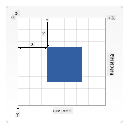

<!--
CO_OP_TRANSLATOR_METADATA:
{
  "original_hash": "41be8d35e7f30aa9dad10773c35e89c4",
  "translation_date": "2025-08-27T22:20:17+00:00",
  "source_file": "6-space-game/2-drawing-to-canvas/README.md",
  "language_code": "sr"
}
-->
# Направите свемирску игру, део 2: Цртање хероја и чудовишта на платну

## Квиз пре предавања

[Квиз пре предавања](https://ashy-river-0debb7803.1.azurestaticapps.net/quiz/31)

## Платно

Платно је HTML елемент који по подразумеваном подешавању нема садржај; то је празна површина. Морате га попунити цртањем.

✅ Прочитајте [више о Canvas API-ју](https://developer.mozilla.org/docs/Web/API/Canvas_API) на MDN.

Ево како се обично декларише, као део тела странице:

```html
<canvas id="myCanvas" width="200" height="100"></canvas>
```

Горе постављамо `id`, `width` и `height`.

- `id`: поставите ово да бисте добили референцу када треба да комуницирате са њим.
- `width`: ово је ширина елемента.
- `height`: ово је висина елемента.

## Цртање једноставне геометрије

Платно користи картезијански координатни систем за цртање. Због тога користи x-осу и y-осу да изрази где се нешто налази. Локација `0,0` је горњи леви угао, а доњи десни угао је оно што сте поставили као ШИРИНУ и ВИСИНУ платна.

  
> Слика са [MDN](https://developer.mozilla.org/docs/Web/API/Canvas_API/Tutorial/Drawing_shapes)

Да бисте цртали на елементу платна, потребно је да прођете кроз следеће кораке:

1. **Добијте референцу** на елемент платна.
1. **Добијте референцу** на контекст елемента који се налази на платну.
1. **Извршите операцију цртања** користећи контекст елемента.

Код за горе наведене кораке обично изгледа овако:

```javascript
// draws a red rectangle
//1. get the canvas reference
canvas = document.getElementById("myCanvas");

//2. set the context to 2D to draw basic shapes
ctx = canvas.getContext("2d");

//3. fill it with the color red
ctx.fillStyle = 'red';

//4. and draw a rectangle with these parameters, setting location and size
ctx.fillRect(0,0, 200, 200) // x,y,width, height
```

✅ Canvas API се углавном фокусира на 2D облике, али можете цртати и 3D елементе на веб страници; за то можете користити [WebGL API](https://developer.mozilla.org/docs/Web/API/WebGL_API).

Можете цртати разне ствари помоћу Canvas API-ја, као што су:

- **Геометријски облици**, већ смо показали како се црта правоугаоник, али постоји много више што можете да нацртате.
- **Текст**, можете нацртати текст са било којим фонтом и бојом коју желите.
- **Слике**, можете нацртати слику на основу сликовног ресурса, као што је .jpg или .png, на пример.

✅ Пробајте! Знате како да нацртате правоугаоник, можете ли нацртати круг на страници? Погледајте неке занимљиве цртеже на платну на CodePen-у. Ево [посебно импресивног примера](https://codepen.io/dissimulate/pen/KrAwx).

## Учитавање и цртање сликовног ресурса

Сликовни ресурс учитавате креирањем `Image` објекта и постављањем његовог `src` својства. Затим слушате `load` догађај да бисте знали када је спреман за употребу. Код изгледа овако:

### Учитавање ресурса

```javascript
const img = new Image();
img.src = 'path/to/my/image.png';
img.onload = () => {
  // image loaded and ready to be used
}
```

### Шаблон за учитавање ресурса

Препоручује се да горе наведено обмотате у конструкцију попут ове, како би било лакше за употребу и да бисте манипулисали њиме само када је потпуно учитан:

```javascript
function loadAsset(path) {
  return new Promise((resolve) => {
    const img = new Image();
    img.src = path;
    img.onload = () => {
      // image loaded and ready to be used
      resolve(img);
    }
  })
}

// use like so

async function run() {
  const heroImg = await loadAsset('hero.png')
  const monsterImg = await loadAsset('monster.png')
}

```

Да бисте нацртали ресурсе игре на екрану, ваш код би изгледао овако:

```javascript
async function run() {
  const heroImg = await loadAsset('hero.png')
  const monsterImg = await loadAsset('monster.png')

  canvas = document.getElementById("myCanvas");
  ctx = canvas.getContext("2d");
  ctx.drawImage(heroImg, canvas.width/2,canvas.height/2);
  ctx.drawImage(monsterImg, 0,0);
}
```

## Сада је време да почнете да правите своју игру

### Шта направити

Направићете веб страницу са Canvas елементом. Требало би да приказује црни екран `1024*768`. Обезбедили смо вам две слике:

- Херојски брод

   

- 5*5 чудовишта

   

### Препоручени кораци за почетак развоја

Пронађите датотеке које су креиране за вас у подфолдеру `your-work`. Требало би да садржи следеће:

```bash
-| assets
  -| enemyShip.png
  -| player.png
-| index.html
-| app.js
-| package.json
```

Отворите копију овог фолдера у Visual Studio Code-у. Потребно је да имате подешено локално развојно окружење, пожељно са Visual Studio Code-ом, NPM-ом и Node-ом инсталираним. Ако немате подешен `npm` на вашем рачунару, [овде је објашњено како то да урадите](https://www.npmjs.com/get-npm).

Започните свој пројекат тако што ћете отићи у фолдер `your_work`:

```bash
cd your-work
npm start
```

Горе наведено ће покренути HTTP сервер на адреси `http://localhost:5000`. Отворите прегледач и унесите ту адресу. То је тренутно празна страница, али то ће се променити.

> Напомена: да бисте видели промене на екрану, освежите прегледач.

### Додајте код

Додајте потребан код у `your-work/app.js` да решите следеће:

1. **Нацртајте** платно са црном позадином  
   > савет: додајте две линије испод одговарајућег TODO-а у `/app.js`, постављајући `ctx` елемент да буде црн, а горње/леве координате на 0,0, док висина и ширина треба да буду једнаке платну.
2. **Учитајте** текстуре  
   > савет: додајте слике играча и непријатеља користећи `await loadTexture` и прослеђујући путању до слике. Још увек их нећете видети на екрану!
3. **Нацртајте** хероја у центру екрана у доњој половини  
   > савет: користите `drawImage` API да нацртате heroImg на екрану, постављајући `canvas.width / 2 - 45` и `canvas.height - canvas.height / 4)`.
4. **Нацртајте** 5*5 чудовишта  
   > савет: сада можете да откоментирате код за цртање непријатеља на екрану. Затим идите у функцију `createEnemies` и изградите је.

   Прво, поставите неке константе:

    ```javascript
    const MONSTER_TOTAL = 5;
    const MONSTER_WIDTH = MONSTER_TOTAL * 98;
    const START_X = (canvas.width - MONSTER_WIDTH) / 2;
    const STOP_X = START_X + MONSTER_WIDTH;
    ```

    затим, направите петљу за цртање низа чудовишта на екрану:

    ```javascript
    for (let x = START_X; x < STOP_X; x += 98) {
        for (let y = 0; y < 50 * 5; y += 50) {
          ctx.drawImage(enemyImg, x, y);
        }
      }
    ```

## Резултат

Завршени резултат би требало да изгледа овако:


## Решење

Молимо вас да прво сами покушате да решите, али ако се заглавите, погледајте [решење](../../../../6-space-game/2-drawing-to-canvas/solution/app.js).

---

## 🚀 Изазов

Научили сте о цртању помоћу Canvas API-ја фокусираног на 2D; погледајте [WebGL API](https://developer.mozilla.org/docs/Web/API/WebGL_API) и покушајте да нацртате 3D објекат.

## Квиз после предавања

[Квиз после предавања](https://ashy-river-0debb7803.1.azurestaticapps.net/quiz/32)

## Преглед и самостално учење

Сазнајте више о Canvas API-ју [читајући о њему](https://developer.mozilla.org/docs/Web/API/Canvas_API).

## Задатак

[Играјте се са Canvas API-јем](assignment.md)

---

**Одрицање од одговорности**:  
Овај документ је преведен коришћењем услуге за превођење помоћу вештачке интелигенције [Co-op Translator](https://github.com/Azure/co-op-translator). Иако настојимо да обезбедимо тачност, молимо вас да имате у виду да аутоматски преводи могу садржати грешке или нетачности. Оригинални документ на његовом изворном језику треба сматрати меродавним извором. За критичне информације препоручује се професионални превод од стране људи. Не преузимамо одговорност за било каква погрешна тумачења или неспоразуме који могу настати услед коришћења овог превода.