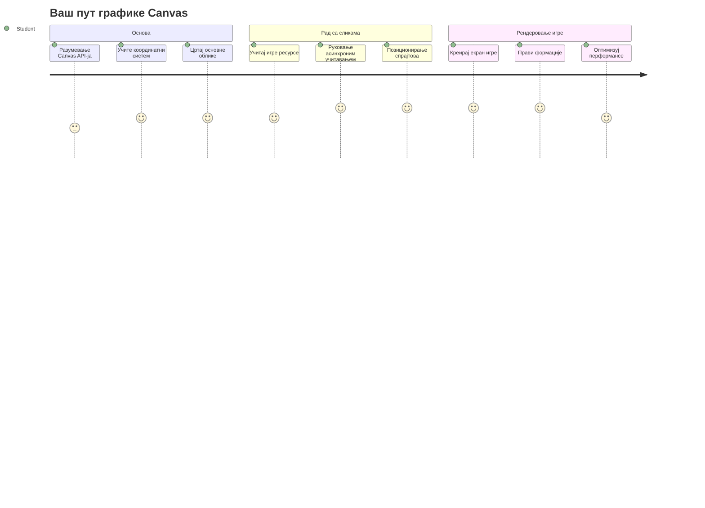
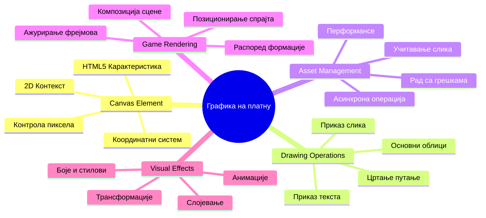
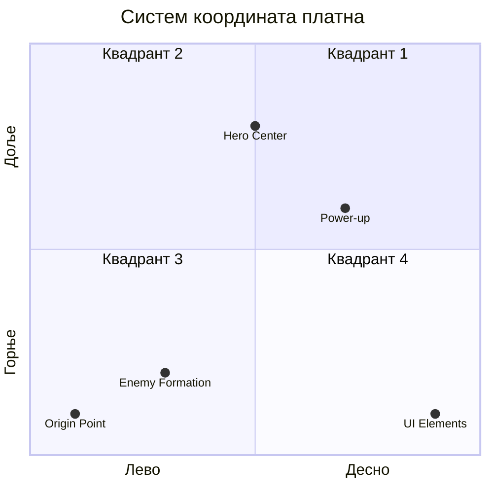
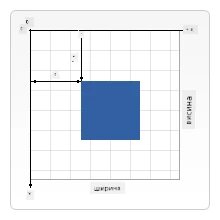
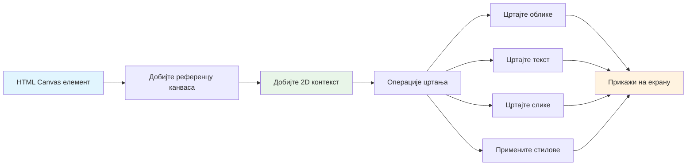
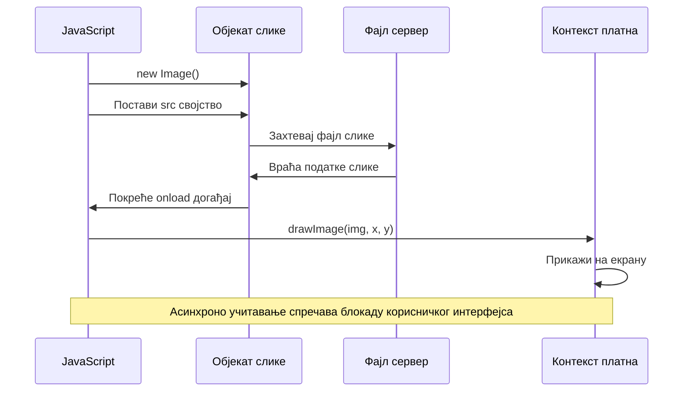
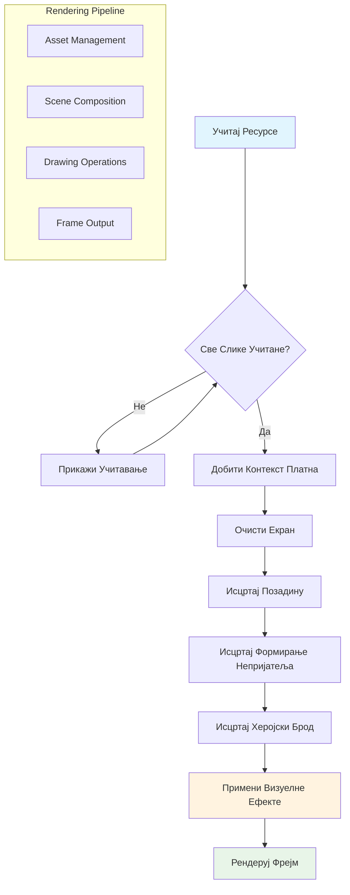
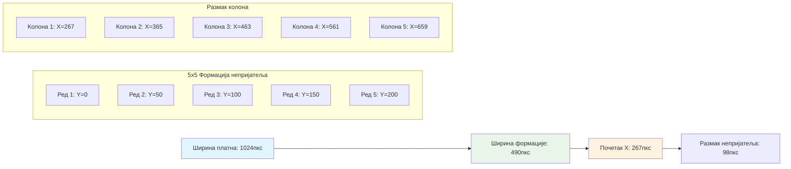
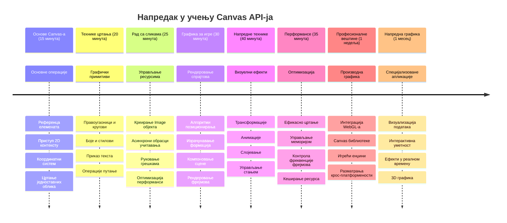

# Направи просторну игру део 2: Исцртај јунака и чудовишта на Canvas


Canvas API је једна од најмоћнијих функција веб развоја за креирање динамичке, интерактивне графике директно у вашем претраживачу. У овом часу, претворићемо тај празни HTML `<canvas>` елемент у свет игре пун јунака и чудовишта. Размислите о canvas-у као о вашој дигиталној уметничкој дасци где код постаје визуелни приказ.

Настављамо тамо где сте стали у претходном часу, а сада ћемо заронити у визуелне аспекте. Научићете како да учитате и прикажете спрајтове игре, прецизно позиционирате елементе и направите визуелну основу за вашу свемирску игру. Ово превазилази разлику између статичних веб страница и динамичких, интерактивних искустава.

На крају овог часа имаћете комплетну сцену игре са вашим јуначким бродом постављеним на право место и формацијама непријатеља спремним за битку. Разумете како модерне игре рендерују графику у претраживачима и стичете вештине за креирање својих интерактивних визуелних искустава. Хајде да истражимо canvas графику и оживимо вашу свемирску игру!


## Предпредавачки квиз

[Предпредавачки квиз](https://ff-quizzes.netlify.app/web/quiz/31)

## Canvas

Шта је тачно овај `<canvas>` елемент? То је HTML5 решење за креирање динамичке графике и анимација у веб претраживачима. За разлику од обичних слика или видео снимака који су статични, canvas вам даје контролу на нивоу пиксела над свим што се приказује на екрану. Ово га чини савршеним за игре, визуализације података и интерактивну уметност. Размислите о њему као о програмабилној површини за цртање где JavaScript постаје ваш четкица.

По дифолту, canvas елемент изгледа као празан, транспарентан правоугаоник на вашој страници. Али ту лежи његова потенцијална снага! Његова права моћ се појављује када користите JavaScript да нацртате облике, учитате слике, креирате анимације и учините да ствари реагују на корисничке интеракције. Ово је слично ономе како су рани рачунарски графички проналазачи у Bell Labs-у шездесетих година морали да програмирају сваки пиксел да створе прве дигиталне анимације.

✅ Прочитајте [више о Canvas API](https://developer.mozilla.org/docs/Web/API/Canvas_API) на MDN.

Ево како се обично декларише, као део тела странице:

```html
<canvas id="myCanvas" width="200" height="100"></canvas>
```

**Ево шта овај код ради:**
- **Поставља** атрибут `id` како бисте могли да позивате овај специфични canvas елемент у JavaScript-у
- **Дефинише** `width` у пикселима ради контроле хоризонталне величине canvas-а
- **Успоставља** `height` у пикселима да одреди вертикалне димензије canvas-а

## Цртање једноставне геометрије

Сада када знате шта је canvas елемент, хајде да истражимо како се заправо на њему црта! Canvas користи координатни систем који може бити познат из математике, али постоји једна важна промена карактеристична за рачунарску графику.

Canvas користи Картезијански систем координата са x-осом (хоризонтално) и y-осом (вертикално) за позиционирање свега што нацртате. Али ево главне разлике: за разлику од математичког система координата, координатни почетак `(0,0)` почиње у горњем левом углу, са x-вредностима које расту када идете удесно, а y-вредностима које расту када идете надоле. Овај приступ потиче од раних рачунарских екрана где су електронски зраци скенировали од врха према дну, чинећи горњи леви угао природном тачком почетка.



> Слика са [MDN](https://developer.mozilla.org/docs/Web/API/Canvas_API/Tutorial/Drawing_shapes)

Да бисте цртали на canvas елементу, пратите исти тростепени поступак који чини основу целе canvas графике. Када то урадите неколико пута, постаје друга природа:


1. **Узмите референцу** на ваш Canvas елемент из DOM-а (као за било који други HTML елемент)
2. **Узмите 2D рендеринг контекст** – он пружа све методе за цртање
3. **Почните са цртањем!** Користите уграђене методе конекста да направите своју графику

Ево како то изгледа у коду:

```javascript
// Корак 1: Узмите канвас елемент
const canvas = document.getElementById("myCanvas");

// Корак 2: Узмите 2D контекст за цртање
const ctx = canvas.getContext("2d");

// Корак 3: Поставите боју пуњења и нацртајте правоугаоник
ctx.fillStyle = 'red';
ctx.fillRect(0, 0, 200, 200); // x, y, ширина, висина
```

**Разложимо ово корак по корак:**
- Ми **узимамо** наш canvas елемент помоћу његовог ID и чувамо га у варијаблу
- Ми **узимамо** 2D рендеринг контекст – овај је наш сет алата са методама за цртање
- Ми **кажемо** canvas-у да желимо да испунимо бојом црвеном користећи `fillStyle` својство
- Ми **нацртамо** правоугаоник почевши од горњег левог угла (0,0) који је широк и висок 200 пиксела

✅ Canvas API се највише фокусира на 2D облике, али можете цртати и 3D елементе на веб сајту; за то можете користити [WebGL API](https://developer.mozilla.org/docs/Web/API/WebGL_API).

Можете цртати све врсте ствари помоћу Canvas API као што су:

- **Геометријски облици**, већ смо показали како се црта правоугаоник, али има још много тога што можете цртати.
- **Текст**, можете цртати текст са било којим фонтом и бојом коју желите.
- **Слике**, можете цртати слику засновану на сликовном ресурсу као што је .jpg или .png на пример.

✅ Испробајте! Знате како да нацртате правоугаоник, можете ли нацртати круг на страници? Погледајте неке интересантне Canvas цртеже на CodePen-у. Ево [нарочито импресивног примера](https://codepen.io/dissimulate/pen/KrAwx).

### 🔄 **Педагошки преглед**
**Разумевање основа Canvas-а**: Пре него што пређете на учитавање слика, уверите се да можете:
- ✅ Објаснити како се координатни систем canvas-а разликује од математичког система координата
- ✅ Разумети тростепени процес цртања на canvas-у
- ✅ Идентификовати шта пружа 2D рендеринг контекст
- ✅ Описати како fillStyle и fillRect раде заједно

**Брзи самотест**: Како бисте нацртали плави круг на позицији (100, 50) радијусa 25?
```javascript
ctx.fillStyle = 'blue';
ctx.beginPath();
ctx.arc(100, 50, 25, 0, 2 * Math.PI);
ctx.fill();
```

**Методе цртања на Canvas-у које сада знате**:
- **fillRect()**: Црта испуњене правоугаонике
- **fillStyle**: Поставља боје и узорке
- **beginPath()**: Започиње нове путање цртања
- **arc()**: Креира кругове и кривине

## Учитај и нацртај сликовни ресурс

Цртање основних облика је корисно за почетак, али већина игара треба праве слике! Спрајтови, позадине и текстуре су оно што играма даје визуелни карактер. Учитавање и приказивање слика на canvas-у ради другачије него цртање геометријских облика, али је једноставно када разумете процес.

Морамо да креирамо `Image` објекат, учитамо нашу слику (ово се дешава асинхроно, што значи „у позадини“), и онда је нацртамо на canvas када је спремна. Овај приступ осигурава да ваше слике буду правилно приказане без блокирања ваше апликације током учитавања.


### Основно учитавање слике

```javascript
const img = new Image();
img.src = 'path/to/my/image.png';
img.onload = () => {
  // Слика учитана и спремна за коришћење
  console.log('Image loaded successfully!');
};
```

**Ево шта се дешава у овом коду:**
- Ми **креирамо** нови Image објекат који ће чувати наш спрајт или текстуру
- Ми **кажемо** који сликовни фајл треба да учита подешавајући изворну путању
- Ми **слушамо** load догађај да знамо тачно када је слика спремна за употребу

### Бољи начин за учитавање слика

Ево робуснијег начина да се реши учитавање слика који професионални програмери често користе. Увити ћемо учитавање слика у функцију засновану на Promise-у – овај приступ, популаран од када су JavaScript Promises постали стандард у ES6, чини код организованијим и омогућава лепо руковање грешкама:

```javascript
function loadAsset(path) {
  return new Promise((resolve, reject) => {
    const img = new Image();
    img.src = path;
    img.onload = () => {
      resolve(img);
    };
    img.onerror = () => {
      reject(new Error(`Failed to load image: ${path}`));
    };
  });
}

// Савремена употреба са async/await
async function initializeGame() {
  try {
    const heroImg = await loadAsset('hero.png');
    const monsterImg = await loadAsset('monster.png');
    // Слике су сада спремне за коришћење
  } catch (error) {
    console.error('Failed to load game assets:', error);
  }
}
```

**Шта смо овде урадили:**
- **Увили** смо сву ту логику учитавања слика у Promise ради боље контроле
- **Додали** руковање грешкама које нас стварно обавештава када нешто пође по злу
- **Користили** модеран async/await синтаксис јер је много читљивији
- **Укључили** try/catch блокове за глатко руковање било каквим проблемима током учитавања

Када су ваше слике учитане, њихово цртање на canvas је заправо прилично једноставно:

```javascript
async function renderGameScreen() {
  try {
    // Учитајте игре ресурсе
    const heroImg = await loadAsset('hero.png');
    const monsterImg = await loadAsset('monster.png');

    // Узми платно и контекст
    const canvas = document.getElementById("myCanvas");
    const ctx = canvas.getContext("2d");

    // Насликај слике на одређене позиције
    ctx.drawImage(heroImg, canvas.width / 2, canvas.height / 2);
    ctx.drawImage(monsterImg, 0, 0);
  } catch (error) {
    console.error('Failed to render game screen:', error);
  }
}
```

**Прођимо корак по корак:**
- Ми **учитавамо** и хероја и чудовиште у позадини користећи await
- Ми **узимамо** наш canvas елемент и добијамо тај 2D рендеринг контекст који нам треба
- Ми **позиционирамо** херојску слику управо у центар помоћу једноставне математике координата
- Ми **постављамо** слику чудовишта у горњи леви угао као почетак формације непријатеља
- Ми **хватамо** све грешке које се могу појавити током учитавања или рендеровања


## Сада је време да почнете правити своју игру

Сада ћемо све спојити да направимо визуелну основу ваше просторске игре. Имате солидно разумевање основа canvas-а и техника учитавања слика, па ће овај практични део водити кроз креирање комплетног екрана игре са исправно позиционираним спрајтовима.

### Шта правити

Направићете веб страницу са Canvas елементом. Требало би да приказује црни екран димензија `1024*768`. Доставили смо вам две слике:

- Херојски брод

   

- 5*5 чудовишта

   

### Препоручени кораци за почетак развоја

Пронађите почетне фајлове који су направљени за вас у потфолдеру `your-work`. Структура вашег пројекта треба да садржи:

```bash
your-work/
├── assets/
│   ├── enemyShip.png
│   └── player.png
├── index.html
├── app.js
└── package.json
```

**Ево са чим радите:**
- **Спрајтови игре** се налазе у фолдеру `assets/` да све буде организовано
- **Главни HTML фајл** подешава canvas елемент и припрема све
- **JavaScript фајл** у ком ћете писати сву магију рендеровања игре
- **package.json** који подешава развојни сервер за локално тестирање

Отворите овај фасциклу у Visual Studio Code да почнете развој. Требаће вам локално развојно окружење са Visual Studio Code-ом, NPM-ом и Node.js-ом инсталираним. Ако немате `npm` подешен на рачунару, [овде је како га инсталирати](https://www.npmjs.com/get-npm).

Покрените развојни сервер тако што ћете отићи у фасциклу `your-work`:

```bash
cd your-work
npm start
```

**Ова команда ради неке јако корисне ствари:**
- **Покреће** локални сервер на `http://localhost:5000` да бисте могли тестирати игру
- **Сервира** све ваше фајлове како ваш претраживач правилно учитава садржај
- **Прати** промене у вашим фајловима за глатки развој
- **Пружа** вам професионално окружење за развој и тестирање

> 💡 **Напомена**: Ваш претраживач ће у почетку приказати празну страницу – то је очекивано! Како додајете код, освежите страницу да видите измене. Овај инкрементални приступ развоју сличан је ономе како је NASA градила Apоло рачунар – тестирајући сваки део пре интеграције у већи систем.

### Додајте код

Додајте потребан код у `your-work/app.js` да завршите следеће задатке:

1. **Исцртај canvas са црном позадином**
   > 💡 **Ево како**: Пронађите TODO у `/app.js` и додајте само две линије. Подесите `ctx.fillStyle` на црну, затим користите `ctx.fillRect()` почевши од (0,0) са димензијама canvas-а. Једноставно!

2. **Учитај текстуре игре**
   > 💡 **Ево како**: Користите `await loadAsset()` да учитате слике играча и непријатеља. Сачувајте их у варијабле да бисте их касније користили. Запамтите – неће се појавити док их заиста не нацртате!

3. **Исцртај јуначки брод у центру на дну**
   > 💡 **Ево како**: Користите `ctx.drawImage()` да позиционирате вашег јунака. За x координату, пробајте `canvas.width / 2 - 45` да га центрирате, а за y координату користите `canvas.height - canvas.height / 4` да га ставите у доњу зону.

4. **Исцртај формацију непријатељских бродова 5×5**
   > 💡 **Ево како**: Пронађите функцију `createEnemies` и направите угнежђене петље. Мораћете урадити неке рачуне за размаке и позиције, али не брините – показаћу вам како!

Прво, дефинишите константе за правилан распоред непријатеља:

```javascript
const ENEMY_TOTAL = 5;
const ENEMY_SPACING = 98;
const FORMATION_WIDTH = ENEMY_TOTAL * ENEMY_SPACING;
const START_X = (canvas.width - FORMATION_WIDTH) / 2;
const STOP_X = START_X + FORMATION_WIDTH;
```

**Ево шта ове константе раде:**
- Постављамо 5 непријатеља по реду и колони (лепа 5×5 мрежа)
- Дефинишемо колико простора има између непријатеља да не буду гужвани
- Израчунавамо ширину целе формације
- Одређујемо где да почнемо и где да завршимо да формација изгледа центрирано


Затим, направите угнежђене петље да исцртате формацију непријатеља:

```javascript
for (let x = START_X; x < STOP_X; x += ENEMY_SPACING) {
  for (let y = 0; y < 50 * 5; y += 50) {
    ctx.drawImage(enemyImg, x, y);
  }
}
```

**Ево шта ова угнежђена петља ради:**
- Спољашња петља **креће се** с лева на десно кроз формацију
- Унутрашња петља **помера се** од врха према дну да направи редове
- Цртамо сваког непријатеља на тачним x,y координатама које смо израчунали
- Све је **равномјерно размакнуто** да изгледа професионално и организовано

### 🔄 **Педагошки преглед**
**Вештина рендеровања игре**: Потврдите разумевање комплетног рендеринг система:
- ✅ Како асинхроно учитавање слика спречава блокирање UI током покретања игре?
- ✅ Зашто позиције формације непријатеља рачунамо коришћењем константи уместо тврдог кода?
- ✅ Коју улогу игра 2D рендеринг контекст у цртачким операцијама?
- ✅ Како угнежђене петље креирају организоване формације спрајтова?

**Перформансе**: Ваша игра сада демонстрира:
- **Ефикасно учитавање ресурса**: управљање сликама засновано на Promise
- **Организовано рендеровање**: структурисане операције цртања
- **Математичко позиционирање**: израчунато место спрајтова
- **Руковање грешкама**: глатко управљање пропустима

**Концепти визуелног програмирања**: Научили сте:
- **Системи координата**: Превођење математике у позиције на екрану  
- **Управљање спрајтовима**: Учитавање и приказивање графике игре  
- **Алгоритми формирања**: Математички обрасци за организоване распореде  
- **Асинхроне операције**: Модерни JavaScript за глатко корисничко искуство  

## Резултат

Потпун резултат треба да изгледа овако:


## Решење

Молимо вас да прво покушате сами да решите, али ако запнете, погледајте [решење](../../../../6-space-game/2-drawing-to-canvas/solution/app.js)

---

## GitHub Copilot Agent изазов 🚀

Користите Agent режим да бисте решили следећи изазов:

**Опис:** Унапређујте ваш свемирски канвас додавањем визуелних ефеката и интерактивних елемената користећи Canvas API технике које сте научили.

**Задатак:** Креирајте нови фајл под називом `enhanced-canvas.html` са канвасом који приказује анимиране звезде у позадини, пулсирајућу траку здравља за хероја и непријатељске бродове који спорије се крећу надоле. Укључите JavaScript код који црта трепћуће звезде користећи случајне позиције и провидност, имплементира траку здравља која мења боју у зависности од нивоа здравља (зелена > жута > црвена), и анимира непријатељске бродове који се крећу надоле различитим брзинама.

Сазнајте више о [agent режиму](https://code.visualstudio.com/blogs/2025/02/24/introducing-copilot-agent-mode) овде.

## 🚀 Изазов

Нaučili сте цртање са Canvas API фокусираним на 2D; погледајте [WebGL API](https://developer.mozilla.org/docs/Web/API/WebGL_API) и покушајте да нацртате 3D објекат.

## Квиз после предавања

[Квиз после предавања](https://ff-quizzes.netlify.app/web/quiz/32)

## Преглед и Самосталан Рад

Сазнајте више о Canvas API-ју [читајући о њему](https://developer.mozilla.org/docs/Web/API/Canvas_API).

### ⚡ **Шта можете урадити у наредних 5 минута**
- [ ] Отворите конзолу прегледача и креирајте елемент канваса са `document.createElement('canvas')`
- [ ] Покушајте да нацртате правоугаоник користећи `fillRect()` на контексту канваса
- [ ] Експериментишите са различитим бојама користећи својство `fillStyle`
- [ ] Нацртајте једноставан круг користећи методу `arc()`

### 🎯 **Шта можете постићи овог сата**
- [ ] Завршити квиз после часа и разумети основе канваса
- [ ] Креирати апликацију за цртање на канвасу са више облика и боја
- [ ] Имплементирати учитавање слика и приказивање спрајтова за вашу игру
- [ ] Направити једноставну анимацију која помера објекте по канвасу
- [ ] Вежбати трансформације на канвасу као што су скалирање, ротација и транслација

### 📅 **Ваш недељни курс путовања кроз Canvas**
- [ ] Завршити свемирску игру са довршеном графиком и анимацијама спрајтова
- [ ] Савладати напредне технике канваса као што су градијенти, узорци и комопозити
- [ ] Креирати интерактивне визуелизације користећи канвас за представљање података
- [ ] Савладати оптимизацију канваса за глатке перформансе
- [ ] Направити апликацију за цртање или сликање са разноврсним алатима
- [ ] Истражити креативне кодинг патерне и генеративну уметност са канвасом

### 🌟 **Ваш месечни мајсторски курс графике**
- [ ] Направити сложене визуелне апликације користећи Canvas 2D и WebGL
- [ ] Научити концепте графичког програмирања и основе шейдера
- [ ] Доприносити отвореним графичким библиотекама и алатима за визуализацију
- [ ] Савладати оптимизацију перформанси за графички захтевне апликације
- [ ] Креирати образовни садржај о програмирању канваса и рачунарској графици
- [ ] Постати експерт за графичко програмирање који помаже другима да креирају визуелна искуства

## 🎯 Ваш план за савладавање графике на Canvas-у


### 🛠️ Резиме вашег алата за Canvas графику

Након завршетка овог часа, сада имате:  
- **Мастерство Canvas API-ја**: Потпуно разумевање 2D графичког програмирања  
- **Математика координата**: Прецизно позиционирање и алгоритми распоређивања  
- **Управљање ресурсима**: Професионално учитавање слика и руковање грешкама  
- **Рендеринг процес**: Структурисан приступ састављању сцена  
- **Играчка графика**: Позиционирање спрајтова и рачунање форми  
- **Асинхроно програмирање**: Модерни JavaScript обрасци за глатке перформансе  
- **Визуелно програмирање**: Превођење математичких концепата у екранску графику  

**Применa у реалном свету**: Вештине са Canvas-ом се директно примењују на:  
- **Визуализацију података**: Графиконе, дијаграме и интерактивне табле  
- **Развој игара**: 2D игре, симулације и интерактивна искуства  
- **Дигиталну уметност**: Креативно кодирање и генеративне уметничке пројекте  
- **Дизајн интерфејса**: Прилагођену графику и интерактивне елементе  
- **Образовни софтвер**: Визуелне алате за учење и симулације  
- **Веб апликације**: Динамичку графику и визуализацију у реалном времену  

**Професионалне вештине које сте стекли**: Сада можете:  
- **Креирати** прилагођена графичка решења без спољних библиотека  
- **Оптимизовати** перформансе рендеровања за глатко корисничко искуство  
- **Отлањати грешке** у сложеним визуелним проблемима коришћењем алата прегледача  
- **Дизајнирати** скалабилне графичке системе користећи математичке принципе  
- **Интегрисати** Canvas графику са модерним веб апликационим фрејмворковима  

**Методе Canvas API-ја које сте савладали**:  
- **Управљање елементима**: getElementById, getContext  
- **Операције цртања**: fillRect, drawImage, fillStyle  
- **Учитавање ресурса**: Објекти Image, шаблони Promise  
- **Математско позиционирање**: Израчунавање координата, алгоритми формирања  

**Следећи ниво**: Спремни сте да додате анимацију, интеракцију корисника, детекцију судара, или да истражите WebGL за 3D графику!

🌟 **Остварили сте успех**: Направили сте комплетан систем за рендеровање игре користећи основне технике Canvas API-ја!

## Задатак

[Играјте се са Canvas API-јем](assignment.md)

---

<!-- CO-OP TRANSLATOR DISCLAIMER START -->
**Изјава о одрицању одговорности**:  
Овај документ је преведен помоћу АИ сервиса за превођење [Co-op Translator](https://github.com/Azure/co-op-translator). Иако се трудимо да превод буде што прецизнији, имајте у виду да аутоматски преводи могу садржати грешке или нетачности. Оригинални документ на његовом изворном језику треба сматрати званичним и ауторитетним извором. За критичне информације препоручује се професионални људски превод. Нисмо одговорни за било какве неспоразуме или погрешне интерпретације настале употребом овог превода.
<!-- CO-OP TRANSLATOR DISCLAIMER END -->