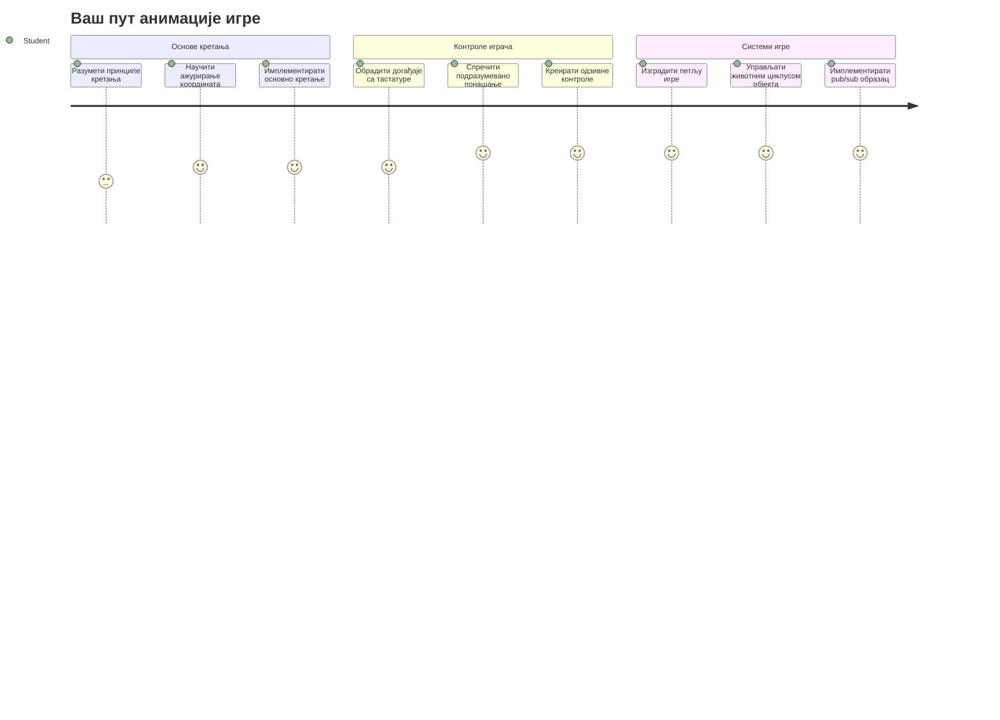
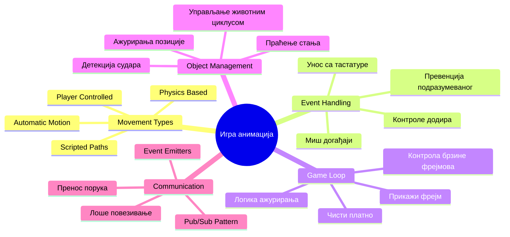
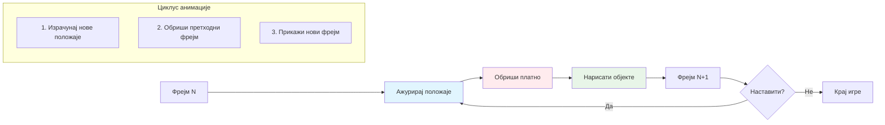
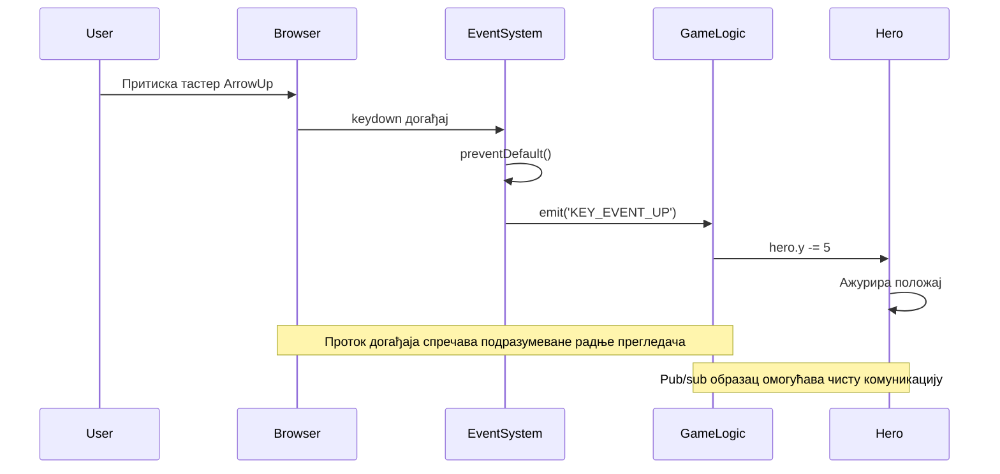
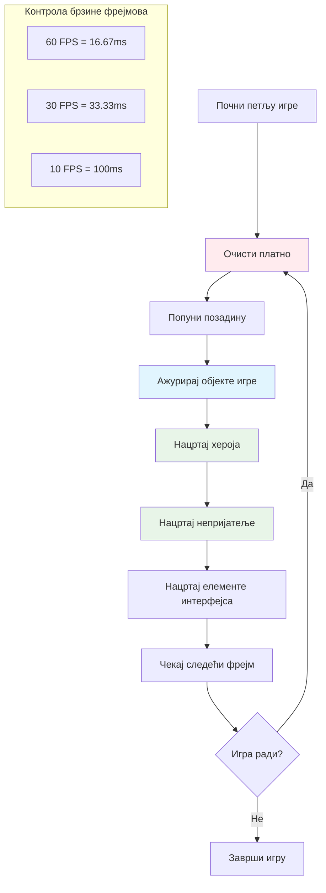
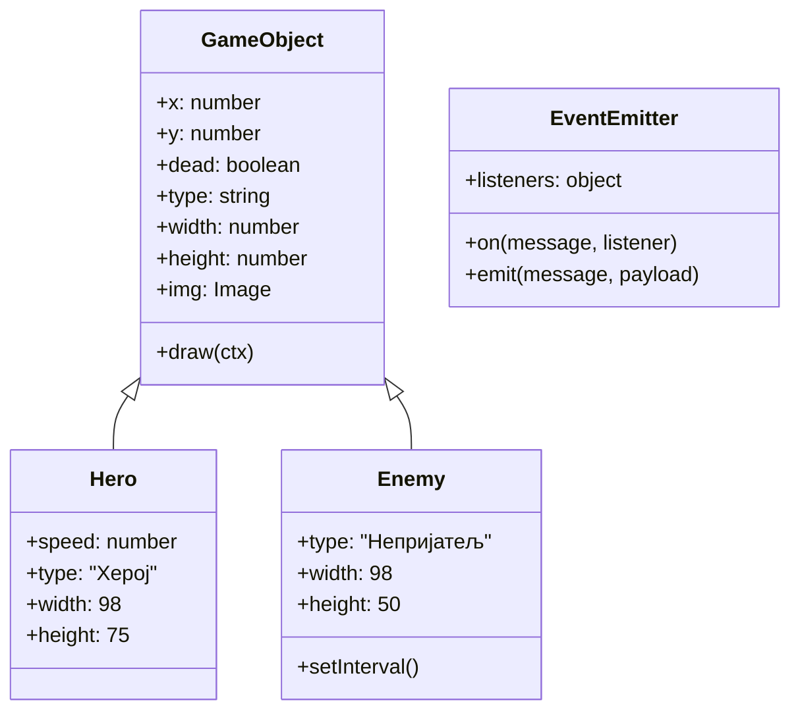
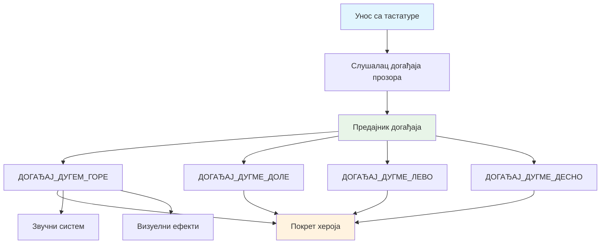
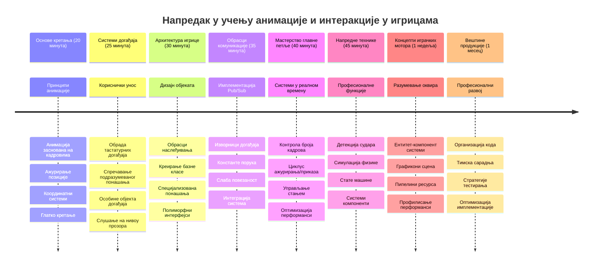

# Направи Свемирску Игру део 3: Додавање Покрета


Размислите о вашим омиљеним играма – оно што их чини привлачним није само лепа графика, већ начин на који све се помера и реагује на ваше акције. Тренутно, ваша свемирска игра је као прелепа слика, али управо ћемо додати кретање које је оживљава.

Када су инжењери НАСА-е програмирали управљачки рачунар за Аполо мисије, суочили су се са сличним изазовом: како натерати свемирски брод да реагује на улаз пилота, а при том аутоматски одржава корекције курса? Принципи које ћемо данас научити одражавају те исте концепте – управљање кретањем које контролише играч заједно са аутоматским системским понашањима.

У овој лекцији научићете како да свемирски бродови клизе преко екрана, реагују на команде играча и креирају глатке покретне образце. Разложићемо све на разумљиве концепте који се природно надовезују један на други.

До краја ћете морати да омогућите играчима да лете својим јунаком по екрану, док непријатељски бродови патролирају изнад. Још важније, разумећете основне принципе који покрећу системе кретања у играма.


## Прекидачки тест пре предавања

[Прексидачки тест](https://ff-quizzes.netlify.app/web/quiz/33)

## Разумевање кретања у игри

Игре оживљавају када се ствари почну кретати, а постоје у основи два начина да се то деси:

- **Кретање под контролом играча**: Када притиснете тастер или кликнете мишем, нешто се помера. Ово је директна веза између вас и света игре.
- **Аутоматско кретање**: Када игра сама одлучи да нешто помери – као што су непријатељски бродови који морају да патролирају екраном без обзира шта ви радите.

Померање објеката на рачунарском екрану је једноставније него што мислите. Сећате ли се оних x и y координата из математике? Управо са тим радимо овде. Када је Галилео 1610. пратио Јупитерове месеце, суштински је радио исту ствар – цртао положаје током времена да разуме обрасце кретања.

Померање ствари на екрану је као прављење анимације у стрипу – треба пратити ова три једноставна корака:


1. **Ажурирај положај** – Промени где би објекат требало да буде (на пример, помери га 5 пиксела удесно)
2. **Обриши стари кадар** – Очисти екран да не видиш никакве духолове трагове
3. **Нацртај нови кадар** – Постави објекат на ново место

Уради ово довољно брзо и бум! Имаш глатко кретање које делује природно играчима.

Ево како то може изгледати у коду:

```javascript
// Постави локацију хероја
hero.x += 5;
// Очисти правоугаоник у којем се налази херој
ctx.clearRect(0, 0, canvas.width, canvas.height);
// Пресликај позадину игре и херојa
ctx.fillRect(0, 0, canvas.width, canvas.height);
ctx.fillStyle = "black";
ctx.drawImage(heroImg, hero.x, hero.y);
```

**Ово код ради:**
- **Ажурира** x-координату јунака за 5 пиксела да се помери хоризонтално
- **Брише** цело платно да уклони претходни кадар
- **Попуњава** платно црном бојом позадине
- **Поново црта** слику јунака на новом месту

✅ Можете ли да погодите зашто би поновно цртање јунака много пута у секунди могло да повећа трошкове перформанси? Прочитајте о [алтернативама овог обрасца](https://developer.mozilla.org/en-US/docs/Web/API/Canvas_API/Tutorial/Optimizing_canvas).

## Руковање догађајима са тастатуре

Овде повезујемо улаз играча са акцијом у игри. Када неко притисне размак да опали ласер или додирне тастер са стрелицом да се избегне астероид, игра мора да детектује и одговори на тај улаз.

Догађаји тастатуре се дешавају на нивоу прозора, што значи да цела ваша прегледачка прозор слуша за те притиске тастера. Кликови мишем, с друге стране, могу бити везани за одређене елементе (као што је клик на дугме). За нашу свемирску игру фокусираћемо се на тастатуру јер то даје играчима класичан аркадни осећај.

Ово ме подсећа на то како су телеграфски оператери у 1800-им морали да преводе морзеове кодове у смислене поруке – ми радимо нешто слично, преводећи притиске тастера у команде за игру.

Да бисте руковали догађајем, треба да користите метод window `addEventListener()` и дате му два улазна параметра. Први параметар је име догађаја, на пример `keyup`. Други параметар је функција која треба да се позове као резултат догађаја.

Ево примера:

```javascript
window.addEventListener('keyup', (evt) => {
  // evt.key = стринг репрезентација тастера
  if (evt.key === 'ArrowUp') {
    // уради нешто
  }
});
```

**Разлагање онога што се овде дешава:**
- **Слуша** догађаје тастатуре на целом прозору
- **Хвата** објекат догађаја који садржи информације о том који је тастер притиснут
- **Проверава** да ли притиснути тастер одговара одређеном тастеру (у овом случају, стрелицa нагоре)
- **Извршава** код када је услов испуњен

За догађаје тастатуре постоје две особине догађаја које можете користити да видите који је тастер притиснут:

- `key` - ово је низа знакова који представља притиснути тастер, на пример `'ArrowUp'`
- `keyCode` - ово је бројчана вредност, на пример `37`, што одговара `ArrowLeft`

✅ Манипулација догађајима тастатуре је корисна и ван развоја игара. На шта све још можете помислити као коришћење ове технике?


### Специјални тастери: упозорење!

Неки тастери имају уграђено понашање прегледача које може ометати вашу игру. Стрелице скролују страницу, а размак помера страницу надоле – понашања која не желите када неко покушава да управља свемирским бродом.

Можемо спречити ова подразумевана понашања и пустити игру да обради улаз уместо тога. Ово је слично као што су рани компјутерски програмери морали да надјачају системске прекиде да би направили прилагођена понашања – овде то радимо на нивоу прегледача. Ево како:

```javascript
const onKeyDown = function (e) {
  console.log(e.keyCode);
  switch (e.keyCode) {
    case 37:
    case 39:
    case 38:
    case 40: // Тастери са стрелицама
    case 32:
      e.preventDefault();
      break; // Размак
    default:
      break; // не блокирај друге тастере
  }
};

window.addEventListener('keydown', onKeyDown);
```

**Разумевање кода за спречавање:**
- **Проверава** одређене кодове тастера који могу изазвати непожељно понашање прегледача
- **Спречава** подразумевану акцију прегледача за тастере са стрелицама и размак
- **Дозвољава** другим тастерима да раде нормално
- **Користи** `e.preventDefault()` да заустави уграђено понашање прегледача

### 🔄 **Педагошки провера**
**Разумевање руковања догађајима**: Пре него што пређемо на аутоматско кретање, уверите се да можете:
- ✅ Објаснити разлику између `keydown` и `keyup` догађаја
- ✅ Разумети зашто спречавамо подразумевано понашање прегледача
- ✅ Описати како слушаоци догађаја повезују улаз корисника са логиком игре
- ✅ Препознати који тастери могу ометати контроле игре

**Брзи самотест**: Шта би се десило ако не бисте спречили подразумевано понашање за тастере са стрелицама?
*Одговор: Прегледач би скроловао страницу, ометајући кретање у игри*

**Архитектура догађајног система**: Сада разумете:
- **Слушање на нивоу прозора**: хватање догађаја на нивоу прегледача
- **Особине објекта догађаја**: `key` као низови у односу на `keyCode` бројеве
- **Спречавање подразумеваног**: заустављање непожељних понашања прегледача
- **Условна логика**: реаговање на специфичне комбинације тастера

## Кретање које игра изазива

Хајде сада да причамо о објектима који се крећу без уноса играча. Помислите на непријатељске бродове који крузирају преко екрана, метке који лете право или облаке који плове у позадини. Ово аутономно кретање даје вашем свету у игри осећај живота чак и када нико не дира контроле.

Користимо уграђене JavaScript тајмере да ажурирамо положаје у равномерним интервалима. Овај концепт је сличан како делују точкови на часовницима – редован механизам који покреће конзистентне, временски дефинисане акције. Ево колико је једноставно:

```javascript
const id = setInterval(() => {
  // Померите непријатеља по y оси
  enemy.y += 10;
}, 100);
```

**Ово код кретања ради:**
- **Креира** тајмер који се покреће сваких 100 милисекунди
- **Ажурира** y-координату непријатеља за 10 пиксела сваки пут
- **Чува** ИД интервала да бисмо могли да га зауставимо касније ако треба
- **Помера** непријатеља надоле по екрану аутоматски

## Петља игре

Ево концепта који све повезује – петља игре. Ако је ваша игра филм, петља игре би била пројектор који приказује кадар за кадром тако брзо да све изгледа глатко померено.

Свакој игри је потребна таква петља која ради у позадини. То је функција која ажурира све објекте игре, поново црта екран и непрестано понавља овај процес. Ово прати вашег јунака, све непријатеље, све ласере који лете – целокупно стање игре.

Овај концепт ме подсећа на ране филмске аниматоре као Валт Дизнија који су морали да поново цртају ликове кадар по кадар да би створили илузију кретања. Ми радимо исто, само са кодом уместо оловки.

Ево како петља игре обично може изгледати у коду:


```javascript
const gameLoopId = setInterval(() => {
  function gameLoop() {
    ctx.clearRect(0, 0, canvas.width, canvas.height);
    ctx.fillStyle = "black";
    ctx.fillRect(0, 0, canvas.width, canvas.height);
    drawHero();
    drawEnemies();
    drawStaticObjects();
  }
  gameLoop();
}, 200);
```

**Разумевање структуре петље игре:**
- **Брише** цело платно да уклони претходни кадар
- **Попуњава** позадину једнобојом
- **Црта** све објекте игре на њиховим тренутним позицијама
- **Понавља** овај процес сваких 200 милисекунди да би створио глатку анимацију
- **Управља** брзином кадрова контролом временског интервала

## Наставак свемирске игре

Сада ћемо додати кретање у статичну сцену коју сте претходно изградили. Претворићемо је из снимка екрана у интерактивно искуство. Проћи ћемо корак по корак да би сваки део природно надовезао претходни.

Преузмите код са места где сте стали у претходној лекцији (или почните од [Part II- starter](../../../../6-space-game/3-moving-elements-around/your-work) фолдера ако желите свеж почетак).

**Ово данас градимо:**
- **Контроле јунака**: Тастери са стрелицама ће управљати свемирским бродом по екрану
- **Кретање непријатеља**: Ови ванземаљски бродови ће почети своју офанзиву

Хајде да почнемо имплементирати ове функције.

## Препоручени кораци

Пронађите фајлове који су вам направљени у подфолдеру `your-work`. Требало би да садржи следеће:

```bash
-| assets
  -| enemyShip.png
  -| player.png
-| index.html
-| app.js
-| package.json
```

Започните пројекат у `your-work` фолдеру тако што ћете откуцати:

```bash
cd your-work
npm start
```

**Ово наређење ради:**
- **Превасходи** у вашу радну фасциклу пројекта
- **Покреће** HTTP сервер на адреси `http://localhost:5000`
- **Сервира** фајлове ваше игре да бисте их тестирали у прегледачу

Горенаведено ће покренути HTTP сервер на адреси `http://localhost:5000`. Отворите прегледач и унесите ту адресу, тренутно би требало да прикаже јунака и све непријатеље; још ништа не помера – још увек!

### Додајте код

1. **Додајте посебне објекте** за `hero`, `enemy` и `game object`, требало би да имају `x` и `y` особине. (Сетите се дела о [Наслеђивању или композицији](../README.md)).

   *САВЕТ* `game object` треба да буде онај који има `x` и `y` и могућност да црта себе на платну.

   > **Савет**: Почните са додавањем нове класе `GameObject` са конструктором дефинисаним као испод, и онда је нацртајте на платну:

    ```javascript
    class GameObject {
      constructor(x, y) {
        this.x = x;
        this.y = y;
        this.dead = false;
        this.type = "";
        this.width = 0;
        this.height = 0;
        this.img = undefined;
      }
    
      draw(ctx) {
        ctx.drawImage(this.img, this.x, this.y, this.width, this.height);
      }
    }
    ```

    **Разумевање ове основне класе:**
    - **Дефинише** заједничке особине које деле сви објекти игре (положај, величину, слику)
    - **Укључује** речник `dead` који прати да ли објекат треба бити уклоњен
    - **Обезбеђује** методу `draw()` која приказује објекат на платну
    - **Поставља** подразумеване вредности свих особина које потомци могу да преуређују


    Сада проширите ову `GameObject` класу да направите `Hero` и `Enemy`:
    
    ```javascript
    class Hero extends GameObject {
      constructor(x, y) {
        super(x, y);
        this.width = 98;
        this.height = 75;
        this.type = "Hero";
        this.speed = 5;
      }
    }
    ```

    ```javascript
    class Enemy extends GameObject {
      constructor(x, y) {
        super(x, y);
        this.width = 98;
        this.height = 50;
        this.type = "Enemy";
        const id = setInterval(() => {
          if (this.y < canvas.height - this.height) {
            this.y += 5;
          } else {
            console.log('Stopped at', this.y);
            clearInterval(id);
          }
        }, 300);
      }
    }
    ```

    **Кључни концепти у овим класама:**
    - **Наслеђује** од `GameObject` користећи кључну реч `extends`
    - **Позива** родитељски конструктор помоћу `super(x, y)`
    - **Поставља** специфичне димензије и особине за сваки тип објекта
    - **Имплементира** аутоматско кретање за непријатеље користећи `setInterval()`

2. **Додајте руковаоце догађаја тастатуре** да управљате навигацијом тастера (померајте јунака горе/доле лево/десно)

   *СЕТИТЕ СЕ* да ради на картезијанском систему, горњи леви угао је `0,0`. Такође сетите се да додате код да зауставите *подразумевано понашање*.

   > **Савет**: Направите функцију `onKeyDown` и прикачите је на прозор:

   ```javascript
   const onKeyDown = function (e) {
     console.log(e.keyCode);
     // Додајте код из горње лекције да бисте зауставили подразумевано понашање
     switch (e.keyCode) {
       case 37:
       case 39:
       case 38:
       case 40: // Стрелице на тастерима
       case 32:
         e.preventDefault();
         break; // Размак
       default:
         break; // не блокирајте друге тастере
     }
   };

   window.addEventListener("keydown", onKeyDown);
   ```
    
   **Ово руковање догађајем ради:**
   - **Слуша** `keydown` догађаје на целом прозору
   - **Логира** код тастера да вам помогне у отклањању грешака који тастери се притискају
   - **Спречава** подразумевано понашање прегледача за тастере са стрелицама и размак
   - **Дозвољава** другим тастерима да раде нормално
   
   Погледајте конзолу у претраживачу у овом тренутку и пратите који тастери се региструју.

3. **Имплементирајте** [Pub sub образац](../README.md), ово ће вам помоћи да ваш код буде чист док пратите остатак делова.

   Publish-Subscribe образац помаже организовати код тако што одваја детекцију догађаја од руковања догађајима. Ово чини код модуларнијим и лакшим за одржавање.

   За овај последњи део можете:

   1. **Додати слушаоца догађаја** на прозор:

       ```javascript
       window.addEventListener("keyup", (evt) => {
         if (evt.key === "ArrowUp") {
           eventEmitter.emit(Messages.KEY_EVENT_UP);
         } else if (evt.key === "ArrowDown") {
           eventEmitter.emit(Messages.KEY_EVENT_DOWN);
         } else if (evt.key === "ArrowLeft") {
           eventEmitter.emit(Messages.KEY_EVENT_LEFT);
         } else if (evt.key === "ArrowRight") {
           eventEmitter.emit(Messages.KEY_EVENT_RIGHT);
         }
       });
       ```

   **Овај систем догађаја ради:**
   - **Детектује** унос тастатуре и претвара га у прилагођене догађаје игре
   - **Раздваја** детекцију уноса од логике игре
   - **Олакшава** промену контрола касније без утицаја на код игре
   - **Пружа могућност** више система да реагују на исти унос


   2. **Направите класу EventEmitter** да бисте објављивали и примијали поруке:

       ```javascript
       class EventEmitter {
         constructor() {
           this.listeners = {};
         }
       
         on(message, listener) {
           if (!this.listeners[message]) {
             this.listeners[message] = [];
           }
           this.listeners[message].push(listener);
         }
       

   3. **Додајте константе** и подесите EventEmitter:

       ```javascript
       const Messages = {
         KEY_EVENT_UP: "KEY_EVENT_UP",
         KEY_EVENT_DOWN: "KEY_EVENT_DOWN",
         KEY_EVENT_LEFT: "KEY_EVENT_LEFT",
         KEY_EVENT_RIGHT: "KEY_EVENT_RIGHT",
       };
       
       let heroImg, 
           enemyImg, 
           laserImg,
           canvas, ctx, 
           gameObjects = [], 
           hero, 
           eventEmitter = new EventEmitter();
       ```

   **Разумевање ове поставке:**
   - **Дефинише** константе порука да би се избегле грешке и олакшала промена кода
   - **Декларије** променљиве за слике, контекст платна и стање игре
   - **Креира** глобални емитер догађаја за pub-sub систем
   - **Иницијализује** низ који садржи све игрове објекте

   4. **Иницијализуј игру**

       ```javascript
       function initGame() {
         gameObjects = [];
         createEnemies();
         createHero();
       
         eventEmitter.on(Messages.KEY_EVENT_UP, () => {
           hero.y -= 5;
         });
       
         eventEmitter.on(Messages.KEY_EVENT_DOWN, () => {
           hero.y += 5;
         });
       
         eventEmitter.on(Messages.KEY_EVENT_LEFT, () => {
           hero.x -= 5;
         });
       
4. **Постави игру петљу**

   Рефакториши функцију `window.onload` да иницијализује игру и подеси игру петљу на добар интервал. Такође ћеш додати ласерски зрак:

    ```javascript
    window.onload = async () => {
      canvas = document.getElementById("canvas");
      ctx = canvas.getContext("2d");
      heroImg = await loadTexture("assets/player.png");
      enemyImg = await loadTexture("assets/enemyShip.png");
      laserImg = await loadTexture("assets/laserRed.png");
    
      initGame();
      const gameLoopId = setInterval(() => {
        ctx.clearRect(0, 0, canvas.width, canvas.height);
        ctx.fillStyle = "black";
        ctx.fillRect(0, 0, canvas.width, canvas.height);
        drawGameObjects(ctx);
      }, 100);
    };
    ```

   **Разумевање подешавања игре:**
   - **Чека** да се страница потпуно учита пре него што почне
   - **Проналази** canvas елемент и његов 2D рендеринг контекст
   - **Учитава** све атрибуте слике асинхроно користећи `await`
   - **Покреће** игру петљу која ради на интервалу од 100мс (10 FPS)
   - **Брише** и поново црта целу сцену сваки фрејм

5. **Додај код** за померање непријатеља на одређеном интервалу

    Рефакториши функцију `createEnemies()` да креира непријатеље и гурне их у нови низ gameObjects класе:

    ```javascript
    function createEnemies() {
      const MONSTER_TOTAL = 5;
      const MONSTER_WIDTH = MONSTER_TOTAL * 98;
      const START_X = (canvas.width - MONSTER_WIDTH) / 2;
      const STOP_X = START_X + MONSTER_WIDTH;
    
      for (let x = START_X; x < STOP_X; x += 98) {
        for (let y = 0; y < 50 * 5; y += 50) {
          const enemy = new Enemy(x, y);
          enemy.img = enemyImg;
          gameObjects.push(enemy);
        }
      }
    }
    ```

    **Шта креирање непријатеља ради:**
    - **Израчунава** позиције да центрира непријатеље на екрану
    - **Креира** мрежу непријатеља користећи угнежђене петље
    - **Додељује** слику непријатеља сваком објекту непријатеља
    - **Додаје** сваког непријатеља у глобални низ game objects
    
    и додај функцију `createHero()` која ради сличан процес за хероја.
    
    ```javascript
    function createHero() {
      hero = new Hero(
        canvas.width / 2 - 45,
        canvas.height - canvas.height / 4
      );
      hero.img = heroImg;
      gameObjects.push(hero);
    }
    ```

    **Шта креирање хероја ради:**
    - **Поставља** хероја на дно центра екрана
    - **Додељује** слику хероја херојском објекту
    - **Додаје** хероја у низ game objects ради цртања

    и коначно, додај функцију `drawGameObjects()` која почиње цртање:

    ```javascript
    function drawGameObjects(ctx) {
      gameObjects.forEach(go => go.draw(ctx));
    }
    ```

    **Разумевање функције цртања:**
    - **Пролази** кроз све игрове објекте у низу
    - **Позива** методу `draw()` на сваком објекту
    - **Прослеђује** canvas контекст тако да се објекти могу сами исцртати

    ### 🔄 **Педагошки преглед**
    **Комплетно разумевање система игре**: Потврди своје знање о целокупној архитектури:
    - ✅ Како наслеђивање омогућава Хероју и Непријатељу да деле заједничке особине GameObject-а?
    - ✅ Зашто пуц/претплата (pub/sub) образац чини твој код одрживијим?
    - ✅ Какву улогу игра игра петља у стварању глатке анимације?
    - ✅ Како слушаоци догађаја повезују унос корисника са понашањем игровог објекта?

    **Интеграција система**: Твоја игра сада приказује:
    - **Објектно оријентисани дизајн**: Основне класе са специјализованим наслеђивањем
    - **Архитектура заснована на догађајима**: пуц/претплата образац за лабаву повезаност
    - **Фрејмворк за анимацију**: Игра петља са доследним ажурирањима кадрова
    - **Обрада уноса**: тастатурни догађаји са спречавањем подразумеваног понашања
    - **Управљање ресурсима**: учитавање слика и приказ спрајтова

    **Професионални обрасци**: Имплементирао си:
    - **Одвајање брига**: одвојена логика уноса, логике и рендеровања
    - **Полиморфизам**: сви игрови објекти деле заједнички интерфејс цртања
    - **Пренос порука**: чиста комуникација између компоненти
    - **Управљање ресурсима**: ефикасно руковање спрајтовима и анимацијом

    Твоји непријатељи треба да почну напредовање ка твом херојском свемирском броду!
      }
    }
    ```
    
    and add a `createHero()` function to do a similar process for the hero.
    
    ```javascript
    function createHero() {
      hero = new Hero(
        canvas.width / 2 - 45,
        canvas.height - canvas.height / 4
      );
      hero.img = heroImg;
      gameObjects.push(hero);
    }
    ```

    и коначно, додај функцију `drawGameObjects()` која почиње цртање:

    ```javascript
    function drawGameObjects(ctx) {
      gameObjects.forEach(go => go.draw(ctx));
    }
    ```

    Твоји непријатељи треба да почну напредовање ка твом херојском свемирском броду!

---

## GitHub Copilot Agent Изазов 🚀

Ево изазова који ће побољшати завршни утисак твоје игре: додавање граница и глатке контроле. Тренутно, твој јунак може излетети ван екрана, а кретање може да делује сецкано.

**Твој задатак:** Учини да твој свемирски брод делује реалистичније имплементирајући границе екрана и течна кретања. Ово је слично као контролни системи лета НАСА-е који спречавају свемирска возила да пређу границе безбедних радних параметара.

**Ево шта треба направити:** Креирај систем који држи хероја унутар екрана и учини контроле глатким. Када играчи држе стрелицу на тастатури, брод треба да клизи континуирано уместо да се креће у корацима. Размисли о визуелним повратним информацијама када брод достигне границе екрана – можда суптилан ефекат који указује на ивицу играчког простора.

Сазнај више о [agent mode](https://code.visualstudio.com/blogs/2025/02/24/introducing-copilot-agent-mode) овде.

## 🚀 Изазов

Организација кода постаје све важнија како пројекти расту. Можда си приметио да ти се датотека препунила функцијама, променљивима и класама које су све измешане. Ово ме подсећа како су инжењери који су организовали код за Аполо мисију морали да направе јасне и одрживе системе на којима би радиле више тимова истовремено.

**Твој задатак:**
Размишљај као софтверски архитекта. Како би организовао свој код да шест месеци од сада, ти (или неки колега) може лако разумети шта се дешава? Чак и ако све остане у једној датотеци за сада, можеш направити бољу организацију:

- **Груписање повезаних функција** уз јасне наслове за секције
- **Одвајање брига** - држи игру логику одвојену од рендеровања
- **Коришћење доследних конвенција именовања** за променљиве и функције
- **Креирање модула** или namespaces да организујеш различите аспекте игре
- **Додавање документације** која објашњава сврху сваке главне секције

**Питања за размишљање:**
- Који делови твог кода су најтежи за разумевање када им се вратиш?
- Како можеш организовати свој код да би било лакше неком другом да допринесе?
- Шта би се десило ако желиш да додаш нове функције као што су пауер-упс или различити типови непријатеља?

## Квиз након предавања

[Квиз након предавања](https://ff-quizzes.netlify.app/web/quiz/34)

## Ревизија и Самосталан рад

Правили смо све од почетка, што је одлично за учење, али ево мале тајне – постоје неки сјајни JavaScript фрејмворци који могу обавити велики део тешког посла за тебе. Када се осећаш комфорно са основама које смо покрили, вреди [истражити шта је доступно](https://github.com/collections/javascript-game-engines).

Размишљај о фрејмворцима као о добро опремљеној апарату са алатима уместо да ручно правиш сваки алат. Они могу решити многе од изазова организације кода о којима смо говорили, као и понудити функције које би ти требало недељама да направиш сам.

**Ствари вредне истраживања:**
- Како игре мотор организују код – бићеш изненађен паметним обрасцима које користе
- Трикове перформанса за глатко извођење игара на canvas
- Модерне JavaScript функције које могу учинити твој код чистијим и лакшим за одржавање
- Различите приступе управљању игровим објектима и њиховим односима

## 🎯 Твој временски оквир за мајсторство анимације игре


### 🛠️ Резиме твог алата за развој игара

Након завршетка ове лекције, сада си савладао:
- **Принципе анимације**: померање засновано на фрејмовима и глатке транзиције
- **Програмирање засновано на догађајима**: руковање уносом са тастатуре са прописним управљањем догађајима
- **Објектно оријентисани дизајн**: наслеђивање и полиморфни интерфејси
- **Обрасце комуникације**: пуц/претплата архитектура за одржив код
- **Архитектуру игре петље**: ажурирања у реалном времену и циклуси рендеровања
- **Системи уноса**: мапирање корисничке контроле са спречавањем подразумеваног понашања
- **Управљање ресурсима**: учитавање спрајтова и ефикасне технике рендеровања

### ⚡ **Шта можеш учинити следећих 5 минута**
- [ ] Отвори конзолу претраживача и пробај `addEventListener('keydown', console.log)` да видиш догађаје тастатуре
- [ ] Креирај прост div елемент и помери га користећи тастере са стрелицама
- [ ] Испробај `setInterval` за креирање континуираног кретања
- [ ] Покушај да спречиш подразумевано понашање коришћењем `event.preventDefault()`

### 🎯 **Шта можеш постићи ове сате**
- [ ] Заврши квиз након лекције и разумиј програмирање засновано на догађајима
- [ ] Направи покретног хероја свемирски брод са потпуном тастатурном контролом
- [ ] Имплементирај глатке паттерне кретања непријатеља
- [ ] Додај границе да спречиш да игрови објекти изађу ван екрана
- [ ] Креирај основну детекцију судара између игрових објеката

### 📅 **Твој недељни пут анимације**
- [ ] Заврши комплетну свемирску игру са уређеним кретањем и интеракцијама
- [ ] Додај напредне моделе кретања као што су криве, убрзања и физика
- [ ] Имплементирај глатке транзиције и easing функције
- [ ] Креирај ефекте честица и системе визуелних повратних информација
- [ ] Оптимизуј перформансе игре за глатку игру од 60fps
- [ ] Додај мобилне додирне контроле и одзивни дизајн

### 🌟 **Твој месечни интерективни развој**
- [ ] Направи сложене интерактивне апликације са напредним системима анимације
- [ ] Научи анимацијске библиотеке као што су GSAP или направи свој анимацијски мотор
- [ ] Доприноси open source пројектима за развој игара и анимације
- [ ] Савладај оптимизацију перформанси за графички захтевне апликације
- [ ] Креирај едукативни садржај о развоју игара и анимацијама
- [ ] Направи портфолио који приказује напредне вештине интерактивног програмирања

**Примена у стварном свету**: Твоје вештине анимације игре директно се примењују на:
- **Интерактивне веб апликације**: динамички дашборди и интерфејси у реалном времену
- **Визуелизацију података**: анимирани графикони и интерактивна графика
- **Едукативни софтвер**: интерактивне симулације и алати за учење
- **Мобилни развој**: игре на додир и руковање гестовима
- **Десктоп апликације**: Electron апликације са глатким анимацијама
- **Веб анимације**: CSS и JavaScript анимацијске библиотеке

**Професионалне вештине стечене**: Сада можеш:
- **Архитектонски** креирати системе засноване на догађајима који се могу скалирати са сложеношћу
- **Имплементирати** глатке анимације користећи математичке принципе
- **Дебаговати** сложене интеракционе системе коришћењем развојних алата претраживача
- **Оптимизовати** перформансе игре за различите уређаје и претраживаче
- **Дизајнирати** одрживе структуре кода користећи проверене обрасце

**Концепти развоја игре које си савладао**:
- **Управљање фрејмрејтом**: разумевање FPS и контроле тајминга
- **Обрада уноса**: универзални системи тастатуре и догађаја
- **Животни циклус објекта**: обрасци креирања, ажурирања и уништења
- **Синхронизација стања**: одржавање стања игре конзистентним преко фрејмова
- **Архитектура догађаја**: одвојена комуникација између игрових система

**Следећи ниво**: Спреман си да додаш детекцију судара, системе бодовања, звучне ефекте или да истражиш модерне фрејмворке као што су Phaser или Three.js!

🌟 **Постигнуће откључано**: Направио си комплетан интерактивни систем игре са професионалним архитектонским обрасцима!

## Задатак

[Коментариши свој код](assignment.md)

---

<!-- CO-OP TRANSLATOR DISCLAIMER START -->
**Ограничење одговорности**:  
Овај документ је преведен уз помоћ АИ сервиса за превођење [Co-op Translator](https://github.com/Azure/co-op-translator). Иако се трудимо да превод буде што прецизнији, молимо имајте у виду да аутоматизовани преводи могу садржати грешке или нетачности. Оригинални документ на његовом изворном језику треба сматрати ауторитетним извором. За критичне информације препоручује се професионални људски превод. Нисмо одговорни за било каква неспоразума или погрешна тумачења која могу произаћи из употребе овог превода.
<!-- CO-OP TRANSLATOR DISCLAIMER END -->