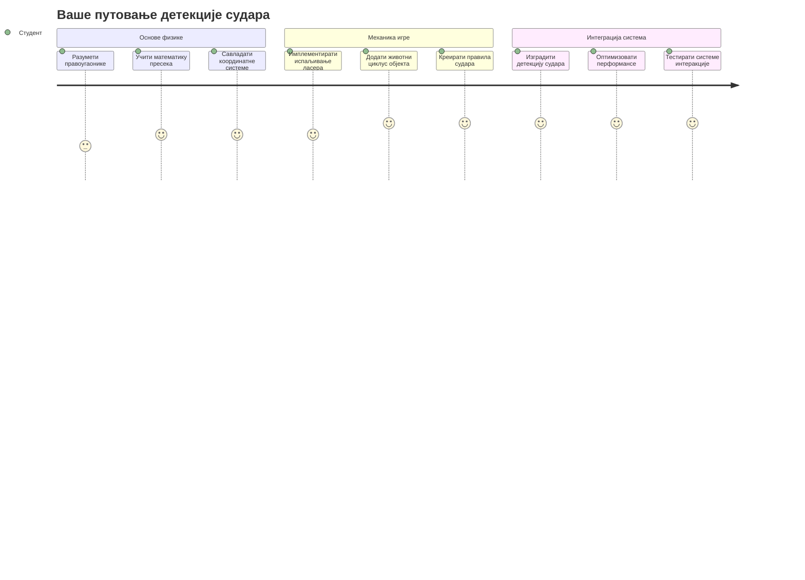
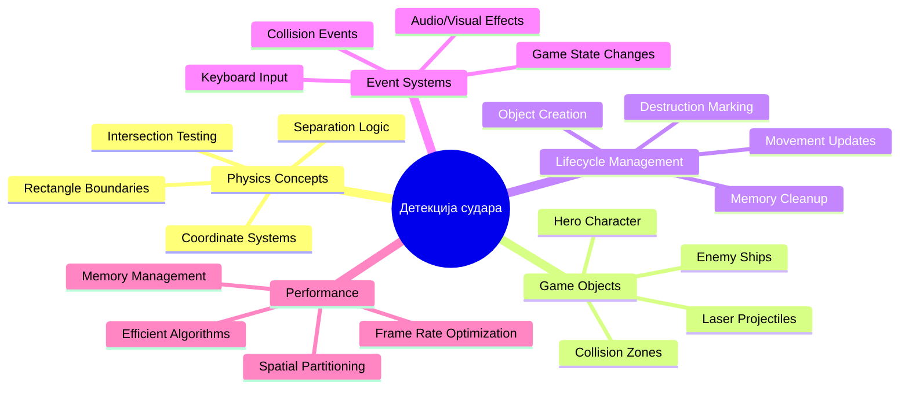
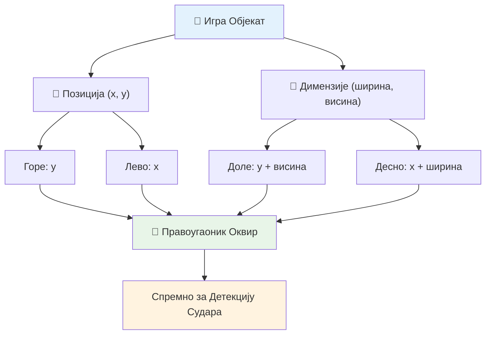
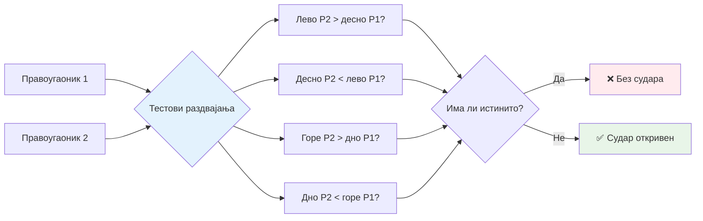
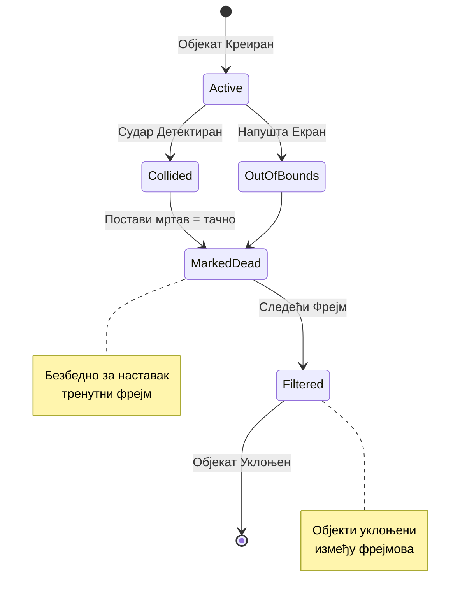
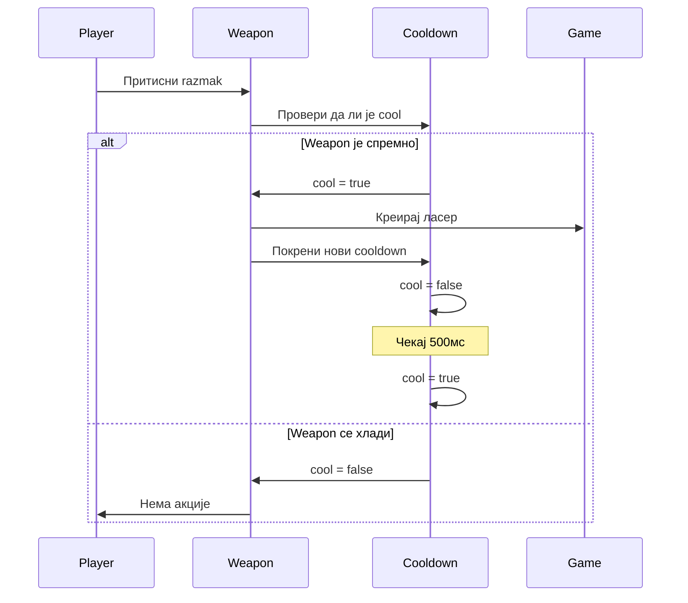
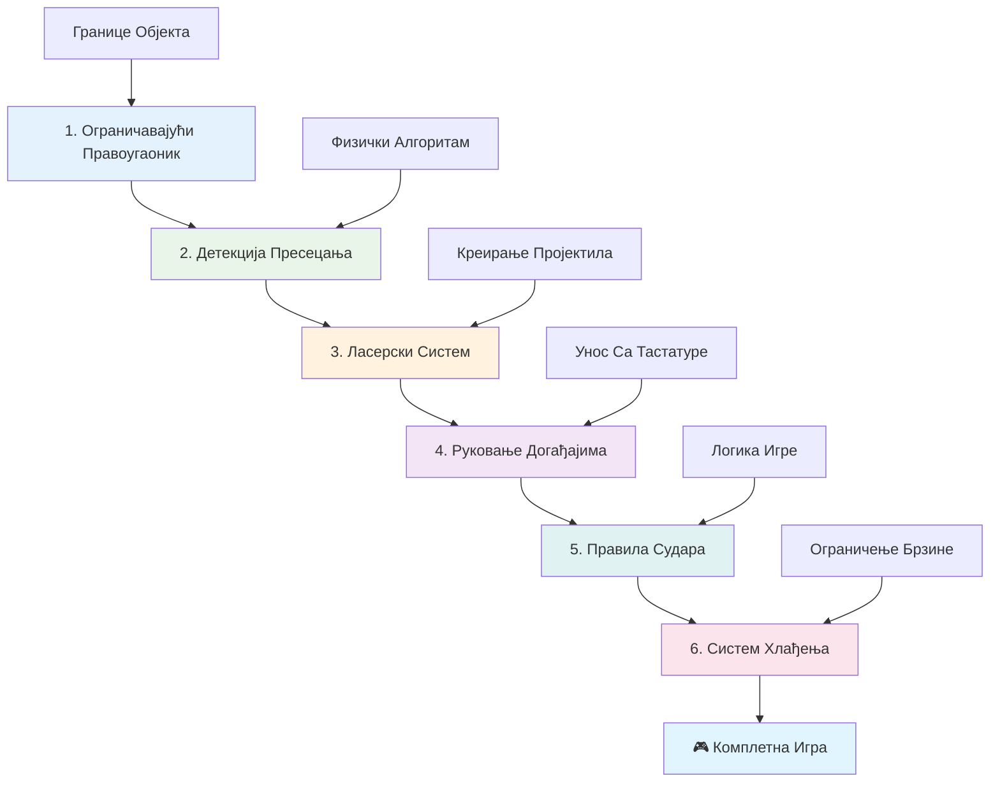
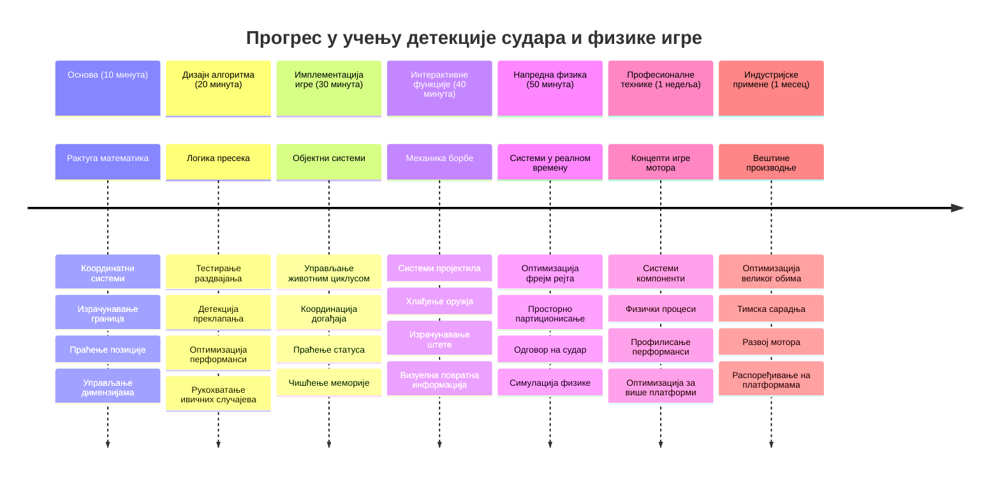

# Направи свемирску игру део 4: Додавање ласера и откривање судара


## Квиз пре предавања

[Квиз пре предавања](https://ff-quizzes.netlify.app/web/quiz/35)

Размислите о тренутку у Ратови звезда када је Лукова протонска торпеда погодила издувни отвор Звезде смрти. Та прецизна детекција судара променила је судбину галаксије! У играма, откривање судара ради на исти начин - одређује када се објекти додирују и шта се затим дешава.

У овом лекцији ћете додати ласерске оружје у вашу свемирску игру и имплементирати детекцију судара. Баш као што планери мисија НАСА-е израчунавају трајекторије свемирских летелица да би избегли отпад, научићете како да детектујете када се објекти у игри преклапају. Ово ћемо разбити у управљиве кораке који се надограђују један на други.

До краја, имаћете функционишући борбени систем у ком ласери уништавају непријатеље и сударања покрећу догађаје у игри. Исте основе детекције судара користе се у свему, од фізичких симулација до интерактивних веб интерфејса.


✅ Урадите мало истраживање о првој икада написаној рачунарској игри. Која је била њена функционалност?

## Детекција судара

Детекција судара ради као сензори близине на аполоновом лунарном модулу - стално проверава растојања и покреће упозорења када се објекти превише приближе. У играма, овај систем одређује када се објекти додирују и шта треба да се деси даље.

Приступ који ћемо користити третира сваки објекат у игри као правоугаоник, слично као што системи за контролу ваздушног саобраћаја користе поједностављене геометријске облике да прате авионе. Овај правоугаони метод може изгледати једноставно, али је рачунски ефикасан и добро функционише за већину сценарија у игри.

### Репрезентација правоугаоника

Сваком објекту у игри су потребне координате граница, слично као што ровера Марс Патхфиндер мапира позицију на површини Марса. Ево како дефинишемо ове координате граница:


```javascript
rectFromGameObject() {
  return {
    top: this.y,
    left: this.x,
    bottom: this.y + this.height,
    right: this.x + this.width
  }
}
```

**Разложимо ово:**
- **Горња ивица**: То је само место где објекат почиње вертикално (његова y позиција)
- **Лева ивица**: Где почиње хоризонтално (његова x позиција)
- **Доња ивица**: Додајте висину на y позицију – сад знате где се завршава!
- **Десна ивица**: Додајте ширину на x позицију – и добијате пуну границу

### Алгоритам пресека

Откривање пресека правоугаоника користи логику сличну оној како Хабл свемирски телескоп одређује да ли се небески објекти преклапају у свом видном пољу. Алгоритам проверава раздвајање:


```javascript
function intersectRect(r1, r2) {
  return !(r2.left > r1.right ||
    r2.right < r1.left ||
    r2.top > r1.bottom ||
    r2.bottom < r1.top);
}
```

**Тест раздвајања ради као радарски системи:**
- Да ли се правоугаоник 2 у потпуности налази десно од правоугаоника 1?
- Да ли се правоугаоник 2 у потпуности налази лево од правоугаоника 1?
- Да ли се правоугаоник 2 у потпуности налази испод правоугаоника 1?
- Да ли се правоугаоник 2 у потпуности налази изнад правоугаоника 1?

Ако ниједан од ових услова није тачан, правоугаоници морају бити преклопљени. Овај приступ одсликава како радари одређују да ли су два авиона на безбедној удаљености.

## Управљање животним циклусом објекта

Када ласер погоди непријатеља, оба објекта треба да буду уклоњена из игре. Међутим, брисање објеката током петље може изазвати падове – лекција научена на тежи начин у раним рачунарским системима као што је Apollo Guidance Computer. Уместо тога, користимо приступ „обележи за брисање“ који безбедно уклања објекте између кадрова.


Ево како обележавамо нешто за уклањање:

```javascript
// Обележи објекат за уклањање
enemy.dead = true;
```

**Зашто овај приступ функционише:**
- Обележавамо објекат као „мртав“, али га одмах не брисамо
- Ово дозвољава да тренутни фрејм у игри безбедно заврши
- Нема падања због коришћења нечега што више не постоји!

Затим филтрирамо обележене објекте пре наредног циклуса приказа:

```javascript
gameObjects = gameObjects.filter(go => !go.dead);
```

**Ова филтрација:**
- Креира свежу листу са само „живим“ објектима
- Одустаје од свега што је обележено као мртво
- Одржава вашу игру без проблема
- Спечава накупљање разорених објеката и превелике потрошње меморије

## Имплементирање ласерске механике

Ласерски пројектили у играма раде по истом принципу као фотонска торпеда у Стар Треку – то су дискретни објекти који путују правцем линије док не погоде нешто. Свако притискање тастера размак (spacebar) креира нови ласерски објекат који се креће преко екрана.

Да би ово функционисало, морамо усагласити неколико делова:

**Кључни делови за имплементацију:**
- **Креирај** ласерске објекте који се стварају са позициију хероја
- **Обрадити** унос са тастатуре за покретање креирања ласера
- **Управљање** кретањем и животним циклусом ласера
- **Имплементирати** визуелни приказ ласерских пројектила

## Имплементирање контроле учесталости пуцања

Неограничена учесталост пуцања би преплавила игру и учинила игру превише лаким. Прави оружани системи имају слична ограничења – чак су и фазери USS Enterprises требали време за пуњење између пуцњева.

Имплементираћемо систем хлађења који спречава спамовање док одржава контроле одзивним:


```javascript
class Cooldown {
  constructor(time) {
    this.cool = false;
    setTimeout(() => {
      this.cool = true;
    }, time);
  }
}

class Weapon {
  constructor() {
    this.cooldown = null;
  }
  
  fire() {
    if (!this.cooldown || this.cooldown.cool) {
      // Креирај ласерски пројектил
      this.cooldown = new Cooldown(500);
    } else {
      // Даље хлађење оружја није завршено
    }
  }
}
```

**Како ради хлађење:**
- Када се створи, оружје је „вруће“ (не може још пуцати)
- Након истека времена хлађења постаје „хладно“ (спремно за пуцање)
- Пре пуцања проверавамо: „Да ли је оружје хладно?“
- Ово спречава кликање убрзано, а контроле остају одзивне

✅ Подсетите се лекције 1 из серијала свемирских игара за појам о хлађењима.

## Прављење система детекције судара

Проширићете свој постојећи код свемирске игре да бисте направили систем за детекцију судара. Као аутоматизовани систем за избегавање судара на Међународној Свемирској Станици, ваша игра ће стално пратити позиције објеката и реаговати на пресеке.

Почевши од кода из претходне лекције, додаш детекцију судара са одређеним правилима која регулишу интеракције објеката.

> 💡 **Про савет**: Ласерски спрајт је већ укључен у ваш фолдер с ресурсима и реферисан у коду, спреман за имплементацију.

### Правила судара која треба имплементирати

**Механика игре која се додаје:**
1. **Ласер погађа непријатеља**: Непријатељски објекат се уништава када га погоди ласерски пројектил
2. **Ласер погађа ивицу екрана**: Ласер се уклања када достигне горњу ивицу екрана
3. **Судар непријатеља и хероја**: Објекти се уништавају када се преклопе
4. **Непријатељ досегне дно**: Услов за крај игре када непријатељи стигну до дна екрана

### 🔄 **Педагошки преглед**
**Основе детекције судара**: Пре имплементације, уверите се да разумете:
- ✅ Како границе правоугаоника дефинишу зоне судара
- ✅ Зашто је тест раздвајања ефикаснији од израчунавања пресека
- ✅ Значај управљања животним циклусом објекта у свим петљама игре
- ✅ Како догађајно оријентисани системи координишу реакције на сударе

**Брзи самотест**: Шта би се десило ако бисте одмах брисали објекте уместо да их обележите?
*Одговор: Брисање током петље може изазвати падове или прескакање објеката у итерацији*

**Физичко разумевање**: Сада разумете:
- **Координатне системе**: Како положај и димензије праве границе
- **Логику пресека**: Математичке принципе иза детекције судара
- **Оптимизацију перформанси**: Зашто су ефикасни алгоритми важни у реалном времену
- **Управљање меморијом**: Безбедне шеме животног циклуса објеката

## Постављање развојног окружења

Добре вести – већ смо поставили већину основа за вас! Сви ваши ресурси игре и основна структура чекају у подфолдеру `your-work`, спремни да додате кул функције детекције судара.

### Структура пројекта

```bash
-| assets
  -| enemyShip.png
  -| player.png
  -| laserRed.png
-| index.html
-| app.js
-| package.json
```

**Разумевање структуре фајлова:**
- **Садржи** све слике спрајтова потребне за објекте у игри
- **Укључује** главни HTML документ и JavaScript апликациони фајл
- **Обезбеђује** конфигурацију пакета за локални развојни сервер

### Покретање развојног сервера

Идите у свој фолдер пројекта и покрените локални сервер:

```bash
cd your-work
npm start
```

**Овај низ команди:**
- **Премешта** у радни директоријум вашег пројекта
- **Покреће** локални HTTP сервер на `http://localhost:5000`
- **Сервира** ваше фајлове за игру ради тестирања и развоја
- **Омогућава** живи развој са аутоматским освежавањем

Отворите прегледач и идите на `http://localhost:5000` да бисте видели тренутно стање ваше игре са приказаним херојем и непријатељима.

### Имплементација корак по корак

Као систематски приступ који је НАСА користила за програмирање свемирске летелице Voyager, имплементираћемо детекцију судара метдолошки, градећи сваки део корак по корак.


#### 1. Додавање граница правоугаоника за сударе

Прво, научимо наше објекте у игри како да описују своје границе. Додајте ову методу у класу `GameObject`:

```javascript
rectFromGameObject() {
    return {
      top: this.y,
      left: this.x,
      bottom: this.y + this.height,
      right: this.x + this.width,
    };
  }
```

**Ова метода остварује:**
- **Креира** објекат правоугаоника са прецизним координатама граница
- **Израчунава** доњу и десну ивицу коришћењем позиције плус димензије
- **Враћа** објекат спреман за алгоритме детекције судара
- **Обезбеђује** стандардизован интерфејс за све објекте у игри

#### 2. Имплементирање детекције пресека

Сада направимо наш детектив судара – функцију која каже када се два правоугаоника преклапају:

```javascript
function intersectRect(r1, r2) {
  return !(
    r2.left > r1.right ||
    r2.right < r1.left ||
    r2.top > r1.bottom ||
    r2.bottom < r1.top
  );
}
```

**Овај алгоритам ради тако што:**
- **Тестира** четири услова раздвајања између правоугаоника
- **Враћа** `false` ако било који услов раздвајања важи
- **Индицира** судар када нема раздвајања
- **Користи** негацију за ефикасније тестирање пресека

#### 3. Имплементација ласерског система пуцања

Овде почиње узбуђење! Подесимо систем пуцања ласера.

##### Константе за поруке

Прво, дефинишемо неке типове порука да би различити делови наше игре могли комуницирати:

```javascript
KEY_EVENT_SPACE: "KEY_EVENT_SPACE",
COLLISION_ENEMY_LASER: "COLLISION_ENEMY_LASER",
COLLISION_ENEMY_HERO: "COLLISION_ENEMY_HERO",
```

**Ове константе обезбеђују:**
- **Стандардизују** имена догађаја у целој апликацији
- **Омогућују** доследну комуникацију између система игре
- **Спречавају** грешке у укуцавању при регистрацији руку на догађаје

##### Обрада уноса са тастатуре

Додајте детекцију притиска тастера размак (space) у слушаоца тастера:

```javascript
} else if(evt.keyCode === 32) {
  eventEmitter.emit(Messages.KEY_EVENT_SPACE);
}
```

**Овај хендлер уноса:**
- **Детектује** притиске на space key (код 32)
- **Емитује** стандардизовани догађај
- **Омогућује** одвојену логику пуцања

##### Постављање слушаоца догађаја

Региструјте понашање пуцања у функцији `initGame()`:

```javascript
eventEmitter.on(Messages.KEY_EVENT_SPACE, () => {
 if (hero.canFire()) {
   hero.fire();
 }
});
```

**Овај слушалац догађаја:**
- **Реагује** на догађаје притиска space тастера
- **Проверва** статус хлађења оружја
- **Покреће** креирање ласера када је дозвољено

Додајте обраду судара између ласера и непријатеља:

```javascript
eventEmitter.on(Messages.COLLISION_ENEMY_LASER, (_, { first, second }) => {
  first.dead = true;
  second.dead = true;
});
```

**Овај обрађивач судара:**
- **Прима** податке о догађају судара са оба објекта
- **Обележава** оба објекта за уклањање
- **Обезбеђује** правилно чишћење након судара

#### 4. Креирање Ласер класе

Имплементирајте ласерски пројектил који се креће узбрдо и управља својим животним циклусом:

```javascript
class Laser extends GameObject {
  constructor(x, y) {
    super(x, y);
    this.width = 9;
    this.height = 33;
    this.type = 'Laser';
    this.img = laserImg;
    
    let id = setInterval(() => {
      if (this.y > 0) {
        this.y -= 15;
      } else {
        this.dead = true;
        clearInterval(id);
      }
    }, 100);
  }
}
```

**Ова класа:**
- **Проширује** GameObject да би наследила основне функције
- **Поставља** одговарајуће димензије за ласерски спрајт
- **Креира** аутоматско кретање горе користећи `setInterval()`
- **Саморазграђује се** када досегне врх екрана
- **Управља** својим анимацијским тајмингом и чишћењем

#### 5. Имплементирање система за детекцију судара

Направите комплетну функцију за детекцију судара:

```javascript
function updateGameObjects() {
  const enemies = gameObjects.filter(go => go.type === 'Enemy');
  const lasers = gameObjects.filter(go => go.type === "Laser");
  
  // Тестирање судара ласера са непријатељем
  lasers.forEach((laser) => {
    enemies.forEach((enemy) => {
      if (intersectRect(laser.rectFromGameObject(), enemy.rectFromGameObject())) {
        eventEmitter.emit(Messages.COLLISION_ENEMY_LASER, {
          first: laser,
          second: enemy,
        });
      }
    });
  });

  // Уклањање уништених објеката
  gameObjects = gameObjects.filter(go => !go.dead);
}
```

**Овај систем судара:**
- **Филтрира** објекте по типу ради ефикаснијег тестирања
- **Тестира** сваки ласер за сваким непријатељем у претрази пресека
- **Емитује** догађаје судара када се пресек детектује
- **Чисти** уништене објекте након процесирања судара

> ⚠️ **Важно**: Додајте `updateGameObjects()` у главну петљу игре у `window.onload` да омогућите детекцију судара.

#### 6. Додавање система хлађења у класу Hero

Побољшајте класу Hero механиком пуцања и ограничењем учесталости:

```javascript
class Hero extends GameObject {
  constructor(x, y) {
    super(x, y);
    this.width = 99;
    this.height = 75;
    this.type = "Hero";
    this.speed = { x: 0, y: 0 };
    this.cooldown = 0;
  }
  
  fire() {
    gameObjects.push(new Laser(this.x + 45, this.y - 10));
    this.cooldown = 500;

    let id = setInterval(() => {
      if (this.cooldown > 0) {
        this.cooldown -= 100;
      } else {
        clearInterval(id);
      }
    }, 200);
  }
  
  canFire() {
    return this.cooldown === 0;
  }
}
```

**Разумевање проширене класе Hero:**
- **Иницијализује** тајмер хлађења на нулу (спремно за пуцање)
- **Креира** ласерске објекте позициониране изнад свемирског брода хероја
- **Поставља** период хлађења да спречи брзо пуцање
- **Смањује** тајмер хлађења интервалним ажурирањима
- **Обезбеђује** проверу статуса пуцања кроз методу `canFire()`

### 🔄 **Педагошки преглед**
**Потпуно разумевање система**: Потврдите своје знање о систему судара:
- ✅ Како границе правоугаоника омогућавају ефикасну детекцију судара?
- ✅ Зашто је управљање животним циклусом објеката критично за стабилност игре?
- ✅ Како систем хлађења спречава проблеме са перформансама?
- ✅ Коју улогу игра догађајно оријентисана архитектура у управљању сударима?

**Интеграција система**: Ваша детекција судара показује:
- **Математску прецизност**: Алгоритми за пресецање правоугаоника
- **Оптимизацију перформанси**: Ефикасне шеме тестирања судара
- **Управљање меморијом**: Безбедно креирање и уништавање објеката
- **Координацију догађаја**: Децоуплинг комуникације система
- **Обраду у реалном времену**: Циклусе ажурирања за сваки кадрова

**Професионални обрасци**: Имплементирали сте:
- **Раздвајање одговорности**: Физика, приказ и уноси раздвојени
- **Објектно оријентисани дизајн**: Наслеђивање и полиморфизам
- **Управљање стањем**: Праћење животног циклуса објеката и стања игре
- **Оптимизацију перформанси**: Ефикасни алгоритми за реално време

### Тестирање ваше имплементације

Ваша свемирска игра сада садржи потпуни систем детекције судара и борбену механику. 🚀 Тестирајте нове могућности:
- **Кретање** стрелицама за верификацију контроле кретања
- **Пуцање ласерима** тастером размак – приметите како хлађење спречава спамовање
- **Пратите судара** када ласери погађају непријатеље, што покреће уклањање
- **Проверите чишћење** уз нестајање уништених објеката из игре

Успешно сте имплементирали систем детекције судара користећи исте математичке принципе који воде навигацију и роботiku свемирских летелица.

### ⚡ **Шта можете урадити у наредних 5 минута**
- [ ] Отворите ДевТулс претраживача и поставите прекидаче кода у функцији за детекцију судара
- [ ] Покушајте да измените брзину ласера или кретање непријатеља да видите ефекте судара
- [ ] Експериментишите са различитим вредностима хлађења за тестирање брзине пуцања
- [ ] Додај `console.log` изјаве за праћење догађаја судара у реалном времену

### 🎯 **Шта можете постићи у овом сату**
- [ ] Завршити квиз после лекције и разумети алгоритме детекције судара
- [ ] Додати визуелне ефекте као што су експлозије када дође до судара
- [ ] Имплементирати различите типове пројектила са варијабилним својствима
- [ ] Креирати пауер-апове који привремено побољшавају способности играча
- [ ] Додати звучне ефекте како би судари били задовољнији

### 📅 **Ваш недељни програм физике**
- [ ] Завршити комплетну свемирску игру са уређеним системима судара
- [ ] Имплементирати напредне облика судара осим правоугаоника (круге, полигони)
- [ ] Додати системе честица за реалистичне ефекте експлозије
- [ ] Креирати сложено непријатељско понашање са избегавањем судара
- [ ] Оптимизовати детекцију судара за боље перформансе са множеством објеката
- [ ] Додати физичку симулацију као што су импулс и реалистично кретање

### 🌟 **Ваш месечни мајсторски ниво игре и физике**
- [ ] Правити игре са напредним физичким моторима и реалистичним симулацијама
- [ ] Учити 3Д детекцију судара и алгоритме просторне партиције
- [ ] Доприносити отвореним изворним библиотекама за физику и опен соурс играчким моторима
- [ ] Савладати оптимизацију перформанси за графички захтевне апликације
- [ ] Креирати образовни садржај о игри и детекцији судара
- [ ] Правити портфолио који приказује вештине напредног програмирања физике

## 🎯 Ваш временски план за мајсторство детекције судара


### 🛠️ Резиме вашег алата за физику у игри

Након завршетка ове лекције, сада сте савладали:
- **Математика судара**: Алгоритми за пресек правоугаоника и координатне системе
- **Оптимизацију перформанси**: Ефикасна детекција судара за апликације у реалном времену
- **Управљање животним циклусом објеката**: Безбедна креирања, ажурирања и рушења објеката
- **Архитектуру засновану на догађајима**: Раздвојени системи за одговор на судар
- **Интеграцију у игру**: Физичка ажурирања кадрова и координација рендеровања
- **Системи уноса**: Реактивне контроле са ограничењем учесталости и повратном информацијом
- **Управљање меморијом**: Ефикасне стратегије паулинга и чишћења објеката

**Апликације у стварном свету**: Ваше вештине детекције судара директно се примењују у:
- **Интерактивним симулацијама**: Научно моделирање и образовни алати
- **Дизајну корисничког интерфејса**: Превлачење и испуштање и детекција додира
- **Визуелизацији података**: Интерактивни графикони и кликабилни елементи
- **Мобилном развоју**: Препознавање додирних геста и обрада судара
- **Програмирању робота**: Планирање пута и избегавање препрека
- **Рачунарској графици**: Праћење зрака и просторни алгоритми

**Стечене професионалне вештине**: Сада можете:
- **Дизајнирати** ефикасне алгоритме за детекцију судара у реалном времену
- **Имплементирати** физичке системе који скалирају са сложеношћу објеката
- **Пронаћи грешке** у сложеним системима интеракције коришћењем математичких принципа
- **Оптимизовати** перформансе за различити хардвер и прегледаче
- **Архитектонски** градити одрживе системе игара користећи проверене дизајн шаблоне

**Развијени концепти у развоју игара**:
- **Физичка симулација**: Детекција судара и одговор у реалном времену
- **Инжењеринг перформанси**: Оптимизовани алгоритми за интерактивне апликације
- **Системи догађаја**: Раздвојена комуникација између компоненти игре
- **Управљање објектима**: Ефикасни шаблони животног циклуса за динамички садржај
- **Обрада уноса**: Реактивне контроле са одговарајућим повратним информацијама

**Следећи ниво**: Спремни сте за истраживање напредних физичких мотора као Matter.js, имплементацију 3Д детекције судара или прављење сложених система честица!

🌟 **Остварен циљ**: Направили сте комплетан систем интеракције заснован на физици са професионалном детекцијом судара!

## GitHub Copilot Agent изазов 🚀

Користите Agent режим да завршите следећи изазов:

**Опис:** Унапредите систем детекције судара тако што ћете имплементирати пауер-апове који се појављују насумично и пружају привремене способности када их херојска летелица покупи.

**Задатак:** Креирајте класу PowerUp која наслеђује GameObject и имплементирајте детекцију судара између хероја и пауер-апова. Додајте најмање два типа пауер-апова: један који повећава брзину паљбе (скраћује период између пуњења) и други који креира привремени штит. Укључите логику за појављивање пауер-апова на насумичним интервалима и позицијама.

---


## 🚀 Изазов

Додај експлозију! Погледај игре ресурсе у [the Space Art repo](../../../../6-space-game/solution/spaceArt/readme.txt) и покушај да додаш експлозију када ласер погоди ванземаљца

## Квиз после предавања

[Квиз после предавања](https://ff-quizzes.netlify.app/web/quiz/36)

## Преглед и самостално учење

Експериментиши са интервалима у својој игри до сада. Шта се дешава када их промениš? Прочитај више о [JavaScript временским догађајима](https://www.freecodecamp.org/news/javascript-timing-events-settimeout-and-setinterval/).

## Задатак

[Истражи сударе](assignment.md)

---

<!-- CO-OP TRANSLATOR DISCLAIMER START -->
**Ограничење одговорности**:
Овај документ је преведен помоћу АИ преводилачке услуге [Co-op Translator](https://github.com/Azure/co-op-translator). Иако тежимо прецизности, имајте у виду да аутоматски преводи могу садржати грешке или нетачности. Оригинални документ на свом изворном језику треба сматрати ауторитативним извором. За критичне информације препоручује се професионални људски превод. Нисмо одговорни за било каква неспоразума или погрешна тумачења настала коришћењем овог превода.
<!-- CO-OP TRANSLATOR DISCLAIMER END -->