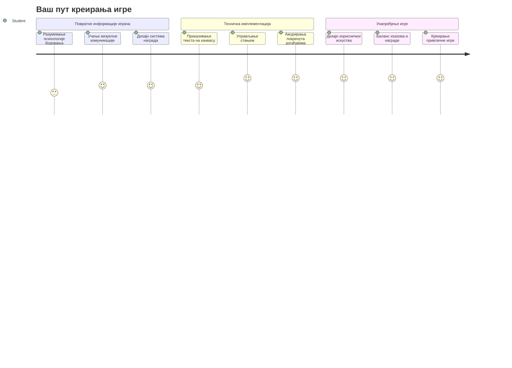
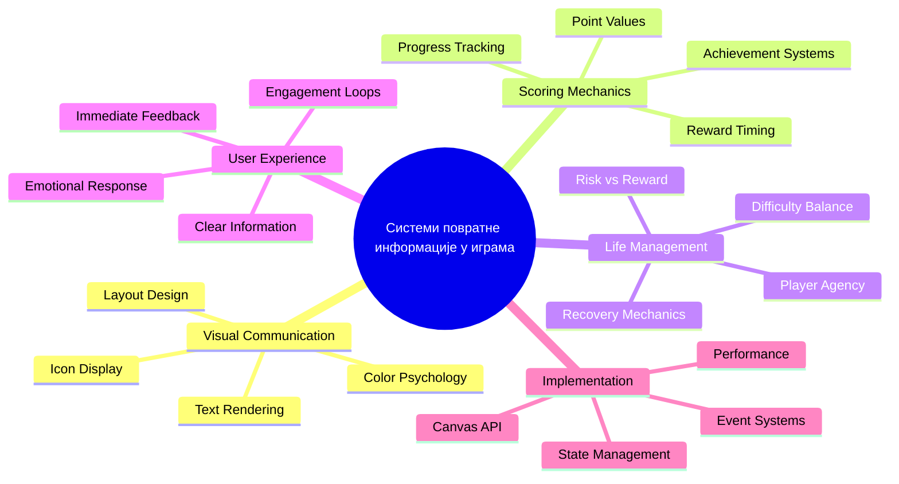
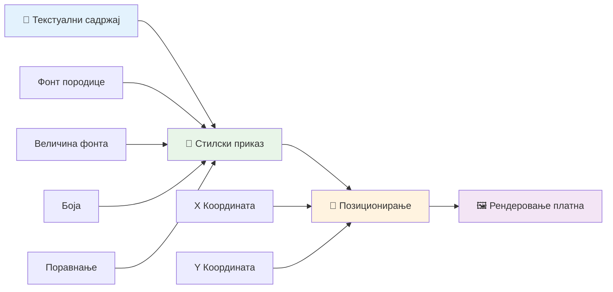
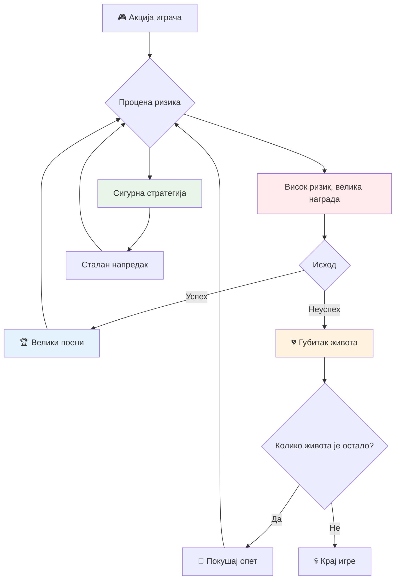
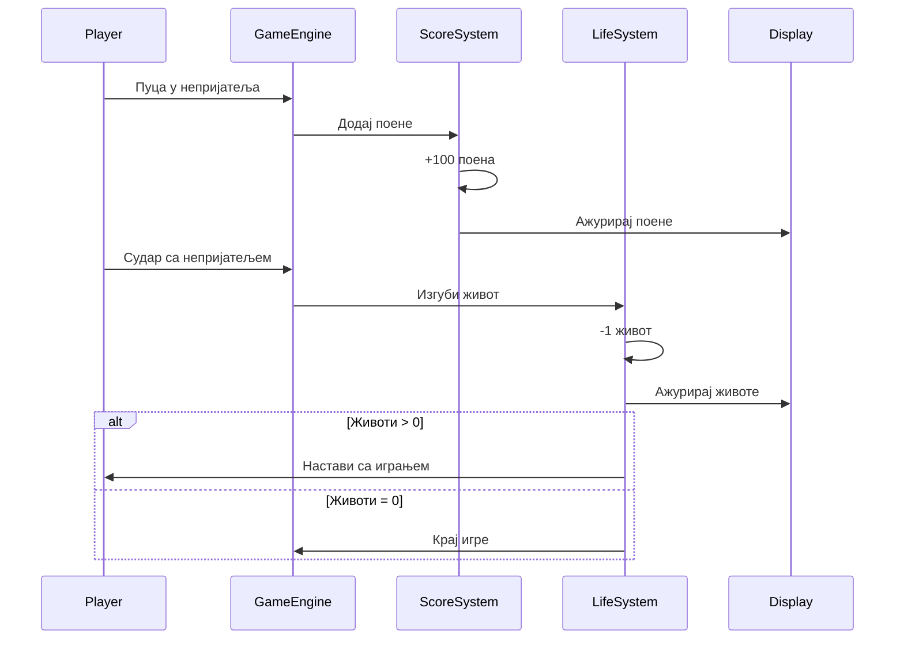
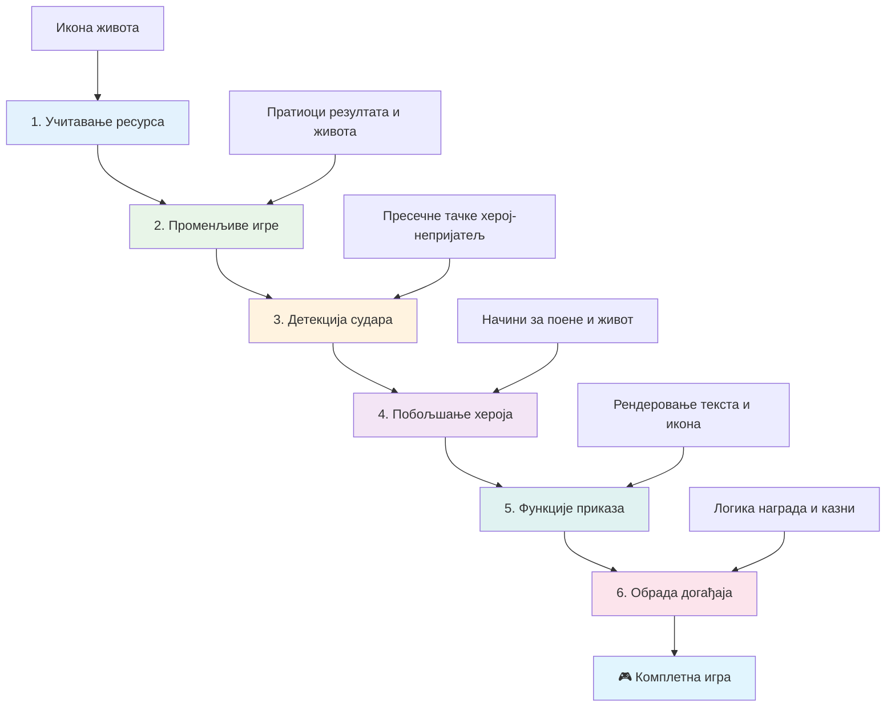
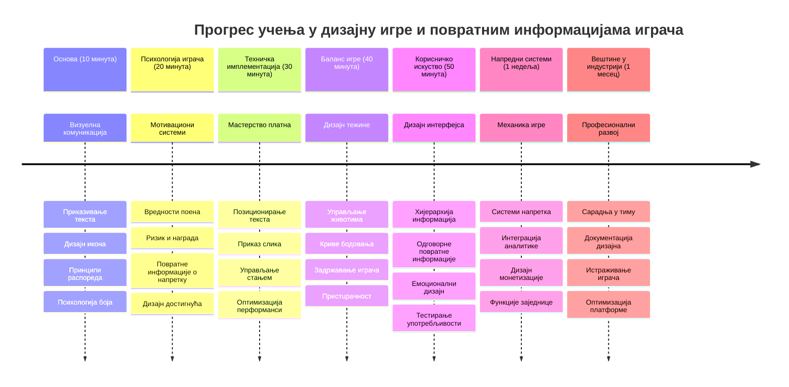

<!--
CO_OP_TRANSLATOR_METADATA:
{
  "original_hash": "2ed9145a16cf576faa2a973dff84d099",
  "translation_date": "2026-01-07T07:58:49+00:00",
  "source_file": "6-space-game/5-keeping-score/README.md",
  "language_code": "sr"
}
-->
# Изградња Свемирске Игре Deo 5: Бодовање и Животи


## Предпредавачки квиз

[Предпредавачки квиз](https://ff-quizzes.netlify.app/web/quiz/37)

Спремни да ваша свемирска игра заиста буде као права игра? Додајмо бодовање и управљање животима - основне механике које су ране аркадне игре као што је Space Invaders претвориле из једноставних демонстрација у зависничку забаву. Овде ваша игра постаје заиста играна.


## Цртање текста на екрану - глас ваше игре

Да бисмо приказали ваш резултат, морамо да научимо како да исцртамо текст на платну. Метода `fillText()` је ваш примарни алат за ово - истa техника која се користила у класичним аркадним играма за приказ резултата и статуса.


Имате пуну контролу над изгледом текста:

```javascript
ctx.font = "30px Arial";
ctx.fillStyle = "red";
ctx.textAlign = "right";
ctx.fillText("show this on the screen", 0, 0);
```

✅ Зароните дубље у [додавање текста на платно](https://developer.mozilla.org/docs/Web/API/Canvas_API/Tutorial/Drawing_text) - можда ћете бити изненађени колико можете бити креативни са фонтовима и стилизовањем!

## Животи - више од самог броја

У дизајну игара, „живот“ представља маргину грешке играча. Овај појам датира из пинбол машина, где сте добијали више лопти за игру. У раним видео играма као што је Asteroids, живот је давао играчима дозволу да преузимају ризике и уче из грешака.


Визуелни приказ има велики значај - приказивање иконица бродова уместо само „Животи: 3“ ствара тренутно визуелно препознавање, слично као што су рани аркадни ормарици користили иконографију да комуницирају преко језичких баријера.

## Изградња система награда ваше игре

Сада ћемо имплементирати основне системе повратних информација који одржавају играче ангажованим:


- **Систем бодовања**: Сваки уништени непријатељски брод доноси 100 поена (кругли бројеви су лакши за умно рачунање). Резултат се приказује у доњем левом углу.
- **Бројач живота**: Ваш херој почиње са три живота - стандард који су поставиле ране аркадне игре ради баланса између изазова и игрувости. Свако судар са непријатељем кошта један живот. Преостале животе приказујемо у доњем десном углу користећи иконе бродова .

## Хајде да почнемо са изградњом!

Прво, поставите свој радни простор. Идите до фајлова у вашем `your-work` подфолдеру. Требало би да видите ове фајлове:

```bash
-| assets
  -| enemyShip.png
  -| player.png
  -| laserRed.png
-| index.html
-| app.js
-| package.json
```

Да бисте тестирали игру, покрените развојни сервер из `your_work` фолдера:

```bash
cd your-work
npm start
```

Ово покреће локални сервер на `http://localhost:5000`. Отворите ову адресу у вашем прегледачу да видите игру. Тестирајте контроле стрелицама и испробајте пуцање у непријатеље да проверите да ли све ради.


### Време за кодирање!

1. **Пребаците визуелне ресурсе које ћете користити**. Копирајте појам `life.png` из папке `solution/assets/` у ваш `your-work` фолдер. Затим додајте lifeImg у вашу window.onload функцију:

    ```javascript
    lifeImg = await loadTexture("assets/life.png");
    ```

1. Немојте заборавити да додате `lifeImg` у вашу листу ресурса:

    ```javascript
    let heroImg,
    ...
    lifeImg,
    ...
    eventEmitter = new EventEmitter();
    ```
  
2. **Подесите променљиве ваше игре**. Додајте код за праћење укупног броја поена (поčinje од 0) и преосталих живота (поčinje од 3). Приказиваћемо их на екрану тако да играчи увек знају где се налазе.

3. **Имплементирајте детекцију судара**. Продужите вашу функцију `updateGameObjects()` да детектује када се непријатељи сударају са вашим херојем:

    ```javascript
    enemies.forEach(enemy => {
        const heroRect = hero.rectFromGameObject();
        if (intersectRect(heroRect, enemy.rectFromGameObject())) {
          eventEmitter.emit(Messages.COLLISION_ENEMY_HERO, { enemy });
        }
      })
    ```

4. **Додајте праћење живота и поена вашем Хероју**.
   1. **Иницијализујте бројаче**. Испод `this.cooldown = 0` у вашој класи `Hero`, подесите животе и поене:

        ```javascript
        this.life = 3;
        this.points = 0;
        ```

   1. **Прикажите ове вредности играчу**. Направите функције које исцртавају ове вредности на екрану:

        ```javascript
        function drawLife() {
          // УРАДИТИ, 35, 27
          const START_POS = canvas.width - 180;
          for(let i=0; i < hero.life; i++ ) {
            ctx.drawImage(
              lifeImg, 
              START_POS + (45 * (i+1) ), 
              canvas.height - 37);
          }
        }
        
        function drawPoints() {
          ctx.font = "30px Arial";
          ctx.fillStyle = "red";
          ctx.textAlign = "left";
          drawText("Points: " + hero.points, 10, canvas.height-20);
        }
        
        function drawText(message, x, y) {
          ctx.fillText(message, x, y);
        }

        ```

   1. **Повежите све у ваш game loop**. Додајте ове функције у вашу window.onload функцију одмах након `updateGameObjects()`:

        ```javascript
        drawPoints();
        drawLife();
        ```

### 🔄 **Педагошки преглед**
**Разумевање дизајна игре**: Пре него што имплементирате последице, уверите се да разумете:
- ✅ Какав визуелни повратак комуницира стање игре играчима
- ✅ Зашто доследан положај UI елемената побољшава употребљивост
- ✅ Психологију иза вредности поена и управљање животима
- ✅ Како се приказ текста на canvas разликује од HTML текста

**Брзи самотест**: Зашто аркадне игре обично користе кругле бројеве за вредности поена?
*Одговор: Кругли бројеви су лакши играчима за ментално израчунавање и стварају задовољавајуће психолошке награде*

**Принципи корисничког искуства**: Сада примењујете:
- **Визуелну хијерархију**: Важне информације постављене истакнуто
- **Одмах повратну информацију**: Ажурирања у реалном времену на акције играча
- **Когнитивно оптерећење**: Једноставна, јасна презентација информација
- **Емоционални дизајн**: Иконе и боје које стварају повезаност са играчем

1. **Имплементирајте последице и награде у игру**. Сада ћемо додати системе повратних информација који дају смисао акцијама играча:

   1. **Судари коштају животе**. Сваки пут када се ваш херој судари са непријатељем, изгубићете један живот.
   
      Додајте ову методу у вашу класу `Hero`:

        ```javascript
        decrementLife() {
          this.life--;
          if (this.life === 0) {
            this.dead = true;
          }
        }
        ```

   2. **Гађање непријатеља доноси бодове**. Свако успешно гађање доноси 100 поена, пружајући одмах позитиван повратак за прецизно пуцање.

      Продужите вашу класу Hero овом методом за увећање поена:
    
        ```javascript
          incrementPoints() {
            this.points += 100;
          }
        ```

        Сада повежите ове функције са вашем догађајима судара:

        ```javascript
        eventEmitter.on(Messages.COLLISION_ENEMY_LASER, (_, { first, second }) => {
           first.dead = true;
           second.dead = true;
           hero.incrementPoints();
        })

        eventEmitter.on(Messages.COLLISION_ENEMY_HERO, (_, { enemy }) => {
           enemy.dead = true;
           hero.decrementLife();
        });
        ```

✅ Занима вас још игара направљених у JavaScript-у и Canvas-у? Истражујте - можда ће вас изненадити шта је све могуће!

Након имплементације ових функција, тестирате игру да видите комплетан систем повратних информација у пракси. Требало би да видите иконе живота у доњем десном углу, бодове у доњем левом, и како се судари смањују животе док успешни хици повећавају резултат.

Ваша игра сада има суштинске механике које су ране аркадне игре учиниле тако привлачним - јасне циљеве, одмах повратне информације и смислене последице за акције играча.

### 🔄 **Педагошки преглед**
**Комплетан систем дизајна игре**: Проверите ваше познавање система повратних информација играча:
- ✅ Како механизми бодовања стварају мотивацију и ангажман играча?
- ✅ Зашто је визуелна конзистенција важна за дизајн корисничког интерфејса?
- ✅ Како систем живота балансира изазов и задржавање играча?
- ✅ Какву улогу има одмах повратна информација у стварању задовољавајућег играчког искуства?

**Интеграција система**: Ваш систем повратних информација показује:
- **Дизајн корисничког искуства**: Јасна визуелна комуникација и хијерархија информација
- **Архитектура заснована на догађајима**: Реактивна ажурирања на акције играча
- **Управљање стањем**: Праћење и приказ динамичких података игре
- ** Владење Canvas-ом**: Приказ текста и позиционирање спрајтова
- **Психологија игара**: Разумевање мотивације и ангажовања играча

**Професионални обрасци**: Имплементирали сте:
- **MVC Архитектуру**: Раздвајање логике игре, података и презентације
- **Observer Pattern**: Ажурирања стања игре заснована на догађајима
- **Дизајн компоненти**: Поново употребљиве функције за приказ и логику
- **Оптимизацију перформанси**: Ефикасан приказ у game loop-у

### ⚡ **Шта можете урадити у наредних 5 минута**
- [ ] Експериментишите са различитим величинама и бојама фонта за приказ резултата
- [ ] Пробајте да промените вредности поена и видите како то утиче на осећај игре
- [ ] Додајте console.log изјаве за праћење када поени и животи мењају вредности
- [ ] Тестирајте ивичне случајеве као што је исцрпљивање живота или достигање високих резултата

### 🎯 **Шта можете постићи у току овог сата**
- [ ] Завршите пост-лекцијски квиз и разумите психологију дизајна игре
- [ ] Додајте звукове за бодовање и губитак живота
- [ ] Имплементирајте систем високог резултата користећи localStorage
- [ ] Направите различите вредности поена за различите типове непријатеља
- [ ] Додајте визуелне ефекте као што је тресање екрана при губитку живота

### 📅 **Ваш недељни пут у дизајну игара**
- [ ] Завршите целу свемирску игру са уређеним системима повратних информација
- [ ] Имплементирајте напредне механике бодовања као што су комбо множитељи
- [ ] Додајте достигнућа и откључиви садржај
- [ ] Направите системе прогресије тежине и балансирања
- [ ] Дизајнирајте корисничке интерфејсе за меније и екране завршетка игре
- [ ] Проучите друге игре да разумете механизме ангажовања

### 🌟 **Ваш месечни пут у мајсторству развоја игара**
- [ ] Правите целе игре са софистицираним системима прогресије
- [ ] Учите анализу игара и мерење понашања играча
- [ ] Доприноси у пројектима отвореног кода за развој игара
- [ ] Мајсторство напредних образаца дизајна и монетизације игара
- [ ] Креирајте едукативни садржај о дизајну игара и корисничком искуству
- [ ] Изградите портфолио који приказује вештине у дизајну и развоју игара

## 🎯 Времеплов вашег мајсторства дизајна игара


### 🛠️ Сажетак вашег сета алата за дизајн игара

Након завршетка овог часа, овладали сте:
- **Психологија играча**: Разумевање мотивације, ризика/нагaде и петљи ангажовања
- **Визуелна комуникација**: Ефикасан UI дизајн коришћењем текста, икона и распореда
- **Системи повратних информација**: Одговор у реалном времену на акције и догађаје
- **Управљање стањем**: Праћење и приказ динамичких података игре ефикасно
- **Приказ текста на Canvas-у**: Професионални приказ текста са стилом и позиционирањем
- **Интеграција догађаја**: Повезивање корисничких акција са значајним последицама у игри
- **Баланс игре**: Дизајн кривих тежине и система напредовања играча

**Примена у стварном свету**: Вештине дизајна игара директно се примењују у:
- **Дизајну корисничког интерфејса**: Креирање привлачних и интуитивних интерфејса
- **Развоју производа**: Разумевање мотивације корисника и повратних петљи
- **Едукативним технологијама**: Гамификација и системи учења
- **Визуелизацији података**: Чинећи сложене информације доступним и занимљивим
- **Развоју мобилних апликација**: Механика задржавања и дизајн корисничког искуства
- **Маркетиншким технологијама**: Разумевање понашања корисника и оптимизација конверзије

**Професионалне вештине које сте стекли**: Сада можете:
- **Дизајнирати** корисничка искуства која мотивишу и ангажују кориснике
- **Имплементирати** системе повратних информација који ефикасно воде понашање корисника
- **Уравнотежити** изазов и приступачност у интерактивним системима
- **Креирати** визуелну комуникацију која функционише кроз различите корисничке групе
- **Анализирати** понашање корисника и унапређивати дизајн

**Концепти развоја игара које сте савладали**:
- **Мотивација играча**: Разумевање шта покреће ангажовање и задржавање
- **Визуелни дизајн**: Креирање јасних, атрактивних и функционалних интерфејса
- **Интеграција система**: Повезивање више игара за кохерентно искуство
- **Оптимизација перформанси**: Ефикасан приказ и управљање стањем
- **Приступачност**: Дизајн прилагођен различитим нивоима вештине и потребама играча

**Следећи ниво**: Спремни сте за истраживање напредних образаца дизајна игара, имплементацију аналитичких система или проучавање монетизације игара и стратегија задржавања играча!

🌟 **Постигнуће одблокирано**: Направили сте комплетан систем повратних информација играча са професионалним принципима дизајна игара!

---

## Изазов GitHub Copilot агента 🚀

Користите Agent режим да завршите следећи изазов:

**Опис:** Побољшајте систем бодовања свемирске игре тако што ћете имплементирати функцију високог резултата са перзистентним складиштем и бонус бодовима.

**Упутство:** Направите систем високог резултата који чува најбољи резултат играча у localStorage. Додајте бонус поене за узастопне убиства непријатеља (комбо систем) и имплементирајте различите вредности поена за различите типове непријатеља. Укључите визуелни индикатор када играч оствари нови најбољи резултат и прикажите тренутни висок резултат на екрану игре.


## 🚀 Изазов

Сада имате функционалну игру са бодовањем и животима. Размислите које додатне функције могу побољшати играчко искуство.

## Квиз након предавања

[Квиз након предавања](https://ff-quizzes.netlify.app/web/quiz/38)

## Преглед и самосталан рад

Желите ли да истражите више? Истражите различите приступе бодовању и системима живота у играма. Постоје фасцинантни игре мотори као што је [PlayFab](https://playfab.com) који управљају бодовањем, листама лидера и напретком играча. Како би интеграција нечег сличног могла подићи вашу игру на виши ниво?

## Задатак

[Изградите игру са бодовима](assignment.md)

---

<!-- CO-OP TRANSLATOR DISCLAIMER START -->
**Одрицање од одговорности**:  
Овај документ је преведен коришћењем AI преводилачке услуге [Co-op Translator](https://github.com/Azure/co-op-translator). Иако тежимо тачности, молимо имајте у виду да аутоматизовани преводи могу садржати грешке или нетачности. Оригинални документ на његовом изворном језику треба сматрати ауторитативним извором. За критичне информације препоручује се професионални превод од стране људског преводиоца. Нисмо одговорни за било каква неспоразума или погрешне тумачења која могу произићи из употребе овог превода.
<!-- CO-OP TRANSLATOR DISCLAIMER END -->