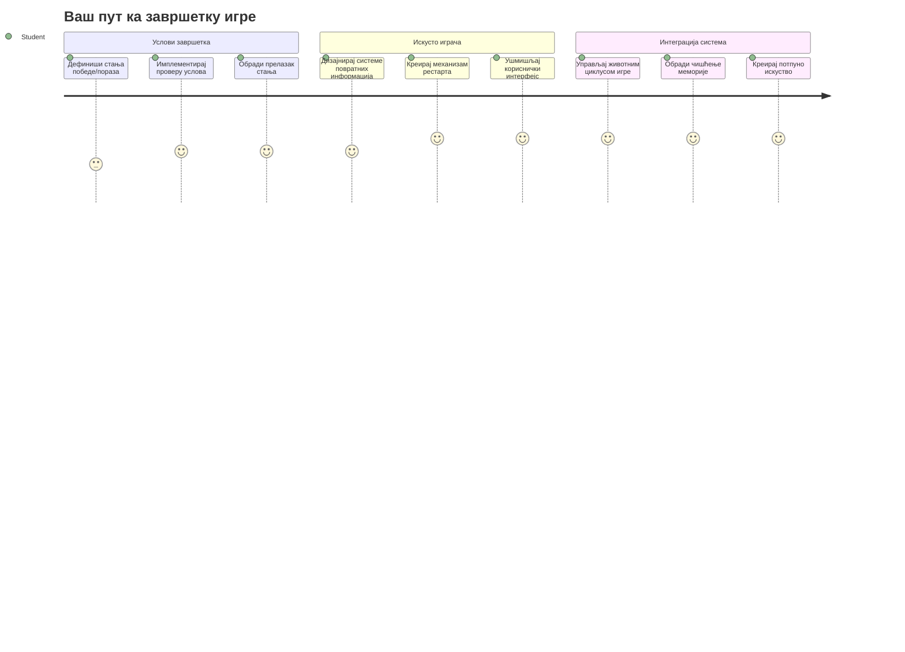
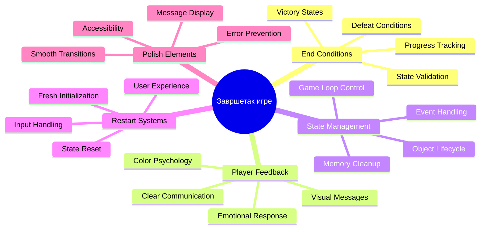
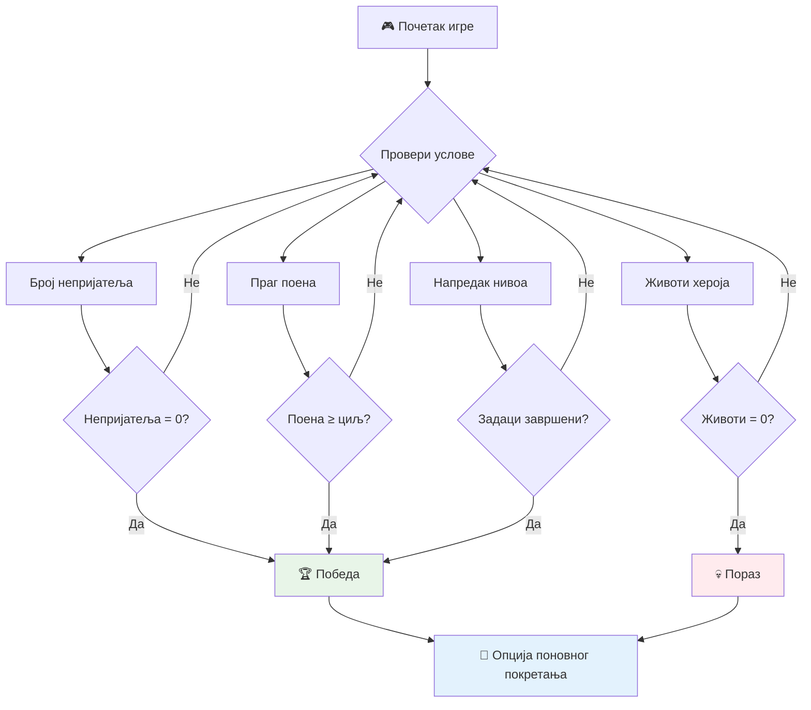
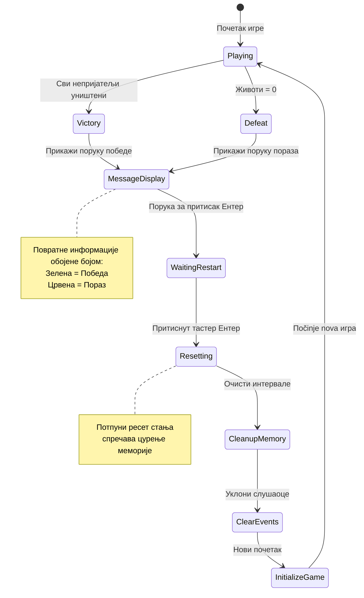
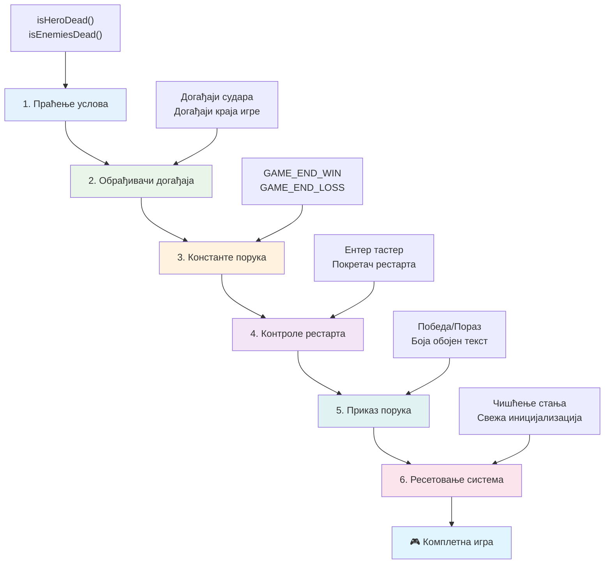
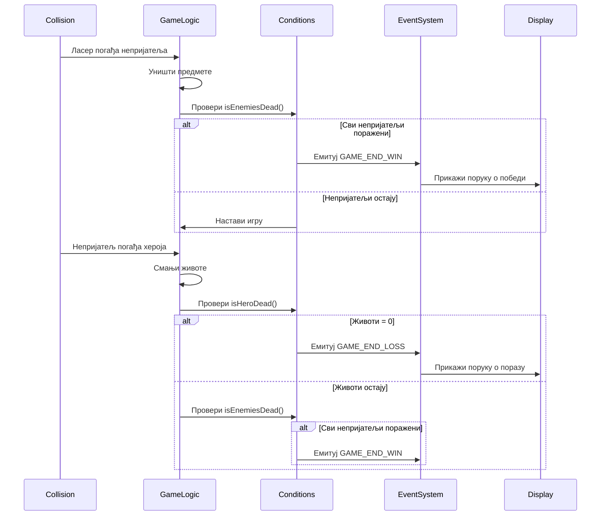
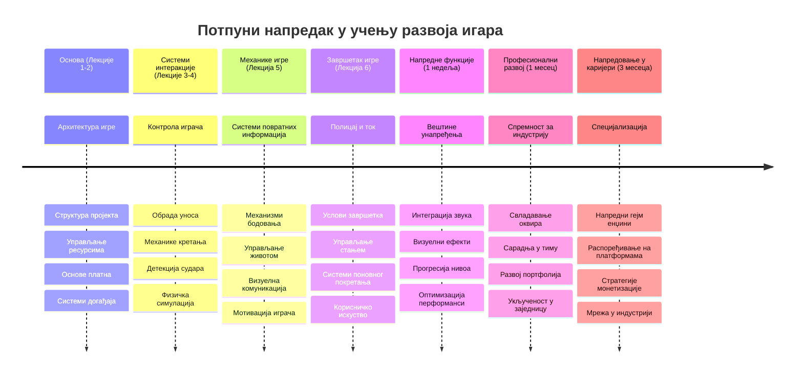

<!--
CO_OP_TRANSLATOR_METADATA:
{
  "original_hash": "a4b78043f4d64bf3ee24e0689b8b391d",
  "translation_date": "2026-01-07T07:57:19+00:00",
  "source_file": "6-space-game/6-end-condition/README.md",
  "language_code": "sr"
}
-->
# Изградите свемирску игру, део 6: Крај и поновни почетак


Свака велика игра треба јасне услове за крај и глатак механизам поновног покретања. Изградили сте импресивну свемирску игру са кретањем, борбом и бодовањем - сада је време да додате последње делове који је чине потпуном.

Ваша игра тренутно траје бесконачно, као што су били свемирски сонде Voyager које је NASA лансирала 1977. године - још увек путују кроз свемир деценијама касније. Док је то у реду за свемирска истраживања, игре требају дефинисане крајеве да би пружиле задовољавајућа искуства.

Данас ћемо имплементирати правилне услове за победу/пораз и систем поновног покретања. До краја ове лекције имаћете уређену игру коју играчи могу завршити и поново играти, баш као класичне аркадне игре које су дефинисале овај медиј.


## Претходни квиз

[Претходни квиз](https://ff-quizzes.netlify.app/web/quiz/39)

## Разумевање услова за крај игре

Када ваша игра треба да се заврши? Ово основно питање је обликовало дизајн игара још од ране аркадне ере. Pac-Man се завршава када вас ухвате духови или очистите све тачке, док Space Invaders завршава када ванземаљци стигну до дна или их све уништите.

Као креатор игре, дефинишете услове за победу и пораз. За нашу свемирску игру, ево проверених приступа који стварају занимљиву игру:


- **Јединице непријатеља `N` су уништене**: Веома је уобичајено да ако поделите игру у различите нивое, морате да уништите `N` непријатељских бродова да бисте завршили ниво
- **Ваш брод је уништен**: Постоје игре у којима губите игру ако вам брод буде уништен. Друга честа пракса је да имате концепт живота. Сваки пут када ваш брод буде уништен, један живот се одузима. Када изгубите све животе, губите игру.
- **Сакупили сте `N` поена**: Још један уобичајен услов краја је да сакупите поене. Како их добијате зависи од вас, али је често пракса да се поени додељују за разне активности као што је уништавање непријатељског брода или сакупљање предмета које предмети *испуштају* када се униште.
- **Завршите ниво**: Ово може укључивати неколико услова као што су уништење `X` непријатељских бродова, сакупљање `Y` поена или сакупљање одређеног предмета.

## Имплементација функције поновног покретања игре

Добре игре охрабрују поновну играње кроз глатке механизме поновног покретања. Када играчи заврше игру (или изгубе), често желе да одмах покушају поново - било да би побољшали резултат или унапредили учинак.


Tetris је савршен пример: када ваши блокови досегну врх, можете одмах започети нову игру без навигације кроз комплексан мени. Направићемо сличан систем поновног покретања који чисто ресетује стање игре и брзо враћа играче у акцију.

✅ **Рефлексија**: Размислите о играма које сте играли. Под којим условима се завршавају и како вам се нуди поновно покретање? Шта чини искуство поновног покретања глатким, а шта фрустрирајућим?

## Шта ћете изградити

Имплементираћете последње функционалности које ће вашу игру трансформисати у потпун играчки доживљај. Ови елементи разликују професионалне игре од основних прототипова.

**Ево шта данас додajемо:**

1. **Услов за победу**: Уништи све непријатеље и добиј одговарајућу прославу (заслужили сте!)
2. **Услов за пораз**: Потрошите све животе и суочите се са екраном пораза
3. **Механизам поновног покретања**: Притисните Enter да се одмах вратите у игру - јер једна игра никад није довољна
4. **Управљање стањем**: Чист почетак сваки пут - без остатака непријатеља или чудних грешака из претходне игре

## Почетак рада

Хајде да припремимо ваше развојно окружење. Требало би да имате све датотеке ваше свемирске игре из претходних лекција.

**Ваш пројекат треба да изгледа отприлике овако:**

```bash
-| assets
  -| enemyShip.png
  -| player.png
  -| laserRed.png
  -| life.png
-| index.html
-| app.js
-| package.json
```

**Покрените свој сервер за развој:**

```bash
cd your-work
npm start
```

**Ова команда:**
- Покреће локални сервер на `http://localhost:5000`
- Правилно сервира ваше фајлове
- Аутоматски освежава када направите промене

Отворите `http://localhost:5000` у вашем прегледачу и проверите да ли ваша игра ради. Требало би да можете да се крећете, пуцате и интерагујете са непријатељима. Када се уверите, можемо наставити са имплементацијом.

> 💡 **Корисни савет**: Да бисте избегли упозорења у Visual Studio Code, деклараишите `gameLoopId` на врху фајла као `let gameLoopId;` уместо да га деклараишете унутар функције `window.onload`. Ово прати модерне добре праксе декларације променљивих у JavaScript-у.


## Кораци имплементације

### Корак 1: Креирање функција за праћење услова краја

Потребне су нам функције које ће надгледати када игра треба да се заврши. Као сензори на Међународној свемирској станици који непрекидно прате критичне системе, ове функције ће стално проверавати стање игре.

```javascript
function isHeroDead() {
  return hero.life <= 0;
}

function isEnemiesDead() {
  const enemies = gameObjects.filter((go) => go.type === "Enemy" && !go.dead);
  return enemies.length === 0;
}
```

**Ево шта се дешава у позадини:**
- **Проверaва** да ли је наш јунак остао без живота (ау!)
- **Броји** колико непријатеља још увек живи и напада
- **Враћа** `true` када је бојно поље чисто од непријатеља
- **Користи** једноставну логику тачно/нетачно да све буде јасно
- **Филтрира** све објекте игре да нађе преживеле

### Корак 2: Ажурирање обрађивача догађаја за услове краја

Сада ћемо повезати ове проверe услова са системом догађаја игре. Сваки пут када се догоди колизија, игра ће проценити да ли је достигнут услов за крај. Ово прави тренутни повратни сигнал за критичне догађаје у игри.


```javascript
eventEmitter.on(Messages.COLLISION_ENEMY_LASER, (_, { first, second }) => {
    first.dead = true;
    second.dead = true;
    hero.incrementPoints();

    if (isEnemiesDead()) {
      eventEmitter.emit(Messages.GAME_END_WIN);
    }
});

eventEmitter.on(Messages.COLLISION_ENEMY_HERO, (_, { enemy }) => {
    enemy.dead = true;
    hero.decrementLife();
    if (isHeroDead())  {
      eventEmitter.emit(Messages.GAME_END_LOSS);
      return; // губитак пре победе
    }
    if (isEnemiesDead()) {
      eventEmitter.emit(Messages.GAME_END_WIN);
    }
});

eventEmitter.on(Messages.GAME_END_WIN, () => {
    endGame(true);
});
  
eventEmitter.on(Messages.GAME_END_LOSS, () => {
  endGame(false);
});
```

**Овде се догађа:**
- **Ласер погађа непријатеља**: Обојица нестају, добијате поене и проверавамо да ли сте победили
- **Непријатељ погађа вас**: Губите живот и проверавамо да ли сте још живи
- **Паметно редослед**: Прво проверавамо пораз (никако не желите да победите и изгубите истовремено!)
- **Тренутне реакције**: Чим се деси нешто важно, игра то одмах зна

### Корак 3: Додавање нових константи порука

Треба да додате нове типове порука у свој `Messages` константни објекат. Ове константе помажу у одржавању конзистентности и спречавању типографских грешака у систему догађаја.

```javascript
GAME_END_LOSS: "GAME_END_LOSS",
GAME_END_WIN: "GAME_END_WIN",
```

**У горе наведеном:**
- **Додали смо** константе за догађаје краја игре ради конзистентности
- **Користили смо** описна имена која јасно показују сврху догађаја
- **Пратили смо** постојећу конвенцију имена типова порука

### Корак 4: Имплементација контроле за поновни почетак

Сада ћете додати контроле тастатуре које играчима омогућавају да поново покрену игру. Тастер Enter је природан избор јер је уобичајено повезан са потврђивањем радњи и почетком нових игара.

**Додајте детекцију Enter тастера у свој постојећи слушач догађаја keydown:**

```javascript
else if(evt.key === "Enter") {
   eventEmitter.emit(Messages.KEY_EVENT_ENTER);
}
```

**Додајте нову константу поруке:**

```javascript
KEY_EVENT_ENTER: "KEY_EVENT_ENTER",
```

**Шта треба да знате:**
- **Проширење** постојећег система обраде тастатуре
- **Користи** Enter као тригер за поновни почетак ради интуитивног доживљаја корисника
- **Емитује** прилагођени догађај на који други делови игре могу да реагују
- **Одржава** исти образац као и за остале контроле на тастатури

### Корак 5: Креирање система приказа порука

Ваша игра треба да комуницира резултате јасно према играчима. Направићемо систем порука који приказује стања победе и пораза користећи текст у бојама, слично терминалима раних рачунарских система где је зелена значила успех, а црвена грешку.

**Направите функцију `displayMessage()`:**

```javascript
function displayMessage(message, color = "red") {
  ctx.font = "30px Arial";
  ctx.fillStyle = color;
  ctx.textAlign = "center";
  ctx.fillText(message, canvas.width / 2, canvas.height / 2);
}
```

**Корак по корак, ово се дешава:**
- **Поставља** величину и фамилију фонта за јасан, читљив текст
- **Примењује** параметар боје са „црвена“ као подразумеваном за упозорења
- **Центрира** текст хоризонтално и вертикално на платну
- **Користи** модерне подразумеване параметре JavaScript за флексибилност боја
- **Употребљава** canvas 2D контекст за директно цртање текста

**Направите функцију `endGame()`:**

```javascript
function endGame(win) {
  clearInterval(gameLoopId);

  // Поставите закашњење да бисте осигурали да се сви неисписани прикази заврше
  setTimeout(() => {
    ctx.clearRect(0, 0, canvas.width, canvas.height);
    ctx.fillStyle = "black";
    ctx.fillRect(0, 0, canvas.width, canvas.height);
    if (win) {
      displayMessage(
        "Victory!!! Pew Pew... - Press [Enter] to start a new game Captain Pew Pew",
        "green"
      );
    } else {
      displayMessage(
        "You died !!! Press [Enter] to start a new game Captain Pew Pew"
      );
    }
  }, 200)  
}
```

**Шта ова функција ради:**
- **Стапа** све на месту - више нема кретања бродова или ласера
- **Прави** кратку паузу (200ms) да последњи фрејм буде у потпуности исцртан
- **Брише** екран и фарба га у црно ради драматичног ефекта
- **Приказује** различите поруке за победнике и губитнике
- **Боји** информације – зелена за добро, црвена за... па, не баш добро
- **Казује** играчима како да се врате у игру

### 🔄 **Педагошки преглед**
**Управљање стањем игре**: Пре имплементације функције ресетовања, уверите се да разумете:
- ✅ Како услови краја стварају јасне циљеве у игри
- ✅ Зашто је визуелни повратни сигнал важан за разумевање играча
- ✅ Колико је значајно правилно чишћење да би се спречиле цурења меморије
- ✅ Како архитектура заснована на догађајима омогућава чисте трансакције стања

**Кратки само-тест**: Шта би се десило ако не обришете слушаче догађаја током ресетовања?
*Одговор: Цурења меморије и дуплих обрада догађаја што доводи до непредвидивог понашања*

**Принципи дизајна игара**: Сада имплементирате:
- **Јасне циљеве**: Играч зна тачно шта значи победа и пораз
- **Одмах повратни сигнал**: Промене у стању игре се моментално приказују
- **Контрола корисника**: Играч може поново покренути кад год жели
- **Поузданост система**: Правилно чишћење спречава грешке и падове перформанси

### Корак 6: Имплементација функције ресетовања игре

Систем ресетовања мора у потпуности очистити тренутно стање игре и иницијајлизовати свежу сесију игре. Ово осигурава да играчи имају чист почетак без остатака података из претходне игре.

**Направите функцију `resetGame()`:**

```javascript
function resetGame() {
  if (gameLoopId) {
    clearInterval(gameLoopId);
    eventEmitter.clear();
    initGame();
    gameLoopId = setInterval(() => {
      ctx.clearRect(0, 0, canvas.width, canvas.height);
      ctx.fillStyle = "black";
      ctx.fillRect(0, 0, canvas.width, canvas.height);
      drawPoints();
      drawLife();
      updateGameObjects();
      drawGameObjects(ctx);
    }, 100);
  }
}
```

**Разумевање сваког дела:**
- **Проверава** да ли је тренутно покренут game loop пре ресетовања
- **Брише** постојећи game loop да заустави сву текућу активност
- **Уклања** све слушаче догађаја да спречи цурења меморије
- **Поново иницијајлизује** стање игре новим објектима и променљивима
- **Покреће** нови game loop са свим кључним играчким функцијама
- **Задржава** исти интервал од 100ms за доследне перформансе игре

**Додајте слушача за Enter тастер у вашу функцију `initGame()`:**

```javascript
eventEmitter.on(Messages.KEY_EVENT_ENTER, () => {
  resetGame();
});
```

**Додајте методу `clear()` у своју класу EventEmitter:**

```javascript
clear() {
  this.listeners = {};
}
```

**Кључне појединости за памћење:**
- **Повезује** притисак на Enter са функцијом ресетовања игре
- **Региструје** слушача током иницијализације игре
- **Обезбеђује** чист начин за уклањање свих слушача приликом ресетовања
- **Спречава** цурења меморије чишћењем хендлера између игара
- **Ресетује** објекат слушача у празно стање за свежу инициализацију

## Честитамо! 🎉

👽 💥 🚀 Успешно сте направили комплетну игру од почетка до краја. Као и програмери првих видео игара из 1970-их, претворили сте редове кода у интерактивно искуство са исправним играчким механикама и повратним информацијама за корисника. 🚀 💥 👽

**Постигли сте:**
- **Имплементирали** потпуне услове победе и пораза са корисничким повратним информацијама
- **Креирали** глатак систем поновног покретања за континуирано играње
- **Дизајнирали** јасну визуелну комуникацију стања игре
- **Управљали** сложеним променама стања игре и чишћењем
- **Саставили** све компоненте у кохерентну, играчку целину

### 🔄 **Педагошки преглед**
**Систем за комплетни развој игре**: Прославите своје овладавање целокупним циклусом развоја игре:
- ✅ Како услови краја стварају задовољавајућа искуства играча?
- ✅ Зашто је правилно управљање стањем кључно за стабилност игре?
- ✅ Како визуелни повратни сигнал унапређује разумевање играча?
- ✅ Коју улогу игра систем поновног покретања у задржавању играча?

**Мастеринг система**: Ваша комплетна игра показује:
- **Фулл-стакк развој игара**: Од графике до уноса и управљања стањем
- **Професионална архитектура**: Системи засновани на догађајима са исправним чишћењем
- **Дизајн корисничког искуства**: Јасан повратни сигнал и интуитивне контроле
- **Оптимизација перформанси**: Ефикасно рендеровање и управљање меморијом
- **Финиш и комплетност**: Сви детаљи који игру чине завршеном

**Вештине спремне за индустрију**: Имплементирали сте:
- **Архитектуру game loop-а**: Системе у реалном времену са конзистентним перформансама
- **Програмирање засновано на догађајима**: Децомпоновни системи који се ефикасно скалирају
- **Управљање стањем**: Сложено руковање подацима и животним циклусом
- **Дизајн корисничког интерфејса**: Јасна комуникација и одзивне контроле
- **Тестирање и отклањање грешака**: Итеративни развој и решавање проблема

### ⚡ **Шта можете урадити у наредних 5 минута**
- [ ] Играјте своју комплетну игру и тестирате све услове победе и пораза
- [ ] Експериментишете са различитим параметрима услова краја
- [ ] Покушајте да додате console.log изјаве за праћење промене стања игре
- [ ] Поделите игру са пријатељима и прикупите повратне информације

### 🎯 **Шта можете постићи у овом сату**
- [ ] Завршите квиз након лекције и размислите о свом путу развоја игре
- [ ] Додајте аудио ефекте за стања победе и пораза
- [ ] Имплементирајте додатне услове краја као што су временски лимити или бонус циљеви
- [ ] Креирајте различите нивое тежине са различитим бројем непријатеља
- [ ] Улепшајте визуелни изглед бољим фонтовима и бојама

### 📅 **Ваш недељни мајсторски курс развоја игара**
- [ ] Завршите унапређену свемирску игру са више нивоа и напредовањем
- [ ] Додајте напредне функције као што су појачања, различите врсте непријатеља и специјално оружје
- [ ] Креирајте систем високих резултата са перзистентном меморијом
- [ ] Дизајнирајте корисничке интерфејсе за меније, подешавања и опције игре
- [ ] Оптимизујте перформансе за различите уређаје и прегледаче
- [ ] Објавите игру онлајн и поделите је са заједницом
### 🌟 **Ваша месечна каријера у развоју игара**
- [ ] Направите више потпуних игара истражујући различите жанрове и механике
- [ ] Учење напредних оквира за развој игара као што су Phaser или Three.js
- [ ] Доприносите пројектима отвореног кода у развоју игара
- [ ] Проучавајте принципе дизајна игара и психологију играча
- [ ] Креирајте портфолио који приказује ваше вештине у развоју игара
- [ ] Повежите се са заједницом за развој игара и наставите са учењем

## 🎯 Ваш комплетан временски оквир за савладавање развоја игара


### 🛠️ Резиме Вашег комплетног алата за развој игара

Након завршетка целе ове серије свемирских игара, сада сте савладали:
- **Архитектуру игара**: Системи вођени догађајима, петље игара и управљање стањем
- **Програмирање графике**: Canvas API, приказивање спрајтова и визуелни ефекти
- **Системе уноса**: Руководење тастатуром, детекција судара и респонзивне контроле
- **Дизајн игара**: Повратне информације играчу, системи прогресије и механике ангажовања
- **Оптимизацију перформанси**: Ефикасан приказ, управљање меморијом и контрола фрејм рейта
- **Корисничко искуство**: Јасна комуникација, интуитивне контроле и дотеривање детаља
- **Професионалне шеме**: Чист код, технике отклањања грешака и организација пројеката

**Примена у реалном свету**: Ваше вештине развоја игара се директно односе на:
- **Интерактивне веб апликације**: Динамички интерфејси и системи у реалном времену
- **Визуелизацију података**: Анимиране графиконе и интерактивну графику
- **Образовне технологије**: Гамификација и ангажујућа искуства учења
- **Мобилни развој**: Интерakcije осетљиве на додир и оптимизација перформанси
- **Симулациони софтвер**: Физичке механизме и моделовање у реалном времену
- **Креативна индустрија**: Интерактивна уметност, забава и дигитална искуства

**Професионалне вештине које сте стекли**: Сада можете:
- **Архитектонски дизајнирати** сложене интерактивне системе од нуле
- **Отklonити грешке** у апликацијама у реалном времену користећи систематске приступе
- **Оптимизовати** перформансе за глатко корисничко искуство
- **Дизајнирати** ангажујуће корисничке интерфејсе и шеме интеракције
- **Сарадивати** ефикасно на техничким пројектима уз правилну организацију кода

**Савладане концепте развоја игара**:
- **Системи у реалном времену**: Петље игара, управљање фрејм рейтом и перформансе
- **Архитектура вођена догађајима**: Одвезани системи и пренос порука
- **Управљање стањем**: Сложено управљање подацима и животни циклус
- **Програмирање корисничког интерфејса**: Графика на Canvas-у и респонзивни дизајн
- **Теорија дизајна игара**: Психологија играча и механике ангажовања

**Следећи ниво**: Спремни сте да истражите напредне оквире за игре, 3D графику, мултиплејер системе или да се пребаците у професионалне улоге у развоју игара!

🌟 **Постигнуће откључано**: Завршили сте цео пут развоја игре и изграђени сте професионално квалитетно интерактивно искуство од нуле!

**Добродошли у заједницу за развој игара!** 🎮✨

## GitHub Copilot Agent изазов 🚀

Користите Agent режим за завршетак следећег изазова:

**Опис:** Побољшајте свемирску игру имплементирајући систем прогресије нивоа са повећавањем тежине и бонус функцијама.

**Захтев:** Направите мулти-ниво свемирски систем у којем сваки ниво има више непријатељских бродова са повећаном брзином и здрављем. Додајте множитеља резултата који се повећава са сваким нивоом и имплементирајте пајер-апове (као што су брзо пуцање или штит) који се случајно појављују када се непријатељи униште. Укључите бонус за завршетак нивоа и прикажите тренутни ниво на екрану уз постојећи резултат и животе.

Сазнајте више о [agent mode](https://code.visualstudio.com/blogs/2025/02/24/introducing-copilot-agent-mode) овде.

## 🚀 Опциони изазов за унапређење

**Додајте звук вашој игри**: Побољшајте своје играчко искуство имплементирањем звучних ефеката! Размислите да додате аудио за:

- **Ласерске исецаје** када играч пуца
- **Уништење непријатеља** када бродови буду погођени
- **Штету јунака** када играч прими ударце
- **Музику победе** када игра буде освоја
- **Звук пораза** када игра буде изгубљена

**Пример имплементације звука:**

```javascript
// Креирајте аудио објекте
const laserSound = new Audio('assets/laser.wav');
const explosionSound = new Audio('assets/explosion.wav');

// Репродукујте звуке током догађаја у игри
function playLaserSound() {
  laserSound.currentTime = 0; // Ресетујте на почетак
  laserSound.play();
}
```

**Шта треба да знате:**
- **Креира** Audio објекте за различите звучне ефекте
- **Ресетује** `currentTime` да би омогућио брзе звучне ефекте
- **Решава** политике аутоматске репродукције прегледача покретањем звукова из корисничких интеракција
- **Управља** јачином звука и тајмингом за боље играчко искуство

> 💡 **Ресурс за учење**: Истражите овај [аудио sandbox](https://www.w3schools.com/jsref/tryit.asp?filename=tryjsref_audio_play) да бисте сазнали више о имплементацији звука у JavaScript играма.

## Квиз након предавања

[Квиз након предавања](https://ff-quizzes.netlify.app/web/quiz/40)

## Ревизија и самоучење

Ваш задатак је да направите свежу пример игру, па истражите неке од занимљивих игара да бисте видели какву игру бисте можда могли направити.

## Задатак

[Направите пример игру](assignment.md)

---

<!-- CO-OP TRANSLATOR DISCLAIMER START -->
**Одрицање од одговорности**:  
Овај документ је преведен помоћу AI сервиса за превођење [Co-op Translator](https://github.com/Azure/co-op-translator). Иако се трудимо да превод буде прецизан, молимо вас да имате у виду да аутоматски преводи могу садржати грешке или нетачности. Оригинални документ на његовом матерњем језику треба сматрати званичним извором. За кључне информације препоруучује се професионални превод од стране стручног лојалног преводиоца. Нисмо одговорни за било каква неразумевања или погрешне тумачења која проистекну из употребе овог превода.
<!-- CO-OP TRANSLATOR DISCLAIMER END -->