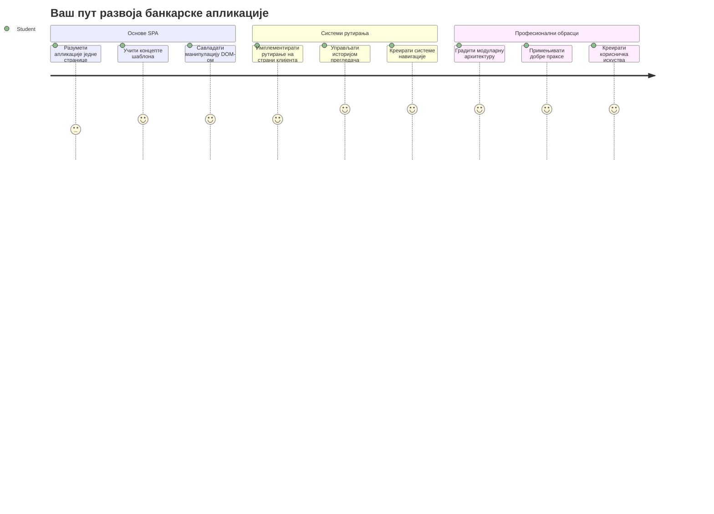
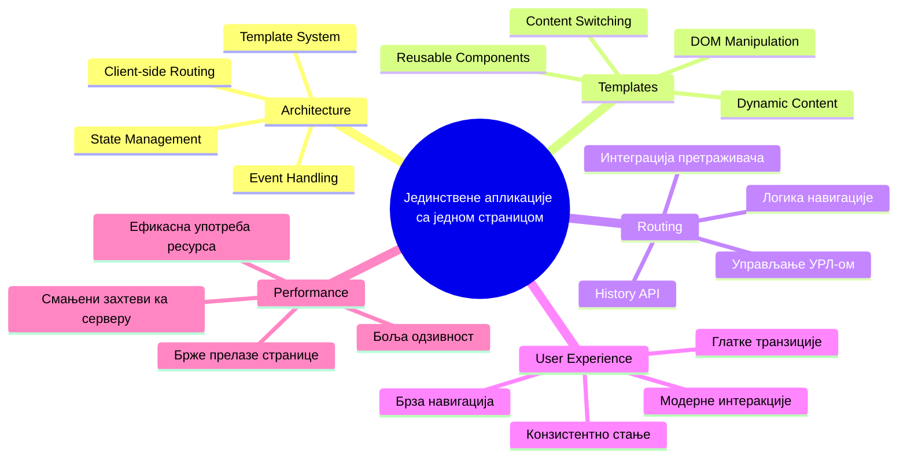
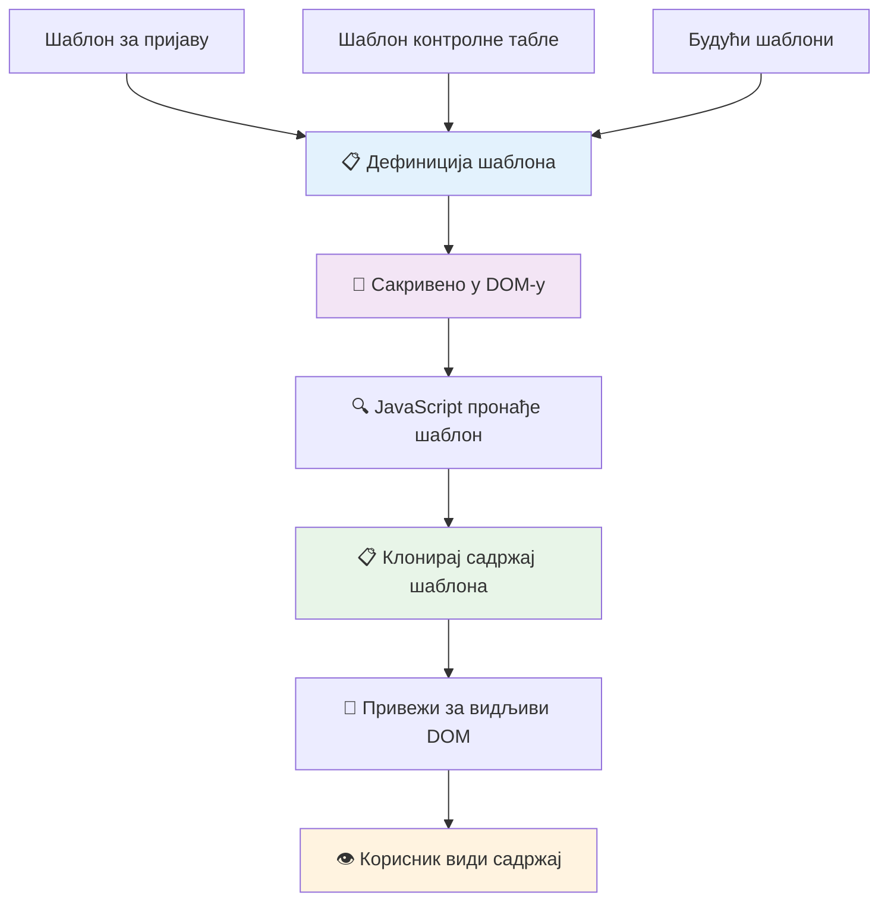
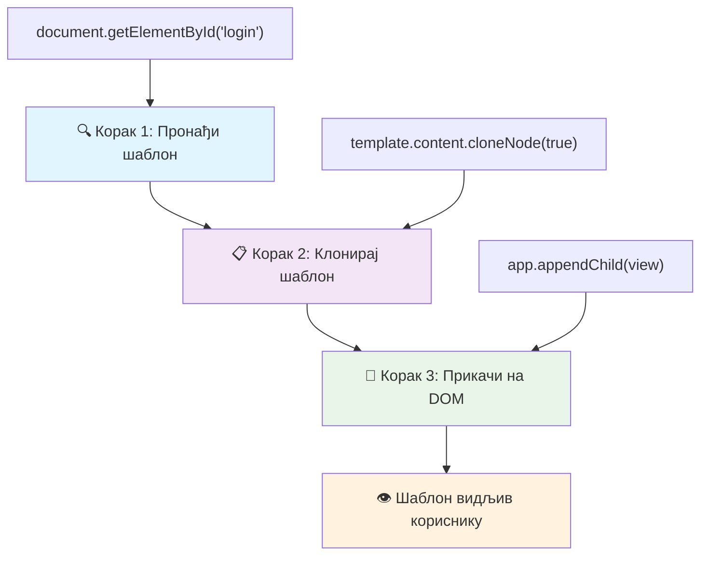
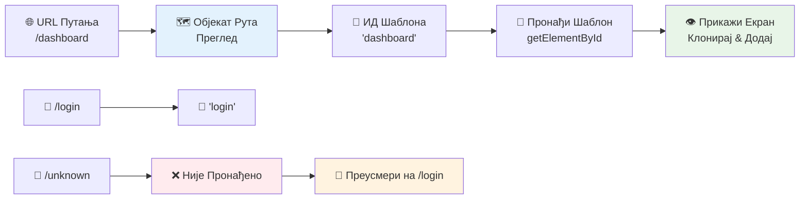
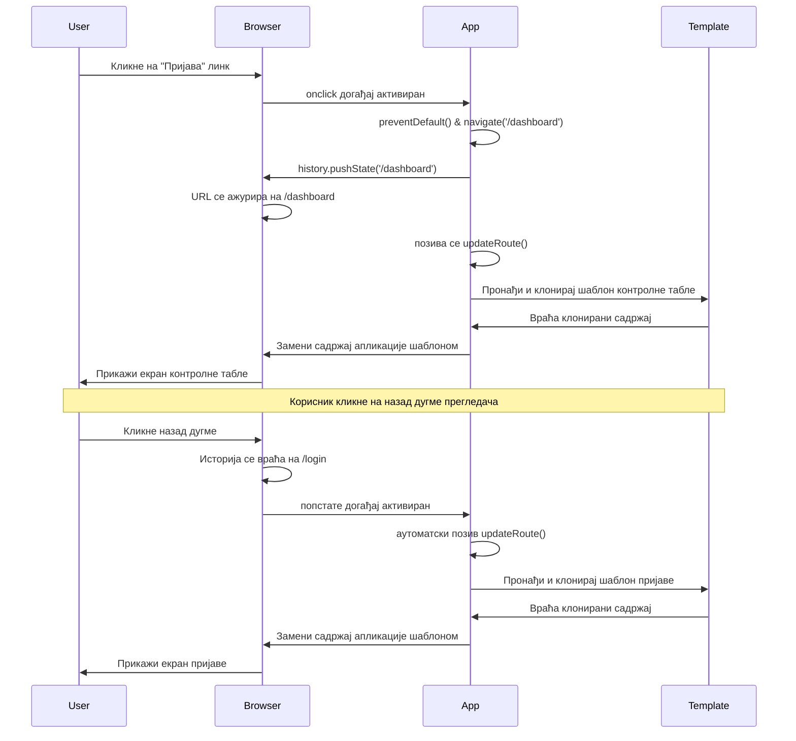
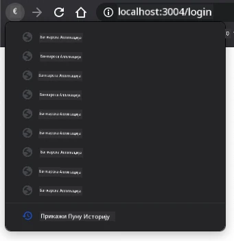
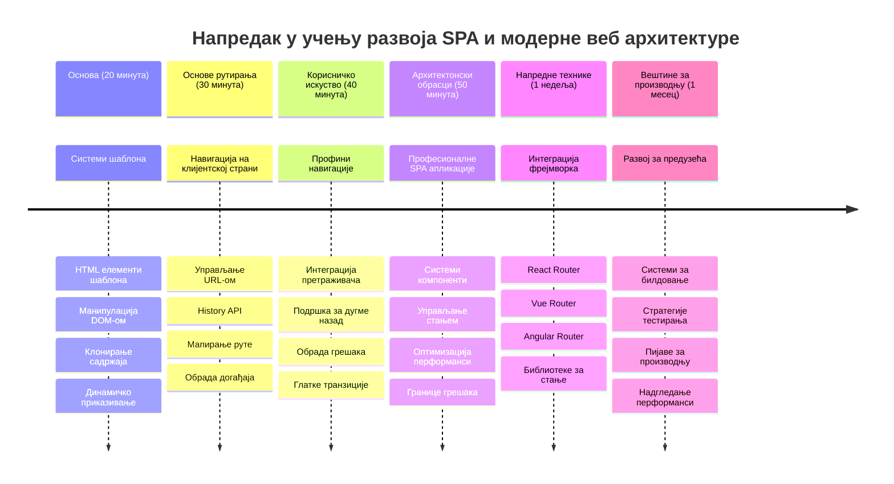

# Израда банковне апликације део 1: HTML шаблони и руте у веб апликацији


Када је оријентациони рачунар Аполо 11 навигационо усмеравао на Месец 1969. године, морао је да пребацује између различитих програма без поновног покретања целог система. Савремене веб апликације функционишу слично – промене оно што видите без поновног учитавања свега из почетка. Ово ствара глатко, одзивно искуство које корисници данас очекују.

За разлику од традиционалних сајтова који поново учитавају целе странице за сваку интеракцију, модерне веб апликације ажурирају само делове који захтевају промену. Овај приступ, баш као што контрола мисије пребацује између различитих приказа уз одржавање константне комуникације, ствара оно течемо искуство које смо навикли да очекујемо.

Ево шта прави драматичну разлику:

| Традиционалне мултипејџ апликације | Модерне једнопејџ апликације |
|----------------------------|-------------------------|
| **Навигација** | Поновно учитавање целе странице за сваки екран | Инстантно пребацивање садржаја |
| **Перформансе** | Спорије због потпуног преузимања HTML-а | Брже са делимичним ажурирањима |
| **Корисничко искуство** | Непријатни поздравни флеџеви на страници | Глатки, апликацијски прелази |
| **Дељење података** | Тешко између страница | Лако управљање стањем |
| **Развој** | Више HTML фајлова за одржавање | Један HTML са динамичким шаблонима |

**Разумевање еволуције:**
- **Традиционалне апликације** захтевају упите серверу за сваки корак навигације
- **Модерне Једнопејџ апликације (СПА)** учитавају једном и динамички мењају садржај користећи JavaScript
- **Корисничка очекивања** сада фаворизују тренутне и беспрекорне интеракције
- **Предности перформанси** укључују смањени саобраћај и брже одговоре

У овој лекцији, направићемо банковну апликацију са више екрана који се беспрекорно надовезују. Баш као што научници користе модуларне инструменте који се могу реконфигурисати за различите експерименте, користићемо HTML шаблоне као поновно употребљиве компоненте које могу бити приказане по потреби.

Радићете са HTML шаблонима (поновно употребљивим плановима за различите екране), JavaScript рутингом (систем који пребацује између екрана), и API-јем историје прегледача (који омогућава да дугме назад функционише како треба). Ово су исте фундаменталне технике које користе оквири као што су React, Vue, и Angular.

До краја, имаћете радну банковну апликацију која демонстрира професионалне принципе једнопејџ апликације.


## Пре теста предавања

[Тест предавања](https://ff-quizzes.netlify.app/web/quiz/41)

### Шта ћете морати имати

Потребан нам је локални веб сервер да бисмо тестирали нашу банковну апликацију – не брините, лакше је него што звучи! Ако већ немате један постављен, само инсталирајте [Node.js](https://nodejs.org) и покрените `npx lite-server` из вашег пројект фолдера. Ова корисна команда покреће локални сервер и аутоматски отвара вашу апликацију у прегледачу.

### Припрема

На вашем рачунару направите фасциклу под називом `bank` у коју убаците фајл по имену `index.html`. Почећемо са овим HTML [бојлерплејтом](https://en.wikipedia.org/wiki/Boilerplate_code):

```html
<!DOCTYPE html>
<html lang="en">
  <head>
    <meta charset="UTF-8">
    <meta name="viewport" content="width=device-width, initial-scale=1.0">
    <title>Bank App</title>
  </head>
  <body>
    <!-- This is where you'll work -->
  </body>
</html>
```

**Ово што овај бојлерплејт обезбеђује:**
- **Успоставља** HTML5 структуру документа са правилном DOCTYPE декларацијом
- **Конфигурише** енкодирање карактера као UTF-8 за међународну подршку текста
- **Омогућава** респонзивни дизајн преко viewport meta тега за мобилне уређаје
- **Поставља** описни наслов који се појављује на табу прегледача
- **Креира** чисто тело странице где ћемо градити нашу апликацију

> 📁 **Преглед структуре пројекта**
> 
> **До краја ове лекције, ваш пројекат ће садржати:**
> ```
> bank/
> ├── index.html      <!-- Main HTML with templates -->
> ├── app.js          <!-- Routing and navigation logic -->
> └── style.css       <!-- (Optional for future lessons) -->
> ```
> 
> **Одговорности фајлова:**
> - **index.html**: Садржи све шаблоне и пружа структуру апликације
> - **app.js**: Управља рутирањем, навигацијом и управљањем шаблонима
> - **Шаблони**: Дефинишу кориснички интерфејс за пријаву, контролни панел и остале екране

---

## HTML Шаблони

Шаблони решавају фундаментални проблем у веб развоју. Када је Гутенберг измислио покретни сликовни тип штампе 1440-их, схватио је да уместо вађења целих страна, може да направи поновно употребљиве словне блокове и распоређује их по потреби. HTML шаблони раде по истом принципу – уместо да стварате посебне HTML фајлове за сваки екран, дефинишете поновно употребљиве структуре које се могу приказати по потреби.


Размислите о шаблонима као о плановима за различите делове ваше апликације. Баш као што архитекта направи један план и користи га више пута уместо да поново црта идентичне просторије, ми једном креирамо шаблоне и инстанцирамо их по потреби. Прегледач држи ове шаблоне скривеним док их JavaScript не активира.

Ако желите да направите више екрана за једну веб страницу, једно од решења било би да направите један HTML фајл за сваки екран који желите да прикажете. Међутим, то решење има неколико непријатности:

- Морате поново учитавати цео HTML када прелазите са екрана на екран, што може бити споро.
- Тешко је делити податке између различитих екрана.

Други приступ је да имате само један HTML фајл и дефинишете више [HTML шаблона](https://developer.mozilla.org/docs/Web/HTML/Element/template) користећи елемент `<template>`. Шаблон је поновно употребљив HTML блок који прегледач не приказује, и који мора бити инстанциран у време извршавања коришћењем JavaScript-а.

### Хајде да га направимо

Правићемо банковну апликацију са два главна екрана: страницу за пријаву и контролни панел. Прво, додајмо елемент простора за приказ (placeholder) у тело нашег HTML-а — овде ће се појављивати сви наши различити екрани:

```html
<div id="app">Loading...</div>
```

**Разумевање овог преваземања (placeholder):**
- **Креира** контејнер са ID-јем "app" где ће се приказивати сви екрани
- **Приказује** поруку за учитавање док Javascript не иницијализује први екран
- **Обезбеђује** једну тачку за монтирање нашег динамичког садржаја
- **Омогућава** лако дохватање из JavaScript-а користећи `document.getElementById()`

> 💡 **Совет експерта**: Пошто ће садржај овог елемента бити замењен, можемо ставити поруку или индикатор учитавања која ће се показивати док апликација учитава.

Даље, додамо испод HTML шаблон за страницу за пријаву. За сада ћемо ставити само наслов и одељак који садржи везу којом ћемо извршавати навигацију.

```html
<template id="login">
  <h1>Bank App</h1>
  <section>
    <a href="/dashboard">Login</a>
  </section>
</template>
```

**Разломак овог шаблона за пријаву:**
- **Дефинише** шаблон са јединственим идентификатором "login" за добијање из JavaScript-а
- **Укључује** главни наслов који успоставља бренд апликације
- **Садржи** семантички `<section>` елемент за груписање сродног садржаја
- **Обезбеђује** навигациони линк који ће усмеравати кориснике ка контролном панелу

Затим ћемо додати још један HTML шаблон за страницу контролног панела. Ова страница ће садржати различите секције:

- Заглавље са насловом и линком за одјаву
- Тренутни стање рачуна у банци
- Листу трансакција приказану у табели

```html
<template id="dashboard">
  <header>
    <h1>Bank App</h1>
    <a href="/login">Logout</a>
  </header>
  <section>
    Balance: 100$
  </section>
  <section>
    <h2>Transactions</h2>
    <table>
      <thead>
        <tr>
          <th>Date</th>
          <th>Object</th>
          <th>Amount</th>
        </tr>
      </thead>
      <tbody></tbody>
    </table>
  </section>
</template>
```

**Разумевање сваког дела овог контролног панела:**
- **Структурира** страницу семантичким `<header>` елементом који садржи навигацију
- **Приказује** наслов апликације конзистентно преко свих екрана ради брендирања
- **Обезбеђује** линк за одјаву који води назад на екран за пријаву
- **Приказује** тренутан салдо рачуна у посебном одељку
- **Организује** податке о трансакцијама користећи правилно структурирану HTML табелу
- **Дефинише** заглавља табеле за колоне Датум, Објекат и Износ
- **Оставља** тело табеле празно за динамичко уметање садржаја касније

> 💡 **Совет експерта**: Када правите HTML шаблоне, ако желите да видите како ће изгледати, можете коментарисати `<template>` и `</template>` линије користећи `<!-- -->`.

### 🔄 **Педагошки преглед**
**Разумевање система шаблона**: Пре него што имплементирате JavaScript проверите да ли разумете:
- ✅ Како се шаблони разликују од уобичајених HTML елемената
- ✅ Зашто шаблони остају скривени док их JavaScript не активира
- ✅ Значај семантичке HTML структуре у шаблонима
- ✅ Како шаблони омогућавају поновну употребу UI компоненти

**Брзи самотест**: Шта се дешава ако уклоните `<template>` тагове око вашег HTML-а?
*Одговор: Садржај постаје одмах видљив и губи функцију шаблона*

**Предности архитектуре**: Шаблони пружају:
- **Поновну употребљивост**: Једна дефиниција, више инстанци
- **Перформансе**: Није потребно поновно парсирање HTML-а
- **Одрживост**: Централизована UI структура
- **Флексибилност**: Динамично пребацивање садржаја

✅ Зашто мислите да користимо атрибуте `id` на шаблонима? Да ли бисмо могли да употребимо нешто друго као класе?

## Оживљавање шаблона уз JavaScript

Сада треба да учинимо наше шаблоне функционалним. Баш као што 3Д штампач узима дигитални план и ствара физички објекат, JavaScript узима наше скривене шаблоне и креира видљиве, интерактивне елементе које корисници могу видети и користити.

Процес прати три конзистентна корака која чине темеље модерног веб развоја. Када разумете овај образац, препознаћете га у многим оквирима и библиотекама.

Ако пробате свој тренутни HTML фајл у прегледачу, видећете да заглави приказујући `Loading...`. То је зато што морамо додати неки JavaScript код да инстанцирамо и прикажемо HTML шаблоне.

Инстанцирање шаблона обично се ради у 3 корака:

1. Проналазак елемента шаблона у DOM-у, на пример коришћењем [`document.getElementById`](https://developer.mozilla.org/docs/Web/API/Document/getElementById).
2. Клонирање елемента шаблона, коришћењем [`cloneNode`](https://developer.mozilla.org/docs/Web/API/Node/cloneNode).
3. Прикључивање на DOM испод видљивог елемента, на пример коришћењем [`appendChild`](https://developer.mozilla.org/docs/Web/API/Node/appendChild).


**Визуелни приказ процеса:**
- **Корак 1** лоцира скривени шаблон у DOM структури
- **Корак 2** креира радну копију која се безбедно може мењати
- **Корак 3** убацује копију у видљиви део странице
- **Резултат** је функционалан екран са којим корисници могу интераговати

✅ Зашто је потребно клонирати шаблон пре него што га прикључимо у DOM? Шта мислите шта би се десило ако прескочимо овај корак?

### Задатак

Направите нови фајл по имену `app.js` у вашем пројект фолдеру и укључите тај фајл у `<head>` секцију вашег HTML-а:

```html
<script src="app.js" defer></script>
```

**Разумевање увоза овог скрипта:**
- **Повезује** JavaScript фајл са нашим HTML документом
- **Користи** атрибут `defer` да обезбеди да се скрипта изврши након што се HTML парсира
- **Омогућава** приступ свим DOM елементима пошто су потпуно учитани пре извршења скрипте
- **Праћење** савремених најбољих пракси учитавања скрипти и перформанси

Сада у `app.js` направићемо нову функцију `updateRoute`:

```js
function updateRoute(templateId) {
  const template = document.getElementById(templateId);
  const view = template.content.cloneNode(true);
  const app = document.getElementById('app');
  app.innerHTML = '';
  app.appendChild(view);
}
```

**Корак по корак, ево шта се дешава:**
- **Лоцира** елемент шаблона користећи његов јединствени ID
- **Креира** дубоку копију садржаја шаблона користећи `cloneNode(true)`
- **Пронађе** контејнер апликације где ће садржај бити приказан
- **Обрише** сваки постојећи садржај из контејнера апликације
- **Убаци** клонирани садржај шаблона у видљиви DOM

Сада позовите ову функцију са једним од шаблона и погледајте резултат.

```js
updateRoute('login');
```

**Оно што овај позив функције постиже:**
- **Активира** шаблон за пријаву преносом његовог ID као параметра
- **Демонстрира** како се програмски пребацује између различитих екрана апликације
- **Приказује** екран за пријаву уместо поруке "Loading..."

✅ Која је сврха ове линије кода `app.innerHTML = '';`? Шта се дешава без ње?

## Креирање рута

Рутација је у суштини повезивање URL-ова са правим садржајима. Размислите како су рани телефонски оператери користили спрежне табле да повезују позиве – узимали би долазни захтев и усмеравали га на исправну дестинацију. Веб рутирање функционише слично, узима URL захтев и одређује који садржај приказати.


Традиционално, веб сервери су то решавали тако што су служили различите HTML фајлове за различите URL-ове. Пошто правимо једнопејџ апликацију, морамо то сами решити са JavaScript-ом. Овај приступ нам даје већу контролу над корисничким искуством и перформансама.


**Разумевање протока рутирања:**
- **Промене URL-а** покрећу претрагу у нашој конфигурацији рута
- **Валидне руте** се мапирају на одређене ID-ове шаблона за приказ
- **Невалидне руте** изазивају резервно понашање да спрече кварове стања
- **Приказ шаблона** следи трех корака процес који смо раније научили

Када говоримо о веб апликацији, *рутирање* називамо намеру да се **URL-ови** повежу са специфичним екранима који треба да се прикажу. На сајту са више HTML фајлова, ово се аутоматски ради пошто су путање фајлова приказане у URL-у. На пример, са овим фајловима у вашем пројект фолдеру:

```
mywebsite/index.html
mywebsite/login.html
mywebsite/admin/index.html
```

Ако направите веб сервер са `mywebsite` као кореном, мапирање URL ће бити:

```
https://site.com            --> mywebsite/index.html
https://site.com/login.html --> mywebsite/login.html
https://site.com/admin/     --> mywebsite/admin/index.html
```

Међутим, за нашу веб апликацију користимо један HTML фајл који садржи све екране, па нам ово подразумевано понашање неће помоћи. Морамо ручно направити ову мапу и ажурирати приказани шаблон коришћењем JavaScript-а.

### Задатак

Користићемо једноставан објекат да имплементирамо [мапу](https://en.wikipedia.org/wiki/Associative_array) између URL путања и наших шаблона. Додајте овај објекат на врх вашег фајла `app.js`.

```js
const routes = {
  '/login': { templateId: 'login' },
  '/dashboard': { templateId: 'dashboard' },
};
```

**Разумевање ове конфигурације рута:**
- **Дефинише** мапирање између URL путева и идентификатора шаблона
- **Користи** синтаксу објекта где су кључеви URL путеви, а вредности садрже информације о шаблонима
- **Омогућава** лако проналажење који шаблон приказати за било који дати URL
- **Пружа** скалабилну структуру за додавање нових рута у будућности
Хајде сада мало да изменимо функцију `updateRoute`. Уместо да директно прослеђујемо `templateId` као аргумент, желимо прво да га добијемо тако што ћемо погледати тренутну URL адресу, а затим користити нашу мапу да добијемо одговарајућу вредност ID шаблона. Можемо користити [`window.location.pathname`](https://developer.mozilla.org/docs/Web/API/Location/pathname) да добијемо само део пута из URL-а.

```js
function updateRoute() {
  const path = window.location.pathname;
  const route = routes[path];

  const template = document.getElementById(route.templateId);
  const view = template.content.cloneNode(true);
  const app = document.getElementById('app');
  app.innerHTML = '';
  app.appendChild(view);
}
```

**Објашњење шта се овде дешава:**
- **Извлачи** тренутни пут из URL-а прегледача користећи `window.location.pathname`
- **Тражи** одговарајућу конфигурацију руте у нашем објекту рута
- **Добија** ID шаблона из конфигурације руте
- **Практикује** исти процес рендеровања шаблона као и раније
- **Прави** динамички систем који реагује на промене URL-а

Овде смо мапирали руте које смо декларисали на одговарајуће шаблоне. Можете пробати да промените URL ручно у прегледачу и проверите да ли ради исправно.

✅ Шта ће се десити ако унесете непознату путању у URL? Како бисмо то могли решити?

## Додавање навигације

Када имамо рутинг, корисницима је потребан начин да се крећу кроз апликацију. Традиционални веб-сајтови освежавају целе странице када се кликне на линкове, али ми желимо да ажурирамо и URL и садржај без освежавања странице. Ово ствара глаткије искуство слично томе како десктоп апликације пребацују између различитих приказа.

Треба да координирамо две ствари: ажурирање URL-а у прегледачу да корисници могу да означе странице и деле линкове и приказивање одговарајућег садржаја. Када је имплементирано исправно, ово ствара беспрекорну навигацију коју корисници очекују од модерних апликација.


### 🔄 **Педагошки преглед**
**Архитектура једностраничне апликације (SPA)**: Потврдите ваше разумевање целог система:
- ✅ Каква је разлика између рутирања са стране клијента и традиционалног рутирања на серверу?
- ✅ Зашто је History API непоходан за исправну SPA навигацију?
- ✅ Како шаблони омогућавају динамички садржај без освежавања странице?
- ✅ Коју улогу има управљање догађајима у пресретању навигације?

**Интеграција система**: Ваша SPA демонстрира:
- **Управљање шаблонима**: Поновно употребљиви UI компоненти са динамичким садржајем
- **Рутирање на страни клијента**: Управљање URL-ом без захтева серверу
- **Архитектуру вођену догађајима**: Респонзивна навигација и интеракције корисника
- **Интеграцију са претраживачем**: Подршка за историју и дугмад назад/напред
- **Оптимизацију перформанси**: Брзе транзиције и смањено оптерећење сервера

**Професионални обрасци**: Имплементирали сте:
- **Раздвајање модела и приказа**: Шаблони одвојени од логике апликације
- **Управљање стањем**: Синхронизација URL-а и приказаног садржаја
- **Прогресивно побољшање**: JavaScript побољшава основну HTML функционалност
- **Корисничко искуство**: Глатка навигација слична апликацијама без освежавања странице

> � **Увид у архитектуру**: Компоненте навигационог система
>
> **Шта градите:**
> - **🔄 Управљање URL-ом**: Ажурира адресну траку прегледача без освежавања
> - **📋 Систем шаблона**: Динамичка замена садржаја према тренутној рути  
> - **📚 Интеграција историје**: Одржава подршку за дугмад назад и напред
> - **🛡️ Управљање грешкама**: Фоллбек механизми за неважеће или нестале руте
>
> **Како компоненте раде заједно:**
> - **Слушају** догађаје навигације (кликови, промене историје)
> - **Ажурирају** URL користећи History API
> - **Рендерују** одговарајући шаблон за нову руту
> - **Одржавају** беспрекорно корисничко искуство

Следећи корак је да додамо могућност навигације између страница без потребе за ручним мењањем URL-а. То подразумева две ствари:

  1. Ажурирање тренутног URL-а
  2. Ажурирање приказаног шаблона према новом URL-у

Већ смо се позабавили другом тачком помоћу функције `updateRoute`, сада треба да смислимо како да ажурирамо тренутни URL.

Морамо да користимо JavaScript, а конкретно [`history.pushState`](https://developer.mozilla.org/docs/Web/API/History/pushState) која омогућава ажурирање URL-а и додавање новог уноса у историју прегледања без ре-учитавања HTML-а.

> ⚠️ **Важна напомена**: Иако се HTML елемент анкера [`<a href>`](https://developer.mozilla.org/docs/Web/HTML/Element/a) може користити самостално за хиперлинкове ка различитим URL-овима, он ће по подразумеваној поставци узроковати ре-учитавање странице. Потребно је спречити то понашање када рукујемо рутирањем помоћу прилагођеног JavaScript-а, користећи preventDefault() функцију на догађају клика.

### Задаци

Направимо нову функцију коју можемо користити за навигацију у нашој апликацији:

```js
function navigate(path) {
  window.history.pushState({}, path, path);
  updateRoute();
}
```

**Објашњење ове навигационе функције:**
- **Ажурира** URL прегледача на нову путању користећи `history.pushState`
- **Додаје** нови унос у тај стек историје прегледача за исправно коришћење дугмади назад/напред
- **Покреће** функцију `updateRoute()` да прикаже одговарајући шаблон
- **Одржава** искуство једностраничне апликације без освежавања странице

Овај метод прво ажурира тренутни URL заснован на датој путањи, а затим ажурира шаблон. Својство `window.location.origin` враћа корен URL-а, што нам омогућава реконструкцију комплетног URL-а из дате путање.

Сада када имамо ову функцију, можемо решити проблем ако путања не одговара ниједној дефинисаној рути. Модификоваћемо функцију `updateRoute` тако што ћемо додати фоллбек на једну од постојећих рута ако не можемо пронаћи поклапање.

```js
function updateRoute() {
  const path = window.location.pathname;
  const route = routes[path];

  if (!route) {
    return navigate('/login');
  }

  const template = document.getElementById(route.templateId);
  const view = template.content.cloneNode(true);
  const app = document.getElementById('app');
  app.innerHTML = '';
  app.appendChild(view);
}
```

**Кључне ствари за памћење:**
- **Проверава** да ли рута постоји за тренутну путању
- **Редиректује** на страницу за пријаву ако је рута неважећа
- **Обезбеђује** механизам фоллбека који спречава покварену навигацију
- **Гарантује** да корисници увек виде важећи екран, чак и са погрешним URL-овима

Ако рута не постоји, бићемо преусмерени на страницу `login`.

Хајде сада да направимо функцију која добија URL када се кликне на линк, и спречава подразумевано понашање прегледача:

```js
function onLinkClick(event) {
  event.preventDefault();
  navigate(event.target.href);
}
```

**Објашњење овог обработчика клика:**
- **Спречава** подразумевано понашање линка у прегледачу коришћењем `preventDefault()`
- **Извлачи** одредишни URL из кликнутог елемента линка
- **Позива** нашу прилагођену навигациону функцију уместо ре-учитавања странице
- **Одржава** глатко искуство једностраничне апликације

```html
<a href="/dashboard" onclick="onLinkClick(event)">Login</a>
...
<a href="/login" onclick="onLinkClick(event)">Logout</a>
```

**Шта ово повезивање onclick ради:**
- **Повезује** сваки линк са прилагођеним навигационим системом
- **Прослеђује** догађај клика нашој функцији `onLinkClick` на обраду
- **Омогућава** глатку навигацију без освежавања странице
- **Одржава** исправну структуру URL-а коју корисници могу означити или делити

Атрибут [`onclick`](https://developer.mozilla.org/docs/Web/API/GlobalEventHandlers/onclick) повезује догађај `click` са JavaScript кодом, овде позивом функције `navigate()`.

Пробајте да кликнете на ове линкове, требало би да сада можете да навигирате између различитих екрана ваше апликације.

✅ Метода `history.pushState` је део HTML5 стандарда и имплементирана у [свим модерним прегледачима](https://caniuse.com/?search=pushState). Ако развијате веб апликацију за старије прегледаче, постоји трик који можете користити као замену: коришћењем [хеша (`#`)](https://en.wikipedia.org/wiki/URI_fragment) пре путање можете имплементирати рутирање које ради уз редовну навигацију анкера и не ре-учитава страницу, јер је намењено прављењу интерних линкова унутар странице.

## Омогућавање рада дугмади за назад и напред

Дугмад назад и напред су основа веб прегледања, као што контролери мисија NASA-е могу прегледати прошла стања система током свемирских мисија. Корисници очекују да ова дугмад раде, и ако не раде, то нарушава очекивано искуство прегледања.

Наша једностранична апликација треба додатну конфигурацију да то подржи. Прегледач држи стек историје (који смо попуњавали са `history.pushState`), али када корисници пролазе кроз ту историју, наша апликација мора да реагује ажурирањем приказаног садржаја у складу са тим.


**Кључне интеракције:**
- **Корисничке акције** покрећу навигацију кликовима или дугмадима прегледача
- **Апликација пресреће** кликове на линкове да спречи освежавање странице
- **History API** управља променама URL-а и стеком историје прегледача
- **Шаблони** обезбеђују структуру садржаја за сваки екран
- **Слушаоци догађаја** осигуравају да апликација реагује на све типове навигације

Коришћењем `history.pushState` се креирају нови уноси у историји навигације прегледача. Можете то проверити тако што ћете држати *дугме назад* у вашем прегледачу, треба да видите нешто овако:



Ако више пута кликнете на дугме назад, видећете да се тренутни URL мења и историја се ажурира, али исти шаблон се наставља приказивати.

То је зато што апликација не зна да мора да позове `updateRoute()` сваки пут када се историја промени. Ако погледате документацију [`history.pushState`](https://developer.mozilla.org/docs/Web/API/History/pushState), видећете да ако се стање промени - односно ако смо прешли на други URL - покреће се догађај [`popstate`](https://developer.mozilla.org/docs/Web/API/Window/popstate_event). Искористићемо то да решимо овај проблем.

### Задаци

Да бисмо били сигурни да је приказани шаблон ажуриран када се промене историјски записи у прегледачу, додавамо нову функцију која позива `updateRoute()`. То ћемо урадити на дну нашег фајла `app.js`:

```js
window.onpopstate = () => updateRoute();
updateRoute();
```

**Објашњење ове интеграције са историјом:**
- **Слуша** догађаје `popstate` који се јављају када корисници навигирају са дугмадима прегледача
- **Користи** стреличну функцију за концизан синтакс у обради догађаја
- **Аутоматски позива** `updateRoute()` кад год се промени стање историје
- **Иницира** апликацију позивом `updateRoute()` при учитавању странице
- **Гарантује** да се приказује исправан шаблон без обзира како корисници навигирају

> 💡 **Професионални савет**: Овде смо користили [стреличну функцију](https://developer.mozilla.org/docs/Web/JavaScript/Reference/Functions/Arrow_functions) за дефинисање нашег обработчика догађаја `popstate` због концизности, али обична функција би радила на исти начин.

Ево освежавајућег видеа о стреличним функцијама:

[](https://youtube.com/watch?v=OP6eEbOj2sc "Arrow Functions")

> 🎥 Кликните слику горе за видео о стреличним функцијама.

Сада покушајте да користите дугмад назад и напред у вашем прегледачу и проверите да ли се приказана рута овога пута исправно ажурира.

### ⚡ **Шта можете урадити у наредних 5 минута**
- [ ] Тестирајте навигацију у вашој банкарској апликацији користећи дугмад назад/напред прегледача
- [ ] Покушајте ручно да унесете различите URL-ове у адресну траку за тестирање рутирања
- [ ] Отворите DevTools у прегледачу и испитајте како се шаблони клонирају у DOM
- [ ] Експериментишите са додавањем console.log изјава за праћење тока рутирања

### 🎯 **Шта можете постићи у овом сату**
- [ ] Завршите квиз након лекције и разумите SPA архитектонске концепте
- [ ] Додајте CSS стилове да ваше банкарске шаблоне изгледају професионално
- [ ] Имплементирајте страницу за 404 грешке са одговарајућим управљањем грешкама
- [ ] Креирајте страницу са заслугама са додатном функционалношћу рутирања
- [ ] Додајте стања учитавања и транзиције између замена шаблона

### 📅 **Ваш недељни план развоја SPA**
- [ ] Завршите комплетну банкарску апликацију са формама, управљањем подацима и перзистенцијом
- [ ] Додајте напредне функције рутирања као што су параметри руте и угнежђене руте
- [ ] Имплементирајте чувара навигације и рутирање засновано на аутентификацији
- [ ] Креирајте поновно употребљиве шаблонске компоненте и библиотеку компоненти
- [ ] Додајте анимације и транзиције за глатко корисничко искуство
- [ ] Дистрибуирајте ваш SPA на хостинг платформи и правилно конфигуришите рутирање

### 🌟 **Ваш месечни курс савладавања фронтенд архитектуре**
- [ ] Изградите сложене SPA користећи модерне фрејмворке као што су React, Vue или Angular
- [ ] Научите напредне обрасце управљања стањем и библиотеке
- [ ] Савладајте алате за градњу и развојне токове за SPA развој
- [ ] Имплементирајте функције Progressive Web App и офлајн подршку
- [ ] Истражите технике оптимизације перформанси за велики SPA
- [ ] Призначите доприносе пројектима отвореног кода SPA и делите своје знање

## 🎯 Једностранична апликација – ваша временска линија савладавања


### 🛠️ Резиме вашег SPA развојног алата

Након завршетка ове лекције, сада сте савладали:
- **Архитектура шаблона**: Поново употребљиви HTML компоненти са динамичким рендеровањем садржаја
- **Рутирање на страни клијента**: Управљање URL-ом и навигација без освежавања странице
- **Интеграција са прегледачем**: Коришћење History API и подршка за дугмад назад/напред
- **Системи вођени догађајима**: Управљање навигацијом и интеракцијама корисника
- **Манипулација DOM-ом**: Клонирање шаблона, промене садржаја и управљање елементима
- **Управљање грешкама**: Глатке алтернативе за неважеће руте и нестали садржај
- **Обрасци перформанси**: Ефикасно учитавање и стратегије рендеровања

**Примене у стварном свету**: Вештине развоја SPA-а примењују се директно на:
- **Модерне веб апликације**: React, Vue, Angular и други фрејмворкови
- **Прогресивне веб апликације**: Апликације које раде офлајн, с искуством као апликације
- **Бизнис контролне табле**: Комплексне пословне апликације са више приказа
- **Е-трговину**: Каталози производа, корпе за куповину и токови плаћања
- **Управљање садржајем**: Креирање и уређивање динамичких садржаја
- **Мобилни развој**: Хибридне апликације коришћењем веб технологија

**Професионалне вештине које сте стекли**: Сада можете:
- **Архитектура** једностранићних апликација са правилним одвајањем одговорности
- **Имплементирање** система за усмеравање на страни клијента који се скалирају са сложеношћу апликације
- **Отклањање грешака** у сложеним навигационим токовима коришћењем алата за развој у прегледачу
- **Оптимизација** перформанси апликације кроз ефикасно управљање шаблонима
- **Дизајн** корисничких искустава која делују нативно и одзивно

**Мастеризовани концепти фронтенд развоја**:
- **Архитектура компоненти**: Поново употребљиви UI обрасци и системи шаблона
- **Синхронизација стања**: Управљање URL стањем и историјом прегледача
- **Програмирање вођено догађајима**: Обрада интеракција корисника и навигација
- **Оптимизација перформанси**: Ефикасна манипулација DOM-ом и учитавање садржаја
- **Дизајн корисничког искуства**: Глатке транзиције и интуитивна навигација

**Следећи ниво**: Спремни сте да истражите модерне фронтенд фрејмворке, напредно управљање стањем или изградите сложене пословне апликације!

🌟 **Постигнуће откључано**: Изградили сте професионалну основу једностранићне апликације са модерним веб архитектонским образцима!

---

## GitHub Copilot Agent Изазов 🚀

Користите Agent режим да завршите следећи изазов:

**Опис:** Побољшати банкарску апликацију имплементирањем обраде грешака и шаблона странице 404 за неважеће руте, побољшавајући корисничко искуство приликом навигације на неекстистирајуће странице.

**Наредба:** Креирајте нови HTML шаблон са id "not-found" који приказује кориснички пријатељску 404 страницу грешке са стилом. Затим измените JavaScript логику усмеравања да прикаже овај шаблон када корисници навигацијом посете неважеће URL-ове, и додајте дугме "Go Home" које враћа на страницу за пријаву.

Сазнајте више о [agent режиму](https://code.visualstudio.com/blogs/2025/02/24/introducing-copilot-agent-mode) овде.

## 🚀 Изазов

Додајте нови шаблон и руту за трећу страницу која приказује заслуге ове апликације.

**Циљеви изазова:**
- **Креирајте** нови HTML шаблон са одговарајућом структуром садржаја
- **Додајте** нову руту у вашу конфигурацију рута
- **Укључите** навигационе линкове ка и са странице са заслугама
- **Тестирајте** да ли сва навигација исправно ради са историјом прегледача

## Квиз након предавања

[Квиз након предавања](https://ff-quizzes.netlify.app/web/quiz/42)

## Преглед и Самостални рад

Routing је један од изненадно тешких делова веб развоја, нарочито како веб прелази са понашања освежавања страница на освежење једностранићних апликација. Прочитајте мало о томе [како Azure Static Web App услуга](https://docs.microsoft.com/azure/static-web-apps/routes/?WT.mc_id=academic-77807-sagibbon) управља усмеравањем. Можете ли објаснити зашто су неке од одлука које су описане у том документу неопходне?

**Додатни ресурси за учење:**
- **Истражите** како популарни фрејмворци попут React Router и Vue Router имплементирају усмеравање на страни клијента
- **Истражите** разлике између усмеравања базираног на хешу и усмеравања помоћу history API-ја
- **Научите** о серверској рендерингу (SSR) и како она утиче на стратегије усмеравања
- **Истражите** како Progressive Web Apps (PWA) управљају усмеравањем и навигацијом

## Задатак

[Унапредите усмеравање](assignment.md)

---

<!-- CO-OP TRANSLATOR DISCLAIMER START -->
**Изјава о одрицању одговорности**:
Овај документ је преведен уз помоћ АИ преводилачке услуге [Co-op Translator](https://github.com/Azure/co-op-translator). Иако настојимо да превод буде тачан, молимо вас да имате у виду да аутоматски преводи могу да садрже грешке или нетачности. Оригинални документ на његовом матичном језику треба сматрати ауторитетним извором. За критичне информације препоручује се професионални људски превод. Нисмо одговорни за било каква неспоразумевања или погрешна тумачења која произилазе из коришћења овог превода.
<!-- CO-OP TRANSLATOR DISCLAIMER END -->