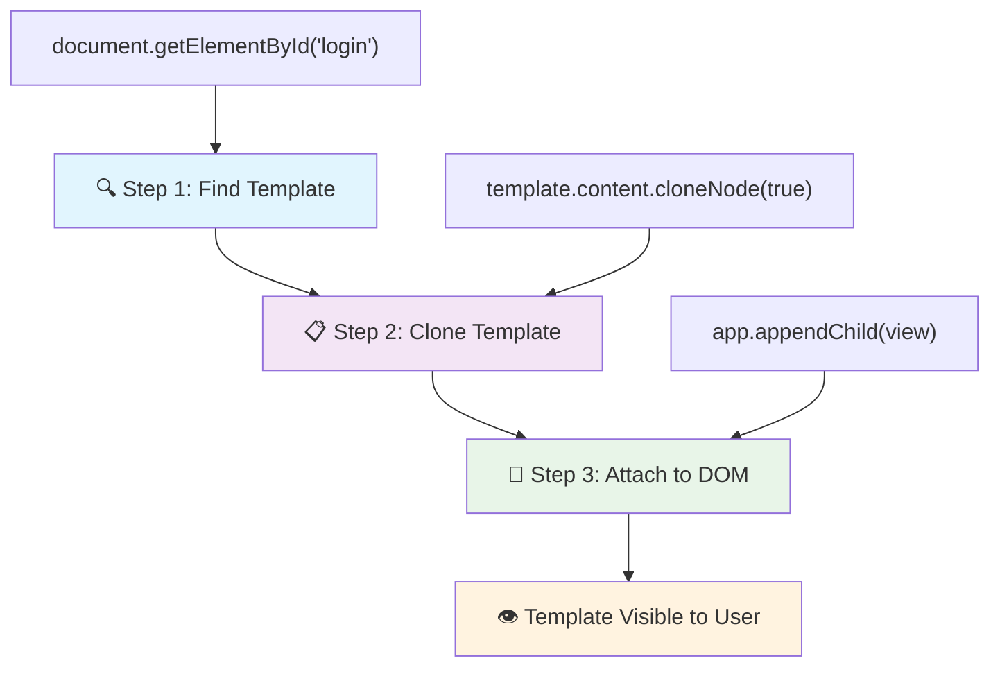
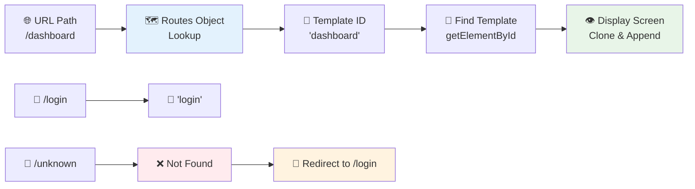
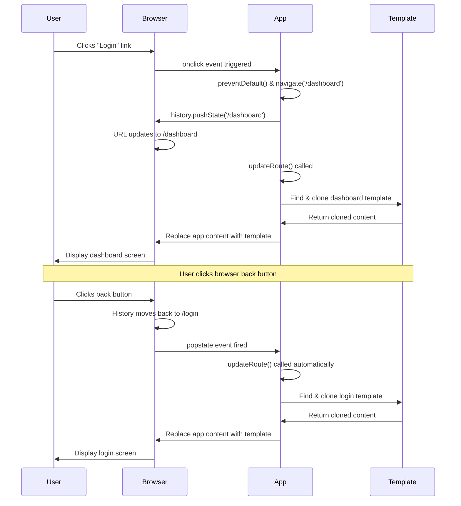

<!--
CO_OP_TRANSLATOR_METADATA:
{
  "original_hash": "5d259f6962464ad91e671083aa0398f4",
  "translation_date": "2025-10-24T23:32:17+00:00",
  "source_file": "7-bank-project/1-template-route/README.md",
  "language_code": "sr"
}
-->
# Изградња апликације за банкарство, део 1: HTML шаблони и руте у веб апликацији

Када је рачунар за навигацију Аполо 11 мисије водио лет на Месец 1969. године, морао је да прелази између различитих програма без поновног покретања целог система. Савремене веб апликације функционишу на сличан начин – мењају оно што видите без поновног учитавања целокупног садржаја. Ово ствара глатко и одзивно корисничко искуство које се данас очекује.

За разлику од традиционалних веб сајтова који поново учитавају целе странице за сваку интеракцију, савремене веб апликације ажурирају само делове који треба да се промене. Овај приступ, сличан начину на који контролни центар прелази између различитих приказа док одржава сталну комуникацију, ствара флуидно искуство које смо навикли да очекујемо.

Ево шта чини разлику тако драматичном:

| Традиционалне апликације са више страница | Савремене апликације са једном страницом |
|------------------------------------------|------------------------------------------|
| **Навигација** | Поновно учитавање целе странице за сваки екран | Инстантно пребацивање садржаја |
| **Перформансе** | Спорије због комплетног преузимања HTML-а | Брже са делимичним ажурирањима |
| **Корисничко искуство** | Нагли прелази између страница | Глатке, апликацијске транзиције |
| **Дељење података** | Тешко између страница | Лако управљање стањем |
| **Развој** | Одржавање више HTML датотека | Један HTML са динамичким шаблонима |

**Разумевање еволуције:**
- **Традиционалне апликације** захтевају серверске захтеве за сваку навигациону акцију
- **Савремене SPA** се учитавају једном и динамички ажурирају садржај користећи JavaScript
- **Очекивања корисника** сада фаворизују инстантне, беспрекорне интеракције
- **Предности перформанси** укључују смањену потрошњу пропусног опсега и брже одговоре

У овом лекцији, направићемо апликацију за банкарство са више екрана који се беспрекорно међусобно повезују. Као што научници користе модуларне инструменте који се могу конфигурисати за различите експерименте, ми ћемо користити HTML шаблоне као поново употребљиве компоненте које се могу приказати по потреби.

Радићете са HTML шаблонима (поново употребљивим нацртима за различите екране), JavaScript рутама (системом који омогућава пребацивање између екрана) и API-јем историје прегледача (који омогућава да дугме за повратак ради како треба). Ово су исте основне технике које користе оквири као што су React, Vue и Angular.

На крају, имаћете функционалну апликацију за банкарство која демонстрира професионалне принципе апликација са једном страницом.

## Квиз пре предавања

[Квиз пре предавања](https://ff-quizzes.netlify.app/web/quiz/41)

### Шта ће вам бити потребно

Биће нам потребан локални веб сервер за тестирање наше апликације за банкарство – не брините, то је лакше него што звучи! Ако га већ немате подешеног, само инсталирајте [Node.js](https://nodejs.org) и покрените `npx lite-server` из вашег пројектног фолдера. Ова корисна команда покреће локални сервер и аутоматски отвара вашу апликацију у прегледачу.

### Припрема

На вашем рачунару, направите фолдер под називом `bank` са датотеком `index.html` унутар њега. Почећемо од овог HTML [основног шаблона](https://en.wikipedia.org/wiki/Boilerplate_code):

```html
<!DOCTYPE html>
<html lang="en">
  <head>
    <meta charset="UTF-8">
    <meta name="viewport" content="width=device-width, initial-scale=1.0">
    <title>Bank App</title>
  </head>
  <body>
    <!-- This is where you'll work -->
  </body>
</html>
```

**Ево шта овај основни шаблон пружа:**
- **Успоставља** структуру HTML5 документа са правилном декларацијом DOCTYPE-а
- **Конфигурише** кодирање карактера као UTF-8 за подршку међународног текста
- **Омогућава** одзивни дизајн са мета тагом за приказ за мобилну компатибилност
- **Поставља** описни наслов који се појављује на картици прегледача
- **Креира** чисту секцију тела где ћемо изградити нашу апликацију

> 📁 **Преглед структуре пројекта**
> 
> **На крају ове лекције, ваш пројекат ће садржати:**
> ```
> bank/
> ├── index.html      <!-- Main HTML with templates -->
> ├── app.js          <!-- Routing and navigation logic -->
> └── style.css       <!-- (Optional for future lessons) -->
> ```
> 
> **Одговорности датотека:**
> - **index.html**: Садржи све шаблоне и пружа структуру апликације
> - **app.js**: Управља рутама, навигацијом и управљањем шаблонима
> - **Шаблони**: Дефинишу кориснички интерфејс за пријаву, контролни панел и друге екране

---

## HTML шаблони

Шаблони решавају основни проблем у веб развоју. Када је Гутенберг изумео покретну штампарску машину 1440-их, схватио је да уместо да урезује целе странице, може да направи поново употребљиве блокове слова и да их распоређује по потреби. HTML шаблони функционишу на истом принципу – уместо да креирате засебне HTML датотеке за сваки екран, дефинишете поново употребљиве структуре које се могу приказати по потреби.

Размислите о шаблонима као о нацртима за различите делове ваше апликације. Као што архитекта креира један нацрт и користи га више пута уместо да поново црта идентичне просторије, ми креирамо шаблоне једном и користимо их по потреби. Прегледач држи ове шаблоне скривеним док их JavaScript не активира.

Ако желите да креирате више екрана за веб страницу, једно решење би било да направите једну HTML датотеку за сваки екран који желите да прикажете. Међутим, ово решење долази са одређеним непогодностима:

- Морате поново учитати целу HTML датотеку приликом преласка на други екран, што може бити споро.
- Тешко је делити податке између различитих екрана.

Друга опција је да имате само једну HTML датотеку и дефинишете више [HTML шаблона](https://developer.mozilla.org/docs/Web/HTML/Element/template) користећи елемент `<template>`. Шаблон је поново употребљив HTML блок који прегледач не приказује, а потребно га је инстанцирати у време извршења помоћу JavaScript-а.

### Хајде да направимо

Направићемо апликацију за банкарство са два главна екрана: страницу за пријаву и контролни панел. Прво, додајмо елемент за резервисано место у тело HTML-а – овде ће се појављивати сви наши различити екрани:

```html
<div id="app">Loading...</div>
```

**Разумевање овог резервисаног места:**
- **Креира** контејнер са ID-јем "app" где ће се приказивати сви екрани
- **Приказује** поруку о учитавању док JavaScript не иницијализује први екран
- **Обезбеђује** једну тачку за монтирање нашег динамичког садржаја
- **Омогућава** лако циљање из JavaScript-а користећи `document.getElementById()`

> 💡 **Савет**: Пошто ће садржај овог елемента бити замењен, можемо ставити поруку о учитавању или индикатор који ће се приказивати док се апликација учитава.

Затим, додајмо HTML шаблон за страницу за пријаву. За сада ћемо само додати наслов и секцију која садржи линк који ћемо користити за навигацију.

```html
<template id="login">
  <h1>Bank App</h1>
  <section>
    <a href="/dashboard">Login</a>
  </section>
</template>
```

**Разлагање овог шаблона за пријаву:**
- **Дефинише** шаблон са јединственим идентификатором "login" за циљање из JavaScript-а
- **Укључује** главни наслов који успоставља бренд апликације
- **Садржи** семантички елемент `<section>` за груписање повезаног садржаја
- **Обезбеђује** навигациони линк који ће усмерити кориснике на контролни панел

Затим ћемо додати још један HTML шаблон за страницу контролног панела. Ова страница ће садржати различите секције:

- Заглавље са насловом и линком за одјаву
- Тренутни баланс банковног рачуна
- Листа трансакција, приказана у табели

```html
<template id="dashboard">
  <header>
    <h1>Bank App</h1>
    <a href="/login">Logout</a>
  </header>
  <section>
    Balance: 100$
  </section>
  <section>
    <h2>Transactions</h2>
    <table>
      <thead>
        <tr>
          <th>Date</th>
          <th>Object</th>
          <th>Amount</th>
        </tr>
      </thead>
      <tbody></tbody>
    </table>
  </section>
</template>
```

**Разумевање сваког дела овог контролног панела:**
- **Структурира** страницу са семантичким елементом `<header>` који садржи навигацију
- **Приказује** наслов апликације конзистентно на свим екранима ради брендирања
- **Обезбеђује** линк за одјаву који води назад на страницу за пријаву
- **Приказује** тренутни баланс рачуна у посебној секцији
- **Организује** податке о трансакцијама користећи правилно структурисану HTML табелу
- **Дефинише** заглавља табеле за колоне Датум, Објекат и Износ
- **Оставља** тело табеле празно за касније динамичко убацивање садржаја

> 💡 **Савет**: Када креирате HTML шаблоне, ако желите да видите како ће изгледати, можете коментарисати линије `<template>` и `</template>` тако што ћете их обухватити са `<!-- -->`.

✅ Зашто мислите да користимо `id` атрибуте на шаблонима? Да ли бисмо могли да користимо нешто друго, као што су класе?

## Оживљавање шаблона помоћу JavaScript-а

Сада треба да учинимо наше шаблоне функционалним. Као што 3D штампач узима дигитални нацрт и ствара физички објекат, JavaScript узима наше скривене шаблоне и ствара видљиве, интерактивне елементе које корисници могу да виде и користе.

Процес следи три конзистентна корака који чине основу савременог веб развоја. Када разумете овај образац, препознаћете га у многим оквирима и библиотекама.

Ако пробате вашу тренутну HTML датотеку у прегледачу, видећете да се заглавила приказујући `Loading...`. То је зато што треба да додамо неки JavaScript код да бисмо инстанцирали и приказали HTML шаблоне.

Инстанцирање шаблона обично се ради у 3 корака:

1. Проналажење елемента шаблона у DOM-у, на пример користећи [`document.getElementById`](https://developer.mozilla.org/docs/Web/API/Document/getElementById).
2. Клонирање елемента шаблона, користећи [`cloneNode`](https://developer.mozilla.org/docs/Web/API/Node/cloneNode).
3. Прикључивање на DOM испод видљивог елемента, на пример користећи [`appendChild`](https://developer.mozilla.org/docs/Web/API/Node/appendChild).



**Визуелни приказ процеса:**
- **Корак 1** проналази скривени шаблон у структури DOM-а
- **Корак 2** креира радну копију која се може безбедно модификовати
- **Корак 3** убацује копију у видљиву област странице
- **Резултат** је функционалан екран са којим корисници могу да интерагују

✅ Зашто је потребно клонирати шаблон пре него што га прикључимо на DOM? Шта мислите да би се десило ако бисмо прескочили овај корак?

### Задатак

Направите нову датотеку под називом `app.js` у вашем пројектном фолдеру и увезите ту датотеку у `<head>` секцију вашег HTML-а:

```html
<script src="app.js" defer></script>
```

**Разумевање овог увоза скрипте:**
- **Повезује** JavaScript датотеку са нашим HTML документом
- **Користи** атрибут `defer` како би се осигурало да се скрипта покрене након што се HTML парсира
- **Омогућава** приступ свим DOM елементима пошто су потпуно учитани пре извршења скрипте
- **Прати** савремене најбоље праксе за учитавање скрипти и перформансе

Сада у `app.js`, направићемо нову функцију `updateRoute`:

```js
function updateRoute(templateId) {
  const template = document.getElementById(templateId);
  const view = template.content.cloneNode(true);
  const app = document.getElementById('app');
  app.innerHTML = '';
  app.appendChild(view);
}
```

**Корак по корак, ево шта се дешава:**
- **Проналази** елемент шаблона користећи његов јединствени ID
- **Креира** дубоку копију садржаја шаблона користећи `cloneNode(true)`
- **Проналази** контејнер апликације где ће се садржај приказати
- **Чисти** било који постојећи садржај из контејнера апликације
- **Убацује** клонирани садржај шаблона у видљиви DOM

Сада позовите ову функцију са једним од шаблона и погледајте резултат.

```js
updateRoute('login');
```

**Шта овај позив функције постиже:**
- **Активира** шаблон за пријаву прослеђујући његов ID као параметар
- **Демонстрира** како програмски пребацивати између различитих екрана апликације
- **Приказује** екран за пријаву уместо поруке "Loading..."

✅ Која је сврха овог кода `app.innerHTML = '';`? Шта се дешава без њега?

## Креирање рута

Рутирање се у суштини односи на повезивање URL-ова са одговарајућим садржајем. Замислите како су рани телефонски оператери користили прекидачке табле за повезивање позива – узимали би долазни захтев и усмеравали га на исправну дестинацију. Веб рутирање функционише на сличан начин, узимајући URL захтев и одређујући који садржај да се прикаже.

Традиционално, веб сервери су то радили служећи различите HTML датотеке за различите URL-ове. Пошто градимо апликацију са једном страницом, морамо сами да управљамо овим рутирањем помоћу JavaScript-а. Овај приступ нам даје већу контролу над корисничким искуством и перформансама.



**Разумевање тока рутирања:**
- **Промене URL-а** покрећу претрагу у нашој конфигурацији рута
- **Важеће руте** се мапирају на одређене ID-јеве шаблона за приказ
- **Неважеће руте** покрећу резервно понашање како би се избегла неисправна стања
- **Приказ шаблона** следи тростепени процес који смо раније научили

Када говоримо о веб апликацији, називамо *рутирање* намером да се мапирају **URL-ови** на одређене екране који треба да се прикажу. На веб сајту са више HTML датотека, ово се аутоматски ради јер се путање датотека одражавају на URL-у.
✅ Шта се дешава ако унесете непознату путању у URL? Како бисмо могли да решимо овај проблем?

## Додавање навигације

Са успостављеним рутирањем, корисницима је потребан начин да се крећу кроз апликацију. Традиционални веб-сајтови поново учитавају целе странице када се кликне на линкове, али ми желимо да ажурирамо и URL и садржај без освежавања странице. Ово ствара глатко искуство слично ономе како десктоп апликације мењају различите приказе.

Потребно је координирати две ствари: ажурирање URL-а у прегледачу како би корисници могли да обележавају странице и деле линкове, и приказивање одговарајућег садржаја. Када се правилно имплементира, ово ствара беспрекорну навигацију коју корисници очекују од модерних апликација.

> 🏗️ **Увид у архитектуру**: Компоненте навигационог система
>
> **Шта градите:**
> - **🔄 Управљање URL-ом**: Ажурира адресну траку прегледача без поновног учитавања странице
> - **📋 Систем шаблона**: Динамички мења садржај на основу тренутне руте  
> - **📚 Интеграција историје**: Одржава функционалност дугмади за назад/напред у прегледачу
> - **🛡️ Обрада грешака**: Елегантни механизми за случај неважећих или недостајућих рута
>
> **Како компоненте раде заједно:**
> - **Слушају** догађаје навигације (кликове, промене историје)
> - **Ажурирају** URL користећи History API
> - **Приказују** одговарајући шаблон за нову руту
> - **Одржавају** беспрекорно корисничко искуство током целе апликације

Следећи корак за нашу апликацију је додавање могућности навигације између страница без потребе за ручним мењањем URL-а. Ово подразумева две ствари:

1. Ажурирање тренутног URL-а  
2. Ажурирање приказаног шаблона на основу новог URL-а  

Већ смо се побринули за други део помоћу функције `updateRoute`, тако да морамо да смислимо како да ажурирамо тренутни URL.

Мораћемо да користимо JavaScript, а конкретно [`history.pushState`](https://developer.mozilla.org/docs/Web/API/History/pushState) који омогућава ажурирање URL-а и креирање новог уноса у историји прегледања, без поновног учитавања HTML-а.

> ⚠️ **Важно обавештење**: Иако HTML елемент за сидро [`<a href>`](https://developer.mozilla.org/docs/Web/HTML/Element/a) може самостално да се користи за креирање хиперлинкова ка различитим URL-овима, он ће подразумевано натерати прегледач да поново учита HTML. Неопходно је спречити ово понашање када се рутирање обрађује прилагођеним JavaScript-ом, користећи функцију preventDefault() на догађају клика.

### Задатак

Хајде да направимо нову функцију коју можемо користити за навигацију у нашој апликацији:

```js
function navigate(path) {
  window.history.pushState({}, path, path);
  updateRoute();
}
```
  
**Разумевање ове функције за навигацију:**  
- **Ажурира** URL прегледача на нову путању користећи `history.pushState`  
- **Додаје** нови унос у историју прегледача за правилну подршку дугмади назад/напред  
- **Покреће** функцију `updateRoute()` за приказ одговарајућег шаблона  
- **Одржава** искуство апликације са једном страницом без поновног учитавања странице  

Ова метода прво ажурира тренутни URL на основу дате путање, а затим ажурира шаблон. Својство `window.location.origin` враћа корен URL-а, омогућавајући нам да реконструишемо комплетан URL из дате путање.

Сада када имамо ову функцију, можемо се позабавити проблемом који имамо ако путања не одговара ниједној дефинисаној рути. Модификоваћемо функцију `updateRoute` додавањем резервне опције за једну од постојећих рута ако не можемо да пронађемо одговарајућу.

```js
function updateRoute() {
  const path = window.location.pathname;
  const route = routes[path];

  if (!route) {
    return navigate('/login');
  }

  const template = document.getElementById(route.templateId);
  const view = template.content.cloneNode(true);
  const app = document.getElementById('app');
  app.innerHTML = '';
  app.appendChild(view);
}
```
  
**Кључне тачке које треба запамтити:**  
- **Проверава** да ли постоји рута за тренутну путању  
- **Преусмерава** на страницу за пријаву када се приступи неважећој рути  
- **Обезбеђује** резервни механизам који спречава прекиде у навигацији  
- **Омогућава** да корисници увек виде важећи екран, чак и са погрешним URL-овима  

Ако рута не може да се пронађе, сада ћемо преусмерити на страницу `login`.

Сада хајде да направимо функцију која ће добити URL када се кликне на линк и спречити подразумевано понашање прегледача за линкове:

```js
function onLinkClick(event) {
  event.preventDefault();
  navigate(event.target.href);
}
```
  
**Разлагање овог обрађивача клика:**  
- **Спречава** подразумевано понашање прегледача за линкове користећи `preventDefault()`  
- **Извлачи** одредишни URL из кликнутог елемента линка  
- **Позива** нашу прилагођену функцију за навигацију уместо поновног учитавања странице  
- **Одржава** глатко искуство апликације са једном страницом  

```html
<a href="/dashboard" onclick="onLinkClick(event)">Login</a>
...
<a href="/login" onclick="onLinkClick(event)">Logout</a>
```
  
**Шта ова веза преко onclick атрибута постиже:**  
- **Повезује** сваки линк са нашим прилагођеним навигационим системом  
- **Прослеђује** догађај клика нашој функцији `onLinkClick` за обраду  
- **Омогућава** глатку навигацију без поновног учитавања странице  
- **Одржава** правилну структуру URL-а коју корисници могу обележити или делити  

Атрибут [`onclick`](https://developer.mozilla.org/docs/Web/API/GlobalEventHandlers/onclick) повезује догађај клика са JavaScript кодом, овде позивом функције `navigate()`.

Покушајте да кликнете на ове линкове, сада би требало да можете да се крећете између различитих екрана ваше апликације.

✅ Метода `history.pushState` је део HTML5 стандарда и имплементирана је у [свим модерним прегледачима](https://caniuse.com/?search=pushState). Ако правите веб апликацију за старије прегледаче, постоји трик који можете користити уместо овог API-ја: коришћењем [хеша (`#`)](https://en.wikipedia.org/wiki/URI_fragment) пре путање можете имплементирати рутирање које функционише са регуларном навигацијом преко сидра и не поново учитава страницу, јер је његова сврха била да креира унутрашње линкове унутар странице.

## Омогућавање рада дугмади за назад и напред

Дугмад за назад и напред су основа веб прегледања, слично као што контролори мисија НАСА-е могу да прегледају претходна стања система током свемирских мисија. Корисници очекују да ова дугмад функционишу, а када не функционишу, то нарушава очекивано искуство прегледања.

Нашој апликацији са једном страницом је потребна додатна конфигурација да би то подржала. Прегледач одржава историјски стек (који смо додавали помоћу `history.pushState`), али када корисници навигирају кроз ову историју, наша апликација мора да реагује ажурирањем приказаног садржаја.


  
**Кључне тачке интеракције:**  
- **Акције корисника** покрећу навигацију кроз кликове или дугмад прегледача  
- **Апликација пресреће** кликове на линкове како би спречила поновно учитавање странице  
- **History API** управља променама URL-а и стеком историје прегледача  
- **Шаблони** пружају структуру садржаја за сваки екран  
- **Слушаоци догађаја** осигуравају да апликација реагује на све типове навигације  

Коришћење `history.pushState` креира нове уносе у историји навигације прегледача. Можете то проверити држећи *дугме назад* вашег прегледача, требало би да прикаже нешто овако:


Ако покушате да кликнете на дугме назад неколико пута, видећете да се тренутни URL мења и историја се ажурира, али исти шаблон се и даље приказује.

То је зато што апликација не зна да треба да позове `updateRoute()` сваки пут када се историја промени. Ако погледате документацију за [`history.pushState`](https://developer.mozilla.org/docs/Web/API/History/pushState), можете видети да ако се стање промени - што значи да смо прешли на други URL - догађај [`popstate`](https://developer.mozilla.org/docs/Web/API/Window/popstate_event) се покреће. Искористићемо то да решимо овај проблем.

### Задатак

Да бисмо осигурали да се приказани шаблон ажурира када се историја прегледача промени, додаћемо нову функцију која позива `updateRoute()`. То ћемо урадити на крају нашег `app.js` фајла:

```js
window.onpopstate = () => updateRoute();
updateRoute();
```
  
**Разумевање ове интеграције историје:**  
- **Слуша** догађаје `popstate` који се дешавају када корисници навигирају помоћу дугмади прегледача  
- **Користи** стрелну функцију за концизну синтаксу обрађивача догађаја  
- **Позива** `updateRoute()` аутоматски сваки пут када се стање историје промени  
- **Иницијализује** апликацију позивањем `updateRoute()` када се страница први пут учита  
- **Обезбеђује** да се правилан шаблон приказује без обзира на то како корисници навигирају  

> 💡 **Савет**: Користили смо [стрелну функцију](https://developer.mozilla.org/docs/Web/JavaScript/Reference/Functions/Arrow_functions) овде да декларишемо наш обрађивач догађаја `popstate` ради концизности, али обична функција би функционисала исто.

Ево видео подсетника о стрелним функцијама:

[](https://youtube.com/watch?v=OP6eEbOj2sc "Стрелне функције")

> 🎥 Кликните на слику изнад за видео о стрелним функцијама.

Сада покушајте да користите дугмад назад и напред вашег прегледача и проверите да ли се приказана рута овог пута правилно ажурира.

---

## Изазов GitHub Copilot Agent 🚀

Користите Agent мод да завршите следећи изазов:

**Опис:** Унапредите апликацију за банкарство имплементацијом обраде грешака и шаблона за 404 страницу за неважеће руте, побољшавајући корисничко искуство приликом навигације на непостојеће странице.

**Задатак:** Направите нови HTML шаблон са id-ом "not-found" који приказује кориснички пријатну 404 страницу са стилизовањем. Затим модификујте JavaScript логику рутирања да приказује овај шаблон када корисници навигирају на неважеће URL-ове, и додајте дугме "Иди на почетну" које води назад на страницу за пријаву.

Сазнајте више о [Agent моду](https://code.visualstudio.com/blogs/2025/02/24/introducing-copilot-agent-mode) овде.

## 🚀 Изазов

Додајте нови шаблон и руту за трећу страницу која приказује заслуге за ову апликацију.

**Циљеви изазова:**  
- **Направите** нови HTML шаблон са одговарајућом структуром садржаја  
- **Додајте** нову руту у ваш објекат конфигурације рута  
- **Укључите** линкове за навигацију ка и од странице са заслугама  
- **Тестирајте** да сва навигација правилно функционише са историјом прегледача  

## Квиз након предавања

[Квиз након предавања](https://ff-quizzes.netlify.app/web/quiz/42)

## Преглед и самостално учење

Рутирање је један од изненађујуће сложених делова веб развоја, посебно како се веб креће од понашања поновног учитавања страница ка апликацијама са једном страницом. Прочитајте мало о [начину на који Azure Static Web App сервис](https://docs.microsoft.com/azure/static-web-apps/routes/?WT.mc_id=academic-77807-sagibbon) обрађује рутирање. Можете ли објаснити зашто су неке одлуке описане у том документу неопходне?

**Додатни ресурси за учење:**  
- **Истражите** како популарни оквири као што су React Router и Vue Router имплементирају рутирање на страни клијента  
- **Истражите** разлике између рутирања заснованог на хешу и рутирања помоћу History API-ја  
- **Научите** о серверском рендеровању (SSR) и како оно утиче на стратегије рутирања  
- **Истражите** како прогресивне веб апликације (PWAs) обрађују рутирање и навигацију  

## Задатак

[Унапредите рутирање](assignment.md)

---

**Одрицање од одговорности**:  
Овај документ је преведен помоћу услуге за превођење вештачке интелигенције [Co-op Translator](https://github.com/Azure/co-op-translator). Иако настојимо да обезбедимо тачност, молимо вас да имате у виду да аутоматски преводи могу садржати грешке или нетачности. Оригинални документ на његовом изворном језику треба сматрати меродавним извором. За критичне информације препоручује се професионални превод од стране људи. Не преузимамо одговорност за било каква погрешна тумачења или неспоразуме који могу настати услед коришћења овог превода.