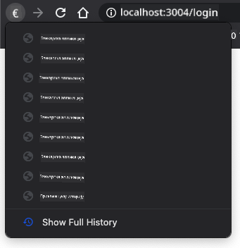

<!--
CO_OP_TRANSLATOR_METADATA:
{
  "original_hash": "8da1b5e2c63f749808858c53f37b8ce7",
  "translation_date": "2025-08-27T23:02:43+00:00",
  "source_file": "7-bank-project/1-template-route/README.md",
  "language_code": "sr"
}
-->
# Изградња банкарске апликације, део 1: HTML шаблони и руте у веб апликацији

## Квиз пре предавања

[Квиз пре предавања](https://ashy-river-0debb7803.1.azurestaticapps.net/quiz/41)

### Увод

Од појаве JavaScript-а у претраживачима, веб-сајтови постају интерактивнији и сложенији него икада. Веб технологије се сада често користе за креирање потпуно функционалних апликација које раде директно у претраживачу, а које називамо [веб апликацијама](https://en.wikipedia.org/wiki/Web_application). Како су веб апликације веома интерактивне, корисници не желе да чекају да се цела страница поново учита сваки пут када се изврши нека акција. Зато се JavaScript користи за директно ажурирање HTML-а преко DOM-а, како би се обезбедило глатко корисничко искуство.

У овој лекцији поставићемо основе за креирање банкарске веб апликације, користећи HTML шаблоне за креирање више екрана који могу бити приказани и ажурирани без потребе за поновним учитавањем целе HTML странице.

### Предуслови

Потребан вам је локални веб сервер за тестирање веб апликације коју ћемо изградити у овој лекцији. Ако га немате, можете инсталирати [Node.js](https://nodejs.org) и користити команду `npx lite-server` из вашег пројектног фолдера. Ово ће креирати локални веб сервер и отворити вашу апликацију у претраживачу.

### Припрема

На вашем рачунару креирајте фолдер под именом `bank` са фајлом `index.html` унутар њега. Почећемо са овим HTML [основним кодом](https://en.wikipedia.org/wiki/Boilerplate_code):

```html
<!DOCTYPE html>
<html lang="en">
  <head>
    <meta charset="UTF-8">
    <meta name="viewport" content="width=device-width, initial-scale=1.0">
    <title>Bank App</title>
  </head>
  <body>
    <!-- This is where you'll work -->
  </body>
</html>
```

---

## HTML шаблони

Ако желите да креирате више екрана за веб страницу, једно решење би било да креирате један HTML фајл за сваки екран који желите да прикажете. Међутим, ово решење има неке недостатке:

- Морате поново учитати цео HTML приликом преласка са једног екрана на други, што може бити споро.
- Тешко је делити податке између различитих екрана.

Други приступ је да имате само један HTML фајл и дефинишете више [HTML шаблона](https://developer.mozilla.org/docs/Web/HTML/Element/template) користећи елемент `<template>`. Шаблон је поновљиви HTML блок који претраживач не приказује, а који се мора инстанцирати у току рада помоћу JavaScript-а.

### Задатак

Креираћемо банкарску апликацију са два екрана: страницу за пријаву и контролну таблу. Прво, додајмо у HTML тело елемент који ће служити као место за приказивање различитих екрана наше апликације:

```html
<div id="app">Loading...</div>
```

Додељујемо му `id` како бисмо га касније лакше пронашли помоћу JavaScript-а.

> Савет: пошто ће садржај овог елемента бити замењен, можемо у њега ставити поруку или индикатор учитавања који ће се приказивати док се апликација учитава.

Затим, додајмо испод HTML шаблон за страницу за пријаву. За сада ћемо у њега ставити само наслов и секцију која садржи линк који ћемо користити за навигацију.

```html
<template id="login">
  <h1>Bank App</h1>
  <section>
    <a href="/dashboard">Login</a>
  </section>
</template>
```

Затим ћемо додати још један HTML шаблон за страницу контролне табле. Ова страница ће садржати различите секције:

- Заглавље са насловом и линком за одјаву
- Тренутно стање на банковном рачуну
- Листу трансакција, приказану у табели

```html
<template id="dashboard">
  <header>
    <h1>Bank App</h1>
    <a href="/login">Logout</a>
  </header>
  <section>
    Balance: 100$
  </section>
  <section>
    <h2>Transactions</h2>
    <table>
      <thead>
        <tr>
          <th>Date</th>
          <th>Object</th>
          <th>Amount</th>
        </tr>
      </thead>
      <tbody></tbody>
    </table>
  </section>
</template>
```

> Савет: када креирате HTML шаблоне, ако желите да видите како ће изгледати, можете коментарисати линије `<template>` и `</template>` тако што ћете их обухватити са `<!-- -->`.

✅ Зашто мислите да користимо `id` атрибуте на шаблонима? Да ли бисмо могли користити нешто друго, попут класа?

## Приказивање шаблона помоћу JavaScript-а

Ако пробате ваш тренутни HTML фајл у претраживачу, видећете да остаје заглављен на приказу `Loading...`. То је зато што треба да додамо JavaScript код за инстанцирање и приказивање HTML шаблона.

Инстанцирање шаблона обично се ради у 3 корака:

1. Проналажење елемента шаблона у DOM-у, на пример помоћу [`document.getElementById`](https://developer.mozilla.org/docs/Web/API/Document/getElementById).
2. Клонирање елемента шаблона, користећи [`cloneNode`](https://developer.mozilla.org/docs/Web/API/Node/cloneNode).
3. Додавање у DOM испод видљивог елемента, на пример помоћу [`appendChild`](https://developer.mozilla.org/docs/Web/API/Node/appendChild).

✅ Зашто морамо клонирати шаблон пре него што га додамо у DOM? Шта мислите да би се десило ако бисмо прескочили овај корак?

### Задатак

Креирајте нови фајл под именом `app.js` у вашем пројектном фолдеру и увезите тај фајл у `<head>` секцију вашег HTML-а:

```html
<script src="app.js" defer></script>
```

Сада у `app.js`, креираћемо нову функцију `updateRoute`:

```js
function updateRoute(templateId) {
  const template = document.getElementById(templateId);
  const view = template.content.cloneNode(true);
  const app = document.getElementById('app');
  app.innerHTML = '';
  app.appendChild(view);
}
```

Овде радимо управо 3 корака описана изнад. Инстанцирамо шаблон са `id` вредношћу `templateId` и стављамо његов клонирани садржај унутар нашег елемента за апликацију. Имајте у виду да морамо користити `cloneNode(true)` како бисмо копирали цело стабло шаблона.

Сада позовите ову функцију са једним од шаблона и погледајте резултат.

```js
updateRoute('login');
```

✅ Која је сврха овог кода `app.innerHTML = '';`? Шта се дешава без њега?

## Креирање рута

Када говоримо о веб апликацији, *рутирање* подразумева намеру да се **URL-ови** мапирају на одређене екране који треба да буду приказани. На веб-сајту са више HTML фајлова, ово се аутоматски ради јер се путање фајлова одражавају на URL. На пример, са овим фајловима у вашем пројектном фолдеру:

```
mywebsite/index.html
mywebsite/login.html
mywebsite/admin/index.html
```

Ако креирате веб сервер са `mywebsite` као кореном, мапирање URL-ова ће бити:

```
https://site.com            --> mywebsite/index.html
https://site.com/login.html --> mywebsite/login.html
https://site.com/admin/     --> mywebsite/admin/index.html
```

Међутим, за нашу веб апликацију користимо један HTML фајл који садржи све екране, тако да нам овај подразумевани начин неће помоћи. Морамо ручно креирати ову мапу и ажурирати приказани шаблон помоћу JavaScript-а.

### Задатак

Користићемо једноставан објекат за имплементацију [мапе](https://en.wikipedia.org/wiki/Associative_array) између URL путања и наших шаблона. Додајте овај објекат на врх вашег `app.js` фајла.

```js
const routes = {
  '/login': { templateId: 'login' },
  '/dashboard': { templateId: 'dashboard' },
};
```

Сада мало изменимо функцију `updateRoute`. Уместо да директно прослеђујемо `templateId` као аргумент, желимо да га добијемо тако што ћемо прво погледати тренутни URL, а затим користити нашу мапу да добијемо одговарајућу вредност `templateId`. Можемо користити [`window.location.pathname`](https://developer.mozilla.org/docs/Web/API/Location/pathname) да добијемо само део путање из URL-а.

```js
function updateRoute() {
  const path = window.location.pathname;
  const route = routes[path];

  const template = document.getElementById(route.templateId);
  const view = template.content.cloneNode(true);
  const app = document.getElementById('app');
  app.innerHTML = '';
  app.appendChild(view);
}
```

Овде смо мапирали руте које смо декларисали на одговарајуће шаблоне. Можете проверити да ли ради исправно тако што ћете ручно променити URL у вашем претраживачу.

✅ Шта се дешава ако унесете непознату путању у URL? Како бисмо могли решити овај проблем?

## Додавање навигације

Следећи корак за нашу апликацију је додавање могућности за навигацију између страница без потребе за ручним мењањем URL-а. Ово подразумева две ствари:

1. Ажурирање тренутног URL-а  
2. Ажурирање приказаног шаблона на основу новог URL-а  

Други део смо већ решили функцијом `updateRoute`, тако да сада треба да смислимо како да ажурирамо тренутни URL.

Мораћемо да користимо JavaScript, а конкретно [`history.pushState`](https://developer.mozilla.org/docs/Web/API/History/pushState), који омогућава ажурирање URL-а и креирање новог уноса у историји претраживања, без поновног учитавања HTML-а.

> Напомена: Иако се HTML елемент за сидро [`<a href>`](https://developer.mozilla.org/docs/Web/HTML/Element/a) може користити самостално за креирање хипервеза ка различитим URL-овима, он ће подразумевано натерати претраживач да поново учита HTML. Неопходно је спречити ово понашање када се рутирање обрађује прилагођеним JavaScript-ом, користећи функцију `preventDefault()` на догађају клика.

### Задатак

Креирајмо нову функцију коју можемо користити за навигацију у нашој апликацији:

```js
function navigate(path) {
  window.history.pushState({}, path, path);
  updateRoute();
}
```

Ова метода прво ажурира тренутни URL на основу дате путање, а затим ажурира шаблон. Особина `window.location.origin` враћа корен URL-а, омогућавајући нам да реконструишемо комплетан URL из дате путање.

Сада када имамо ову функцију, можемо решити проблем који имамо ако путања не одговара ниједној дефинисаној рути. Изменићемо функцију `updateRoute` тако што ћемо додати резервну опцију за једну од постојећих рута ако не можемо пронаћи подударност.

```js
function updateRoute() {
  const path = window.location.pathname;
  const route = routes[path];

  if (!route) {
    return navigate('/login');
  }

  ...
```

Ако рута не може бити пронађена, сада ћемо бити преусмерени на страницу за пријаву.

Сада креирајмо функцију за добијање URL-а када се кликне на линк и за спречавање подразумеваног понашања линка у претраживачу:

```js
function onLinkClick(event) {
  event.preventDefault();
  navigate(event.target.href);
}
```

Довршимо систем навигације додавањем веза за *Пријаву* и *Одјаву* у HTML-у.

```html
<a href="/dashboard" onclick="onLinkClick(event)">Login</a>
...
<a href="/login" onclick="onLinkClick(event)">Logout</a>
```

Објекат `event` изнад хвата догађај `click` и прослеђује га нашој функцији `onLinkClick`.

Користећи атрибут [`onclick`](https://developer.mozilla.org/docs/Web/API/GlobalEventHandlers/onclick), повежите догађај `click` са JavaScript кодом, овде позивом функције `navigate()`.

Пробајте да кликнете на ове линкове, сада би требало да можете да се крећете између различитих екрана ваше апликације.

✅ Метода `history.pushState` је део HTML5 стандарда и имплементирана је у [свим модерним претраживачима](https://caniuse.com/?search=pushState). Ако правите веб апликацију за старије претраживаче, постоји трик који можете користити уместо овог API-ја: коришћењем [хеша (`#`)](https://en.wikipedia.org/wiki/URI_fragment) пре путање можете имплементирати рутирање које ради са регуларном навигацијом сидра и не поново учитава страницу, јер му је сврха била да креира унутрашње линкове унутар странице.

## Обрада дугмади за назад и напред у претраживачу

Коришћењем `history.pushState` креирају се нови уноси у историји навигације претраживача. Можете то проверити тако што ћете држати *дугме за назад* у вашем претраживачу, требало би да прикаже нешто овако:



Ако пробате да кликнете на дугме за назад неколико пута, видећете да се тренутни URL мења и историја се ажурира, али исти шаблон остаје приказан.

То је зато што апликација не зна да треба да позове `updateRoute()` сваки пут када се историја промени. Ако погледате [документацију за `history.pushState`](https://developer.mozilla.org/docs/Web/API/History/pushState), можете видети да ако се стање промени - што значи да смо прешли на други URL - догађај [`popstate`](https://developer.mozilla.org/docs/Web/API/Window/popstate_event) се активира. Користићемо то да решимо овај проблем.

### Задатак

Да бисмо били сигурни да се приказани шаблон ажурира када се историја претраживача промени, повезаћемо нову функцију која позива `updateRoute()`. То ћемо урадити на дну нашег `app.js` фајла:

```js
window.onpopstate = () => updateRoute();
updateRoute();
```

> Напомена: овде смо користили [arrow функцију](https://developer.mozilla.org/docs/Web/JavaScript/Reference/Functions/Arrow_functions) за декларацију нашег обрађивача догађаја `popstate` ради концизности, али би обична функција радила исто.

Ево видео подсетника о arrow функцијама:

[](https://youtube.com/watch?v=OP6eEbOj2sc "Arrow Functions")

> 🎥 Кликните на слику изнад за видео о arrow функцијама.

Сада пробајте да користите дугмад за назад и напред у вашем претраживачу и проверите да ли се приказана рута исправно ажурира овог пута.

---

## 🚀 Изазов

Додајте нови шаблон и руту за трећу страницу која приказује кредите за ову апликацију.

## Квиз након предавања

[Квиз након предавања](https://ashy-river-0debb7803.1.azurestaticapps.net/quiz/42)

## Преглед и самостално учење

Рутирање је један од изненађујуће сложених делова веб развоја, посебно како се веб креће од понашања са освежавањем странице ка освежавањима у апликацијама са једном страницом (SPA). Прочитајте мало о томе [како Azure Static Web App услуга](https://docs.microsoft.com/azure/static-web-apps/routes/?WT.mc_id=academic-77807-sagibbon) обрађује рутирање. Можете ли објаснити зашто су неке одлуке описане у том документу неопходне?

## Задатак

[Унапредите рутирање](assignment.md)

---

**Одрицање од одговорности**:  
Овај документ је преведен коришћењем услуге за превођење помоћу вештачке интелигенције [Co-op Translator](https://github.com/Azure/co-op-translator). Иако се трудимо да обезбедимо тачност, молимо вас да имате у виду да аутоматски преводи могу садржати грешке или нетачности. Оригинални документ на његовом изворном језику треба сматрати меродавним извором. За критичне информације препоручује се професионални превод од стране људи. Не преузимамо одговорност за било каква погрешна тумачења или неспоразуме који могу настати услед коришћења овог превода.