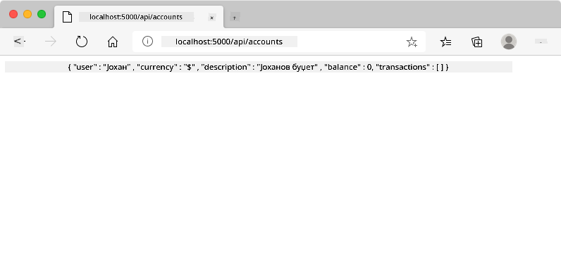
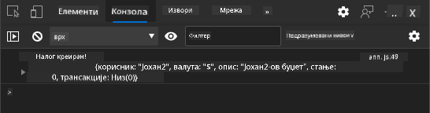
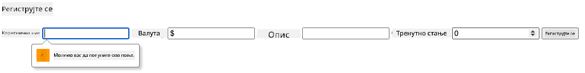
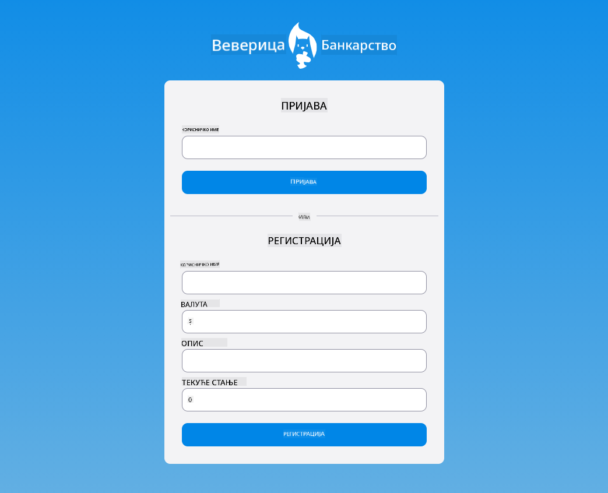

<!--
CO_OP_TRANSLATOR_METADATA:
{
  "original_hash": "b667b7d601e2ee19acb5aa9d102dc9f3",
  "translation_date": "2025-08-28T10:05:30+00:00",
  "source_file": "7-bank-project/2-forms/README.md",
  "language_code": "sr"
}
-->
# Изградња банкарске апликације, део 2: Изградња формулара за пријаву и регистрацију

## Квиз пре предавања

[Квиз пре предавања](https://ff-quizzes.netlify.app/web/quiz/43)

### Увод

У скоро свим модерним веб апликацијама можете креирати налог како бисте имали свој приватни простор. Пошто више корисника може истовремено приступити веб апликацији, потребан је механизам за одвојено чување личних података сваког корисника и избор информација које ће бити приказане. Нећемо покривати како [безбедно управљати идентитетом корисника](https://en.wikipedia.org/wiki/Authentication), јер је то обимна тема сама по себи, али ћемо осигурати да сваки корисник може креирати један (или више) банковних рачуна у нашој апликацији.

У овом делу ћемо користити HTML формуларе за додавање пријаве и регистрације у нашу веб апликацију. Видећемо како програмски послати податке серверској API-ју и на крају како дефинисати основна правила за валидацију корисничких уноса.

### Предуслови

Потребно је да сте завршили [HTML шаблоне и рутирање](../1-template-route/README.md) веб апликације за ову лекцију. Такође је потребно да инсталирате [Node.js](https://nodejs.org) и [покренете серверску API](../api/README.md) локално како бисте могли да шаљете податке за креирање налога.

**Обратите пажњу**
Имаћете два терминала која раде истовремено, као што је наведено у наставку:
1. За главну банкарску апликацију коју смо изградили у лекцији [HTML шаблони и рутирање](../1-template-route/README.md)
2. За [серверску API банкарске апликације](../api/README.md) коју смо управо подесили.

Потребно је да оба сервера буду покренута како бисте могли да наставите са остатком лекције. Они слушају на различитим портовима (порт `3000` и порт `5000`), тако да би све требало да функционише без проблема.

Можете тестирати да ли сервер ради исправно извршавањем ове команде у терминалу:

```sh
curl http://localhost:5000/api
# -> should return "Bank API v1.0.0" as a result
```

---

## Формулар и контроле

Елемент `<form>` обухвата део HTML документа где корисник може уносити и слати податке помоћу интерактивних контрола. Постоји много различитих корисничких интерфејс (UI) контрола које се могу користити унутар формулара, а најчешћи су елементи `<input>` и `<button>`.

Постоји много различитих [типова](https://developer.mozilla.org/docs/Web/HTML/Element/input) `<input>` елемената. На пример, да бисте креирали поље где корисник може унети своје корисничко име, можете користити:

```html
<input id="username" name="username" type="text">
```

Атрибут `name` ће се користити као назив својства када се подаци формулара буду слали. Атрибут `id` се користи за повезивање `<label>` елемента са контролом формулара.

> Погледајте целу листу [`<input>` типова](https://developer.mozilla.org/docs/Web/HTML/Element/input) и [друге контроле формулара](https://developer.mozilla.org/docs/Learn/Forms/Other_form_controls) како бисте добили идеју о свим нативним UI елементима које можете користити приликом изградње вашег интерфејса.

✅ Напомена да је `<input>` [празан елемент](https://developer.mozilla.org/docs/Glossary/Empty_element) на који *не треба* додавати одговарајућу затварајућу ознаку. Можете, међутим, користити самозатварајућу нотацију `<input/>`, али то није обавезно.

Елемент `<button>` унутар формулара је мало посебан. Ако не одредите његов атрибут `type`, он ће аутоматски послати податке формулара серверу када се притисне. Ево могућих вредности за `type`:

- `submit`: Подразумевано унутар `<form>`, дугме покреће акцију слања формулара.
- `reset`: Дугме ресетује све контроле формулара на њихове почетне вредности.
- `button`: Не додељује подразумевано понашање када се дугме притисне. Можете му доделити прилагођене акције помоћу JavaScript-а.

### Задатак

Хајде да започнемо додавањем формулара у шаблон `login`. Биће нам потребно поље за *корисничко име* и дугме *Login*.

```html
<template id="login">
  <h1>Bank App</h1>
  <section>
    <h2>Login</h2>
    <form id="loginForm">
      <label for="username">Username</label>
      <input id="username" name="user" type="text">
      <button>Login</button>
    </form>
  </section>
</template>
```

Ако пажљивије погледате, можете приметити да смо овде додали и елемент `<label>`. Елементи `<label>` се користе за додавање назива UI контролама, као што је наше поље за корисничко име. Ознаке су важне за читљивост ваших формулара, али такође долазе са додатним предностима:

- Повезивањем ознаке са контролом формулара, помаже корисницима који користе асистивне технологије (као што је читач екрана) да разумеју које податке треба да унесу.
- Можете кликнути на ознаку да директно ставите фокус на повезани унос, што олакшава приступ на уређајима са екраном осетљивим на додир.

> [Приступачност](https://developer.mozilla.org/docs/Learn/Accessibility/What_is_accessibility) на вебу је веома важна тема која се често занемарује. Захваљујући [семантичким HTML елементима](https://developer.mozilla.org/docs/Learn/Accessibility/HTML) није тешко креирати приступачан садржај ако их правилно користите. Можете [прочитати више о приступачности](https://developer.mozilla.org/docs/Web/Accessibility) како бисте избегли уобичајене грешке и постали одговоран програмер.

Сада ћемо додати други формулар за регистрацију, одмах испод претходног:

```html
<hr/>
<h2>Register</h2>
<form id="registerForm">
  <label for="user">Username</label>
  <input id="user" name="user" type="text">
  <label for="currency">Currency</label>
  <input id="currency" name="currency" type="text" value="$">
  <label for="description">Description</label>
  <input id="description" name="description" type="text">
  <label for="balance">Current balance</label>
  <input id="balance" name="balance" type="number" value="0">
  <button>Register</button>
</form>
```

Користећи атрибут `value` можемо дефинисати подразумевану вредност за дати унос.
Такође приметите да унос за `balance` има тип `number`. Да ли изгледа другачије од осталих уноса? Покушајте да интерагујете са њим.

✅ Можете ли навигирати и интераговати са формуларима користећи само тастатуру? Како бисте то урадили?

## Слање података серверу

Сада када имамо функционалан UI, следећи корак је слање података серверу. Хајде да направимо брз тест користећи наш тренутни код: шта се дешава ако кликнете на дугме *Login* или *Register*?

Да ли сте приметили промену у URL секцији вашег претраживача?


Подразумевана акција за `<form>` је да пошаље формулар на тренутни URL сервера користећи [GET метод](https://www.w3.org/Protocols/rfc2616/rfc2616-sec9.html#sec9.3), додајући податке формулара директно у URL. Овај метод има неке недостатке:

- Подаци који се шаљу су веома ограничени по величини (око 2000 карактера)
- Подаци су директно видљиви у URL-у (није добро за лозинке)
- Не ради са отпремањем датотека

Зато можете променити да користите [POST метод](https://www.w3.org/Protocols/rfc2616/rfc2616-sec9.html#sec9.5) који шаље податке формулара серверу у телу HTTP захтева, без претходних ограничења.

> Иако је POST најчешће коришћен метод за слање података, [у неким специфичним сценаријима](https://www.w3.org/2001/tag/doc/whenToUseGet.html) је пожељно користити GET метод, на пример приликом имплементације поља за претрагу.

### Задатак

Додајте `action` и `method` својства формулару за регистрацију:

```html
<form id="registerForm" action="//localhost:5000/api/accounts" method="POST">
```

Сада покушајте да региструјете нови налог са вашим именом. Након клика на дугме *Register* требало би да видите нешто овако:



Ако све функционише како треба, сервер би требало да одговори на ваш захтев са [JSON](https://www.json.org/json-en.html) одговором који садржи податке о креираном налогу.

✅ Покушајте поново да се региструјете са истим именом. Шта се дешава?

## Слање података без поновног учитавања странице

Као што сте вероватно приметили, постоји мали проблем са приступом који смо управо користили: приликом слања формулара, излазимо из наше апликације и претраживач се преусмерава на URL сервера. Покушавамо да избегнемо сва поновна учитавања страница у нашој веб апликацији, јер правимо [апликацију са једном страницом (SPA)](https://en.wikipedia.org/wiki/Single-page_application).

Да бисмо послали податке формулара серверу без принудног поновног учитавања странице, морамо користити JavaScript код. Уместо да ставимо URL у својство `action` елемента `<form>`, можете користити било који JavaScript код са префиксом `javascript:` да бисте извршили прилагођену акцију. Коришћење овога такође значи да ћете морати да имплементирате неке задатке који су раније аутоматски обављани од стране претраживача:

- Преузимање података формулара
- Конвертовање и кодирање података формулара у одговарајући формат
- Креирање HTTP захтева и његово слање серверу

### Задатак

Замените `action` формулара за регистрацију са:

```html
<form id="registerForm" action="javascript:register()">
```

Отворите `app.js` и додајте нову функцију под називом `register`:

```js
function register() {
  const registerForm = document.getElementById('registerForm');
  const formData = new FormData(registerForm);
  const data = Object.fromEntries(formData);
  const jsonData = JSON.stringify(data);
}
```

Овде преузимамо елемент формулара користећи `getElementById()` и користимо помоћни алат [`FormData`](https://developer.mozilla.org/docs/Web/API/FormData) за екстракцију вредности из контрола формулара као сет парова кључ/вредност. Затим конвертујемо податке у регуларни објекат користећи [`Object.fromEntries()`](https://developer.mozilla.org/docs/Web/JavaScript/Reference/Global_Objects/Object/fromEntries) и на крају серијализујемо податке у [JSON](https://www.json.org/json-en.html), формат који се често користи за размену података на вебу.

Подаци су сада спремни за слање серверу. Креирајте нову функцију под називом `createAccount`:

```js
async function createAccount(account) {
  try {
    const response = await fetch('//localhost:5000/api/accounts', {
      method: 'POST',
      headers: { 'Content-Type': 'application/json' },
      body: account
    });
    return await response.json();
  } catch (error) {
    return { error: error.message || 'Unknown error' };
  }
}
```

Шта ради ова функција? Прво, приметите кључну реч `async` овде. То значи да функција садржи код који ће се извршавати [**асинхроно**](https://developer.mozilla.org/docs/Web/JavaScript/Reference/Statements/async_function). Када се користи заједно са кључном речи `await`, омогућава чекање да се асинхрони код изврши - као што је чекање одговора сервера овде - пре него што се настави.

Ево кратког видеа о коришћењу `async/await`:

[](https://youtube.com/watch?v=YwmlRkrxvkk "Async и Await за управљање промисима")

> 🎥 Кликните на слику изнад за видео о async/await.

Користимо `fetch()` API за слање JSON података серверу. Овај метод узима 2 параметра:

- URL сервера, па овде враћамо `//localhost:5000/api/accounts`.
- Подешавања захтева. Ту постављамо метод на `POST` и обезбеђујемо `body` за захтев. Пошто шаљемо JSON податке серверу, такође морамо поставити заглавље `Content-Type` на `application/json` како би сервер знао како да интерпретира садржај.

Пошто ће сервер одговорити на захтев са JSON-ом, можемо користити `await response.json()` за парсирање JSON садржаја и враћање резултујућег објекта. Имајте на уму да је овај метод асинхрон, па овде користимо кључну реч `await` пре враћања како бисмо били сигурни да су све грешке током парсирања такође ухваћене.

Сада додајте мало кода у функцију `register` да позове `createAccount()`:

```js
const result = await createAccount(jsonData);
```

Пошто користимо кључну реч `await` овде, потребно је да додамо кључну реч `async` пре функције register:

```js
async function register() {
```

На крају, додајмо неке логове да проверимо резултат. Коначна функција би требало да изгледа овако:

```js
async function register() {
  const registerForm = document.getElementById('registerForm');
  const formData = new FormData(registerForm);
  const jsonData = JSON.stringify(Object.fromEntries(formData));
  const result = await createAccount(jsonData);

  if (result.error) {
    return console.log('An error occurred:', result.error);
  }

  console.log('Account created!', result);
}
```

То је било мало дуго, али стигли смо! Ако отворите [алатке за програмере претраживача](https://developer.mozilla.org/docs/Learn/Common_questions/What_are_browser_developer_tools) и покушате да региструјете нови налог, не би требало да видите никакву промену на веб страници, али ће се порука појавити у конзоли која потврђује да све функционише.



✅ Да ли мислите да се подаци шаљу серверу безбедно? Шта ако неко успе да пресретне захтев? Можете прочитати о [HTTPS](https://en.wikipedia.org/wiki/HTTPS) да бисте сазнали више о безбедној комуникацији података.

## Валидација података

Ако покушате да региструјете нови налог без прво постављања корисничког имена, можете видети да сервер враћа грешку са статусним кодом [400 (Bad Request)](https://developer.mozilla.org/docs/Web/HTTP/Status/400#:~:text=The%20HyperText%20Transfer%20Protocol%20(HTTP,%2C%20or%20deceptive%20request%20routing).).

Пре слања података серверу добра је пракса [валидирати податке формулара](https://developer.mozilla.org/docs/Learn/Forms/Form_validation) унапред када је то могуће, како бисте били сигурни да шаљете валидан захтев. HTML5 контроле формулара пружају уграђену валидацију користећи различите атрибуте:

- `required`: поље мора бити попуњено, иначе формулар не може бити послат.
- `minlength` и `maxlength`: дефинишу минималан и максималан број карактера у текстуалним пољима.
- `min` и `max`: дефинишу минималну и максималну вредност нумеричког поља.
- `type`: дефинише врсту очекиваних података, као што су `number`, `email`, `file` или [други уграђени типови](https://developer.mozilla.org/docs/Web/HTML/Element/input). Овај атрибут може такође променити визуелни приказ контроле формулара.
- `pattern`: омогућава дефинисање [регуларног израза](https://developer.mozilla.org/docs/Web/JavaScript/Guide/Regular_Expressions) за тестирање да ли су унети подаци валидни или не.
Савет: можете прилагодити изглед контроле вашег формулара у зависности од тога да ли су валидне или не, користећи CSS псеудо-класе `:valid` и `:invalid`.
### Задатак

Постоје два обавезна поља за креирање важећег новог налога: корисничко име и валута, док су остала поља опционална. Ажурирајте HTML форме, користећи и `required` атрибут и текст у ознаци поља тако да:

```html
<label for="user">Username (required)</label>
<input id="user" name="user" type="text" required>
...
<label for="currency">Currency (required)</label>
<input id="currency" name="currency" type="text" value="$" required>
```

Иако ова конкретна серверска имплементација не намеће специфична ограничења за максималну дужину поља, увек је добра пракса да се дефинишу разумна ограничења за било који унос текста од стране корисника.

Додајте `maxlength` атрибут текстуалним пољима:

```html
<input id="user" name="user" type="text" maxlength="20" required>
...
<input id="currency" name="currency" type="text" value="$" maxlength="5" required>
...
<input id="description" name="description" type="text" maxlength="100">
```

Сада, ако притиснете дугме *Региструј се* и неко поље не поштује правило валидације које смо дефинисали, требало би да видите нешто овако:



Валидација која се обавља *пре* слања било каквих података серверу назива се **валидација на страни клијента**. Али имајте на уму да није увек могуће обавити све провере без слања података. На пример, овде не можемо проверити да ли већ постоји налог са истим корисничким именом без слања захтева серверу. Додатна валидација која се обавља на серверу назива се **валидација на страни сервера**.

Обично је потребно имплементирати обе врсте валидације, а док валидација на страни клијента побољшава корисничко искуство пружањем тренутних повратних информација кориснику, валидација на страни сервера је кључна за осигурање да су подаци корисника које обрађујете исправни и безбедни.

---

## 🚀 Изазов

Прикажите поруку о грешци у HTML-у ако корисник већ постоји.

Ево примера како коначна страница за пријаву може изгледати након мало стилизовања:



## Квиз након предавања

[Квиз након предавања](https://ff-quizzes.netlify.app/web/quiz/44)

## Преглед и самостално учење

Програмери су постали веома креативни у својим напорима за креирање форми, посебно када је реч о стратегијама валидације. Сазнајте више о различитим токовима форми прегледајући [CodePen](https://codepen.com); можете ли пронаћи неке занимљиве и инспиративне форме?

## Задатак

[Стилизујте своју апликацију за банкарство](assignment.md)

---

**Одрицање од одговорности**:  
Овај документ је преведен коришћењем услуге за превођење помоћу вештачке интелигенције [Co-op Translator](https://github.com/Azure/co-op-translator). Иако настојимо да обезбедимо тачност, молимо вас да имате у виду да аутоматизовани преводи могу садржати грешке или нетачности. Оригинални документ на изворном језику треба сматрати ауторитативним извором. За критичне информације препоручује се професионални превод од стране људи. Не сносимо одговорност за било каква погрешна тумачења или неспоразуме који могу произаћи из коришћења овог превода.