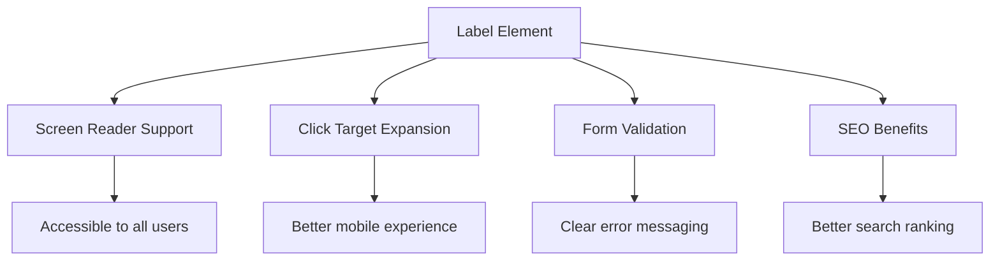
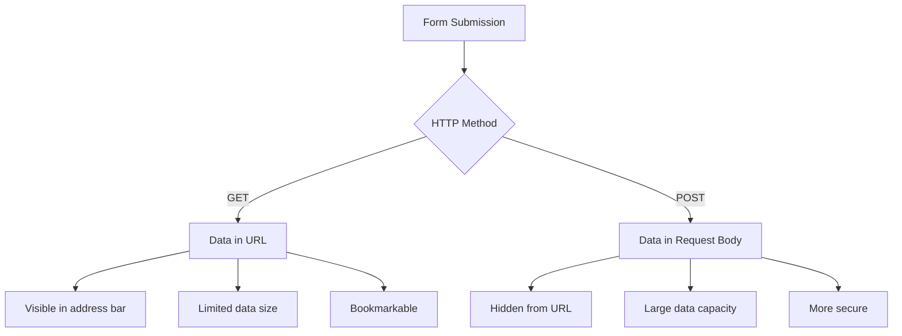
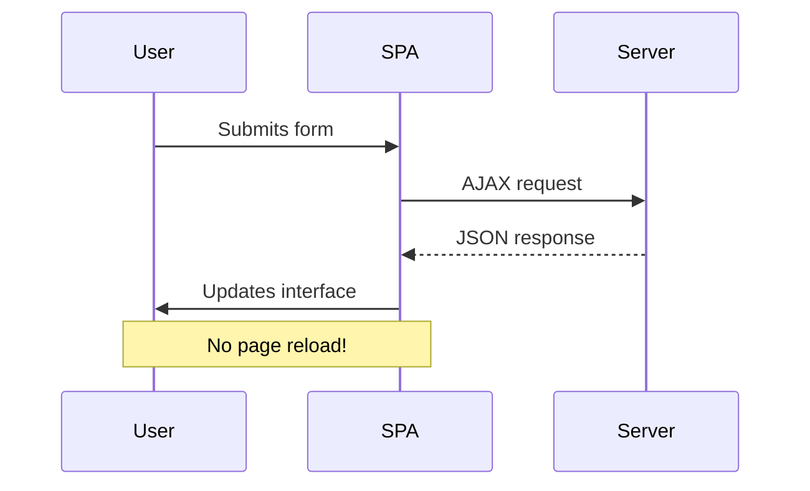
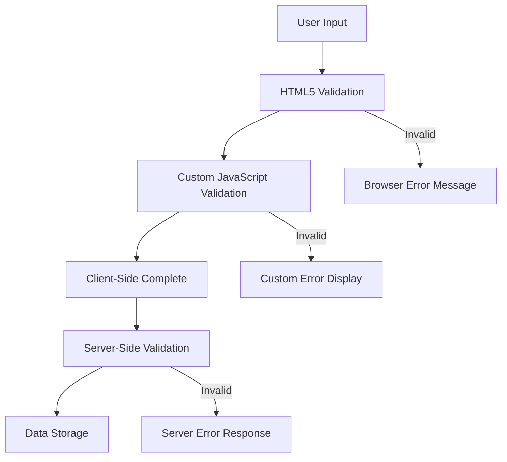
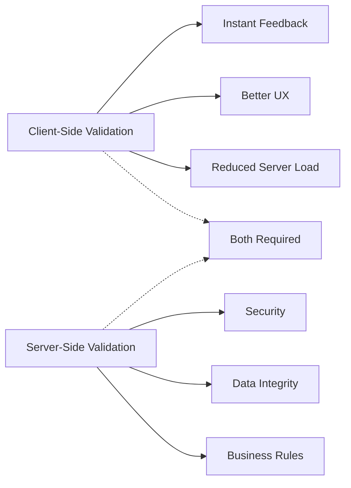

<!--
CO_OP_TRANSLATOR_METADATA:
{
  "original_hash": "b24f28fc46dd473aa9080f174182adde",
  "translation_date": "2025-10-24T23:34:10+00:00",
  "source_file": "7-bank-project/2-forms/README.md",
  "language_code": "sr"
}
-->
# Изградња апликације за банкарство, део 2: Изградња форме за пријаву и регистрацију

## Квиз пре предавања

[Квиз пре предавања](https://ff-quizzes.netlify.app/web/quiz/43)

Да ли сте икада попуњавали онлајн форму која је одбила ваш формат е-поште? Или сте изгубили све информације након што сте кликнули на дугме за слање? Сви смо се сусрели са оваквим фрустрирајућим искуствима.

Форме су мост између корисника и функционалности ваше апликације. Као што контролори летења користе пажљиве протоколе за безбедно навођење авиона до њихових одредишта, добро дизајниране форме пружају јасне повратне информације и спречавају скупе грешке. Лоше форме, с друге стране, могу брзо отерати кориснике, као што погрешна комуникација може изазвати хаос на прометном аеродрому.

У овом предавању, трансформисаћемо вашу статичну апликацију за банкарство у интерактивну апликацију. Научићете како да направите форме које валидирају унос корисника, комуницирају са серверима и пружају корисне повратне информације. Замислите то као изградњу контролне табле која омогућава корисницима да се крећу кроз функције ваше апликације.

На крају, имаћете комплетан систем за пријаву и регистрацију са валидирањем који води кориснике ка успеху, а не ка фрустрацији.

## Предуслови

Пре него што почнемо са изградњом форми, уверимо се да је све правилно подешено. Ово предавање наставља тамо где смо стали у претходном, па ако сте прескочили, можда ћете желети да се вратите и прво поставите основе.

### Потребно подешавање

| Компонента | Статус | Опис |
|------------|--------|-------|
| [HTML шаблони](../1-template-route/README.md) | ✅ Потребно | Основна структура апликације за банкарство |
| [Node.js](https://nodejs.org) | ✅ Потребно | ЈаваСкрипт окружење за сервер |
| [Bank API Server](../api/README.md) | ✅ Потребно | Бекенд сервис за складиштење података |

> 💡 **Савет за развој**: Покретаћете два одвојена сервера истовремено – један за фронтенд апликацију за банкарство и други за бекенд АПИ. Овај начин рада одражава стварни развој где фронтенд и бекенд услуге раде независно.

### Конфигурација сервера

**Ваш развојни окружење ће укључивати:**
- **Фронтенд сервер**: Служи вашој апликацији за банкарство (обично порт `3000`)
- **Бекенд АПИ сервер**: Обрађује складиштење и преузимање података (порт `5000`)
- **Оба сервера** могу радити истовремено без конфликта

**Тестирање ваше АПИ везе:**
```bash
curl http://localhost:5000/api
# Expected response: "Bank API v1.0.0"
```

**Ако видите одговор са верзијом АПИ-ја, спремни сте да наставите!**

---

## Разумевање HTML форми и контрола

HTML форме су начин на који корисници комуницирају са вашом веб апликацијом. Замислите их као телеграфски систем који је повезивао удаљена места у 19. веку – оне су протокол комуникације између намере корисника и одговора апликације. Када су пажљиво дизајниране, хватају грешке, воде формат уноса и пружају корисне сугестије.

Модерне форме су значајно напредније од основних текстуалних уноса. HTML5 је увео специјализоване типове уноса који аутоматски обрађују валидирање е-поште, форматирање бројева и избор датума. Ова побољшања користе и приступачности и мобилном корисничком искуству.

### Основни елементи форме

**Градивни елементи које свака форма треба да има:**

```html
<!-- Basic form structure -->
<form id="userForm" method="POST">
  <label for="username">Username</label>
  <input id="username" name="username" type="text" required>
  
  <button type="submit">Submit</button>
</form>
```

**Шта овај код ради:**
- **Креира** контејнер форме са јединственим идентификатором
- **Специфицира** HTTP метод за слање података
- **Повезује** ознаке са уносима ради приступачности
- **Дефинише** дугме за слање ради обраде форме

### Модерни типови уноса и атрибути

| Тип уноса | Сврха | Пример употребе |
|-----------|-------|-----------------|
| `text` | Општи текстуални унос | `<input type="text" name="username">` |
| `email` | Валидирање е-поште | `<input type="email" name="email">` |
| `password` | Скривени текстуални унос | `<input type="password" name="password">` |
| `number` | Нумерички унос | `<input type="number" name="balance" min="0">` |
| `tel` | Телефонски бројеви | `<input type="tel" name="phone">` |

> 💡 **Предност модерног HTML5**: Коришћење специфичних типова уноса пружа аутоматско валидирање, одговарајуће мобилне тастатуре и бољу подршку за приступачност без додатног ЈаваСкрипта!

### Типови дугмади и њихово понашање

```html
<!-- Different button behaviors -->
<button type="submit">Save Data</button>     <!-- Submits the form -->
<button type="reset">Clear Form</button>    <!-- Resets all fields -->
<button type="button">Custom Action</button> <!-- No default behavior -->
```

**Шта сваки тип дугмета ради:**
- **Дугмад за слање**: Покрећу слање форме и шаљу податке на одређену адресу
- **Дугмад за ресетовање**: Враћају сва поља форме на почетно стање
- **Обична дугмад**: Немају подразумевано понашање, захтевају прилагођени ЈаваСкрипт за функционалност

> ⚠️ **Важно упозорење**: Елемент `<input>` је самозатварајући и не захтева завршни таг. Модерна најбоља пракса је да се пише `<input>` без косе црте.

### Изградња форме за пријаву

Сада ћемо направити практичну форму за пријаву која демонстрира модерне HTML праксе. Почећемо са основном структуром и постепено је побољшавати додавањем функција за приступачност и валидирање.

```html
<template id="login">
  <h1>Bank App</h1>
  <section>
    <h2>Login</h2>
    <form id="loginForm" novalidate>
      <div class="form-group">
        <label for="username">Username</label>
        <input id="username" name="user" type="text" required 
               autocomplete="username" placeholder="Enter your username">
      </div>
      <button type="submit">Login</button>
    </form>
  </section>
</template>
```

**Разлагање онога што се овде дешава:**
- **Структурира** форму са семантичким HTML5 елементима
- **Групише** повезане елементе користећи `div` контејнере са значајним класама
- **Повезује** ознаке са уносима користећи атрибуте `for` и `id`
- **Укључује** модерне атрибуте као што су `autocomplete` и `placeholder` за бољи UX
- **Додаје** `novalidate` за обраду валидирања помоћу ЈаваСкрипта уместо подразумеваних подешавања прегледача

### Моћ правилних ознака

**Зашто су ознаке важне за модерни веб развој:**



**Шта правилне ознаке постижу:**
- **Омогућавају** читачима екрана да јасно најаве поља форме
- **Проширују** подручје које се може кликнути (кликом на ознаку фокусира се унос)
- **Побољшавају** употребљивост на мобилним уређајима са већим циљним површинама
- **Подржавају** валидирање форме са значајним порукама о грешкама
- **Унапређују** СЕО пружањем семантичког значења елементима форме

> 🎯 **Циљ приступачности**: Сваки унос форме треба да има повезану ознаку. Ова једноставна пракса чини ваше форме употребљивим за све, укључујући кориснике са инвалидитетом, и побољшава искуство за све кориснике.

### Изградња форме за регистрацију

Форма за регистрацију захтева детаљније информације за креирање комплетног корисничког налога. Направимо је са модерним HTML5 функцијама и побољшаном приступачношћу.

```html
<hr/>
<h2>Register</h2>
<form id="registerForm" novalidate>
  <div class="form-group">
    <label for="user">Username</label>
    <input id="user" name="user" type="text" required 
           autocomplete="username" placeholder="Choose a username">
  </div>
  
  <div class="form-group">
    <label for="currency">Currency</label>
    <input id="currency" name="currency" type="text" value="$" 
           required maxlength="3" placeholder="USD, EUR, etc.">
  </div>
  
  <div class="form-group">
    <label for="description">Account Description</label>
    <input id="description" name="description" type="text" 
           maxlength="100" placeholder="Personal savings, checking, etc.">
  </div>
  
  <div class="form-group">
    <label for="balance">Starting Balance</label>
    <input id="balance" name="balance" type="number" value="0" 
           min="0" step="0.01" placeholder="0.00">
  </div>
  
  <button type="submit">Create Account</button>
</form>
```

**У горњем примеру, урадили смо следеће:**
- **Организовали** свако поље у контејнерске дивове ради бољег стилизовања и распореда
- **Додали** одговарајуће атрибуте `autocomplete` за подршку аутоматског попуњавања у прегледачу
- **Укључили** корисни текст за навођење уноса корисника
- **Поставили** разумне подразумеване вредности користећи атрибут `value`
- **Применили** атрибуте за валидирање као што су `required`, `maxlength` и `min`
- **Користили** `type="number"` за поље стања са подршком за децимале

### Истраживање типова уноса и њиховог понашања

**Модерни типови уноса пружају побољшану функционалност:**

| Карактеристика | Предност | Пример |
|----------------|----------|--------|
| `type="number"` | Нумеричка тастатура на мобилним уређајима | Лакши унос стања |
| `step="0.01"` | Контрола прецизности децимала | Омогућава унос центи у валути |
| `autocomplete` | Аутоматско попуњавање у прегледачу | Брже попуњавање форме |
| `placeholder` | Контекстуални савети | Води очекивања корисника |

> 🎯 **Изазов приступачности**: Покушајте да се крећете кроз форме користећи само вашу тастатуру! Користите `Tab` за кретање између поља, `Space` за означавање поља и `Enter` за слање. Ово искуство вам помаже да разумете како корисници читача екрана интерагују са вашим формама.

## Разумевање метода слања форми

Када неко попуни вашу форму и кликне на дугме за слање, ти подаци морају негде да оду – обично на сервер који их може сачувати. Постоји неколико различитих начина на које се то може догодити, а познавање који да користите може вас спасити од неких главобоља касније.

Хајде да погледамо шта се заправо дешава када неко кликне на дугме за слање.

### Подразумевано понашање форме

Прво, посматрајмо шта се дешава са основним слањем форме:

**Тестирајте ваше тренутне форме:**
1. Кликните на дугме *Региструј се* у вашој форми
2. Посматрајте промене у адресној траци вашег прегледача
3. Приметите како се страница поново учитава и подаци се појављују у URL-у


### Поређење HTTP метода



**Разумевање разлика:**

| Метод | Намена | Локација података | Ниво сигурности | Ограничење величине |
|-------|--------|-------------------|-----------------|---------------------|
| `GET` | Претраге, филтери | Параметри URL-а | Низак (видљиво) | ~2000 карактера |
| `POST` | Кориснички налози, осетљиви подаци | Тело захтева | Виши (скривено) | Нема практичног ограничења |

**Разумевање основних разлика:**
- **GET**: Додаје податке форме у URL као параметре упита (прикладно за претраге)
- **POST**: Укључује податке у тело захтева (неопходно за осетљиве информације)
- **Ограничења GET-а**: Ограничења величине, видљиви подаци, историја прегледача
- **Предности POST-а**: Велики капацитет података, заштита приватности, подршка за отпремање датотека

> 💡 **Најбоља пракса**: Користите `GET` за форме за претрагу и филтере (преузимање података), користите `POST` за регистрацију корисника, пријаву и креирање података.

### Конфигурисање слања форме

Хајде да конфигуришемо вашу форму за регистрацију да правилно комуницира са бекенд АПИ-јем користећи метод POST:

```html
<form id="registerForm" action="//localhost:5000/api/accounts" 
      method="POST" novalidate>
```

**Шта ова конфигурација ради:**
- **Усмерава** слање форме на вашу АПИ адресу
- **Користи** POST метод за сигурно преношење података
- **Укључује** `novalidate` за обраду валидирања помоћу ЈаваСкрипта

### Тестирање слања форме

**Пратите ове кораке да тестирате вашу форму:**
1. **Попуните** форму за регистрацију са вашим информацијама
2. **Кликните** на дугме "Креирај налог"
3. **Посматрајте** одговор сервера у вашем прегледачу


**Шта треба да видите:**
- **Прегледач преусмерава** на URL АПИ адресе
- **JSON одговор** који садржи податке о новокреираном налогу
- **Потврда сервера** да је налог успешно креиран

> 🧪 **Време за експеримент**: Покушајте поново да се региструјете са истим корисничким именом. Какав одговор добијате? Ово вам помаже да разумете како сервер обрађује дуплиране податке и услове грешке.

### Разумевање JSON одговора

**Када сервер успешно обради вашу форму:**
```json
{
  "user": "john_doe",
  "currency": "$",
  "description": "Personal savings",
  "balance": 100,
  "id": "unique_account_id"
}
```

**Овај одговор потврђује:**
- **Креира** нови налог са вашим наведеним подацима
- **Додељује** јединствени идентификатор за будућу референцу
- **Враћа** све информације о налогу ради верификације
- **Означава** успешно складиштење у бази података

## Модерно руковање формама помоћу ЈаваСкрипта

Традиционално слање форми узрокује потпуно поновно учитавање странице, слично као што су ране свемирске мисије захтевале потпуно ресетовање система за корекцију курса. Овај приступ нарушава корисничко искуство и губи стање апликације.

Руковање формама помоћу ЈаваСкрипта функционише као континуирани систем навођења који користе модерне свемирске летелице – врши прилагођавања у реалном времену без губитка контекста навигације. Можемо пресрести слање форми, пружити тренутне повратне информације, елегантно обрадити грешке и ажурирати интерфејс на основу одговора сервера, док одржавамо позицију корисника у апликацији.

### Зашто избегавати поновно учитавање странице?



**Предности руковања формама помоћу ЈаваСкрипта:**
- **Одржава** стање апликације и контекст корисника
- **Пружа** детаљне поруке о грешкама за дебаговање  
- **Враћа** конзистентну структуру података за успешне и неуспешне случајеве  

### Моћ савременог Fetch API-ја  

**Предности Fetch API-ја у односу на старије методе:**  

| Карактеристика | Предност | Имплементација |  
|----------------|----------|----------------|  
| Заснован на промисима | Чист асинхрони код | `await fetch()` |  
| Прилагођавање захтева | Потпуна контрола HTTP-а | Заглавља, методе, тело |  
| Обрада одговора | Флексибилно парсирање података | `.json()`, `.text()`, `.blob()` |  
| Руковање грешкама | Свеобухватно хватање грешака | Try/catch блокови |  

> 🎥 **Сазнајте више**: [Туторијал о Async/Await](https://youtube.com/watch?v=YwmlRkrxvkk) - Разумевање асинхроних JavaScript образаца за савремени веб развој.  

**Кључни концепти за комуникацију са сервером:**  
- **Асинхроне функције** омогућавају паузирање извршења ради чекања одговора са сервера  
- **Кључна реч await** чини асинхрони код читљивим као синхрони код  
- **Fetch API** пружа савремене, промисе засноване HTTP захтеве  
- **Руковање грешкама** осигурава да ваша апликација реагује на мрежне проблеме на прикладан начин  

### Завршетак функције за регистрацију  

Хајде да све спојимо у комплетну, продукцијски спремну функцију за регистрацију:  

```javascript
async function register() {
  const registerForm = document.getElementById('registerForm');
  const submitButton = registerForm.querySelector('button[type="submit"]');
  
  try {
    // Show loading state
    submitButton.disabled = true;
    submitButton.textContent = 'Creating Account...';
    
    // Process form data
    const formData = new FormData(registerForm);
    const jsonData = JSON.stringify(Object.fromEntries(formData));
    
    // Send to server
    const result = await createAccount(jsonData);
    
    if (result.error) {
      console.error('Registration failed:', result.error);
      alert(`Registration failed: ${result.error}`);
      return;
    }
    
    console.log('Account created successfully!', result);
    alert(`Welcome, ${result.user}! Your account has been created.`);
    
    // Reset form after successful registration
    registerForm.reset();
    
  } catch (error) {
    console.error('Unexpected error:', error);
    alert('An unexpected error occurred. Please try again.');
  } finally {
    // Restore button state
    submitButton.disabled = false;
    submitButton.textContent = 'Create Account';
  }
}
```
  
**Ова побољшана имплементација укључује:**  
- **Пружа** визуелне повратне информације током слања форме  
- **Онемогућава** дугме за слање како би се спречило дуплирано слање  
- **Рукује** и очекиваним и неочекиваним грешкама на прикладан начин  
- **Приказује** поруке о успеху и грешкама које су прилагођене кориснику  
- **Ресетује** форму након успешне регистрације  
- **Враћа** стање корисничког интерфејса без обзира на исход  

### Тестирање ваше имплементације  

**Отворите алатке за развој у вашем претраживачу и тестирајте регистрацију:**  

1. **Отворите** конзолу претраживача (F12 → Конзола)  
2. **Попуните** форму за регистрацију  
3. **Кликните** на "Креирај налог"  
4. **Посматрајте** поруке у конзоли и повратне информације корисника  

  

**Шта би требало да видите:**  
- **Стање учитавања** се појављује на дугмету за слање  
- **Конзолни логови** приказују детаљне информације о процесу  
- **Порука о успеху** се појављује када креирање налога успе  
- **Форма се ресетује** аутоматски након успешног слања  

> 🔒 **Безбедносна напомена**: Тренутно, подаци се преносе преко HTTP-а, што није безбедно за продукцију. У стварним апликацијама увек користите HTTPS за шифровање преноса података. Сазнајте више о [безбедности HTTPS-а](https://en.wikipedia.org/wiki/HTTPS) и зашто је она неопходна за заштиту корисничких података.  

## Свеобухватна валидација форме  

Валидација форме спречава фрустрирајуће искуство откривања грешака тек након слања. Као и више слојева сигурности на Међународној свемирској станици, ефикасна валидација користи више слојева провере.  

Оптималан приступ комбинује валидацију на нивоу претраживача за тренутне повратне информације, JavaScript валидацију за побољшано корисничко искуство и серверску валидацију за сигурност и интегритет података. Ова редундантност осигурава и задовољство корисника и заштиту система.  

### Разумевање слојева валидације  


  
**Стратегија вишеслојне валидације:**  
- **HTML5 валидација**: Тренутне провере на нивоу претраживача  
- **JavaScript валидација**: Прилагођена логика и корисничко искуство  
- **Серверска валидација**: Коначне провере сигурности и интегритета података  
- **Прогресивно побољшање**: Функционише чак и ако је JavaScript онемогућен  

### HTML5 атрибути за валидацију  

**Савремени алати за валидацију који су вам на располагању:**  

| Атрибут | Сврха | Пример употребе | Понашање претраживача |  
|---------|-------|-----------------|-----------------------|  
| `required` | Обавезна поља | `<input required>` | Спречава празно слање |  
| `minlength`/`maxlength` | Ограничења дужине текста | `<input maxlength="20">` | Примењује ограничења карактера |  
| `min`/`max` | Опсег вредности | `<input min="0" max="1000">` | Проверава границе бројева |  
| `pattern` | Прилагођена regex правила | `<input pattern="[A-Za-z]+">` | Одговара специфичним форматима |  
| `type` | Валидација типа података | `<input type="email">` | Валидација специфична за формат |  

### CSS стилизовање валидације  

**Креирајте визуелне повратне информације за стања валидације:**  

```css
/* Valid input styling */
input:valid {
  border-color: #28a745;
  background-color: #f8fff9;
}

/* Invalid input styling */
input:invalid {
  border-color: #dc3545;
  background-color: #fff5f5;
}

/* Focus states for better accessibility */
input:focus:valid {
  box-shadow: 0 0 0 0.2rem rgba(40, 167, 69, 0.25);
}

input:focus:invalid {
  box-shadow: 0 0 0 0.2rem rgba(220, 53, 69, 0.25);
}
```
  
**Шта ови визуелни знаци постижу:**  
- **Зелени оквири**: Означавају успешну валидацију, попут зелених светала у контролном центру  
- **Црвени оквири**: Указују на грешке у валидацији које захтевају пажњу  
- **Истакнутости фокуса**: Пружају јасан визуелни контекст за тренутну локацију уноса  
- **Конзистентно стилизовање**: Успоставља предвидиве обрасце интерфејса које корисници могу да науче  

> 💡 **Савет**: Користите CSS псеудо-класе `:valid` и `:invalid` за тренутне визуелне повратне информације док корисници уносе податке, стварајући одзиван и користан интерфејс.  

### Имплементација свеобухватне валидације  

Хајде да побољшамо вашу форму за регистрацију са робусном валидацијом која пружа одлично корисничко искуство и квалитет података:  

```html
<form id="registerForm" method="POST" novalidate>
  <div class="form-group">
    <label for="user">Username <span class="required">*</span></label>
    <input id="user" name="user" type="text" required 
           minlength="3" maxlength="20" 
           pattern="[a-zA-Z0-9_]+" 
           autocomplete="username"
           title="Username must be 3-20 characters, letters, numbers, and underscores only">
    <small class="form-text">Choose a unique username (3-20 characters)</small>
  </div>
  
  <div class="form-group">
    <label for="currency">Currency <span class="required">*</span></label>
    <input id="currency" name="currency" type="text" required 
           value="$" maxlength="3" 
           pattern="[A-Z$€£¥₹]+" 
           title="Enter a valid currency symbol or code">
    <small class="form-text">Currency symbol (e.g., $, €, £)</small>
  </div>
  
  <div class="form-group">
    <label for="description">Account Description</label>
    <input id="description" name="description" type="text" 
           maxlength="100" 
           placeholder="Personal savings, checking, etc.">
    <small class="form-text">Optional description (up to 100 characters)</small>
  </div>
  
  <div class="form-group">
    <label for="balance">Starting Balance</label>
    <input id="balance" name="balance" type="number" 
           value="0" min="0" step="0.01" 
           title="Enter a positive number for your starting balance">
    <small class="form-text">Initial account balance (minimum $0.00)</small>
  </div>
  
  <button type="submit">Create Account</button>
</form>
```
  
**Разумевање побољшане валидације:**  
- **Комбинује** индикаторе обавезних поља са корисним описима  
- **Укључује** `pattern` атрибуте за валидацију формата  
- **Пружа** `title` атрибуте за приступачност и савете  
- **Додаје** помоћни текст за вођење корисничког уноса  
- **Користи** семантичку HTML структуру за бољу приступачност  

### Напредна правила валидације  

**Шта сваки правило валидације постиже:**  

| Поље | Правила валидације | Предност за корисника |  
|------|--------------------|-----------------------|  
| Корисничко име | `required`, `minlength="3"`, `maxlength="20"`, `pattern="[a-zA-Z0-9_]+"` | Осигурава важеће, јединствене идентификаторе |  
| Валута | `required`, `maxlength="3"`, `pattern="[A-Z$€£¥₹]+"` | Прихвата уобичајене симболе валута |  
| Стање | `min="0"`, `step="0.01"`, `type="number"` | Спречава негативне износе |  
| Опис | `maxlength="100"` | Разумна ограничења дужине |  

### Тестирање понашања валидације  

**Испробајте ове сценарије валидације:**  
1. **Пошаљите** форму са празним обавезним пољима  
2. **Унесите** корисничко име краће од 3 карактера  
3. **Покушајте** да унесете специјалне карактере у поље за корисничко име  
4. **Унесите** негативан износ стања  

  

**Шта ћете приметити:**  
- **Претраживач приказује** поруке о валидацији  
- **Стилизовање се мења** на основу стања `:valid` и `:invalid`  
- **Слање форме** је онемогућено док све валидације не прођу  
- **Фокус се аутоматски** помера на прво неважеће поље  

### Клијентска валидација vs Серверска валидација  


  
**Зашто су потребна оба слоја:**  
- **Клијентска валидација**: Пружа тренутне повратне информације и побољшава корисничко искуство  
- **Серверска валидација**: Осигурава сигурност и обрађује сложена пословна правила  
- **Комбиновани приступ**: Ствара робусне, кориснички пријатељске и сигурне апликације  
- **Прогресивно побољшање**: Функционише чак и када је JavaScript онемогућен  

> 🛡️ **Безбедносна напомена**: Никада се не ослањајте само на клијентску валидацију! Злонамерни корисници могу заобићи провере на клијентској страни, па је серверска валидација неопходна за сигурност и интегритет података.  

---

---

## Изазов GitHub Copilot Agent 🚀  

Искористите режим агента да завршите следећи изазов:  

**Опис:** Побољшајте форму за регистрацију са свеобухватном клијентском валидацијом и повратним информацијама за корисника. Овај изазов ће вам помоћи да увежбате валидацију форме, руковање грешкама и побољшање корисничког искуства са интерактивним повратним информацијама.  

**Задатак:** Направите комплетан систем валидације форме за регистрацију који укључује: 1) Повратне информације о валидацији у реалном времену за свако поље док корисник уноси податке, 2) Прилагођене поруке о валидацији које се појављују испод сваког поља за унос, 3) Поље за потврду лозинке са валидацијом подударања, 4) Визуелне индикаторе (попут зелених знакова за исправна поља и црвених упозорења за неисправна), 5) Дугме за слање које постаје активно само када све валидације прођу. Користите HTML5 атрибуте за валидацију, CSS за стилизовање стања валидације и JavaScript за интерактивно понашање.  

Сазнајте више о [режиму агента](https://code.visualstudio.com/blogs/2025/02/24/introducing-copilot-agent-mode) овде.  

## 🚀 Изазов  

Прикажите поруку о грешци у HTML-у ако корисник већ постоји.  

Ево примера како коначна страница за пријаву може изгледати након мало стилизовања:  

  

## Квиз након предавања  

[Квиз након предавања](https://ff-quizzes.netlify.app/web/quiz/44)  

## Преглед и самостално учење  

Програмери су постали веома креативни у својим напорима за креирање форми, посебно када је реч о стратегијама валидације. Сазнајте више о различитим токовима форми прегледајући [CodePen](https://codepen.com); можете ли пронаћи неке занимљиве и инспиративне форме?  

## Задатак  

[Стилизујте своју апликацију за банку](assignment.md)  

---

**Одрицање од одговорности**:  
Овај документ је преведен коришћењем услуге за превођење помоћу вештачке интелигенције [Co-op Translator](https://github.com/Azure/co-op-translator). Иако се трудимо да обезбедимо тачност, молимо вас да имате у виду да аутоматски преводи могу садржати грешке или нетачности. Оригинални документ на његовом изворном језику треба сматрати меродавним извором. За критичне информације препоручује се професионални превод од стране људи. Не преузимамо одговорност за било каква погрешна тумачења или неспоразуме који могу настати услед коришћења овог превода.