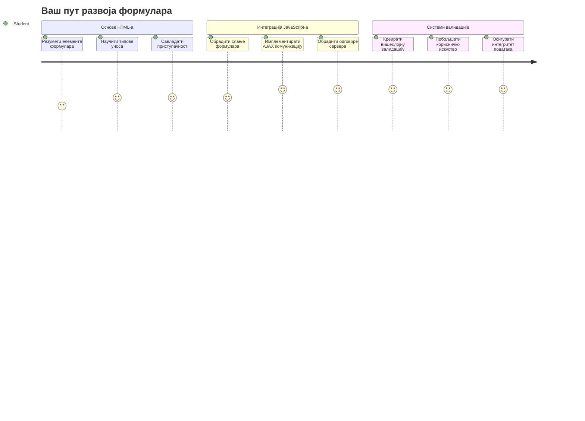
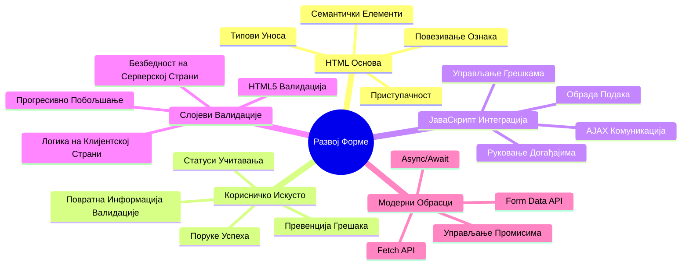
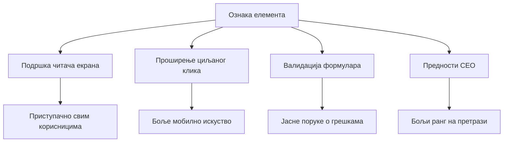
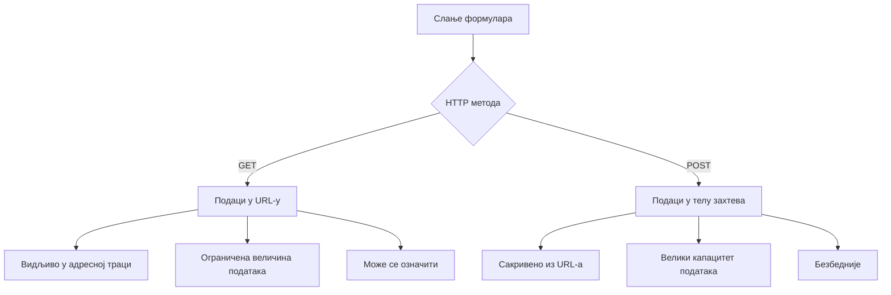
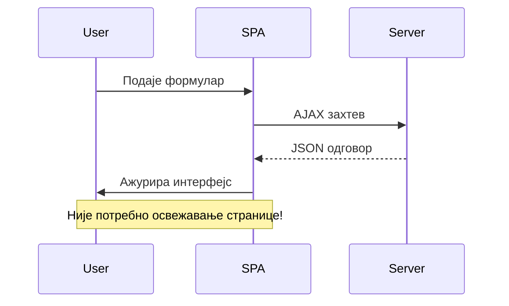
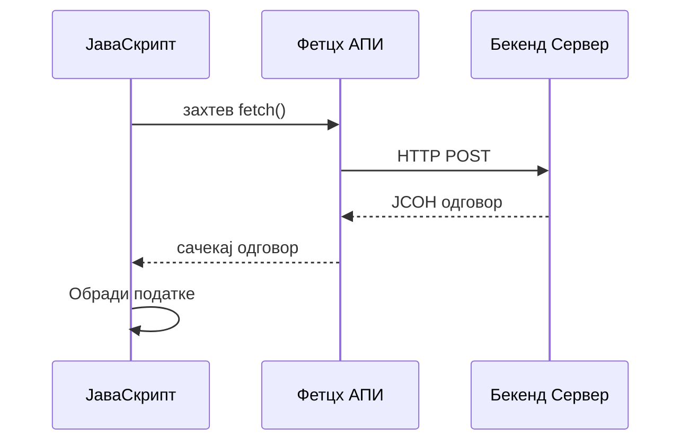
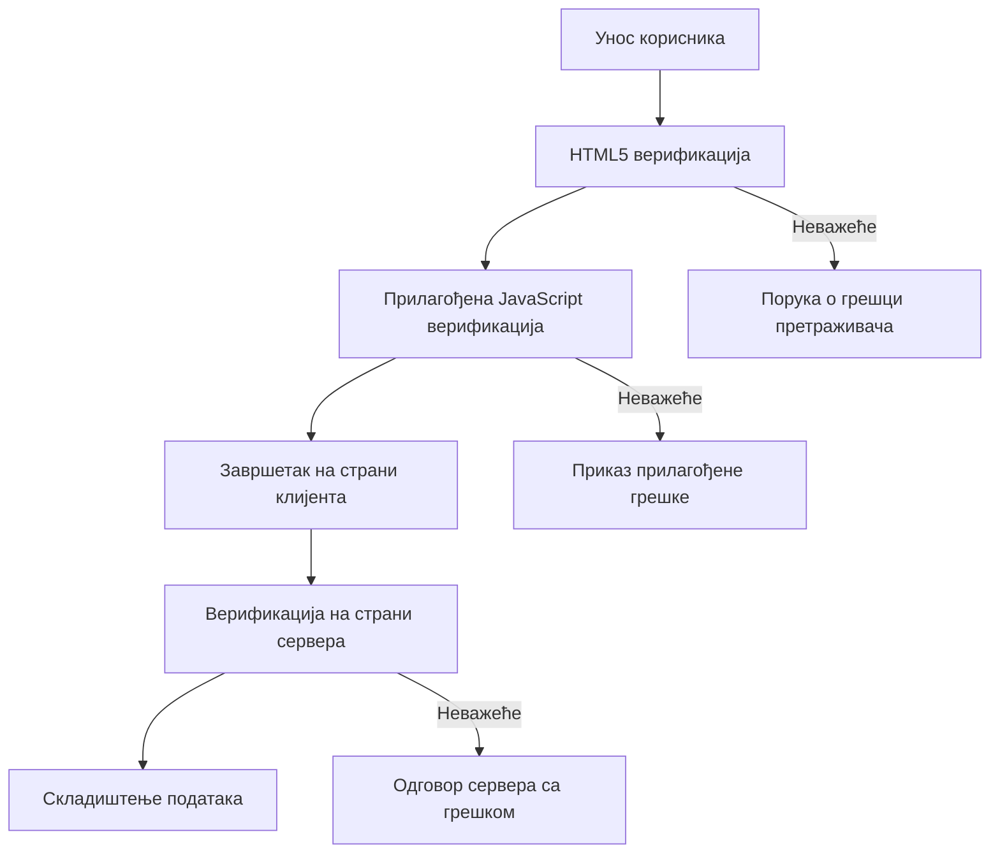
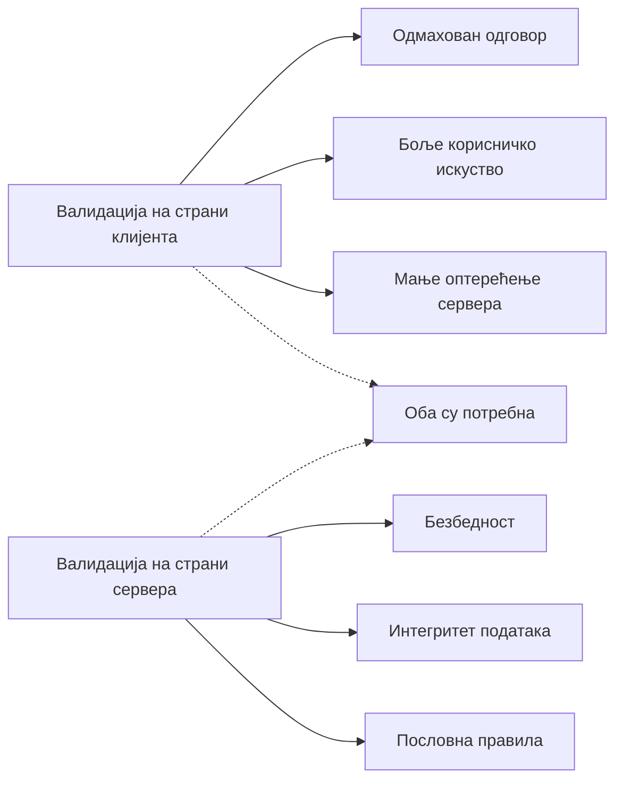
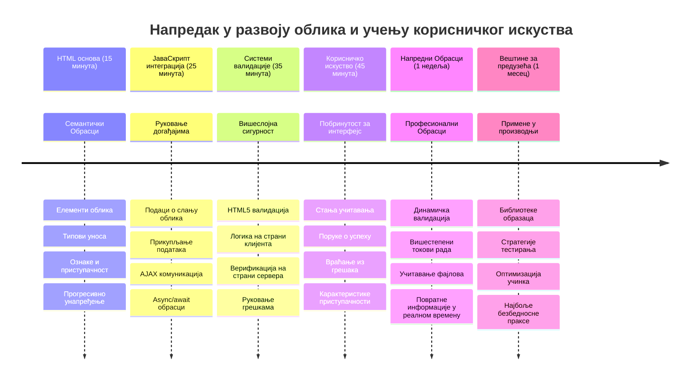

<!--
CO_OP_TRANSLATOR_METADATA:
{
  "original_hash": "7cbdbd132d39a2bb493e85bc2a9387cc",
  "translation_date": "2026-01-07T08:08:55+00:00",
  "source_file": "7-bank-project/2-forms/README.md",
  "language_code": "sr"
}
-->
# Направите банковску апликацију део 2: Направите формулар за пријаву и регистрацију


## Пре-предавачки квиз

[Пре-предавачки квиз](https://ff-quizzes.netlify.app/web/quiz/43)

Да ли сте икада попуњавали формулар онлајн и формулар одбио ваш формат е-поште? Или сте изгубили све своје информације када сте кликнули потврди? Свако од нас је имао таква фрустрирајућа искуства.

Формулари су мост између ваших корисника и функционалности ваше апликације. Као што контролори ваздушног саобраћаја користе прецизне протоколе за безбедно усмеравање авиона до одредишта, добро дизајнирани формулари пружају јасне повратне информације и спречавају скупе грешке. Лоши формулари, с друге стране, могу брже одбити кориснике него неспоразум на прометном аеродрому.

У овом лекцији претворићемо вашу статичну банковну апликацију у интерактивну апликацију. Научићете како да градите формуларе који верификују унос корисника, комуницирају са серверима и пружају корисне повратне информације. Замислите то као изградњу контролног интерфејса који омогућава корисницима да навигирају функцијама ваше апликације.

На крају, имаћете потпуни систем пријаве и регистрације са валидацијом који усмерава кориснике ка успеху, а не ка фрустрацији.


## Захтеви

Пре него што почнемо са грађењем формулара, хајде да проверимо да ли је све правилно подешено. Ова лекција наставља тамо где смо стали у претходној, па ако сте прескочили, можда би било добро да се вратите и прво поставите основе.

### Потребно окружење

| Компонента | Статус | Опис |
|------------|--------|-------|
| [HTML шаблони](../1-template-route/README.md) | ✅ Потребно | Ваша основна структура банковне апликације |
| [Node.js](https://nodejs.org) | ✅ Потребно | JavaScript окружење за сервер |
| [Bank API сервер](../api/README.md) | ✅ Потребно | Бекенд сервис за чување података |

> 💡 **Савет за развој**: Покретаћете два посебна сервера истовремено – један за фронтенд ваше банковне апликације, а други за бекенд API. Ова конфигурација одражава реални развој где фронтенд и бекенд функционишу независно.

### Поставке сервера

**Ваш развојни систем ће укључивати:**
- **Фронтенд сервер**: Плужи вашу банковну апликацију (обично порт `3000`)
- **Бекенд API сервер**: Обрађује чување и дохват података (порт `5000`)
- **Обa сервера** могу истовремено радити без конфликата

**Тестирање везе са API-јем:**
```bash
curl http://localhost:5000/api
# Очекивани одговор: "Банкарски API в1.0.0"
```

**Ако видите одговор верзије API-ja, спремни сте за наставак!**

---

## Разумевање HTML формулара и контрола

HTML формулари су начин на који корисници комуницирају са вашом веб апликацијом. Замислите их као телеграфски систем који је спајао удаљене локације у 19. веку – они су комуникациони протокол између корисничке намере и реакције апликације. Када су пажљиво дизајнирани, хватају грешке, усмеравају формат уноса и пружају корисне сугестије.

Модерни формулари су знатно сложенији од основних текстуалних уноса. HTML5 је увео специјализоване типове уноса који аутоматски обрађују валидацију е-поште, нумерички формат и избор датума. Ове унапређене функције побољшавају приступачност и мобилно корисничко искуство.

### Основни елементи формулара

**Грађевински блокови које сваки формулар треба:**

```html
<!-- Basic form structure -->
<form id="userForm" method="POST">
  <label for="username">Username</label>
  <input id="username" name="username" type="text" required>
  
  <button type="submit">Submit</button>
</form>
```

**Ево шта овај код ради:**
- **Креира** контејнер формулара са јединственим идентификатором
- **Одређује** HTTP метод за слање података
- **Повезује** ознаке са уносима ради приступачности
- **Дефинише** дугме за слање формулара

### Модерни типови уноса и атрибути

| Тип уноса | Намена | Пример употребе |
|-----------|--------|-----------------|
| `text` | Општи текстуални унос | `<input type="text" name="username">` |
| `email` | Валидација е-поште | `<input type="email" name="email">` |
| `password` | Скривени текстуални унос | `<input type="password" name="password">` |
| `number` | Нумерички унос | `<input type="number" name="balance" min="0">` |
| `tel` | Телефонски бројеви | `<input type="tel" name="phone">` |

> 💡 **Предност модерног HTML5**: Коришћење специфичних типова уноса обезбеђује аутоматску валидацију, одговарајуће тастатуре за мобилне уређаје и бољу подршку приступачности без додатног JavaScript-а!

### Типови и понашање дугмади

```html
<!-- Different button behaviors -->
<button type="submit">Save Data</button>     <!-- Submits the form -->
<button type="reset">Clear Form</button>    <!-- Resets all fields -->
<button type="button">Custom Action</button> <!-- No default behavior -->
```

**Ево шта сваки тип дугмета ради:**
- **Дугмад за слање**: Иницирају слање података и шаљу их на назначени крајњи сервер
- **Дугмад за ресетовање**: Враћају сва поља формулара у почетно стање
- **Редовна дугмад**: Немaју подразумевано понашање, захтевају прилагођени JavaScript

> ⚠️ **Важно**: `<input>` елемент је самозатварајући и нема потребу за затварањем. Модерна пракса је да се пише `<input>` без косе црте.

### Грађење вашег формулара за пријаву

Сада хајде да направимо практичан формулар за пријаву који демонстрира модерне HTML праксе. Почећемо са основном структуром и постепено ћемо је побољшавати додавањем приступачности и валидације.

```html
<template id="login">
  <h1>Bank App</h1>
  <section>
    <h2>Login</h2>
    <form id="loginForm" novalidate>
      <div class="form-group">
        <label for="username">Username</label>
        <input id="username" name="user" type="text" required 
               autocomplete="username" placeholder="Enter your username">
      </div>
      <button type="submit">Login</button>
    </form>
  </section>
</template>
```

**Разлагање дешавања:**
- **Структурира** формулар са семантичким HTML5 елементима
- **Групише** повезане елементе у `div` контејнере са значајним класама
- **Повезује** ознаке са уносима коришћењем `for` и `id` атрибута
- **Укључује** модерне атрибуте као што су `autocomplete` и `placeholder` ради бољег корисничког искуства
- **Додаје** `novalidate` да би се валидација радила у JavaScript-у уместо у претраживачу

### Моћ исправних ознака (labels)

**Зашто су ознаке битне за модеран веб развој:**


**Шта исправне ознаке омогућавају:**
- **Омогућавају** читачима екрана да јасно објављују поља формулара
- **Проширују** површину за кликање (клик на ознаку фокусира унос)
- **Побољшавају** употребљивост на мобилним уређајима већим додирним подручјима
- **Подржавају** валидацију формулара са смисленим порукама о грешкама
- **Побољшавају** SEO пружајући семантичко значење елементима формулара

> 🎯 **Циљ приступачности**: Сваком уносу треба придружена ознака. Ова једноставна пракса чини ваше формуларе корисним за све, укључујући кориснике са инвалидитетом, и побољшава искуство свим корисницима.

### Направите формулар за регистрацију

Формулар за регистрацију захтева детаљније информације за креирање потпуног корисничког налога. Направимо га са модерним HTML5 особинама и побољшаном приступачношћу.

```html
<hr/>
<h2>Register</h2>
<form id="registerForm" novalidate>
  <div class="form-group">
    <label for="user">Username</label>
    <input id="user" name="user" type="text" required 
           autocomplete="username" placeholder="Choose a username">
  </div>
  
  <div class="form-group">
    <label for="currency">Currency</label>
    <input id="currency" name="currency" type="text" value="$" 
           required maxlength="3" placeholder="USD, EUR, etc.">
  </div>
  
  <div class="form-group">
    <label for="description">Account Description</label>
    <input id="description" name="description" type="text" 
           maxlength="100" placeholder="Personal savings, checking, etc.">
  </div>
  
  <div class="form-group">
    <label for="balance">Starting Balance</label>
    <input id="balance" name="balance" type="number" value="0" 
           min="0" step="0.01" placeholder="0.00">
  </div>
  
  <button type="submit">Create Account</button>
</form>
```

**У горенаведеном:**
- **Организовали** смо сва поља у контејнере за лакше стилизовање и распоред
- **Додали** одговарајуће `autocomplete` атрибуте за подршку аутоматског попуњавања
- **Укључили** корисничке смернице помоћу `placeholder` текста
- **Поставили** смислене подразумеване вредности кроз `value` атрибут
- **Користили** атрибуте за валидацију као што су `required`, `maxlength` и `min`
- **Примeнили** `type="number"` за поље са стањем (балансом) са подршком за децимале

### Истраживање типова уноса и понашања

**Модерни типови уноса пружају напредне функције:**

| Особина | Предност | Пример |
|---------|----------|---------|
| `type="number"` | Нумеричка тастатура на мобилним уређајима | Лакши унос стања |
| `step="0.01"` | Контрола прецизности децимала | Омогућава центи у валути |
| `autocomplete` | Аутоматско попуњавање у претраживачу | Брже попуњавање формулара |
| `placeholder` | Контекстуалне наводнице | Усмерава очекивања корисника |

> 🎯 **Изазов приступачности**: Покушајте да навигирате формуларима коришћењем само тастатуре! Користите `Tab` за кретање између поља, `Space` за означавање поља за потврду и `Enter` за слање. Ово искуство вам помаже да разумете како корисници читача екрана користе формуле.

### 🔄 **Педагошки преглед**
**Разумевање основе формулара**: Пре имплементације JavaScript-а, проверите да ли разумете:
- ✅ Како семантички HTML креира приступачне структуре формулара
- ✅ Зашто типови уноса утичу на мобилне тастатуре и валидацију
- ✅ Однос између ознака и контрола у формулару
- ✅ Како атрибути формулара утичу на подразумевано понашање претраживача

**Брзи само-тест**: Шта се дешава ако пошаљете формулар без обраде у JavaScript-у?
*Одговор: Претраживач врши подразумевано слање, обично преусмеравајући на URL акције*

**Предности HTML5 формулара**: Модерни формулари пружају:
- **Уграђену валидацију**: Аутоматска провера е-поште и формата бројева
- **Оптимизацију за мобилне**: Одговарајуће тастатуре за различите типове уноса
- **Приступачност**: Подршка за читаче екрана и навигацију тастатуром
- **Прогресивно побољшање**: Ради чак и када је JavaScript искључен

## Разумевање метода слања формулара

Када неко попуни формулар и кликне „пошаљи“, ти подаци требају да оду негде – обично на сервер који их може саčувати. Постоји неколико начина како се то може десити, а знање који се користи може вам уштедети главобољу касније.

Хајде да видимо шта се заправо догађа када неко кликне то дугме за слање.

### Подразумевано понашање формулара

Прво, посматрајмо шта се дешава са основним слањем формулара:

**Тестирајте тренутне формуларе:**
1. Кликните дугме *Региструј се* у свом формулару
2. Пратите промене у адресној линији претраживача
3. Обратите пажњу како се страница освежава и подаци појављују у URL-у


### Поређење HTTP метода


**Разумевање разлика:**

| Метод | Примена | Локација података | Ниво безбедности | Ограничење величине |
|-------|---------|-------------------|------------------|---------------------|
| `GET` | Претрага, филтри | Параметри у URL-у | Низак (видљиво) | ~2000 карактера |
| `POST` | Кориснички налози, осетљиви подаци | Тело захтева | Виши (скривено) | Без практичног ограничења |

**Основне разлике:**
- **GET**: Додаје податке из формулара у URL као параметре (прикладно за претрагу)
- **POST**: Укључује податке у тело захтева (важно за осетљиве информације)
- **Ограничења GET**: Ограничена величина, видљиви подаци, трајна историја у претраживачу
- **Предности POST**: Велика капацитет података, заштита приватности, подршка за слање фајлова

> 💡 **Најбоља пракса**: Користите `GET` за форме за претрагу и филтре (дohват података), а `POST` за регистрацију, пријаву и креирање података.

### Конфигурисање слања формулара

Подесите ваш формулар за регистрацију да правилно комуницира са бекенд API-јем користећи POST метод:

```html
<form id="registerForm" action="//localhost:5000/api/accounts" 
      method="POST" novalidate>
```

**Ова конфигурација ради:**
- **Усмеравa** слање формулара на API крајњу тачку
- **Користи** POST метод за безбедан пренос података
- **Укључује** `novalidate` да би валидација била преко JavaScript-а

### Тестирање слања формулара

**Следите ове кораке за тестирање формулара:**
1. **Попуните** формулар за регистрацију својим подацима
2. **Кликните** дугме „Креирај налог“
3. **Пратите** одговор сервера у вашем претраживачу


**Шта треба да видите:**
- **Претраживач преусмерава** на API крајњу тачку
- **JSON одговор** који садржи податке о вашем новом налогу
- **Потврду сервера** да је налог успешно креиран

> 🧪 **Вежба**: Покушајте поново да се региструјете са истим корисничким именом. Какав одговор добијате? Ово вам показује како сервер обрађује дупликате и услове грешака.

### Разумевање JSON одговора

**Када сервер у успешно обради ваш формулар:**
```json
{
  "user": "john_doe",
  "currency": "$",
  "description": "Personal savings",
  "balance": 100,
  "id": "unique_account_id"
}
```

**Овај одговор потврђује:**
- **Креира** нови налог са вашим подацима
- **Додаје** јединствени идентификатор за будућу употребу
- **Враћа** све информације о налогу ради провере
- **Назнака** успешног чувања у бази података

## Модерно руковање формуларима са JavaScript-ом

Традиционални формулари изазивају потпуно учитавање странице, слично као што су ране свемирске мисије захтевале потпуно ресетовање система ради исправки курса. Овај приступ ремети корисничко искуство и губи стање апликације.

JavaScript руковање формуларима ради као континуирани системи навигације који користе модерни свемирски летелици – врше реално- време подешавања без губитка контекста навигације. Можемо пресрести слање формулара, пружити одмах повратне информације, обрадити грешке и ажурирати интерфејс на основу одговора сервера, док корисник остаје у апликацији.

### Зашто избегавати учитавање странице?


**Предности JavaScript руковања формуларима:**
- **Одржава** стање апликације и контекст корисника
- **Пружа** тренутне повратне информације и индикаторе учитавања
- **Омогућава** динамичку обраду грешака и валидацију
- **Креира** глатко искуство као у нативној апликацији
- **Дозвољава** условну логику на основу одговора сервера

### Прелазак са традиционалног на модеран приступ формуларима

**Изазови традиционалног приступа:**
- **Прерађује** кориснике ван апликације
- **Губи** тренутно стање и контекст апликације
- **Захтева** потпуно учитавање странице ради једноставних операција
- **Нуди** ограничену контролу повратних информација

**Предности модерног JavaScript приступа:**
- **Чува** кориснике у оквиру ваше апликације
- **Одржава** све стање и податке апликације
- **Омогућава** валидацију и повратне информације у реалном времену
- **Подржава** прогресивно побољшање и приступачност

### Имплементација руковања формуларима са JavaScript-ом

Хајде да заменимо традиционално слање формулара модерним JavaScript обрадом догађаја:

```html
<!-- Remove the action attribute and add event handling -->
<form id="registerForm" method="POST" novalidate>
```

**Додајте логику регистрације у ваш `app.js` фајл:**

```javascript
// Савремено руковање формама засновано на догађајима
function register() {
  const registerForm = document.getElementById('registerForm');
  const formData = new FormData(registerForm);
  const data = Object.fromEntries(formData);
  const jsonData = JSON.stringify(data);
  
  console.log('Form data prepared:', data);
}

// Прикључи слушаоца догађаја када се страница учита
document.addEventListener('DOMContentLoaded', () => {
  const registerForm = document.getElementById('registerForm');
  registerForm.addEventListener('submit', (event) => {
    event.preventDefault(); // Онемогући подразумевано слање форме
    register();
  });
});
```

**Разлагање дешавања:**
- **Спречава** подразумевано слање формулара помоћу `event.preventDefault()`
- **Дохвата** елемент формулара коришћењем модерних методa селекције DOM-а
- **Извлачи** податке из формулара помоћу снажног `FormData` API-ја
- **Претвара** FormData у објекат преко `Object.fromEntries()`
- **Серијализује** податке у JSON формат за комуникацију са сервером
- **Логира** обрађене податке за дебаговање и проверу

### Разумевање FormData API-ја

**FormData API пружа моћно руковање формулама:**
```javascript
// Пример онога што FormData хвата
const formData = new FormData(registerForm);

// FormData аутоматски хвата:
// {
//   "корисник": "john_doe",
//   "валута": "$",
//   "опис": "Лични рачун",
//   "биланc": "100"
// }
```

**Предности FormData APIја:**
- **Свеобухватно прикупљање**: Обухвата све елементе формулара укључујући текст, датотеке и сложене уносе
- **Препознавање типова**: Аутоматски рукује различитим типовима уноса без потребе за прилагођеним кодом
- **Ефикасност**: Укида ручно прикупљање поља једним позивом APIја
- **Прилагодљивост**: Остаје функционалан док се структура формулара мења

### Креирање функције за комуникацију са сервером

Сада хајде да направимо робусну функцију за комуникацију са вашим API сервером користећи савремене JavaScript обрасце:

```javascript
async function createAccount(account) {
  try {
    const response = await fetch('//localhost:5000/api/accounts', {
      method: 'POST',
      headers: { 
        'Content-Type': 'application/json',
        'Accept': 'application/json'
      },
      body: account
    });
    
    // Провери да ли је одговор био успешан
    if (!response.ok) {
      throw new Error(`HTTP error! status: ${response.status}`);
    }
    
    return await response.json();
  } catch (error) {
    console.error('Account creation failed:', error);
    return { error: error.message || 'Network error occurred' };
  }
}
```

**Разумевање асинхроног JavaScript-а:**


**Шта ова савремена имплементација постиже:**
- **Користи** `async/await` за читљив асинхрони код
- **Узима у обзир** правилно управљање грешкама помоћу try/catch блокова
- **Проверaва** статус одговора пре обраде података
- **Поставља** одговарајуће заглавље за JSON комуникацију
- **Пружа** детаљне поруке о грешкама за лакше отклањање проблема
- **Враћа** кохерентну структуру података и за успех и за грешке

### Моћ модерног Fetch APIја

**Предности Fetch APIја у односу на старије методе:**

| Карактеристика | Предност | Имплементација |
|----------------|----------|----------------|
| Promise-based  | Чист асинхрони код | `await fetch()` |
| Прилагођавање захтева | Потпуна контрола HTTP-а | Заглавља, методе, тело |
| Обрада одговора | Флексибилна парсинг података | `.json()`, `.text()`, `.blob()` |
| Управљање грешкама | Свеобухватно хватање грешака | Try/catch блокови |

> 🎥 **Сазнајте више**: [Async/Await Tutorial](https://youtube.com/watch?v=YwmlRkrxvkk) - Разумевање асинхроних JavaScript образаца за модерни веб развој.

**Кључни концепти за комуникацију са сервером:**
- **Асинхроне функције** дозвољавају паузирање извршења док се чека одговор сервера
- **Кључна реч await** чини асинхрони код да изгледа као синхрони
- **Fetch API** пружа модерне, базиране на промисима HTTP захтеве
- **Управљање грешкама** осигурава да апликација лепо реагује на проблеме у мрежи

### Завршавање функције регистрације

Хајде да спојимо све у комплетну, продукцијски спремну функцију регистрације:

```javascript
async function register() {
  const registerForm = document.getElementById('registerForm');
  const submitButton = registerForm.querySelector('button[type="submit"]');
  
  try {
    // Прикажи статус учитавања
    submitButton.disabled = true;
    submitButton.textContent = 'Creating Account...';
    
    // Обради податке из формулара
    const formData = new FormData(registerForm);
    const jsonData = JSON.stringify(Object.fromEntries(formData));
    
    // Пошаљи серверу
    const result = await createAccount(jsonData);
    
    if (result.error) {
      console.error('Registration failed:', result.error);
      alert(`Registration failed: ${result.error}`);
      return;
    }
    
    console.log('Account created successfully!', result);
    alert(`Welcome, ${result.user}! Your account has been created.`);
    
    // Ресетуј формулар након успешне регистрације
    registerForm.reset();
    
  } catch (error) {
    console.error('Unexpected error:', error);
    alert('An unexpected error occurred. Please try again.');
  } finally {
    // Врати статус дугмета
    submitButton.disabled = false;
    submitButton.textContent = 'Create Account';
  }
}
```

**Ова побољшана имплементација укључује:**
- **Пружа** визуелну повратну информацију током слања формулара
- **Онемогућава** дугме за слање да спречи дупле подносе
- **Руководи** и очекиваним и неочекиваним грешкама на прихватљив начин
- **Приказује** корисничке поруке о успеху и грешци
- **Ресетује** формулар после успешне регистрације
- **Враћа** стање корисничког интерфејса без обзира на исход

### Тестирање ваше имплементације

**Отворите алате за развој у прегледачу и тестирате регистрацију:**

1. **Отворите** конзолу прегледача (F12 → Console таб)
2. **Попуните** формулар за регистрацију
3. **Кликните** на "Create Account"
4. **Пратите** поруке у конзоли и повратне информације кориснику


**Шта бисте требали видети:**
- **Статус учитавања** се појављује на дугмету за слање
- **Логови у конзоли** показују детаљне информације о процесу
- **Порука о успеху** се појављује када создавање налога успе
- **Формулар се аутоматски ресетује** након успешно послатог податка

> 🔒 **Безбедносна напомена**: Тренутно се подаци преносе преко HTTP-а, што није безбедно за продукционо окружење. У правим апликацијама увек користите HTTPS за шифровање преноса података. Сазнајте више о [HTTPS безбедности](https://en.wikipedia.org/wiki/HTTPS) и зашто је важно заштитити корисничке податке.

### 🔄 **Педагошки преглед**
**Интеграција модерног JavaScript-а**: Потврдите ваше разумевање асинхроног руковања формама:
- ✅ Како `event.preventDefault()` мења подразумевано понашање формулара?
- ✅ Зашто је FormData API ефикаснији од ручног прикупљања поља?
- ✅ Како async/await обрасци побољшавају читљивост кода?
- ✅ Коју улогу има управљање грешкама за корисничко искуство?

**Архитектура система**: Ваше руковање формама показује:
- **Програмирање вођено догађајима**: Форма реагује на акције корисника без освежавања странице
- **Асинхрона комуникација**: Захтеви серверу не блокирају кориснички интерфејс
- **Управљање грешкама**: Грациозно деградирање при мрежним проблемима
- **Управљање стањем**: UI ажурирања одражавају одговоре сервера на одговарајући начин
- **Прогресивно побољшање**: Основна функционалност ради, док је JavaScript додатак

**Професионални обрасци**: Имплементирали сте:
- **Једну одговорност (Single Responsibility)**: Функције имају јасне и фокусиране улоге
- **Граничнике грешака (Error Boundaries)**: Try/catch блокови спречавају рушење апликације
- **Повратне информације кориснику**: Статуси учитавања и поруке о успеху/грешци
- **Трансформацију података**: FormData у JSON за комуникацију са сервером

## Свеобухватна валидација формулара

Валидација спречава фрустрирајуће откривање грешака тек после слања. Као што више слојева система на Међународној космичкој станици обезбеђује сигурност, тако и ефикасна валидација користи више нивоа контроле.

Оптималан приступ комбинује браузерску валидацију за тренутне повратне информације, JavaScript валидацију ради бољег корисничког искуства и серверску валидацију ради безбедности и интегритета података. Ова вишеструка провера осигурава и задовољство корисника и заштиту система.

### Разумевање слојева валидације


**Стратегија валидације у више слојева:**
- **HTML5 валидација**: Тренутна провера у прегледачу
- **JavaScript валидација**: Прилагођена логика и корисничко искуство
- **Серверска валидација**: Коначна безбедносна и интегритетна провера
- **Прогресивно побољшање**: Ради чак и ако је JavaScript онемогућен

### HTML5 Атрибути за валидацију

**Савремени алати за валидацију на располагању:**

| Атрибут | Сврха | Пример употребе | Понашање прегледача |
|---------|-------|-----------------|---------------------|
| `required` | Обавезна поља | `<input required>` | Спречава празно слање |
| `minlength`/`maxlength` | Ограничења дужине текста | `<input maxlength="20">` | Ограничава број карактера |
| `min`/`max` | Опсег бројева | `<input min="0" max="1000">` | Проверава опсег бројева |
| `pattern` | Прилагођена regex правила | `<input pattern="[A-Za-z]+">` | Одговара одређеним форматима |
| `type` | Валидација типа података | `<input type="email">` | Валидација по формату |

### CSS стилови за валидацију

**Креирајте визуелне повратне информације за стања валидације:**

```css
/* Valid input styling */
input:valid {
  border-color: #28a745;
  background-color: #f8fff9;
}

/* Invalid input styling */
input:invalid {
  border-color: #dc3545;
  background-color: #fff5f5;
}

/* Focus states for better accessibility */
input:focus:valid {
  box-shadow: 0 0 0 0.2rem rgba(40, 167, 69, 0.25);
}

input:focus:invalid {
  box-shadow: 0 0 0 0.2rem rgba(220, 53, 69, 0.25);
}
```

**Шта ови визуелни знаци постижу:**
- **Зелене ивице**: Означавају успешну валидацију, као зелене лампице у мисији контроле
- **Црвене ивице**: Сигнализирају грешке које треба исправити
- **Акценти на фокусу**: Дају јасан визуелни контекст тренутном улазном пољу
- **Доследни стилови**: Успостављају предвидљиве образце интерфејса које корисници могу научити

> 💡 **Савет**: Користите CSS псевдо-класе `:valid` и `:invalid` да пружите тренутне визуелне повратне информације док корисник уноси, што креира одзиван и користан интерфејс.

### Имплементација свеобухватне валидације

Хајде да унапредимо ваш образац за регистрацију са робусном валидацијом која пружа одлично корисничко искуство и квалитет података:

```html
<form id="registerForm" method="POST" novalidate>
  <div class="form-group">
    <label for="user">Username <span class="required">*</span></label>
    <input id="user" name="user" type="text" required 
           minlength="3" maxlength="20" 
           pattern="[a-zA-Z0-9_]+" 
           autocomplete="username"
           title="Username must be 3-20 characters, letters, numbers, and underscores only">
    <small class="form-text">Choose a unique username (3-20 characters)</small>
  </div>
  
  <div class="form-group">
    <label for="currency">Currency <span class="required">*</span></label>
    <input id="currency" name="currency" type="text" required 
           value="$" maxlength="3" 
           pattern="[A-Z$€£¥₹]+" 
           title="Enter a valid currency symbol or code">
    <small class="form-text">Currency symbol (e.g., $, €, £)</small>
  </div>
  
  <div class="form-group">
    <label for="description">Account Description</label>
    <input id="description" name="description" type="text" 
           maxlength="100" 
           placeholder="Personal savings, checking, etc.">
    <small class="form-text">Optional description (up to 100 characters)</small>
  </div>
  
  <div class="form-group">
    <label for="balance">Starting Balance</label>
    <input id="balance" name="balance" type="number" 
           value="0" min="0" step="0.01" 
           title="Enter a positive number for your starting balance">
    <small class="form-text">Initial account balance (minimum $0.00)</small>
  </div>
  
  <button type="submit">Create Account</button>
</form>
```

**Разумевање унапређене валидације:**
- **Комбинује** индикаторе обавезних поља са корисним описима
- **Укључује** `pattern` атрибуте за валидацију формата
- **Пружа** `title` атрибуте за приступачност и трајне објашњења
- **Додаје** помоћни текст за вођење корисника кроз унос
- **Користи** семантичку HTML структуру за бољу приступачност

### Напредна правила за валидацију

**Шта сваки правилник валидације постиже:**

| Поље | Правила валидације | Корисничка корист |
|-------|---------------------|-------------------|
| Корисничко име | `required`, `minlength="3"`, `maxlength="20"`, `pattern="[a-zA-Z0-9_]+"` | Осигурава важеће, јединствене идентификаторе |
| Валутa | `required`, `maxlength="3"`, `pattern="[A-Z$€£¥₹]+"` | Прихвата честе симболе валута |
| Стање рачуна | `min="0"`, `step="0.01"`, `type="number"` | Спречава негативне износе |
| Опис | `maxlength="100"` | Ограничава разумну дужину |

### Тестирање понашања валидације

**Испробајте ове сценарије валидације:**
1. **Пошаљите** формулар са празним обавезним пољима
2. **Унесите** корисничко име краће од 3 карактера
3. **Унесите** специјалне знакове у поље за корисничко име
4. **Унесите** негативан износ стања на рачуну


**Шта ћете приметити:**
- **Прегледач приказује** нативне поруке о валидацији
- **Стилови се мењају** у зависности од `:valid` и `:invalid` стања
- **Слање формулара је спречено** док све валидације не прођу
- **Фокус се аутоматски помера** на прво неважеће поље

### Клијентска против серверске валидације


**Зашто су потребни оба слоја:**
- **Клијентска валидација**: Пружа одмах повратне информације и побољшава корисничко искуство
- **Серверска валидација**: Осигурава безбедност и обраду комплексних пословних правила
- **Комбиновани приступ**: Креира робусне, кориснику пријатне и безбедне апликације
- **Прогресивно побољшање**: Ради чак и кад је JavaScript онемогућен

> 🛡️ **Безбедносна напомена**: Не верујте само клијентској валидацији! Злонамерни корисници могу заобићи контроле на клијенту; серверска валидација је кључна за безбедност и интегритет података.

### ⚡ **Шта можете урадити за следећих 5 минута**
- [ ] Тестирати формулар са неважећим подацима и видети поруке о валидацији
- [ ] Покушати поднети формулар са онемогућеним JavaScriptом и видети HTML5 валидацију
- [ ] Отворити ДевТулс у прегледачу и инспектовати податке формулара које шаљете серверу
- [ ] Испробати различите типове уноса и видети промене мобилне тастатуре

### 🎯 **Шта можете постићи у овој сати**
- [ ] Завршити квиз након лекције и разумети концепте руковања формама
- [ ] Имплементирати изазов свеобухватне валидације са повратним информацијама у реалном времену
- [ ] Додати CSS стилове за професионалан изглед формулара
- [ ] Направити руковање грешкама за дупле корисничке налоге и серверске грешке
- [ ] Додати поља за потврду лозинке са међусобном валидацијом

### 📅 **Ваша недељна путања овладавања формама**
- [ ] Завршити пуну банкарску апликацију са напредним функцијама формулара
- [ ] Имплементирати могућности отпремања датотека за профилне слике или документе
- [ ] Додати вишестепене формуларе са индикаторима напретка и управљањем стањем
- [ ] Креирати динамичке формуларе који се прилагођавају изборима корисника
- [ ] Имплементирати аутоматско чување и опоравак формулара за боље корисничко искуство
- [ ] Додати напредне валидације као што су потврда е-поште и форматирање телефонских бројева

### 🌟 **Ваш месечни програм овладавања Frontend развоја**
- [ ] Креирати сложене апликације формулара са условном логиком и радним токовима
- [ ] Упознати се са библиотекама и оквирима за форме ради бржег развоја
- [ ] Овладати смерницама приступачности и инклузивног дизајна
- [ ] Имплементирати интернационализацију и локализацију за глобалне формуларе
- [ ] Креирати поновно употребљиве компоненте формулара и дизајн системе
- [ ] Допринети open source пројектима везаним за форме и делити добре праксе

## 🎯 Ваш временски оквир за овладавање развојем формулара


### 🛠️ Резиме вашег алата за развој формулара

Након што сте завршили ову лекцију, овладали сте:
- **HTML5 Форме**: Семантичка структура, типови уноса и приступачност
- **JavaScript руковање формама**: Управљање догађајима, прикупљање података и AJAX комуникација
- **Архитектура валидације**: Валидација у више слојева за безбедност и корисничко искуство
- **Асинхроно програмирање**: Модерни fetch API и async/await обрасци
- **Управљање грешкама**: Свеобухватно руковање грешкама и системи повратних информација кориснику
- **Дизајн корисничког искуства**: Статуси учитавања, поруке о успеху и опоравак од грешака
- **Прогресивно побољшање**: Форме које раде на свим прегледачима и уређајима

**Примена у стварном свету**: Вештине развоја формулара директно се примењују на:
- **E-commerce апликације**: Процеси куповине, регистрација налога и плаћање
- **Корпоративни софтвер**: Системи за унос података, интерфејси за извештавање и радне токове
- **Системи за управљање садржајем**: Платформе за објављивање, кориснички креирани садржај и административни панели
- **Финансијске апликације**: Банкарски интерфејси, инвестиционе платформе и трансакциони системи
- **Здравствени системи**: Портали за пацијенте, заказивање прегледа и медицински картиони
- **Образовне платформе**: Регистрација на курсеве, алати за процену и системи за управљање учењем

**Стручне вештине које сте стекли**: Сада можете:
- **Дизајнирати** приступачне форме које раде за све кориснике укључујући особе са инвалидитетом
- **Имплементирати** сигурну валидацију која спречава корупцију података и безбедносне пропусте
- **Креирати** одзивне корисничке интерфејсе који дају јасне повратне информације
- **Отклањати грешке** у сложеним интеракцијама помоћу алата за развој у прегледачу и мрежне анализе
- **Оптимизовати** перформансе формулара путем ефикасног руковања подацима и стратегија валидације

**Принципи frontend развоја које сте овладали**:
- **Архитектура вођена догађајима**: Руковање корисничком интеракцијом и системима одговора
- **Асинхроно програмирање**: Некомплетирајућа комуникација са сервером и руковање грешкама
- **Валидација података**: Клијентска и серверска безбедност и проверa интегритета
- **Дизајн корисничког искуства**: Интуитивни интерфејси који воде кориснике ка успеху
- **Инжењеринг приступачности**: Инклузивни дизајн који одговара различитим потребама корисника

**Следећи ниво**: Спремни сте да истражите напредне библиотеке формулара, имплементирате сложена правила валидације или градите енергичне системе за прикупљање података!

🌟 **Постигнуће откључано**: Конструисали сте потпуно систему за руковање формама са професионалном валидацијом, управљањем грешкама и обрасцима корисничког искуства!

---


---

## GitHub Copilot Agent изазов 🚀

Користите Agent режим да завршите следећи изазов:

**Опис:** Унапредите формулар за регистрацију са свеобухватном клијентском валидацијом и повратним информацијама кориснику. Овај изазов ће вам помоћи да увежбате валидацију формулара, управљање грешкама и побољшање корисничког искуства кроз интерактивне повратне информације.
**Промпт:** Креирајте комплетан систем валидације формулара за регистрациони формулар који укључује: 1) повратне информације о валидацији у реалном времену за сваки унос док корисник куца, 2) прилагођене поруке о валидацији које се појављују испод сваког поља за унос, 3) поље за потврду лозинке са провером подударања, 4) визуелне индикаторе (као што су зелене ознаке за валидна поља и црвена упозорења за невалидна), 5) дугме за слање које се омогућава тек када све валидације прођу. Користите HTML5 атрибуте за валидацију, CSS за стилизовање стања валидације и JavaScript за интерактивно понашање.

Сазнајте више о [agent mode](https://code.visualstudio.com/blogs/2025/02/24/introducing-copilot-agent-mode) овде.

## 🚀 Изазов

Прикажи поруку о грешци у HTML-у ако корисник већ постоји.

Ево примера како може изгледати завршна страница за пријаву након мало стилизовања:


## Квиз после предавања

[Post-lecture quiz](https://ff-quizzes.netlify.app/web/quiz/44)

## Преглед и самостално учење

Програмери су веома креативни у изградњи формулара, посебно када је реч о стратегијама валидације. Упознајте различите токове формулара прегледом на [CodePen](https://codepen.com); можете ли пронаћи неке занимљиве и инспиративне форме?

## Задатак

[Style your bank app](assignment.md)

---

<!-- CO-OP TRANSLATOR DISCLAIMER START -->
**Одрицање одговорности**:
Овај документ је преведен помоћу АИ сервиса за превођење [Co-op Translator](https://github.com/Azure/co-op-translator). Иако тежимо прецизности, имајте у виду да аутоматски преводи могу садржати грешке или нетачности. Изворни документ на његовом основном језику треба сматрати ауторитетним извором. За критичне информације препоручује се стручни превод од стране људи. Не сносимо одговорност за било каква неспоразумевања или погрешне тумачења настала коришћењем овог превода.
<!-- CO-OP TRANSLATOR DISCLAIMER END -->