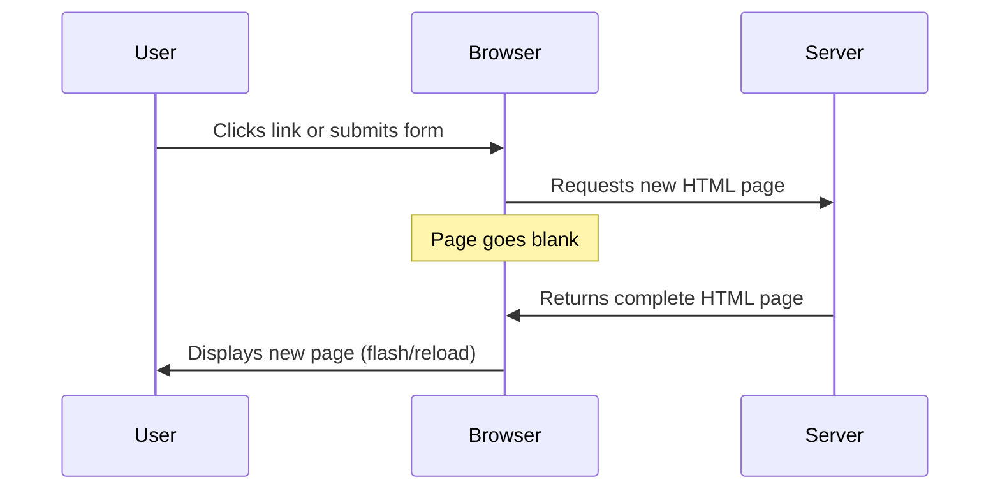
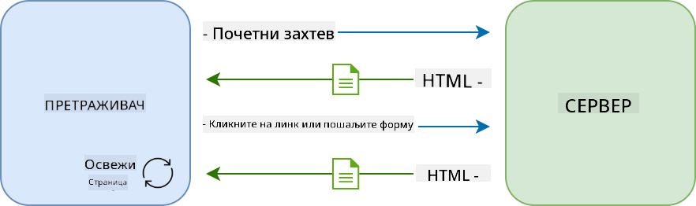
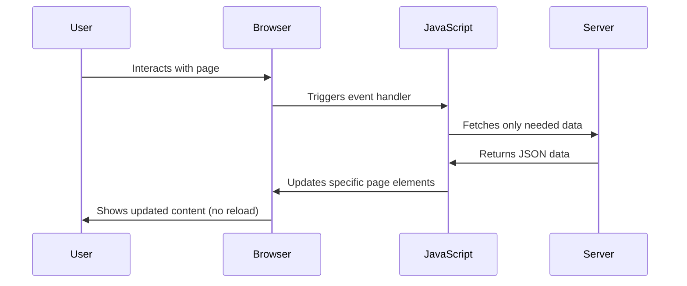
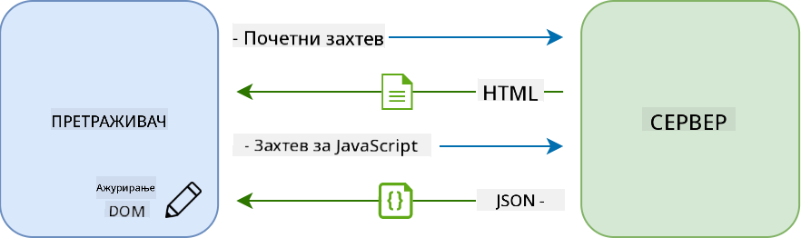
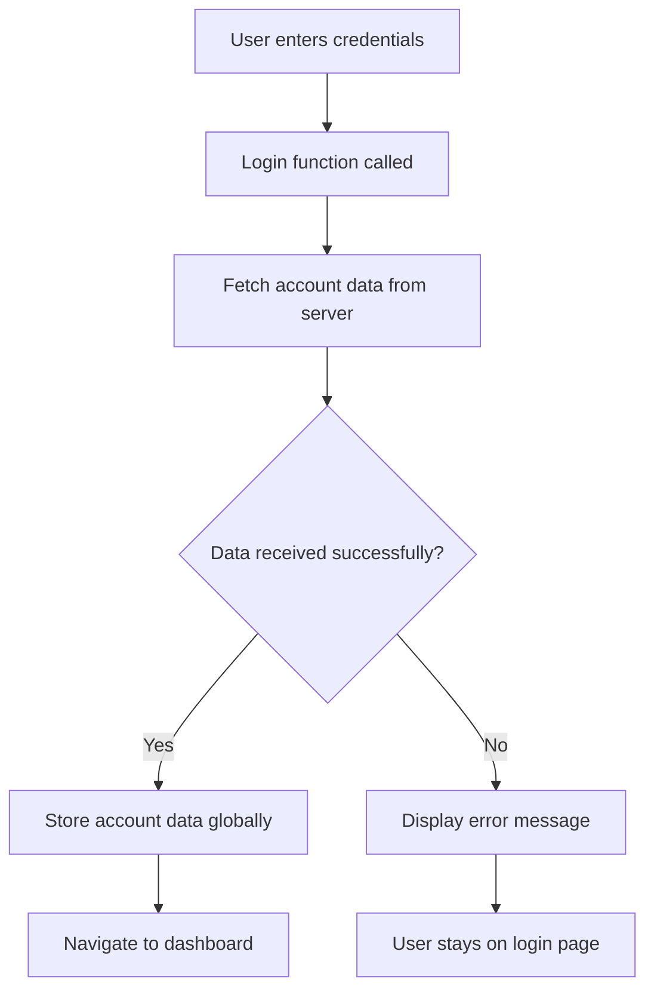
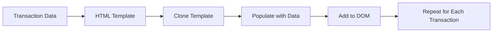
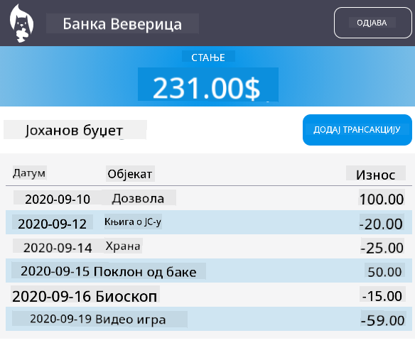

<!--
CO_OP_TRANSLATOR_METADATA:
{
  "original_hash": "2c1164912414820c8efd699b43f64954",
  "translation_date": "2025-10-24T23:30:06+00:00",
  "source_file": "7-bank-project/3-data/README.md",
  "language_code": "sr"
}
-->
# Изградња апликације за банкарство, део 3: Методе за преузимање и коришћење података

Замислите рачунар на Ентерпрајзу из Стар Трека - када капетан Пикард затражи статус брода, информације се појављују тренутно, без гашења целог интерфејса и његовог поновног учитавања. Управо тај беспрекорни ток информација је оно што овде градимо са динамичким преузимањем података.

Тренутно, ваша апликација за банкарство је као штампане новине - информативна, али статична. Претворићемо је у нешто налик контролном центру НАСА-е, где подаци континуирано теку и ажурирају се у реалном времену, без прекидања корисничког рада.

Научићете како да комуницирате са серверима асинхроно, како да обрађујете податке који стижу у различито време и како да трансформишете сирове информације у нешто значајно за ваше кориснике. Ово је разлика између демонстрације и софтвера спремног за употребу.

## Квиз пре предавања

[Квиз пре предавања](https://ff-quizzes.netlify.app/web/quiz/45)

### Предуслови

Пре него што се упустите у преузимање података, уверите се да имате следеће компоненте спремне:

- **Претходна лекција**: Завршите [Формулар за пријаву и регистрацију](../2-forms/README.md) - наставићемо на основу овога
- **Локални сервер**: Инсталирајте [Node.js](https://nodejs.org) и [покрените сервер API](../api/README.md) за пружање података о рачуну
- **API конекција**: Тестирајте вашу серверску конекцију овом командом:

```bash
curl http://localhost:5000/api
# Expected response: "Bank API v1.0.0"
```

Овај брзи тест осигурава да сви делови комуницирају исправно:
- Потврђује да Node.js исправно ради на вашем систему
- Проверава да ли је ваш API сервер активан и одговара
- Верификује да ваша апликација може да се повеже са сервером (као провера радио контакта пре мисије)

---

## Разумевање преузимања података у модерним веб апликацијама

Начин на који веб апликације обрађују податке драматично се развио током последње две деценије. Разумевање ове еволуције помоћи ће вам да цените зашто су модерне технике као што су AJAX и Fetch API толико моћне и зашто су постале суштински алати за веб програмере.

Хајде да истражимо како су традиционални веб-сајтови функционисали у поређењу са динамичним, одзивним апликацијама које данас градимо.

### Традиционалне апликације са више страница (MPA)

У раним данима веба, сваки клик је био као мењање канала на старом телевизору - екран би се угасио, а затим полако пребацио на нови садржај. То је била реалност раних веб апликација, где је свака интеракција значила потпуно поновно учитавање целе странице.





**Зашто је овај приступ био незграпан:**
- Сваки клик је значио поновно учитавање целе странице
- Корисници су били прекидани у размишљању због тих досадних трептаја странице
- Ваша интернет конекција је радила прековремено, преузимајући исти заглавље и подножје изнова и изнова
- Апликације су више личиле на прелиставање фиоке него на коришћење софтвера

### Модерне апликације са једном страницом (SPA)

AJAX (Асинхрони ЈаваСкрипт и XML) је потпуно променио овај парадигму. Као модуларни дизајн Међународне свемирске станице, где астронаути могу заменити појединачне компоненте без поновног изградње целе структуре, AJAX нам омогућава да ажурирамо одређене делове веб странице без поновног учитавања свега. Иако име помиње XML, данас углавном користимо JSON, али основни принцип остаје исти: ажурирајте само оно што треба да се промени.





**Зашто SPA апликације делују боље:**
- Ажурирају се само делови који су се стварно променили (паметно, зар не?)
- Нема више неугодних прекида - ваши корисници остају у свом току
- Мање података путује мрежом, што значи брже учитавање
- Све делује брзо и одзивно, као апликације на вашем телефону

### Еволуција ка модерном Fetch API

Модерни претраживачи пружају [`Fetch` API](https://developer.mozilla.org/docs/Web/API/Fetch_API), који замењује старији [`XMLHttpRequest`](https://developer.mozilla.org/docs/Web/API/XMLHttpRequest/Using_XMLHttpRequest). Као разлика између управљања телеграфом и коришћења е-поште, Fetch API користи промисе за чистији асинхрони код и природно обрађује JSON.

| Карактеристика | XMLHttpRequest | Fetch API |
|----------------|----------------|-----------|
| **Синтакса** | Комплексна, заснована на повратним позивима | Чиста, заснована на промисама |
| **Обрада JSON-а** | Потребно ручно парсирање | Уграђена метода `.json()` |
| **Обрада грешака** | Ограничене информације о грешкама | Детаљне информације о грешкама |
| **Модерна подршка** | Компатибилност са старим верзијама | ES6+ промисе и async/await |

> 💡 **Компатибилност претраживача**: Добра вест - Fetch API ради у свим модерним претраживачима! Ако сте радознали о специфичним верзијама, [caniuse.com](https://caniuse.com/fetch) има комплетну причу о компатибилности.
> 
**Суштина:**
- Одлично ради у Chrome, Firefox, Safari и Edge (у основи свуда где су ваши корисници)
- Само Internet Explorer захтева додатну помоћ (и искрено, време је да се опростимо од IE)
- Савршено вас припрема за елегантне async/await шаблоне које ћемо касније користити

### Имплементација пријаве корисника и преузимања података

Сада ћемо имплементирати систем пријаве који трансформише вашу апликацију за банкарство из статичног приказа у функционалну апликацију. Као протоколи за аутентификацију који се користе у сигурним војним објектима, проверићемо корисничке акредитиве и затим омогућити приступ њиховим специфичним подацима.

Градићемо ово постепено, почевши од основне аутентификације, а затим додајући могућности преузимања података.

#### Корак 1: Креирање основе функције за пријаву

Отворите ваш `app.js` фајл и додајте нову функцију `login`. Ова функција ће обрађивати процес аутентификације корисника:

```javascript
async function login() {
  const loginForm = document.getElementById('loginForm');
  const user = loginForm.user.value;
}
```

**Разложимо ово:**
- Та кључна реч `async`? Она говори ЈаваСкрипту "хеј, ова функција можда треба да сачека неке ствари"
- Проналазимо наш формулар на страници (ништа посебно, само га проналазимо по његовом ID-у)
- Затим извлачимо оно што је корисник укуцао као своје корисничко име
- Ево једног лепог трика: можете приступити било којем уносу формулара преко његовог `name` атрибута - нема потребе за додатним позивима getElementById!

> 💡 **Шаблон за приступ формулару**: Сваком контролном елементу формулара може се приступити преко његовог имена (постављеног у HTML-у помоћу атрибута `name`) као својству елемента формулара. Ово пружа чист и читљив начин за добијање података из формулара.

#### Корак 2: Креирање функције за преузимање података о рачуну

Затим ћемо креирати посебну функцију за преузимање података о рачуну са сервера. Ово следи исти шаблон као ваша функција за регистрацију, али се фокусира на преузимање података:

```javascript
async function getAccount(user) {
  try {
    const response = await fetch('//localhost:5000/api/accounts/' + encodeURIComponent(user));
    return await response.json();
  } catch (error) {
    return { error: error.message || 'Unknown error' };
  }
}
```

**Шта овај код постиже:**
- **Користи** модерни `fetch` API за асинхроно захтевање података
- **Конструише** URL GET захтева са параметром корисничког имена
- **Примењује** `encodeURIComponent()` за сигурно руковање специјалним карактерима у URL-овима
- **Претвара** одговор у JSON формат за лаку манипулацију подацима
- **Обрађује** грешке на елегантан начин, враћајући објекат грешке уместо да се апликација сруши

> ⚠️ **Напомена о безбедности**: Функција `encodeURIComponent()` обрађује специјалне карактере у URL-овима. Као системи кодирања који се користе у поморским комуникацијама, она осигурава да ваша порука стигне тачно онако како је намењена, спречавајући да се карактери попут "#" или "&" погрешно интерпретирају.
> 
**Зашто је ово важно:**
- Спречава да специјални карактери прекину URL-ове
- Штити од напада манипулације URL-овима
- Осигурава да ваш сервер добије намењене податке
- Практикује сигурно кодирање

#### Разумевање HTTP GET захтева

Ево нечега што вас може изненадити: када користите `fetch` без додатних опција, он аутоматски креира [`GET`](https://developer.mozilla.org/docs/Web/HTTP/Methods/GET) захтев. Ово је савршено за оно што радимо - питамо сервер "хеј, могу ли да видим податке о рачуну овог корисника?"

Размислите о GET захтевима као о љубазном тражењу позајмљивања књиге из библиотеке - тражите да видите нешто што већ постоји. POST захтеви (које смо користили за регистрацију) су више као подношење нове књиге да се дода у колекцију.

| GET захтев | POST захтев |
|------------|-------------|
| **Сврха** | Преузимање постојећих података | Слање нових података серверу |
| **Параметри** | У URL путањи/низу упита | У телу захтева |
| **Кеширање** | Може бити кеширано од стране претраживача | Обично није кеширано |
| **Безбедност** | Видљиво у URL-у/логовима | Скривено у телу захтева |

#### Корак 3: Спајање свега

Сада долазимо до задовољавајућег дела - повежимо вашу функцију за преузимање података о рачуну са процесом пријаве. Овде се све уклапа:

```javascript
async function login() {
  const loginForm = document.getElementById('loginForm');
  const user = loginForm.user.value;
  const data = await getAccount(user);

  if (data.error) {
    return console.log('loginError', data.error);
  }

  account = data;
  navigate('/dashboard');
}
```

Ова функција следи јасан низ:
- Извлачи корисничко име из уноса формулара
- Захтева податке о рачуну корисника са сервера
- Обрађује све грешке које се јаве током процеса
- Чува податке о рачуну и прелази на контролни панел након успешне пријаве

> 🎯 **Шаблон async/await**: Пошто је `getAccount` асинхрона функција, користимо кључну реч `await` да паузирамо извршење док сервер не одговори. Ово спречава да код настави са неодређеним подацима.

#### Корак 4: Креирање места за ваше податке

Вашој апликацији је потребно место где ће памтити информације о рачуну након што их учита. Размислите о овоме као о краткорочној меморији ваше апликације - месту где се чувају подаци тренутног корисника. Додајте ову линију на врх вашег `app.js` фајла:

```javascript
// This holds the current user's account data
let account = null;
```

**Зашто нам је ово потребно:**
- Чува податке о рачуну доступним са било ког места у вашој апликацији
- Почетак са `null` значи "нико још није пријављен"
- Ажурира се када се неко успешно пријави или региструје
- Делује као један извор истине - нема конфузије око тога ко је пријављен

#### Корак 5: Повезивање вашег формулара

Сада повежимо вашу нову функцију за пријаву са вашим HTML формуларом. Ажурирајте ваш формулар овако:

```html
<form id="loginForm" action="javascript:login()">
  <!-- Your existing form inputs -->
</form>
```

**Шта ова мала промена ради:**
- Спречава формулар да ради своје подразумевано "поново учитај целу страницу" понашање
- Позива вашу прилагођену ЈаваСкрипт функцију уместо тога
- Одржава све глатко и у стилу апликације са једном страницом
- Даје вам потпуну контролу над оним што се дешава када корисници притисну "Пријави се"

#### Корак 6: Унапређење функције за регистрацију

Ради доследности, ажурирајте вашу функцију `register` тако да такође чува податке о рачуну и прелази на контролни панел:

```javascript
// Add these lines at the end of your register function
account = result;
navigate('/dashboard');
```

**Ово унапређење пружа:**
- **Беспрекорну** транзицију од регистрације до контролне табле
- **Доследно** корисничко искуство између процеса пријаве и регистрације
- **Тренутни** приступ подацима о рачуну након успешне регистрације

#### Тестирање ваше имплементације



**Време је да испробате:**
1. Креирајте нови налог да бисте се уверили да све функционише
2. Покушајте да се пријавите са истим акредитивима
3. Погледајте конзолу вашег претраживача (F12) ако нешто изгледа погрешно
4. Уверите се да сте стигли на контролни панел након успешне пријаве

Ако нешто не функционише, не паничите! Већина проблема се лако решава, као што су правописне грешке или заборављање да се покрене API сервер.

#### Брза реч о магији прекограничне комуникације

Можда се питате: "Како моја веб апликација комуницира са овим API сервером када раде на различитим портовима?" Одлично питање! Ово се односи на нешто са чиме се сваки веб програмер пре или касније сусретне.

> 🔒 **Безбедност прекограничне комуникације**: Претраживачи примењују "политику истог порекла" како би спречили неовлашћену комуникацију између различитих домена. Као систем контроле приступа у Пентагону, они проверавају да ли је комуникација овлашћена пре него што дозволе пренос података.
> 
**У нашем подешавању:**
- Ваша веб апликација ради на `localhost:3000` (развојни сервер)
- Ваш API сервер ради на `localhost
Za složeniji sadržaj, kombinujte [`document.createElement()`](https://developer.mozilla.org/docs/Web/API/Document/createElement) sa metodom [`append()`](https://developer.mozilla.org/docs/Web/API/ParentNode/append):

```javascript
// Safe way to create new elements
const transactionItem = document.createElement('div');
transactionItem.className = 'transaction-item';
transactionItem.textContent = `${transaction.date}: ${transaction.description}`;
container.append(transactionItem);
```

**Razumevanje ovog pristupa:**
- **Kreira** nove DOM elemente programatski
- **Omogućava** potpunu kontrolu nad atributima i sadržajem elemenata
- **Dozvoljava** složene, ugnježdene strukture elemenata
- **Čuva** sigurnost razdvajanjem strukture od sadržaja

> ⚠️ **Bezbednosni aspekt**: Iako se [`innerHTML`](https://developer.mozilla.org/docs/Web/API/Element/innerHTML) često pojavljuje u tutorijalima, može izvršavati ugrađene skripte. Kao što bezbednosni protokoli u CERN-u sprečavaju neovlašćeno izvršavanje koda, korišćenje `textContent` i `createElement` pruža sigurnije alternative.
> 
**Rizici korišćenja innerHTML:**
- Izvršava sve `<script>` tagove u korisničkim podacima
- Podložan napadima ubrizgavanja koda
- Stvara potencijalne bezbednosne ranjivosti
- Sigurnije alternative koje koristimo pružaju ekvivalentnu funkcionalnost

### Pravljenje grešaka korisnicima razumljivim

Trenutno se greške pri prijavi pojavljuju samo u konzoli pretraživača, što je nevidljivo korisnicima. Kao razlika između unutrašnje dijagnostike pilota i sistema informisanja putnika, potrebno je da važne informacije komuniciramo kroz odgovarajući kanal.

Implementacija vidljivih poruka o greškama pruža korisnicima trenutne povratne informacije o tome šta je pošlo naopako i kako da nastave dalje.

#### Korak 1: Dodajte mesto za poruke o greškama

Prvo, dodajte mesto za poruke o greškama u vaš HTML. Dodajte ovo odmah pre dugmeta za prijavu kako bi korisnici to prirodno videli:

```html
<!-- This is where error messages will appear -->
<div id="loginError" role="alert"></div>
<button>Login</button>
```

**Šta se ovde dešava:**
- Kreiramo prazan kontejner koji ostaje nevidljiv dok ne bude potreban
- Postavljen je tamo gde korisnici prirodno gledaju nakon klika na "Prijavi se"
- Taj `role="alert"` je lep dodatak za čitače ekrana - govori asistivnoj tehnologiji "hej, ovo je važno!"
- Jedinstveni `id` omogućava jednostavno ciljanje našeg JavaScripta

#### Korak 2: Kreirajte korisnu pomoćnu funkciju

Napravimo malu pomoćnu funkciju koja može ažurirati tekst bilo kog elementa. Ovo je jedna od onih funkcija "napiši jednom, koristi svuda" koje će vam uštedeti vreme:

```javascript
function updateElement(id, text) {
  const element = document.getElementById(id);
  element.textContent = text;
}
```

**Prednosti funkcije:**
- Jednostavan interfejs koji zahteva samo ID elementa i tekstualni sadržaj
- Sigurno pronalazi i ažurira DOM elemente
- Ponovno upotrebljiv obrazac koji smanjuje dupliranje koda
- Održava dosledno ponašanje ažuriranja u aplikaciji

#### Korak 3: Prikazivanje grešaka tamo gde ih korisnici mogu videti

Sada zamenimo tu skrivenu poruku u konzoli nečim što korisnici zaista mogu videti. Ažurirajte vašu funkciju za prijavu:

```javascript
// Instead of just logging to console, show the user what's wrong
if (data.error) {
  return updateElement('loginError', data.error);
}
```

**Ova mala promena pravi veliku razliku:**
- Poruke o greškama se pojavljuju tačno tamo gde korisnici gledaju
- Nema više misterioznih tihih grešaka
- Korisnici dobijaju trenutne, korisne povratne informacije
- Vaša aplikacija počinje da deluje profesionalno i promišljeno

Sada, kada testirate sa nevažećim nalogom, videćete korisnu poruku o grešci direktno na stranici!


#### Korak 4: Biti inkluzivan sa pristupačnošću

Evo nečeg zanimljivog u vezi sa `role="alert"` koji smo ranije dodali - to nije samo dekoracija! Ovaj mali atribut stvara ono što se zove [Live Region](https://developer.mozilla.org/docs/Web/Accessibility/ARIA/ARIA_Live_Regions) koji odmah najavljuje promene čitačima ekrana:

```html
<div id="loginError" role="alert"></div>
```

**Zašto je ovo važno:**
- Korisnici čitača ekrana čuju poruku o grešci čim se pojavi
- Svi dobijaju iste važne informacije, bez obzira na način navigacije
- Jednostavan način da vaša aplikacija funkcioniše za više ljudi
- Pokazuje da vam je stalo do stvaranja inkluzivnih iskustava

Male stvari poput ove razlikuju dobre programere od sjajnih!

#### Korak 5: Primena istog obrasca na registraciju

Radi doslednosti, implementirajte identično rukovanje greškama u vašem obrascu za registraciju:

1. **Dodajte** element za prikaz grešaka u vaš HTML za registraciju:
```html
<div id="registerError" role="alert"></div>
```

2. **Ažurirajte** vašu funkciju za registraciju da koristi isti obrazac za prikaz grešaka:
```javascript
if (data.error) {
  return updateElement('registerError', data.error);
}
```

**Prednosti doslednog rukovanja greškama:**
- **Pruža** uniformno korisničko iskustvo na svim obrascima
- **Smanjuje** kognitivno opterećenje korišćenjem poznatih obrazaca
- **Pojednostavljuje** održavanje sa ponovo upotrebljivim kodom
- **Osigurava** da se standardi pristupačnosti poštuju u celoj aplikaciji

## Kreiranje dinamičke kontrolne table

Sada ćemo transformisati vašu statičku kontrolnu tablu u dinamički interfejs koji prikazuje stvarne podatke o nalogu. Kao razlika između štampanog rasporeda letova i živih tabli sa polascima na aerodromima, prelazimo sa statičnih informacija na prikaze u realnom vremenu.

Koristeći tehnike manipulacije DOM-om koje ste naučili, kreiraćemo kontrolnu tablu koja se automatski ažurira sa trenutnim informacijama o nalogu.

### Upoznavanje sa vašim podacima

Pre nego što počnemo sa izradom, zavirimo u vrstu podataka koje vaš server šalje nazad. Kada se neko uspešno prijavi, evo blaga informacija sa kojima možete raditi:

```json
{
  "user": "test",
  "currency": "$",
  "description": "Test account",
  "balance": 75,
  "transactions": [
    { "id": "1", "date": "2020-10-01", "object": "Pocket money", "amount": 50 },
    { "id": "2", "date": "2020-10-03", "object": "Book", "amount": -10 },
    { "id": "3", "date": "2020-10-04", "object": "Sandwich", "amount": -5 }
  ]
}
```

**Ova struktura podataka pruža:**
- **`user`**: Savršeno za personalizaciju iskustva ("Dobrodošli nazad, Sara!")
- **`currency`**: Osigurava da pravilno prikazujemo iznose novca
- **`description`**: Prijateljski naziv za nalog
- **`balance`**: Veoma važan trenutni saldo
- **`transactions`**: Kompletna istorija transakcija sa svim detaljima

Sve što vam je potrebno za izradu profesionalne kontrolne table za bankarstvo!

> 💡 **Profesionalni savet**: Želite li odmah videti vašu kontrolnu tablu u akciji? Koristite korisničko ime `test` kada se prijavljujete - dolazi unapred učitano sa uzorcima podataka kako biste mogli videti kako sve funkcioniše bez potrebe da prvo kreirate transakcije.
> 
**Zašto je test nalog koristan:**
- Dolazi sa realističnim uzorcima podataka koji su već učitani
- Savršen za pregled kako se transakcije prikazuju
- Odličan za testiranje funkcija vaše kontrolne table
- Štedi vas od ručnog kreiranja lažnih podataka

### Kreiranje elemenata za prikaz na kontrolnoj tabli

Izgradimo interfejs vaše kontrolne table korak po korak, počevši od informacija o sažetku naloga, a zatim prelazeći na složenije funkcije poput lista transakcija.

#### Korak 1: Ažurirajte strukturu vašeg HTML-a

Prvo, zamenite statički odeljak "Saldo" dinamičkim elementima rezervisanim za popunjavanje od strane vašeg JavaScripta:

```html
<section>
  Balance: <span id="balance"></span><span id="currency"></span>
</section>
```

Zatim dodajte odeljak za opis naloga. Pošto ovo funkcioniše kao naslov za sadržaj kontrolne table, koristite semantički HTML:

```html
<h2 id="description"></h2>
```

**Razumevanje HTML strukture:**
- **Koristi** odvojene `<span>` elemente za saldo i valutu radi pojedinačne kontrole
- **Primjenjuje** jedinstvene ID-ove na svaki element radi ciljanja JavaScripta
- **Prati** semantički HTML koristeći `<h2>` za opis naloga
- **Stvara** logičnu hijerarhiju za čitače ekrana i SEO

> ✅ **Uvid u pristupačnost**: Opis naloga funkcioniše kao naslov za sadržaj kontrolne table, pa je označen semantički kao zaglavlje. Saznajte više o tome kako [struktura zaglavlja](https://www.nomensa.com/blog/2017/how-structure-headings-web-accessibility) utiče na pristupačnost. Možete li identifikovati druge elemente na vašoj stranici koji bi mogli imati koristi od oznaka zaglavlja?

#### Korak 2: Kreirajte funkciju za ažuriranje kontrolne table

Sada kreirajte funkciju koja popunjava vašu kontrolnu tablu stvarnim podacima o nalogu:

```javascript
function updateDashboard() {
  if (!account) {
    return navigate('/login');
  }

  updateElement('description', account.description);
  updateElement('balance', account.balance.toFixed(2));
  updateElement('currency', account.currency);
}
```

**Korak po korak, evo šta ova funkcija radi:**
- **Proverava** da li podaci o nalogu postoje pre nego što nastavi
- **Preusmerava** neautentifikovane korisnike nazad na stranicu za prijavu
- **Ažurira** opis naloga koristeći ponovo upotrebljivu funkciju `updateElement`
- **Formatira** saldo tako da uvek prikazuje dve decimale
- **Prikazuje** odgovarajući simbol valute

> 💰 **Formatiranje novca**: Taj metod [`toFixed(2)`](https://developer.mozilla.org/docs/Web/JavaScript/Reference/Global_Objects/Number/toFixed) je spas! Osigurava da vaš saldo uvek izgleda kao pravi novac - "75.00" umesto samo "75". Vaši korisnici će ceniti što vide poznato formatiranje valute.

#### Korak 3: Osigurajte da se vaša kontrolna tabla ažurira

Da biste osigurali da se vaša kontrolna tabla osvežava sa trenutnim podacima svaki put kada je neko poseti, potrebno je da se povežete sa vašim navigacionim sistemom. Ako ste završili [zadatak iz lekcije 1](../1-template-route/assignment.md), ovo bi trebalo da vam bude poznato. Ako ne, ne brinite - evo šta vam je potrebno:

Dodajte ovo na kraj vaše funkcije `updateRoute()`:

```javascript
if (typeof route.init === 'function') {
  route.init();
}
```

Zatim ažurirajte vaše rute da uključuju inicijalizaciju kontrolne table:

```javascript
const routes = {
  '/login': { templateId: 'login' },
  '/dashboard': { templateId: 'dashboard', init: updateDashboard }
};
```

**Šta ovaj pametan pristup radi:**
- Proverava da li ruta ima specijalni kod za inicijalizaciju
- Automatski pokreće taj kod kada se ruta učita
- Osigurava da vaša kontrolna tabla uvek prikazuje sveže, trenutne podatke
- Održava logiku rutiranja čistom i organizovanom

#### Testiranje vaše kontrolne table

Nakon implementacije ovih promena, testirajte vašu kontrolnu tablu:

1. **Prijavite se** sa test nalogom
2. **Proverite** da ste preusmereni na kontrolnu tablu
3. **Proverite** da se opis naloga, saldo i valuta pravilno prikazuju
4. **Pokušajte da se odjavite i ponovo prijavite** kako biste osigurali da se podaci pravilno osvežavaju

Vaša kontrolna tabla sada treba da prikazuje dinamične informacije o nalogu koje se ažuriraju na osnovu podataka prijavljenog korisnika!

## Kreiranje pametnih lista transakcija pomoću šablona

Umesto ručnog kreiranja HTML-a za svaku transakciju, koristićemo šablone za automatsko generisanje doslednog formatiranja. Kao standardizovane komponente koje se koriste u proizvodnji svemirskih letelica, šabloni osiguravaju da svaki red transakcije prati istu strukturu i izgled.

Ova tehnika efikasno se skalira od nekoliko transakcija do hiljada, održavajući dosledne performanse i prezentaciju.



### Korak 1: Kreirajte šablon za transakcije

Prvo, dodajte ponovo upotrebljiv šablon za redove transakcija u vaš HTML `<body>`:

```html
<template id="transaction">
  <tr>
    <td></td>
    <td></td>
    <td></td>
  </tr>
</template>
```

**Razumevanje HTML šablona:**
- **Definiše** strukturu za jedan red tabele
- **Ostaje** nevidljiv dok se ne klonira i popuni pomoću JavaScripta
- **Sadrži** tri ćelije za datum, opis i iznos
- **Pruža** ponovo upotrebljiv obrazac za dosledno formatiranje

### Korak 2: Pripremite vašu tabelu za dinamički sadržaj

Zatim dodajte `id` telu vaše tabele kako bi JavaScript mogao lako da ga cilja:

```html
<tbody id="transactions"></tbody>
```

**Šta ovo postiže:**
- **Stvara** jasan cilj za umetanje redova transakcija
- **Razdvaja** strukturu tabele od dinamičkog sadržaja
- **Omogućava** lako čišćenje i ponovno popunjavanje podataka o transakcijama

### Korak 3: Napravite funkciju za kreiranje redova transakcija

Sada kreirajte funkciju koja transformiše podatke o transakcijama u HTML elemente:

```javascript
function createTransactionRow(transaction) {
  const template = document.getElementById('transaction');
  const transactionRow = template.content.cloneNode(true);
  const tr = transactionRow.querySelector('tr');
  tr.children[0].textContent = transaction.date;
  tr.children[1].textContent = transaction.object;
  tr.children[2].textContent = transaction.amount.toFixed(2);
  return transactionRow;
}
```

**Razlaganje ove funkcije:**
- **Preuzima** element šablona po njegovom ID-u
- **Kloni** sadržaj šablona za sigurno manipulisanje
- **Odabire** red tabele unutar kloniranog sadržaja
- **Popunjava** svaku ćeliju podacima o transakcijama
- **Formatira** iznos tako da prikazuje odgovarajuće decimale
- **Vraća** kompletan red spreman za umetanje

### Korak 4: Efikasno generisanje više redova transakcija

Dodajte ovaj kod u vašu funkciju `updateDashboard()` kako biste prikazali sve transakcije:

```javascript
const transactionsRows = document.createDocumentFragment();
for (const transaction of account.transactions) {
  const transactionRow = createTransactionRow(transaction);
  transactionsRows.appendChild(transactionRow);
}
updateElement('transactions', transactionsRows);
```

**Razumevanje ovog efikasnog pristupa:**
- **Kreira** fragment dokumenta za grupne operacije na DOM-u
- **Iterira** kroz sve transakcije u podacima o nalogu
- **Generiše** red za svaku transakciju koristeći funkciju za kreiranje redova
- **Sakuplja** sve redove u fragment pre dodavanja u DOM
- **Izvršava** jedno ažuriranje DOM-a umesto više pojedinačnih umetanja

> ⚡ **Optimizacija performansi**: [`document.createDocumentFragment()`](https://developer.mozilla.org/docs/Web/API/Document/createDocumentFragment) funkcioniše kao proces montaže u Boingu - komponente se pripremaju van glavne linije, a zatim se instaliraju kao kompletna jedinica. Ovaj pristup grupisanja minimizira ponovne tokove DOM-a izvršavanjem jednog umetanja umesto više pojedinačnih operacija.

### Korak 5: Poboljšajte funkciju za ažuriranje za mešoviti sadržaj

Vaša funkcija `updateElement()` trenutno obrađuje samo tekstualni sadržaj. Ažurirajte je da radi i sa tekstom i sa DOM čvorovima:

```javascript
function updateElement(id, textOrNode) {
  const element = document.getElementById(id);
  element.textContent = ''; // Removes all children
  element.append(textOrNode);
}
```

**Ključna poboljšanja u ovom ažuriranju:**
- **Čisti** postojeći sadržaj pre dodavanja novog
- **Prihvata** ili tekstualne stringove ili DOM čvorove kao parametre
- **Koristi** metodu [`append()`](https://developer.mozilla.org/docs/Web/API/ParentNode/append) za fleksibilnost
- **Održava** kompatibilnost unazad sa postojećom upotrebom zasnovanom na tekstu

### Testiranje vaše kontrolne table

Vreme je za trenutak istine! Pogledajmo vašu dinamičku kontrolnu tablu u akciji:

1. Prijavite se koristeći nalog `test` (ima uzorke podataka spremne za upotrebu)
2. Navigirajte do vaše kontrolne table
3. Proverite da se redovi transakcija pojavljuju sa pravilnim formatiranjem
4. Uverite se da datumi, opisi i iznosi izgledaju dobro

Ako sve funkcioniše, trebalo bi da vidite potpuno funkcionalnu listu transakcija na vašoj kontrolnoj tabli! 🎉

**Šta ste postigli:**
- Izgradili ste kontrolnu tablu koja se skalira sa bilo kojom količinom podataka
- Kreirali ste ponovo upotrebljive šablone za dosledno formatiranje
- Implementirali ste efikasne tehnike manipulacije DOM-om
- Razvili ste funkcionalnost uporedivu sa aplikacijama za bankarstvo u produkciji

Uspešno ste transformisali statičnu veb stranicu u dinamičku veb aplikaciju.

---

## Izazov za
**Подстицај:** Направите функционалност претраге за апликацију за банкарство која укључује: 1) Формулар за претрагу са пољима за унос опсега датума (од/до), минималног/максималног износа и кључних речи за опис трансакције, 2) Функцију `filterTransactions()` која филтрира низ account.transactions на основу критеријума претраге, 3) Ажурирајте функцију `updateDashboard()` да приказује филтриране резултате, и 4) Додајте дугме "Очисти филтере" за ресетовање приказа. Користите савремене JavaScript методе за низове као што је `filter()` и обрадите граничне случајеве за празне критеријуме претраге.

Сазнајте више о [режиму агента](https://code.visualstudio.com/blogs/2025/02/24/introducing-copilot-agent-mode) овде.

## 🚀 Изазов

Спремни да подигнете вашу апликацију за банкарство на виши ниво? Хајде да је учинимо привлачном и функционалном. Ево неких идеја које могу да вас инспиришу:

**Учини је лепом**: Додајте CSS стилове да трансформишете ваш функционални контролни панел у нешто визуелно привлачно. Размислите о чистим линијама, добром размаку и можда чак и суптилним анимацијама.

**Учини је прилагодљивом**: Покушајте да користите [медијске упите](https://developer.mozilla.org/docs/Web/CSS/Media_Queries) за креирање [прилагодљивог дизајна](https://developer.mozilla.org/docs/Web/Progressive_web_apps/Responsive/responsive_design_building_blocks) који одлично функционише на телефонима, таблетима и десктоп рачунарима. Ваши корисници ће вам бити захвални!

**Додајте мало шарма**: Размислите о бојама за трансакције (зелена за приходе, црвена за трошкове), додавању икона или креирању ефеката приликом преласка мишем који чине интерфејс интерактивним.

Ево како би изгледао један углађен контролни панел:



Не морате да га копирате тачно - користите га као инспирацију и направите нешто своје!

## Квиз након предавања

[Квиз након предавања](https://ff-quizzes.netlify.app/web/quiz/46)

## Задатак

[Рефакторишите и коментаришите ваш код](assignment.md)

---

**Одрицање од одговорности**:  
Овај документ је преведен коришћењем услуге за превођење помоћу вештачке интелигенције [Co-op Translator](https://github.com/Azure/co-op-translator). Иако настојимо да обезбедимо тачност, молимо вас да имате у виду да аутоматски преводи могу садржати грешке или нетачности. Оригинални документ на његовом изворном језику треба сматрати ауторитативним извором. За критичне информације препоручује се професионални превод од стране људи. Не преузимамо одговорност за било каква погрешна тумачења или неспоразуме који могу настати услед коришћења овог превода.