# Креирање Банкарске Апликације Део 3: Методе Преузимања и Коришћења Података

Замислите рачунар на Enterprise у Стар Треку - када капетан Пикард пита за статус брода, информације се појављују одмах без потпуног гашења и поновног састављања интерфејса. Тај беспрекорни ток информација је управо оно што овде градимо са динамичним преузимањем података.

Тренутно је ваша банкарска апликација као штампане новине - информативна али статична. Претворићемо је у нешто више као контролни центар НАСА-е, где подаци непрекидно тече и ажурирају се у реалном времену без прекида у раду корисника.

Научићете како да комуницирате са серверима асинхроно, да руковање подацима који стижу у различито време, и да трансформишете сирове информације у нешто значајно за ваше кориснике. Ово је разлика између демо и софтвера спремног за продукцију.

## ⚡ Шта Можете Урадити У Следећих 5 Минута

**Брзи Почетни Водич за Задузете Програмере**

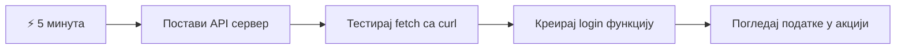
- **Минута 1-2**: Покрените свој API сервер (`cd api && npm start`) и тестирајте конекцију
- **Минута 3**: Направите основну `getAccount()` функцију коришћењем fetch
- **Минута 4**: Повежите форму за пријаву са `action="javascript:login()"`
- **Минута 5**: Тестирајте пријаву и пратите појаву података о рачуну у конзоли

**Команде за Брзо Тестирање**:
```bash
# Провери да ли API ради
curl http://localhost:5000/api

# Тест преузимања података налога
curl http://localhost:5000/api/accounts/test
```

**Зашто је ово важно**: За 5 минута видећете магију асинхроног преузимања података која покреће сваку модерну веб апликацију. Ово је основа која апликације чини одзивним и живим.

## 🗺️ Ваш Пут Ученика Кроз Веб Апликације Водене Подацима

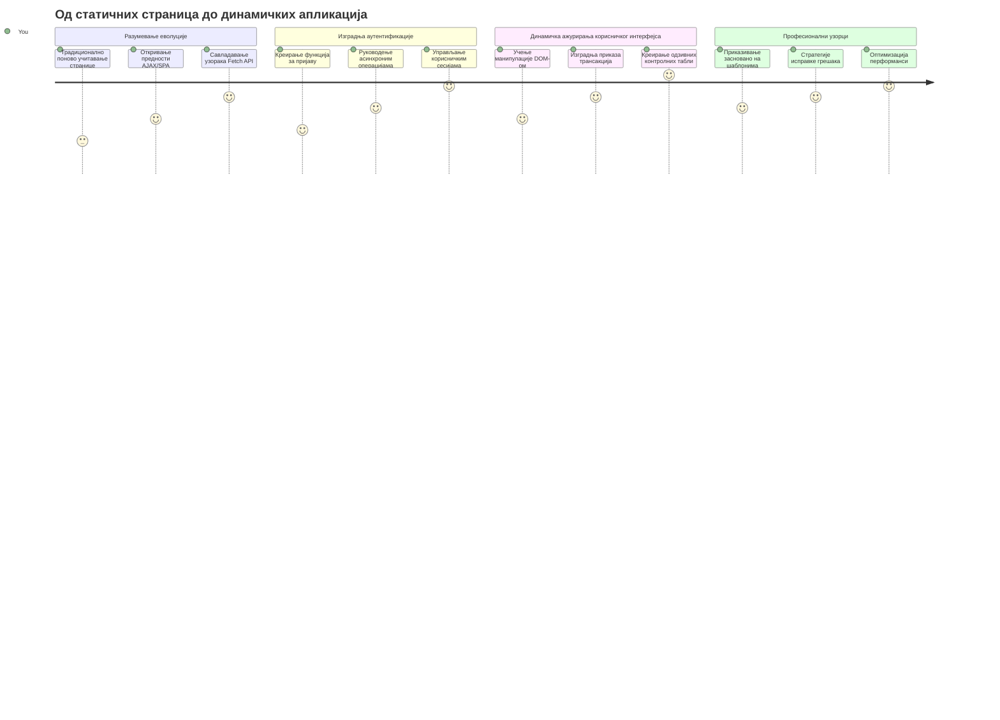
**Циљ Вашег Пута**: До краја овог часа разумећете како модерне веб апликације преузимају, обрађују и приказују податке динамично, стварајући беспрекорно корисничко искуство какво очекујемо од професионалних апликација.

## Пред-Квиз

[Pre-lecture quiz](https://ff-quizzes.netlify.app/web/quiz/45)

### Претходни Захтеви

Пре него што зароните у преузимање података, уверите се да имате ове компоненте спремне:

- **Претходна лекција**: Завршите [Форму за пријаву и регистрацију](../2-forms/README.md) - на овоме ћемо градити
- **Локални Сервер**: Инсталирајте [Node.js](https://nodejs.org) и [покрените API сервер](../api/README.md) који обезбеђује податке о рачуну
- **API Веза**: Тестирајте везу са сервером овом командом:

```bash
curl http://localhost:5000/api
# Очекивани одговор: "Bank API v1.0.0"
```

Овај брзи тест осигурава да све компоненте исправно комуницирају:
- Проверава да ли је Node.js покренут правилно на вашем систему
- Потврђује да је ваш API сервер активан и одговара
- Валидава да ваша апликација може да достигне сервер (као проверу радио везе пре мисије)

## 🧠 Преглед Екосистема Управљања Подацима

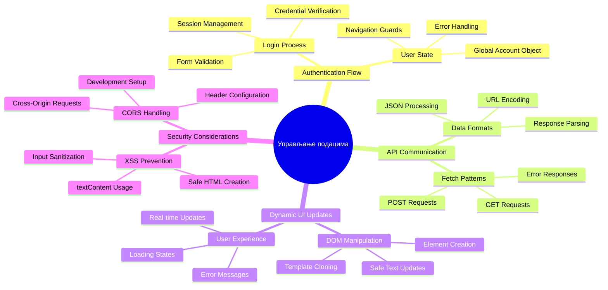
**Основно Начело**: Модерне веб апликације су системи оркестрације података – координишу између корисничких интерфејса, серверских API-ја и безбедносних модела прегледача како би створиле беспрекорно, одзивно искуство.

---

## Разумевање Преузимања Података у Модерним Веб Апликацијама

Начин на који веб апликације рукују подацима драстично се променио у последње две деценије. Разумевање ове еволуције ће вам помоћи да схватите зашто су модерне технике попут AJAX-а и Fetch API-ја тако моћне и зашто су постале неопходни алати веб програмера.

Истражимо како су традиционалне веб странице радиле у односу на динамичне, одзивне апликације које данас правимо.

### Традиционалне Мултистраничне Апликације (MPA)

У раним данима веба сваки клик је био као мењање канала на старом телевизору – екран би се искључио, па полако подешавао на нови садржај. То је била реалност раних веб апликација, где је свака интеракција значила потпуно обновљавање целе странице од почетка.

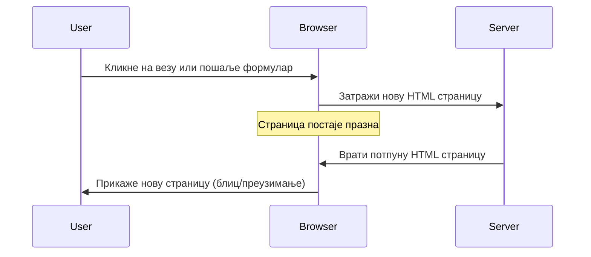
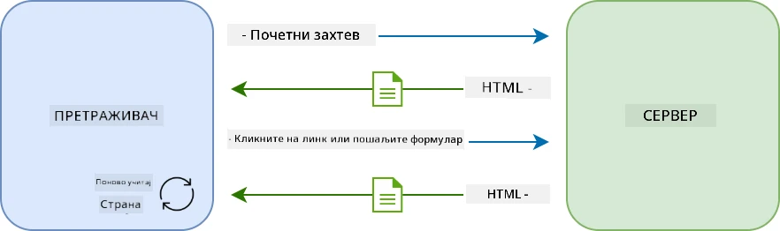

**Зашто је овај приступ деловао нефлексибилно:**
- Сваки клик је значио обнову целе странице од нуле
- Корисници су били прекидани у мислима оним досадним трептањем страница
- Ваша интернет конекција је радила прековремено преузимајући исти заглавље и подножје изнова и изнова
- Апликације су деловале више као кликање кроз фиоку са документацијом него као софтвер

### Модерне Једностраничне Апликације (SPA)

AJAX (Асинхрони ЏаваСкрипт и XML) је у потпуности променио ову парадигму. Као модуларни дизајн Међународне свемирске станице, где астронаути могу заменити појединачне компоненте без обнављања целе структуре, AJAX нам омогућава да ажурирамо специфичне делове веб странице без поновног учитавања свега. Упркос имену које помиње XML, данас углавном користимо JSON, али основно начело остаје: ажурирати само оно што треба да се промени.

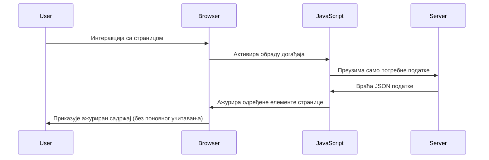
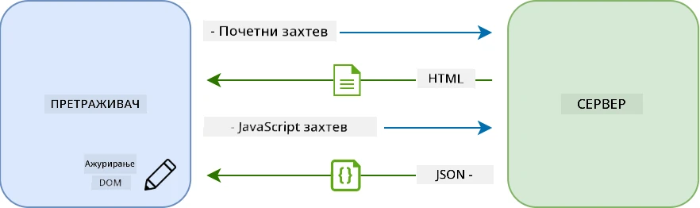

**Зашто SPA апликације делују много боље:**
- Само делови који су се стварно променили се ажурирају (паметно, зар не?)
- Нема више изненадних прекида – ваши корисници остају у свом току
- Мање података преноси се преко мреже што значи брже учитавање
- Све делује брзо и реактивно, као апликације на вашем телефону

### Еволуција ка Модерном Fetch API

Модерни прегледачи нуде [`Fetch` API](https://developer.mozilla.org/docs/Web/API/Fetch_API), који замењује старији [`XMLHttpRequest`](https://developer.mozilla.org/docs/Web/API/XMLHttpRequest/Using_XMLHttpRequest). Као разлика између коришћења телеграфа и електронске поште, Fetch API користи промисе за чистији асинхрони код и природно рукује JSON-ом.

| Особина | XMLHttpRequest | Fetch API |
|---------|----------------|----------|
| **Синтакса** | Компликован callback базиран | Чист, заснован на промисима |
| **Руковање JSON-ом** | Потребно ручно парсирање | Уграђена `.json()` метода |
| **Руковање грешкама** | Ограничене информације о грешци | Комплетни детаљи о грешкама |
| **Подршка у претраживачима** | Компатибилност са наслеђем | ES6+ промиси и async/await |

> 💡 **Компатибилност**: Добре вести – Fetch API ради у свим модерним прегледачима! Ако вас занимају специфичне верзије, [caniuse.com](https://caniuse.com/fetch) има комплетну причу о компатибилности.
> 
**Укратко:**
- Ради одлично у Chrome, Firefox, Safari и Edge (готово свуда где су ваши корисници)
- Само Internet Explorer захтева додатну помоћ (искрено, време је да се IE опрости)
- Савршено припрема код за елегантне async/await обрасце које ћемо касније користити

### Имплементација Пријаве Корисника и Преузимања Података

Хајде сада да имплементирамо систем пријаве који претвара вашу банкарску апликацију са статичног приказа у функционалну апликацију. Као и протоколи аутентификације у безбедним војним објектима, проверићемо корисничке акредитиве и потом пружити приступ њиховим подацима.

Градићемо то постепено, почевши од основне аутентификације, а затим додајући могућности преузимања података.

#### Корак 1: Креирајте Основу Функције Пријаве

Отворите свој `app.js` фајл и додајте нову функцију `login`. Она ће руковати процесом аутентификације корисника:

```javascript
async function login() {
  const loginForm = document.getElementById('loginForm');
  const user = loginForm.user.value;
}
```

**Размотримо ово:**
- Та `async` кључна реч? Кажемо JavaScript-у "хеј, ова функција ће можда морати да чека"
- Узимамо нашу форму са странице (ништа посебно, само је налазимо по ID-у)
- Затим извлачимо корисничко име које је унето
- Ево трика: можете приступити било ком пољу форме по његовом `name` атрибуту - није потребно више позива getElementById!

> 💡 **Образац приступа форми**: Сваки контролни елемент форме може се приступити по његовом имену (постављеном у HTML-у преко `name` атрибута) као својству елемента форме. Ово обезбеђује чист, читљив начин за приступ подацима из форме.

#### Корак 2: Креирајте Функцију за Преузимање Података о Рачуну

Следеће, направићемо посебну функцију за преузимање података о рачуну са сервера. Ово прати исти образац као ваша функција за регистрацију али је усмерена на преузимање података:

```javascript
async function getAccount(user) {
  try {
    const response = await fetch('//localhost:5000/api/accounts/' + encodeURIComponent(user));
    return await response.json();
  } catch (error) {
    return { error: error.message || 'Unknown error' };
  }
}
```

**Овај код ради:**
- **Користи** савремени `fetch` API за асинхроне захтеве
- **Гради** GET URL упит са параметром корисничког имена
- **Примeњује** `encodeURIComponent()` за безбедно руковање специјалним знаковима у URL-у
- **Претвара** одговор у JSON формат ради лакше манипулације подацима
- **Решава** грешке прикладно враћајући објекат са грешком уместо пада апликације

> ⚠️ **Безбедносна напомена**: Функција `encodeURIComponent()` се користи за обраду специјалних карактера у URL-у. Као шифровање у морнаричкој комуникацији, она осигурава да ваша порука стигне тачно онаква каква треба да буде, спречавајући да се знакови попут "#" или "&" погрешно тумаче.
> 
**Зашто је ово важно:**
- Спремни су за спречавање кварења URL-ова услед специјалних карактера
- Штити од напада манипулације URL-ом
- Обезбеђује да сервер добије исправне податке
- Прати добре безбедносне праксе писања кода

#### Разумевање HTTP GET Захтева

Ево нечега што може изненадити: када користите `fetch` без додатних опција, он аутоматски прави [`GET`](https://developer.mozilla.org/docs/Web/HTTP/Methods/GET) захтев. Ово је идеално за оно што радимо – питамо сервер "хеј, могу ли да видим податке овог корисника?"

Замислите GET захтев као љубазно питање да позајмите књигу из библиотеке – тражите да видите нешто што већ постоји. POST захтеви (које смо користили за регистрацију) су више као слање нове књиге да се дода у збирку.

| GET Захтев | POST Захтев |
|------------|-------------|
| **Сврха** | Преузимање већ постојећих података | Слање нових података серверу |
| **Параметри** | У URL путањи/упитном низу | У телу захтева |
| **Кеширање** | Може кеширати прегледач | Обично се не кешира |
| **Безбедност** | Види се у URL-у/логовима | Сакривено у телу захтева |

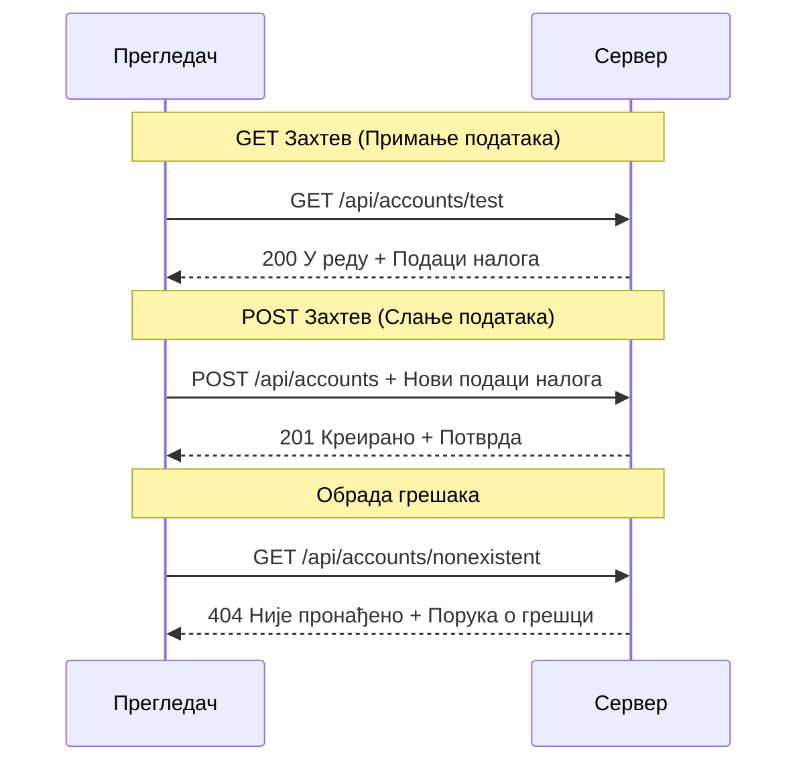
#### Корак 3: Повежите Све Заједно

Сада за задовољавајући део - повежимо вашу функцију за преузимање података са процесом пријаве. Овде све клизи на своје место:

```javascript
async function login() {
  const loginForm = document.getElementById('loginForm');
  const user = loginForm.user.value;
  const data = await getAccount(user);

  if (data.error) {
    return console.log('loginError', data.error);
  }

  account = data;
  navigate('/dashboard');
}
```

Ова функција прати јасан редослед:
- Извлачи корисничко име из форме
- Тражи податке корисниковог рачуна са сервера
- Руководи се грешкама које се могу десити током процеса
- Смешта податке о рачуну и прелази на контролну таблу у случају успеха

> 🎯 **Async/Await Образац**: Пошто је `getAccount` асинхрона функција, користимо `await` да зауставимо извршавање док сервер не одговори. Ово спречава наставак кода са неодређеним подацима.

#### Корак 4: Креирајте Простор За Чување Података

Ваша апликација треба место да упамти информације о рачуну након учитавања. Размишљајте о томе као о краткој меморији апликације - месту где чува тренутне корисничке податке при руци. Додајте овај ред на врх вашег `app.js` фајла:

```javascript
// Ово чува податке налога текућег корисника
let account = null;
```

**Зашто нам ово треба:**
- Олакшава приступ подацима о рачуну са било ког места у апликацији
- Почетна вредност `null` значи "још нико није пријављен"
- Ажурира се када се корисник успешно пријави или региструје
- Поноси се као једини извор истине - нема конфузије ко је пријављен

#### Корак 5: Повежите Ваша Форми

Хајде сада да повежемо вашу сјајну нову функцију пријаве са HTML формом. Ажурирајте ваш `<form>` тег овако:

```html
<form id="loginForm" action="javascript:login()">
  <!-- Your existing form inputs -->
</form>
```

**Шта ова мала измена ради:**
- Спречава да форма ради подразумевано "поново учитавање целе странице"
- Позива вашу прилагођену JavaScript функцију
- Чини све глатким и сличним једностраничним апликацијама
- Даје вам потпуну контролу шта се дешава када корисници кликну „Пријави се“

#### Корак 6: Побољшајте Функцију Регистрације

За доследност, ажурирајте вашу `register` функцију да такође чува податке о рачуну и пређе на контролну таблу:

```javascript
// Додајте ове линије на крају ваше регистрационе функције
account = result;
navigate('/dashboard');
```

**Ово побољшање пружа:**
- **Беспрекорну** транзицију од регистрације до контролне табле
- **Конзистентно** корисничко искуство између пријаве и регистрације
- **Одмах** приступ подацима о рачуну након успешне регистрације

#### Тестирање Ваше Имплементације

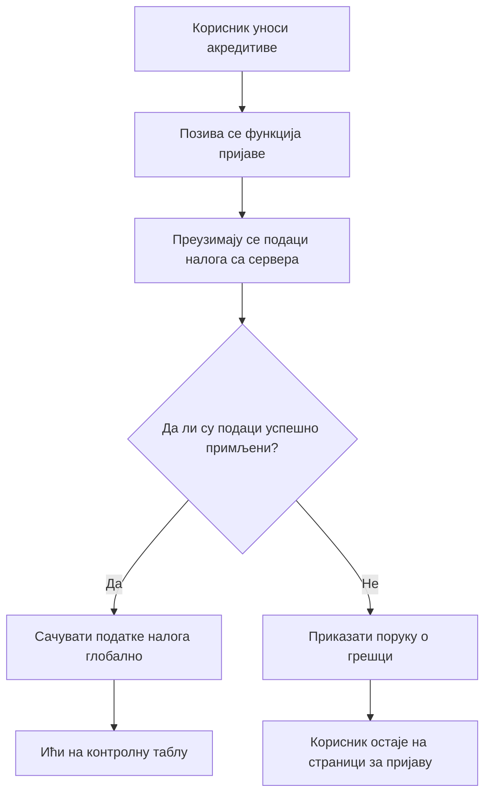
**Време је да пробате:**
1. Направите нови налог да проверите да ли све ради
2. Покушајте да се пријавите тим истим акредитивима
3. Погледајте конзолу прегледача (F12) ако нешто делује чудно
4. Уверите се да стижете на контролну таблу након успешне пријаве

Ако нешто не ради, не паничите! Већина проблема су једноставне поправке као што су типографске грешке или заборав да покренете API сервер.

#### Брза Реч О Крос-Домен Магији

Можда се питате: "Како моја веб апликација комуницира са овим API сервером кад они раде на различитим портовима?" Добро питање! Ово је нешто са чим се сваки веб програмер пре или касније сусреће.

> 🔒 **Безбедност Крос-Домена**: Прегледачи спроводе "политику истог порекла" да спрече неовлашћену комуникацију између различитих домена. Као безбедносна провера у Пентагону, они потврђују да је комуникација овлашћена пре одобрења преноса података.
> 
**У нашем случају:**
- Ваша веб апликација ради на `localhost:3000` (локални дев сервер)
- Ваш API сервер ради на `localhost:5000` (бекенд сервер)
- API сервер укључује [CORS заглавља](https://developer.mozilla.org/docs/Web/HTTP/CORS) која експлицитно овлашћују комуникацију са ваше веб апликације

Ова конфигурација огледа стварни развој где фронтенд и бекенд апликације обично раде на одвојеним серверима.

> 📚 **Сазнајте Више**: Зароните дубље у API-је и преузимање података уз овај обимни [Microsoft Learn модул о API-јима](https://docs.microsoft.com/learn/modules/use-apis-discover-museum-art/?WT.mc_id=academic-77807-sagibbon).

## Оживљавање Ваших Података у HTML-у

Сада ћемо учинити да преузети подаци буду видљиви корисницима помоћу манипулације DOM-ом. Као процес развијања фотографија у мрачној комори, узимамо невидљиве податке и приказујемо их као нешто што корисници могу видети и са чиме могу да комуницирају.
Манипулација ДОМ-ом је техника која претвара статичке веб странице у динамичке апликације које ажурирају свој садржај на основу интеракција корисника и одговора сервера.

### Избор правог алата за посао

Када је у питању ажурирање вашег ХТМЛ-а са ЈаваСкриптом, имате неколико опција. Замислите их као различите алате у кутији са алатима - сваки је савршен за одређене задатке:

| Метод | За шта је сјајан | Када га користити | Ниво безбедности |
|--------|---------------------|----------------|--------------|
| `textContent` | Безбедно приказивање корисничких података | Увек када приказујете текст | ✅ Потпуно поуздан |
| `createElement()` + `append()` | Прављење сложених распореда | Креирање нових секција/листа | ✅ Неупотребљив |
| `innerHTML` | Постављање ХТМЛ садржаја | ⚠️ Покушајте да избегнете овај | ❌ Ризично пословање |

#### Безбедан начин приказивања текста: textContent

Својство [`textContent`](https://developer.mozilla.org/docs/Web/API/Node/textContent) је ваш најбољи пријатељ када приказујете корисничке податке. Као да имате обезбеђење за вашу веб страницу - ништа штетно неће проћи:

```javascript
// Безбедан, поуздан начин за ажурирање текста
const balanceElement = document.getElementById('balance');
balanceElement.textContent = account.balance;
```

**Предности textContent:**
- Све третира као обичан текст (спречава извршавање скрипти)
- Аутоматски брише постојећи садржај
- Ефикасан за једноставна ажурирања текста
- Пружа уграђену заштиту од злонамерног садржаја

#### Креирање динамичких ХТМЛ елемената

За сложенији садржај, комбинујте [`document.createElement()`](https://developer.mozilla.org/docs/Web/API/Document/createElement) са методом [`append()`](https://developer.mozilla.org/docs/Web/API/ParentNode/append):

```javascript
// Безбедан начин за креирање нових елемената
const transactionItem = document.createElement('div');
transactionItem.className = 'transaction-item';
transactionItem.textContent = `${transaction.date}: ${transaction.description}`;
container.append(transactionItem);
```

**Разумевање овог приступа:**
- **Креира** нове ДОМ елементе програмски
- **Одржава** потпуну контролу над атрибутима и садржајем елемената
- **Дозвољава** сложене, угнежђене структуре елемената
- **Чува** безбедност раздвајањем структуре од садржаја

> ⚠️ **Безбедносно разматрање**: Иако [`innerHTML`](https://developer.mozilla.org/docs/Web/API/Element/innerHTML) се често појављује у многим туторијалима, може извршити уграђене скрипте. Као безбедносни протоколи у ЦЕРН-у који спречавају извођење неовлашћеног кода, коришћење `textContent` и `createElement` пружа сигурније алтернативе.
> 
**Ризици од innerHTML:**
- Извршава било које `<script>` тагове у корисничким подацима
- Ранљив на нападе убризгавања кода
- Креира потенцијалне безбедносне рањивости
- Безбедније алтернативе које користимо пружају еквивалентну функционалност

### Учинимо грешке пријатељским корисницима

Тренутно се грешке при пријави појављују само у конзоли прегледача, која је невидљива корисницима. Као разлика између пилотове интерне дијагностике и система информација за путнике, морамо комуницирати важне информације кроз одговарајући канал.

Имплементација видљивих порука о грешкама корисницима пружа тренутну повратну информацију о томе шта је поишло по злу и како наставити.

#### Корак 1: Додајте место за поруке о грешкама

Прво, дајте порукама о грешкама свој дом у вашем ХТМЛ-у. Додајте ово одмах пре дугмета за пријаву како би корисници то природно видели:

```html
<!-- This is where error messages will appear -->
<div id="loginError" role="alert"></div>
<button>Login</button>
```

**Шта се овде дешава:**
- Креирамо празан контејнер који остаје невидљив док није потребан
- Позициониран је тамо где корисници природно гледају након клика на „Пријава“
- Тај `role="alert"` је леп додатак за читаче екрана – говори помоћним технологијама „хеј, ово је важно!“
- Једноставан јединствени `id` омогућава нашем ЈаваСкрипту лаку мету

#### Корак 2: Направите корисну помоћну функцију

Направимо малу помоћну функцију која може ажурирати текст било ког елемента. Ово је једна од оних „пишеш једном, користиш свуда“ функција која ће вам уштедети време:

```javascript
function updateElement(id, text) {
  const element = document.getElementById(id);
  element.textContent = text;
}
```

**Предности функције:**
- Једноставан интерфејс који захтева само ИД елемента и текстуални садржај
- Безбедно налази и ажурира ДОМ елементе
- Поново употребљив образац који смањује дуплирање кода
- Одржава конзистентно понашање ажурирања кроз апликацију

#### Корак 3: Прикажи грешке тамо где их корисници виде

Сада заменимо ту скривену поруку у конзоли са нечем што корисници заиста могу видети. Ажурирајте вашу функцију за пријаву:

```javascript
// Уместо да само прикажете поруке у конзоли, покажите кориснику шта није у реду
if (data.error) {
  return updateElement('loginError', data.error);
}
```

**Ова мала промена прави велику разлику:**
- Поруке о грешкама се појављују управо тамо где корисници гледају
- Нема више мистериозних тихих пада система
- Корисници добијају одмах одговорне и јасне повратне информације
- Ваша апликација почиње да делује професионално и промишљено

Сада када тестирате са неважећим налогом, видећете корисну поруку о грешци директно на страници!


#### Корак 4: Будите инклузивни уз приступачност

Ево нешто кул у вези тог `role="alert"` који смо додали раније - није само декорација! Овај мали атрибут прави оно што се зове [Ливе Регион](https://developer.mozilla.org/docs/Web/Accessibility/ARIA/ARIA_Live_Regions) који одмах најављује промене читачима екрана:

```html
<div id="loginError" role="alert"></div>
```

**Зашто је ово важно:**
- Корисници читача екрана чују поруку о грешци одмах по појављивању
- Сви добијају исту важну информацију, без обзира како навигују
- Једноставан начин да ваша апликација ради за више људи
- Покazuje да вам је стало до креирања инклузивних искустава

Мали детаљи попут овог разликују добре програмере од одличних!

### 🎯 Педагошки чек-ин: Обрасци аутентификације

**Пауза и размишљање**: Управо сте имплементирали потпуни ток аутентификације. Ово је темељни образац у веб развоју.

**Брза самопроцена**:
- Можете ли објаснити зашто користимо async/await за позиве API-ја?
- Шта би се десило ако заборавимо `encodeURIComponent()` функцију?
- Како наша обрада грешака побољшава корисничко искуство?

**Веза са стварним светом**: Обрасци које сте овде научили (асинхроно дохватање података, обрада грешака, повратне информације кориснику) користе се у свакој великој веб апликацији од друштвених мрежа до сајтова за е-трговину. Градите вештине на производном нивоу!

**Изазовно питање**: Како бисте могли изменити овај систем аутентификације да рукује са више корисничких улога (корисник, админ, касир)? Размислите о структури података и потребним променама у корисничком интерфејсу.

#### Корак 5: Примените исти образац и на регистрацију

За доследност имплементирајте идентичну обраду грешака у вашу форму за регистрацију:

1. **Додајте** елемент за приказ грешака у регистраторски ХТМЛ:
```html
<div id="registerError" role="alert"></div>
```

2. **Ажурирајте** своју регистраторску функцију да користи исти образац за приказ грешака:
```javascript
if (data.error) {
  return updateElement('registerError', data.error);
}
```

**Предности доследне обраде грешака:**
- **Пружа** уједначено корисничко искуство у свим формама
- **Смањује** ментални напор коришћењем познатих образаца
- **Поједностављује** одржавање поновљивим кодом
- **Обезбеђује** приступачност у цијелој апликацији

## Креирање вашег динамичког контролне табле

Сада ћемо претворити вашу статичку контролну таблу у динамичан интерфејс који приказује стварне податке са налога. Као разлика између штампаног распореда лета и живих одлазних табла на аеродромима, прелазимо са статичних информација на приказе у реалном времену.

Коришћењем техника манипулације ДОМ-ом које сте научили, направићемо контролну таблу која се аутоматски ажурира са актуелним информацијама о рачуну.

### Упознавање са вашим подацима

Пре него што почнемо са прављењем, погледајмо какве податке ваш сервер враћа. Када се неко успешно пријави, ево благосиљевања информација са којима радите:

```json
{
  "user": "test",
  "currency": "$",
  "description": "Test account",
  "balance": 75,
  "transactions": [
    { "id": "1", "date": "2020-10-01", "object": "Pocket money", "amount": 50 },
    { "id": "2", "date": "2020-10-03", "object": "Book", "amount": -10 },
    { "id": "3", "date": "2020-10-04", "object": "Sandwich", "amount": -5 }
  ]
}
```

**Ова структура података пружа:**
- **`user`**: Савршено за персонализацију искуства („Добро дошла назад, Сара!“)
- **`currency`**: Осигурава да приказујемо износе новца исправно
- **`description`**: Пријатељско име за рачун
- **`balance`**: Изузетно важан тренутни салдо
- **`transactions`**: Потпуна историја трансакција са свим детаљима

Све што вам треба да направите професионалну контролну таблу банке!

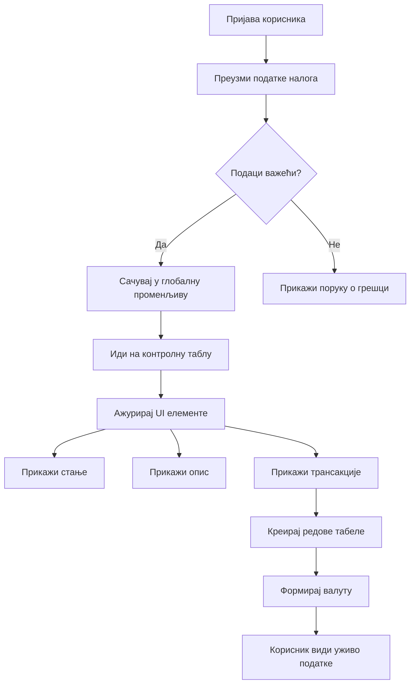
> 💡 **Савет стручњака**: Желите ли своју контролну таблу одмах видети у акцији? Користите корисничко име `test` када се пријављујете - долази унапред учитан са примерима података тако да све можете видети како ради без потребе да правите трансакције.
> 
**Зашто је тест налог користан:**
- Долази са реалистичним примерим подацима већ учитани
- Савршено за приказ како се трансакције приказују
- Одлично за тестирање функција ваше контролне табле
- Штеди време јер вам није потребно ручно креирати пробне податке

### Креирање елемената за приказ контролне табле

Хајде да корак по корак направимо интерфејс ваше контролне табле, почевши од информација о рачуну па све до сложенијих функција као што су листе трансакција.

#### Корак 1: Ажурирајте вашу ХТМЛ структуру

Прво, замените статични одељак „Салдо“ динамичким плейсхолдер елементима које ваш ЈаваСкрипт може попунити:

```html
<section>
  Balance: <span id="balance"></span><span id="currency"></span>
</section>
```

Затим додајте одељак за опис рачуна. Пошто овај део делује као наслов за садржај контролне табле, употребите семантички ХТМЛ:

```html
<h2 id="description"></h2>
```

**Разумевање ХТМЛ структуре:**
- **Користи** појединачне `<span>` елементе за салдо и валуту ради појединачне контроле
- **Додељује** јединствене ИД-ове сваком елементу за циљање ЈаваСкриптом
- **Прати** семантички ХТМЛ користећи `<h2>` за опис рачуна
- **Креира** логичку хијерархију за читаче екрана и СЕО

> ✅ **Инсайт о приступачности**: Опис рачуна функционише као наслов садржаја контролне табле, тако да је означен семантичким заглављем. Сазнајте више о томе како [структура заглавља](https://www.nomensa.com/blog/2017/how-structure-headings-web-accessibility) утиче на приступачност. Можете ли препознати друге елементе на вашој страници који би имали користи од заглавља?

#### Корак 2: Направите функцију за ажурирање контролне табле

Сада направите функцију која попуњава вашу контролну таблу стварним подацима са рачуна:

```javascript
function updateDashboard() {
  if (!account) {
    return navigate('/login');
  }

  updateElement('description', account.description);
  updateElement('balance', account.balance.toFixed(2));
  updateElement('currency', account.currency);
}
```

**Корак по корак, ево шта ова функција ради:**
- **Проверава** да ли постоје подаци о рачуну пре наставка
- **Преусмерава** неаутоентификоване кориснике назад на страницу за пријаву
- **Ажурира** опис рачуна користећи поново употребљиву функцију `updateElement`
- **Форматира** салдо да увек прикаже два децимална места
- **Приказује** одговарајући симбол валуте

> 💰 **Формат новца**: Та метода [`toFixed(2)`](https://developer.mozilla.org/docs/Web/JavaScript/Reference/Global_Objects/Number/toFixed) је спас за живот! Осигурава да ваш салдо увек изгледа као прави новац - „75.00“ уместо само „75“. Ваши корисници ће ценити познат формат валуте.

#### Корак 3: Осигурајте да се ваша контролна табла ажурира

Да бисмо осигурали да се ваша контрола табла освежава са актуелним подацима сваки пут када неко посети, морамо се убостити у ваш систем навигације. Ако сте завршили [задатак из лекције 1](../1-template-route/assignment.md), ово би требало да вам буде познато. Ако није, ево шта вам треба:

Додајте ово на крај ваше функције `updateRoute()`:

```javascript
if (typeof route.init === 'function') {
  route.init();
}
```

Затим ажурирајте ваше руте да укључују иницијализацију контролне табле:

```javascript
const routes = {
  '/login': { templateId: 'login' },
  '/dashboard': { templateId: 'dashboard', init: updateDashboard }
};
```

**Шта ова паметна поставка ради:**
- Проверава да ли рута има посебан код за иницијализацију
- Покреће тај код аутоматски када се рута учита
- Осигурава да ваша контролна табла увек приказује свеж и актуалан садржај
- Одржава вашу логику рутирања чистом и организованом

#### Тестирање ваше контролне табле

Након имплементације ових промена, тестирате своју контролну таблу:

1. **Пријавите се** помоћу тест налога
2. **Проверите** да ли сте преусмећени на контролну таблу
3. **Потврдите** да се опис рачуна, салдо и валута приказују исправно
4. **Пробајте да се одјавите и поново пријавите** да бисте осигурали да се подаци правилно освежавају

Ваша контролна табла сада треба да приказује динамичке податке о рачуну који се ажурирају на основу података корисника који је пријављен!

## Креирање паметних листа трансакција коришћењем шаблона

Уместо ручног креирања ХТМЛ-а за сваку трансакцију, користићемо шаблоне да аутоматски генеришемо конзистентан формат. Као стандардизоване компоненте које се користе у производњи свемирских брода, шаблони осигуравају да сваки ред трансакције следи исту структуру и изглед.

Ова техника ефикасно скалира од неколико трансакција до хиљада, одржавајући конзистентне перформансе и приказ.

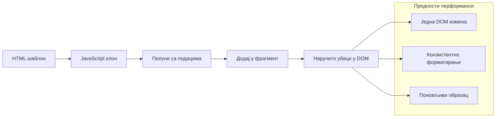
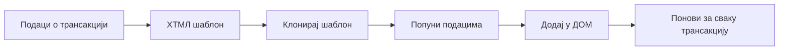
### Корак 1: Креирајте шаблон трансакције

Прво, додајте поново употребљив шаблон за редове трансакција у ваш ХТМЛ `<body>`:

```html
<template id="transaction">
  <tr>
    <td></td>
    <td></td>
    <td></td>
  </tr>
</template>
```

**Разумевање ХТМЛ шаблона:**
- **Дефинише** структуру за један ред табеле
- **Остаје** невидљив док се не клонира и попуни ЈаваСкриптом
- **Укључује** три ћелије за датум, опис и износ
- **Пружа** поново употребљив образац за конзистентан формат

### Корак 2: Припремите вашу табелу за динамички садржај

Затим додајте `id` у тело табеле тако да ЈаваСкрипт лако може да га циља:

```html
<tbody id="transactions"></tbody>
```

**Шта је овим постигнуто:**
- **Креира** јасну мету за убацивање редова трансакција
- **Одваја** структуру табеле од динамичког садржаја
- **Омогућава** лако брисање и поновно пуњење трансакцијских података

### Корак 3: Направите фабричку функцију за ред трансакције

Сада направите функцију која трансформише податке трансакције у ХТМЛ елементе:

```javascript
function createTransactionRow(transaction) {
  const template = document.getElementById('transaction');
  const transactionRow = template.content.cloneNode(true);
  const tr = transactionRow.querySelector('tr');
  tr.children[0].textContent = transaction.date;
  tr.children[1].textContent = transaction.object;
  tr.children[2].textContent = transaction.amount.toFixed(2);
  return transactionRow;
}
```

**Разлагање ове фабричке функције:**
- **Проналази** шаблонски елемент по његовом ИД-у
- **Клонира** садржај шаблона ради сигурне манипулације
- **Бира** ред табеле унутар клонираног садржаја
- **Попуњава** сваку ћелију подацима о трансакцији
- **Форматира** износ да прикаже исправан број децималних места
- **Враћа** готови ред спреман за уметање

### Корак 4: Ефикасно генеришите више редова трансакција

Додајте овај код у вашу функцију `updateDashboard()` да приказете све трансакције:

```javascript
const transactionsRows = document.createDocumentFragment();
for (const transaction of account.transactions) {
  const transactionRow = createTransactionRow(transaction);
  transactionsRows.appendChild(transactionRow);
}
updateElement('transactions', transactionsRows);
```

**Разумевање овог ефикасног приступа:**
- **Креира** документ фрагмент за давање групних ДОМ операција
- **Итера** кроз све трансакције у подацима рачуна
- **Генерише** ред за сваку трансакцију користећи фабричку функцију
- **Сакупља** све редове у фрагмент пре додавања у ДОМ
- **Изводи** једно ажурирање ДОМ-а уместо више појединачних уметања
> ⚡ **Оптимизација перформанси**: [`document.createDocumentFragment()`](https://developer.mozilla.org/docs/Web/API/Document/createDocumentFragment) функционише као процес састављања у Боеингу – компоненте се припремају ван главне линије, а затим се инсталирају као целина. Овај приступ груписања минимизира преуређивања DOM-а извођењем једне уметања уместо више појединачних операција.

### Корак 5: Унапредите функцију за ажурирање за мешовити садржај

Ваша функција `updateElement()` тренутно рукује само текстуалним садржајем. Ажурирајте је да ради и са текстом и са DOM чворовима:

```javascript
function updateElement(id, textOrNode) {
  const element = document.getElementById(id);
  element.textContent = ''; // Уклања сву децу
  element.append(textOrNode);
}
```

**Кључна побољшања у овом ажурирању:**
- **Брише** постојећи садржај пре додавања новог
- **Прихвата** или текстуалне низове или DOM чворове као параметре
- **Користи** метод [`append()`](https://developer.mozilla.org/docs/Web/API/ParentNode/append) ради флексибилности
- **Одржава** уназадну компатибилност са постојећом употребом заснованом на тексту

### Испробајте свој контролни панел у пракси

Време је за тренутак истине! Посматрајте своју динамичну контролну таблу у акцији:

1. Пријавите се корисничким налогом `test` (има спремне примерке података)
2. Идите на свој контролни панел
3. Проверите да ли се редови трансакција појављују са исправним форматирањем
4. Уверите се да су датуми, описи и износи лепо приказани

Ако све ради, требало би да видите потпуно функционалну листу трансакција на вашем контролном панелу! 🎉

**Шта сте постигли:**
- Направили сте контролни панел који се скалира за било коју количину података
- Креирали сте поново употребљиве шаблоне за доследно форматирање
- Имплементирали сте ефикасне технике манипулације DOM-ом
- Развили сте функционалности упоредиве са апликацијама за банкарство у продукцији

Успешно сте претворили статичну веб страницу у динамичну веб апликацију.

### 🎯 Педагошки преглед: Генерисање динамичког садржаја

**Разумевање архитектуре**: Имплементирали сте софистицирани „подаци у кориснички интерфејс“ процес који одсликава шаблоне коришћене у оквирима као што су React, Vue и Angular.

**Кључни усвојени појмови**:
- **Рендеровање засновано на шаблонима**: Креирање поново употребљивих UI компоненти
- **Документ фрагменти**: Оптимизација перформанси DOM-а
- **Безбедна манипулација DOM-ом**: Превенција безбедносних рањивости
- **Трансформација података**: Претварање серверских података у интерфејс корисника

**Веза са индустријом**: Ове технике чине основу модерних фронтенд фрејмворка. React-ов виртуелни DOM, Vue-ов систем шаблона и Angular-ова архитектура компоненти сва се ослањају на ове кључне концепте.

**Питање за размишљање**: Како бисте проширили овај систем да подржи ажурирања у реалном времену (нпр. нове трансакције које се аутоматски појављују)? Размислите о WebSockets или Server-Sent Events.

---

## 📈 Ваш временски оквир за овладавање управљањем подацима

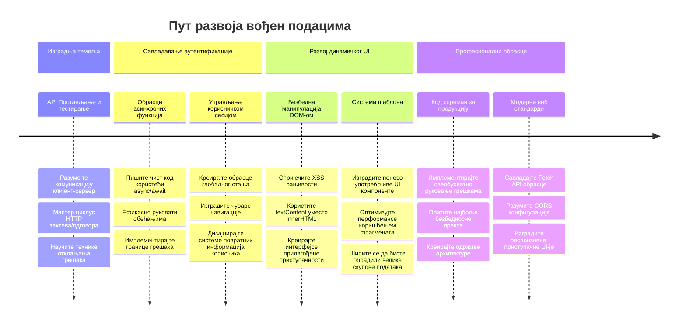
**🎓 Рок за дипломирање**: Успешно сте изградили комплетну веб апликацију вођену подацима користећи модерне JavaScript шаблоне. Ове вештине директно се преносе на рад са фрејмворцима као што су React, Vue или Angular.

**🔄 Способности за следећи ниво**:
- Спремни за истраживање фронтенд фрејмворка који користи ове концепте
- Припремљени за имплементацију функција у реалном времену помоћу WebSockets
- Опремљени за прављење Progressive Web Apps са офлајн могућностима
- Постављена основа за учење напредних образаца управљања стањем

## GitHub Copilot Agent изазов 🚀

Користите Agent режим да завршите следећи изазов:

**Опис:** Унапредите банкарску апликацију имплементирањем функције претраге и филтрирања трансакција која омогућава корисницима да пронађу специфичне трансакције по опсегу датума, износу или опису.

**Задатак:** Креирајте функционалност претраге за банкарску апликацију која укључује: 1) форму за претрагу са пољима за унос датума (од/до), минимални/максимални износ и кључне речи за опис трансакције, 2) функцију `filterTransactions()` која филтрира низ account.transactions на основу критеријума претраге, 3) ажурирајте функцију `updateDashboard()` да прикаже резултате филтрирања, и 4) додатну дугмад "Очисти филтере" за ресетовање приказа. Користите савремене JavaScript методе низа као што је `filter()` и обрадите граничне случајеве празних критеријума претраге.

Сазнајте више о [agent режиму](https://code.visualstudio.com/blogs/2025/02/24/introducing-copilot-agent-mode) овде.

## 🚀 Изазов

Спремни да вашу банкарску апликацију подигнете на виши ниво? Хајде да је учинимо атрактивнијом и функционалнијом. Ево неколико идеја да покренете вашу креативност:

**Учини је лепом**: Додајте CSS стилове да трансформишете свој функционални контролни панел у нешто визуелно привлачно. Размислите о чистим линијама, добром размаку и можда чак и неким суптилним анимацијама.

**Учини је прилагодљивом**: Покушајте да користите [media queries](https://developer.mozilla.org/docs/Web/CSS/Media_Queries) за креирање [респонзивног дизајна](https://developer.mozilla.org/docs/Web/Progressive_web_apps/Responsive/responsive_design_building_blocks) који одлично ради на телефонима, таблетима и рачунарима. Ваши корисници ће вам захвалити!

**Додајте мало стила**: Размислите о кодирању бојама за трансакције (зелена за приход, црвена за трошкове), додавању икона или креирању ефеката приликом преласка мишем који ће интерфејс учинити интерактивним.

Ево како би могла да изгледа уређена контрола табла:

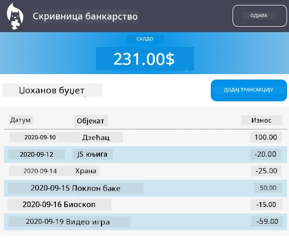

Не морате да ничим пратите овај пример у потпуности — користите га као инспирацију и направите свој стил!

## Квиз након предавања

[Квиз након предавања](https://ff-quizzes.netlify.app/web/quiz/46)

## Задатак

[Рефактирајте и коментаришите свој код](assignment.md)

---

<!-- CO-OP TRANSLATOR DISCLAIMER START -->
**Одрицање одговорности**:
Овај документ је преведен помоћу АИ сервиса за превођење [Co-op Translator](https://github.com/Azure/co-op-translator). Иако се трудимо да превод буде тачан, имајте у виду да аутоматски преводи могу садржати грешке или нетачности. Оригинални документ на његовом изворном језику треба сматрати ауторитетним извором. За критичне информације препоручује се професионални превод од стране људског преводиоца. Не сносимо одговорност за било каква неспоразума или погрешна тумачења настала коришћењем овог превода.
<!-- CO-OP TRANSLATOR DISCLAIMER END -->