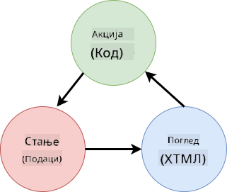

<!--
CO_OP_TRANSLATOR_METADATA:
{
  "original_hash": "4fa20c513e367e9cdd401bf49ae16e33",
  "translation_date": "2025-08-28T10:06:40+00:00",
  "source_file": "7-bank-project/4-state-management/README.md",
  "language_code": "sr"
}
-->
# Изградња апликације за банкарство, део 4: Концепти управљања стањем

## Квиз пре предавања

[Квиз пре предавања](https://ashy-river-0debb7803.1.azurestaticapps.net/quiz/47)

### Увод

Како веб апликација расте, постаје изазов пратити све токове података. Који код добија податке, која страница их користи, где и када треба да се ажурирају... лако је завршити са неуредним кодом који је тешко одржавати. Ово је посебно тачно када је потребно делити податке између различитих страница апликације, на пример корисничке податке. Концепт *управљања стањем* увек је постојао у свим врстама програма, али како веб апликације постају све сложеније, сада је то кључна тачка о којој треба размишљати током развоја.

У овом завршном делу, размотрићемо апликацију коју смо изградили како бисмо преиспитали начин управљања стањем, омогућавајући подршку за освежавање прегледача у било ком тренутку и чување података током корисничких сесија.

### Предуслови

Потребно је да сте завршили [преузимање података](../3-data/README.md) део веб апликације за ову лекцију. Такође, потребно је да инсталирате [Node.js](https://nodejs.org) и [покренете сервер API](../api/README.md) локално како бисте могли да управљате подацима о налогу.

Можете тестирати да ли сервер ради исправно извршавањем ове команде у терминалу:

```sh
curl http://localhost:5000/api
# -> should return "Bank API v1.0.0" as a result
```

---

## Преиспитивање управљања стањем

У [претходној лекцији](../3-data/README.md), увели смо основни концепт стања у нашој апликацији са глобалном променљивом `account` која садржи банкарске податке за тренутно пријављеног корисника. Међутим, наша тренутна имплементација има неке недостатке. Покушајте да освежите страницу док сте на контролној табли. Шта се дешава?

Постоје три проблема са тренутним кодом:

- Стање није сачувано, јер освежавање прегледача враћа вас на страницу за пријаву.
- Постоји више функција које мењају стање. Како апликација расте, то може отежати праћење промена и лако је заборавити да се нешто ажурира.
- Стање није очишћено, па када кликнете на *Одјава*, подаци о налогу су и даље ту, иако сте на страници за пријаву.

Могли бисмо ажурирати наш код да решимо ове проблеме један по један, али то би створило више дуплирања кода и учинило апликацију сложенијом и тежом за одржавање. Или бисмо могли паузирати на неколико минута и преиспитати нашу стратегију.

> Које проблеме заиста покушавамо да решимо овде?

[Управљање стањем](https://en.wikipedia.org/wiki/State_management) се односи на проналажење доброг приступа за решавање ова два конкретна проблема:

- Како учинити токове података у апликацији разумљивим?
- Како одржати податке о стању увек синхронизованим са корисничким интерфејсом (и обрнуто)?

Када се позабавите овим питањима, било који други проблеми које можда имате могу бити већ решени или постати лакши за решавање. Постоји много могућих приступа за решавање ових проблема, али ми ћемо се определити за уобичајено решење које се састоји од **централизовања података и начина њиховог мењања**. Токови података би изгледали овако:



> Овде нећемо покривати део где подаци аутоматски покрећу ажурирање приказа, јер је то повезано са напреднијим концептима [реактивног програмирања](https://en.wikipedia.org/wiki/Reactive_programming). То је добра тема за дубље истраживање ако сте заинтересовани.

✅ Постоји много библиотека са различитим приступима управљању стањем, [Redux](https://redux.js.org) је популарна опција. Погледајте концепте и обрасце који се користе, јер је то често добар начин да научите о потенцијалним проблемима са којима се можете суочити у великим веб апликацијама и како их можете решити.

### Задатак

Почећемо са мало рефакторисања. Замените декларацију `account`:

```js
let account = null;
```

Са:

```js
let state = {
  account: null
};
```

Идеја је да *централизујемо* све податке наше апликације у један објекат стања. Тренутно имамо само `account` у стању, па се много не мења, али то ствара пут за будуће еволуције.

Такође морамо ажурирати функције које га користе. У функцијама `register()` и `login()`, замените `account = ...` са `state.account = ...`;

На врху функције `updateDashboard()` додајте ову линију:

```js
const account = state.account;
```

Ово рефакторисање само по себи није донело много побољшања, али идеја је била да се постави основа за следеће промене.

## Праћење промена података

Сада када смо поставили објекат `state` за чување наших података, следећи корак је централизовање ажурирања. Циљ је да се олакша праћење било каквих промена и када се оне дешавају.

Да бисмо избегли промене направљене на објекту `state`, такође је добра пракса да га сматрамо [*непроменљивим*](https://en.wikipedia.org/wiki/Immutable_object), што значи да се уопште не може мењати. То такође значи да морате креирати нови објекат стања ако желите да промените било шта у њему. На овај начин, градите заштиту од потенцијално нежељених [споредних ефеката](https://en.wikipedia.org/wiki/Side_effect_(computer_science)), и отварате могућности за нове функције у вашој апликацији, као што је имплементација undo/redo, док такође олакшавате дебаговање. На пример, могли бисте да бележите сваку промену направљену на стању и чувате историју промена како бисте разумели извор грешке.

У JavaScript-у можете користити [`Object.freeze()`](https://developer.mozilla.org/docs/Web/JavaScript/Reference/Global_Objects/Object/freeze) да креирате непроменљиву верзију објекта. Ако покушате да направите промене на непроменљивом објекту, биће подигнут изузетак.

✅ Да ли знате разлику између *плитког* и *дубоког* непроменљивог објекта? Можете прочитати о томе [овде](https://developer.mozilla.org/docs/Web/JavaScript/Reference/Global_Objects/Object/freeze#What_is_shallow_freeze).

### Задатак

Хајде да креирамо нову функцију `updateState()`:

```js
function updateState(property, newData) {
  state = Object.freeze({
    ...state,
    [property]: newData
  });
}
```

У овој функцији, креирамо нови објекат стања и копирамо податке из претходног стања користећи [*spread (`...`) оператор*](https://developer.mozilla.org/docs/Web/JavaScript/Reference/Operators/Spread_syntax#Spread_in_object_literals). Затим замењујемо одређено својство објекта стања новим подацима користећи [нотацију са заградама](https://developer.mozilla.org/docs/Web/JavaScript/Guide/Working_with_Objects#Objects_and_properties) `[property]` за доделу. На крају, закључавамо објекат како бисмо спречили модификације користећи `Object.freeze()`. Тренутно имамо само својство `account` у стању, али са овим приступом можете додати онолико својстава колико вам је потребно у стању.

Такође ћемо ажурирати иницијализацију `state` како бисмо били сигурни да је почетно стање такође замрзнуто:

```js
let state = Object.freeze({
  account: null
});
```

Након тога, ажурирајте функцију `register` заменом `state.account = result;` са:

```js
updateState('account', result);
```

Урадите исто са функцијом `login`, заменом `state.account = data;` са:

```js
updateState('account', data);
```

Сада ћемо искористити прилику да решимо проблем са подацима о налогу који нису очишћени када корисник кликне на *Одјава*.

Креирајте нову функцију `logout()`:

```js
function logout() {
  updateState('account', null);
  navigate('/login');
}
```

У `updateDashboard()`, замените преусмеравање `return navigate('/login');` са `return logout();`

Покушајте да региструјете нови налог, одјавите се и поново пријавите да бисте проверили да ли све и даље ради исправно.

> Савет: можете погледати све промене стања додавањем `console.log(state)` на крају `updateState()` и отварањем конзоле у алатима за развој вашег прегледача.

## Чување стања

Већини веб апликација је потребно да чувају податке како би исправно функционисале. Сви критични подаци обично се чувају у бази података и приступа им се преко серверског API-ја, као што су подаци о корисничком налогу у нашем случају. Али понекад је такође занимљиво чувати неке податке на клијентској апликацији која ради у вашем прегледачу, ради бољег корисничког искуства или ради побољшања перформанси учитавања.

Када желите да чувате податке у вашем прегледачу, постоји неколико важних питања која треба да поставите себи:

- *Да ли су подаци осетљиви?* Требало би избегавати чување било каквих осетљивих података на клијенту, као што су корисничке лозинке.
- *Колико дуго вам је потребно да задржите ове податке?* Да ли планирате да приступите овим подацима само током тренутне сесије или желите да буду трајно сачувани?

Постоји више начина за чување информација унутар веб апликације, у зависности од тога шта желите да постигнете. На пример, можете користити URL-ове за чување упита за претрагу и учинити их деливим између корисника. Такође можете користити [HTTP колачиће](https://developer.mozilla.org/docs/Web/HTTP/Cookies) ако подаци треба да се деле са сервером, као што су информације о [аутентификацији](https://en.wikipedia.org/wiki/Authentication).

Друга опција је коришћење једног од многих API-ја прегледача за чување података. Два од њих су посебно занимљива:

- [`localStorage`](https://developer.mozilla.org/docs/Web/API/Window/localStorage): [Key/Value store](https://en.wikipedia.org/wiki/Key%E2%80%93value_database) који омогућава чување података специфичних за тренутни веб сајт током различитих сесија. Подаци сачувани у њему никада не истичу.
- [`sessionStorage`](https://developer.mozilla.org/docs/Web/API/Window/sessionStorage): ради исто као `localStorage`, осим што се подаци сачувани у њему бришу када сесија заврши (када се прегледач затвори).

Имајте на уму да оба ова API-ја дозвољавају само чување [стрингова](https://developer.mozilla.org/docs/Web/JavaScript/Reference/Global_Objects/String). Ако желите да чувате сложене објекте, мораћете да их серијализујете у [JSON](https://developer.mozilla.org/docs/Web/JavaScript/Reference/Global_Objects/JSON) формат користећи [`JSON.stringify()`](https://developer.mozilla.org/docs/Web/JavaScript/Reference/Global_Objects/JSON/stringify).

✅ Ако желите да креирате веб апликацију која не ради са сервером, могуће је креирати базу података на клијенту користећи [`IndexedDB` API](https://developer.mozilla.org/docs/Web/API/IndexedDB_API). Овај је резервисан за напредне случајеве употребе или ако треба да чувате значајну количину података, јер је сложенији за употребу.

### Задатак

Желимо да наши корисници остану пријављени док експлицитно не кликну на дугме *Одјава*, па ћемо користити `localStorage` за чување података о налогу. Прво, хајде да дефинишемо кључ који ћемо користити за чување наших података.

```js
const storageKey = 'savedAccount';
```

Затим додајте ову линију на крај функције `updateState()`:

```js
localStorage.setItem(storageKey, JSON.stringify(state.account));
```

Са овим, подаци о корисничком налогу ће бити сачувани и увек ажурирани, јер смо претходно централизовали сва наша ажурирања стања. Овде почињемо да уживамо у предностима свих наших претходних рефакторисања 🙂.

Како су подаци сачувани, такође морамо водити рачуна о њиховом враћању када се апликација учита. Пошто ћемо почети да имамо више кода за иницијализацију, можда је добра идеја да креирамо нову функцију `init`, која такође укључује наш претходни код на крају `app.js`:

```js
function init() {
  const savedAccount = localStorage.getItem(storageKey);
  if (savedAccount) {
    updateState('account', JSON.parse(savedAccount));
  }

  // Our previous initialization code
  window.onpopstate = () => updateRoute();
  updateRoute();
}

init();
```

Овде враћамо сачуване податке, и ако их има, ажурирамо стање у складу с тим. Важно је то урадити *пре* ажурирања руте, јер може постојати код који се ослања на стање током ажурирања странице.

Такође можемо учинити страницу *Контролна табла* подразумеваном страницом наше апликације, јер сада чувамо податке о налогу. Ако се не пронађу подаци, контролна табла се брине о преусмеравању на страницу *Пријава*. У `updateRoute()`, замените резервну `return navigate('/login');` са `return navigate('/dashboard');`.

Сада се пријавите у апликацију и покушајте да освежите страницу. Требало би да останете на контролној табли. Са тим ажурирањем, решили смо све наше почетне проблеме...

## Освежавање података

...Али можда смо такође створили нови проблем. Опа!

Идите на контролну таблу користећи налог `test`, а затим покрените ову команду у терминалу да бисте креирали нову трансакцију:

```sh
curl --request POST \
     --header "Content-Type: application/json" \
     --data "{ \"date\": \"2020-07-24\", \"object\": \"Bought book\", \"amount\": -20 }" \
     http://localhost:5000/api/accounts/test/transactions
```

Покушајте да освежите страницу контролне табле у прегледачу сада. Шта се дешава? Да ли видите нову трансакцију?

Стање је сачувано на неодређено време захваљујући `localStorage`, али то такође значи да се никада не ажурира док се не одјавите из апликације и поново пријавите!

Једна могућа стратегија за решавање овог проблема је да се подаци о налогу поново учитавају сваки пут када се контролна табла учита, како би се избегли застарели подаци.

### Задатак

Креирајте нову функцију `updateAccountData`:

```js
async function updateAccountData() {
  const account = state.account;
  if (!account) {
    return logout();
  }

  const data = await getAccount(account.user);
  if (data.error) {
    return logout();
  }

  updateState('account', data);
}
```

Ова метода проверава да ли смо тренутно пријављени, а затим поново учитава податке о налогу са сервера.

Креирајте још једну функцију под називом `refresh`:

```js
async function refresh() {
  await updateAccountData();
  updateDashboard();
}
```

Ова функција ажурира податке о налогу
[Квиз након предавања](https://ashy-river-0debb7803.1.azurestaticapps.net/quiz/48)

## Задатак

[Имплементирајте дијалог "Додај трансакцију"](assignment.md)

Ево примера резултата након завршетка задатка:


---

**Одрицање од одговорности**:  
Овај документ је преведен коришћењем услуге за превођење помоћу вештачке интелигенције [Co-op Translator](https://github.com/Azure/co-op-translator). Иако се трудимо да обезбедимо тачност, молимо вас да имате у виду да аутоматски преводи могу садржати грешке или нетачности. Оригинални документ на његовом изворном језику треба сматрати ауторитативним извором. За критичне информације препоручује се професионални превод од стране људи. Не преузимамо одговорност за било каква погрешна тумачења или неспоразуме који могу настати услед коришћења овог превода.