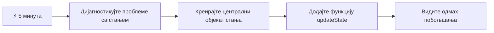
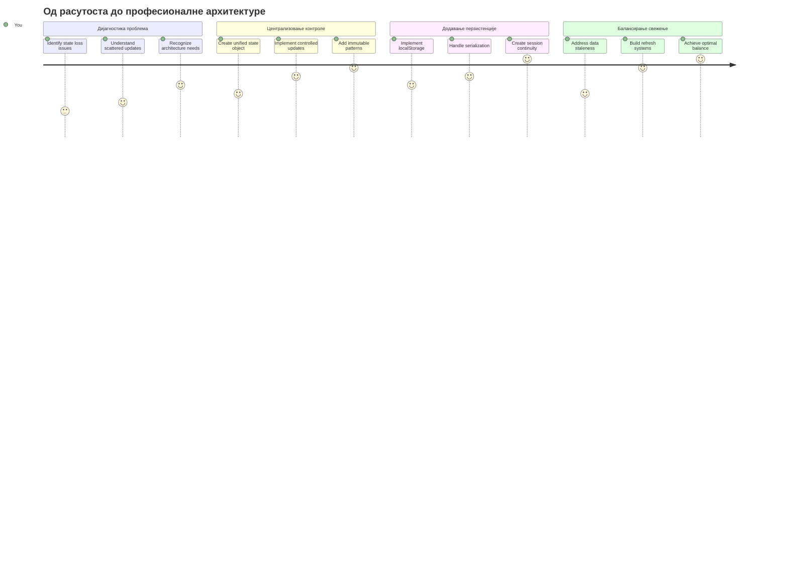
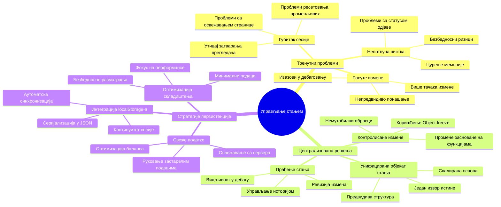
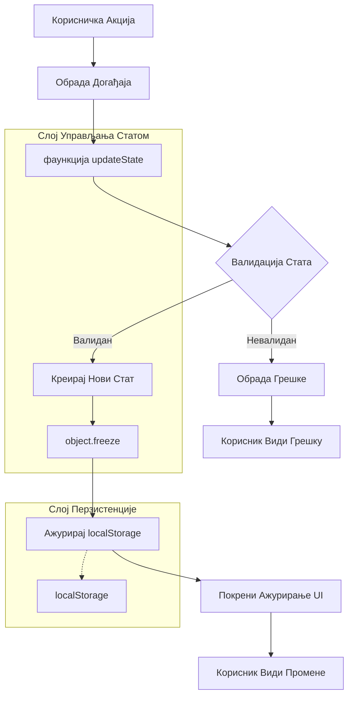
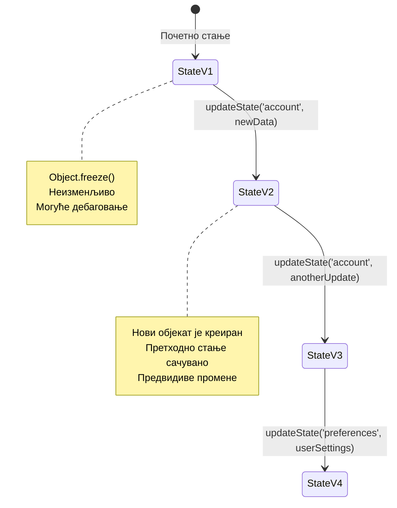
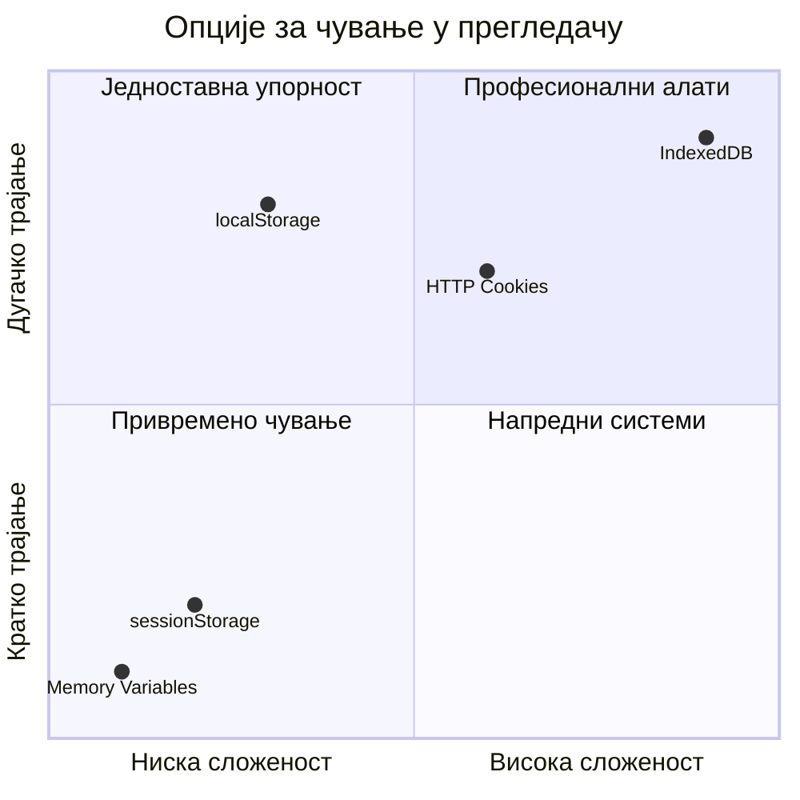
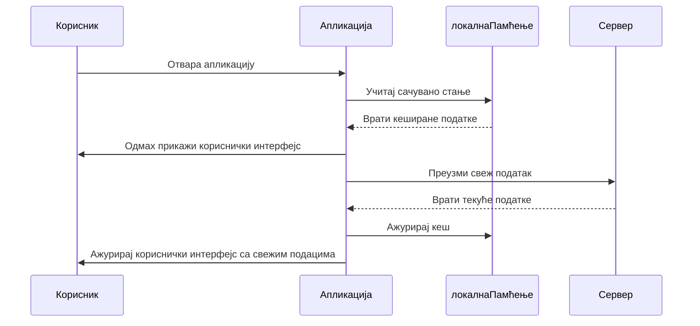
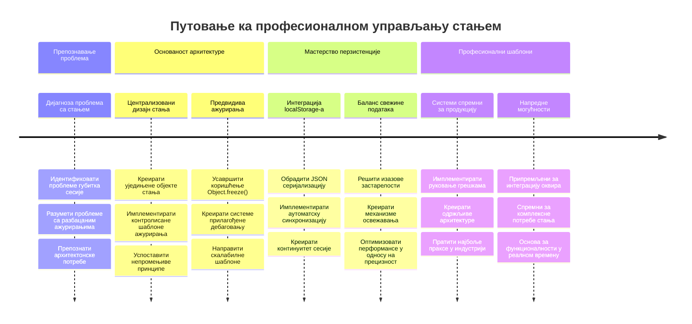
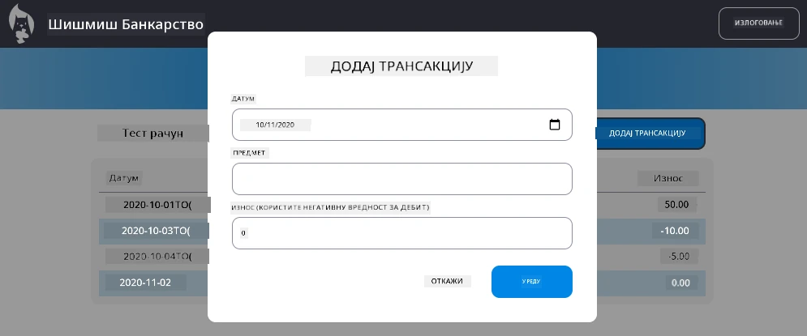

<!--
CO_OP_TRANSLATOR_METADATA:
{
  "original_hash": "b807b09df716dc48a2b750835bf8e933",
  "translation_date": "2026-01-07T08:16:18+00:00",
  "source_file": "7-bank-project/4-state-management/README.md",
  "language_code": "sr"
}
-->
# Направите банкарску апликацију, део 4: Концепти управљања стањем

## ⚡ Шта можете урадити у наредних 5 минута

**Пут за брзи почетак за заузете програмере**


- **Минут 1**: Тестирајте тренутни проблем са стањем - пријавите се, освежите страницу, посматрајте одјаву
- **Минут 2**: Замените `let account = null` са `let state = { account: null }`
- **Минут 3**: Креирајте једноставну функцију `updateState()` за контролисана ажурирања
- **Минут 4**: Ажурирајте једну функцију да користи нови образац
- **Минут 5**: Тестирајте побољшану предвидљивост и могућност снимања грешака

**Брзи дијагностички тест**:
```javascript
// Пре: Расут стање
let account = null; // Изгубљено након освежавања!

// После: Централизовано стање
let state = Object.freeze({ account: null }); // Контролисано и пратљиво!
```

**Зашто је ово важно**: За 5 минута ћете доживети трансформацију од хаотичног управљања стањем до предвидивих, лако опструираних образаца. Ово је основа која чини сложене апликације одрживим.

## 🗺️ Ваш пут учења кроз мајсторство управљања стањем


**Циљ вашег путовања**: До краја ове лекције изградићете професионални систем управљања стањем који рукује перзистенцијом, свежином података и предвидивим ажурирањима - исте образце које користе производне апликације.

## Пре-лекцијски квиз

[Пре-лекцијски квиз](https://ff-quizzes.netlify.app/web/quiz/47)

## Увод

Управљање стањем је као навигациони систем на свемирском броду Voyager – када све ради глатко, готово да не приметите да је ту. Али када нешто пође по злу, постаје разлика између доласка до интерстеларног простора и лутања у космичком празнину. У веб развоју, стање представља све што ваша апликација мора да памти: статус пријаве корисника, податке из форми, историју навигације и привремена стања интерфејса.

Док се ваша банкарска апликација развијала из једноставног формулара за пријаву у софистициранију апликацију, вероватно сте наишли на неке уобичајене изазове. Освежите страницу и корисници се неочекивано одјављују. Затворите прегледач и сав напредак нестаје. Снимање грешке значи претраживање преко више функција које на различите начине мењају исте податке.

Ово нису знакови лошег кода – ово су природне растуће боли које се јављају када апликације достигну одређени ниво сложености. Сваки програмер се суочава са овим изазовима док њихове апликације прелазе из „доказа концепта“ у „спремне за производњу“.

У овој лекцији ћемо имплементирати централизовани систем управљања стањем који ће вашу банкарску апликацију трансформисати у поуздану, професионалну апликацију. Научићете како контролисано управљати током података, правилно чувати сесије корисника и створити глатко корисничко искуство које модерне веб апликације захтевају.

## Предуслови

Пре него што зароните у концепте управљања стањем, морате имати исправно подешено развојно окружење и постављену основу банкарске апликације. Ова лекција се директно надовезује на концепте и код из претходних делова ове серије.

Уверите се да имате следеће компоненте спремне пре наставка:

**Потребна подешавања:**
- Завршите [лекцију о дохватању података](../3-data/README.md) - ваша апликација треба успешно да учита и прикаже податке о рачуну
- Инсталирајте [Node.js](https://nodejs.org) на свом систему за покретање серверске API
- Покрените локално [серверски API](../api/README.md) да бисте управљали операцијама са подацима рачуна

**Тестирање вашег окружења:**

Проверите да ли ваш API сервер ради исправно извршавањем ове команде у терминалу:

```sh
curl http://localhost:5000/api
# -> треба да врати "Bank API v1.0.0" као резултат
```

**Шта ова команда ради:**
- **Слање** GET захтева вашем локалном API серверу
- **Тестирање** везе и провера одговора сервера
- **Враћање** информација о верзији API ако све ради исправно

## 🧠 Преглед архитектуре управљања стањем


**Основно правило**: Професионално управљање стањем балансира предвидивост, перзистенцију и перформансе за стварање поузданих корисничких искустава која се скалирају од једноставних интеракција до сложених радних токова апликација.

---

## Дијагностика тренутних проблема са стањем

Као што Шерлок Холмс испитује место злочина, морамо сасвим разумети шта се дешава у нашој тренутној имплементацији пре него што решимо мистерију нестајања корисничких сесија.

Извршићемо једноставан експеримент који открива изазове управљања стањем:

**🧪 Испробајте овај дијагностички тест:**
1. Пријавите се у вашу банкарску апликацију и идите на контролну таблу
2. Освежите страницу у прегледачу
3. Посматрајте шта се догађа са статусом пријаве

Ако вас врати на екран за пријаву, открили сте класичан проблем перзистенције стања. Ово се дешава јер наша тренутна имплементација чува корисничке податке у JavaScript променљивима која се ресетују сваки пут када се страница освежи.

**Тренутни проблеми имплементације:**

Једноставна променљива `account` из наше [претходне лекције](../3-data/README.md) ствара три значајна проблема која утичу и на корисничко искуство и одрживост кода:

| Проблем            | Технички узрок                             | Утицај на корисника                  |
|--------------------|--------------------------------------------|------------------------------------|
| **Губитак сесије** | Освежавање странице брише JavaScript променљиве | Корисници морају често да се пријављују |
| **Разбацана ажурирања** | Више функција директно мења стање              | Снимање грешака постаје све теже  |
| **Непотпуно чишћење** | Одјава не брише све референце стања           | Могући безбедносни и приватни ризици |

**Архитектонски изазов:**

Као што је Титаник имао коморе које су деловале робусно све док се није напунило више комора у исто време, поправљање ових проблема појединачно неће решити основни архитектонски проблем. Потребно нам је свеобухватно решење за управљање стањем.

> 💡 **Шта заправо покушавамо да постигнемо?**

[Управљање стањем](https://en.wikipedia.org/wiki/State_management) је заправо решавање два основна проблема:

1. **Где су ми подаци?**: Праћење шта имамо и одакле долазе подаци
2. **Да ли су сви усаглашени?**: Осигурати да оно што корисници виде одговара стварном стању

**Наш план игре:**

Уместо да трчимо у круг, креираћемо **централизовани систем управљања стањем**. Замислите да имамо једну заиста организовану особу која контролише све битне ствари:



**Разумевање овог тока података:**
- **Централизује** цело стање апликације на једном месту
- **Маршира** све промене стања кроз контролисане функције
- **Осигурава** да кориснички интерфејс остане синхронизован са тренутним стањем
- **Пружа** јасан, предвидив образац за управљање подацима

> 💡 **Професионални увид**: Ова леција се фокусира на основне концепте. За сложене апликације, библиотеке као што је [Redux](https://redux.js.org) пружају напредније могућности управљања стањем. Разумевање ових основних принципа помоћи ће вам да савладате било коју библиотеку за управљање стањем.

> ⚠️ **Напредна тема**: Нећемо покривати аутоматска ажурирања UI покренута променама стања јер то укључује концепте [реактивног програмирања](https://en.wikipedia.org/wiki/Reactive_programming). Размотрите ово као одличан следећи корак у вашем учењу!

### Задатак: Централизујте структуру стања

Почнимо трансформацију разбацаног управљања стањем у централизовани систем. Овај први корак поставља темеље за све будуће исправке.

**Корак 1: Креирајте централни објекат стања**

Замените једноставну декларацију `account`:

```js
let account = null;
```

са структуираним објектом стања:

```js
let state = {
  account: null
};
```

**Зашто је ова промена важна:**
- **Централизује** све податке апликације на једном месту
- **Припрема** структуру за додавање више својстава стања у будућности
- **Ствара** јасну границу између стања и других променљивих
- **Успоставља** образац који се шири како ваша апликација расте

**Корак 2: Ажурирајте обрасце приступа стању**

Прилагодите функције да користе нову структуру стања:

**У функцијама `register()` и `login()`**, замените:
```js
account = ...
```

са:
```js
state.account = ...
```

**У функцији `updateDashboard()`**, додајте ову линију на врх:
```js
const account = state.account;
```

**Шта ова ажурирања постижу:**
- **Одржавају** постојећу функционалност уз бољу структуру
- **Припремају** ваш код за сложеније управљање стањем
- **Креирају** доследне обрасце за приступ подацима стања
- **Успостављају** темеље за централизована ажурирања стања

> 💡 **Напомена**: Ово рефакторисање тренутно не решава све наше проблеме, али ствара суштинске основе за моћна побољшања која следе!

### 🎯 Педагошки паузни тест: Принципи централизације

**Пауза и Размишљање**: Управо сте имплементирали темеље централизованог управљања стањем. Ово је кључна архитектонска одлука.

**Брза самооцењивања:**
- Можете ли објаснити зашто је централизовање стања у једном објекту боље од разбацаних променљивих?
- Шта би се десило ако заборавите да ажурирате функцију да користи `state.account`?
- Како овај образац припрема ваш код за напредније могућности?

**Веза са стварним светом**: Образац централизације који сте научили је основа модерних фрејмворка као што су Redux, Vuex и React Context. Ви градите исту архитектонску концепцију коју користе велике апликације.

**Изазовно питање**: Ако треба да додате корисничке преференције (тему, језик) у вашу апликацију, где бисте их додали у структуру стања? Како би се ово скалирало?

## Имплементација контролисаних ажурирања стања

Са централизованим стањем, следећи корак је успостављање контролисаних механизама за измене података. Овај приступ обезбеђује предвидиве промене стања и лакше снимање грешака.

Језгро овог принципа подсећа на контролу ваздушног саобраћаја: уместо да дозволимо више функција да самостално мењају стање, усмерићемо све промене кроз једну контролисану функцију. Овај образац пружа јасан надзор када и како се подаци мењају.

**Управљање непромењивим стањем (Immutable):**

Третираћемо наш `state` објекат као [*непромењив*](https://en.wikipedia.org/wiki/Immutable_object), што значи да га никада не мењамо директно. Уместо тога, свака промена креира нови објекат стања са ажурираним подацима.

Иако овај приступ можда у почетку изгледа неефикасно у поређењу са директним изменама, он пружа значајне предности за снимање грешака, тестирање и одрживост предвидивости апликације.

**Предности управљања непромењивим стањем:**

| Предност          | Опис                                          | Утицај                              |
|-------------------|----------------------------------------------|-----------------------------------|
| **Предвидивост**  | Промене се дешавају само кроз контролисане функције | Лакше снимање грешака и тестирање |
| **Праћење историје** | Свако ажурирање стања креира нови објекат       | Омогућава функције као Undo/Redo  |
| **Превенција споредних ефеката** | Без случајних измена                        | Спречава мистериозне грешке       |
| **Оптимизација перформанси** | Лако детектује када се стање заиста промени  | Омогућава ефикасна UI ажурирања   |

**JavaScript непромењивост са `Object.freeze()`:**

JavaScript пружа [`Object.freeze()`](https://developer.mozilla.org/docs/Web/JavaScript/Reference/Global_Objects/Object/freeze) за спречавање измена објекта:

```js
const immutableState = Object.freeze({ account: userData });
// Сваки покушај измене immutableState ће изазвати грешку
```

**Објашњење шта се овде дешава:**
- **Спречава** директне доделе или брисање својстава
- **Баца** изузетке ако се покуша измена
- **Осигурава** да промене морају ићи кроз контролисане функције
- **Ствара** јасан уговор о томе како се стање може мењати

> 💡 **Детаљније**: Сазнајте разлику између *плитког* и *дубоког* замрзавања објеката у [MDN документацији](https://developer.mozilla.org/docs/Web/JavaScript/Reference/Global_Objects/Object/freeze#What_is_shallow_freeze). Разумевање ове разлике је кључно за сложене структуре стања.


### Задатак

Креирајмо нову функцију `updateState()`:

```js
function updateState(property, newData) {
  state = Object.freeze({
    ...state,
    [property]: newData
  });
}
```

У овој функцији креирамо нови објекат стања и копирамо податке из претходног стања коришћењем [оператора ширења (`...`)](https://developer.mozilla.org/docs/Web/JavaScript/Reference/Operators/Spread_syntax#Spread_in_object_literals). Затим преписујемо одређено својство стања са новим подацима коришћењем [нозичне нотације](https://developer.mozilla.org/docs/Web/JavaScript/Guide/Working_with_Objects#Objects_and_properties) `[property]`. На крају закључавамо објекат да не би могао бити мењан коришћењем `Object.freeze()`. Тренутно чувајемо само својство `account` у стању, али овим приступом можете додати колико год својстава је потребно.

Такође ћемо ажурирати иницијализацију `state` како бисмо осигурали да је и почетно стање замрзнуто:

```js
let state = Object.freeze({
  account: null
});
```

Након тога, ажурирајте функцију `register` заменом доделе `state.account = result;` са:

```js
updateState('account', result);
```

Учинимо исто у функцији `login`, заменивши `state.account = data;` са:

```js
updateState('account', data);
```

Сада ћемо искористити прилику да поправимо проблем што се подаци рачуна не бришу када корисник кликне на *Logout*.

Креирајте нову функцију `logout()`:

```js
function logout() {
  updateState('account', null);
  navigate('/login');
}
```

У функцији `updateDashboard()`, замените преусмеравање `return navigate('/login');` са `return logout();`

Пробајте да региструјете нови рачун, одјавите се и поново пријавите да проверите да ли све исправно ради.

> Савет: можете пратити све промене стања додавањем `console.log(state)` на дно функције `updateState()` и отварањем конзоле у алатима за развој у вашем прегледачу.

## Имплементација перзистенције података

Проблем губитка сесије који смо раније идентификовали захтева решење перзистенције које одржава стање корисника кроз прегледачке сесије. Ово трансформише нашу апликацију из привременог искуства у поуздан, професионалан алат.

Размислите како атомски сати одржавају прецизно време чак и током прекида напајања чувајући кључне податке у непроводној меморији. Слично томе, веб апликацијама су потребни механизми за перзистентно чување који очувавају битне корисничке податке кроз сесије и освежавања страница.

**Стратешка питања за перзистенцију података:**

Пре имплементације перзистенције, размотрите ове критичне факторе:

| Питање                   | Контекст банкарске апликације       | Утицај одлуке                    |
|--------------------------|-----------------------------------|--------------------------------|
| **Да ли су подаци осетљиви?** | Стање рачуна, историја трансакција | Одабрати безбедне методе складиштења |
| **Колико дуго треба да се чува?** | Стање пријаве у поређењу са привременим корисничким подешавањима | Изаберите одговарајући рок чувања |
| **Да ли сервер треба да га има?** | Аутентификациони токени у поређењу са UI подешавањима | Одредите захтеве за дељење |

**Опције за складиштење у прегледачу:**

Модерни прегледачи пружају неколико механизама за чување, сваки дизајниран за различите случајеве употребе:

**Примарни Storage API-ји:**

1. **[`localStorage`](https://developer.mozilla.org/docs/Web/API/Window/localStorage)**: Перзистентно [Key/Value складиште](https://en.wikipedia.org/wiki/Key%E2%80%93value_database)
   - **Чува** податке преко сесија прегледача на неодређено време  
   - **Опстаје** кроз поновне покрете прегледача и рачунара
   - **Ограничено** на специфичан домен веб сајта
   - **Идеално** за корисничке преференције и стање пријаве

2. **[`sessionStorage`](https://developer.mozilla.org/docs/Web/API/Window/sessionStorage)**: Привремено сесијско складиште
   - **Функционише** идентично као localStorage током активних сесија
   - **Брише** се аутоматски када се затвори картица прегледача
   - **Погодно** за привремене податке који не треба да опстану

3. **[HTTP Колачићи](https://developer.mozilla.org/docs/Web/HTTP/Cookies)**: Складиште које дели сервер
   - **Аутоматски** се шаљу са сваким захтевом ка серверу
   - **Идеално** за [аутентификационе](https://en.wikipedia.org/wiki/Authentication) токене
   - **Ограничени** су по величини и могу утицати на перформансе

**Потреба за серијализацијом података:**

И `localStorage` и `sessionStorage` чувају само [string](https://developer.mozilla.org/docs/Web/JavaScript/Reference/Global_Objects/String):

```js
// Претвори објекте у JSON низове за чување
const accountData = { user: 'john', balance: 150 };
localStorage.setItem('account', JSON.stringify(accountData));

// Парсирај JSON низове назад у објекте приликом преузимања
const savedAccount = JSON.parse(localStorage.getItem('account'));
```

**Разумевање серијализације:**
- **Претвара** JavaScript објекте у JSON низове користећи [`JSON.stringify()`](https://developer.mozilla.org/docs/Web/JavaScript/Reference/Global_Objects/JSON/stringify)
- **Реконструише** објекте из JSON-а користећи [`JSON.parse()`](https://developer.mozilla.org/docs/Web/JavaScript/Reference/Global_Objects/JSON/parse)
- **Обрађује** сложене угнежђене објекте и низове аутоматски
- **Не функционише** са функцијама, undefined вредностима и кружним референцама

> 💡 **Напредна Опција**: За сложене офлајн апликације са великим скуповима података, размислите о [`IndexedDB` API-ју](https://developer.mozilla.org/docs/Web/API/IndexedDB_API). Нуди потпуну базу података на клијентској страни али захтева компликованију имплементацију.


### Задатак: Имплементирајте перзистенцију у localStorage

Хајде да имплементирамо перзистентно складиште како би корисници остали пријављени док се експлицитно не одјаве. Користићемо `localStorage` за чување података о налогу преко сесија прегледача.

**Први корак: Defинисање конфигурације складишта**

```js
const storageKey = 'savedAccount';
```

**Шта ова константа пружа:**
- **Креира** доследан идентификатор за наше податке
- **Спречава** типографске грешке у референцама на кључ складишта
- **Олакшава** промену кључа складишта ако је потребно
- **Прати** најбоље праксе за одржив код

**Други корак: Додавање аутоматске перзистенције**

Додајте овај ред на крају функције `updateState()`:

```js
localStorage.setItem(storageKey, JSON.stringify(state.account));
```

**Разлагање шта се овде дешава:**
- **Претвара** објекат налога у JSON низ за складиштење
- **Снима** податке користећи наш доследни кључ за складиштење
- **Извршава** се аутоматски кад год дође до промене стања
- **Обезбеђује** да ће сачувани подаци увек бити синхронизовани са тренутним стањем

> 💡 **Архитектонска предност**: Јер смо централизовали све ажурирања стања преко `updateState()`, додавање перзистенције захтевало је само један ред кода. Ово показује снагу добрих архитектонских одлука!

**Трећи корак: Враћање стања при учитавању апликације**

Креирајте иницијализациону функцију за враћање сачуваних података:

```js
function init() {
  const savedAccount = localStorage.getItem(storageKey);
  if (savedAccount) {
    updateState('account', JSON.parse(savedAccount));
  }

  // Наш претходни код за иницијализацију
  window.onpopstate = () => updateRoute();
  updateRoute();
}

init();
```

**Разумевање процеса иницијализације:**
- **Преузима** било какве сачуване податке налога из localStorage
- **Парсира** JSON низ назад у JavaScript објекат
- **Ажурира** стање користећи нашу контролисану update функцију
- **Аутоматски** враћа корисничку сесију при учитавању странице
- **Извршава се** пре ажурирања рутирања како би стање било доступно

**Четврти корак: Оптимизација подразумеване руте**

Ажурирајте подразумевану руту да искористите предности перзистенције:

У `updateRoute()`, замените:
```js
// Замени: return navigate('/login');
return navigate('/dashboard');
```

**Зашто ова промена има смисла:**
- **Искористи** наш нови систем перзистенције ефикасно
- **Дозвољава** контролу аутентификације преко контролне табле
- **Аутоматски** преусмерава на пријаву ако нема сачуване сесије
- **Креира** незнатније корисничко искуство

**Тестирање ваше имплементације:**

1. Пријавите се у вашу банкарску апликацију
2. Освежите страницу прегледача
3. Потврдите да сте и даље пријављени и на контролној табли
4. Затворите и поново отворите прегледач
5. Вратите се у апликацију и потврдите да сте још увек пријављени

🎉 **Остварен успех**: Успешно сте имплементирали систем перзистентног управљања стањем! Ваша апликација сада ради као професионална веб апликација.

### 🎯 Педагошки преглед: Архитектура перзистенције

**Разумевање архитектуре**: Имплементирали сте софистицирани слој перзистенције који балансира корисничко искуство са сложеношћу управљања подацима.

**Кључни појмови које сте савладали**:
- **JSON серијализација**: Претварање сложених објеката у низове за чување
- **Аутоматска синхронизација**: Промене стања активирају перзистенцију
- **Оповраћај сесије**: Апликације могу вратити кориснички контекст након прекида
- **Централизација перзистенције**: Једна функција ажурирања управља свим складиштењем

**Веза са индустријом**: Овај образац перзистенције је основ за Progressive Web Apps (PWA), офлајн-прво апликације и модерна мобилна веб искуства. Градите могућности на професионалном нивоу.

**Рефлексионо питање**: Како бисте модификовали овај систем да подржи више корисничких налога на истом уређају? Узмите у обзир приватност и безбедност.

## Балансирање перзистенције и свежине података

Наш систем перзистенције успешно одржава корисничке сесије, али уводи нови изазов: застарелост података. Када више корисника или апликација мењају исте серверске податке, локални кеширани подаци постају неажурни.

Ова ситуација подсећа на викиншке навигаторе који су рачунали и на сачуване звездне мапе и на актуелна небеска посматрања. Мапе су обезбеђивале конзистентност, али навигатори су требали свеже посматрања да би узели у обзир променљиве услове. Слично томе, нашој апликацији треба и перзистентно корисничко стање и актуелни подаци са сервера.

**🧪 Откривање проблема са свежином података:**

1. Пријавите се на контролну таблу користећи налог `test`
2. Пустите ову команду у терминалу да симулирате трансакцију са другог извора:

```sh
curl --request POST \
     --header "Content-Type: application/json" \
     --data "{ \"date\": \"2020-07-24\", \"object\": \"Bought book\", \"amount\": -20 }" \
     http://localhost:5000/api/accounts/test/transactions
```

3. Освежите страницу контролне табле у прегледачу
4. Пратите да ли се појављује нова трансакција

**Шта овај тест демонстрира:**
- **Показује** како локално складиштење може постати „застарело“ (неажурно)
- **Симуилација** стварних сценарија где се подаци мењају изван ваше апликације
- **Отвара** тензију између перзистенције и свежине података

**Изазов са застарелошћу података:**

| Проблем | Узрок | Утицај на корисника |
|---------|-------|---------------------|
| **Застарели подаци** | localStorage никад аутоматски не истиче | Корисници виде неажурне информације |
| **Промене на серверу** | Друге апликације/корисници мењају исте податке | Неподударни прикази на различитим платформама |
| **Кеширање против реалности** | Локални кеш не одговара стању на серверу | Лоше корисничко искуство и збуњеност |

**Стратегија решења:**

Имплементираћемо образац „освежавања при учитавању“ који балансира предности перзистенције и потребу за свежећим подацима. Овај приступ задржава глатко корисничко искуство док обезбеђује тачност података.


### Задатак: Имплементирајте систем освежавања података

Креираћемо систем који аутоматски преузима свеже податке са сервера уз одржавање предности нашег система перзистенције стања.

**Први корак: Креирање ажурирача података налога**

```js
async function updateAccountData() {
  const account = state.account;
  if (!account) {
    return logout();
  }

  const data = await getAccount(account.user);
  if (data.error) {
    return logout();
  }

  updateState('account', data);
}
```

**Логика ове функције:**
- **Проверава** да ли је корисник пријављен (постоји state.account)
- **Преусмерава** на одјаву ако нема важећу сесију
- **Преузима** свеже податке налога са сервера користећи постојећу функцију `getAccount()`
- **Руководи** грешкама са сервера на начин да одјави неважеће сесије
- **Ажурира** стање свежим подацима преко контролисаног система за ажурирање
- **Покреће** аутоматску перзистенцију у localStorage кроз `updateState()`

**Други корак: Креирање хендлера за освежавање контролне табле**

```js
async function refresh() {
  await updateAccountData();
  updateDashboard();
}
```

**Шта ова функција за освежавање постиже:**
- **Координише** процес освежавања података и ажурирање UI-а
- **Чека** пре него што прикаже свеже податке
- **Обезбеђује** да контролна табла приказује најактуелније информације
- **Одржава** јасну поделу између управљања подацима и ажурирања UI-а

**Трећи корак: Интеграција са системом рутирања**

Ажурирајте конфигурацију руте да аутоматски покреће освежавање:

```js
const routes = {
  '/login': { templateId: 'login' },
  '/dashboard': { templateId: 'dashboard', init: refresh }
};
```

**Како ова интеграција функционише:**
- **Извршава** функцију освежавања сваки пут када се учита рутa контролне табле
- **Обезбеђује** да се увек прикажу свеже информације када корисници посете контролну таблу
- **Одржава** постојећу структуру рутирања уз додатак свежине података
- **Пружа** доследан образац за рутирање-специфичну иницијализацију

**Тестирање вашег система освежавања података:**

1. Пријавите се у вашу банкарску апликацију
2. Покрените curl команду из претходног корака за креирање нове трансакције
3. Освежите страницу контролне табле или идите са ње па се вратите
4. Потврдите да се нова трансакција одмах појављује

🎉 **Постигнута савршена равнотежа**: Ваша апликација сада комбинује глатко искуство перзистентног стања са тачношћу свежећих сервера података!

## 📈 Ваш тајмлајн за овладавање управљања стањем


**🎓 Мердјан примене**: Успешно сте изградили комплетан систем управљања стањем користећи исте принципе који покрећу Redux, Vuex и друге професионалне библиотеке. Ови шаблони се скалирају од једноставних апликација до предузетничких решења.

**🔄 Следећи ниво могућности**:
- Спремни сте за савладавање оквира за управљање стањем (Redux, Zustand, Pinia)
- Припремљени да имплементирате реал-тиме функције коришћењем WebSockets
- Опремљени за изградњу офлајн-прво Progressive Web апликација
- Постављена основа за напредне шаблоне као што су стање машине и посматрачи

## Изазов GitHub Copilot агента 🚀

Користите Agent режим за завршетак следећег изазова:

**Опис:** Имплементирајте свеобухватан систем управљања стањем са undo/redo функционалношћу за банкарску апликацију. Овај изазов ће вам помоћи да увежбате напредне концепте управљања стањем, укључујући праћење историје стања, иммутабилне измене и синхронизацију корисничког интерфејса.

**Задатак:** Креирајте проширени систем управљања стањем који укључује: 1) низ историје стања који бележи све претходне стања, 2) undo и redo функције које могу вратити претходна стања, 3) UI дугмад за undo/redo операције на контролној табли, 4) максимум од 10 стања у историји ради спречавања проблема са меморијом, и 5) правилно чишћење историје када се корисник одјави. Обезбедите да undo/redo функционише са променама стања налога и да перзистира преко освежавања прегледача.

Сазнајте више о [agent режиму](https://code.visualstudio.com/blogs/2025/02/24/introducing-copilot-agent-mode) овде.

## 🚀 Изазов: Оптимизација складишта

Ваша имплементација сада ефикасно управља корисничким сесијама, освежавањем података и управљањем стањем. Међутим, размислите да ли наш тренутни приступ оптимално балансира ефикасност складиштења са функционалношћу.

Као мајстори шаха који разликују битне фигуре од резервних пешака, ефикасно управљање стањем захтева идентификовање који подаци морају да опстану, а који увек требају бити свеже преузети са сервера.

**Анализа оптимизације:**

Процените вашу тренутну имплементацију localStorage и размотрите ова стратешка питања:
- Које је минимално потребно информације за одржавање аутентификације корисника?
- Који подаци се довољно често мењају да би локално кеширање било мало корисно?
- Како оптимизација складишта може побољшати перформансе без умањења корисничког искуства?

Ова врста архитектонске анализе разликује искусне програмере који разматрају и функционалност и ефикасност у својим решењима.

**Стратегија имплементације:**
- **Идентификујте** суштинске податке који морају да опстану (вероватно само кориснички идентитет)
- **Модификујте** вашу localStorage имплементацију да чува само критичне податке сесије
- **Обезбедите** да се свеже податке увек учитавају са сервера приликом посета контролној табли
- **Тестирајте** да ваш оптимизовани приступ одржава исто корисничко искуство

**Напредна разматрања:**
- **Упоредите** компромисе између чувања потпуних података налога и само аутентификационих токена
- **Документујте** ваше одлуке и образложења за будуће тимске чланове

Овај изазов ће вам помоћи да мислите као професионални програмер који разматра и корисничко искуство и ефикасност апликације. Узмите време да експериментишете са различитим приступима!

## Квиз после предавања

[Post-lecture quiz](https://ff-quizzes.netlify.app/web/quiz/48)

## Задатак

[Implement "Add transaction" dialog](assignment.md)

Ево примера резултата након завршетка задатка:



---

<!-- CO-OP TRANSLATOR DISCLAIMER START -->
**Одрицање одговорности**:
Овај документ је преведен помоћу AI преводилачке услуге [Co-op Translator](https://github.com/Azure/co-op-translator). Иако тежимо прецизности, молимо имајте у виду да аутоматизовани преводи могу садржати грешке или нетачности. Оригинални документ на његовом изворном језику треба сматрати ауторитетним извором. За критичне информације препоручује се професионални људски превод. Нисмо одговорни за било каква неспоразума или погрешне тумачења која произилазе из употребе овог превода.
<!-- CO-OP TRANSLATOR DISCLAIMER END -->