<!--
CO_OP_TRANSLATOR_METADATA:
{
  "original_hash": "a9a3bcc037a447e2d8994d99e871cd9f",
  "translation_date": "2026-01-07T07:51:52+00:00",
  "source_file": "8-code-editor/1-using-a-code-editor/README.md",
  "language_code": "sr"
}
-->
# Коришћење уредника кода: Савладавање VSCode.dev

Сећате се у *Матриксу* када је Нео морао да се прикључи на огромну рачунарску конзолу да би приступио дигиталном свету? Данашњи алати за веб развој су сасвим друга прича – невероватно снажне могућности доступне са било ког места. VSCode.dev је уредник кода базиран на прегледачу који доноси професионалне алате за развој на уређај са интернет везом.

Баш као што је штампарска машина омогућила књиге свима, а не само преписивачима у манастирима, VSCode.dev демократизује програмирање. Можете радити на пројектима са рачунара у библиотеци, школског лабоса или било где где имате приступ прегледачу. Није потребна инсталација, нема ограничења типа „Мене занима само моје специфично окружење“.

До краја овог часа, разумећете како да се крећете кроз VSCode.dev, како да отварате GitHub репозиторијуме директно у прегледачу и како да користите Git за контролу верзија – све вештине на којима професионални програмери свакодневно раде.

## ⚡ Шта Можете Учити у Следећих 5 Минутa

**Брзи водич за заузете програмере**


- **Минут 1**: Идите на [vscode.dev](https://vscode.dev) - нема потребе за инсталацијом
- **Минут 2**: Пријавите се помоћу GitHub-а да повежете своје репозиторијуме
- **Минут 3**: Искористите трик са URL-ом: промените `github.com` у `vscode.dev/github` у било ком URL-у репозиторијума
- **Минут 4**: Направите нови фајл и гледајте како аутоматски функционише истицање синтаксе
- **Минут 5**: Направите измену и обавите комит кроз панел Source Control

**Брзи тест URL**:
```
# Transform this:
github.com/microsoft/Web-Dev-For-Beginners

# Into this:
vscode.dev/github/microsoft/Web-Dev-For-Beginners
```

**Зашто је ово важно**: За 5 минута искусићете слободу програмирања било где уз професионалне алате. Ово представља будућност развоја – приступачну, моћну и одмах доступну.

## 🗺️ Ваш Пут Кроз Развој у Облаку

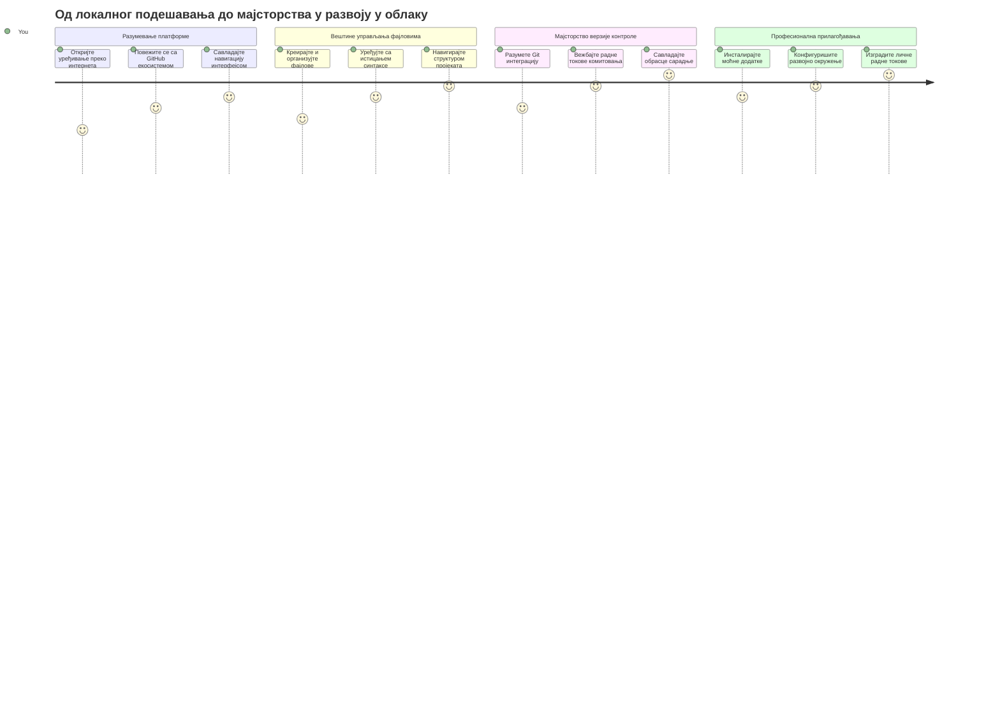
**Циљ вашег пута**: На крају овог часа, савладаћете професионално окружење за развој у облаку које ради са било ког уређаја, омогућавајући вам да програмирате са истим алатима које користе програмери највећих технолошких компанија.

## Шта ћете научити

Након што заједно прођемо кроз ово, моћи ћете да:

- Користите VSCode.dev као свој други дом – да пронађете све што вам треба без губитка
- Отварате било који GitHub репозиторијум у прегледачу и одмах почнете са уређивањем (ово је помало магично!)
- Користите Git да пратите измене и снимате свој напредак као прави професионалац
- Учините свој уредник бољим уз екстензије које чине програмирање бржим и забавнијим
- Са самопоуздањем креирате и организујете фајлове једног пројекта

## Шта ће вам требати

Захтеви су једноставни:

- Бесплатан [GitHub налог](https://github.com) (помоћи ћемо вам са креирањем ако је потребно)
- Основно познавање веб прегледача
- Лекција GitHub Basics пружа корисну позадину, иако није неопходна

> 💡 **Нови сте на GitHub-у?** Креирање налога је бесплатно и траје неколико минута. Као што библиотечка картица омогућава приступ књигама широм света, тако и GitHub налог отвара врата код репозиторијума широм интернета.

## 🧠 Преглед Екосистема Развоја у Облаку

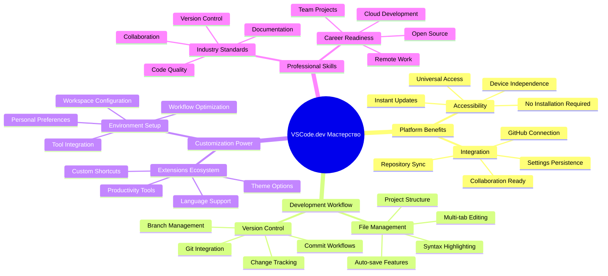
**Основни принцип**: Окружења за развој у облаку представљају будућност програмирања – пружају професионалне алате који су приступачни, колаборативни и независни од платформе.

## Зашто су Веб Базирани Уредници Кода Важни

Пре интернета, научници на разним универзитетима нису могле лако да деле своја истраживања. Затим је 1960-их настао ARPANET, повезујући рачунаре на даљину. Веб базирани уредници кода следе исти принцип – омогућавају моћне алате без обзира на физичку локацију или уређај.

Уредник кода служи као ваше радно место за развој, где пишете, уређујете и организујете кодне фајлове. За разлику од обичних текстуалних уредника, професионални уредници кода пружају истицање синтаксе, откривање грешака и функције управљања пројектом.

VSCode.dev доноси ове могућности у ваш прегледач:

**Предности уређивања у браузеру:**

| Карактеристика           | Опис                              | Практична корист             |
|--------------------------|----------------------------------|-----------------------------|
| **Независност од платформе** | Ради на сваком уређају са прегледачем | Радите са различитих рачунара без прекида |
| **Нема потребе за инсталацијом** | Приступ преко веб URL-а           | Избегава ограничења инсталације софтвера |
| **Аутоматска ажурирања** | Увек ради најновија верзија       | Имплементација нових функција без ручне интервенције |
| **Интеграција са репозиторијумима** | Директно повезивање са GitHub-ом | Уређујте код без локалног управљања фајловима |

**Практичне импликације:**
- Континуитет рада у различитим окружењима
- Конзистентно корисничко сучеље без обзира на оперативни систем
- Одмах доступне могућности за сарадњу
- Смањене потребе за локалном меморијом

## Истражујући VSCode.dev

Баш као што је лабораторија Марије Кири садржала напредну опрему у релативно једноставном простору, тако VSCode.dev пакује професионалне алате за развој у интерфејс прегледача. Ова веб апликација пружа исту основну функционалност као и уредници за радну површину.

Почните тако што ћете отићи на [vscode.dev](https://vscode.dev) у свом прегледачу. Интерфејс се учитава без преузимања или системских инсталација – директна примена принципа облачног рачунарства.

### Повезивање вашег GitHub налога

Као што је телефон Александра Грахама Белла повезао удаљена места, повезивање вашег GitHub налога повезује VSCode.dev са вашим кодним репозиторијумима. Када вам буде затражено да се пријавите помоћу GitHub налога, препоручује се да прихватите ту везу.

**GitHub интеграција пружа:**
- Директан приступ вашим репозиторијумима у оквиру уредника
- Синхронизована подешавања и екстензије на свим уређајима
- Поједностављен радни ток снимања на GitHub
- Персонализовано радно окружење

### Упознавање са вашим новим радним простором

Када се све учита, видећете прелепо чист радни простор дизајниран да вас држи фокусираним на оно што је важно – ваш код!

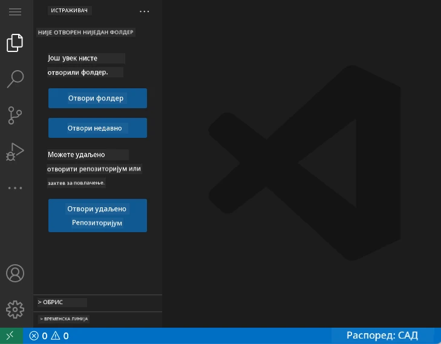

**Ево обиласка околине:**
- **Трака активности** (она трака са леве стране): Ваш главни навигациони мени са Explorer 📁, Претрага 🔍, Source Control 🌿, Екстензије 🧩 и Подешавања ⚙️
- **Бочни панел** (панел поред ње): Приказује релевантне информације у зависности од избора
- **Радни простор уредника** (велики простор у средини): Овде се дешава магија – ваш главни простор за програмирање

**Одвојите тренутак да истражите:**
- Кликните на иконе на Траци активности и видите шта свака ради
- Запазите како се бочни панел ажурира да покаже различите информације – лепо, зар не?
- Преглед Explorer (📁) ће вероватно бити место где ћете провести највише времена, зато се упознајте с њим

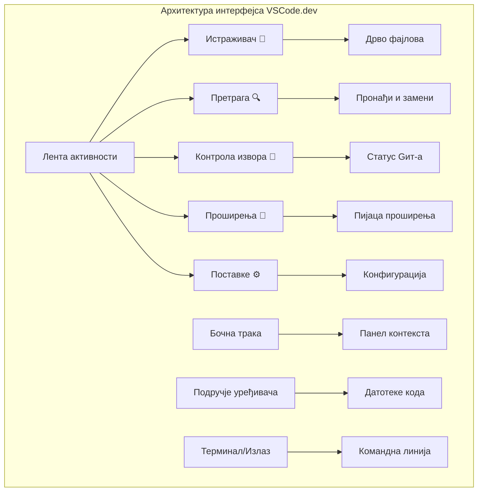
## Отварање GitHub репозиторијума

Пре интернета, истраживачи су морали физички да иду у библиотеке ради приступа документима. GitHub репозиторијуми делују слично – то су колекције кода смештене удаљено. VSCode.dev елиминише традиционални корак преузимања репозиторијума на локални рачунар пре уређивања.

Ова могућност омогућава тренутан приступ било ком јавном репозиторијуму за преглед, уређивање или допринос. Ево два начина за отварање репозиторијума:

### Начин 1: Клик-на-поинт

Ово је савршено када тек почињете у VSCode.dev и желите да отворите одређени репозиторијум. Једноставно и погодније за почетнике:

**Ево како:**

1. Идите на [vscode.dev](https://vscode.dev) ако већ нисте тамо
2. Потражите дугме „Open Remote Repository“ на почетном екрану и кликните на њега

   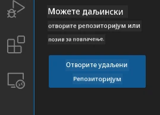

3. Убаците било који URL GitHub репозиторијума (пробајте ово: `https://github.com/microsoft/Web-Dev-For-Beginners`)
4. Притисните Enter и гледајте како магија почиње!

**Про савет - Пречица за Command Palette:**

Желите да изгледате као мајстор кодирања? Испробајте ову пречицу: Ctrl+Shift+P (или Cmd+Shift+P на Mac) да отворите Command Palette:

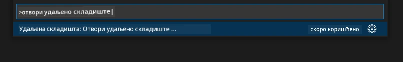

**Command Palette је као претраживач за све што можете да урадите:**
- Откуцајте „open remote“ и пронаћи ће опцију за отварање репозиторијума
- Памти недавно отворене репозиторијуме (врло практично!)
- Када се навикнете, осећаћете се као да програмирате светлосном брзином
- Ово је практично VSCode.dev верзија „Хеј Сири“, али за програмирање

### Начин 2: Техника измене URL-а

Баш као што HTTP и HTTPS користе различите протоколе, али задржавају исту доменску структуру, VSCode.dev користи образац URL-а који огледа систем адресирања GitHub-а. Било који GitHub репозиторијум URL може се изменити да би се директно отворио у VSCode.dev.

**Образац трансформације URL-а:**

| Тип репозиторијума | GitHub URL | VSCode.dev URL |
|--------------------|---------------------|----------------|
| **Јавни репозиторијум** | `github.com/microsoft/Web-Dev-For-Beginners` | `vscode.dev/github/microsoft/Web-Dev-For-Beginners` |
| **Приватни пројекат** | `github.com/your-username/my-project` | `vscode.dev/github/your-username/my-project` |
| **Било који приступачан репо** | `github.com/their-username/awesome-repo` | `vscode.dev/github/their-username/awesome-repo` |

**Како то ради:**
- Замените `github.com` са `vscode.dev/github`
- Све остале делове URL-а оставите непромењене
- Ради са било којим јавним репозиторијумом
- Омогућава тренутно уређивање

> 💡 **Савет који мења живот**: Убаците у обележиваче VSCode.dev верзије ваших омиљених репозиторијума. Ја имам обележиваче као што су „Edit My Portfolio“ и „Fix Documentation“ који ме одмах воде у режим уређивања!

**Који начин да изаберете?**
- **Интерфејс начин**: Одличан када прелиставате или не памтите тачно име репозиторијума
- **Трик са URL-ом**: Савршен за светлосно брз приступ када тачно знате куда идете

### 🎯 Педагошки чек: Приступ развоју у облаку

**Станите на тренутак и размислите**: Управо сте научили два начина приступа код репозиторијумима кроз веб прегледач. Ово представља темељну промену у начину рада развоја.

**Брза самопроцена**:
- Можете ли објаснити зашто веб-базирано уређивање елиминише традиционално „постављање развојног окружења“?
- Које предности техника измене URL-а нуди у односу на локално клонирање git-ом?
- Како овај приступ мења начин на који можете доприносити пројектима отвореног кода?

**Веза са стварним светом**: Велике компаније као што су GitHub, GitLab и Replit изграђене су око ових cloud-first принципа. Учите исте радне токове које користе професионални тимови за развој широм света.

**Изазовно питање**: Како ће развој у облаку променити начин на који се програмирање учи у школама? Разматрајте захтеве уређаја, управљање софтвером и могућности сарадње.

## Рад са фајловима и пројектима

Са отвореним репозиторијумом, кренимо са израдом! VSCode.dev пружа све што вам треба да креирате, уређујете и организујете своје кодне фајлове. Замислите га као вашу дигиталну радионицу – сваки алат је на правом месту.

Погледајмо свакодневне задатке који ће чинити већину вашег радног тока програмирања.

### Креирање нових фајлова

Као што архитекта организује цртеже у свом заводу, креирање фајлова у VSCode.dev прати структуиран приступ. Систем подржава све стандардне типове веб развојних фајлова.

**Процес креирања фајла:**

1. Идите до циљне фасцикле у бочном Explorer панелу
2. Прелазите мишем преко имена фасцикле да бисте видели иконицу „New File“ (📄+)
3. Унесите име фајла са одговарајућом екстензијом (`style.css`, `script.js`, `index.html`)
4. Притисните Enter да бисте креирали фајл

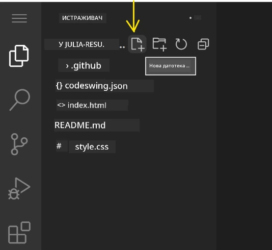

**Правила именовања:**
- Користите описна имена која показују сврху фајла
- Укључите екстензије ради исправног истицања синтаксе
- Пратите конзистентне обрасце именовања кроз пројекте
- Користите мале слове и цртице уместо размакâ

### Уређивање и чување фајлова

Овде почиње права забава! VSCode.dev уредник је препун корисних функција које чине програмирање глатким и интуитивним. Као да имате паметног асистента за писање, али за код.

**Ваш радни ток уређивања:**

1. Кликните на било који фајл у Explorer-у да га отворите у главном простору
2. Почните да куцате и гледајте како вам VSCode.dev помаже бојама, предлозима и уочавањем грешака
3. Сачувајте рад са Ctrl+S (Windows/Linux) или Cmd+S (Mac) – иако се аутоматски чува!

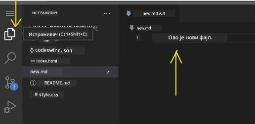

**Фантастичне ствари које се дешавају док куцате:**
- Ваш код је прелепо обојен тако да се лако чита
- VSCode.dev предлаже допуне као аутокорекцију, али знатно паметније
- Уочава штампарске грешке пре него што сачувате
- Можете имати више отворених фајлова у картицама, као у прегледачу
- Све се аутоматски чува у позадини

> ⚠️ **Брзи савет**: Иако аутоматско чување ради за вас, навика да притиснете Ctrl+S или Cmd+S је добра. Одмах чува све и покреће додатне корисне функције као што је провера грешака.

### Контрола верзија са Git-ом

Као што археолози праве детаљне записе о слојевима ископавања, Git прати измене вашег кода током времена. Овај систем чува историју пројекта и омогућава вам да се вратите на претходне верзије по потреби. VSCode.dev има интегрисану Git функционалност.

**Интерфејс Source Control:**

1. Приступите панелу Source Control преко иконе 🌿 на Траци активности
2. Модификовани фајлови се приказују у одељку „Changes“
3. Боје означавају врсту измена: зелена за додатке, црвена за брисање

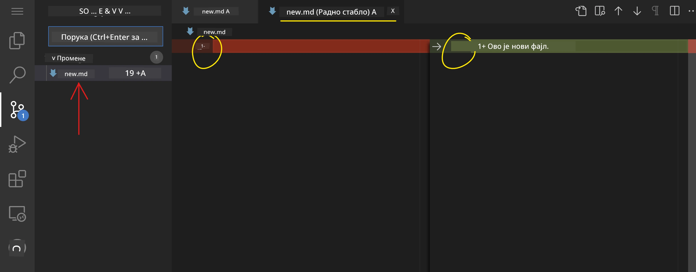

**Чување рада (радни ток комита):**

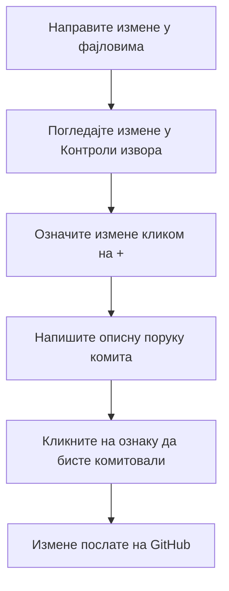
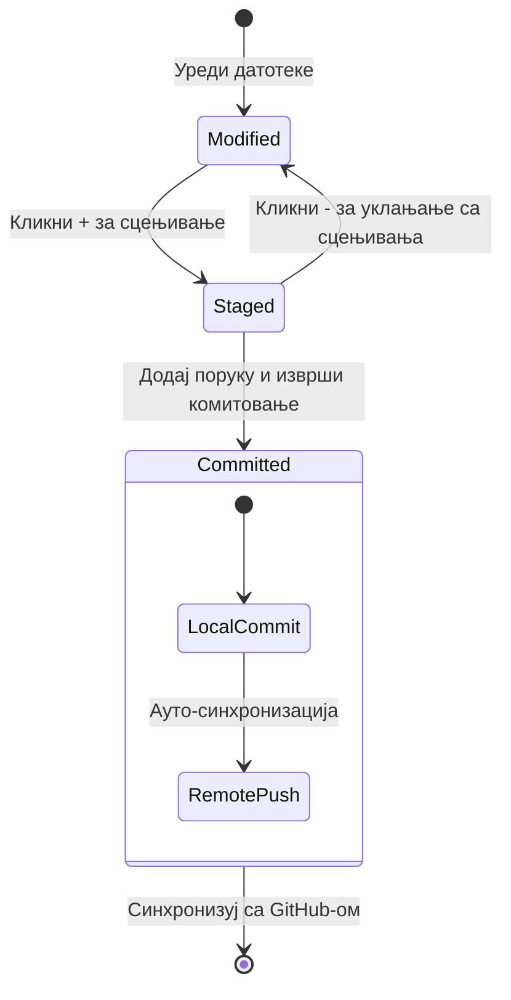
**Ево корак по корак:**
- Кликните икону „+“ поред фајлова које желите да сачувате (овиме их „стежете“)
- Дупло проверите да ли сте задовољни свим својим припремљеним изменама
- Напишите кратку белешку која објашњава шта сте урадили (ово је ваша „порука комита“)
- Кликните на дугме са квачицом да сачувате све на GitHub
- Ако промените мишљење о нечему, икона за опоравак вам омогућава да одбаците измене

**Писање добрих комит порука (ово је лакше него што мислите!):**
- Само опишите шта сте урадили, као „Додај контакт форму“ или „Поправи покварену навигацију“
- Држите то кратко и јасно – као дужина твита, а не есеја
- Почните са глаголима као што су „Додај“, „Поправи“, „Ажурирај“ или „Уклони“
- **Добри примери**: „Додај респонзивни навигациони мени“, „Поправи проблеме са мобилним изгледом“, „Ажурирај боје за бољу приступачност“

> 💡 **Брзи савет за навигацију**: Користите хамбургер мени (☰) у горњем левом углу да се вратите до свог GitHub репозиторијума и видите своје комитоване измене онлајн. То је као портал између вашег уређивачког окружења и домаћина вашег пројекта на GitHub-у!

## Побољшање функционалности путем екстензија

Као што радионица мајстора садржи специјализоване алате за различите задатке, тако се VSCode.dev може прилагодити екстензијама које додају специфичне могућности. Ови додатаци које развија заједница одговарају уобичајеним потребама развоја као што су форматирање кода, преглед у реалном времену и напредна Git интеграција.

Marketplace екстензија садржи хиљаде бесплатних алата које су направили програмери широм света. Свака екстензија решава одређене изазове у раду, омогућавајући вам да направите персонализовано развојно окружење које одговара вашим конкретним потребама и преференцама.

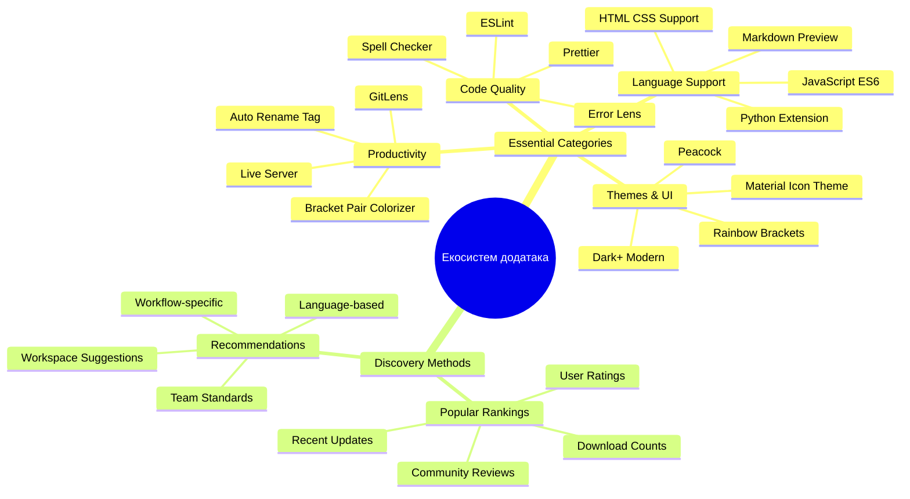
### Проналажење савршених екстензија

Marketplace екстензија је изузетно добро организован, па се нећете изгубити док тражите оно што вам је потребно. Дизајниран је да вам помогне да откријете и специфичне алате и кул ствари за које нисте ни знали да постоје!

**Како доћи до marketplace-а:**

1. Кликните на иконицу Екстензија (🧩) у Activity Bar-у
2. Прегледајте или претражујте нешто конкретно
3. Кликните на нешто што вам изгледа занимљиво да сазнате више

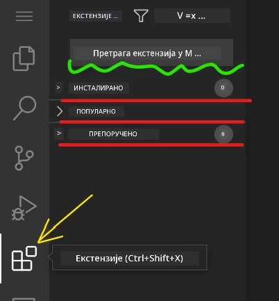

**Шта ћете видети тамо:**

| Одељак | Шта садржи | Зашто је корисно |
|----------|---------|----------|
| **Инсталиране** | Екстензије које сте већ додали | Ваш лични сет алата за кодирање |
| **Популарне** | Омиле свим корисницима | Оне које највише програмирача користи |
| **Препоручене** | Паметни предлози за ваш пројекат | Корисне препоруке VSCode.dev-а |

**Шта олакшава прегледање:**
- Свака екстензија приказује оцене, број прегледа и стварне корисничке рецензије
- Добијате снимке екрана и јасне описе шта свака ради
- Све је јасно означено са информацијама о компатибилности
- Сличне екстензије су предложене да бисте упоредили опције

### Инсталирање екстензија (врло је једноставно!)

Додавање нових могућности вашем уређивачу је као кликовање на дугме. Екстензије се инсталирају за неколико секунди и одмах почињу да функционишу – без рестартовања, без чекања.

**Ево шта треба да урадите:**

1. Потражите оно што желите (пробајте „live server“ или „prettier“)
2. Кликните на ону која вам делује добро да видите детаље
3. Прочитајте шта ради и проверите оцене
4. Притисните плаво дугме „Install“ и готови сте!


**Шта се дешава у позадини:**
- Екстензија се аутоматски преузима и подешава
- Нове функције одмах постају видљиве у интерфејсу
- Све почне да ради одмах (озбиљно, тако је брзо!)
- Ако сте пријављени, екстензија се синхронизује на свим вашим уређајима

**Неке екстензије које бих вам препоручио да почнете са њима:**
- **Live Server**: Погледајте како се ваша веб-страница освежава у реалном времену док кодете (ово је чаробно!)
- **Prettier**: Аутоматски чисти и професионално форматира ваш код
- **Auto Rename Tag**: Промена једног HTML тега аутоматски мења и његов пар
- **Bracket Pair Colorizer**: Бојом означава заграде да се никада не изгубите
- **GitLens**: Побољшава Git могућности са мноштвом корисних информација

### Прилагођавање ваших екстензија

Већина екстензија долази са подешавањима која можете мењати да бисте их учинили управо онаквим какве желите. Замислите то као подешавање седишта и ретровизора у аутомобилу – свако има своје преференције!

**Подешавање екстензија:**

1. Пронађите инсталирану екстензију у панелу Екстензија
2. Потражите малу икону зупчаника (⚙️) поред имена и кликните на њу
3. Изаберите „Extension Settings“ из падајућег менија
4. Подесите опције док не осетите да вам одговара за рад

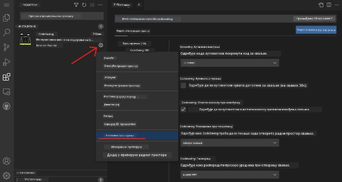

**Уобичајене ствари које можете желети да подесите:**
- Како се ваш код форматира (табови уместо размаке, дужина линије, итд.)
- Које тастатурне пречице активирају одређене акције
- Са којим типовима фајлова екстензија треба да ради
- Укључивање или искључивање специфичних функција ради јасноће

### Одржавање ваше колекције екстензија организованом

Док откривате све више кул екстензија, желећете да их држите уредним и да све добро ради. VSCode.dev ово веома лако омогућава.

**Опције за управљање екстензијама:**

| Шта можете урадити | Када је корисно | Про савет |
|--------|---------|----------|
| **Онемогући** | Тестирање да ли екстензија узрокује проблеме | Боље од деинсталације ако можда желите касније назад |
| **Деинсталирај** | Потпуно уклањање екстензија које не користите | Чува ваше окружење чистим и брзим |
| **Ажурирај** | Добијање најновијих функција и исправки | Обично се дешава аутоматски, али вреди проверити |

**Како ја волим да управљам екстензијама:**
- Сваких неколико месеци прегледам шта сам инсталирао и уклањам оно што не користим
- Држим екстензије ажурним да бих имао најновија побољшања и безбедносне исправке
- Ако нешто делује споро, привремено онемогућим екстензије да видим да ли је то узрок
- Читам напомене о ажурирањима када екстензије добију велике надоградње – понекад имају кул нове функције!

> ⚠️ **Савет за перформансе**: Екстензије су одличне, али превише њих може успорити систем. Фокусирајте се на оне које вам заиста олакшавају живот и не бојте се да уклоните оне које никада не користите.

### 🎯 Педагошки пресек: Прилагођавање развојног окружења

**Разумевање архитектуре**: Научили сте како да прилагодите професионално развојно окружење коришћењем екстензија које је направила заједница. Ово одражава начин на који корпоративни тимови граде стандардизоване алате.

**Кључни концепти које сте савладали**:
- **Проналажење екстензија**: Откривање алата који решавају конкретне изазове развоја
- **Конфигурисање окружења**: Прилагођавање алата преференцама појединца или тима
- **Оптимизација перформанси**: Баланс између могућности и перформанси система
- **Сарадња заједнице**: Коришћење алата које је креирала глобална заједница програмера

**Индустријска веза**: Екосистеми екстензија покрећу велике развојне платформе попут VS Code, Chrome DevTools и модерних IDE алата. Разумевање како оцењивати, инсталирати и конфигурисати екстензије је кључно за професионалне развојне токове рада.

**Питање за размишљање**: Како бисте приступили подешавању стандардизованог развојног окружења за тим од 10 програмера? Размотрите доследност, перформансе и индивидуалне преференце.

## 📈 Ваш временски оквир савладавања развоја у облаку

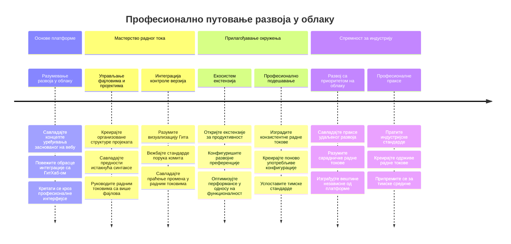
**🎓 Важан корак дипломирања**: Успешно сте савладали развој у облаку користећи исте алате и радне токове које употребљавају професионални програмери у водећим технолошким компанијама. Ове вештине представљају будућност развоја софтвера.

**🔄 Следећи ниво могућности**:
- Спремни да истражите напредне cloud development платформе (Codespaces, GitPod)
- Припремљени за рад у расподељеним развојним тимовима
- Опремљени за допринос open source пројектима широм света
- Основе постављене за модерне DevOps и праксе континуиране интеграције

## GitHub Copilot Agent изазов 🚀

Као што NASA користи структуриран приступ за свемирске мисије, овај изазов укључује систематску примену вештина VSCode.dev у комплетном сценарију рада.

**Циљ:** Покажите вештину рада са VSCode.dev тако што ћете формирати свеобухватан веб развојни радни ток.

**Захтеви пројекта:** Уз помоћ агент режима, урадите следеће:
1. Форкујте постојећи репозиторијум или направите нови
2. Формирајте функционалну структуру пројекта са HTML, CSS и JavaScript фајловима
3. Инсталирајте и конфигуришите три екстензије које унапређују развој
4. Вежбајте контролу верзија са описним комит порукама
5. Испробајте креирање и модификацију фичер грана
6. Документовати процес и научено у README.md фајлу

Ова вежба консолидује све VSCode.dev концепте у практични радни ток који можете применити у будућим пројектима.

Сазнајте више о [agent mode](https://code.visualstudio.com/blogs/2025/02/24/introducing-copilot-agent-mode) овде.

## Задатак

Време је да ове вештине ставите на прави тест! Имам практичан пројекат који ће вам омогућити да вежбате све што смо прошли: [Креирајте веб сајт за резиме користећи VSCode.dev](./assignment.md)

Овај задатак ће вас провести кроз прављење професионалног веб сајта за резиме у потпуности у вашем прегледачу. Користићете све функције VSCode.dev-а које смо истражили, а на крају ћете имати и сјајан сајт и чврсто поверење у свој нови радни ток.

## Наставите да истражујете и развијате своје вештине

Сада имате солидну основу, али има још много кул ствари које треба открити! Ево неких ресурса и идеја за унапређење ваших VSCode.dev вештина:

**Званична документација коју вреди оставити у фаворитима:**
- [VSCode Web Documentation](https://code.visualstudio.com/docs/editor/vscode-web?WT.mc_id=academic-0000-alfredodeza) – Потпуни водич за уређивање у прегледачу
- [GitHub Codespaces](https://docs.github.com/en/codespaces) – За када желите још већу снагу у облаку

**Кул функције за следећу пробу:**
- **Тастатурне пречице**: Научите комбинције тастера које ће вас учинити кодирајућим нинџом
- **Подешавања радног простора**: Поставите различита окружења за различите врсте пројеката
- **Workspace са више корена**: Ради на више репозиторијума истовремено (врло корисно!)
- **Интеграција терминала**: Приступите командној линији директно у прегледачу

**Идеје за вежбање:**
- Укључите се у неке open-source пројекте и допринесите користећи VSCode.dev – одличан начин да узвратите!
- Испробајте различите екстензије да пронађете своју идеалну конфигурацију
- Креирајте шаблоне пројеката за типове сајтова на којима најчешће радите
- Вежбајте Git радне токове попут гранања и спајања – ове вештине су прави златни фонд за тимске пројекте

---

**Савладали сте развој у прегледачу!** 🎉 Као што је изум преносивих инструмената омогућио научницима да истражују удаљене локалитете, VSCode.dev вам омогућава професионално кодирање са било ког уређаја повезаног на интернет.

Ове вештине одражавају савремену индустријску праксу – многи професионални програмирачи користе развојна окружења у облаку због флексибилности и приступачности. Научили сте радни ток који се може применити од индивидуалних пројеката до великих тимских сарадњи.

Примените ове технике у свом следећем развојном пројекту! 🚀

---

<!-- CO-OP TRANSLATOR DISCLAIMER START -->
**Изјава о одрицању одговорности**:  
Овај документ је преведен помоћу АИ преводилачке услуге [Co-op Translator](https://github.com/Azure/co-op-translator). Иако се трудимо да превод буде тачан, молимо вас да имате у виду да аутоматизовани преводи могу садржати грешке или нетачности. Оригинални документ на његовом изворном језику треба сматрати ауторитетним извором. За критичне информације препоручује се професионални људски превод. Нисмо одговорни за било каква неспоразума или погрешна тумачења настала коришћењем овог превода.
<!-- CO-OP TRANSLATOR DISCLAIMER END -->