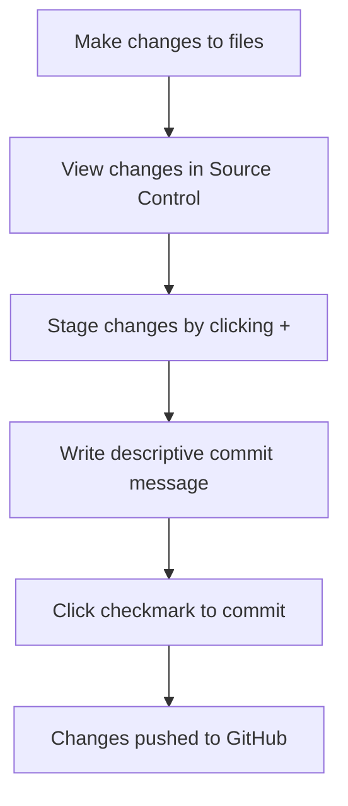

<!--
CO_OP_TRANSLATOR_METADATA:
{
  "original_hash": "cfd4a15974168ca426d50c67682ab9d4",
  "translation_date": "2025-10-24T23:04:50+00:00",
  "source_file": "8-code-editor/1-using-a-code-editor/README.md",
  "language_code": "sr"
}
-->
# Korisćenje uređivača koda: Savladavanje VSCode.dev-a

Sećate li se u *Matriksu* kada je Neo morao da se poveže na ogroman kompjuterski terminal kako bi pristupio digitalnom svetu? Današnji alati za veb razvoj su potpuno suprotni – neverovatno moćne mogućnosti dostupne sa bilo kog mesta. VSCode.dev je uređivač koda zasnovan na pretraživaču koji donosi profesionalne alate za razvoj na bilo koji uređaj sa internet vezom.

Baš kao što je štamparska presa učinila knjige dostupnim svima, a ne samo pisarima u manastirima, VSCode.dev demokratizuje kodiranje. Možete raditi na projektima sa računara u biblioteci, školskom laboratorijumu ili bilo gde gde imate pristup pretraživaču. Bez instalacija, bez ograničenja tipa "treba mi moj specifičan setup".

Na kraju ove lekcije, razumećete kako da se krećete kroz VSCode.dev, direktno otvarate GitHub repozitorijume u pretraživaču i koristite Git za kontrolu verzija – sve veštine na koje se profesionalni programeri oslanjaju svakodnevno.

## Šta ćete naučiti

Nakon što prođemo kroz ovo zajedno, moći ćete:

- Navigirati kroz VSCode.dev kao da je vaš drugi dom – pronalazeći sve što vam treba bez gubljenja
- Otvoriti bilo koji GitHub repozitorijum u pretraživaču i odmah početi sa uređivanjem (ovo je prilično magično!)
- Koristiti Git za praćenje promena i čuvanje napretka kao profesionalac
- Poboljšati svoj uređivač ekstenzijama koje čine kodiranje bržim i zabavnijim
- Kreirati i organizovati projektne fajlove sa samopouzdanjem

## Šta vam je potrebno

Zahtevi su jednostavni:

- Besplatan [GitHub nalog](https://github.com) (vodimo vas kroz proces kreiranja ako je potrebno)
- Osnovno poznavanje veb pretraživača
- Lekcija o osnovama GitHub-a pruža korisnu pozadinu, iako nije neophodna

> 💡 **Novi ste na GitHub-u?** Kreiranje naloga je besplatno i traje nekoliko minuta. Kao što vam bibliotečka kartica omogućava pristup knjigama širom sveta, GitHub nalog otvara vrata ka repozitorijumima koda na internetu.

## Zašto su uređivači koda zasnovani na vebu važni

Pre interneta, naučnici na različitim univerzitetima nisu mogli lako da dele istraživanja. Zatim je došao ARPANET 1960-ih, povezujući računare na daljinu. Uređivači koda zasnovani na vebu slede isti princip – čineći moćne alate dostupnim bez obzira na vašu fizičku lokaciju ili uređaj.

Uređivač koda služi kao vaš radni prostor za razvoj, gde pišete, uređujete i organizujete fajlove koda. Za razliku od jednostavnih uređivača teksta, profesionalni uređivači koda pružaju isticanje sintakse, detekciju grešaka i funkcije za upravljanje projektima.

VSCode.dev donosi ove mogućnosti u vaš pretraživač:

**Prednosti uređivanja na vebu:**

| Funkcija | Opis | Praktična korist |
|---------|-------------|----------|
| **Nezavisnost platforme** | Radi na bilo kom uređaju sa pretraživačem | Rad sa različitih računara bez problema |
| **Bez potrebne instalacije** | Pristup putem veb URL-a | Zaobilazi ograničenja instalacije softvera |
| **Automatska ažuriranja** | Uvek radi na najnovijoj verziji | Pristup novim funkcijama bez ručnih ažuriranja |
| **Integracija sa repozitorijumima** | Direktna veza sa GitHub-om | Uređivanje koda bez lokalnog upravljanja fajlovima |

**Praktične implikacije:**
- Kontinuitet rada u različitim okruženjima
- Dosledan interfejs bez obzira na operativni sistem
- Mogućnosti za trenutnu saradnju
- Smanjeni zahtevi za lokalno skladištenje

## Istraživanje VSCode.dev-a

Baš kao što je laboratorija Marije Kiri sadržala sofisticiranu opremu u relativno jednostavnom prostoru, VSCode.dev spaja profesionalne alate za razvoj u interfejs pretraživača. Ova veb aplikacija pruža iste osnovne funkcionalnosti kao i desktop uređivači koda.

Počnite tako što ćete otići na [vscode.dev](https://vscode.dev) u svom pretraživaču. Interfejs se učitava bez preuzimanja ili instalacije sistema – direktna primena principa cloud computing-a.

### Povezivanje vašeg GitHub naloga

Kao što je telefon Aleksandra Grejema Bela povezivao udaljene lokacije, povezivanje vašeg GitHub naloga spaja VSCode.dev sa vašim repozitorijumima koda. Kada se od vas zatraži da se prijavite na GitHub, preporučuje se da prihvatite ovu vezu.

**Integracija sa GitHub-om pruža:**
- Direktan pristup vašim repozitorijumima unutar uređivača
- Sinhronizovane postavke i ekstenzije na različitim uređajima
- Pojednostavljen proces čuvanja na GitHub-u
- Personalizovano razvojno okruženje

### Upoznavanje sa novim radnim prostorom

Kada se sve učita, videćete prelepo čist radni prostor koji je dizajniran da vas fokusira na ono što je važno – vaš kod!

**Evo ture kroz vaš novi prostor:**
- **Traka aktivnosti** (ona traka sa leve strane): Vaša glavna navigacija sa Explorer 📁, Pretraga 🔍, Kontrola izvora 🌿, Ekstenzije 🧩 i Postavke ⚙️
- **Bočna traka** (panel pored nje): Menja se kako bi vam prikazala relevantne informacije na osnovu onoga što ste izabrali
- **Prostor za uređivanje** (veliki prostor u sredini): Ovde se dešava magija – vaš glavni prostor za kodiranje

**Odvojite trenutak da istražite:**
- Kliknite na ikone na traci aktivnosti i pogledajte šta svaka radi
- Primetite kako se bočna traka ažurira da prikaže različite informacije – prilično zgodno, zar ne?
- Pregled Explorer-a (📁) je verovatno mesto gde ćete provoditi najviše vremena, pa se udobno smestite

## Otvaranje GitHub repozitorijuma

Pre interneta, istraživači su morali fizički da putuju do biblioteka kako bi pristupili dokumentima. GitHub repozitorijumi funkcionišu slično – to su kolekcije koda koje se čuvaju na daljinu. VSCode.dev eliminiše tradicionalni korak preuzimanja repozitorijuma na lokalni računar pre uređivanja.

Ova mogućnost omogućava trenutni pristup bilo kom javnom repozitorijumu za pregled, uređivanje ili doprinos. Evo dva načina za otvaranje repozitorijuma:

### Metod 1: Klikni i otvori

Ovo je savršeno kada počinjete od nule u VSCode.dev-u i želite da otvorite određeni repozitorijum. Jednostavno je i pogodno za početnike:

**Kako to uraditi:**

1. Idite na [vscode.dev](https://vscode.dev) ako već niste tamo
2. Potražite dugme "Open Remote Repository" na početnom ekranu i kliknite na njega
3. Nalepite URL bilo kog GitHub repozitorijuma (probajte ovaj: `https://github.com/microsoft/Web-Dev-For-Beginners`)
4. Pritisnite Enter i gledajte magiju!

**Pro saveti - Prečica za Command Palette:**

Želite da se osećate kao čarobnjak za kodiranje? Probajte ovu prečicu na tastaturi: Ctrl+Shift+P (ili Cmd+Shift+P na Mac-u) za otvaranje Command Palette:

**Command Palette je kao pretraživač za sve što možete da uradite:**
- Ukucajte "open remote" i pronaći će otvarač repozitorijuma za vas
- Pamti repozitorijume koje ste nedavno otvorili (super korisno!)
- Kada se naviknete na njega, osećaćete se kao da kodirate brzinom svetlosti
- To je u suštini VSCode.dev-ova verzija "Hej Siri, ali za kodiranje"

### Metod 2: Tehnika modifikacije URL-a

Kao što HTTP i HTTPS koriste različite protokole dok zadržavaju istu strukturu domena, VSCode.dev koristi obrazac URL-a koji odražava GitHub-ov sistem adresiranja. Bilo koji URL GitHub repozitorijuma može se modifikovati da se direktno otvori u VSCode.dev-u.

**Obrazac transformacije URL-a:**

| Tip repozitorijuma | GitHub URL | VSCode.dev URL |
|----------------|---------------------|----------------|
| **Javni repozitorijum** | `github.com/microsoft/Web-Dev-For-Beginners` | `vscode.dev/github/microsoft/Web-Dev-For-Beginners` |
| **Lični projekat** | `github.com/your-username/my-project` | `vscode.dev/github/your-username/my-project` |
| **Bilo koji dostupni repo** | `github.com/their-username/awesome-repo` | `vscode.dev/github/their-username/awesome-repo` |

**Implementacija:**
- Zamenite `github.com` sa `vscode.dev/github`
- Zadržite sve ostale komponente URL-a nepromenjene
- Radi sa bilo kojim javno dostupnim repozitorijumom
- Omogućava trenutni pristup za uređivanje

> 💡 **Savršen savet**: Dodajte u obeleživače VSCode.dev verzije vaših omiljenih repozitorijuma. Ja imam obeleživače poput "Uredi moj portfolio" i "Ispravi dokumentaciju" koji me direktno vode u režim uređivanja!

**Koji metod treba da koristite?**
- **Interfejs način**: Odličan kada istražujete ili ne možete da se setite tačnih imena repozitorijuma
- **URL trik**: Savršen za munjevito brz pristup kada tačno znate gde idete

## Rad sa fajlovima i projektima

Sada kada ste otvorili repozitorijum, hajde da počnemo sa radom! VSCode.dev vam pruža sve što vam je potrebno za kreiranje, uređivanje i organizovanje fajlova koda. Zamislite ga kao svoju digitalnu radionicu – svaki alat je tačno tamo gde vam treba.

Hajde da zaronimo u svakodnevne zadatke koji će činiti većinu vašeg radnog toka kodiranja.

### Kreiranje novih fajlova

Kao organizovanje nacrta u kancelariji arhitekte, kreiranje fajlova u VSCode.dev-u prati strukturiran pristup. Sistem podržava sve standardne tipove fajlova za veb razvoj.

**Proces kreiranja fajlova:**

1. Idite do ciljanog foldera u bočnoj traci Explorer-a
2. Pređite mišem preko imena foldera da biste otkrili ikonu "New File" (📄+)
3. Unesite ime fajla uključujući odgovarajući ekstenziju (`style.css`, `script.js`, `index.html`)
4. Pritisnite Enter da biste kreirali fajl

**Konvencije za imenovanje:**
- Koristite opisna imena koja ukazuju na svrhu fajla
- Uključite ekstenzije fajlova za pravilno isticanje sintakse
- Pratite dosledne obrasce imenovanja kroz projekte
- Koristite mala slova i crtice umesto razmaka

### Uređivanje i čuvanje fajlova

Ovde počinje prava zabava! Uređivač VSCode.dev-a je prepun korisnih funkcija koje čine kodiranje glatkim i intuitivnim. To je kao da imate zaista pametnog asistenta za pisanje, ali za kod.

**Vaš radni tok uređivanja:**

1. Kliknite na bilo koji fajl u Explorer-u da biste ga otvorili u glavnom prostoru
2. Počnite da kucate i gledajte kako vam VSCode.dev pomaže sa bojama, sugestijama i otkrivanjem grešaka
3. Sačuvajte svoj rad sa Ctrl+S (Windows/Linux) ili Cmd+S (Mac) – iako se automatski čuva!

**Kul stvari koje se dešavaju dok kodirate:**
- Vaš kod se lepo obeležava bojama, pa je lakše za čitanje
- VSCode.dev predlaže dopune dok kucate (kao automatsko ispravljanje, ali mnogo pametnije)
- Hvata greške i tipografske greške pre nego što ih sačuvate
- Možete imati više otvorenih fajlova u karticama, baš kao u pretraživaču
- Sve se automatski čuva u pozadini

> ⚠️ **Brzi savet**: Iako automatsko čuvanje ima vašu podršku, pritiskanje Ctrl+S ili Cmd+S je i dalje dobra navika. Odmah čuva sve i pokreće neke dodatne korisne funkcije poput provere grešaka.

### Kontrola verzija sa Git-om

Kao što arheolozi prave detaljne zapise o slojevima iskopavanja, Git prati promene u vašem kodu tokom vremena. Ovaj sistem čuva istoriju projekta i omogućava vam da se vratite na prethodne verzije kada je to potrebno. VSCode.dev uključuje integrisanu funkcionalnost Git-a.

**Interfejs za kontrolu izvora:**

1. Pristupite panelu za kontrolu izvora putem ikone 🌿 na traci aktivnosti
2. Izmenjeni fajlovi se pojavljuju u sekciji "Changes"
3. Kodiranje bojama ukazuje na tipove promena: zeleno za dodatke, crveno za brisanja

**Čuvanje vašeg rada (proces commit-a):**

**Evo vašeg korak-po-korak procesa:**
- Kliknite na "+" ikonu pored fajlova koje želite da sačuvate (to ih "postavlja")
- Proverite da li ste zadovoljni svim postavljenim promenama
- Napišite kratku belešku koja objašnjava šta ste uradili (to je vaša "commit poruka")
- Kliknite na dugme sa kvačicom da biste sve sačuvali na GitHub-u
- Ako se predomislite oko nečega, ikona za poništavanje vam omogućava da odbacite promene

**Pisanje dobrih commit poruka (lakše je nego što mislite!):**
- Samo opišite šta ste uradili, kao "Dodaj kontakt formu" ili "Ispravi pokvarenu navigaciju"
- Neka bude kratko i jasno – mislite na dužinu tvita, ne eseja
- Počnite sa glagolima kao što su "Dodaj", "Ispravi", "Ažuriraj" ili "Ukloni"
- **Dobri primeri**: "Dodaj responzivni meni za navigaciju", "Ispravi probleme sa mobilnim izgledom", "Ažuriraj boje za bolju pristupačnost"

> 💡 **Brzi savet za navigaciju**: Koristite meni hamburger (☰) u gornjem levom uglu da se vratite na vaš GitHub repozitorijum i vidite svoje sačuvane promene online. To je kao portal između vašeg okruženja za uređivanje i matične stranice vašeg projekta na GitHub-u!

## Poboljšanje funkcionalnosti sa ekstenzijama

Baš kao što radionica zanatlije sadrži specijalizovane alate za različite zadatke, VSCode.dev se može prilagoditi ekstenzijama koje dodaju specifične funkcionalnosti. Ovi dodaci koje razvija zajednica rešavaju uobičajene izazove u razvoju, kao što su formatiranje koda, pregled uživo i poboljšana integracija sa Git-om.

Tržište ekstenzija sadrži hiljade besplatnih alata koje su kreirali programeri širom sveta. Svaka ekstenzija rešava određene izazove u radnom toku, omogućavajući vam da izgradite personalizovano razvojno okruženje prilagođeno vašim specifičnim potrebama i preferencijama.

### Pronalaženje savršenih ekstenzija

Tržište ekstenzija je zaista dobro organizovano, tako da se nećete izgubiti dok tražite ono što vam treba. Dizajnirano je da vam pomogne da otkrijete i specifične alate i zanimljive stvari za koje niste ni znali da postoje!

**Pristup tržištu:**

1. Kliknite na ikonu Ekstenzije (🧩) na traci aktivnosti
2. Pregledajte ili potražite nešto specifično
3. Kliknite na bilo šta što vam izgleda zanimljivo da saznate više o tome

**Šta ćete tamo videti:**

| Sekcija | Šta sadrži | Zašto je korisno |
|----------|---------|----------|
| **Instalirano** | Ekstenzije koje ste već dodali | Vaš lični alat za
- Svaka ekstenzija prikazuje ocene, broj preuzimanja i recenzije stvarnih korisnika
- Dobijate snimke ekrana i jasne opise šta svaka ekstenzija radi
- Sve je jasno označeno informacijama o kompatibilnosti
- Predložene su slične ekstenzije kako biste mogli da uporedite opcije

### Instaliranje ekstenzija (Veoma je lako!)

Dodavanje novih funkcija vašem editoru je jednostavno kao klik na dugme. Ekstenzije se instaliraju za nekoliko sekundi i odmah počinju da rade – bez ponovnog pokretanja, bez čekanja.

**Evo šta treba da uradite:**

1. Potražite ono što želite (probajte da pretražite "live server" ili "prettier")
2. Kliknite na onu koja vam se čini dobrom da biste videli više detalja
3. Pročitajte šta radi i proverite ocene
4. Kliknite na plavo dugme "Install" i gotovi ste!

**Šta se dešava iza kulisa:**
- Ekstenzija se automatski preuzima i podešava
- Nove funkcije se odmah pojavljuju u vašem interfejsu
- Sve počinje da radi odmah (ozbiljno, toliko je brzo!)
- Ako ste prijavljeni, ekstenzija se sinhronizuje na svim vašim uređajima

**Neke ekstenzije koje bih preporučio za početak:**
- **Live Server**: Gledajte kako se vaša veb stranica ažurira u realnom vremenu dok kodirate (ovo je magično!)
- **Prettier**: Automatski čini vaš kod čistim i profesionalnim
- **Auto Rename Tag**: Promenite jedan HTML tag i njegov partner se automatski ažurira
- **Bracket Pair Colorizer**: Obojava zagrade tako da se nikada ne izgubite
- **GitLens**: Poboljšava vaše Git funkcije sa mnoštvom korisnih informacija

### Prilagođavanje vaših ekstenzija

Većina ekstenzija dolazi sa podešavanjima koja možete prilagoditi kako bi radile tačno onako kako vi želite. Zamislite to kao podešavanje sedišta i ogledala u automobilu – svako ima svoje preferencije!

**Podešavanje ekstenzija:**

1. Pronađite instaliranu ekstenziju u panelu Ekstenzije
2. Potražite malu ikonicu zupčanika (⚙️) pored njenog imena i kliknite na nju
3. Izaberite "Extension Settings" iz padajućeg menija
4. Podesite opcije dok ne budu savršeno prilagođene vašem načinu rada

**Uobičajene stvari koje biste mogli da prilagodite:**
- Kako se vaš kod formatira (tabovi vs razmaci, dužina linije, itd.)
- Koje prečice na tastaturi pokreću različite akcije
- Sa kojim tipovima fajlova ekstenzija treba da radi
- Uključivanje ili isključivanje određenih funkcija radi preglednosti

### Organizovanje vaših ekstenzija

Kako budete otkrivali više zanimljivih ekstenzija, želećete da vaša kolekcija bude uredna i da radi glatko. VSCode.dev čini upravljanje ovim veoma jednostavnim.

**Opcije za upravljanje ekstenzijama:**

| Šta možete da uradite | Kada je korisno | Savet |
|--------|---------|----------|
| **Onemogući** | Kada testirate da li ekstenzija izaziva probleme | Bolje nego da je deinstalirate ako mislite da će vam ponovo trebati |
| **Deinstaliraj** | Potpuno uklanjanje ekstenzija koje vam nisu potrebne | Održava vaše okruženje čistim i brzim |
| **Ažuriraj** | Dobijanje najnovijih funkcija i ispravki grešaka | Obično se dešava automatski, ali vredi proveriti |

**Kako ja volim da upravljam ekstenzijama:**
- Svakih nekoliko meseci pregledam šta sam instalirao i uklonim sve što ne koristim
- Održavam ekstenzije ažuriranim kako bih dobio najnovija poboljšanja i sigurnosne ispravke
- Ako nešto deluje sporo, privremeno onemogućim ekstenzije da vidim da li je neka od njih uzrok
- Čitam beleške o ažuriranjima kada ekstenzije dobiju velike promene – ponekad ima sjajnih novih funkcija!

> ⚠️ **Saveti za performanse**: Ekstenzije su sjajne, ali previše njih može usporiti rad. Fokusirajte se na one koje vam zaista olakšavaju život i ne bojte se da deinstalirate one koje nikada ne koristite.

## Izazov sa GitHub Copilot Agent 🚀

Kao što NASA koristi strukturirani pristup za svemirske misije, ovaj izazov uključuje sistematsku primenu veština VSCode.dev u kompletnom radnom procesu.

**Cilj:** Pokažite veštinu u radu sa VSCode.dev uspostavljanjem sveobuhvatnog radnog procesa za veb razvoj.

**Zahtevi projekta:** Koristeći pomoć u Agent režimu, završite sledeće zadatke:
1. Forkujte postojeći repozitorijum ili kreirajte novi
2. Uspostavite funkcionalnu strukturu projekta sa HTML, CSS i JavaScript fajlovima
3. Instalirajte i konfigurišite tri ekstenzije koje poboljšavaju razvoj
4. Vežbajte kontrolu verzija sa opisnim porukama o izmenama
5. Eksperimentišite sa kreiranjem i modifikacijom grana za funkcije
6. Dokumentujte proces i naučene lekcije u README.md fajlu

Ova vežba konsoliduje sve VSCode.dev koncepte u praktičan radni proces koji se može primeniti na buduće projekte razvoja.

Saznajte više o [agent režimu](https://code.visualstudio.com/blogs/2025/02/24/introducing-copilot-agent-mode) ovde.

## Zadatak

Vreme je da ove veštine testirate u praksi! Imam praktičan projekat koji će vam omogućiti da vežbate sve što smo pokrili: [Kreirajte veb sajt za biografiju koristeći VSCode.dev](./assignment.md)

Ovaj zadatak vas vodi kroz proces izrade profesionalnog veb sajta za biografiju u potpunosti u vašem pretraživaču. Koristićete sve funkcije VSCode.dev koje smo istražili, a na kraju ćete imati i sjajan veb sajt i čvrsto samopouzdanje u vaš novi radni proces.

## Nastavite da istražujete i razvijate svoje veštine

Sada imate solidnu osnovu, ali postoji još mnogo sjajnih stvari koje možete otkriti! Evo nekoliko resursa i ideja za unapređenje vaših veština sa VSCode.dev:

**Zvanična dokumentacija koju vredi sačuvati:**
- [VSCode Web Dokumentacija](https://code.visualstudio.com/docs/editor/vscode-web?WT.mc_id=academic-0000-alfredodeza) – Kompletan vodič za uređivanje u pretraživaču
- [GitHub Codespaces](https://docs.github.com/en/codespaces) – Kada želite još više snage u oblaku

**Zanimljive funkcije za dalje istraživanje:**
- **Prečice na tastaturi**: Naučite kombinacije tastera koje će vas učiniti majstorom kodiranja
- **Podešavanja radnog prostora**: Postavite različita okruženja za različite vrste projekata
- **Radni prostori sa više korena**: Radite na više repozitorijuma istovremeno (veoma korisno!)
- **Integracija terminala**: Pristupite alatima komandne linije direktno u vašem pretraživaču

**Ideje za vežbanje:**
- Pridružite se nekim projektima otvorenog koda i doprinesite koristeći VSCode.dev – sjajan način da uzvratite zajednici!
- Isprobajte različite ekstenzije kako biste pronašli savršeno podešavanje
- Kreirajte šablone projekata za vrste sajtova koje najčešće pravite
- Vežbajte Git radne procese kao što su grananje i spajanje – ove veštine su zlata vredne u timskim projektima

---

**Savladali ste razvoj u pretraživaču!** 🎉 Kao što je izum prenosivih instrumenata omogućio naučnicima da sprovode istraživanja na udaljenim lokacijama, VSCode.dev omogućava profesionalno kodiranje sa bilo kog uređaja povezanog na internet.

Ove veštine odražavaju trenutne industrijske prakse – mnogi profesionalni programeri koriste okruženja za razvoj u oblaku zbog njihove fleksibilnosti i pristupačnosti. Naučili ste radni proces koji se može primeniti od individualnih projekata do velikih timskih saradnji.

Primenite ove tehnike na vašem sledećem projektu razvoja! 🚀

---

**Одрицање од одговорности**:  
Овај документ је преведен помоћу услуге за превођење вештачке интелигенције [Co-op Translator](https://github.com/Azure/co-op-translator). Иако настојимо да обезбедимо тачност, молимо вас да имате у виду да аутоматски преводи могу садржати грешке или нетачности. Оригинални документ на његовом изворном језику треба сматрати ауторитативним извором. За критичне информације препоручује се професионални превод од стране људи. Не преузимамо одговорност за било каква погрешна тумачења или неспоразуме који могу настати услед коришћења овог превода.