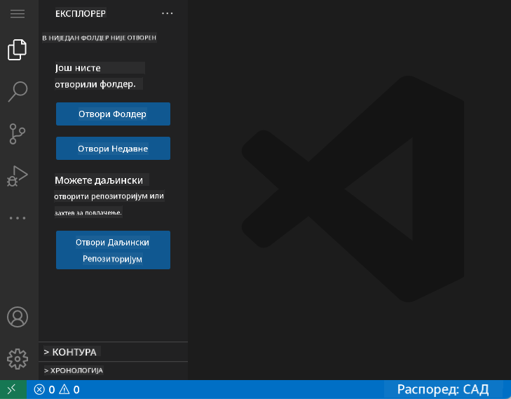
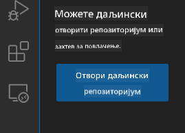
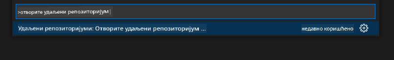
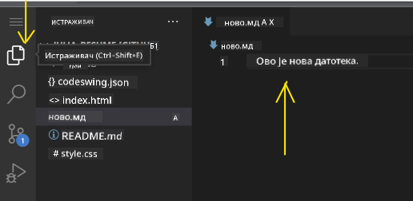
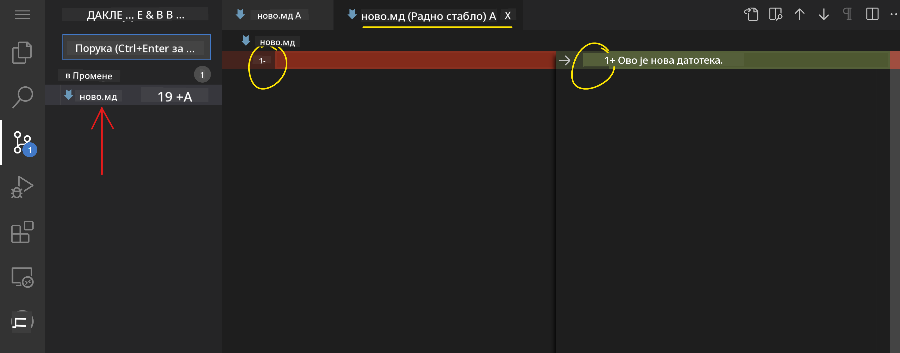
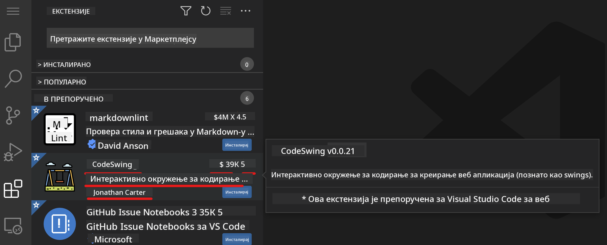
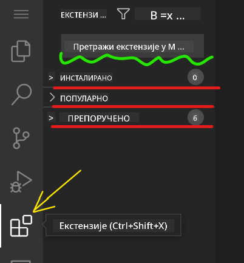
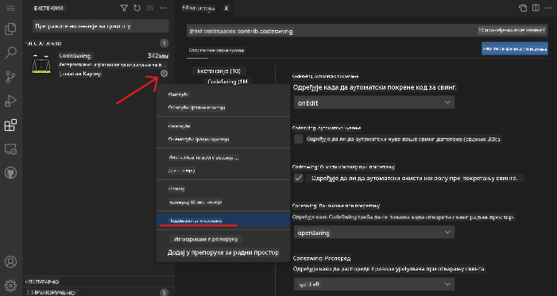

<!--
CO_OP_TRANSLATOR_METADATA:
{
  "original_hash": "7aa6e4f270d38d9cb17f2b5bd86b863d",
  "translation_date": "2025-08-28T10:26:24+00:00",
  "source_file": "8-code-editor/1-using-a-code-editor/README.md",
  "language_code": "sr"
}
-->
# Коришћење едитора за код

Ова лекција покрива основе коришћења [VSCode.dev](https://vscode.dev), веб-базираног едитора за код, како бисте могли да мењате свој код и доприносите пројекту без инсталирања било чега на вашем рачунару.

## Циљеви учења

У овој лекцији ћете научити како да:

- Користите едитор за код у пројекту
- Пратите промене помоћу контроле верзија
- Прилагодите едитор за развој

### Предуслови

Пре него што почнете, потребно је да направите налог на [GitHub-у](https://github.com). Идите на [GitHub](https://github.com/) и направите налог ако га већ немате.

### Увод

Едитор за код је основни алат за писање програма и сарадњу на постојећим пројектима. Када разумете основе едитора и како да користите његове функције, моћи ћете да их примените приликом писања кода.

## Почетак рада са VSCode.dev

[VSCode.dev](https://vscode.dev) је едитор за код на вебу. Не морате ништа да инсталирате да бисте га користили, баш као када отварате било који други вебсајт. Да бисте започели, отворите следећи линк: [https://vscode.dev](https://vscode.dev). Ако нисте пријављени на [GitHub](https://github.com/), пратите упутства да се пријавите или направите нови налог, а затим се пријавите.

Када се учита, требало би да изгледа слично овој слици:



Постоје три главна дела, почевши од леве стране ка десној:

1. _Трака активности_ која укључује неке иконе, попут лупе 🔎, зупчаника ⚙️ и неколико других
2. Проширена трака активности која подразумевано приказује _Истраживач_ (_Explorer_), назван _бочна трака_.
3. И на крају, простор за код са десне стране.

Кликните на сваку од икона да бисте приказали различите меније. Када завршите, кликните на _Истраживач_ да се вратите на почетак.

Када почнете да креирате код или мењате постојећи код, то ће се дешавати у највећем простору са десне стране. Овај простор ћете користити и за преглед постојећег кода, што ћете урадити следеће.

## Отварање GitHub репозиторијума

Прва ствар коју треба да урадите је да отворите GitHub репозиторијум. Постоји више начина за отварање репозиторијума. У овом делу ћете видети два различита начина како можете отворити репозиторијум и почети са изменама.

### 1. Коришћењем едитора

Користите сам едитор да отворите удаљени репозиторијум. Ако одете на [VSCode.dev](https://vscode.dev), видећете дугме _"Open Remote Repository"_:



Такође можете користити командну палету. Командна палета је поље за унос где можете укуцати било коју реч која је део команде или акције да бисте пронашли одговарајућу команду за извршење. Користите мени у горњем левом углу, затим изаберите _View_, а затим _Command Palette_, или користите следећу пречицу на тастатури: Ctrl-Shift-P (на MacOS-у би било Command-Shift-P).



Када се мени отвори, укуцајте _open remote repository_, а затим изаберите прву опцију. Појавиће се више репозиторијума у којима учествујете или које сте недавно отворили. Такође можете користити пуну GitHub URL адресу да изаберете један. Користите следећи URL и налепите га у поље:

```
https://github.com/microsoft/Web-Dev-For-Beginners
```

✅ Ако је успешно, видећете све фајлове овог репозиторијума учитане у текст едитору.

### 2. Коришћењем URL-а

Такође можете директно користити URL да учитате репозиторијум. На пример, пуни URL за тренутни репозиторијум је [https://github.com/microsoft/Web-Dev-For-Beginners](https://github.com/microsoft/Web-Dev-For-Beginners), али можете заменити GitHub домен са `VSCode.dev/github` и директно учитати репозиторијум. Резултујући URL би био [https://vscode.dev/github/microsoft/Web-Dev-For-Beginners](https://vscode.dev/github/microsoft/Web-Dev-For-Beginners).

## Уређивање фајлова

Када отворите репозиторијум у прегледачу/VSCode.dev, следећи корак је да направите измене или ажурирате пројекат.

### 1. Креирање новог фајла

Можете креирати фајл унутар постојећег фолдера или у коренском директоријуму/фолдеру. Да бисте креирали нови фајл, отворите локацију/директоријум у који желите да сачувате фајл и изаберите икону _'New file ...'_ на траци активности _(лево)_, дајте му име и притисните Enter.


### 2. Уређивање и чување фајла у репозиторијуму

Коришћење VSCode.dev је корисно када желите брзо да ажурирате свој пројекат без потребе за локалним учитавањем софтвера.  
Да бисте ажурирали свој код, кликните на икону 'Explorer', такође смештену на траци активности, да бисте видели фајлове и фолдере у репозиторијуму.  
Изаберите фајл да га отворите у простору за код, направите измене и сачувајте.



Када завршите са ажурирањем пројекта, изаберите икону _`source control`_ која садржи све нове промене које сте направили у репозиторијуму.

Да бисте видели промене које сте направили у пројекту, изаберите фајл(ове) у фолдеру `Changes` на проширеној траци активности. Ово ће отворити 'Working Tree' где можете визуелно видети промене које сте направили у фајлу. Црвена боја означава изостављање из пројекта, док зелена означава додавање.



Ако сте задовољни променама које сте направили, пређите мишем преко фолдера `Changes` и кликните на дугме `+` да бисте припремили промене. Припрема значи да припремате своје промене за комитовање на GitHub.

Ако, међутим, нисте задовољни неким променама и желите да их одбаците, пређите мишем преко фолдера `Changes` и изаберите икону `undo`.

Затим, укуцајте `commit message` _(опис промене коју сте направили у пројекту)_, кликните на икону `check` да бисте комитовали и послали своје промене.

Када завршите са радом на пројекту, изаберите икону `hamburger menu` у горњем левом углу да се вратите на репозиторијум на github.com.


## Коришћење екстензија

Инсталирање екстензија у VSCode омогућава вам да додате нове функције и прилагођене опције развојног окружења у вашем едитору како бисте побољшали свој ток рада. Ове екстензије такође помажу у додавању подршке за више програмских језика и често су или генеричке или засноване на језику.

Да бисте прегледали листу свих доступних екстензија, кликните на икону _`Extensions`_ на траци активности и почните да куцате име екстензије у текстуално поље означено _'Search Extensions in Marketplace'_.  
Видећете листу екстензија, од којих свака садржи **име екстензије, име издавача, једну реченицу описа, број преузимања** и **оцену звездицама**.



Такође можете видети све претходно инсталиране екстензије проширивањем фолдера _`Installed`_, популарне екстензије које користи већина програмера у фолдеру _`Popular`_ и препоручене екстензије за вас, било од стране корисника у истом радном простору или на основу недавно отворених фајлова у фолдеру _`Recommended`_.



### 1. Инсталирање екстензија

Да бисте инсталирали екстензију, укуцајте име екстензије у поље за претрагу и кликните на њу да бисте видели додатне информације о екстензији у простору за код када се појави на проширеној траци активности.

Можете кликнути на _плаво дугме за инсталацију_ на проширеној траци активности да бисте инсталирали екстензију или користити дугме за инсталацију које се појављује у простору за код када изаберете екстензију за учитавање додатних информација.


### 2. Прилагођавање екстензија

Након инсталирања екстензије, можда ћете морати да модификујете њено понашање и прилагодите је на основу својих преференција. Да бисте то урадили, изаберите икону Extensions, а овај пут ће се ваша екстензија појавити у фолдеру _Installed_, кликните на _**икону зупчаника**_ и идите на _Extensions Setting_.



### 3. Управљање екстензијама

Након инсталирања и коришћења екстензије, VSCode.dev нуди опције за управљање екстензијом у зависности од различитих потреба. На пример, можете изабрати да:

- **Онемогућите:** _(Привремено онемогућите екстензију када вам више није потребна, али не желите да је потпуно деинсталирате)_

    Изаберите инсталирану екстензију на проширеној траци активности > кликните на икону зупчаника > изаберите 'Disable' или 'Disable (Workspace)' **ИЛИ** Отворите екстензију у простору за код и кликните на плаво дугме Disable.

- **Деинсталирате:** Изаберите инсталирану екстензију на проширеној траци активности > кликните на икону зупчаника > изаберите 'Uninstall' **ИЛИ** Отворите екстензију у простору за код и кликните на плаво дугме Uninstall.

---

## Задатак

[Направите вебсајт са резимеом користећи vscode.dev](https://github.com/microsoft/Web-Dev-For-Beginners/blob/main/8-code-editor/1-using-a-code-editor/assignment.md)

## Преглед и самостално учење

Прочитајте више о [VSCode.dev](https://code.visualstudio.com/docs/editor/vscode-web?WT.mc_id=academic-0000-alfredodeza) и неким његовим другим функцијама.

---

**Одрицање од одговорности**:  
Овај документ је преведен коришћењем услуге за превођење помоћу вештачке интелигенције [Co-op Translator](https://github.com/Azure/co-op-translator). Иако се трудимо да обезбедимо тачност, молимо вас да имате у виду да аутоматски преводи могу садржати грешке или нетачности. Оригинални документ на његовом изворном језику треба сматрати ауторитативним извором. За критичне информације препоручује се професионални превод од стране људског преводиоца. Не преузимамо одговорност за било каква погрешна тумачења или неспоразуме који могу настати услед коришћења овог превода.