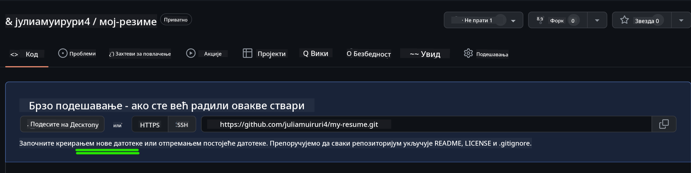
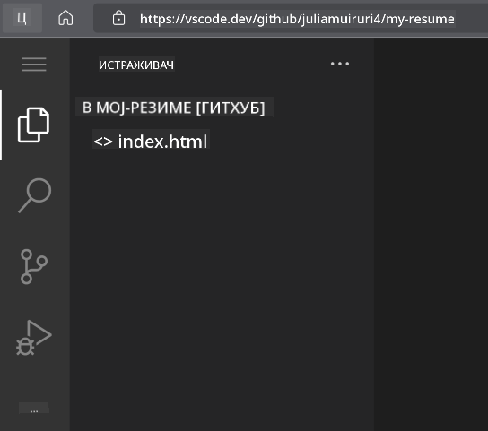
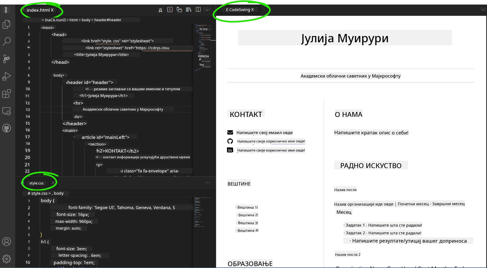

<!--
CO_OP_TRANSLATOR_METADATA:
{
  "original_hash": "2fcb983b8dbadadb1bc2e97f8c12dac5",
  "translation_date": "2025-08-27T22:40:32+00:00",
  "source_file": "8-code-editor/1-using-a-code-editor/assignment.md",
  "language_code": "sr"
}
-->
# Направите веб-сајт за резиме користећи vscode.dev

_Колико би било кул да вас рекрутер замоли за ваше резиме, а ви му пошаљете URL?_ 😎

## Циљеви

Након овог задатка, научићете како да:

- Направите веб-сајт за приказивање вашег резимеа

### Предуслови

1. Налог на GitHub-у. Идите на [GitHub](https://github.com/) и направите налог ако га већ немате.

## Кораци

**Корак 1:** Направите нови GitHub репозиторијум и дајте му име `my-resume`

**Корак 2:** Направите `index.html` датотеку у вашем репозиторијуму. Додаћемо бар једну датотеку док смо још на github.com јер не можете отворити празан репозиторијум на vscode.dev.

Кликните на линк `creating a new file`, унесите име `index.html` и изаберите дугме `Commit new file`.



**Корак 3:** Отворите [VSCode.dev](https://vscode.dev) и изаберите дугме `Open Remote Repository`.

Копирајте URL репозиторијума који сте управо направили за ваш сајт резимеа и налепите га у поље за унос:

_Замените `your-username` са вашим GitHub корисничким именом._

```
https://github.com/your-username/my-resume
```

✅ Ако је успешно, видећете ваш пројекат и датотеку index.html отворену у текст едитору у претраживачу.



**Корак 4:** Отворите датотеку `index.html`, налепите код испод у ваш кодни простор и сачувајте.

<details>
    <summary><b>HTML код одговоран за садржај вашег веб-сајта резимеа.</b></summary>
    
        <html>

            <head>
                <link href="style.css" rel="stylesheet">
                <link rel="stylesheet" href="https://cdnjs.cloudflare.com/ajax/libs/font-awesome/5.15.4/css/all.min.css">
                <title>Ваше име овде!</title>
            </head>
            <body>
                <header id="header">
                    <!-- заглавље резимеа са вашим именом и титулом -->
                    <h1>Ваше име овде!</h1>
                    <hr>
                    Ваша улога!
                    <hr>
                </header>
                <main>
                    <article id="mainLeft">
                        <section>
                            <h2>КОНТАКТ</h2>
                            <!-- контакт информације укључујући друштвене мреже -->
                            <p>
                                <i class="fa fa-envelope" aria-hidden="true"></i>
                                <a href="mailto:username@domain.top-level domain">Унесите ваш емаил овде</a>
                            </p>
                            <p>
                                <i class="fab fa-github" aria-hidden="true"></i>
                                <a href="github.com/yourGitHubUsername">Унесите ваше корисничко име овде!</a>
                            </p>
                            <p>
                                <i class="fab fa-linkedin" aria-hidden="true"></i>
                                <a href="linkedin.com/yourLinkedInUsername">Унесите ваше корисничко име овде!</a>
                            </p>
                        </section>
                        <section>
                            <h2>ВЕШТИНЕ</h2>
                            <!-- ваше вештине -->
                            <ul>
                                <li>Вештина 1!</li>
                                <li>Вештина 2!</li>
                                <li>Вештина 3!</li>
                                <li>Вештина 4!</li>
                            </ul>
                        </section>
                        <section>
                            <h2>ОБРАЗОВАЊЕ</h2>
                            <!-- ваше образовање -->
                            <h3>Унесите ваш курс овде!</h3>
                            <p>
                                Унесите вашу институцију овде!
                            </p>
                            <p>
                                Почетак - Крај
                            </p>
                        </section>            
                    </article>
                    <article id="mainRight">
                        <section>
                            <h2>О МЕНИ</h2>
                            <!-- о вама -->
                            <p>Унесите кратак текст о себи!</p>
                        </section>
                        <section>
                            <h2>РАДНО ИСКУСТВО</h2>
                            <!-- ваше радно искуство -->
                            <h3>Назив посла</h3>
                            <p>
                                Назив организације овде | Месец почетка – Месец краја
                            </p>
                            <ul>
                                    <li>Задатак 1 - Унесите шта сте радили!</li>
                                    <li>Задатак 2 - Унесите шта сте радили!</li>
                                    <li>Унесите резултате/утицај вашег доприноса</li>
                                    
                            </ul>
                            <h3>Назив посла 2</h3>
                            <p>
                                Назив организације овде | Месец почетка – Месец краја
                            </p>
                            <ul>
                                    <li>Задатак 1 - Унесите шта сте радили!</li>
                                    <li>Задатак 2 - Унесите шта сте радили!</li>
                                    <li>Унесите резултате/утицај вашег доприноса</li>
                                    
                            </ul>
                        </section>
                    </article>
                </main>
            </body>
        </html>
</details>

Додајте детаље вашег резимеа да замените _текст за попуњавање_ у HTML коду.

**Корак 5:** Пређите мишем преко фасцикле My-Resume, кликните на икону `New File ...` и направите 2 нове датотеке у вашем пројекту: `style.css` и `codeswing.json`.

**Корак 6:** Отворите датотеку `style.css`, налепите код испод и сачувајте.

<details>
        <summary><b>CSS код за форматирање изгледа сајта.</b></summary>
            
            body {
                font-family: 'Segoe UI', Tahoma, Geneva, Verdana, sans-serif;
                font-size: 16px;
                max-width: 960px;
                margin: auto;
            }
            h1 {
                font-size: 3em;
                letter-spacing: .6em;
                padding-top: 1em;
                padding-bottom: 1em;
            }

            h2 {
                font-size: 1.5em;
                padding-bottom: 1em;
            }

            h3 {
                font-size: 1em;
                padding-bottom: 1em;
            }
            main { 
                display: grid;
                grid-template-columns: 40% 60%;
                margin-top: 3em;
            }
            header {
                text-align: center;
                margin: auto 2em;
            }

            section {
                margin: auto 1em 4em 2em;
            }

            i {
                margin-right: .5em;
            }

            p {
                margin: .2em auto
            }

            hr {
                border: none;
                background-color: lightgray;
                height: 1px;
            }

            h1, h2, h3 {
                font-weight: 100;
                margin-bottom: 0;
            }
            #mainLeft {
                border-right: 1px solid lightgray;
            }
            
</details>

**Корак 6:** Отворите датотеку `codeswing.json`, налепите код испод и сачувајте.

    {
    "scripts": [],
    "styles": []
    }

**Корак 7:** Инсталирајте `Codeswing extension` да визуализујете веб-сајт резимеа у кодном простору.

Кликните на икону _`Extensions`_ на траци активности и укуцајте Codeswing. Или кликните на _плаво дугме за инсталацију_ на проширеној траци активности да инсталирате или користите дугме за инсталацију које се појављује у кодном простору када изаберете екстензију за учитавање додатних информација. Одмах након инсталирања екстензије, посматрајте ваш кодни простор да видите промене у вашем пројекту 😃.


Ово је оно што ћете видети на вашем екрану након што инсталирате екстензију.



Ако сте задовољни променама које сте направили, пређите мишем преко фасцикле `Changes` и кликните на дугме `+` да поставите промене.

Унесите поруку за commit _(Опис промене коју сте направили у пројекту)_ и потврдите ваше промене кликом на `check`. Када завршите рад на вашем пројекту, изаберите икону менија хамбургера у горњем левом углу да се вратите на репозиторијум на GitHub-у.

Честитамо 🎉 Управо сте направили ваш веб-сајт резимеа користећи vscode.dev у неколико корака.

## 🚀 Изазов

Отворите удаљени репозиторијум за који имате дозволу да правите промене и ажурирајте неке датотеке. Затим, покушајте да направите нову грану са вашим променама и направите Pull Request.

## Преглед и самостално учење

Прочитајте више о [VSCode.dev](https://code.visualstudio.com/docs/editor/vscode-web?WT.mc_id=academic-0000-alfredodeza) и неким његовим другим функцијама.

---

**Одрицање од одговорности**:  
Овај документ је преведен коришћењем услуге за превођење помоћу вештачке интелигенције [Co-op Translator](https://github.com/Azure/co-op-translator). Иако се трудимо да обезбедимо тачност, молимо вас да имате у виду да аутоматски преводи могу садржати грешке или нетачности. Оригинални документ на његовом изворном језику треба сматрати ауторитативним извором. За критичне информације препоручује се професионални превод од стране људи. Не преузимамо одговорност за било каква погрешна тумачења или неспоразуме који могу настати услед коришћења овог превода.