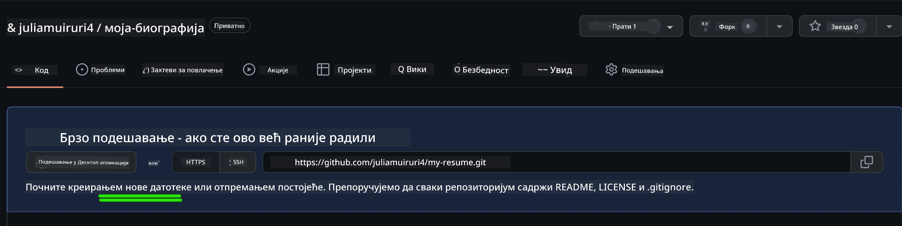
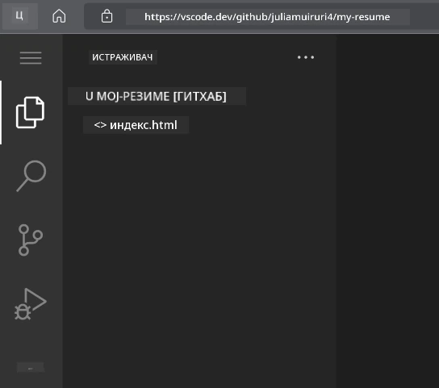
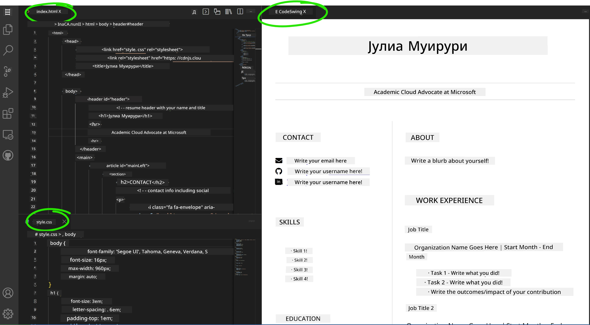

# Направите веб-сајт за резиме користећи VSCode.dev

Побољшајте своје каријерне перспективе креирањем професионалног веб-сајта за резиме који приказује ваше вештине и искуство у интерактивном, модерном формату. Уместо да шаљете традиционалне PDF документе, замислите да пружате послодавцима елегантан, одзиван веб-сајт који демонстрира и ваше квалификације и ваше способности у веб развоју.

Овај практични задатак омогућава вам да примените све своје вештине из VSCode.dev док креирате нешто што је заиста корисно за вашу каријеру. Искуство комплетног процеса веб развоја – од креирања репозиторијума до објављивања – све унутар вашег претраживача.

Завршетком овог пројекта, имаћете професионално онлајн присуство које можете лако поделити са потенцијалним послодавцима, ажурирати како ваше вештине расту и прилагодити га вашем личном бренду. Ово је управо она врста практичног пројекта која демонстрира стварне вештине веб развоја.

## Циљеви учења

Након завршетка овог задатка, бићете у могућности да:

- **Креирате** и управљате комплетним пројектом веб развоја користећи VSCode.dev
- **Структурирате** професионални веб-сајт користећи семантичке HTML елементе
- **Стилизујете** одзивне распореде са модерним CSS техникама
- **Имплементирате** интерактивне функције користећи основне веб технологије
- **Објавите** живи веб-сајт доступан преко линка за дељење
- **Демонстрирате** најбоље праксе контроле верзија током процеса развоја

## Предуслови

Пре него што започнете овај задатак, уверите се да имате:

- Налог на GitHub-у (отворите га на [github.com](https://github.com/) ако је потребно)
- Завршену лекцију о VSCode.dev која покрива навигацију интерфејсом и основне операције
- Основно разумевање HTML структуре и концепата стилизовања CSS-а

## Постављање пројекта и креирање репозиторијума

Хајде да започнемо постављањем основе вашег пројекта. Овај процес одражава стварне радне токове развоја где пројекти почињу правилном иницијализацијом репозиторијума и планирањем структуре.

### Корак 1: Креирајте свој GitHub репозиторијум

Постављање посебног репозиторијума осигурава да је ваш пројекат правилно организован и контролисан од самог почетка.

1. **Идите** на [GitHub.com](https://github.com) и пријавите се на свој налог
2. **Кликните** на зелено дугме "New" или икону "+" у горњем десном углу
3. **Назовите** свој репозиторијум `my-resume` (или изаберите персонализовано име као што је `john-smith-resume`)
4. **Додајте** кратак опис: "Професионални веб-сајт за резиме направљен помоћу HTML-а и CSS-а"
5. **Изаберите** "Public" да би ваш резиме био доступан потенцијалним послодавцима
6. **Означите** "Add a README file" да бисте креирали почетни опис пројекта
7. **Кликните** "Create repository" да бисте завршили постављање

> 💡 **Савет за именовање репозиторијума**: Користите описна, професионална имена која јасно указују на сврху пројекта. Ово помаже када делите са послодавцима или током прегледа портфолија.

### Корак 2: Иницијализујте структуру пројекта

Пошто VSCode.dev захтева бар један фајл да би отворио репозиторијум, креираћемо наш главни HTML фајл директно на GitHub-у пре него што пређемо на веб уређивач.

1. **Кликните** на линк "creating a new file" у вашем новом репозиторијуму
2. **Унесите** `index.html` као име фајла
3. **Додајте** ову почетну HTML структуру:

```html
<!DOCTYPE html>
<html lang="en">
<head>
    <meta charset="UTF-8">
    <meta name="viewport" content="width=device-width, initial-scale=1.0">
    <title>Your Name - Professional Resume</title>
</head>
<body>
    <h1>Your Name</h1>
    <p>Professional Resume Website</p>
</body>
</html>
```

4. **Напишите** поруку за commit: "Додат почетни HTML структура"
5. **Кликните** "Commit new file" да бисте сачували промене



**Ево шта ова почетна поставка постиже:**
- **Успоставља** правилну HTML5 структуру документа са семантичким елементима
- **Укључује** viewport meta tag за компатибилност са одзивним дизајном
- **Поставља** описни наслов странице који се појављује у картицама претраживача
- **Креира** основу за професионалну организацију садржаја

## Рад у VSCode.dev

Сада када је основа вашег репозиторијума постављена, пређимо на VSCode.dev за главни рад на развоју. Овај веб-базирани уређивач пружа све алате потребне за професионални веб развој.

### Корак 3: Отворите свој пројекат у VSCode.dev

1. **Идите** на [vscode.dev](https://vscode.dev) у новом прозору претраживача
2. **Кликните** "Open Remote Repository" на почетном екрану
3. **Копирајте** URL вашег репозиторијума са GitHub-а и налепите га у поље за унос

   Формат: `https://github.com/your-username/my-resume`
   
   *Замените `your-username` са вашим стварним корисничким именом на GitHub-у*

4. **Притисните** Enter да бисте учитали свој пројекат

✅ **Индикатор успеха**: Требало би да видите фајлове вашег пројекта у бочној траци Explorer-а и `index.html` доступан за уређивање у главном уређивачком простору.



**Шта ћете видети у интерфејсу:**
- **Бочна трака Explorer-а**: **Приказује** фајлове и структуру фасцикли вашег репозиторијума
- **Уређивачки простор**: **Приказује** садржај изабраних фајлова за уређивање
- **Трака активности**: **Омогућава** приступ функцијама као што су Source Control и Extensions
- **Трака статуса**: **Показује** статус везе и информације о тренутној грани

### Корак 4: Направите садржај резимеа

Замените садржај за попуњавање у `index.html` са свеобухватном структуром резимеа. Овај HTML пружа основу за професионално представљање ваших квалификација.

<details>
<summary><b>Комплетна HTML структура резимеа</b></summary>

```html
<!DOCTYPE html>
<html lang="en">
<head>
    <meta charset="UTF-8">
    <meta name="viewport" content="width=device-width, initial-scale=1.0">
    <link href="style.css" rel="stylesheet">
    <link rel="stylesheet" href="https://cdnjs.cloudflare.com/ajax/libs/font-awesome/5.15.4/css/all.min.css">
    <title>Your Name - Professional Resume</title>
</head>
<body>
    <header id="header">
        <h1>Your Full Name</h1>
        <hr>
        <p class="role">Your Professional Title</p>
        <hr>
    </header>
    
    <main>
        <article id="mainLeft">
            <section>
                <h2>CONTACT</h2>
                <p>
                    <i class="fa fa-envelope" aria-hidden="true"></i>
                    <a href="mailto:your.email@domain.com">your.email@domain.com</a>
                </p>
                <p>
                    <i class="fab fa-github" aria-hidden="true"></i>
                    <a href="https://github.com/your-username">github.com/your-username</a>
                </p>
                <p>
                    <i class="fab fa-linkedin" aria-hidden="true"></i>
                    <a href="https://linkedin.com/in/your-profile">linkedin.com/in/your-profile</a>
                </p>
            </section>
            
            <section>
                <h2>SKILLS</h2>
                <ul>
                    <li>HTML5 & CSS3</li>
                    <li>JavaScript (ES6+)</li>
                    <li>Responsive Web Design</li>
                    <li>Version Control (Git)</li>
                    <li>Problem Solving</li>
                </ul>
            </section>
            
            <section>
                <h2>EDUCATION</h2>
                <h3>Your Degree or Certification</h3>
                <p>Institution Name</p>
                <p>Start Date - End Date</p>
            </section>
        </article>
        
        <article id="mainRight">
            <section>
                <h2>ABOUT</h2>
                <p>Write a compelling summary that highlights your passion for web development, key achievements, and career goals. This section should give employers insight into your personality and professional approach.</p>
            </section>
            
            <section>
                <h2>WORK EXPERIENCE</h2>
                <div class="job">
                    <h3>Job Title</h3>
                    <p class="company">Company Name | Start Date – End Date</p>
                    <ul>
                        <li>Describe a key accomplishment or responsibility</li>
                        <li>Highlight specific skills or technologies used</li>
                        <li>Quantify impact where possible (e.g., "Improved efficiency by 25%")</li>
                    </ul>
                </div>
                
                <div class="job">
                    <h3>Previous Job Title</h3>
                    <p class="company">Previous Company | Start Date – End Date</p>
                    <ul>
                        <li>Focus on transferable skills and achievements</li>
                        <li>Demonstrate growth and learning progression</li>
                        <li>Include any leadership or collaboration experiences</li>
                    </ul>
                </div>
            </section>
            
            <section>
                <h2>PROJECTS</h2>
                <div class="project">
                    <h3>Project Name</h3>
                    <p>Brief description of what the project accomplishes and technologies used.</p>
                    <a href="#" target="_blank">View Project</a>
                </div>
            </section>
        </article>
    </main>
</body>
</html>
```
</details>

**Смернице за прилагођавање:**
- **Замените** сав текст за попуњавање вашим стварним информацијама
- **Прилагодите** секције на основу вашег нивоа искуства и фокуса каријере
- **Додајте** или уклоните секције по потреби (нпр. Сертификати, Волонтерски рад, Језици)
- **Укључите** линкове ка вашим стварним профилима и пројектима

### Корак 5: Креирајте пратеће фајлове

Професионални веб-сајтови захтевају организоване структуре фајлова. Креирајте CSS стилски лист и конфигурационе фајлове потребне за комплетан пројекат.

1. **Прелазите мишем** преко имена фасцикле вашег пројекта у бочној траци Explorer-а
2. **Кликните** на икону "New File" (📄+) која се појављује
3. **Креирајте** ове фајлове један по један:
   - `style.css` (за стилизовање и распоред)
   - `codeswing.json` (за конфигурацију екстензије за преглед)

**Креирање CSS фајла (`style.css`):**

<details>
<summary><b>Професионално CSS стилизовање</b></summary>

```css
/* Modern Resume Styling */
body {
    font-family: 'Segoe UI', Tahoma, Geneva, Verdana, sans-serif;
    font-size: 16px;
    line-height: 1.6;
    max-width: 960px;
    margin: 0 auto;
    padding: 20px;
    color: #333;
    background-color: #f9f9f9;
}

/* Header Styling */
header {
    text-align: center;
    margin-bottom: 3em;
    padding: 2em;
    background: linear-gradient(135deg, #667eea 0%, #764ba2 100%);
    color: white;
    border-radius: 10px;
    box-shadow: 0 4px 6px rgba(0, 0, 0, 0.1);
}

h1 {
    font-size: 3em;
    letter-spacing: 0.1em;
    margin-bottom: 0.2em;
    font-weight: 300;
}

.role {
    font-size: 1.3em;
    font-weight: 300;
    margin: 1em 0;
}

/* Main Content Layout */
main {
    display: grid;
    grid-template-columns: 35% 65%;
    gap: 3em;
    margin-top: 3em;
    background: white;
    padding: 2em;
    border-radius: 10px;
    box-shadow: 0 2px 10px rgba(0, 0, 0, 0.1);
}

/* Typography */
h2 {
    font-size: 1.4em;
    font-weight: 600;
    margin-bottom: 1em;
    color: #667eea;
    border-bottom: 2px solid #667eea;
    padding-bottom: 0.3em;
}

h3 {
    font-size: 1.1em;
    font-weight: 600;
    margin-bottom: 0.5em;
    color: #444;
}

/* Section Styling */
section {
    margin-bottom: 2.5em;
}

#mainLeft {
    border-right: 1px solid #e0e0e0;
    padding-right: 2em;
}

/* Contact Links */
section a {
    color: #667eea;
    text-decoration: none;
    transition: color 0.3s ease;
}

section a:hover {
    color: #764ba2;
    text-decoration: underline;
}

/* Icons */
i {
    margin-right: 0.8em;
    width: 20px;
    text-align: center;
    color: #667eea;
}

/* Lists */
ul {
    list-style: none;
    padding-left: 0;
}

li {
    margin: 0.5em 0;
    padding: 0.3em 0;
    position: relative;
}

li:before {
    content: "▸";
    color: #667eea;
    margin-right: 0.5em;
}

/* Work Experience */
.job, .project {
    margin-bottom: 2em;
    padding-bottom: 1.5em;
    border-bottom: 1px solid #f0f0f0;
}

.company {
    font-style: italic;
    color: #666;
    margin-bottom: 0.5em;
}

/* Responsive Design */
@media (max-width: 768px) {
    main {
        grid-template-columns: 1fr;
        gap: 2em;
    }
    
    #mainLeft {
        border-right: none;
        border-bottom: 1px solid #e0e0e0;
        padding-right: 0;
        padding-bottom: 2em;
    }
    
    h1 {
        font-size: 2.2em;
    }
    
    body {
        padding: 10px;
    }
}

/* Print Styles */
@media print {
    body {
        background: white;
        color: black;
        font-size: 12pt;
    }
    
    header {
        background: none;
        color: black;
        box-shadow: none;
    }
    
    main {
        box-shadow: none;
    }
}
```
</details>

**Креирање конфигурационог фајла (`codeswing.json`):**

```json
{
    "scripts": [],
    "styles": []
}
```

**Разумевање CSS функција:**
- **Користи** CSS Grid за одзивну, професионалну структуру распореда
- **Имплементира** модерне шеме боја са градијентним заглављима
- **Укључује** ефекте при проласку мишем и глатке прелазе за интерактивност
- **Обезбеђује** одзивни дизајн који функционише на свим величинама уређаја
- **Додаје** стилове прилагођене за штампање ради генерисања PDF-а

### Корак 6: Инсталирајте и конфигуришите екстензије

Екстензије побољшавају ваше искуство развоја пружајући могућности за живи преглед и побољшане алате за радни ток. Екстензија CodeSwing је посебно корисна за пројекте веб развоја.

**Инсталирање CodeSwing екстензије:**

1. **Кликните** на икону Extensions (🧩) у траци активности
2. **Претражите** "CodeSwing" у пољу за претрагу на тржишту
3. **Изаберите** CodeSwing екстензију из резултата претраге
4. **Кликните** на плаво дугме "Install"


**Шта CodeSwing пружа:**
- **Омогућава** живи преглед вашег веб-сајта док га уређујете
- **Приказује** промене у реалном времену без ручног освежавања
- **Подржава** више типова фајлова укључујући HTML, CSS и JavaScript
- **Пружа** интегрисано искуство развојног окружења

**Одмах након инсталације:**
Када је CodeSwing инсталиран, видећете живи преглед вашег веб-сајта за резиме који се појављује у уређивачу. Ово вам омогућава да видите тачно како ваш сајт изгледа док правите промене.



**Разумевање побољшаног интерфејса:**
- **Подељен приказ**: **Приказује** ваш код са једне стране и живи преглед са друге
- **Ажурирања у реалном времену**: **Одражава** промене одмах док куцате
- **Интерактивни преглед**: **Омогућава** тестирање линкова и интеракција
- **Симулација мобилних уређаја**: **Пружа** могућности тестирања одзивног дизајна

### Корак 7: Контрола верзија и објављивање

Сада када је ваш веб-сајт за резиме завршен, користите Git да сачувате свој рад и учините га доступним онлајн.

**Чување ваших промена:**

1. **Кликните** на икону Source Control (🌿) у траци активности
2. **Прегледајте** све фајлове које сте креирали и изменили у секцији "Changes"
3. **Означите** своје промене кликом на "+" икону поред сваког фајла
4. **Напишите** описну поруку за commit, као што су:
   - "Додат комплетан веб-сајт за резиме са одзивним дизајном"
   - "Имплементирано професионално стилизовање и структура садржаја"
5. **Кликните** на знак за потврду (✓) да бисте сачували и послали своје промене

**Примери ефективних порука за commit:**
- "Додат професионални садржај резимеа и стилизовање"
- "Имплементиран одзивни дизајн за компатибилност са мобилним уређајима"
- "Ажурирани контакт подаци и линкови ка пројектима"

> 💡 **Професионални савет**: Добре поруке за commit помажу у праћењу еволуције вашег пројекта и показују пажњу према детаљима – особине које послодавци цене.

**Приступ вашем објављеном сајту:**
Када сачувате промене, можете се вратити на свој GitHub репозиторијум користећи мени хамбургера (☰) у горњем левом углу. Ваш веб-сајт за резиме је сада под контролом верзија и спреман за објављивање или дељење.

## Резултати и наредни кораци

**Честитамо! 🎉** Успешно сте креирали професионални веб-сајт за резиме користећи VSCode.dev. Ваш пројекат демонстрира:
**Демонстриране техничке вештине:**
- **Управљање репозиторијумом**: Креирали сте и организовали комплетну структуру пројекта
- **Веб развој**: Направили сте одзиван веб-сајт користећи модерни HTML5 и CSS3
- **Контрола верзија**: Имплементирали сте правилан Git радни ток са смисленим порукама за commit
- **Познавање алата**: Ефикасно сте користили интерфејс VSCode.dev и систем екстензија

**Постигнути професионални резултати:**
- **Онлајн присуство**: Линк који се може делити и који приказује ваше квалификације
- **Модеран формат**: Интерактивна алтернатива традиционалним PDF резимеима
- **Демонстрација вештина**: Конкретан доказ ваших способности у веб развоју
- **Лако ажурирање**: Основа коју можете континуирано унапређивати и прилагођавати

### Опције за објављивање

Да бисте свој резиме учинили доступним послодавцима, размотрите ове опције хостинга:

**GitHub Pages (Препоручено):**
1. Идите на Settings вашег репозиторијума на GitHub-у
2. Скролујте до секције "Pages"
3. Изаберите "Deploy from a branch" и одаберите "main"
4. Ваш сајт ће бити доступан на `https://your-username.github.io/my-resume`

**Алтернативне платформе:**
- **Netlify**: Аутоматско објављивање са прилагођеним доменима
- **Vercel**: Брзо објављивање са модерним функцијама хостинга
- **GitHub Codespaces**: Развојно окружење са уграђеним прегледом

### Предлози за унапређење

Наставите да развијате своје вештине додавањем ових функција:

**Техничка побољшања:**
- **Интерактивност са JavaScript-ом**: Додајте глатко скроловање или интерактивне елементе
- **Тамни режим**: Имплементирајте прелазак између тема за корисничке преференције
- **Контакт форма**: Омогућите директ
- **Приступачност**: Упознајте се са WCAG смерницама за инклузивни веб дизајн  
- **Перформансе**: Истражите алате као што је Lighthouse за оптимизацију  
- **SEO**: Разумите основе оптимизације за претраживаче  

**Професионални развој:**  
- **Изградња портфолија**: Направите додатне пројекте како бисте приказали разноврсне вештине  
- **Отворени код**: Доприносите постојећим пројектима како бисте стекли искуство у сарадњи  
- **Умрежавање**: Поделите свој веб сајт за резиме у заједницама програмера ради добијања повратних информација  
- **Континуирано учење**: Будите у току са трендовима и технологијама у веб развоју  

---

**Ваши следећи кораци:** Поделите свој веб сајт за резиме са пријатељима, породицом или менторима ради добијања повратних информација. Искористите њихове предлоге за унапређење и побољшање вашег дизајна. Запамтите, овај пројекат није само резиме – он је демонстрација вашег развоја као веб програмера!

---

**Одрицање од одговорности**:  
Овај документ је преведен помоћу услуге за превођење вештачке интелигенције [Co-op Translator](https://github.com/Azure/co-op-translator). Иако настојимо да обезбедимо тачност, молимо вас да имате у виду да аутоматски преводи могу садржати грешке или нетачности. Оригинални документ на његовом изворном језику треба сматрати ауторитативним извором. За критичне информације препоручује се професионални превод од стране људи. Не преузимамо одговорност за било каква погрешна тумачења или неспоразуме који могу настати услед коришћења овог превода.