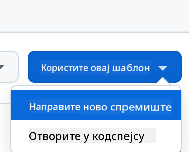

<!--
CO_OP_TRANSLATOR_METADATA:
{
  "original_hash": "002304ffe0059e55b33e2ee5283788ad",
  "translation_date": "2025-09-01T15:38:54+00:00",
  "source_file": "9-chat-project/README.md",
  "language_code": "sr"
}
-->
# Пројекат за чет

Овај пројекат за чет показује како да направите асистента за чет користећи GitHub Models.

Ево како изгледа завршени пројекат:

<div>
  
</div>

Мало контекста, прављење асистената за чет користећи генеративну вештачку интелигенцију је одличан начин да започнете учење о вештачкој интелигенцији. Оно што ћете научити је како да интегришете генеративну вештачку интелигенцију у веб апликацију током ове лекције, хајде да почнемо.

## Повезивање са генеративном вештачком интелигенцијом

За позадину користимо GitHub Models. То је одлична услуга која вам омогућава да користите вештачку интелигенцију бесплатно. Идите на њен playground и преузмите код који одговара вашем изабраном језику за позадину. Ево како изгледа [GitHub Models Playground](https://github.com/marketplace/models/azure-openai/gpt-4o-mini/playground).

<div>
  
</div>

Као што смо рекли, изаберите картицу "Code" и ваш изабрани runtime.

<div>
  
</div>

### Коришћење Python-а

У овом случају бирамо Python, што значи да узимамо овај код:

```python
"""Run this model in Python

> pip install openai
"""
import os
from openai import OpenAI

# To authenticate with the model you will need to generate a personal access token (PAT) in your GitHub settings. 
# Create your PAT token by following instructions here: https://docs.github.com/en/authentication/keeping-your-account-and-data-secure/managing-your-personal-access-tokens
client = OpenAI(
    base_url="https://models.github.ai/inference",
    api_key=os.environ["GITHUB_TOKEN"],
)

response = client.chat.completions.create(
    messages=[
        {
            "role": "system",
            "content": "",
        },
        {
            "role": "user",
            "content": "What is the capital of France?",
        }
    ],
    model="openai/gpt-4o-mini",
    temperature=1,
    max_tokens=4096,
    top_p=1
)

print(response.choices[0].message.content)
```

Хајде да мало очистимо овај код како би био поново употребљив:

```python
def call_llm(prompt: str, system_message: str):
    response = client.chat.completions.create(
        messages=[
            {
                "role": "system",
                "content": system_message,
            },
            {
                "role": "user",
                "content": prompt,
            }
        ],
        model="openai/gpt-4o-mini",
        temperature=1,
        max_tokens=4096,
        top_p=1
    )

    return response.choices[0].message.content
```

Са овом функцијом `call_llm` сада можемо узети упит и системски упит, а функција ће на крају вратити резултат.

### Прилагођавање асистента за вештачку интелигенцију

Ако желите да прилагодите асистента за вештачку интелигенцију, можете одредити како желите да се понаша попуњавањем системског упита овако:

```python
call_llm("Tell me about you", "You're Albert Einstein, you only know of things in the time you were alive")
```

## Излагање преко веб API-ја

Одлично, завршили смо део са вештачком интелигенцијом, хајде да видимо како можемо да интегришемо то у веб API. За веб API бирамо Flask, али било који веб оквир би требало да буде добар. Хајде да видимо код за то:

### Коришћење Python-а

```python
# api.py
from flask import Flask, request, jsonify
from llm import call_llm
from flask_cors import CORS

app = Flask(__name__)
CORS(app)   # *   example.com

@app.route("/", methods=["GET"])
def index():
    return "Welcome to this API. Call POST /hello with 'message': 'my message' as JSON payload"


@app.route("/hello", methods=["POST"])
def hello():
    # get message from request body  { "message": "do this taks for me" }
    data = request.get_json()
    message = data.get("message", "")

    response = call_llm(message, "You are a helpful assistant.")
    return jsonify({
        "response": response
    })

if __name__ == "__main__":
    app.run(host="0.0.0.0", port=5000)
```

Овде креирамо Flask API и дефинишемо подразумевану руту "/" и "/chat". Ова друга је намењена да је користи наш frontend за прослеђивање питања.

Да бисмо интегрисали *llm.py*, ево шта треба да урадимо:

- Увоз функције `call_llm`:

   ```python
   from llm import call_llm
   from flask import Flask, request
   ```

- Позивање из руте "/chat":

   ```python
   @app.route("/hello", methods=["POST"])
   def hello():
      # get message from request body  { "message": "do this taks for me" }
      data = request.get_json()
      message = data.get("message", "")

      response = call_llm(message, "You are a helpful assistant.")
      return jsonify({
         "response": response
      })
   ```

   Овде анализирамо долазни захтев да бисмо преузели својство `message` из JSON тела. Након тога позивамо LLM са овим позивом:

   ```python
   response = call_llm(message, "You are a helpful assistant")

   # return the response as JSON
   return jsonify({
      "response": response 
   })
   ```

Одлично, сада смо урадили оно што је потребно.

## Конфигурисање Cors-а

Треба да напоменемо да смо поставили нешто попут CORS-а, дељења ресурса између различитих порекла. То значи да, пошто ће наша позадина и предњи део радити на различитим портовима, морамо дозволити предњем делу да позива позадину.

### Коришћење Python-а

Постоји део кода у *api.py* који то поставља:

```python
from flask_cors import CORS

app = Flask(__name__)
CORS(app)   # *   example.com
```

Тренутно је постављено да дозвољава "*" што значи сва порекла, и то је мало небезбедно, требало би да ограничимо када идемо у продукцију.

## Покретање пројекта

Да бисте покренули свој пројекат, прво треба да покренете позадину, а затим предњи део.

### Коришћење Python-а

Добро, имамо *llm.py* и *api.py*, како можемо да ово функционише са позадином? Па, постоје две ствари које треба да урадимо:

- Инсталирање зависности:

   ```sh
   cd backend
   python -m venv venv
   source ./venv/bin/activate

   pip install openai flask flask-cors openai
   ```

- Покретање API-ја

   ```sh
   python api.py
   ```

   Ако сте у Codespaces-у, треба да одете на Ports у доњем делу уређивача, десним кликом на њега и кликнете "Port Visibility" и изаберете "Public".

### Рад на предњем делу

Сада када имамо API који ради, хајде да направимо предњи део за ово. Минимални предњи део који ћемо побољшавати корак по корак. У *frontend* фасцикли, креирајте следеће:

```text
backend/
frontend/
index.html
app.js
styles.css
```

Хајде да почнемо са **index.html**:

```html
<html>
    <head>
        <link rel="stylesheet" href="styles.css">
    </head>
    <body>
      <form>
        <textarea id="messages"></textarea>
        <input id="input" type="text" />
        <button type="submit" id="sendBtn">Send</button>  
      </form>  
      <script src="app.js" />
    </body>
</html>    
```

Ово изнад је апсолутни минимум који вам је потребан за подршку прозору за чет, јер се састоји од текстуалног поља где ће се поруке приказивати, уноса где се куца порука и дугмета за слање поруке позадини. Хајде да погледамо JavaScript следеће у *app.js*.

**app.js**

```js
// app.js

(function(){
  // 1. set up elements  
  const messages = document.getElementById("messages");
  const form = document.getElementById("form");
  const input = document.getElementById("input");

  const BASE_URL = "change this";
  const API_ENDPOINT = `${BASE_URL}/hello`;

  // 2. create a function that talks to our backend
  async function callApi(text) {
    const response = await fetch(API_ENDPOINT, {
      method: "POST",
      headers: { "Content-Type": "application/json" },
      body: JSON.stringify({ message: text })
    });
    let json = await response.json();
    return json.response;
  }

  // 3. add response to our textarea
  function appendMessage(text, role) {
    const el = document.createElement("div");
    el.className = `message ${role}`;
    el.innerHTML = text;
    messages.appendChild(el);
  }

  // 4. listen to submit events
  form.addEventListener("submit", async(e) => {
    e.preventDefault();
   // someone clicked the button in the form
   
   // get input
   const text = input.value.trim();

   appendMessage(text, "user")

   // reset it
   input.value = '';

   const reply = await callApi(text);

   // add to messages
   appendMessage(reply, "assistant");

  })
})();
```

Хајде да прођемо кроз код по секцијама:

- 1) Овде добијамо референцу на све наше елементе које ћемо касније користити у коду.
- 2) У овом делу креирамо функцију која користи уграђени метод `fetch` за позивање наше позадине.
- 3) `appendMessage` помаже у додавању одговора као и онога што ви као корисник куцате.
- 4) Овде слушамо догађај submit и на крају читамо поље за унос, постављамо корисничку поруку у текстуално поље, позивамо API, приказујемо одговор у текстуалном пољу.

Хајде да погледамо стилизовање следеће, овде можете бити веома креативни и направити да изгледа како желите, али ево неких предлога:

**styles.css**

```
.message {
    background: #222;
    box-shadow: 0 0 0 10px orange;
    padding: 10px:
    margin: 5px;
}

.message.user {
    background: blue;
}

.message.assistant {
    background: grey;
} 
```

Са ове три класе, стилизоваћете поруке различито у зависности од тога да ли долазе од асистента или од вас као корисника. Ако желите инспирацију, погледајте `solution/frontend/styles.css` фасциклу.

### Промена основног URL-а

Постоји једна ствар коју овде нисмо поставили, а то је `BASE_URL`, ово није познато док ваша позадина не буде покренута. Да бисте га поставили:

- Ако локално покрећете API, требало би да буде постављен на нешто попут `http://localhost:5000`.
- Ако га покрећете у Codespaces-у, требало би да изгледа нешто попут "[name]app.github.dev".

## Задатак

Креирајте своју фасциклу *project* са садржајем као што је наведено:

```text
project/
  frontend/
    index.html
    app.js
    styles.css
  backend/
    ...
```

Копирајте садржај из онога што је горе наведено, али слободно га прилагодите по вашем укусу.

## Решење

[Решење](./solution/README.md)

## Бонус

Покушајте да промените личност асистента за вештачку интелигенцију.

### За Python

Када позивате `call_llm` у *api.py*, можете променити други аргумент у оно што желите, на пример:

```python
call_llm(message, "You are Captain Picard")
```

### Предњи део

Промените такође CSS и текст по вашем укусу, па урадите измене у *index.html* и *styles.css*.

## Резиме

Одлично, научили сте од почетка како да направите личног асистента користећи вештачку интелигенцију. Урадили смо то користећи GitHub Models, позадину у Python-у и предњи део у HTML-у, CSS-у и JavaScript-у.

## Постављање у Codespaces

- Идите на: [Web Dev For Beginners repo](https://github.com/microsoft/Web-Dev-For-Beginners)
- Креирајте из шаблона (уверите се да сте пријављени на GitHub) у горњем десном углу:

    

- Када сте у вашем репозиторијуму, креирајте Codespace:

    

    Ово би требало да покрене окружење са којим сада можете радити.

---

**Одрицање од одговорности**:  
Овај документ је преведен коришћењем услуге за превођење помоћу вештачке интелигенције [Co-op Translator](https://github.com/Azure/co-op-translator). Иако се трудимо да обезбедимо тачност, молимо вас да имате у виду да аутоматски преводи могу садржати грешке или нетачности. Оригинални документ на његовом изворном језику треба сматрати ауторитативним извором. За критичне информације препоручује се професионални превод од стране људи. Не преузимамо одговорност за било каква погрешна тумачења или неспоразуме који могу настати услед коришћења овог превода.