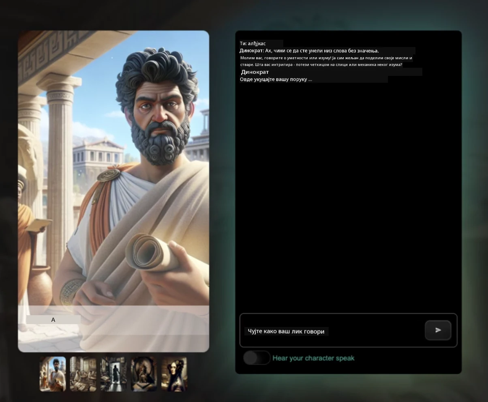
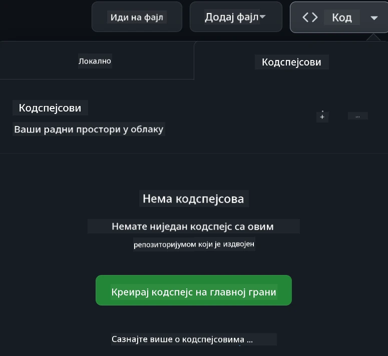

# Веб развој за почетнике - Наставни план

Научите основе веб развоја уз наш 12-недељни свеобухватни курс који воде Microsoft Cloud Advocates. Свака од 24 лекције улази у свет JavaScript-а, CSS-а и HTML-а кроз практичне пројекте као што су тераријуми, екстензије прегледача и свемирске игре. Укључите се у квизове, дискусије и практичне задатке. Побољшајте своје вештине и оптимизујте задржавање знања уз нашу ефикасну педагогију засновану на пројектима. Започните своје путовање у програмирању данас!

Придружите се заједници Azure AI Foundry на Discord-у

Следите ове кораке да бисте започели коришћење ових ресурса:
1. **Направите форк репозиторијума**: Кликните [](https://GitHub.com/microsoft/Web-Dev-For-Beginners/fork)
2. **Клонирајте репозиторијум**:   `git clone https://github.com/microsoft/Web-Dev-For-Beginners.git`
3. [**Придружите се Azure AI Foundry Discord-у и упознајте стручњаке и друге програмере**](https://discord.com/invite/ByRwuEEgH4)

### 🌐 Подршка за више језика

#### Подржано путем GitHub Action-а (аутоматски и увек ажурирано)

<!-- CO-OP TRANSLATOR LANGUAGES TABLE START -->
[арапски](../ar/README.md) | [бенгалски](../bn/README.md) | [бугарски](../bg/README.md) | [бурмански (Мјанмар)](../my/README.md) | [китайски (поједностављени)](../zh-CN/README.md) | [китайски (традиционални, Хонг Конг)](../zh-HK/README.md) | [китайски (традиционални, Макао)](../zh-MO/README.md) | [китайски (традиционални, Тајван)](../zh-TW/README.md) | [хрватски](../hr/README.md) | [чешки](../cs/README.md) | [дански](../da/README.md) | [холандски](../nl/README.md) | [естонски](../et/README.md) | [фински](../fi/README.md) | [француски](../fr/README.md) | [немачки](../de/README.md) | [грчки](../el/README.md) | [хебрејски](../he/README.md) | [хинди](../hi/README.md) | [мађарски](../hu/README.md) | [индонежански](../id/README.md) | [италијански](../it/README.md) | [јапански](../ja/README.md) | [каннада](../kn/README.md) | [корејски](../ko/README.md) | [литвански](../lt/README.md) | [малајски](../ms/README.md) | [малајалам](../ml/README.md) | [маратхи](../mr/README.md) | [непалски](../ne/README.md) | [нигеријски пидгин](../pcm/README.md) | [норвешки](../no/README.md) | [персијски (фарси)](../fa/README.md) | [пољски](../pl/README.md) | [португалски (Бразил)](../pt-BR/README.md) | [португалски (Португал)](../pt-PT/README.md) | [пунџаби (Гурмуки)](../pa/README.md) | [румунски](../ro/README.md) | [руски](../ru/README.md) | [српски (ћирилица)](./README.md) | [словачки](../sk/README.md) | [словеначки](../sl/README.md) | [шпански](../es/README.md) | [свахили](../sw/README.md) | [шведски](../sv/README.md) | [тагалог (филипински)](../tl/README.md) | [тамилски](../ta/README.md) | [телугу](../te/README.md) | [тајландски](../th/README.md) | [турски](../tr/README.md) | [украјински](../uk/README.md) | [урду](../ur/README.md) | [вијетнамски](../vi/README.md)

> **Више волите клон локално?**

> Овај репозиторијум садржи преко 50 превода, што значајно повећава величину преузимања. Да бисте клонирали без превода, користите sparse checkout:
> ```bash
> git clone --filter=blob:none --sparse https://github.com/microsoft/Web-Dev-For-Beginners.git
> cd Web-Dev-For-Beginners
> git sparse-checkout set --no-cone '/*' '!translations' '!translated_images'
> ```
> Ово вам даје све што вам је потребно да завршите курс са знатно бржим преузимањем.
<!-- CO-OP TRANSLATOR LANGUAGES TABLE END -->

**Ако желите да имате додатне језике превода, подржани су на овој страни [овде](https://github.com/Azure/co-op-translator/blob/main/getting_started/supported-languages.md)**

[](https://open.vscode.dev/microsoft/Web-Dev-For-Beginners)

#### 🧑‍🎓 _Јеси ли студент?_

Посети [**Студентску страницу**](https://docs.microsoft.com/learn/student-hub/?WT.mc_id=academic-77807-sagibbon) где ћеш пронаћи ресурсе за почетнике, студентске пакете, па чак и начине да добијеш бесплатан сертификат. Ово је страница коју треба да означиш као фаворита и повремено провераваш док месечно ажурирамо садржаје.

### 📣 Обавештење - Нови изазови GitHub Copilot Agent мода за завршетак!

Додат је нови изазов, потражи "GitHub Copilot Agent Challenge 🚀" у већини поглавља. То је нови изазов који треба да завршиш користећи GitHub Copilot и Agent мод. Ако раније ниси користио Agent мод, он осим генерисања текста може да креира и уређује фајлове, покреће команде и још много тога.

### 📣 Обавештење - _Нови пројекат за прављење уз помоћ генеративне вештачке интелигенције_

Додат је нови асистентски AI пројекат, провери га [пројекат](./9-chat-project/README.md)

### 📣 Обавештење - _Нови наставни план_ о генеративној AI на JavaScript-у управо је објављен

Не пропусти наш нови наставни план о генеративној AI!

Посети [https://aka.ms/genai-js-course](https://aka.ms/genai-js-course) да започнеш!


- Лекције које покривају све од основа до RAG.
- Интеракција са историјским ликовима уз помоћ GenAI и наше пратеће апликације.
- Забавно и занимљиво наративно искуство, путоваћеш кроз време!



Свака лекција укључује задатак за завршавање, проверу знања и изазов који ће ти помоћи да научиш теме као што су:
- Израђивање упита и инжењеринг упита
- Генерисање апликација за текст и слике
- Апликације за претраживање

Посети [https://aka.ms/genai-js-course](../../[https:/aka.ms/genai-js-course) да започнеш!


## 🌱 Започињање

> **Наставници**, укључили смо [неке предлоге](for-teachers.md) о томе како да користите овај наставни план. Волећемо ваше повратне информације [на нашем форуму за дискусију](https://github.com/microsoft/Web-Dev-For-Beginners/discussions/categories/teacher-corner)!

**[Ученици](https://aka.ms/student-page/?WT.mc_id=academic-77807-sagibbon)**, за сваку лекцију почнете са квизом пре предавања, а затим прочитајте материјал, завршите разне активности и проверите своје разумевање уз квиз након предавања.

Да бисте унапредили своје искуство учења, повежите се са својим колегама и радите на пројектима заједно! Дискусије су охрабрене на нашем [форуму за дискусију](https://github.com/microsoft/Web-Dev-For-Beginners/discussions) где ће тим модератора бити доступан да одговори на ваша питања.

За даље образовање, топло препоручујемо да истражите [Microsoft Learn](https://learn.microsoft.com/users/wirelesslife/collections/p1ddcy5jwy0jkm?WT.mc_id=academic-77807-sagibbon) за додатне материјале за учење.

### 📋 Постављање вашег окружења

Овај наставни план већ има спремно развојно окружење! Када кренеш, можеш да одабереш да покренеш наставни план у [Codespace-у](https://github.com/features/codespaces/) (_окружење засновано на прегледачу, без потребе за инсталацијом_), или локално на свом рачунару користећи текстуални едитор као што је [Visual Studio Code](https://code.visualstudio.com/?WT.mc_id=academic-77807-sagibbon).

#### Направи свој репозиторијум
Да бисте лако сачували свој рад, препоручујемо да направите своју копију овог репозиторијума. То можете учинити кликом на дугме **Use this template** на врху странице. Ово ће створити нови репозиторијум у вашем GitHub налогу са копијом овог наставног плана.

Пратите ове кораке:
1. **Направи форк репозиторијума**: Кликните на дугме "Fork" у горњем десном углу ове странице.
2. **Клонирај репозиторијум**:   `git clone https://github.com/microsoft/Web-Dev-For-Beginners.git`

#### Покретање наставног плана у Codespace-у

У копији репозиторијума коју сте направили, кликните дугме **Code** и одаберите **Open with Codespaces**. Ово ће направити нови Codespace у којем можете радити.



#### Покретање наставног плана локално на вашем рачунару

Да бисте покренули овај наставни план локално на рачунару, потребан вам је текстуални едитор, прегледач и алат за линију команди. Наша прва лекција, [Увод у програмске језике и алате заната](../../1-getting-started-lessons/1-intro-to-programming-languages), водиће вас кроз различите опције за сваки од ових алата да изаберете шта вам највише одговара.

Препорука је да користите [Visual Studio Code](https://code.visualstudio.com/?WT.mc_id=academic-77807-sagibbon) као едитор, који такође има уграђени [Терминал](https://code.visualstudio.com/docs/terminal/basics/?WT.mc_id=academic-77807-sagibbon). Visual Studio Code можете преузети [овде](https://code.visualstudio.com/?WT.mc_id=academic-77807-sagibbon).

1. Клонирајте свој репозиторијум на рачунар. То можете урадити кликом на дугме **Code** и копирањем URL-а:

    [CodeSpace](./images/createcodespace.png)
Затим, отворите [Terminal](https://code.visualstudio.com/docs/terminal/basics/?WT.mc_id=academic-77807-sagibbon) у оквиру [Visual Studio Code](https://code.visualstudio.com/?WT.mc_id=academic-77807-sagibbon) и покрените следећу команду, замењујући `<your-repository-url>` са УРЛ адресом коју сте управо копирали:

    ```bash 
    git clone <your-repository-url>
    ```

2. Отворите фасциклу у Visual Studio Code-у. То можете урадити кликом на **File** > **Open Folder** и избором фасцикле коју сте управо клонирали.


>  Препоручени Visual Studio Code додаци:
>
> * [Live Server](https://marketplace.visualstudio.com/items?itemName=ritwickdey.LiveServer&WT.mc_id=academic-77807-sagibbon) - за преглед HTML страница унутар Visual Studio Code-а
> * [Copilot](https://marketplace.visualstudio.com/items?itemName=GitHub.copilot&WT.mc_id=academic-77807-sagibbon) - да вам помогне да пишете код брже

## 📂 Свака лекција укључује:

- опциону скицноту
- опционални додатни видео
- пред-лекцијски квиз за загревање
- писану лекцију
- за пројектно засноване лекције, корак-по-корак упутства како да изградите пројекат
- провере знања
- изазов
- додатно читање
- задатак
- [пост-лекцијски квиз](https://ff-quizzes.netlify.app/web/)

> **Напомена о квизовима**: Сви квизови се налазе у фасцикли Quiz-app, укупно 48 квизова са по три питања. Доступни су [овде](https://ff-quizzes.netlify.app/web/), апликација за квизове може се покренути локално или поставити на Azure; пратите упутства у фасцикли `quiz-app`.

## 🗃️ Лекције

|     |                       Име пројекта                       |                            Концепти који се уче                             | Циљеви учења                                                                                                                 |                                                         Повезана лекција                                                          |         Аутор          |
| :-: | :------------------------------------------------------: | :--------------------------------------------------------------------: | ----------------------------------------------------------------------------------------------------------------------------------- | :----------------------------------------------------------------------------------------------------------------------------: | :---------------------: |
| 01  |                     Почетак рада                      |           Увод у програмирање и алате заната           | Научите основе које стоје иза већине програмских језика и о софтверу који помаже професионалним програмерима у њиховом раду | [Увод у програмске језике и алате заната](./1-getting-started-lessons/1-intro-to-programming-languages/README.md) |         Џасмин         |
| 02  |                     Почетак рада                      |             Основе GitHub-а, укључује рад у тиму             | Како користити GitHub у свом пројекту, како сарађивати са другима на кодној бази                                                    |                            [Увод у GitHub](./1-getting-started-lessons/2-github-basics/README.md)                             |          Флор          |
| 03  |                     Почетак рада                      |                             Приступачност                              | Научите основе веб приступачности                                                                                               |                       [Основе приступачности](./1-getting-started-lessons/3-accessibility/README.md)                       |       Кристофер       |
| 04  |                        Основе JS                         |                         Типови података у JavaScript-у                          | Основе типова података у JavaScript-у                                                                                                 |                                       [Типови података](./2-js-basics/1-data-types/README.md)                                        |         Џасмин         |
| 05  |                        Основе JS                         |                         Функције и методе                          | Научите о функцијама и методама за управљање логиком апликације                                                             |                              [Функције и методе](./2-js-basics/2-functions-methods/README.md)                               | Џасмин и Кристофер |
| 06  |                        Основе JS                         |                        Доношење одлука са JS-ом                        | Научите како да креирате услове у свом коду користећи методе доношења одлука                                                           |                                 [Доношење одлука](./2-js-basics/3-making-decisions/README.md)                                  |         Џасмин         |
| 07  |                        Основе JS                         |                            Низови и петље                            | Рад са подацима користећи низове и петље у JavaScript-у                                                                                 |                                   [Низови и петље](./2-js-basics/4-arrays-loops/README.md)                                    |         Џасмин         |
| 08  |       [Тераријум](./3-terrarium/solution/README.md)       |                            HTML у пракси                            | Изградите HTML за креирање онлајн тераријума, фокусирајући се на изградњу распореда                                                         |                                 [Увод у HTML](./3-terrarium/1-intro-to-html/README.md)                                 |           Џен           |
| 09  |       [Тераријум](./3-terrarium/solution/README.md)       |                            CSS у пракси                             | Изградите CSS за стилизовање онлајн тераријума, фокусирајући се на основе CSS укључујући прављење странице одзивном                     |                                  [Увод у CSS](./3-terrarium/2-intro-to-css/README.md)                                  |           Џен           |
| 10  |            [Тераријум](./3-terrarium/solution/README.md)            |                 JavaScript затварања, манипулација DOM-ом                  | Направите JavaScript који омогућава тераријуму да функционише као интерфејс за превлачење и испуштање, фокусирајући се на затварања и манипулацију DOM-ом             |                  [JavaScript затварања, манипулација DOM-ом](./3-terrarium/3-intro-to-DOM-and-closures/README.md)                   |           Џен           |
| 11  |          [Тастатурна игра](./4-typing-game/solution/README.md)          |                          Изградња тастатурне игре                           | Научите како да користите тастатурне догађаје за управљање логиком ваше JavaScript апликације                                                          |                                [Програмирање вођено догађајима](./4-typing-game/typing-game/README.md)                                |       Кристофер       |
| 12  | [Зелени проширење за прегледач](./5-browser-extension/solution/README.md) |                         Рад са прегледачима                          | Научите како прегледачи функционишу, њихову историју и како направити прве елементе проширења прегледача                               |                               [О прегледачима](./5-browser-extension/1-about-browsers/README.md)                                |           Џен           |
| 13  | [Зелени проширење за прегледач](./5-browser-extension/solution/README.md) | Изградња форме, позивање API-ја и чување променљивих у локалној меморији | Направите JavaScript елементе свог проширења прегледача за позивање API-ја користећи променљиве смештене у локалној меморији                      |                [API-ји, форме и локална меморија](./5-browser-extension/2-forms-browsers-local-storage/README.md)                 |           Џен           |
| 14  | [Зелени проширење за прегледач](./5-browser-extension/solution/README.md) |          Позадински процеси у прегледачу, веб перформансе          | Користите позадинске процесе прегледача за управљање иконом проширења; упознајте се са веб перформансама и неким оптимизацијама       |             [Позадински задаци и перформансе](./5-browser-extension/3-background-tasks-and-performance/README.md)              |           Џен           |
| 15  |           [Свемирска игра](./6-space-game/solution/README.md)           |             Напредније развијање игара са JavaScript-ом             | Учите о Наслеђивању коришћењем и Класа и Композиције и Pub/Sub обрасцу, као припрему за израду игре              |                      [Увод у напредни развој игара](./6-space-game/1-introduction/README.md)                       |          Крис          |
| 16  |           [Свемирска игра](./6-space-game/solution/README.md)           |                           Цртање на платну                            | Сазнајте о Canvas API-ју који се користи за цртање елемената на екрану                                                                       |                                [Цртање на платну](./6-space-game/2-drawing-to-canvas/README.md)                                |          Крис          |
| 17  |           [Свемирска игра](./6-space-game/solution/README.md)           |                   Померање елемената по екрану                    | Откријте како елементи могу добити кретање користећи картезијанске координате и Canvas API                                            |                           [Померање елемената](./6-space-game/3-moving-elements-around/README.md)                           |          Крис          |
| 18  |           [Свемирска игра](./6-space-game/solution/README.md)           |                          Детекција судара                           | Направите да се елементи сударе и реагују једни на друге користећи притиске тастера и обезбедите cooldown функцију за осигурање перформанси игре    |                              [Детекција судара](./6-space-game/4-collision-detection/README.md)                              |          Крис          |
| 19  |           [Свемирска игра](./6-space-game/solution/README.md)           |                             Вођење резултата                              | Извршите математичке прорачунe на основу статуса и перформанси игре                                                                |                                    [Вођење резултата](./6-space-game/5-keeping-score/README.md)                                    |          Крис          |
| 20  |           [Свемирска игра](./6-space-game/solution/README.md)           |                     Завршавање и поновно покретање игре                     | Научите о завршетку и поновном покретању игре, укључујући чишћење ресурса и ресетовање вредности променљивих                              |                                [Услов за завршетак](./6-space-game/6-end-condition/README.md)                                 |          Крис          |
| 21  |         [Банкарска апликација](./7-bank-project/solution/README.md)          |                 HTML шаблони и руте у веб апликацији                 | Научите како да направите основу архитектуре мултистраничног веб сајта користећи рутирање и HTML шаблоне                             |                            [HTML шаблони и руте](./7-bank-project/1-template-route/README.md)                             |          Јохан          |
| 22  |         [Банкарска апликација](./7-bank-project/solution/README.md)          |                  Изградња форме за пријаву и регистрацију                   | Научите о изградњи форми и руковању валидацијом                                                                          |                                           [Форме](./7-bank-project/2-forms/README.md)                                           |          Јохан          |
| 23  |         [Банкарска апликација](./7-bank-project/solution/README.md)          |                   Методе преузимања и коришћења података                   | Како подаци улазе и излазе из ваше апликације, како их преузимати, чувати и уклањати                                                 |                                            [Подаци](./7-bank-project/3-data/README.md)                                            |          Јохан          |
| 24  |         [Банкарска апликација](./7-bank-project/solution/README.md)          |                      Концепти управљања стањем                      | Научите како ваша апликација задржава стање и како управљати њиме програмски                                                              |                                [Управљање стањем](./7-bank-project/4-state-management/README.md)                                |          Јохан          |
| 25 | [Browser/VScode Code](../../8-code-editor) | Рад са VScode | Научите како да користите уређивач кода| [Коришћење VScode уређивача кода](./8-code-editor/1-using-a-code-editor/README.md) | Крис |
| 26 | [AI Assistants](./9-chat-project/README.md) | Рад са вештачком интелигенцијом | Научите како да направите свог сопственог AI помоћника | [Пројекат AI помоћник](./9-chat-project/README.md) | Крис |

## 🏫 Педагогија

Наш програм је дизајниран са два кључна педагошка принципа на уму:
* учење засновано на пројектима
* чести квизови

Програм учи основе JavaScript-а, HTML-а и CSS-а, као и најновије алате и технике које данашњи веб програмери користе. Студенти ће имати прилику да стекну практично искуство израдом тастатурне игре, виртуелног тераријума, еколошки прихватљивог проширења за прегледач, игре у стилу свемирског инвадера и банкарске апликације за предузећа. До краја серије, студенти ће стећи чврсто разумевање веб развоја.

> 🎓 Прве неколико лекција у овом курикулуму можете проћи као [Learn Path](https://docs.microsoft.com/learn/paths/web-development-101/?WT.mc_id=academic-77807-sagibbon) на Microsoft Learn!

Осигуравањем да садржај одговара пројектима, процес је учињен занимљивијим за студенте и повећава задржавање концепата. Такође смо написали неколико почетних лекција о основама JavaScript-а да бисмо увели концепте, упарених са видеом из збирке видео туторијала "[Серија за почетнике: JavaScript](https://channel9.msdn.com/Series/Beginners-Series-to-JavaScript/?WT.mc_id=academic-77807-sagibbon)", чији су неки аутори допринели овом курикулуму.

Поред тога, квиз са малим улогом пре часа поставља намераву студента према учењу теме, док други квиз после часа обезбеђује даље задржавање. Овај курикулум је осмишљен да буде флексибилан и забаван и може се похађати у целини или делимично. Пројекти почињу мали и постају све сложенији до краја циклуса од 12 недеља.

Док смо свесно избегавали увођење JavaScript фрејмворка како бисмо се концентрисали на основне вештине потребне као веб програмер пре усвајања фрејмворка, добар следећи корак након завршетка овог курикулума био би учење о Node.js-у кроз другу збирку видео снимака: "[Серија за почетнике: Node.js](https://channel9.msdn.com/Series/Beginners-Series-to-Nodejs/?WT.mc_id=academic-77807-sagibbon)".

> Посетите наше смернице [Code of Conduct](CODE_OF_CONDUCT.md) и [Contributing](CONTRIBUTING.md). Добро дошли су ваши конструктивни предлози!


## 🧭 Приступ ван мреже

Ову документацију можете покренути ван мреже користећи [Docsify](https://docsify.js.org/#/). Форкујте овај репозиторијум, [инсталирајте Docsify](https://docsify.js.org/#/quickstart) на свом локалном уређају, а затим у коренској фасцикли овог репозиторијума откуцајте `docsify serve`. Веб сајт ће се послужити на порту 3000 на вашем локалном хосту: `localhost:3000`.

## 📘 PDF

PDF свих лекција можете пронаћи [овде](https://microsoft.github.io/Web-Dev-For-Beginners/pdf/readme.pdf).


## 🎒 Остали курсеви
Наш тим производи и друге курсеве! Погледајте:

<!-- CO-OP TRANSLATOR OTHER COURSES START -->
### LangChain
[](https://aka.ms/langchain4j-for-beginners)
[](https://aka.ms/langchainjs-for-beginners?WT.mc_id=m365-94501-dwahlin)

---

### Azure / Edge / MCP / Agents
[](https://github.com/microsoft/AZD-for-beginners?WT.mc_id=academic-105485-koreyst)
[](https://github.com/microsoft/edgeai-for-beginners?WT.mc_id=academic-105485-koreyst)
[](https://github.com/microsoft/mcp-for-beginners?WT.mc_id=academic-105485-koreyst)
[](https://github.com/microsoft/ai-agents-for-beginners?WT.mc_id=academic-105485-koreyst)

---
 
### Серии генеративне вештачке интелигенције
[](https://github.com/microsoft/generative-ai-for-beginners?WT.mc_id=academic-105485-koreyst)
[-9333EA?style=for-the-badge&labelColor=E5E7EB&color=9333EA)](https://github.com/microsoft/Generative-AI-for-beginners-dotnet?WT.mc_id=academic-105485-koreyst)
[-C084FC?style=for-the-badge&labelColor=E5E7EB&color=C084FC)](https://github.com/microsoft/generative-ai-for-beginners-java?WT.mc_id=academic-105485-koreyst)
[-E879F9?style=for-the-badge&labelColor=E5E7EB&color=E879F9)](https://github.com/microsoft/generative-ai-with-javascript?WT.mc_id=academic-105485-koreyst)

---
 
### Основно учење
[](https://aka.ms/ml-beginners?WT.mc_id=academic-105485-koreyst)
[](https://aka.ms/datascience-beginners?WT.mc_id=academic-105485-koreyst)
[](https://aka.ms/ai-beginners?WT.mc_id=academic-105485-koreyst)
[](https://github.com/microsoft/Security-101?WT.mc_id=academic-96948-sayoung)
[](https://aka.ms/webdev-beginners?WT.mc_id=academic-105485-koreyst)
[](https://aka.ms/iot-beginners?WT.mc_id=academic-105485-koreyst)
[](https://github.com/microsoft/xr-development-for-beginners?WT.mc_id=academic-105485-koreyst)

---
 
### Серии Ко-пилота
[](https://aka.ms/GitHubCopilotAI?WT.mc_id=academic-105485-koreyst)
[](https://github.com/microsoft/mastering-github-copilot-for-dotnet-csharp-developers?WT.mc_id=academic-105485-koreyst)
[](https://github.com/microsoft/CopilotAdventures?WT.mc_id=academic-105485-koreyst)
<!-- CO-OP TRANSLATOR OTHER COURSES END -->

## Помоћ

Ако запнете или имате било каквих питања о изградњи AI апликација, прикључите се другим ученицима и искусним програмерима у дискусијама о MCP. То је подржавајућа заједница у којој су питања добродошла и знање се слободно дели.

[](https://discord.gg/nTYy5BXMWG)

Ако имате повратне информације о производу или наиђете на грешке током израде, посетите:

[](https://aka.ms/foundry/forum)

## Лиценца

Овај репозиторијум је лиценциран под MIT лиценцом. Погледајте датотеку [LICENSE](../../LICENSE) за више информација.

---

<!-- CO-OP TRANSLATOR DISCLAIMER START -->
**Одрицање одговорности**:
Овај документ је преведен коришћењем AI услуге за превођење [Co-op Translator](https://github.com/Azure/co-op-translator). Иако се трудимо да превод буде тачан, имајте у виду да аутоматски преводи могу садржавати грешке или нетачности. Оригинални документ на његовом изворном језику треба сматрати ауторитетним извором. За критичне информације препоручује се професионални превод од стране људи. Не сносимо одговорност за било каква неспоразума или погрешна тумачења настала коришћењем овог превода.
<!-- CO-OP TRANSLATOR DISCLAIMER END -->