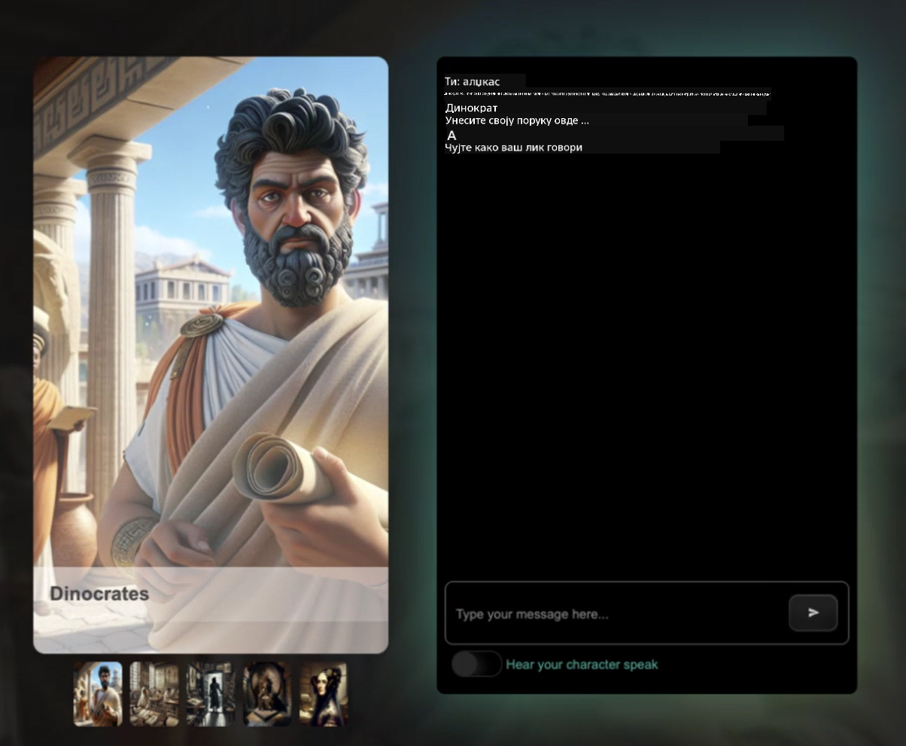

<!--
CO_OP_TRANSLATOR_METADATA:
{
  "original_hash": "8b9d0562ea649b6012d1a67acc630681",
  "translation_date": "2025-10-24T23:00:35+00:00",
  "source_file": "README.md",
  "language_code": "sr"
}
-->
[](https://github.com/microsoft/Web-Dev-For-Beginners/blob/master/LICENSE)
[](https://GitHub.com/microsoft/Web-Dev-For-Beginners/graphs/contributors/)
[](https://GitHub.com/microsoft/Web-Dev-For-Beginners/issues/)
[](https://GitHub.com/microsoft/Web-Dev-For-Beginners/pulls/)
[](http://makeapullrequest.com)

[](https://GitHub.com/microsoft/Web-Dev-For-Beginners/watchers/)
[](https://GitHub.com/microsoft/Web-Dev-For-Beginners/network/)
[](https://GitHub.com/microsoft/Web-Dev-For-Beginners/stargazers/)

[](https://discord.gg/zxKYvhSnVp?WT.mc_id=academic-000002-leestott)

# Веб развој за почетнике - Курикулум

Научите основе веб развоја уз наш свеобухватни 12-недељни курс који су креирали Microsoft Cloud Advocates. Свака од 24 лекције обухвата JavaScript, CSS и HTML кроз практичне пројекте као што су тераријуми, екстензије за претраживач и свемирске игре. Укључите се у квизове, дискусије и практичне задатке. Унапредите своје вештине и оптимизујте задржавање знања уз нашу ефикасну педагогију засновану на пројектима. Започните своје путовање у свет програмирања већ данас!

Придружите се Azure AI Foundry Discord заједници

[](https://discord.com/invite/ByRwuEEgH4)

Пратите ове кораке да бисте започели коришћење ових ресурса:
1. **Fork-ујте репозиторијум**: Кликните [](https://GitHub.com/microsoft/Web-Dev-For-Beginners/fork)
2. **Клонирајте репозиторијум**:   `git clone https://github.com/microsoft/Web-Dev-For-Beginners.git`
3. [**Придружите се Azure AI Foundry Discord и упознајте стручњаке и друге програмере**](https://discord.com/invite/ByRwuEEgH4)

### 🌐 Подршка за више језика

#### Подржано преко GitHub Action (аутоматски и увек ажурирано)

<!-- CO-OP TRANSLATOR LANGUAGES TABLE START -->
[Арапски](../ar/README.md) | [Бенгалски](../bn/README.md) | [Бугарски](../bg/README.md) | [Бурмански (Мјанмар)](../my/README.md) | [Кинески (поједностављени)](../zh/README.md) | [Кинески (традиционални, Хонг Конг)](../hk/README.md) | [Кинески (традиционални, Макао)](../mo/README.md) | [Кинески (традиционални, Тајван)](../tw/README.md) | [Хрватски](../hr/README.md) | [Чешки](../cs/README.md) | [Дански](../da/README.md) | [Холандски](../nl/README.md) | [Естонски](../et/README.md) | [Фински](../fi/README.md) | [Француски](../fr/README.md) | [Немачки](../de/README.md) | [Грчки](../el/README.md) | [Хебрејски](../he/README.md) | [Хинди](../hi/README.md) | [Мађарски](../hu/README.md) | [Индонежански](../id/README.md) | [Италијански](../it/README.md) | [Јапански](../ja/README.md) | [Корејски](../ko/README.md) | [Литвански](../lt/README.md) | [Малајски](../ms/README.md) | [Марати](../mr/README.md) | [Непалски](../ne/README.md) | [Норвешки](../no/README.md) | [Персијски (фарси)](../fa/README.md) | [Пољски](../pl/README.md) | [Португалски (Бразил)](../br/README.md) | [Португалски (Португал)](../pt/README.md) | [Пенџапски (Гурмуки)](../pa/README.md) | [Румунски](../ro/README.md) | [Руски](../ru/README.md) | [Српски (ћирилица)](./README.md) | [Словачки](../sk/README.md) | [Словеначки](../sl/README.md) | [Шпански](../es/README.md) | [Свахили](../sw/README.md) | [Шведски](../sv/README.md) | [Тагалог (Филипински)](../tl/README.md) | [Тамилски](../ta/README.md) | [Тајландски](../th/README.md) | [Турски](../tr/README.md) | [Украјински](../uk/README.md) | [Урду](../ur/README.md) | [Вијетнамски](../vi/README.md)
<!-- CO-OP TRANSLATOR LANGUAGES TABLE END -->

**Ако желите да се подрже додатни језици, списак је доступан [овде](https://github.com/Azure/co-op-translator/blob/main/getting_started/supported-languages.md)**

[](https://open.vscode.dev/microsoft/Web-Dev-For-Beginners)

#### 🧑‍🎓 _Да ли сте студент?_

Посетите [**Student Hub страницу**](https://docs.microsoft.com/learn/student-hub/?WT.mc_id=academic-77807-sagibbon) где ћете пронаћи ресурсе за почетнике, студентске пакете, па чак и начине да добијете бесплатан ваучер за сертификат. Ово је страница коју треба да сачувате и повремено проверавате, јер се садржај мења сваког месеца.

### 📣 Обавештење - Нови изазови са GitHub Copilot Agent модом!

Додат је нови изазов, потражите "GitHub Copilot Agent Challenge 🚀" у већини поглавља. То је нови изазов за вас који треба да завршите користећи GitHub Copilot и Agent мод. Ако раније нисте користили Agent мод, он је способан не само да генерише текст, већ и да креира и уређује фајлове, извршава команде и још много тога.

### 📣 Обавештење - _Нови пројекат за креирање уз помоћ генеративне вештачке интелигенције_

Додат је нови пројекат AI асистента, погледајте [пројекат](./09-chat-project/README.md)

### 📣 Обавештење - _Нови курикулум_ о генеративној вештачкој интелигенцији за JavaScript је управо објављен

Не пропустите наш нови курикулум о генеративној вештачкој интелигенцији!

Посетите [https://aka.ms/genai-js-course](https://aka.ms/genai-js-course) да започнете!


- Лекције које покривају све, од основа до RAG.
- Интеракција са историјским личностима уз помоћ GenAI и наше пратеће апликације.
- Забавна и ангажујућа нарација, путоваћете кроз време!



Свака лекција укључује задатак за завршетак, проверу знања и изазов који ће вас водити кроз учење тема као што су:
- Креирање упита и инжењеринг упита
- Генерисање апликација за текст и слике
- Апликације за претрагу

Посетите [https://aka.ms/genai-js-course](../../[https:/aka.ms/genai-js-course) да започнете!


## 🌱 Почетак

> **Наставници**, [укључили смо неке предлоге](for-teachers.md) о томе како да користите овај курикулум. Волели бисмо да чујемо ваше повратне информације [у нашем форуму за дискусију](https://github.com/microsoft/Web-Dev-For-Beginners/discussions/categories/teacher-corner)!

**[Ученици](https://aka.ms/student-page/?WT.mc_id=academic-77807-sagibbon)**, за сваку лекцију, започните са квизом пре предавања, наставите са читањем материјала за предавање, завршите разне активности и проверите своје разумевање кроз квиз након предавања.

Да бисте побољшали своје искуство учења, повежите се са својим вршњацима како бисте заједно радили на пројектима! Дискусије су охрабрене у нашем [форуму за дискусију](https://github.com/microsoft/Web-Dev-For-Beginners/discussions) где ће наш тим модератора бити доступан да одговори на ваша питања.

Да бисте додатно унапредили своје образовање, топло препоручујемо да истражите [Microsoft Learn](https://learn.microsoft.com/users/wirelesslife/collections/p1ddcy5jwy0jkm?WT.mc_id=academic-77807-sagibbon) за додатне материјале за учење.

### 📋 Постављање вашег окружења

Овај курикулум има спремно окружење за развој! Када започнете, можете изабрати да покренете курикулум у [Codespace](https://github.com/features/codespaces/) (_окружење засновано на претраживачу, без потребе за инсталацијом_), или локално на вашем рачунару користећи текст едитор као што је [Visual Studio Code](https://code.visualstudio.com/?WT.mc_id=academic-77807-sagibbon).

#### Креирајте свој репозиторијум
Да бисте лако сачували свој рад, препоручујемо да креирате своју копију овог репозиторијума. То можете урадити кликом на дугме **Use this template** на врху странице. Ово ће креирати нови репозиторијум на вашем GitHub налогу са копијом курикулума.

Пратите ове кораке:
1. **Fork-ујте репозиторијум**: Кликните на дугме "Fork" у горњем десном углу ове странице.
2. **Клонирајте репозиторијум**:   `git clone https://github.com/microsoft/Web-Dev-For-Beginners.git`

#### Покретање курикулума у Codespace-у

У вашој копији овог репозиторијума који сте креирали, кликните на дугме **Code** и изаберите **Open with Codespaces**. Ово ће креирати нови Codespace за вас у коме можете радити.


#### Покретање курикулума локално на вашем рачунару

Да бисте покренули овај курикулум локално на вашем рачунару, биће вам потребан текст едитор, претраживач и алат за командну линију. Наша прва лекција, [Увод у програмске језике и алате](../../1-getting-started-lessons/1-intro-to-programming-languages), ће вас провести кроз разне опције за сваки од ових алата како бисте изабрали оно што вам највише одговара.

Наша препорука је да користите [Visual Studio Code](https://code.visualstudio.com/?WT.mc_id=academic-77807-sagibbon) као ваш едитор, који такође има уграђен [Терминал](https://code.visualstudio.com/docs/terminal/basics/?WT.mc_id=academic-77807-sagibbon). Можете преузети Visual Studio Code [овде](https://code.visualstudio.com/?WT.mc_id=academic-77807-sagibbon).


1. Клонирајте свој репозиторијум на ваш рачунар. То можете урадити кликом на дугме **Code** и копирањем URL-а:

    [CodeSpace](./images/createcodespace.png)

    Затим, отворите [Терминал](https://code.visualstudio.com/docs/terminal/basics/?WT.mc_id=academic-77807-sagibbon) унутар [Visual Studio Code](https://code.visualstudio.com/?WT.mc_id=academic-77807-sagibbon) и покрените следећу команду, замењујући `<your-repository-url>` са URL-ом који сте управо копирали:

    ```bash 
    git clone <your-repository-url>
    ```

2. Отворите фасциклу у Visual Studio Code. То можете урадити кликом на **File** > **Open Folder** и одабиром фасцикле коју сте управо клонирали.


>  Препоручени додатци за Visual Studio Code:
>
> * [Live Server](https://marketplace.visualstudio.com/items?itemName=ritwickdey.LiveServer&WT.mc_id=academic-77807-sagibbon) - za pregled HTML stranica unutar Visual Studio Code-a
> * [Copilot](https://marketplace.visualstudio.com/items?itemName=GitHub.copilot&WT.mc_id=academic-77807-sagibbon) - za brže pisanje koda

## 📂 Svaka lekcija uključuje:

- opcionalnu sketchnote
- opcionalni dodatni video
- kviz za zagrevanje pre lekcije
- pisanu lekciju
- za lekcije zasnovane na projektima, vodiče korak po korak kako izgraditi projekat
- provere znanja
- izazov
- dodatno čitanje
- zadatak
- [kviz nakon lekcije](https://ff-quizzes.netlify.app/web/)

> **Napomena o kvizovima**: Svi kvizovi se nalaze u folderu Quiz-app, ukupno 48 kvizova sa po tri pitanja. Dostupni su [ovde](https://ff-quizzes.netlify.app/web/), aplikacija za kviz može se pokrenuti lokalno ili postaviti na Azure; pratite uputstva u folderu `quiz-app`.

## 🗃️ Lekcije

|     |                       Naziv projekta                       |                            Naučeni koncepti                             | Ciljevi učenja                                                                                                                 |                                                         Povezana lekcija                                                          |         Autor          |
| :-: | :------------------------------------------------------: | :--------------------------------------------------------------------: | ----------------------------------------------------------------------------------------------------------------------------------- | :----------------------------------------------------------------------------------------------------------------------------: | :---------------------: |
| 01  |                     Početak                      |           Uvod u programiranje i alati za rad           | Naučite osnovne principe većine programskih jezika i o softveru koji pomaže profesionalnim programerima u njihovom poslu | [Uvod u programske jezike i alate za rad](./1-getting-started-lessons/1-intro-to-programming-languages/README.md) |         Jasmine         |
| 02  |                     Početak                      |             Osnove GitHub-a, uključujući rad u timu             | Kako koristiti GitHub u vašem projektu, kako sarađivati sa drugima na kodnoj bazi                                                    |                            [Uvod u GitHub](./1-getting-started-lessons/2-github-basics/README.md)                             |          Floor          |
| 03  |                     Početak                      |                             Pristupačnost                              | Naučite osnove web pristupačnosti                                                                                               |                       [Osnove pristupačnosti](./1-getting-started-lessons/3-accessibility/README.md)                       |       Christopher       |
| 04  |                        Osnove JS                         |                         Tipovi podataka u JavaScript-u                          | Osnove tipova podataka u JavaScript-u                                                                                                 |                                       [Tipovi podataka](./2-js-basics/1-data-types/README.md)                                        |         Jasmine         |
| 05  |                        Osnove JS                         |                         Funkcije i metode                          | Naučite o funkcijama i metodama za upravljanje logikom aplikacije                                                             |                              [Funkcije i metode](./2-js-basics/2-functions-methods/README.md)                               | Jasmine i Christopher |
| 06  |                        Osnove JS                         |                        Donošenje odluka u JS                        | Naučite kako kreirati uslove u vašem kodu koristeći metode za donošenje odluka                                                           |                                 [Donošenje odluka](./2-js-basics/3-making-decisions/README.md)                                  |         Jasmine         |
| 07  |                        Osnove JS                         |                            Nizovi i petlje                            | Rad sa podacima koristeći nizove i petlje u JavaScript-u                                                                                 |                                   [Nizovi i petlje](./2-js-basics/4-arrays-loops/README.md)                                    |         Jasmine         |
| 08  |       [Terarijum](./3-terrarium/solution/README.md)       |                            HTML u praksi                            | Kreirajte HTML za izradu online terarijuma, fokusirajući se na izradu rasporeda                                                         |                                 [Uvod u HTML](./3-terrarium/1-intro-to-html/README.md)                                 |           Jen           |
| 09  |       [Terarijum](./3-terrarium/solution/README.md)       |                            CSS u praksi                             | Kreirajte CSS za stilizovanje online terarijuma, fokusirajući se na osnove CSS-a uključujući pravljenje responzivne stranice                     |                                  [Uvod u CSS](./3-terrarium/2-intro-to-css/README.md)                                  |           Jen           |
| 10  |            [Terarijum](./3-terrarium/solution/README.md)            |                 JavaScript zatvaranja, manipulacija DOM-a                  | Kreirajte JavaScript kako bi terarijum funkcionisao kao interfejs za prevlačenje i ispuštanje, fokusirajući se na zatvaranja i manipulaciju DOM-a             |                  [JavaScript zatvaranja, manipulacija DOM-a](./3-terrarium/3-intro-to-DOM-and-closures/README.md)                   |           Jen           |
| 11  |          [Igra kucanja](./4-typing-game/solution/README.md)          |                          Kreiranje igre kucanja                           | Naučite kako koristiti događaje tastature za upravljanje logikom vaše JavaScript aplikacije                                                          |                                [Programiranje vođeno događajima](./4-typing-game/typing-game/README.md)                                |       Christopher       |
| 12  | [Ekstenzija za zeleni pretraživač](./5-browser-extension/solution/README.md) |                         Rad sa pretraživačima                          | Naučite kako pretraživači funkcionišu, njihovu istoriju i kako postaviti osnovne elemente ekstenzije za pretraživač                               |                               [O pretraživačima](./5-browser-extension/1-about-browsers/README.md)                                |           Jen           |
| 13  | [Ekstenzija za zeleni pretraživač](./5-browser-extension/solution/README.md) | Kreiranje forme, pozivanje API-ja i čuvanje promenljivih u lokalnom skladištu | Kreirajte JavaScript elemente vaše ekstenzije za pretraživač kako biste pozvali API koristeći promenljive sačuvane u lokalnom skladištu                      |                [API-ji, forme i lokalno skladište](./5-browser-extension/2-forms-browsers-local-storage/README.md)                 |           Jen           |
| 14  | [Ekstenzija za zeleni pretraživač](./5-browser-extension/solution/README.md) |          Pozadinski procesi u pretraživaču, web performanse          | Koristite pozadinske procese pretraživača za upravljanje ikonom ekstenzije; naučite o web performansama i nekim optimizacijama   |             [Pozadinski zadaci i performanse](./5-browser-extension/3-background-tasks-and-performance/README.md)              |           Jen           |
| 15  |           [Svemirska igra](./6-space-game/solution/README.md)           |             Napredniji razvoj igara sa JavaScript-om             | Naučite o nasleđivanju koristeći klase i kompoziciju, kao i o Pub/Sub šablonu, kao pripremu za izradu igre              |                      [Uvod u napredni razvoj igara](./6-space-game/1-introduction/README.md)                       |          Chris          |
| 16  |           [Svemirska igra](./6-space-game/solution/README.md)           |                           Crtanje na platnu                            | Naučite o Canvas API-ju, koji se koristi za crtanje elemenata na ekranu                                                                       |                                [Crtanje na platnu](./6-space-game/2-drawing-to-canvas/README.md)                                |          Chris          |
| 17  |           [Svemirska igra](./6-space-game/solution/README.md)           |                   Pomicanje elemenata po ekranu                    | Otkrijte kako elementi mogu dobiti pokret koristeći kartezijanske koordinate i Canvas API                                            |                           [Pomicanje elemenata](./6-space-game/3-moving-elements-around/README.md)                           |          Chris          |
| 18  |           [Svemirska igra](./6-space-game/solution/README.md)           |                          Detekcija sudara                           | Omogućite sudaranje elemenata i njihovu međusobnu reakciju koristeći pritiske na tastaturi i obezbedite funkciju hlađenja za performanse igre    |                              [Detekcija sudara](./6-space-game/4-collision-detection/README.md)                              |          Chris          |
| 19  |           [Svemirska igra](./6-space-game/solution/README.md)           |                             Brojanje poena                              | Izvršite matematičke proračune na osnovu statusa i performansi igre                                                                |                                    [Brojanje poena](./6-space-game/5-keeping-score/README.md)                                    |          Chris          |
| 20  |           [Svemirska igra](./6-space-game/solution/README.md)           |                     Završavanje i ponovno pokretanje igre                     | Naučite o završavanju i ponovnom pokretanju igre, uključujući čišćenje resursa i resetovanje vrednosti promenljivih                              |                                [Završni uslov](./6-space-game/6-end-condition/README.md)                                 |          Chris          |
| 21  |         [Bankarska aplikacija](./7-bank-project/solution/README.md)          |                 HTML šabloni i rute u web aplikaciji                 | Naučite kako kreirati osnovu arhitekture veb sajta sa više stranica koristeći rute i HTML šablone                             |                            [HTML šabloni i rute](./7-bank-project/1-template-route/README.md)                             |          Yohan          |
| 22  |         [Bankarska aplikacija](./7-bank-project/solution/README.md)          |                  Kreiranje forme za prijavu i registraciju                   | Naučite kako kreirati forme i rukovati procedurama validacije rutina                                                                          |                                           [Forme](./7-bank-project/2-forms/README.md)                                           |          Yohan          |
| 23  |         [Bankarska aplikacija](./7-bank-project/solution/README.md)          |                   Metode za preuzimanje i korišćenje podataka                   | Kako podaci teku u i iz vaše aplikacije, kako ih preuzeti, sačuvati i obraditi                                                 |                                            [Podaci](./7-bank-project/3-data/README.md)                                            |          Yohan          |
| 24  |         [Bankarska aplikacija](./7-bank-project/solution/README.md)          |                      Koncepti upravljanja stanjem                      | Naučite kako vaša aplikacija zadržava stanje i kako ga programerski upravljati                                                              |                                [Upravljanje stanjem](./7-bank-project/4-state-management/README.md)                                |          Yohan          |
| 25 | [Pretraživač/VScode kod](../../8-code-editor) | Rad sa VScode-om | Naučite kako koristiti editor koda| [Koristite VScode editor koda](./8-code-editor/1-using-a-code-editor/README.md) | Chris |
| 26 | [AI asistenti](./9-chat-project/README.md) | Rad sa AI | Naučite kako kreirati sopstvenog AI asistenta | [Projekat AI asistenta](./9-chat-project/README.md) | Chris |

## 🏫 Pedagogija

Naš kurikulum je dizajniran sa dva ključna pedagoška principa:
* učenje zasnovano na projektima
* česti kvizovi

Program podučava osnove JavaScript-a, HTML-a i CSS-a, kao i najnovije alate i tehnike koje koriste današnji web programeri. Studenti će imati priliku da steknu praktično iskustvo kroz izradu igre kucanja, virtuelnog terarijuma, ekološke ekstenzije za pretraživač, igre u stilu svemirskih invazija i bankarske aplikacije za preduzeća. Na kraju serije, studenti će steći solidno razumevanje web razvoja.

> 🎓 Prve lekcije iz ovog kurikuluma možete pohađati kao [Put učenja](https://docs.microsoft.com/learn/paths/web-development-101/?WT.mc_id=academic-77807-sagibbon) na Microsoft Learn!

Osiguravanjem da sadržaj bude usklađen sa projektima, proces učenja postaje zanimljiviji za studente, a zadržavanje koncepta se povećava. Takođe smo napisali nekoliko početnih lekcija o osnovama JavaScript-a kako bismo uveli koncepte, u kombinaciji sa video zapisima iz kolekcije "[Serija za početnike: JavaScript](https://channel9.msdn.com/Series/Beginners-Series-to-JavaScript/?WT.mc_id=academic-77807-sagibbon)", čiji su neki autori doprineli ovom kurikulumu.

Pored toga, kviz sa niskim rizikom pre časa postavlja nameru studenta prema učenju teme, dok drugi kviz nakon časa osigurava dalju retenciju. Ovaj kurikulum je dizajniran da bude fleksibilan i zabavan i može se pohađati u celini ili delimično. Projekti počinju mali i postaju sve složeniji do kraja 12-nedeljnog ciklusa.

Iako smo namerno izbegli uvođenje JavaScript okvira kako bismo se koncentrisali na osnovne veštine potrebne kao web programer pre usvajanja okvira, dobar sledeći korak nakon završetka ovog kurikuluma bio bi učenje o Node.js-u putem druge kolekcije video zapisa: "[Serija za početnike: Node.js](https://channel9.msdn.com/Series/Beginners-Series-to-Nodejs/?WT.mc_id=academic-77807-sagibbon)".

> Posetite naš [Kodeks ponašanja](CODE_OF_CONDUCT.md) i smernice za [Doprinos](CONTRIBUTING.md). Cenimo vaše konstruktivne povratne informacije!


## 🧭 Pristup van mreže

Možete pokrenuti ovu dokumentaciju van mreže koristeći [Docsify](https://docsify.js.org/#/). Forkujte ovaj repo, [instalirajte Docsify](https://docsify.js.org/#/quickstart) na vašem lokalnom računaru, a zatim u root folderu ovog repo-a, ukucajte `docsify serve`. Veb-sajt će biti poslužen na portu 3000 na vašem localhost-u: `localhost:3000`.

## 📘 PDF

PDF svih lekcija možete pronaći [ovde](https://microsoft.github.io/Web-Dev-For-Beginners/pdf/readme.pdf).


## 🎒 Ostali kursevi

Naš tim proizvodi i druge kurseve! Pogledajte:

### Azure / Edge / MCP / Agents
[](https://github.com/microsoft/AZD-for-beginners?WT.mc_id=academic-105485-koreyst)
[](https://github.com/microsoft/edgeai-for-beginners?WT.mc_id=academic-105485-koreyst)  
[](https://github.com/microsoft/mcp-for-beginners?WT.mc_id=academic-105485-koreyst)  
[](https://github.com/microsoft/ai-agents-for-beginners?WT.mc_id=academic-105485-koreyst)  

---

### Serija o generativnoj veštačkoj inteligenciji  
[](https://github.com/microsoft/generative-ai-for-beginners?WT.mc_id=academic-105485-koreyst)  
[-9333EA?style=for-the-badge&labelColor=E5E7EB&color=9333EA)](https://github.com/microsoft/Generative-AI-for-beginners-dotnet?WT.mc_id=academic-105485-koreyst)  
[-C084FC?style=for-the-badge&labelColor=E5E7EB&color=C084FC)](https://github.com/microsoft/generative-ai-for-beginners-java?WT.mc_id=academic-105485-koreyst)  
[-E879F9?style=for-the-badge&labelColor=E5E7EB&color=E879F9)](https://github.com/microsoft/generative-ai-with-javascript?WT.mc_id=academic-105485-koreyst)  

---

### Osnovno učenje  
[](https://aka.ms/ml-beginners?WT.mc_id=academic-105485-koreyst)  
[](https://aka.ms/datascience-beginners?WT.mc_id=academic-105485-koreyst)  
[](https://aka.ms/ai-beginners?WT.mc_id=academic-105485-koreyst)  
[](https://github.com/microsoft/Security-101?WT.mc_id=academic-96948-sayoung)  
[](https://aka.ms/webdev-beginners?WT.mc_id=academic-105485-koreyst)  
[](https://aka.ms/iot-beginners?WT.mc_id=academic-105485-koreyst)  
[](https://github.com/microsoft/xr-development-for-beginners?WT.mc_id=academic-105485-koreyst)  

---

### Serija o Copilot-u  
[](https://aka.ms/GitHubCopilotAI?WT.mc_id=academic-105485-koreyst)  
[](https://github.com/microsoft/mastering-github-copilot-for-dotnet-csharp-developers?WT.mc_id=academic-105485-koreyst)  
[](https://github.com/microsoft/CopilotAdventures?WT.mc_id=academic-105485-koreyst)  
<!-- CO-OP TRANSLATOR OTHER COURSES END -->

## Dobijanje pomoći  

Ako se zaglavite ili imate pitanja o izradi AI aplikacija, pridružite se:  

[](https://aka.ms/foundry/discord)  

Ako imate povratne informacije o proizvodu ili greške tokom izrade, posetite:  

[](https://aka.ms/foundry/forum)  

## Licenca  

Ovaj repozitorijum je licenciran pod MIT licencom. Pogledajte [LICENSE](../../LICENSE) datoteku za više informacija.  

---

**Одрицање од одговорности**:  
Овај документ је преведен помоћу услуге за превођење уз помоћ вештачке интелигенције [Co-op Translator](https://github.com/Azure/co-op-translator). Иако настојимо да обезбедимо тачност, молимо вас да имате у виду да аутоматски преводи могу садржати грешке или нетачности. Оригинални документ на изворном језику треба сматрати меродавним извором. За критичне информације препоручује се професионални превод од стране људи. Не преузимамо одговорност за било каква погрешна тумачења или неспоразуме који могу настати услед коришћења овог превода.