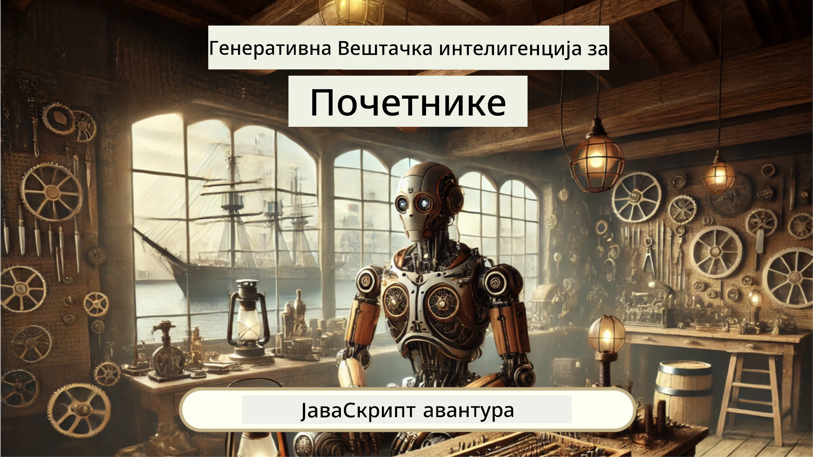
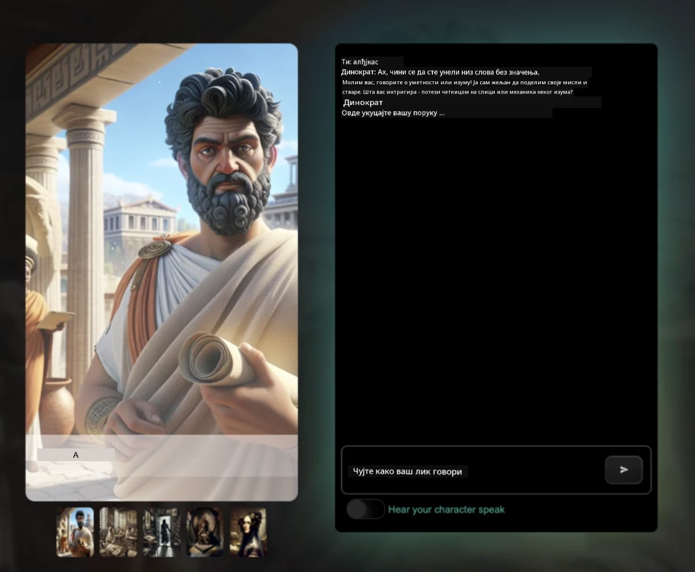
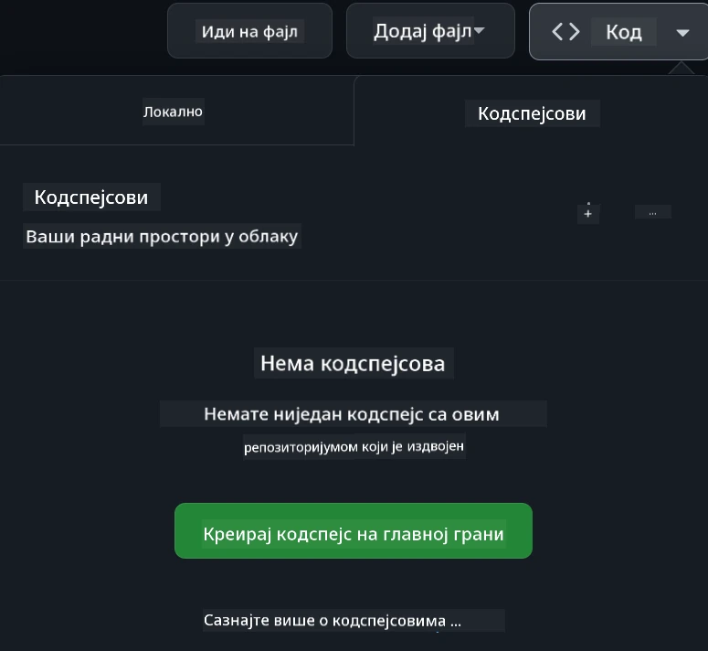

[](https://github.com/microsoft/Web-Dev-For-Beginners/blob/master/LICENSE)
[](https://GitHub.com/microsoft/Web-Dev-For-Beginners/graphs/contributors/)
[](https://GitHub.com/microsoft/Web-Dev-For-Beginners/issues/)
[](https://GitHub.com/microsoft/Web-Dev-For-Beginners/pulls/)
[](http://makeapullrequest.com) 

[](https://GitHub.com/microsoft/Web-Dev-For-Beginners/watchers/)
[](https://GitHub.com/microsoft/Web-Dev-For-Beginners/network/)
[](https://GitHub.com/microsoft/Web-Dev-For-Beginners/stargazers/)

[](https://discord.gg/nTYy5BXMWG)

# Веб развој за почетнике - Наставни план

Нauчите основе веб развоја уз наш свеобухватни курс од 12 недеља који воде Microsoft Cloud Advocates. Сваких 24 лекције дубоко улазе у JavaScript, CSS и HTML кроз практичне пројекте као што су тераријуми, проширења за прегледаче и свемирске игре. Укључите се у квизове, дискусије и практичне задатке. Унапредите своје вештине и оптимизујте задржавање знања уз нашу ефикасну методологију засновану на пројектима. Почните своје путовање у програмирање већ данас!

Придружите се Azure AI Foundry Discord заједници

[](https://discord.gg/nTYy5BXMWG)

Пратите ове кораке да бисте започели коришћење ових ресурса:
1. **Форкујте Репозиторијум**: Кликните [](https://GitHub.com/microsoft/Web-Dev-For-Beginners/fork)
2. **Клонирајте Репозиторијум**:   `git clone https://github.com/microsoft/Web-Dev-For-Beginners.git`
3. [**Придружите се Azure AI Foundry Discord-u и упознајте експерте и друге програмере**](https://discord.com/invite/ByRwuEEgH4)

### 🌐 Подршка за више језика

#### Подржано кроз GitHub Акцију (аутоматски и увек ажурирано)

<!-- CO-OP TRANSLATOR LANGUAGES TABLE START -->
[Arabic](../ar/README.md) | [Bengali](../bn/README.md) | [Bulgarian](../bg/README.md) | [Burmese (Myanmar)](../my/README.md) | [Chinese (Simplified)](../zh-CN/README.md) | [Chinese (Traditional, Hong Kong)](../zh-HK/README.md) | [Chinese (Traditional, Macau)](../zh-MO/README.md) | [Chinese (Traditional, Taiwan)](../zh-TW/README.md) | [Croatian](../hr/README.md) | [Czech](../cs/README.md) | [Danish](../da/README.md) | [Dutch](../nl/README.md) | [Estonian](../et/README.md) | [Finnish](../fi/README.md) | [French](../fr/README.md) | [German](../de/README.md) | [Greek](../el/README.md) | [Hebrew](../he/README.md) | [Hindi](../hi/README.md) | [Hungarian](../hu/README.md) | [Indonesian](../id/README.md) | [Italian](../it/README.md) | [Japanese](../ja/README.md) | [Kannada](../kn/README.md) | [Korean](../ko/README.md) | [Lithuanian](../lt/README.md) | [Malay](../ms/README.md) | [Malayalam](../ml/README.md) | [Marathi](../mr/README.md) | [Nepali](../ne/README.md) | [Nigerian Pidgin](../pcm/README.md) | [Norwegian](../no/README.md) | [Persian (Farsi)](../fa/README.md) | [Polish](../pl/README.md) | [Portuguese (Brazil)](../pt-BR/README.md) | [Portuguese (Portugal)](../pt-PT/README.md) | [Punjabi (Gurmukhi)](../pa/README.md) | [Romanian](../ro/README.md) | [Russian](../ru/README.md) | [Serbian (Cyrillic)](./README.md) | [Slovak](../sk/README.md) | [Slovenian](../sl/README.md) | [Spanish](../es/README.md) | [Swahili](../sw/README.md) | [Swedish](../sv/README.md) | [Tagalog (Filipino)](../tl/README.md) | [Tamil](../ta/README.md) | [Telugu](../te/README.md) | [Thai](../th/README.md) | [Turkish](../tr/README.md) | [Ukrainian](../uk/README.md) | [Urdu](../ur/README.md) | [Vietnamese](../vi/README.md)

> **Претпочитате да клонирате локално?**
>
> Овај репозиторијум садржи 50+ превода на језике што значајно повећава величину преузимања. Да бисте клонирали без превода, користите sparse checkout:
>
> **Bash / macOS / Linux:**
> ```bash
> git clone --filter=blob:none --sparse https://github.com/microsoft/Web-Dev-For-Beginners.git
> cd Web-Dev-For-Beginners
> git sparse-checkout set --no-cone '/*' '!translations' '!translated_images'
> ```
>
> **CMD (Windows):**
> ```cmd
> git clone --filter=blob:none --sparse https://github.com/microsoft/Web-Dev-For-Beginners.git
> cd Web-Dev-For-Beginners
> git sparse-checkout set --no-cone "/*" "!translations" "!translated_images"
> ```
>
> Ово вам даје све што вам треба за завршетак курса са много бржим преузимањем.
<!-- CO-OP TRANSLATOR LANGUAGES TABLE END -->

**Ако желите да додатне језике за превод подржимо, они су наведени [овде](https://github.com/Azure/co-op-translator/blob/main/getting_started/supported-languages.md)**

[](https://open.vscode.dev/microsoft/Web-Dev-For-Beginners)

#### 🧑‍🎓 _Јеси ли студент?_

Посети [**Student Hub страницу**](https://docs.microsoft.com/learn/student-hub/?WT.mc_id=academic-77807-sagibbon) где ћеш пронаћи ресурсе за почетнике, студенске пакете па чак и начине да добијеш бесплатан сертификатски ваучер. Ову страницу треба да додаш у обележиваче и повремено проверавате јер месечно мењамо садржај.

### 📣 Обавештење - Нови изазови GitHub Copilot Agent мода за завршетак!

Додат је нови изазов, потражите "GitHub Copilot Agent Challenge 🚀" у већини поглавља. То је нови изазов који треба да завршите коришћењем GitHub Copilot и Agent мода. Ако раније нисте користили Agent мод, он није само за генерисање текста већ може и да креира и уређује фајлове, извршава команде и још много тога.

### 📣 Обавештење - _Нови пројекат за изградњу користећи генеративну вештачку интелигенцију_ 

Управо додат нови AI Assistant пројекат, погледајте [пројекат](./9-chat-project/README.md)

### 📣 Обавештење - _Нови наставни план_ о генеративној вештачкој интелигенцији за JavaScript управо је објављен

Не пропустите наш нови наставни план о генеративној вештачкој интелигенцији!

Посетите [https://aka.ms/genai-js-course](https://aka.ms/genai-js-course) да започнете!



- Лекције обухватају све од основа до RAG-а.
- Интеракција са историјским ликовима користећи GenAI и нашу пратећу апликацију.
- Забавна и ангажована прича, путоваћете кроз време!



Свака лекција укључује задатак за завршетак, проверу знања и изазов који ће вас усмеравати у учењу тема као што су:
- Писање упита и инжењеринг упита
- Генерисање апликација за текст и слике
- Апликације за претрагу

Посетите [https://aka.ms/genai-js-course](https://aka.ms/genai-js-course) да започнете!


## 🌱 Почетак

> **Наставници**, дали смо [неке предлоге](for-teachers.md) како користити овај наставни план. Волео би да добијемо ваше повратне информације [у нашем форуму за дискусију](https://github.com/microsoft/Web-Dev-For-Beginners/discussions/categories/teacher-corner)!

**[Ученици](https://aka.ms/student-page/?WT.mc_id=academic-77807-sagibbon)**, за сваку лекцију, почните са предавачким квизом, затим прочитајте материјал са предавања, завршите различите активности и проверите своје разумевање уз пост-квиз.

Да бисте побољшали своје искуство учења, повежите се са својим вршњацима и радите на пројектима заједно! Дискусије су охрабрене на нашем [форуму за дискусију](https://github.com/microsoft/Web-Dev-For-Beginners/discussions) где ће наш тим модератора бити доступан да одговори на ваша питања.

За унапређење образовања топло препоручујемо да истражите [Microsoft Learn](https://learn.microsoft.com/users/wirelesslife/collections/p1ddcy5jwy0jkm?WT.mc_id=academic-77807-sagibbon) за додатне студијске материјале.

### 📋 Постављање окружења

Овај наставни план има развојно окружење спремно за коришћење! Када почнете, можете изабрати да покренете наставни план у [Codespace](https://github.com/features/codespaces/) (_окружење засновано на прегледачу без потребе за инсталацијом_), или локално на свом рачунару користећи уређивач текста као што је [Visual Studio Code](https://code.visualstudio.com/?WT.mc_id=academic-77807-sagibbon).

#### Креирање свог репозиторијума
Да бисте лако сачували свој рад, препоручује се да направите своју копију овог репозиторијума. То можете урадити кликом на дугме **Use this template** на врху странице. Ово ће креирати нов репозиторијум у вашем GitHub налогу са копијом наставног плана.

Пратите ове кораке:
1. **Форкујте репозиторијум**: Кликните на дугме "Fork" у горњем десном углу ове странице.
2. **Клонирајте репозиторијум**:   `git clone https://github.com/microsoft/Web-Dev-For-Beginners.git`

#### Покретање наставног плана у Codespace-у

У својој копији репозиторијума коју сте направили, кликните на дугме **Code** и изаберите **Open with Codespaces**. Ово ће креирати нови Codespace у којем ћете радити.



#### Покретање наставног плана локално на вашем рачунару

Да бисте локално покренули овај наставни план на вашем рачунару, потребан вам је уређивач текста, прегледач и алат за командну линију. Наша прва лекција, [Увод у програмске језике и алате рада](../../1-getting-started-lessons/1-intro-to-programming-languages), водиће вас кроз разне опције за сваки од ових алата тако да изаберете шта вам највише одговара.

Наш савет је да користите [Visual Studio Code](https://code.visualstudio.com/?WT.mc_id=academic-77807-sagibbon) као уређивач, који такође има уграђени [Терминал](https://code.visualstudio.com/docs/terminal/basics/?WT.mc_id=academic-77807-sagibbon). Visual Studio Code можете преузети [овде](https://code.visualstudio.com/?WT.mc_id=academic-77807-sagibbon).
1. Клонирајте свој репозиторијум на рачунар. То можете урадити кликом на дугме **Code** и копирањем УРЛ-а:

    [CodeSpace](./images/createcodespace.png)

    Затим отворите [Terminal](https://code.visualstudio.com/docs/terminal/basics/?WT.mc_id=academic-77807-sagibbon) унутар [Visual Studio Code](https://code.visualstudio.com/?WT.mc_id=academic-77807-sagibbon) и покрените следећу команду, замењујући `<your-repository-url>` УРЛ-ом који сте управо копирали:

    ```bash 
    git clone <your-repository-url>
    ```

2. Отворите фасциклу у Visual Studio Code-у. То можете урадити кликом на **File** > **Open Folder** и одабиром фасцикле коју сте управо клонирали.


>  Препоручени додаци за Visual Studio Code:
>
> * [Live Server](https://marketplace.visualstudio.com/items?itemName=ritwickdey.LiveServer&WT.mc_id=academic-77807-sagibbon) - за преглед HTML страница директно у Visual Studio Code-у
> * [Copilot](https://marketplace.visualstudio.com/items?itemName=GitHub.copilot&WT.mc_id=academic-77807-sagibbon) - за помоћ у бржем писању кода

## 📂 Свака лекција укључује:

- опционалну скицноту
- опционални додатни видео
- припремни квиз пре лекције
- писану лекцију
- за лекције засноване на пројекту, корак по корак упутства како изградити пројекат
- провере знања
- изазов
- додатно читање
- задатак
- [квиз после лекције](https://ff-quizzes.netlify.app/web/)

> **Напомена о квизовима**: Сви квизови се налазе у фасцикли Quiz-app, укупно 48 квизова са по три питања. Доступни су [овде](https://ff-quizzes.netlify.app/web/), квиз апликација се може покренути локално или дистрибуирати на Azure; пратите упутства у фасцикли `quiz-app`.

## 🗃️ Лекције

|     |                       Назив пројекта                      |                            Концепти који се уче                             | Циљеви учења                                                                                                                     |                                                         Повезана лекција                                                          |         Аутор          |
| :-: | :------------------------------------------------------: | :--------------------------------------------------------------------: | ----------------------------------------------------------------------------------------------------------------------------------- | :----------------------------------------------------------------------------------------------------------------------------: | :---------------------: |
| 01  |                     Почетак рада                          |           Увод у програмирање и алатке струке           | Научите основне основе иза већине програмских језика и о софтверу који помаже професионалним програмерима у раду | [Увод у програмске језике и алатке струке](./1-getting-started-lessons/1-intro-to-programming-languages/README.md) |         Jasmine         |
| 02  |                     Почетак рада                          |             Основе GitHub-а, укључује рад у тиму             | Како користити GitHub у свом пројекту, како сарађивати са другим на кодној бази                                                    |                            [Увод у GitHub](./1-getting-started-lessons/2-github-basics/README.md)                             |          Floor          |
| 03  |                     Почетак рада                          |                             Приступачност                              | Научите основе веб приступачности                                                                                               |                       [Основе приступачности](./1-getting-started-lessons/3-accessibility/README.md)                       |       Christopher       |
| 04  |                        JS Основе                         |                         Врсте података у JavaScript-у                          | Основе типова података у JavaScript-у                                                                                                 |                                       [Типови података](./2-js-basics/1-data-types/README.md)                                        |         Jasmine         |
| 05  |                        JS Основе                         |                         Функције и методе                          | Сазнајте о функцијама и методама за управљање логиком апликације                                                             |                              [Функције и методе](./2-js-basics/2-functions-methods/README.md)                               | Jasmine и Christopher |
| 06  |                        JS Основе                         |                        Доношење одлука у JS-у                        | Научите како да користите услове у свом коду користећи методе доношења одлука                                                           |                                 [Доношење одлука](./2-js-basics/3-making-decisions/README.md)                                  |         Jasmine         |
| 07  |                        JS Основе                         |                            Низови и петље                            | Рад са подацима помоћу низова и петљи у JavaScript-у                                                                                 |                                   [Низови и петље](./2-js-basics/4-arrays-loops/README.md)                                    |         Jasmine         |
| 08  |       [Тераријум](./3-terrarium/solution/README.md)       |                            HTML у пракси                            | Изградите HTML за креирање онлајн тераријума, фокусирајући се на изградњу распореда                                                         |                                 [Увод у HTML](./3-terrarium/1-intro-to-html/README.md)                                 |           Jen           |
| 09  |       [Тераријум](./3-terrarium/solution/README.md)       |                            CSS у пракси                             | Направите CSS за стил тераријума, фокусирајући се на основе CSS-а укључујући додавање респонзивности страницама                     |                                  [Увод у CSS](./3-terrarium/2-intro-to-css/README.md)                                  |           Jen           |
| 10  |            [Тераријум](./3-terrarium/solution/README.md)            |                 JavaScript затварања, манипулација DOM-ом                  | Направите JavaScript да тераријум функционише као drag/drop интерфејс, фокусирајући се на затварања и манипулацију DOM-ом             |                  [JavaScript затварања, манипулација DOM-ом](./3-terrarium/3-intro-to-DOM-and-closures/README.md)                   |           Jen           |
| 11  |          [Игра куцања](./4-typing-game/solution/README.md)          |                          Направите игру куцања                           | Научите како да искористите тастатурне догађаје за управљање логиком ваше JavaScript апликације                                                          |                                [Програмирање вођено догађајима](./4-typing-game/typing-game/README.md)                                |       Christopher       |
| 12  | [Грин екстензија за прегледач](./5-browser-extension/solution/README.md) |                         Рад са прегледачима                          | Сазнајте како прегледачи раде, њихову историју и како створити прве елементе проширења за прегледач                               |                               [О прегледачима](./5-browser-extension/1-about-browsers/README.md)                                |           Jen           |
| 13  | [Грин екстензија за прегледач](./5-browser-extension/solution/README.md) | Креирање форме, позивање API-ја и складиштење променљивих у локалну меморију | Направите JavaScript елементе ваше екстензије за позивање API користећи променљиве у локалној меморији                      |                [API-ји, форме и локална меморија](./5-browser-extension/2-forms-browsers-local-storage/README.md)                 |           Jen           |
| 14  | [Грин екстензија за прегледач](./5-browser-extension/solution/README.md) |          Позадински процеси у прегледачу, веб перформансе          | Користите позадинске процесе прегледача за управљање иконицом екстензије; научите о веб перформансама и оптимизацијама   |             [Позадински задаци и перформансе](./5-browser-extension/3-background-tasks-and-performance/README.md)              |           Jen           |
| 15  |           [Свемирска игра](./6-space-game/solution/README.md)           |             Напреднија израда игре у JavaScript-у             | Научите о наследству користећи и класе и композицију и Pub/Sub образац, као припрему за израду игре              |                      [Увод у напредну израду игара](./6-space-game/1-introduction/README.md)                       |          Chris          |
| 16  |           [Свемирска игра](./6-space-game/solution/README.md)           |                           Цртање на платну (canvas)                            | Научите о Canvas API-ју, који се користи за цртање елемената на екрану                                                                       |                                [Цртање на платну](./6-space-game/2-drawing-to-canvas/README.md)                                |          Chris          |
| 17  |           [Свемирска игра](./6-space-game/solution/README.md)           |                   Премештање елемената по екрану                    | Откријте како елементи добијају кретање користећи картизне координате и Canvas API                                            |                           [Премештање елемената](./6-space-game/3-moving-elements-around/README.md)                           |          Chris          |
| 18  |           [Свемирска игра](./6-space-game/solution/README.md)           |                          Детекција судара                           | Учини да се елементи сударају и реагују један на други користећи притиске тастера и обезбедите функцију хладног периода за глaдко функционисање игре    |                              [Детекција судара](./6-space-game/4-collision-detection/README.md)                              |          Chris          |
| 19  |           [Свемирска игра](./6-space-game/solution/README.md)           |                             Водити резултат                              | Обављај математичке операције на основу статуса и перформанси игре                                                                |                                    [Води резултат](./6-space-game/5-keeping-score/README.md)                                    |          Chris          |
| 20  |           [Свемирска игра](./6-space-game/solution/README.md)           |                     Завршетак и поновно покретање игре                     | Научите о завршетку и поновном покретању игре, укључујући чишћење ресурса и ресетовање вредности променљивих                              |                                [Услов за завршетак](./6-space-game/6-end-condition/README.md)                                 |          Chris          |
| 21  |         [Банкарска апликација](./7-bank-project/solution/README.md)          |                 HTML шаблони и руте у веб апликацији                 | Научите како направити структуру више страница у вебсајту користећи рутирање и HTML шаблоне                             |                            [HTML шаблони и руте](./7-bank-project/1-template-route/README.md)                             |          Yohan          |
| 22  |         [Банкарска апликација](./7-bank-project/solution/README.md)          |                  Направите форму за пријаву и регистрацију                   | Научите како изградити форме и руковати валидацијом                                                                          |                                           [Форме](./7-bank-project/2-forms/README.md)                                           |          Yohan          |
| 23  |         [Банкарска апликација](./7-bank-project/solution/README.md)          |                   Начини дохвата и коришћења података                   | Како подаци улазе и излазе из ваше апликације, како их дохватити, складиштити и уклонити                                                 |                                            [Подаци](./7-bank-project/3-data/README.md)                                            |          Yohan          |
| 24  |         [Банкарска апликација](./7-bank-project/solution/README.md)          |                      Концепти управљања стањем (state management)                      | Научите како ваша апликација задржава стање и како га програмски управљати                                                              |                                [Управљање стањем](./7-bank-project/4-state-management/README.md)                                |          Yohan          |
| 25 | [Прегледач/VScode кôд](../../8-code-editor) | Рад са VScode-ом | Научите како користити уређивач кôда | [Употреба VScode уређивача кôда](./8-code-editor/1-using-a-code-editor/README.md) | Chris |
| 26 | [AI асистенти](./9-chat-project/README.md) | Рад са вештачком интелигенцијом | Научите како направити свог AI асистента | [Пројекат AI асистента](./9-chat-project/README.md) | Chris |

## 🏫 Педагогија

Наш наставни план и програм је дизајниран са два кључна педагошка принципа у виду:
* учење засновано на пројектима
* чести квизови

Програм учи основе JavaScript-а, HTML-а и CSS-а, као и најновије алате и технике које данас користе веб развојни инжењери. Студенти ће имати прилику да стекну практично искуство израдом игре куцања, виртуелног тераријума, еколошки прихватљивог проширења за прегледач, игре у стилу свемирских нападача и банкарске апликације за предузећа. До краја серије, студенти ће стећи солидно разумевање веб развоја.

> 🎓 Прве неколико лекција у овом курикулуму можете узети као [Learn Path](https://docs.microsoft.com/learn/paths/web-development-101/?WT.mc_id=academic-77807-sagibbon) на Microsoft Learn!

Обезбеђивањем да садржај одговара пројектима, процес је учињен занимљивијим за студенте и повећава задржавање концепата. Такође смо написали неколико уводних лекција о JavaScript основама за упознавање концепата, упарених са видео снимком из серије "[Beginners Series to: JavaScript](https://channel9.msdn.com/Series/Beginners-Series-to-JavaScript/?WT.mc_id=academic-77807-sagibbon)" колекције видео туторијала, чији су аутори допринели овом курикулуму.

Поред тога, квиз са малим улогом пре часа усмерава фокус студента ка учењу теме, док други квиз после часа обезбеђује даље задржавање. Овај курикулум је дизајниран да буде флексибилан и забаван и може се узети у целини или делимично. Пројекти почињу мали и постају све комплекснији крајем 12 недељног циклуса.

Иако смо намеравано избегли увођење JavaScript фрејмворка како бисмо се концентрисали на основне вештине које су потребне веб програмеру пре него што пређу на неки фрејмворк, добар следећи корак након овог курикулума био би учење о Node.js помоћу друге колекције видео записа: "[Beginner Series to: Node.js](https://channel9.msdn.com/Series/Beginners-Series-to-Nodejs/?WT.mc_id=academic-77807-sagibbon)".

> Посетите наше смернице [Code of Conduct](CODE_OF_CONDUCT.md) и [Contributing](CONTRIBUTING.md). Добродошли су ваши конструктивни предлози!


## 🧭 Приступ без мреже

Можете покренути ову документацију без мреже користећи [Docsify](https://docsify.js.org/#/). Форкујте овај репозиторијум, [инсталирајте Docsify](https://docsify.js.org/#/quickstart) на свом локалном уређају, а онда у коренској фасцикли овог репозиторијума укуцајте `docsify serve`. Вебсајт ће бити доступан на порту 3000 на вашем локалном хосту: `localhost:3000`.

## 📘 PDF
PDF svih lekcija можете пронаћи [овде](https://microsoft.github.io/Web-Dev-For-Beginners/pdf/readme.pdf).


## 🎒 Други курсеви

Наш тим производи и друге курсеве! Погледајте:

<!-- CO-OP TRANSLATOR OTHER COURSES START -->
### LangChain
[](https://aka.ms/langchain4j-for-beginners)
[](https://aka.ms/langchainjs-for-beginners?WT.mc_id=m365-94501-dwahlin)
[](https://github.com/microsoft/langchain-for-beginners?WT.mc_id=m365-94501-dwahlin)
---

### Azure / Edge / MCP / Agents
[](https://github.com/microsoft/AZD-for-beginners?WT.mc_id=academic-105485-koreyst)
[](https://github.com/microsoft/edgeai-for-beginners?WT.mc_id=academic-105485-koreyst)
[](https://github.com/microsoft/mcp-for-beginners?WT.mc_id=academic-105485-koreyst)
[](https://github.com/microsoft/ai-agents-for-beginners?WT.mc_id=academic-105485-koreyst)

---
 
### Серти генеративног AI
[](https://github.com/microsoft/generative-ai-for-beginners?WT.mc_id=academic-105485-koreyst)
[-9333EA?style=for-the-badge&labelColor=E5E7EB&color=9333EA)](https://github.com/microsoft/Generative-AI-for-beginners-dotnet?WT.mc_id=academic-105485-koreyst)
[-C084FC?style=for-the-badge&labelColor=E5E7EB&color=C084FC)](https://github.com/microsoft/generative-ai-for-beginners-java?WT.mc_id=academic-105485-koreyst)
[-E879F9?style=for-the-badge&labelColor=E5E7EB&color=E879F9)](https://github.com/microsoft/generative-ai-with-javascript?WT.mc_id=academic-105485-koreyst)

---
 
### Основно учење
[](https://aka.ms/ml-beginners?WT.mc_id=academic-105485-koreyst)
[](https://aka.ms/datascience-beginners?WT.mc_id=academic-105485-koreyst)
[](https://aka.ms/ai-beginners?WT.mc_id=academic-105485-koreyst)
[](https://github.com/microsoft/Security-101?WT.mc_id=academic-96948-sayoung)
[](https://aka.ms/webdev-beginners?WT.mc_id=academic-105485-koreyst)
[](https://aka.ms/iot-beginners?WT.mc_id=academic-105485-koreyst)
[](https://github.com/microsoft/xr-development-for-beginners?WT.mc_id=academic-105485-koreyst)

---
 
### Серти Копилот
[](https://aka.ms/GitHubCopilotAI?WT.mc_id=academic-105485-koreyst)
[](https://github.com/microsoft/mastering-github-copilot-for-dotnet-csharp-developers?WT.mc_id=academic-105485-koreyst)
[](https://github.com/microsoft/CopilotAdventures?WT.mc_id=academic-105485-koreyst)
<!-- CO-OP TRANSLATOR OTHER COURSES END -->

## Како добити помоћ

Ако застакнете или имате било каквих питања у вези са прављењем AI апликација. Придружите се другим ученицима и искусним програмерима у дискусијама о MCP-у. То је подршка заједница где су питања добродошла и знање се слободно дели.

[](https://discord.gg/nTYy5BXMWG)

Ако имате повратне информације о производу или грешке приликом прављења, посетите:

[](https://aka.ms/foundry/forum)

## Лиценца

Овај репозиторијум је лиценциран под MIT лиценцом. Погледајте датотеку [LICENSE](../../LICENSE) за више информација.

---

<!-- CO-OP TRANSLATOR DISCLAIMER START -->
**Одрицање од одговорности**:
Овај документ је преведен помоћу AI сервиса за превођење [Co-op Translator](https://github.com/Azure/co-op-translator). Иако тежимо прецизности, имајте у виду да аутоматски преводи могу да садрже грешке или нетачности. Оригинални документ на његовом изворном језику треба сматрати ауторитетним извором. За критичне информације препоручује се професионални људски превод. Нисмо одговорни за било каква неспоразуми или неправилна тумачења проистекла из коришћења овог превода.
<!-- CO-OP TRANSLATOR DISCLAIMER END -->