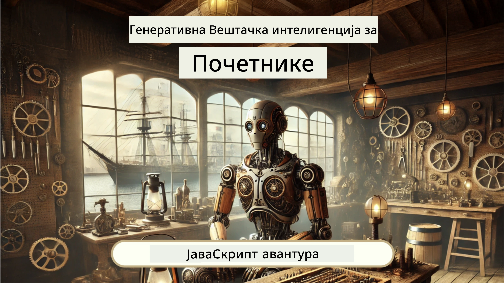
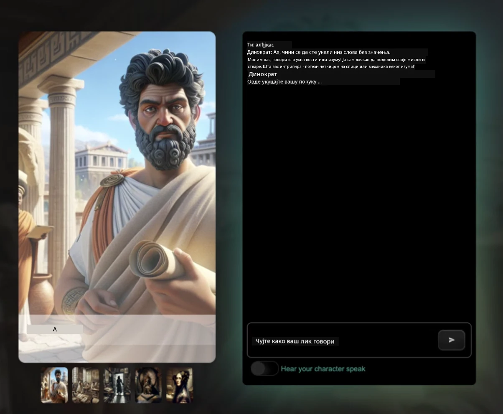
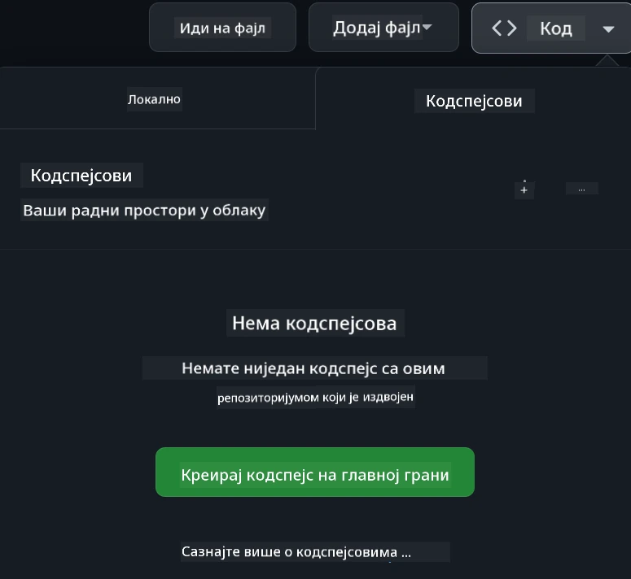

[](https://github.com/microsoft/Web-Dev-For-Beginners/blob/master/LICENSE)
[](https://GitHub.com/microsoft/Web-Dev-For-Beginners/graphs/contributors/)
[](https://GitHub.com/microsoft/Web-Dev-For-Beginners/issues/)
[](https://GitHub.com/microsoft/Web-Dev-For-Beginners/pulls/)
[](http://makeapullrequest.com) 

[](https://GitHub.com/microsoft/Web-Dev-For-Beginners/watchers/)
[](https://GitHub.com/microsoft/Web-Dev-For-Beginners/network/)
[](https://GitHub.com/microsoft/Web-Dev-For-Beginners/stargazers/)

[](https://discord.gg/nTYy5BXMWG)

# Веб развој за почетнике - Наставни план

Научите основе веб развоја уз наш свеобухватни курс од 12 недеља који воде Microsoft Cloud Advocates. Свакa од 24 лекције дубоко истражује JavaScript, CSS и HTML кроз практичне пројекте као што су тераријуми, проширења прегледача и свемирске игре. Укључите се кроз квизове, дискусије и практичне задатке. Унапредите своје вештине и оптимизујте задржавање знања ефективном педагогијом заснованом на пројектима. Започните своје кодерско путовање данас!

Придружите се Azure AI Foundry Discord-у и упознајте стручњаке и друге програмере.

[](https://discord.gg/nTYy5BXMWG)

Пратите ове кораке да бисте почели да користите ове ресурсе:
1. **Форкујте Репозиторијум**: Кликните [](https://GitHub.com/microsoft/Web-Dev-For-Beginners/fork)
2. **Клонирајте Репозиторијум**:   `git clone https://github.com/microsoft/Web-Dev-For-Beginners.git`
3. [**Придружите се Azure AI Foundry Discord и упознајте стручњаке и друге програмере**](https://discord.com/invite/ByRwuEEgH4)

### 🌐 Подршка за више језика

#### Подржано преко GitHub Action-а (Аутоматизовано и увек ажурирано)

<!-- CO-OP TRANSLATOR LANGUAGES TABLE START -->
[Arabic](../ar/README.md) | [Bengali](../bn/README.md) | [Bulgarian](../bg/README.md) | [Burmese (Myanmar)](../my/README.md) | [Chinese (Simplified)](../zh-CN/README.md) | [Chinese (Traditional, Hong Kong)](../zh-HK/README.md) | [Chinese (Traditional, Macau)](../zh-MO/README.md) | [Chinese (Traditional, Taiwan)](../zh-TW/README.md) | [Croatian](../hr/README.md) | [Czech](../cs/README.md) | [Danish](../da/README.md) | [Dutch](../nl/README.md) | [Estonian](../et/README.md) | [Finnish](../fi/README.md) | [French](../fr/README.md) | [German](../de/README.md) | [Greek](../el/README.md) | [Hebrew](../he/README.md) | [Hindi](../hi/README.md) | [Hungarian](../hu/README.md) | [Indonesian](../id/README.md) | [Italian](../it/README.md) | [Japanese](../ja/README.md) | [Kannada](../kn/README.md) | [Khmer](../km/README.md) | [Korean](../ko/README.md) | [Lithuanian](../lt/README.md) | [Malay](../ms/README.md) | [Malayalam](../ml/README.md) | [Marathi](../mr/README.md) | [Nepali](../ne/README.md) | [Nigerian Pidgin](../pcm/README.md) | [Norwegian](../no/README.md) | [Persian (Farsi)](../fa/README.md) | [Polish](../pl/README.md) | [Portuguese (Brazil)](../pt-BR/README.md) | [Portuguese (Portugal)](../pt-PT/README.md) | [Punjabi (Gurmukhi)](../pa/README.md) | [Romanian](../ro/README.md) | [Russian](../ru/README.md) | [Serbian (Cyrillic)](./README.md) | [Slovak](../sk/README.md) | [Slovenian](../sl/README.md) | [Spanish](../es/README.md) | [Swahili](../sw/README.md) | [Swedish](../sv/README.md) | [Tagalog (Filipino)](../tl/README.md) | [Tamil](../ta/README.md) | [Telugu](../te/README.md) | [Thai](../th/README.md) | [Turkish](../tr/README.md) | [Ukrainian](../uk/README.md) | [Urdu](../ur/README.md) | [Vietnamese](../vi/README.md)

> **Више волите да копирате локално?**
>
> Овај репозиторијум укључује преко 50 превода што значајно повећава величину преузимања. Да бисте клонирали без превода користите sparse checkout:
>
> **Bash / macOS / Linux:**
> ```bash
> git clone --filter=blob:none --sparse https://github.com/microsoft/Web-Dev-For-Beginners.git
> cd Web-Dev-For-Beginners
> git sparse-checkout set --no-cone '/*' '!translations' '!translated_images'
> ```
>
> **CMD (Windows):**
> ```cmd
> git clone --filter=blob:none --sparse https://github.com/microsoft/Web-Dev-For-Beginners.git
> cd Web-Dev-For-Beginners
> git sparse-checkout set --no-cone "/*" "!translations" "!translated_images"
> ```
>
> Ово Вам даје све што Вам је потребно за завршетак курса са много бржим преузимањем.
<!-- CO-OP TRANSLATOR LANGUAGES TABLE END -->

**Уколико желите додатне преводе, подржани језици су наведени овде. [овде](https://github.com/Azure/co-op-translator/blob/main/getting_started/supported-languages.md)**

[](https://open.vscode.dev/microsoft/Web-Dev-For-Beginners)

#### 🧑‍🎓 _Да ли сте студент?_

Посетите [**Student Hub страницу**](https://docs.microsoft.com/learn/student-hub/?WT.mc_id=academic-77807-sagibbon) где ћете пронаћи ресурсе за почетнике, студентске пакете па чак и начине да добијете бесплатан ваучер за сертификат. Ово је страница коју желите да означите и повремено проверите јер ми месечно мењамо садржај.

### 📣 Објава - НОВИ изазови за GitHub Copilot Agent мод за завршавање!

Додат је нови изазов, потражите "GitHub Copilot Agent Challenge 🚀" у већини поглавља. То је нови изазов који треба да завршите користећи GitHub Copilot и Agent режим. Ако раније нисте користили Agent режим, он није само за генерисање текста већ може и креирати и уређивати датотеке, извршавати команде и још много тога.

### 📣 Објава - _Нови пројекат за прављење користећи Генеративни AI_ 

Нови пројекат AI асистента је управо додат, погледајте [пројекат](./9-chat-project/README.md)

### 📣 Објава - _Нови наставни план_ за Генеративни AI за JavaScript је управо објављен

Не пропустите наш нови курс за Генеративни AI!

Посетите [https://aka.ms/genai-js-course](https://aka.ms/genai-js-course) да бисте почели!



- Лекције које покривају све од основа до RAG-а.
- Играјте са историјским ликовима користећи GenAI и нашу пратњу апликацију.
- Забаван и занимљив наратив, путоваћете кроз време!




Свака лекција укључује задатак за завршетак, проверу знања и изазов који вас води кроз теме као што су:
- Формулисање упита и инжењеринг упита
- Генерисање апликација за текст и слике
- Претрага апликација

Посетите [https://aka.ms/genai-js-course](https://aka.ms/genai-js-course) да бисте почели!


## 🌱 Како почети

> **Наставници**, укључили смо [неке предлоге](for-teachers.md) о томе како користити овај наставни план. Волео/ла бих да добијемо ваше повратне информације [на нашем форуму за дискусије](https://github.com/microsoft/Web-Dev-For-Beginners/discussions/categories/teacher-corner)!

**[Ученици](https://aka.ms/student-page/?WT.mc_id=academic-77807-sagibbon)**, за сваку лекцију започните са квизом пре предавања и наставите читањем материјала, извођењем различитих активности и проверавањем разумевања кроз квиз након предавања.

Да бисте побољшали своје учење, повежите се са својим вршњацима да радите на пројектима заједно! Дискусије су охрабрене у нашем [форуму за дискусије](https://github.com/microsoft/Web-Dev-For-Beginners/discussions) где ће тим модератора бити доступан да одговори на ваша питања.

Да бисте даље усавршавали образовање, топло препоручујемо да истражите [Microsoft Learn](https://learn.microsoft.com/users/wirelesslife/collections/p1ddcy5jwy0jkm?WT.mc_id=academic-77807-sagibbon) за додатни материјал за учење.

### 📋 Подешавање вашег окружења

Овај наставни план има спремно развојно окружење! Када почнете, можете изабрати да курс покренете у [Codespace-у](https://github.com/features/codespaces/) (_окружење које ради у прегледачу без потребе за инсталацијом_), или локално на вашем рачунару користећи уређивач текста као што је [Visual Studio Code](https://code.visualstudio.com/?WT.mc_id=academic-77807-sagibbon).

#### Креирајте свој репозиторијум
Да бисте лакше сачували свој рад, препоручује се да направите своју копију овог репозиторијума. То можете урадити кликом на дугме **Use this template** на врху странице. Ово ће креирати нови репозиторијум на вашем GitHub налогу са копијом наставног плана.

Пратите ове кораке:
1. **Форк репозиторијум**: Кликните на дугме "Fork" у горњем десном углу ове странице.
2. **Клонирајте репозиторијум**:   `git clone https://github.com/microsoft/Web-Dev-For-Beginners.git`

#### Покретање наставног плана у Codespace-у

У својој копији овог репозиторијума коју сте направили, кликните на дугме **Code** и изаберите **Open with Codespaces**. Ово ће вам креирати нови Codespace за рад.



#### Локално покретање наставног плана на вашем рачунару

Да бисте локално покренули овај курс на вашем рачунару, биће вам потребан уређивач текста, прегледач и командна линија. Наша прва лекција, [Увод у програмске језике и алате](../../1-getting-started-lessons/1-intro-to-programming-languages), биће вам водич кроз различите опције за сваки од ових алата да изаберете оно што вам највише одговара.

Препоручујемо коришћење [Visual Studio Code](https://code.visualstudio.com/?WT.mc_id=academic-77807-sagibbon) као вашег уређивача, који уједно има уграђени [Терминал](https://code.visualstudio.com/docs/terminal/basics/?WT.mc_id=academic-77807-sagibbon). Visual Studio Code можете преузети [овде](https://code.visualstudio.com/?WT.mc_id=academic-77807-sagibbon).
1. Клонирајте свој репозиторијум на рачунар. То можете урадити кликом на дугме **Code** и копирањем URL-а:

    [CodeSpace](./images/createcodespace.png)

    Затим, отворите [Terminal](https://code.visualstudio.com/docs/terminal/basics/?WT.mc_id=academic-77807-sagibbon) унутар [Visual Studio Code](https://code.visualstudio.com/?WT.mc_id=academic-77807-sagibbon) и покрените следећу команду, замењујући `<your-repository-url>` са URL-ом који сте управо копирали:

    ```bash 
    git clone <your-repository-url>
    ```

2. Отворите фасциклу у Visual Studio Code-у. То можете урадити кликом на **File** > **Open Folder** и одабиром фасцикле коју сте управо клонирали.


>  Препоручени Visual Studio Code додаци:
>
> * [Live Server](https://marketplace.visualstudio.com/items?itemName=ritwickdey.LiveServer&WT.mc_id=academic-77807-sagibbon) - за преглед HTML страница унутар Visual Studio Code-а
> * [Copilot](https://marketplace.visualstudio.com/items?itemName=GitHub.copilot&WT.mc_id=academic-77807-sagibbon) - за помоћ у бржем писању кода

## 📂 Свака лекција укључује:

- опциони оловкрис
- опциони додатни видео
- припремни квиз пре лекције
- писану лекцију
- за лекције засноване на пројектима, корак-по-корак приручнике како изградити пројекат
- провере знања
- изазов
- додатно читање
- задатак
- [квиз након лекције](https://ff-quizzes.netlify.app/web/)

> **Напомена о квизовима**: Сви квизови се налазе у Quiz-app фасцикли, укупно 48 квизова са по три питања. Доступни су [овде](https://ff-quizzes.netlify.app/web/), апликацију за квизове можете покренути локално или је објавити на Azure; следите упутства у `quiz-app` фасцикли.

## 🗃️ Лекције

|     |                       Назив пројекта                       |                            Концепти који се уче                             | Циљеви учења                                                                                                                |                                                         Повезана лекција                                                          |         Аутор          |
| :-: | :--------------------------------------------------------: | :------------------------------------------------------------------------: | ---------------------------------------------------------------------------------------------------------------------------- | :--------------------------------------------------------------------------------------------------------------------------------: | :---------------------: |
| 01  |                     Почетак                                |           Увод у програмирање и алате струке                              | Научите основне основе које стоје иза већине програмских језика и о софтверу који помаже професионалним програмерима да раде | [Увод у програмске језике и алате струке](./1-getting-started-lessons/1-intro-to-programming-languages/README.md)                  |         Jasmine         |
| 02  |                     Почетак                                |             Основе GitHub-а, укључујући рад у тиму                         | Како користити GitHub у свом пројекту, како сарађивати са другима на коду                                                 |                            [Увод у GitHub](./1-getting-started-lessons/2-github-basics/README.md)                                     |          Floor          |
| 03  |                     Почетак                                |                             Приступачност                                   | Научите основе веб приступачности                                                                                           |                       [Основе приступачности](./1-getting-started-lessons/3-accessibility/README.md)                                 |       Christopher       |
| 04  |                        ЈС основе                           |                         Типови података у JavaScript-у                     | Основе типова података у JavaScript-у                                                                                       |                                       [Типови података](./2-js-basics/1-data-types/README.md)                                          |         Jasmine         |
| 05  |                        ЈС основе                           |                         Функције и методе                                 | Научите о функцијама и методама које управљају логиком апликације                                                          |                              [Функције и методе](./2-js-basics/2-functions-methods/README.md)                                       | Jasmine и Christopher   |
| 06  |                        ЈС основе                           |                        Доношење одлука са JS                              | Научите како да креирате услове у свом коду користећи методе доношења одлука                                              |                                 [Доношење одлука](./2-js-basics/3-making-decisions/README.md)                                   |         Jasmine         |
| 07  |                        ЈС основе                           |                            Низови и петље                                | Рад са подацима користећи низове и петље у JavaScript-у                                                                    |                                   [Низови и петље](./2-js-basics/4-arrays-loops/README.md)                                      |         Jasmine         |
| 08  |       [Terrarium](./3-terrarium/solution/README.md)       |                           HTML у пракси                                  | Израдите HTML за креирање онлајн тераријума, фокусирајући се на изградњу распореда                                         |                                 [Увод у HTML](./3-terrarium/1-intro-to-html/README.md)                                           |           Jen           |
| 09  |       [Terrarium](./3-terrarium/solution/README.md)       |                            CSS у пракси                                  | Израдите CSS за стилизовање онлајн тераријума, фокусирајући се на основе CSS укључујући прилагођавање странице               |                                  [Увод у CSS](./3-terrarium/2-intro-to-css/README.md)                                           |           Jen           |
| 10  |            [Terrarium](./3-terrarium/solution/README.md)            |                 JavaScript затварања, рад са DOM-ом                      | Израдите JavaScript за функционисање тераријума као drag/drop интерфејса, са фокусом на затварања и рад са DOM-ом           |                  [JavaScript затварања, рад са DOM-ом](./3-terrarium/3-intro-to-DOM-and-closures/README.md)                       |           Jen           |
| 11  |          [Typing Game](./4-typing-game/solution/README.md)          |                          Креирање игре куцања                            | Научите како да користите догађаје са тастатуре за управљање логиком JavaScript апликације                                |                                [Програмирање вођено догађајима](./4-typing-game/typing-game/README.md)                           |       Christopher       |
| 12  | [Green Browser Extension](./5-browser-extension/solution/README.md) |                         Рад са прегледачима                             | Научите како прегледачи раде, њихову историју и како направити прве елементе проширења за прегледач                        |                               [О прегледачима](./5-browser-extension/1-about-browsers/README.md)                                 |           Jen           |
| 13  | [Green Browser Extension](./5-browser-extension/solution/README.md) | Креирање форме, позивање API-ја и чување променљивих у локалној меморији | Израдите JavaScript елементе проширења прегледача за позивање API-ја користећи променљиве чуване у локалној меморији        |                [API-ји, форме и локална меморија](./5-browser-extension/2-forms-browsers-local-storage/README.md)                  |           Jen           |
| 14  | [Green Browser Extension](./5-browser-extension/solution/README.md) |            Позадински процеси у прегледачу, веб перформансе             | Користите позадинске процесе прегледача за управљање иконицом проширења; научите о веб перформансама и оптимизацијама      |            [Позадински задаци и перформансе](./5-browser-extension/3-background-tasks-and-performance/README.md)                 |           Jen           |
| 15  |           [Space Game](./6-space-game/solution/README.md)           |             Напреднији развој игара са JavaScript-ом                   | Научите о наследству користећи класе и композицију и публиковање/поверене образац, за припрему израде игре                  |                      [Увод у напредни развој игара](./6-space-game/1-introduction/README.md)                                    |          Chris          |
| 16  |           [Space Game](./6-space-game/solution/README.md)           |                           Цртање на canvas-у                            | Научите о Canvas API-ју, који се користи за цртање елемената на екрану                                                    |                                [Цртање на Canvas](./6-space-game/2-drawing-to-canvas/README.md)                                 |          Chris          |
| 17  |           [Space Game](./6-space-game/solution/README.md)           |                   Премештање елемената око екрана                       | Откријте како елементи добијају покрет коришћењем декартових координата и Canvas API-ја                                    |                           [Премештање елемената](./6-space-game/3-moving-elements-around/README.md)                            |          Chris          |
| 18  |           [Space Game](./6-space-game/solution/README.md)           |                          Детекција судара                               | Учините да се елементи сударају и реагују једни на друге користећи притиске тастера и обезбедите cooldown функцију ради перформанси |                              [Детекција судара](./6-space-game/4-collision-detection/README.md)                              |          Chris          |
| 19  |           [Space Game](./6-space-game/solution/README.md)           |                             Вођење резултата                            | Изведите математичке прорачуне на основу статуса и перформанси игре                                                           |                                    [Вођење резултата](./6-space-game/5-keeping-score/README.md)                               |          Chris          |
| 20  |           [Space Game](./6-space-game/solution/README.md)           |                     Завршавање и поновно покретање игре                | Научите о завршетку и поновном покретању игре, укључујући чишћење ресурса и ресетовање променљивих вредности                |                                [Услов завршетка](./6-space-game/6-end-condition/README.md)                                      |          Chris          |
| 21  |         [Banking App](./7-bank-project/solution/README.md)          |                 HTML шаблони и руте у веб апликацији                   | Научите како да креирате структуру више страница веб сајта коришћењем рутирања и HTML шаблона                              |                            [HTML шаблони и руте](./7-bank-project/1-template-route/README.md)                                   |          Yohan          |
| 22  |         [Banking App](./7-bank-project/solution/README.md)          |                  Креирање форме за пријаву и регистрацију               | Научите о креирању форми и руковању валидацијом                                                                             |                                           [Форми](./7-bank-project/2-forms/README.md)                                        |          Yohan          |
| 23  |         [Banking App](./7-bank-project/solution/README.md)          |                   Методе дохватања и коришћења података                | Како подаци улазе и излазе из ваше апликације, како их дохватити, чувати и одбацити                                          |                                            [Подаци](./7-bank-project/3-data/README.md)                                         |          Yohan          |
| 24  |         [Banking App](./7-bank-project/solution/README.md)          |                      Концепти управљања стањем                         | Научите како ваша апликација задржава стање и како се оно управља програмски                                               |                                [Управљање стањем](./7-bank-project/4-state-management/README.md)                               |          Yohan          |
| 25  | [Browser/VScode Code](../../8-code-editor) | Рад са VScode | Научите како да користите едитор кода | [Коришћење VScode Code Editor](./8-code-editor/1-using-a-code-editor/README.md) | Chris |
| 26  | [AI Assistants](./9-chat-project/README.md) | Рад са вештачком интелигенцијом | Научите како да направите свог AI асистента | [Пројекат AI асистента](./9-chat-project/README.md) | Chris |

## 🏫 Педагошија

Наш наставни програм је дизајниран са два кључна педагошка принципа на уму:
* учење засновано на пројектима
* честе провере знања

Програм учи основе JavaScript-а, HTML-а и CSS-а, као и најновије алате и технике које данашњи веб програмери користе. Студенти ће имати прилику да стекну практично искуство кроз креирање игре куцања, виртуелног тераријума, еколошки прихватљивог проширења прегледача, игре у стилу свемирског нападача и банкарске апликације за пословне кориснике. До краја серије, студенти ће стећи чврсто разумевање веб развоја.

> 🎓 Прве неколико лекција у овом курикулуму можете узети као [Learn Path](https://docs.microsoft.com/learn/paths/web-development-101/?WT.mc_id=academic-77807-sagibbon) на Microsoft Learn!

Обезбеђујући да садржај буде усклађен са пројектима, процес је за студенте занимљивији, а задржавање појмова ће бити појачано. Такође смо написали неколико уводних лекција о основама JavaScript-а да бисмо представили концепте, у пару са видео записом из колекције видео туторијала "[Beginners Series to: JavaScript](https://channel9.msdn.com/Series/Beginners-Series-to-JavaScript/?WT.mc_id=academic-77807-sagibbon)", од којих су неки аутори допринели овом наставном плану.

Поред тога, неутежани квиз пре часа поставља студентову намеру за учење теме, док други квиз након часа осигурава даље задржавање. Овај наставни програм је дизајниран да буде флексибилан и забаван и може се пратити целина или делимично. Пројекти почињу једноставни и постају све сложенији током 12-недељног циклуса.

Иако смо намерно избегли увођење JavaScript оквира да бисмо се концентрисали на основне вештине потребне веб програмеру пре усвајања оквира, добар следећи корак након завршетка овог курикулума било би учење о Node.js кроз другу колекцију видео записа: "[Beginner Series to: Node.js](https://channel9.msdn.com/Series/Beginners-Series-to-Nodejs/?WT.mc_id=academic-77807-sagibbon)".

> Посетите наше смернице о [Code of Conduct](CODE_OF_CONDUCT.md) и [Contributing](CONTRIBUTING.md). Добродошла је ваша конструктивна повратна информација!


## 🧭 Приступ ван мреже

Ову документацију можете покренути ван мреже користећи [Docsify](https://docsify.js.org/#/). Форкујте овај репозиторијум, [инсталирајте Docsify](https://docsify.js.org/#/quickstart) на свом локалном рачунару, и онда у главној фасцикли овог репозиторијума укуцајте `docsify serve`. Веб сајт ће бити доступан на порту 3000 на вашем localhost-u: `localhost:3000`.

## 📘 PDF
PDF svih lekcija možete pronaћи [ovde](https://microsoft.github.io/Web-Dev-For-Beginners/pdf/readme.pdf).


## 🎒 Ostali kursevi

Naš tim proizvodi i druge kurseve! Pogledajte:

<!-- CO-OP TRANSLATOR OTHER COURSES START -->
### LangChain
[](https://aka.ms/langchain4j-for-beginners)
[](https://aka.ms/langchainjs-for-beginners?WT.mc_id=m365-94501-dwahlin)
[](https://github.com/microsoft/langchain-for-beginners?WT.mc_id=m365-94501-dwahlin)
---

### Azure / Edge / MCP / Agenti
[](https://github.com/microsoft/AZD-for-beginners?WT.mc_id=academic-105485-koreyst)
[](https://github.com/microsoft/edgeai-for-beginners?WT.mc_id=academic-105485-koreyst)
[](https://github.com/microsoft/mcp-for-beginners?WT.mc_id=academic-105485-koreyst)
[](https://github.com/microsoft/ai-agents-for-beginners?WT.mc_id=academic-105485-koreyst)

---
 
### Serija Generativne AI
[](https://github.com/microsoft/generative-ai-for-beginners?WT.mc_id=academic-105485-koreyst)
[-9333EA?style=for-the-badge&labelColor=E5E7EB&color=9333EA)](https://github.com/microsoft/Generative-AI-for-beginners-dotnet?WT.mc_id=academic-105485-koreyst)
[-C084FC?style=for-the-badge&labelColor=E5E7EB&color=C084FC)](https://github.com/microsoft/generative-ai-for-beginners-java?WT.mc_id=academic-105485-koreyst)
[-E879F9?style=for-the-badge&labelColor=E5E7EB&color=E879F9)](https://github.com/microsoft/generative-ai-with-javascript?WT.mc_id=academic-105485-koreyst)

---
 
### Osnovno učenje
[](https://aka.ms/ml-beginners?WT.mc_id=academic-105485-koreyst)
[](https://aka.ms/datascience-beginners?WT.mc_id=academic-105485-koreyst)
[](https://aka.ms/ai-beginners?WT.mc_id=academic-105485-koreyst)
[](https://github.com/microsoft/Security-101?WT.mc_id=academic-96948-sayoung)
[](https://aka.ms/webdev-beginners?WT.mc_id=academic-105485-koreyst)
[](https://aka.ms/iot-beginners?WT.mc_id=academic-105485-koreyst)
[](https://github.com/microsoft/xr-development-for-beginners?WT.mc_id=academic-105485-koreyst)

---
 
### Serija Copilot
[](https://aka.ms/GitHubCopilotAI?WT.mc_id=academic-105485-koreyst)
[](https://github.com/microsoft/mastering-github-copilot-for-dotnet-csharp-developers?WT.mc_id=academic-105485-koreyst)
[](https://github.com/microsoft/CopilotAdventures?WT.mc_id=academic-105485-koreyst)
<!-- CO-OP TRANSLATOR OTHER COURSES END -->

## Dobijanje pomoći

Ako zapnete ili imate bilo kakva pitanja u vezi pravljenja AI aplikacija. Pridružite se ostalim učenicima i iskusnim programerima u diskusijama o MCP. To je podržavajuća zajednica gde su pitanja dobrodošla, a znanje se slobodno deli.

[](https://discord.gg/nTYy5BXMWG)

Ako imate povratne informacije o proizvodu ili greške tokom izrade, posetite:

[](https://aka.ms/foundry/forum)

## Licenca

Ovaj repozitorijum je licenciran pod MIT licencom. Više informacija potražite u [LICENSE](../../LICENSE) fajlu.

---

<!-- CO-OP TRANSLATOR DISCLAIMER START -->
**Одрицање од одговорности**:  
Овај документ је преведен коришћењем AI сервиса за превођење [Co-op Translator](https://github.com/Azure/co-op-translator). Док тежимо тачности, молимо вас да имате у виду да аутоматски преводи могу садржати грешке или нетачности. Изворни документ на његовом оригиналном језику треба сматрати ауторитетним извором. За критичне информације препоручује се стручни људски превод. Нисмо одговорни за било каква неразумевања или погрешне интерпретације које произлазе из коришћења овог превода.
<!-- CO-OP TRANSLATOR DISCLAIMER END -->