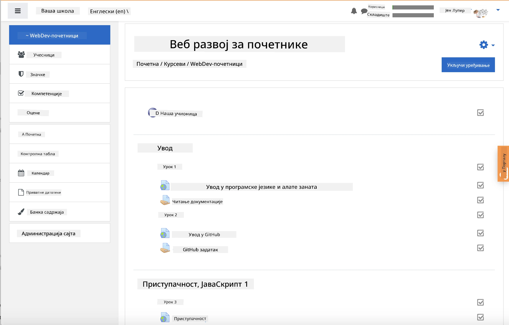
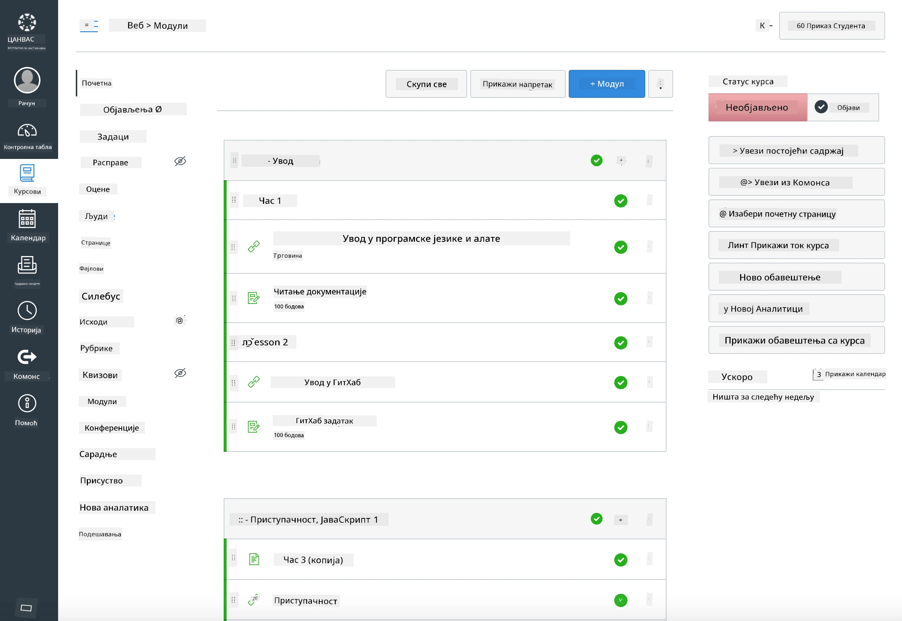

### За наставнике

Добродошли сте да користите овај наставни план у вашој учионици. Савршено функционише са GitHub Classroom и водећим платформама за управљање учењем (LMS), а може се користити и као самостални репозиторијум са вашим ученицима.

### Коришћење са GitHub Classroom

Да бисте управљали лекцијама и задацима по групама, креирајте један репозиторијум по лекцији како би GitHub Classroom могао да повезује сваки задатак независно.

- Форкујте овај репозиторијум у вашу организацију.
- Креирајте посебан репозиторијум за сваку лекцију тако што ћете издвојити сваки фолдер лекције у његов сопствени репозиторијум.
  - Опција А: Креирајте празне репозиторијуме (један по лекцији) и копирајте садржај фолдера лекције у сваки.
  - Опција Б: Користите приступ који чува историју Git-а (нпр. поделите фолдер у нови репозиторијум) ако вам је потребна историја.
- У GitHub Classroom-у, креирајте задатак за сваку лекцију и усмерите га на одговарајући репозиторијум лекције.
- Препоручена подешавања:
  - Видљивост репозиторијума: приватно за рад ученика.
  - Користите почетни код из подразумеване гране репозиторијума лекције.
  - Додајте шаблоне за проблеме и pull захтеве за квизове и предаје.
  - Опционално конфигуришите аутоматско оцењивање и тестове ако ваша лекција укључује исте.
- Корисне конвенције:
  - Имена репозиторијума као што су lesson-01-intro, lesson-02-html, итд.
  - Ознаке: квиз, задатак, потребно-прегледати, касно, поновна-предаја.
  - Ознаке/издања по групама (нпр. v2025-term1).

Савет: Избегавајте чување репозиторијума у синхронизованим фолдерима (нпр. OneDrive/Google Drive) како бисте спречили Git конфликте на Windows-у.

### Коришћење са Moodle, Canvas или Blackboard

Овај наставни план укључује пакете за увоз који су компатибилни са уобичајеним LMS токовима рада.

- Moodle: Користите Moodle датотеку за увоз [Moodle upload file](../../../../../../../teaching-files/webdev-moodle.mbz) да бисте учитали цео курс.
- Common Cartridge: Користите Common Cartridge датотеку [Common Cartridge file](../../../../../../../teaching-files/webdev-common-cartridge.imscc) за ширу LMS компатибилност.
- Напомене:
  - Moodle Cloud има ограничену подршку за Common Cartridge. Преферирајте горњу Moodle датотеку, која се такође може учитати у Canvas.
  - Након увоза, прегледајте модуле, датуме предаје и подешавања квизова како би одговарали вашем распореду термина.

> Наставни план у Moodle учионици

> Наставни план у Canvas-у

### Коришћење репозиторијума директно (без Classroom-а)

Ако не желите да користите GitHub Classroom, можете водити курс директно из овог репозиторијума.

- Синхрони/онлајн формати (Zoom/Teams):
  - Организујте кратке уводне сесије које води ментор; користите собе за групни рад за квизове.
  - Објавите временски оквир за квизове; ученици предају одговоре као GitHub Issues.
  - За колаборативне задатке, ученици раде у јавним репозиторијумима лекција и отварају pull захтеве.
- Приватни/асинхрони формати:
  - Ученици форкују сваку лекцију у своје **приватне** репозиторијуме и додају вас као сарадника.
  - Предају путем Issues (квизови) и Pull Requests (задатци) на вашем репозиторијуму учионице или њиховим приватним форковима.

### Најбоље праксе

- Пружите оријентациону лекцију о основама Git/GitHub-а, Issues и PR-ова.
- Користите чеклисте у Issues за задатке/квизове са више корака.
- Додајте CONTRIBUTING.md и CODE_OF_CONDUCT.md да бисте поставили норме учионице.
- Додајте напомене о приступачности (alt текст, титлове) и понудите штампане PDF-ове.
- Верзионирајте ваш садржај по термину и замрзните репозиторијуме лекција након објављивања.

### Повратне информације и подршка

Желимо да овај наставни план функционише за вас и ваше ученике. Молимо вас да отворите нови Issue у овом репозиторијуму за грешке, захтеве или побољшања, или започните дискусију у Teacher Corner-у.

---

**Одрицање од одговорности**:  
Овај документ је преведен коришћењем услуге за превођење помоћу вештачке интелигенције [Co-op Translator](https://github.com/Azure/co-op-translator). Иако се трудимо да обезбедимо тачност, молимо вас да имате у виду да аутоматски преводи могу садржати грешке или нетачности. Оригинални документ на његовом изворном језику треба сматрати меродавним извором. За критичне информације препоручује се професионални превод од стране људи. Не сносимо одговорност за било каква погрешна тумачења или неспоразуме који могу произаћи из коришћења овог превода.