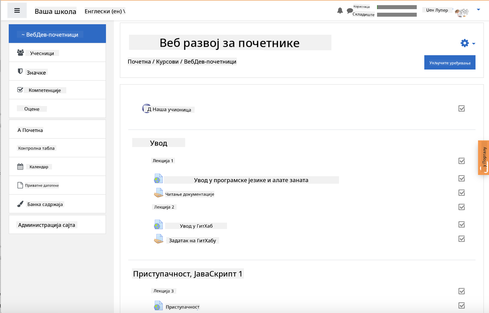
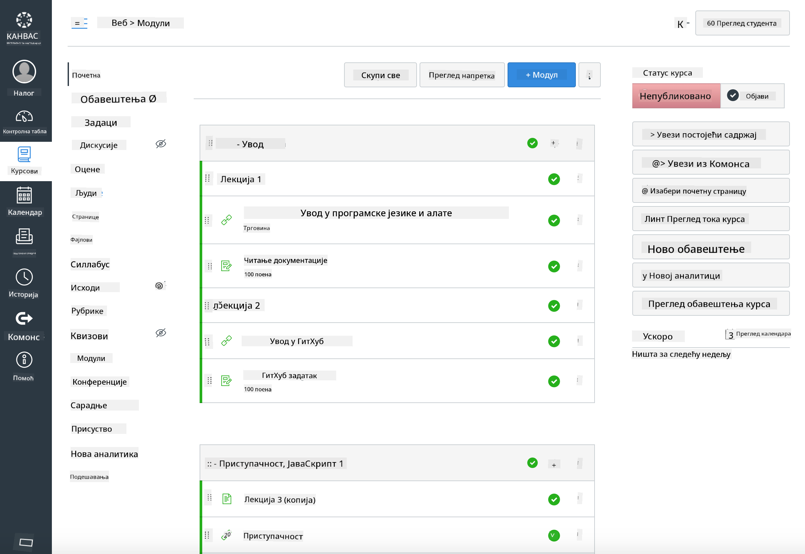

<!--
CO_OP_TRANSLATOR_METADATA:
{
  "original_hash": "75cb51f7ca9ea0b097ef4a1287e9290c",
  "translation_date": "2025-08-28T10:03:26+00:00",
  "source_file": "for-teachers.md",
  "language_code": "sr"
}
-->
## За едукаторе

Желите ли да користите овај курикулум у својој учионици? Слободно га користите!

Заправо, можете га користити директно у GitHub-у помоћу GitHub Classroom-а.

Да бисте то урадили, форкујте овај репозиторијум. Биће вам потребно да креирате репозиторијум за сваку лекцију, тако да ћете морати да издвојите сваки фолдер у посебан репозиторијум. На тај начин, [GitHub Classroom](https://classroom.github.com/classrooms) може појединачно да обради сваку лекцију.

Ова [пуна упутства](https://github.blog/2020-03-18-set-up-your-digital-classroom-with-github-classroom/) ће вам дати идеју како да подесите своју учионицу.

## Коришћење у Moodle-у, Canvas-у или Blackboard-у

Овај курикулум одлично функционише у овим системима за управљање учењем! Користите [Moodle датотеку за отпремање](../../../../../../../teaching-files/webdev-moodle.mbz) за комплетан садржај, или испробајте [Common Cartridge датотеку](../../../../../../../teaching-files/webdev-common-cartridge.imscc) која садржи део садржаја. Moodle Cloud не подржава пуне Common Cartridge извозе, па је пожељно користити Moodle датотеку за преузимање која се може отпремити у Canvas. Обавестите нас како можемо побољшати ово искуство.

> Курикулум у Moodle учионици

> Курикулум у Canvas-у

## Коришћење репозиторијума у тренутном облику

Ако желите да користите овај репозиторијум у његовом тренутном облику, без коришћења GitHub Classroom-а, и то је могуће. Биће потребно да комуницирате са својим студентима о томе коју лекцију да заједно обрађујете.

У онлајн формату (Zoom, Teams или други) можете формирати групе за квизове и менторисати студенте како би се припремили за учење. Затим позовите студенте на квизове и замолите их да пошаљу своје одговоре као 'issues' у одређено време. Исто можете урадити са задацима ако желите да студенти раде колаборативно и транспарентно.

Ако више волите приватнији формат, замолите студенте да форкују курикулум, лекцију по лекцију, у своје приватне GitHub репозиторијуме и да вам дају приступ. Тада могу приватно завршавати квизове и задатке и слати их вама преко 'issues' на вашем репозиторијуму за учионицу.

Постоји много начина да ово функционише у онлајн учионици. Обавестите нас шта вам највише одговара!

## Поделите своје утиске са нама!

Желимо да овај курикулум буде користан за вас и ваше студенте. Повежите се са нама у [углу за наставнике](https://github.com/microsoft/Web-Dev-For-Beginners/discussions/categories/teacher-corner) и отворите [**нови issue**](https://github.com/microsoft/Web-Dev-For-Beginners/issues/new/choose) за било какве захтеве, грешке и повратне информације.

---

**Одрицање од одговорности**:  
Овај документ је преведен коришћењем услуге за превођење помоћу вештачке интелигенције [Co-op Translator](https://github.com/Azure/co-op-translator). Иако се трудимо да обезбедимо тачност, молимо вас да имате у виду да аутоматски преводи могу садржати грешке или нетачности. Оригинални документ на његовом изворном језику треба сматрати ауторитативним извором. За критичне информације препоручује се професионални превод од стране људи. Не преузимамо одговорност за било каква погрешна тумачења или неспоразуме који могу настати услед коришћења овог превода.