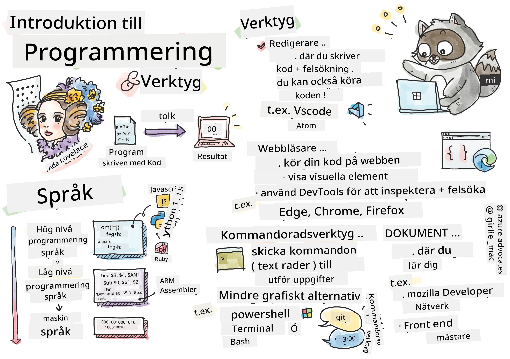
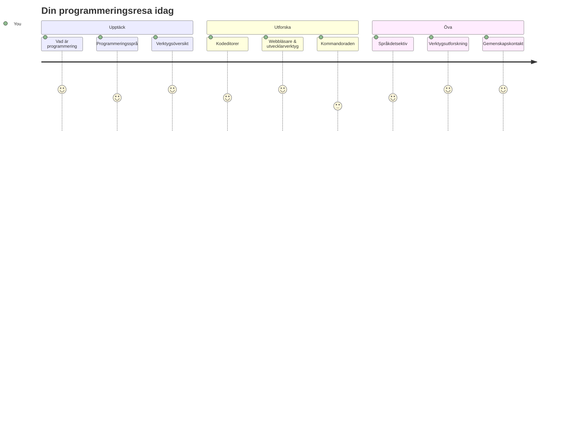
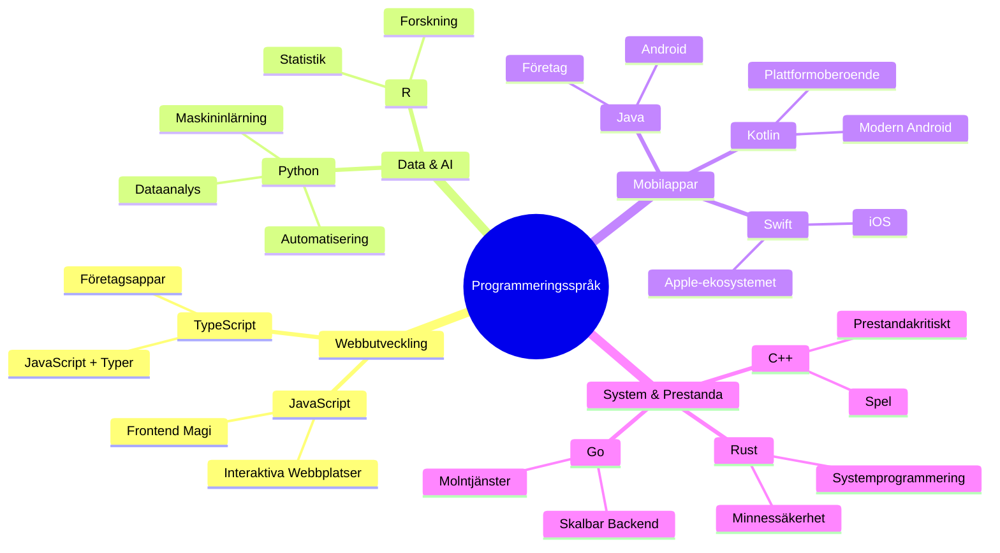
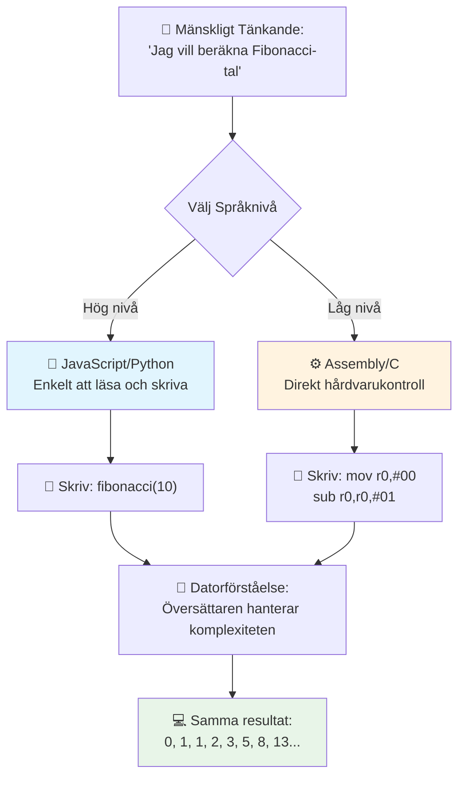
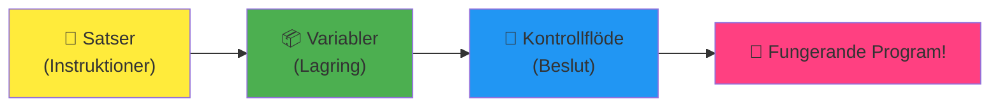
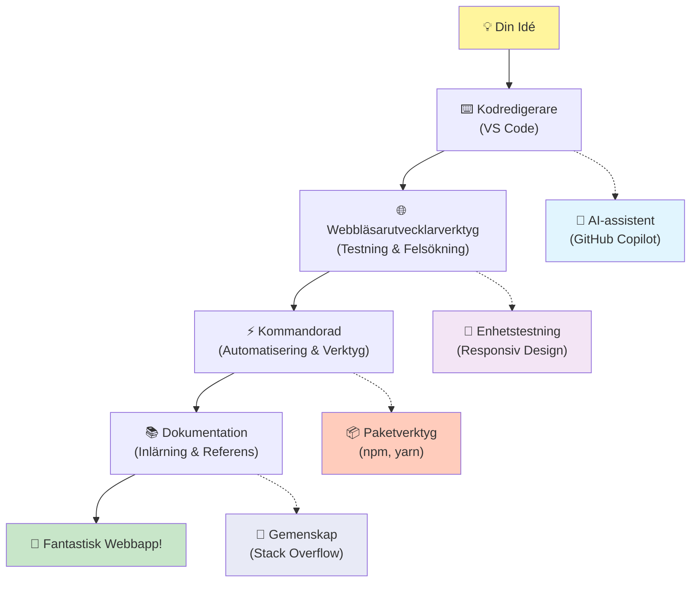
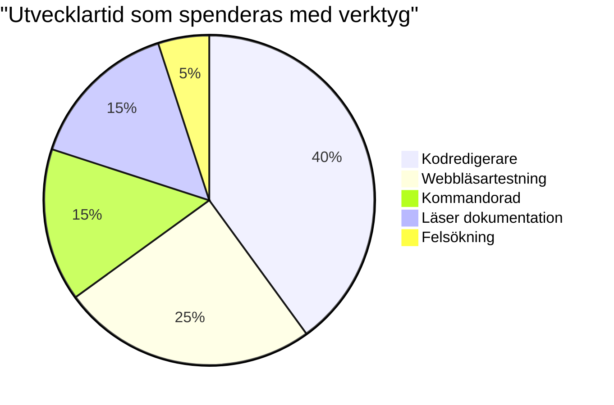
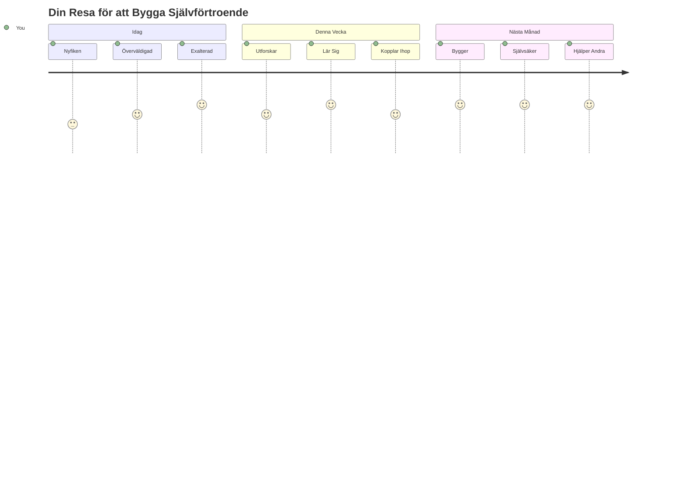

<!--
CO_OP_TRANSLATOR_METADATA:
{
  "original_hash": "d45ddcc54eb9232a76d08328b09d792e",
  "translation_date": "2026-01-06T23:15:38+00:00",
  "source_file": "1-getting-started-lessons/1-intro-to-programming-languages/README.md",
  "language_code": "sv"
}
-->
# Introduktion till programmeringsspråk och moderna utvecklarverktyg
 
Hej där, framtida utvecklare! 👋 Får jag berätta något som fortfarande ger mig rysningar varje dag? Du är på väg att upptäcka att programmering inte bara handlar om datorer – det handlar om att ha riktiga superkrafter för att förverkliga dina vildaste idéer!

Du vet det ögonblick när du använder din favoritapp och allt bara klickar perfekt? När du trycker på en knapp och något helt magiskt händer som får dig att säga "wow, hur gjorde de DET?" Någon precis som du – säkert sittande på sitt favoritkaffe på morgonen klockan 2 med sin tredje espresso – skrev koden som skapade den magin. Och här kommer något som kommer att spränga ditt sinne: i slutet av den här lektionen kommer du inte bara att förstå hur de gjorde det, utan du kommer att vara ivrig att prova själv!

Vi tar det från början: jag förstår helt om programmering känns skrämmande just nu. När jag började trodde jag ärligt talat att man behövde vara något slags mattegeni eller ha kodat sedan man var fem år gammal. Men det här är vad som helt förändrade mitt perspektiv: programmering är precis som att lära sig att prata på ett nytt språk. Du börjar med "hej" och "tack", sen beställer du en kaffe och plötsligt har du djupa filosofiska diskussioner! Fast i det här fallet pratar du med datorer, och ärligt? De är de mest tålmodiga samtalspartner du någonsin kommer att ha – de dömer aldrig dina misstag och de är alltid taggade att försöka igen!

Idag ska vi utforska de otroliga verktyg som gör modern webbprogrammering inte bara möjlig, utan riktigt beroendeframkallande. Jag menar precis samma redigerare, webbläsare och arbetsflöden som utvecklare på Netflix, Spotify och din favorit indieapp-studio använder varje dag. Och här kommer det som får dig att vilja dansa glädjedans: de flesta av dessa professionella, branschstandardverktyg är helt gratis!


> Sketchnote av [Tomomi Imura](https://twitter.com/girlie_mac)


## Låt oss se vad du redan kan!

Innan vi hoppar in i det roliga, jag är nyfiken – vad vet du redan om den här programmeringsvärlden? Och lyssna, om du tänker på de här frågorna och känner "jag har verkligen noll koll på något av det här," så är det inte bara okej, det är perfekt! Det betyder att du är precis på rätt plats. Tänk på det här quizet som att stretcha innan träningen – vi värmer bara upp hjärnmusklerna!

[Ta förtestet](https://forms.office.com/r/dru4TE0U9n?origin=lprLink)


## Äventyret vi ska gå på tillsammans

Okej, jag är genuint sprudlande av spänning över vad vi ska utforska idag! På riktigt, jag önskar att jag kunde se ditt ansikte när några av dessa koncept klickar. Här är den otroliga resan vi tar tillsammans:

- **Vad programmering egentligen är (och varför det är det coolaste som finns!)** – Vi ska upptäcka hur kod bokstavligen är den osynliga magin som driver allt runt omkring dig, från det alarm som på något sätt vet att det är måndag morgon till algoritmen som perfekt anpassar dina Netflix-rekommendationer
- **Programmeringsspråk och deras fantastiska personligheter** – Föreställ dig att du går in på en fest där varje person har helt olika superkrafter och sätt att lösa problem. Så är programmeringsspråkens värld, och du kommer att älska att träffa dem!
- **De grundläggande byggstenarna som får den digitala magin att hända** – Tänk på dessa som det ultimata kreativa LEGO-setet. När du förstår hur dessa bitar passar ihop, inser du att du bokstavligen kan bygga vad din fantasi än drömmer om
- **Professionella verktyg som får dig att känna att du just fått en trollstav** – Jag överdriver inte här – de här verktygen får dig verkligen att känna att du har superkrafter, och det bästa av allt? Det är de samma proffsen använder!

> 💡 **Här är grejen**: Försök inte ens memorera allt idag! Just nu vill jag bara att du ska känna den där gnistan av spänning över vad som är möjligt. Detaljerna fastnar naturligt när vi övar tillsammans – så lär du dig på riktigt!

> Du kan ta den här lektionen på [Microsoft Learn](https://docs.microsoft.com/learn/modules/web-development-101/introduction-programming/?WT.mc_id=academic-77807-sagibbon)!

## Så vad är egentligen *programmering*?

Okej, låt oss ta oss an miljonfrågan: vad är programmering egentligen?

Jag ger dig en historia som helt förändrade hur jag tänker på det här. Förra veckan försökte jag förklara för min mamma hur man använder vår nya smarta TV-fjärrkontroll. Jag fann mig själv säga saker som "Tryck på den röda knappen, men inte den stora röda knappen, den lilla röda knappen till vänster... nej, din andra vänster... okej, håll nu i två sekunder, inte en, inte tre..." Låter det bekant? 😅

Det är programmering! Det är konsten att ge otroligt detaljerade, steg-för-steg-instruktioner till något som är väldigt kraftfullt men som behöver allt uttalat perfekt. Fast istället för att förklara för din mamma (som kan fråga ”vilken röd knapp?!”), förklarar du för en dator (som bara gör exakt vad du säger, även om det du sa inte riktigt var vad du menade).

Här är vad som blåste bort mig när jag först lärde mig det: datorer är faktiskt ganska enkla i grunden. De förstår bokstavligen bara två saker – 1 och 0, vilket i princip är ”ja” och ”nej” eller ”på” och ”av.” Det är allt! Men här blir det magiskt – vi behöver inte prata i 1:or och 0:or som i The Matrix. Då kommer **programmeringsspråken** till undsättning. De är som världens bästa översättare som tar dina helt normala mänskliga tankar och omvandlar dem till datorspråk.

Och här är vad som fortfarande ger mig riktiga rysningar varje morgon när jag vaknar: bokstavligen *allt* digitalt i ditt liv började med någon precis som du, förmodligen sittande i pyjamas med en kopp kaffe, som skrev kod på sin laptop. Det Instagram-filter som får dig att se felfri ut? Någon kodade det. Rekommendationen som ledde dig till din nya favoritlåt? En utvecklare byggde den algoritmen. Appen som hjälper dig att dela middagsnotan med vänner? Japp, någon tänkte "det här är irriterande, jag kan nog fixa det" och sedan... gjorde de det!

När du lär dig programmera plockar du inte bara upp en ny färdighet – du blir del av den här otroliga gemenskapen av problemlösare som tillbringar sina dagar med att fundera, "Tänk om jag kunde bygga något som gör någons dag bara lite bättre?" Är det ärligt talat något coolare än det?

✅ **Rolig fakta-jakt**: Här är något supercoolt att kolla upp när du har en stund över – vem tror du var världens första programmerare? Jag ger dig en ledtråd: det är kanske inte den du väntar dig! Historien bakom den personen är helt fascinerande och visar att programmering alltid har handlat om kreativ problemlösning och att tänka utanför boxen.

### 🧠 **Check-in: Hur känner du dig?**

**Ta en stund att reflektera:**
- Känns idén "att ge instruktioner till datorer" logisk för dig nu?
- Kan du tänka på en vardagssyssla du skulle vilja automatisera med programmering?
- Vilka frågor bubblar upp i ditt huvud om hela det här programmeringsgrejen?

> **Kom ihåg**: Det är helt normalt om vissa koncept känns svåra just nu. Att lära sig programmering är som att lära sig ett nytt språk – det tar tid för hjärnan att bygga de där nervbanorna. Du gör det jättebra!

## Programmeringsspråk är som olika smaker av magi

Okej, det här kommer låta konstigt, men häng med – programmeringsspråk är mycket som olika typer av musik. Tänk så här: du har jazz, som är mjuk och improviserande, rock som är kraftfull och rak-på-sak, klassiskt som är elegant och strukturerat och hip-hop som är kreativt och uttrycksfullt. Varje stil har sin egen stämning, sin egen passionerade fan-gemenskap, och varje är perfekt för olika humör och tillfällen.

Programmeringsspråk fungerar precis likadant! Du skulle inte använda samma språk för att skapa ett kul mobilspel som du skulle använda för att bearbeta massiva mängder klimatdata, precis som du inte skulle spela death metal på yogaklassen (tja, på de flesta yogaklasser i alla fall! 😄).

Men här är det som alltid fascinerar mig när jag tänker på det: de här språken är som att ha världens mest tålmodiga, briljanta tolk sittande bredvid dig. Du kan uttrycka dina idéer på ett sätt som känns naturligt för din mänskliga hjärna, och de tar hand om all den otroligt komplexa översättningen till 1:or och 0:or som datorer faktiskt förstår. Det är som att ha en vän som är fullständigt tvåspråkig i både "mänsklig kreativitet" och "datorlogik" – och de blir aldrig trötta, behöver aldrig kaffepauser och dömer dig aldrig för att fråga samma fråga två gånger!

### Populära programmeringsspråk och deras användningsområden


| Språk | Bäst för | Varför det är populärt |
|----------|----------|------------------|
| **JavaScript** | Webbprogrammering, användargränssnitt | Körs i webbläsare och driver interaktiva webbplatser |
| **Python** | Data science, automatisering, AI | Lätt att läsa och lära sig, kraftfulla bibliotek |
| **Java** | Företagsapplikationer, Androidappar | Plattformoberoende, robust för stora system |
| **C#** | Windowsapplikationer, spelutveckling | Stark Microsoft-ekosystemsupport |
| **Go** | Molntjänster, backend-system | Snabbt, enkelt, designat för modern datoranvändning |

### Högnivå- vs. lågnivåspråk

Okej, det här var ärligt talat konceptet som knäckte min hjärna när jag först började lära mig, så jag delar gärna analogin som äntligen gjorde att det föll på plats för mig – och jag hoppas verkligen att den hjälper dig också!

Föreställ dig att du besöker ett land där du inte talar språket och du desperat behöver hitta närmaste toalett (vi har alla varit där, eller hur? 😅):

- **Lågnivåprogrammering** är som att lära sig den lokala dialekten så väl att du kan prata med farmodern som säljer frukt på hörnet med hjälp av kulturella referenser, lokal slang och interna skämt som bara någon som vuxit upp där skulle förstå. Otroligt imponerande och effektivt... om du råkar vara flytande! Men ganska överväldigande när du bara försöker hitta en toalett.

- **Högnivåprogrammering** är som att ha den fantastiska lokala vännen som bara förstår dig. Du kan säga "Jag behöver verkligen hitta en toalett" på enkel engelska, och de ta hand om all kulturell översättning och ger dig vägbeskrivningen på ett sätt som din icke-lokala hjärna fattar perfekt.

På programmeringsspråksspråk:
- **Lågnivåspråk** (som Assembly eller C) låter dig ha otroligt detaljerade samtal med datorns faktiska hårdvara, men du behöver tänka som en maskin, vilket är... tja, låt oss säga att det är en ganska stor mental omställning!
- **Högnivåspråk** (som JavaScript, Python eller C#) låter dig tänka som en människa medan de fixar allt maskinspråk bakom kulisserna. Plus att de har fantastiskt välkomnande gemenskaper fulla av människor som minns hur det var att vara ny och som verkligen vill hjälpa till!

Gissa vilka jag kommer att föreslå att du börjar med? 😉 Högnivåspråk är som att ha stödhjul som du faktiskt aldrig vill ta av eftersom de gör hela upplevelsen så mycket roligare!


### Låt mig visa varför högnivåspråk är så mycket vänligare

Okej, jag ska visa dig något som perfekt visar varför jag blev kär i högnivåspråk, men först – jag behöver att du lovar mig en sak. När du ser det första kodexemplet, få inte panik! Det ska se skrämmande ut. Det är exakt vad jag menar!

Vi ska titta på samma uppgift skriven i två helt olika stilar. Båda skapar den så kallade Fibonaccisekvensen – det är ett vackert matematiskt mönster där varje tal är summan av de två föregående: 0, 1, 1, 2, 3, 5, 8, 13... (Rolig fakta: du hittar det här mönstret bokstavligen överallt i naturen – solrosfröspiraler, mönster i kottar, till och med hur galaxer formas!)

Redo att se skillnaden? Kör vi!

**Högnivåspråk (JavaScript) – Mänskligt vänligt:**

```javascript
// Steg 1: Grundläggande Fibonacci-inställning
const fibonacciCount = 10;
let current = 0;
let next = 1;

console.log('Fibonacci sequence:');
```

**Det här gör koden:**
- **Deklarerar** en konstant för hur många Fibonacci-tal vi vill generera
- **Initierar** två variabler för att hålla koll på det aktuella och nästa tal i sekvensen
- **Sätter upp** startvärdena (0 och 1) som definierar Fibonacci-mönstret
- **Visar** en rubriktext för att identifiera vår utskrift

```javascript
// Steg 2: Generera sekvensen med en loop
for (let i = 0; i < fibonacciCount; i++) {
  console.log(`Position ${i + 1}: ${current}`);
  
  // Beräkna nästa nummer i sekvensen
  const sum = current + next;
  current = next;
  next = sum;
}
```

**Bryter ner vad som händer här:**
- **Loopar** igenom varje position i sekvensen med en `for`-loop
- **Visar** varje tal med dess position med hjälp av mallsträngar
- **Beräknar** nästa Fibonacci-tal genom att addera aktuellt och nästa värde
- **Uppdaterar** våra spårningsvariabler för att gå vidare till nästa iteration

```javascript
// Steg 3: Modernt funktionellt tillvägagångssätt
const generateFibonacci = (count) => {
  const sequence = [0, 1];
  
  for (let i = 2; i < count; i++) {
    sequence[i] = sequence[i - 1] + sequence[i - 2];
  }
  
  return sequence;
};

// Exempel på användning
const fibSequence = generateFibonacci(10);
console.log(fibSequence);
```

**I exemplet ovan har vi:**
- **Skapat** en återanvändbar funktion med modern pil-funktionssyntax
- **Byggt** en array för att lagra hela sekvensen istället för att visa ett och ett tal
- **Använt** arrayindexering för att beräkna varje nytt tal från tidigare värden
- **Returnerat** hela sekvensen för flexibel användning i andra delar av vårt program

**Lågnivåspråk (ARM Assembly) – Datorvänligt:**

```assembly
 area ascen,code,readonly
 entry
 code32
 adr r0,thumb+1
 bx r0
 code16
thumb
 mov r0,#00
 sub r0,r0,#01
 mov r1,#01
 mov r4,#10
 ldr r2,=0x40000000
back add r0,r1
 str r0,[r2]
 add r2,#04
 mov r3,r0
 mov r0,r1
 mov r1,r3
 sub r4,#01
 cmp r4,#00
 bne back
 end
```

Notera hur JavaScript-versionen läses nästan som engelska instruktioner, medan Assembly-versionen använder kryptiska kommandon som direkt styr datorns processor. Båda uppnår exakt samma uppgift, men högnivåspråket är mycket lättare för människor att förstå, skriva och underhålla.

**Viktiga skillnader du kommer att märka:**
- **Läsbarhet**: JavaScript använder beskrivande namn som `fibonacciCount` medan Assembly använder kryptiska etiketter som `r0`, `r1`
- **Kommentarer**: Hög-nivå språk uppmuntrar förklarande kommentarer som gör koden självförklarande  
- **Struktur**: JavaScripts logiska flöde matchar hur människor tänker på problem steg för steg  
- **Underhåll**: Uppdatering av JavaScript-versionen för olika krav är enkelt och tydligt  

✅ **Om Fibonaccis talföljd**: Detta helt underbara talmönster (där varje nummer är summan av de två föregående: 0, 1, 1, 2, 3, 5, 8...) dyker bokstavligen upp *överallt* i naturen! Du hittar det i solrosspiraler, grankottars mönster, hur nautilusskal böjer sig och till och med i hur trädgrenar växer. Det är ganska häpnadsväckande hur matte och kod kan hjälpa oss förstå och återskapa de mönster som naturen använder för att skapa skönhet!

## Byggstenarna som får magin att hända

Okej, nu när du har sett hur programmeringsspråk ser ut i praktiken, låt oss bryta ner de grundläggande bitarna som bygger upp bokstavligen varje program som någonsin skrivits. Tänk på dessa som de viktiga ingredienserna i ditt favoritrecept – när du förstår vad var och en gör, kommer du kunna läsa och skriva kod i nästan vilket språk som helst!

Det här är lite som att lära sig programmeringens grammatik. Kommer du ihåg när du i skolan lärde dig om substantiv, verb och hur man sätter ihop meningar? Programmering har sin egen version av grammatik, och ärligt talat är den mycket mer logisk och förlåtande än engelska grammatik någonsin var! 😄

### Satser: Steg-för-steg-instruktioner

Låt oss börja med **satser** – de är som enskilda meningar i en konversation med din dator. Varje sats berättar för datorn att göra en specifik sak, ungefär som att ge anvisningar: ”Sväng vänster här”, ”Stanna vid rött ljus”, ”Parkera på den där platsen”.

Det jag älskar med satser är hur läsbara de brukar vara. Kolla här:

```javascript
// Grundläggande satser som utför enstaka åtgärder
const userName = "Alex";                    
console.log("Hello, world!");              
const sum = 5 + 3;                         
```
  
**Här är vad den här koden gör:**  
- **Deklarerar** en konstant variabel för att lagra en användares namn  
- **Visar** ett hälsningsmeddelande i konsolens utmatning  
- **Beräknar** och lagrar resultatet av en matematisk operation  

```javascript
// Uttalanden som interagerar med webbsidor
document.title = "My Awesome Website";      
document.body.style.backgroundColor = "lightblue";
```
  
**Steg för steg, så här händer det:**  
- **Modifierar** webbplatsens titel som visas i webbläsarfliken  
- **Byter** bakgrundsfärgen på hela sidans kropp  

### Variabler: Programmets minnessystem

Okej, **variabler** är ärligt talat ett av mina absoluta favoritkoncept att lära ut eftersom de är så lika saker du redan använder varje dag!

Tänk på din telefons kontaktlista en sekund. Du memorerar inte allas telefonnummer – istället sparar du ”Mamma”, ”Bästa vän” eller ”Pizzerian som levererar till kl 2 på natten” och låter telefonen minnas de faktiska numren. Variabler fungerar precis på samma sätt! De är som märkta behållare där ditt program kan lagra information och hämta den senare med ett namn som faktiskt är begripligt.

Det riktigt coola är: variabler kan förändras medan programmet körs (därav namnet ”variabel” – ser du vad de gjorde där?). Precis som du kan uppdatera kontaktinformationen till pizzerian när du hittar ett ännu bättre ställe, kan variabler uppdateras när ditt program lär sig ny information eller när situationer förändras!

Låt mig visa hur otroligt enkelt detta kan vara:

```javascript
// Steg 1: Skapa grundläggande variabler
const siteName = "Weather Dashboard";        
let currentWeather = "sunny";               
let temperature = 75;                       
let isRaining = false;                      
```
  
**Att förstå dessa koncept:**  
- **Lagra** oföränderliga värden i `const`-variabler (som webbplatsens namn)  
- **Använda** `let` för värden som kan ändras under programmets gång  
- **Tilldela** olika datatyper: strängar (text), siffror och booleska värden (true/false)  
- **Välja** beskrivande namn som förklarar vad varje variabel innehåller  

```javascript
// Steg 2: Arbeta med objekt för att gruppera relaterad data
const weatherData = {                       
  location: "San Francisco",
  humidity: 65,
  windSpeed: 12
};
```
  
**Ovanför har vi:**  
- **Skapat** ett objekt för att gruppera relaterad väderinformation  
- **Organiserat** flera datadelar under ett variabelnamn  
- **Använt** nyckel-värde-par för att märka varje informationsdel tydligt  

```javascript
// Steg 3: Använda och uppdatera variabler
console.log(`${siteName}: Today is ${currentWeather} and ${temperature}°F`);
console.log(`Wind speed: ${weatherData.windSpeed} mph`);

// Uppdatera föränderliga variabler
currentWeather = "cloudy";                  
temperature = 68;                          
```
  
**Låt oss förstå varje del:**  
- **Visa** information med template literals med `${}`-syntax  
- **Hämta** objektets egenskaper med punktnotation (`weatherData.windSpeed`)  
- **Uppdatera** variabler deklarerade med `let` för att spegla förändrade förhållanden  
- **Kombinera** flera variabler för att skapa meningsfulla meddelanden  

```javascript
// Steg 4: Modern destrukturering för renare kod
const { location, humidity } = weatherData; 
console.log(`${location} humidity: ${humidity}%`);
```
  
**Det du behöver veta:**  
- **Extrahera** specifika egenskaper från objekt med destructuring assignment  
- **Skapa** nya variabler automatiskt med samma namn som objektets nycklar  
- **Förenkla** koden genom att undvika upprepande punktnotation  

### Kontrollflöde: Lära ditt program att tänka

Okej, här blir programmering riktigt häpnadsväckande! **Kontrollflöde** handlar i princip om att lära ditt program att fatta smarta beslut, precis som du gör varje dag utan att ens tänka på det.

Föreställ dig detta: i morse gick du säkert igenom något som ”Om det regnar, tar jag med ett paraply. Om det är kallt, tar jag på mig en jacka. Om jag är sen, hoppar jag över frukosten och tar kaffe på vägen.” Din hjärna följer naturligt detta if-then-logik dussintals gånger varje dag!

Det här är vad som får program att kännas intelligenta och levande, istället för att bara följa något tråkigt, förutsägbart manus. De kan faktiskt titta på en situation, utvärdera vad som händer och svara på rätt sätt. Det är som att ge ditt program en hjärna som kan anpassa sig och fatta val!

Vill du se hur vackert detta fungerar? Låt mig visa dig:

```javascript
// Steg 1: Grundläggande villkorslogik
const userAge = 17;

if (userAge >= 18) {
  console.log("You can vote!");
} else {
  const yearsToWait = 18 - userAge;
  console.log(`You'll be able to vote in ${yearsToWait} year(s).`);
}
```
  
**Det här gör den här koden:**  
- **Kontrollerar** om användarens ålder uppfyller röstningskravet  
- **Kör** olika kodblock baserat på villkorets resultat  
- **Beräknar** och visar hur länge det är kvar tills röstberättigande om under 18  
- **Ger** specifik, hjälpsam feedback för varje scenario  

```javascript
// Steg 2: Flera villkor med logiska operatorer
const userAge = 17;
const hasPermission = true;

if (userAge >= 18 && hasPermission) {
  console.log("Access granted: You can enter the venue.");
} else if (userAge >= 16) {
  console.log("You need parent permission to enter.");
} else {
  console.log("Sorry, you must be at least 16 years old.");
}
```
  
**Nedbrytning av vad som händer här:**  
- **Kombinerar** flera villkor med `&&` (och) operatorn  
- **Skapar** en hierarki av villkor med `else if` för flera scenarion  
- **Hantera** alla möjliga fall med en slutgiltig `else`-sats  
- **Ger** tydlig, handlingsbar feedback för varje olika situation  

```javascript
// Steg 3: Koncis villkorssats med ternär operator
const votingStatus = userAge >= 18 ? "Can vote" : "Cannot vote yet";
console.log(`Status: ${votingStatus}`);
```
  
**Det här ska du komma ihåg:**  
- **Använd** ternära operatorn (`? :`) för enkla två-vals-villkor  
- **Skriv** villkoret först, följt av `?`, sedan sant resultat, sedan `:`, sedan falskt resultat  
- **Använd** detta mönster när du behöver tilldela värden baserat på villkor  

```javascript
// Steg 4: Hantering av flera specifika fall
const dayOfWeek = "Tuesday";

switch (dayOfWeek) {
  case "Monday":
  case "Tuesday":
  case "Wednesday":
  case "Thursday":
  case "Friday":
    console.log("It's a weekday - time to work!");
    break;
  case "Saturday":
  case "Sunday":
    console.log("It's the weekend - time to relax!");
    break;
  default:
    console.log("Invalid day of the week");
}
```
  
**Den här koden gör följande:**  
- **Matchar** variabelvärdet mot flera specifika fall  
- **Grupperar** liknande fall tillsammans (veckodagar vs. helger)  
- **Kör** rätt kodblock när en matchning hittas  
- **Inkluderar** ett `default`-fall för att hantera oväntade värden  
- **Använder** `break`-satser för att hindra att koden fortsätter till nästa fall  

> 💡 **Verklighetsanalog**: Tänk på kontrollflöde som att ha världens mest tålmodiga GPS som ger dig vägbeskrivningar. Den kan säga ”Om det är trafik på Main Street, ta motorvägen istället. Om byggarbete blockerar motorvägen, försök den natursköna vägen.” Program använder exakt samma typ av villkorlig logik för att reagera smart på olika situationer och alltid ge användarna den bästa möjliga upplevelsen.

### 🎯 **Begreppskoll: Behärska byggstenarna**

**Låt oss se hur det går med grunderna:**  
- Kan du förklara skillnaden mellan en variabel och en sats med egna ord?  
- Tänk på ett verkligt scenario där du använder ett if-then-beslut (som vårt röstningsexempel)  
- Vad är en sak med programmeringslogik som förvånade dig?  

**Snabbt självförtroendeboost:**  

✅ **Vad som kommer härnäst**: Vi kommer ha så roligt när vi dyker djupare in i dessa koncept under vår otroliga resa tillsammans! Just nu, fokusera bara på att känna den där spänningen för alla fantastiska möjligheter framför dig. De specifika färdigheterna och teknikerna kommer fastna naturligt när vi övar tillsammans – jag lovar att det här kommer bli så mycket roligare än du kanske förväntar dig!

## Verktyg för jobbet

Okej, här får jag ärligt talat sådan pirr i magen att jag knappt kan hålla det inne! 🚀 Vi ska precis prata om de otroliga verktygen som kommer få dig att känna att du just fick nycklarna till ett digitalt rymdskepp.

Du vet hur en kock har de där perfekt balanserade knivarna som känns som en förlängning av deras händer? Eller hur en musiker har den där gitarren som tycks sjunga så fort de rör vid den? Ja, utvecklare har vår egen version av dessa magiska verktyg, och här är vad som kommer få dig att tappa hakan – de flesta är helt gratis!

Jag studsar nästan i stolen när jag tänker på att dela detta med dig eftersom de helt har revolutionerat hur vi bygger mjukvara. Vi pratar om AI-drivna kodassistenter som kan hjälpa dig skriva kod (jag skojar inte!), molnmiljöer där du kan bygga hela applikationer bokstavligen var som helst med Wi-Fi, och felsökningsverktyg så sofistikerade att det är som att ha röntgensyn för dina program.

Och här är delen som fortfarande ger mig rysningar: det här är inte ”nybörjarverktyg” som du kommer växa ur. Det är exakt samma professionella verktyg som utvecklare på Google, Netflix och det där indie app-studion du älskar använder just i detta ögonblick. Du kommer känna dig som ett proffs när du använder dem!


### Kodredigerare och IDE: Dina nya digitala bästa vänner  

Låt oss prata om kodredigerare – dessa är på riktigt på väg att bli dina nya favoritställen att hänga på! Tänk på dem som ditt personliga kodningssanktuarium där du kommer spendera mest tid med att skapa och förfina dina digitala alster.

Men här är vad som är helt magiskt med moderna redigerare: de är inte bara fina textredigerare. De är som att ha den smartaste, mest stödjande kodmentor som sitter bredvid dig dygnet runt. De fångar dina skrivfel innan du ens märker dem, föreslår förbättringar som får dig att se ut som ett geni, hjälper dig förstå vad varje kodbit gör, och några kan till och med förutsäga vad du är på väg att skriva och erbjuda sig att färdigställa dina tankar!

Jag minns när jag först upptäckte automatisk komplettering – jag kände nästan att jag levde i framtiden. Du börjar skriva något, och editorn säger: ”Hej, tänkte du på den här funktionen som gör exakt vad du behöver?” Det är som att ha en tankeläsare som kodkompis!

**Vad gör dessa redigerare så otroliga?**  

Moderna kodredigerare erbjuder en imponerande uppsättning funktioner designade för att boosta din produktivitet:

| Funktion | Vad den gör | Varför det hjälper |  
|---------|--------------|--------------|  
| **Syntaxmarkering** | Färglägger olika delar av din kod | Gör kod lättare att läsa och hitta fel |  
| **Automatisk komplettering** | Föreslår kod medan du skriver | Snabbar upp kodandet och minskar skrivfel |  
| **Felsökningsverktyg** | Hjälper dig hitta och fixa fel | Sparar timmar vid felsökning |  
| **Tillägg** | Lägger till specialfunktioner | Anpassa din editor efter teknik |  
| **AI-assistenter** | Föreslår kod och förklaringar | Påskyndar lärande och produktivitet |  

> 🎥 **Videoresurs**: Vill du se dessa verktyg i aktion? Kolla in den här [Tools of the Trade videon](https://youtube.com/watch?v=69WJeXGBdxg) för en omfattande översikt.

#### Rekommenderade redigerare för webbutveckling

**[Visual Studio Code](https://code.visualstudio.com/?WT.mc_id=academic-77807-sagibbon)** (Gratis)  
- Mest populär bland webbutvecklare  
- Utmärkt tilläggsekosystem  
- Inbyggd terminal och Git-integration  
- **Måste-ha-tillägg**:  
  - [GitHub Copilot](https://marketplace.visualstudio.com/items?itemName=GitHub.copilot) - AI-driven kodförslag  
  - [Live Share](https://marketplace.visualstudio.com/items?itemName=MS-vsliveshare.vsliveshare) - Samarbete i realtid  
  - [Prettier](https://marketplace.visualstudio.com/items?itemName=esbenp.prettier-vscode) - Automatisk kodformatering  
  - [Code Spell Checker](https://marketplace.visualstudio.com/items?itemName=streetsidesoftware.code-spell-checker) - Fångar stavfel i din kod  

**[JetBrains WebStorm](https://www.jetbrains.com/webstorm/)** (Betald, gratis för studenter)  
- Avancerade felsöknings- och testverktyg  
- Intelligent kodkomplettering  
- Inbyggd versionskontroll  

**Molnbaserade IDEs** (Olika prissättning)  
- [GitHub Codespaces](https://github.com/features/codespaces) - Full VS Code i din webbläsare  
- [Replit](https://replit.com/) - Perfekt för att lära sig och dela kod  
- [StackBlitz](https://stackblitz.com/) - Omedelbar full-stack webb-utveckling  

> 💡 **Kom igång tips**: Börja med Visual Studio Code – det är gratis, välanvänt i branschen och har en enorm community som skapar hjälpsamma tutorials och tillägg.

### Webbläsare: Ditt hemliga utvecklingslaboratorium

Okej, förbered dig på att bli helt uppslukad! Du vet hur du har använt webbläsare för att scrolla genom sociala medier och titta på videos? Tja, det visar sig att de har gömt det här otroliga hemliga utvecklingslaboratoriet hela tiden, bara väntande på att du ska upptäcka det!

Varje gång du högerklickar på en webbsida och väljer "Inspektera" öppnar du en dold värld av utvecklarverktyg som är ärligt talat kraftfullare än någon dyr programvara jag brukade betala hundratals kronor för. Det är som att upptäcka att ditt vanliga gamla kök har gömt ett professionellt kocklaboratorium bakom en hemlig panel!
Första gången någon visade mig webbläsarens DevTools, spenderade jag typ tre timmar bara på att klicka runt och säga "VÄNTA, KAN DEN GÖRA DET HÄR OCKSÅ?!" Du kan bokstavligen redigera vilken webbplats som helst i realtid, se exakt hur snabbt allt laddas, testa hur din sajt ser ut på olika enheter, och till och med debugga JavaScript som ett proffs. Det är helt hisnande!

**Här är varför webbläsare är ditt hemliga vapen:**

När du skapar en webbplats eller webbapplikation behöver du se hur den ser ut och beter sig i verkligheten. Webbläsare visar inte bara ditt arbete utan ger också detaljerad feedback om prestanda, tillgänglighet och potentiella problem.

#### Webbläsarens utvecklarverktyg (DevTools)

Moderna webbläsare inkluderar omfattande utvecklingspaket:

| Verktygskategori | Vad det gör | Exempel på användning |
|------------------|-------------|-----------------------|
| **Elementinspektör** | Visa och redigera HTML/CSS i realtid | Justera stil för att se omedelbara resultat |
| **Konsol** | Visa felmeddelanden och testa JavaScript | Debugga problem och experimentera med kod |
| **Nätverksmonitor** | Följa hur resurser laddas | Optimera prestanda och laddningstider |
| **Tillgänglighetskontroll** | Testa inkluderande design | Säkerställ att din sajt fungerar för alla användare |
| **Enhetssimulator** | Förhandsgranska på olika skärmstorlekar | Testa responsiv design utan flera enheter |

#### Rekommenderade webbläsare för utveckling

- **[Chrome](https://developers.google.com/web/tools/chrome-devtools/)** – Industri-standard för DevTools med omfattande dokumentation
- **[Firefox](https://developer.mozilla.org/docs/Tools)** – Utmärkta verktyg för CSS Grid och tillgänglighet
- **[Edge](https://docs.microsoft.com/microsoft-edge/devtools-guide-chromium/?WT.mc_id=academic-77807-sagibbon)** – Byggd på Chromium med Microsofts utvecklarresurser

> ⚠️ **Viktig testtips**: Testa alltid dina webbplatser i flera webbläsare! Det som fungerar perfekt i Chrome kan se annorlunda ut i Safari eller Firefox. Professionella utvecklare testar i alla stora webbläsare för att säkerställa konsekventa användarupplevelser.


### Kommandoradsverktyg: Din port till utvecklarmagi

Okej, låt oss vara helt ärliga om kommandoraden, för jag vill att du hör det från någon som verkligen förstår. När jag först såg den – bara den här skrämmande svarta skärmen med blinkande text – tänkte jag bokstavligen: "Nej, absolut inte! Det ser ut som något ur en hackarfilm från 80-talet, och jag är definitivt inte smart nog för det här!" 😅

Men här är vad jag önskar att någon hade sagt till mig då, och vad jag säger till dig nu: kommandoraden är inte läskig – det är faktiskt som att ha en direkt konversation med din dator. Tänk på det som skillnaden mellan att beställa mat via en fancy app med bilder och menyer (vilket är trevligt och enkelt) jämfört med att gå in på din favoritlokala restaurang där kocken vet precis vad du gillar och kan fixa något perfekt bara genom att du säger "överraska mig med något fantastiskt."

Kommandoraden är där utvecklare känner sig som riktiga trollkarlar. Du skriver några till synes magiska ord (okej, det är bara kommandon, men de känns magiska!), trycker på enter, och BOOM – du har skapat hela projektstrukturer, installerat kraftfulla verktyg från hela världen, eller distribuerat din app på internet för miljontals att se. När du väl får en första smak av den kraften är det ärligt talat ganska beroendeframkallande!

**Varför kommandoraden kommer bli ditt favoritverktyg:**

Medan grafiska gränssnitt är utmärkta för många uppgifter, utmärker sig kommandoraden i automatisering, precision och hastighet. Många utvecklingsverktyg fungerar primärt via kommandoradsgränssnitt, och att lära sig använda dem effektivt kan dramatiskt öka din produktivitet.

```bash
# Steg 1: Skapa och navigera till projektmappen
mkdir my-awesome-website
cd my-awesome-website
```

**Det här gör koden:**
- **Skapa** en ny katalog som heter "my-awesome-website" för ditt projekt
- **Navigera** in i den nyss skapade katalogen för att börja arbeta

```bash
# Steg 2: Initiera projektet med package.json
npm init -y

# Installera moderna utvecklingsverktyg
npm install --save-dev vite prettier eslint
npm install --save-dev @eslint/js
```

**Steg för steg händer följande:**
- **Initiera** ett nytt Node.js-projekt med standardinställningar via `npm init -y`
- **Installera** Vite som ett modernt byggverktyg för snabb utveckling och produktionsbyggen
- **Lägg till** Prettier för automatisk kodformatering och ESLint för kodkvalitetskontroller
- **Använd** flaggan `--save-dev` för att markera dessa som endast utvecklingsberoenden

```bash
# Steg 3: Skapa projektstruktur och filer
mkdir src assets
echo '<!DOCTYPE html><html><head><title>My Site</title></head><body><h1>Hello World</h1></body></html>' > index.html

# Starta utvecklingsserver
npx vite
```

**I ovanstående har vi:**
- **Organiserat** vårt projekt genom att skapa separata mappar för källkod och resurser
- **Genererat** en grundläggande HTML-fil med korrekt dokumentstruktur
- **Startat** Vites utvecklingsserver för live-uppdatering och hot module replacement

#### Viktiga kommandoradsverktyg för webbutveckling

| Verktyg | Syfte | Varför du behöver det |
|---------|-------|-----------------------|
| **[Git](https://git-scm.com/)** | Versionskontroll | Spåra ändringar, samarbeta och säkerhetskopiera ditt arbete |
| **[Node.js & npm](https://nodejs.org/)** | JavaScript-runtime & pakethanterare | Köra JavaScript utanför webbläsare, installera moderna utvecklingsverktyg |
| **[Vite](https://vitejs.dev/)** | Byggverktyg & utvecklingsserver | Super-snabb utveckling med hot module replacement |
| **[ESLint](https://eslint.org/)** | Kodkvalitet | Hitta och åtgärda problem i JavaScript automatiskt |
| **[Prettier](https://prettier.io/)** | Kodformatering | Håll din kod konsekvent formaterad och lättläst |

#### Plattformsspecifika alternativ

**Windows:**
- **[Windows Terminal](https://docs.microsoft.com/windows/terminal/?WT.mc_id=academic-77807-sagibbon)** – Modern och funktionsrik terminal
- **[PowerShell](https://docs.microsoft.com/powershell/?WT.mc_id=academic-77807-sagibbon)** 💻 – Kraftfull skriptmiljö
- **[Kommandotolken](https://docs.microsoft.com/windows-server/administration/windows-commands/?WT.mc_id=academic-77807-sagibbon)** 💻 – Traditionell Windows-kommandorad

**macOS:**
- **[Terminal](https://support.apple.com/guide/terminal/)** 💻 – Inbyggd terminalapplikation
- **[iTerm2](https://iterm2.com/)** – Förbättrad terminal med avancerade funktioner

**Linux:**
- **[Bash](https://www.gnu.org/software/bash/)** 💻 – Standard Linux-skal
- **[KDE Konsole](https://docs.kde.org/trunk5/en/konsole/konsole/index.html)** – Avancerad terminalemulator

> 💻 = Förinstallerad i operativsystemet

> 🎯 **Lärandeväg**: Börja med grundläggande kommandon som `cd` (byt katalog), `ls` eller `dir` (lista filer) och `mkdir` (skapa mapp). Öva med moderna arbetsflödeskommandon som `npm install`, `git status` och `code .` (öppnar aktuell katalog i VS Code). När du blir bekväm kommer du naturligt att lära dig mer avancerade kommandon och automatiseringstekniker.


### Dokumentation: Din alltid tillgängliga lärarmästare

Okej, låt mig dela en liten hemlighet som kommer få dig att må mycket bättre över att vara nybörjare: även de mest erfarna utvecklarna spenderar en stor del av sin tid på att läsa dokumentation. Och det är inte för att de inte vet vad de gör – det är faktiskt ett tecken på visdom!

Tänk på dokumentation som tillgång till världens mest tålmodiga, kunniga lärare som är tillgängliga dygnet runt. Sitter du fast med ett problem klockan 2 på natten? Dokumentationen finns där med en varm virtuell kram och exakt det svar du behöver. Vill du lära dig om en cool ny funktion som alla pratar om? Dokumentationen har din rygg med steg-för-steg-exempel. Försöker du förstå varför något fungerar som det gör? Du gissade rätt – dokumentationen är redo att förklara det på ett sätt som äntligen gör att det klickar!

Här är något som helt förändrade min syn: webbutvecklingsvärlden rör sig otroligt snabbt, och ingen (menar verkligen ingen!) kan allt utantill. Jag har sett seniora utvecklare med 15+ års erfarenhet slå upp grundläggande syntax, och vet du vad? Det är inte pinsamt – det är smart! Det handlar inte om att ha perfekt minne, utan om att veta var man snabbt hittar pålitliga svar och förstå hur man använder dem.

**Här händer den verkliga magin:**

Professionella utvecklare tillbringar en stor del av sin tid med att läsa dokumentation – inte för att de inte vet vad de gör, utan för att landskapet inom webbutveckling förändras så snabbt att det kräver kontinuerligt lärande. Bra dokumentation hjälper dig förstå inte bara *hur* något används, utan *varför* och *när* det ska användas.

#### Viktiga dokumentationsresurser

**[Mozilla Developer Network (MDN)](https://developer.mozilla.org/docs/Web)**
- Guldkällan för dokumentation om webteknik
- Omfattande guider för HTML, CSS och JavaScript
- Innehåller information om webbläsarkompatibilitet
- Har praktiska exempel och interaktiva demoer

**[Web.dev](https://web.dev)** (av Google)
- Moderna bästa praxis för webbutveckling
- Guider för prestandaoptimering
- Tillgänglighet och inkluderande designprinciper
- Fallstudier från verkliga projekt

**[Microsoft Developer Documentation](https://docs.microsoft.com/microsoft-edge/#microsoft-edge-for-developers)**
- Utvecklarresurser för Edge-webbläsaren
- Guider för progressiva webbappar
- Insikter om plattformsoberoende utveckling

**[Frontend Masters Learning Paths](https://frontendmasters.com/learn/)**
- Strukturerade lärandekurser
- Videokurser från branschexperter
- Praktiska kodningsövningar

> 📚 **Studietips**: Försök inte memorera dokumentationen – lär dig istället navigera effektivt. Bokmärk ofta använda referenser och öva på att använda sökfunktioner för att snabbt hitta specifik information.

### 🔧 **Verktygsmästerskap: Vad tilltalar dig mest?**

**Ta en stund att fundera:**
- Vilket verktyg ser du mest fram emot att testa först? (Det finns inget fel svar!)
- Känns kommandoraden fortfarande skrämmande, eller är du nyfiken?
- Kan du tänka dig att använda webbläsarens DevTools för att kika bakom kulisserna på dina favoritwebbplatser?


> **Rolig insikt**: De flesta utvecklare tillbringar ungefär 40 % av sin tid i sin kodredigerare, men märker hur mycket tid som går åt till testning, lärande och problemlösning. Programmering handlar inte bara om att skriva kod – det handlar om att skapa upplevelser!

✅ **Att fundera på**: Här är något intressant att tänka på – hur tror du att verktygen för att bygga webbplatser (utveckling) skiljer sig från verktygen för att designa hur de ser ut (design)? Det är som skillnaden mellan att vara en arkitekt som designar ett vackert hus och en entreprenör som faktiskt bygger det. Båda är avgörande, men behöver olika verktygslådor! Den typen av tänkande hjälper dig verkligen att se helheten av hur webbplatser blir till.

## GitHub Copilot Agent-utmaning 🚀

Använd Agent-läget för att slutföra följande utmaning:

**Beskrivning:** Utforska funktionerna i en modern kodredigerare eller IDE och visa hur den kan förbättra ditt arbetsflöde som webbutvecklare.

**Uppmaning:** Välj en kodredigerare eller IDE (som Visual Studio Code, WebStorm eller en molnbaserad IDE). Lista tre funktioner eller tillägg som hjälper dig att skriva, debugga eller underhålla kod mer effektivt. Ge för varje en kort förklaring av hur det gynnar ditt arbetsflöde.

---

## 🚀 Utmaning

**Okej, detektiv, redo för ditt första fall?**

Nu när du har fått den här fantastiska grunden, har jag ett äventyr som kommer hjälpa dig se hur otroligt mångsidig och fascinerande programmeringsvärlden egentligen är. Och lyssna – det handlar inte om att skriva kod än, så ingen press! Tänk dig att du är en detektiv inom programmeringsspråk på ditt allra första spännande fall!

**Din uppgift, om du väljer att acceptera den:**
1. **Bli en språkupptäckare**: Välj tre programmeringsspråk från helt olika världar – kanske ett som bygger webbplatser, ett som skapar mobilappar, och ett som analyserar data för forskare. Hitta exempel på samma enkla uppgift skrivna i varje språk. Jag lovar att du kommer bli helt amazed över hur olika de kan se ut fast de gör exakt samma sak!

2. **Upptäck deras ursprung**: Vad gör varje språk speciellt? Här är en cool grej – varje programmeringsspråk skapades för att någon tänkte, "Vet du vad? Det måste finnas ett bättre sätt att lösa just det här problemet." Kan du lista ut vilka problem det var? Några av de här historierna är verkligen fascinerande!

3. **Möt communityn**: Kolla hur välkomnande och passionerad varje språk community är. Vissa har miljontals utvecklare som delar kunskap och hjälper varandra, andra är mindre men otroligt sammansvetsade och stödjande. Du kommer älska att se de olika personligheterna i dessa communityn!

4. **Lyssna på magkänslan**: Vilket språk känns mest tillgängligt för dig just nu? Stressa inte över att göra "det perfekta" valet – lita bara på din magkänsla! Det finns ärligt talat inget fel svar och du kan alltid utforska andra senare.

**Bonusdetektivarbete**: Se om du kan ta reda på vilka stora webbplatser eller appar som är byggda med varje språk. Jag lovar att du kommer bli chockad över att få veta vad som driver Instagram, Netflix eller det där mobilsspelet du inte kan sluta spela!

> 💡 **Kom ihåg**: Du försöker inte bli expert i något av dessa språk idag. Du lär bara känna kvarteren innan du bestämmer dig för var du vill slå dig ner. Ta din tid, ha kul och låt nyfikenheten leda dig!

## Låt oss fira det du upptäckt!

Holy moly, du har tagit till dig så mycket otrolig information idag! Jag är verkligen peppad på att se hur mycket av denna fantastiska resa som fastnat hos dig. Och kom ihåg – det här är inget test där du måste göra allt perfekt. Det här är mer som en fest för allt häftigt du lärt dig om den fascinerande världen du är på väg att dyka in i!

[Ta efter-lektionen-testet](https://ff-quizzes.netlify.app/web/)
## Review & Självstudier

**Ta din tid att utforska och ha kul med det!**

Du har täckt mycket idag, och det är något att vara stolt över! Nu kommer den roliga delen – att utforska de ämnen som väckte din nyfikenhet. Kom ihåg, det här är inget läxor – det är ett äventyr!

**Fördjupa dig i det som intresserar dig:**

**Prova på programmeringsspråk:**
- Besök de officiella webbplatserna för 2-3 språk som fångade ditt intresse. Varje språk har sin egen personlighet och historia!
- Testa några online kodningsmiljöer som [CodePen](https://codepen.io/), [JSFiddle](https://jsfiddle.net/), eller [Replit](https://replit.com/). Var inte rädd för att experimentera – du kan inte förstöra något!
- Läs om hur ditt favoritprogrammeringsspråk kom till. Seriöst, några av dessa ursprungshistorier är fascinerande och hjälper dig att förstå varför språken fungerar som de gör.

**Bli bekväm med dina nya verktyg:**
- Ladda ner Visual Studio Code om du inte redan gjort det – det är gratis och du kommer att älska det!
- Spendera några minuter på att bläddra i Extensions-marknaden. Det är som en app-butik för din kodredigerare!
- Öppna din webbläsares utvecklarverktyg och klicka runt. Oroa dig inte för att förstå allt – lär dig bara var saker finns.

**Gå med i communityn:**
- Följ några utvecklarcommunities på [Dev.to](https://dev.to/), [Stack Overflow](https://stackoverflow.com/), eller [GitHub](https://github.com/). Programmeringscommunityn är otroligt välkomnande för nybörjare!
- Titta på nybörjarvänliga kodningsvideor på YouTube. Det finns så många fantastiska skapare där ute som minns hur det var att börja.
- Överväg att gå med i lokala meetups eller online-communities. Tro mig, utvecklare älskar att hjälpa nybörjare!

> 🎯 **Lyssna, det här vill jag att du ska minnas**: Du förväntas inte bli en kodningsmagiker över en natt! Just nu lär du bara känna denna fantastiska nya värld som du ska bli en del av. Ta din tid, njut av resan, och kom ihåg – varje enda utvecklare du beundrar har en gång suttit precis där du är nu, känt sig exalterad och kanske lite överväldigad. Det är helt normalt, och det betyder att du gör rätt!


## Uppgift

[Reading the Docs](assignment.md)

> 💡 **En liten puff för din uppgift**: Jag skulle verkligen vilja se dig utforska några verktyg som vi inte har täckt än! Hoppa över redigerare, webbläsare och kommandoradsverktyg som vi redan gått igenom – det finns en hel fantastisk värld av utvecklingsverktyg där ute som bara väntar på att bli upptäckta. Leta efter de som är aktivt underhållna och har livliga, hjälpsamma communities (de brukar ha de bästa guiderna och de mest stödjande människorna när du ofrånkomligt fastnar och behöver en hjälpande hand).

---

## 🚀 Din programmeringsresa tidslinje

### ⚡ **Vad du kan göra de kommande 5 minuterna**
- [ ] Bokmärk 2-3 webbplatser för programmeringsspråk som fångade ditt intresse
- [ ] Ladda ner Visual Studio Code om du inte redan gjort det
- [ ] Öppna din webbläsares DevTools (F12) och klicka runt på någon webbplats
- [ ] Gå med i en programmeringscommunity (Dev.to, Reddit r/webdev, eller Stack Overflow)

### ⏰ **Vad du kan åstadkomma denna timme**
- [ ] Gör post-lektions quiz och reflektera över dina svar
- [ ] Installera GitHub Copilot-tillägget i VS Code
- [ ] Testa ett "Hello World"-exempel i 2 olika programmeringsspråk online
- [ ] Titta på en "En dag i livet av en utvecklare"-video på YouTube
- [ ] Börja ditt detektivarbete om programmeringsspråk (från utmaningen)

### 📅 **Ditt veckolånga äventyr**
- [ ] Slutför uppgiften och utforska 3 nya utvecklingsverktyg
- [ ] Följ 5 utvecklare eller programmeringskonton på sociala medier
- [ ] Försök bygga något litet i CodePen eller Replit (till och med "Hello, [Ditt Namn]!")
- [ ] Läs ett blogginlägg av en utvecklare om deras kodningsresa
- [ ] Gå med i ett virtuellt meetup eller titta på ett programmeringsföredrag
- [ ] Börja lära dig ditt valda språk med online-handledning

### 🗓️ **Din månadslånga förändring**
- [ ] Bygg ditt första lilla projekt (ännu en enkel webbsida räknas!)
- [ ] Bidra till ett open source-projekt (börja med dokumentationsfixar)
- [ ] Mentor någon som precis börjat sin programmeringsresa
- [ ] Skapa din utvecklarportfolio-webbplats
- [ ] Koppla ihop med lokala utvecklarcommunities eller studiegrupper
- [ ] Börja planera din nästa lärandemilstolpe

### 🎯 **Slutlig reflektion**

**Innan du går vidare, ta en stund att fira:**
- Vad är en sak med programmering som fick dig att känna dig exalterad idag?
- Vilket verktyg eller koncept vill du utforska först?
- Hur känner du om att börja denna programmeringsresa?
- Vad är en fråga du skulle vilja ställa en utvecklare just nu?


> 🌟 **Kom ihåg**: Varje expert var en gång en nybörjare. Varje seniorutvecklare har känt precis som du gör just nu – exalterad, kanske lite överväldigad, och definitivt nyfiken på vad som är möjligt. Du är i fantastisk sällskap, och denna resa kommer att bli otrolig. Välkommen till den underbara världen av programmering! 🎉

---

<!-- CO-OP TRANSLATOR DISCLAIMER START -->
**Ansvarsfriskrivning**:
Detta dokument har översatts med hjälp av AI-översättningstjänsten [Co-op Translator](https://github.com/Azure/co-op-translator). Även om vi strävar efter noggrannhet, var vänlig observera att automatiska översättningar kan innehålla fel eller brister. Originaldokumentet på dess ursprungliga språk bör betraktas som den auktoritativa källan. För kritisk information rekommenderas professionell humanöversättning. Vi ansvarar inte för eventuella missförstånd eller feltolkningar som uppstår till följd av användningen av denna översättning.
<!-- CO-OP TRANSLATOR DISCLAIMER END -->