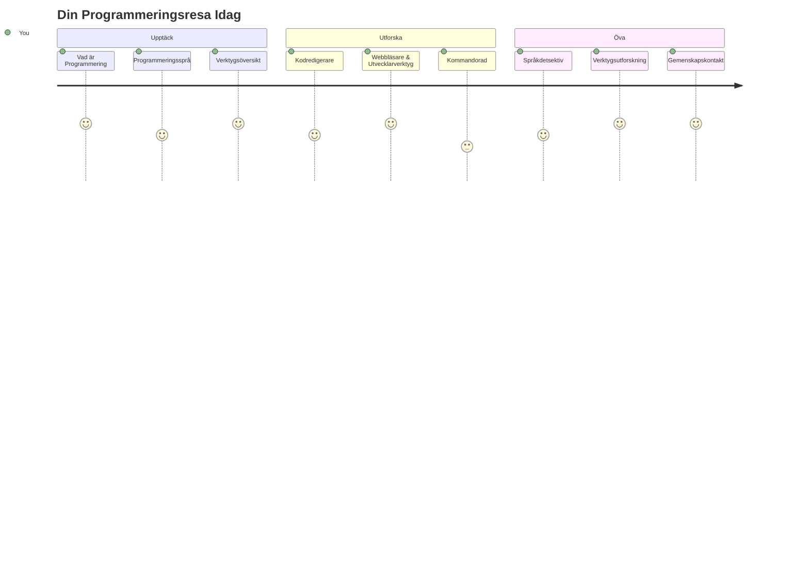
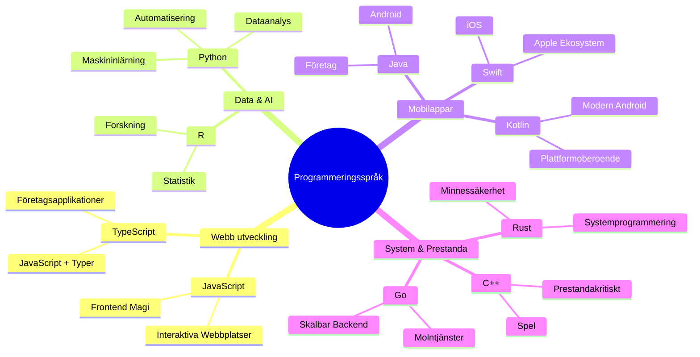
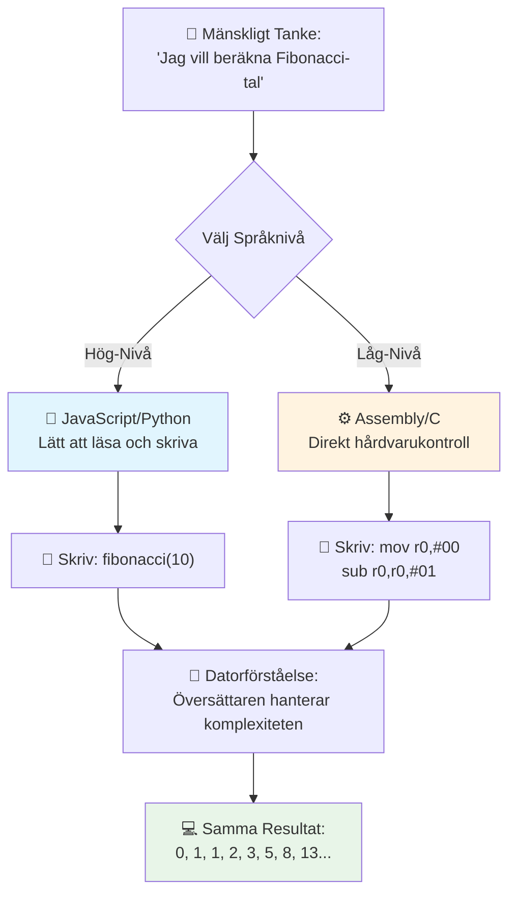
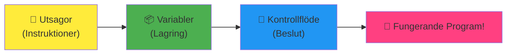
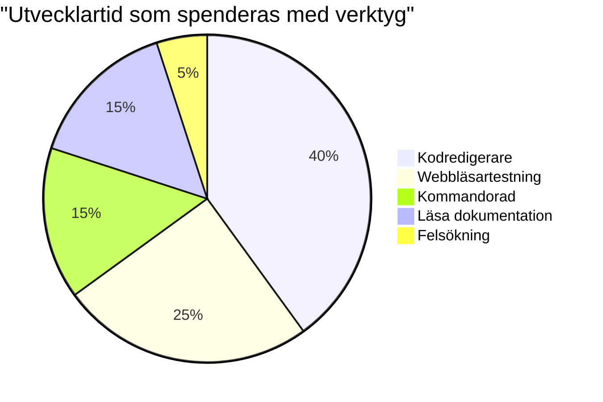
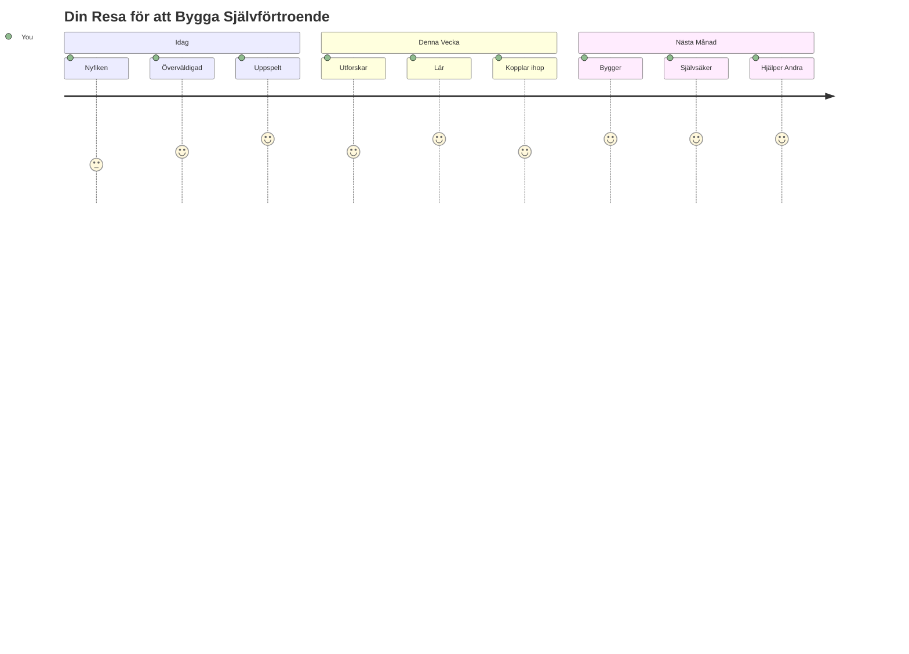

# Introduktion till programmeringsspråk och moderna utvecklarverktyg

Hej där, blivande utvecklare! 👋 Kan jag berätta något som fortfarande ger mig rysningar varje dag? Du är på väg att upptäcka att programmering inte bara handlar om datorer – det handlar om att ha verkliga superkrafter för att förverkliga dina vildaste idéer!

Du vet det ögonblick när du använder din favoritapp och allt klickar perfekt? När du trycker på en knapp och något helt magiskt händer som får dig att tänka "wow, hur GJORDE de det?" Någon precis som du – förmodligen sittande på sitt favoritkafé klockan 2 på morgonen med sin tredje espresso – skrev koden som skapade den magin. Och här är något som kommer att blåsa dig av stolen: i slutet av denna lektion kommer du inte bara förstå hur de gjorde det, utan du kommer att vara ivrig att prova själv!

Lyssna, jag förstår helt om programmering känns skrämmande just nu. När jag började trodde jag faktiskt att man var tvungen att vara något slags mattegeni eller ha kodat sedan man var fem år gammal. Men här är vad som helt förändrade mitt perspektiv: programmering är precis som att lära sig att föra samtal på ett nytt språk. Du börjar med "hej" och "tack," sedan går du vidare till att beställa kaffe, och innan du vet ordet av håller du djupa filosofiska diskussioner! Fast i det här fallet pratar du med datorer, och ärligt talat? De är de tålamodigaste samtalspartnerna du någonsin kommer att hitta – de dömer aldrig dina misstag och är alltid lika glada att försöka igen!

Idag ska vi utforska de otroliga verktyg som gör modern webbutveckling inte bara möjlig, utan seriöst beroendeframkallande. Jag pratar om exakt samma redigerare, webbläsare och arbetsflöden som utvecklare på Netflix, Spotify och din favorit indie-appstudio använder varje dag. Och här är delen som kommer få dig att göra en glad dans: de flesta av dessa professionella, industristandard verktyg är helt gratis!


> Sketchnote av [Tomomi Imura](https://twitter.com/girlie_mac)


```mermaid
journey
    title Din Programmeringsresa Idag
    section Upptäck
      Vad är Programmering: 5: You
      Programmeringsspråk: 4: You
      Verktygsöversikt: 5: You
    section Utforska
      Kodredigerare: 4: You
      Webbläsare & Utvecklarverktyg: 5: You
      Kommandorad: 3: You
    section Öva
      Språkdetsektiv: 4: You
      Verktygsutforskning: 5: You
      Gemenskapskontakt: 5: You
```
## Låt oss se vad du redan kan!

Innan vi hoppar in i det roliga är jag nyfiken – vad vet du redan om den här programmeringsvärlden? Och hör här, om du ser på dessa frågor och tänker "jag har bokstavligen noll koll på det här," så är det inte bara okej, det är perfekt! Det betyder att du är på exakt rätt plats. Tänk på detta quiz som stretching före ett träningspass – vi värmer bara upp hjärnmusklerna!

[Ta för-lektionsquizet](https://ff-quizzes.netlify.app/web/)


## Äventyret vi snart ska ge oss ut på tillsammans

Okej, jag bubblar verkligen av spänning över vad vi ska utforska idag! Seriöst, jag önskar att jag kunde se ditt ansikte när några av dessa koncept klickar. Här är den otroliga resan vi gör tillsammans:

- **Vad programmering egentligen är (och varför det är det coolaste någonsin!)** – Vi ska upptäcka hur kod bokstavligen är den osynliga magin som driver allt runt omkring dig, från alarmet som på något sätt vet att det är måndag morgon till algoritmen som perfekt kuraterar dina rekommendationer på Netflix
- **Programmeringsspråk och deras fantastiska personligheter** – Föreställ dig att gå in på en fest där varje person har helt olika superkrafter och sätt att lösa problem på. Så är programmeringsspråkens värld, och du kommer att älska att träffa dem!
- **De grundläggande byggstenarna som får digital magi att hända** – Tänk på detta som det ultimata kreativa LEGO-setet. När du förstår hur dessa delar passar ihop kommer du inse att du bokstavligen kan bygga vad som helst din fantasi drömmer om
- **Professionella verktyg som får dig att känna att du just fått en trollspö** – Jag överdriver inte här – de här verktygen kommer verkligen få dig att känna att du har superkrafter, och det bästa? Det är samma verktyg som proffsen använder!

> 💡 **Här är saken**: Försök inte ens memorera allt idag! Just nu vill jag bara att du ska känna det där pirret av spänning över vad som är möjligt. Detaljerna fastnar naturligt när vi övar tillsammans – så funkar riktig inlärning!

> Du kan ta denna lektion på [Microsoft Learn](https://learn.microsoft.com/en-us/learn/modules/web-development-101/introduction-programming/?WT.mc_id=academic-77807-sagibbon)!

## Så vad exakt *är* programmering?

Okej, låt oss ta itu med den miljonfrågan: vad är programmering, egentligen?

Jag ska ge dig en historia som helt förändrade hur jag tänker om detta. Förra veckan försökte jag förklara för min mamma hur man använder vår nya smarta TV-fjärrkontroll. Jag fångade mig själv när jag sa saker som "Tryck på den röda knappen, men inte den stora röda knappen, den lilla röda knappen till vänster… nej, din andra vänster… okej, håll den i två sekunder, inte en, inte tre..." Känner du igen dig? 😅

Det är programmering! Det är konsten att ge otroligt detaljerade, steg-för-steg instruktioner till något som är väldigt kraftfullt men behöver allt stavat helt perfekt. Fast istället för att förklara för din mamma (som kan fråga "vilken röd knapp?!"), förklarar du för en dator (som bara gör exakt vad du säger, även om det du sa inte riktigt är vad du menade).

Här är vad som blåste mitt sinne när jag först lärde mig detta: datorer är faktiskt ganska enkla i grunden. De förstår bokstavligen bara två saker – 1 och 0, vilket i princip bara är "ja" och "nej" eller "på" och "av." Det är allt! Men här blir det magiskt – vi behöver inte tala i 1 och 0 som i The Matrix. Det är där **programmeringsspråken** räddar oss. De är som att ha världens bästa översättare som tar dina helt normala mänskliga tankar och konverterar dem till datorns språk.

Och här är något som fortfarande ger mig kalla kårar varje morgon när jag vaknar: bokstavligen *allt* digitalt i ditt liv började med någon precis som du, antagligen sittande i sina pyjamas med en kopp kaffe, skrivande kod på sin laptop. Det Instagramfilter som får dig att se felfri ut? Någon kodade det. Rekommendationen som ledde dig till din nya favoritlåt? En utvecklare byggde den algoritmen. Appen som hjälper dig att dela notan med vänner? Japp, någon tänkte "det här är irriterande, jag tror jag kan fixa det" och sedan... gjorde de det!

När du lär dig programmera plockar du inte bara upp en ny färdighet – du blir en del av denna otroliga gemenskap av problemlösare som tillbringar sina dagar med att tänka, "Tänk om jag kunde bygga något som gör någons dag lite bättre?" Ärligt talat, finns det något coolare än det?

✅ **Rolig fakta-jakt**: Här är något supercoolt att kolla upp när du har en stund över – vem tror du var världens första programmerare? Jag ger dig en ledtråd: det är kanske inte den du förväntar dig! Historien bakom denna person är helt fascinerande och visar att programmering alltid har handlat om kreativ problemlösning och att tänka utanför boxen.

### 🧠 **Dags för en check-in: Hur känner du dig?**

**Ta en stund att reflektera:**
- Känns idén att "ge instruktioner till datorer" som något du förstår nu?
- Kan du tänka dig en daglig uppgift du skulle vilja automatisera med programmering?
- Vilka frågor bubblar upp i ditt sinne om hela detta programmeringsgrej?

> **Kom ihåg**: Det är helt normalt om vissa koncept känns oklara just nu. Att lära sig programmering är som att lära sig ett nytt språk – det tar tid för hjärnan att bygga de där nervbanorna. Du gör det jättebra!

## Programmeringsspråk är som olika smaker av magi

Okej, det här kommer låta konstigt, men häng kvar – programmeringsspråk är mycket som olika typer av musik. Tänk efter: du har jazz, som är mjuk och improviserad, rock som är kraftfull och rak på sak, klassisk som är elegant och strukturerad, och hip-hop som är kreativ och uttrycksfull. Varje stil har sin egen stämning, sin egen community av passionerade fans, och varje passar för olika humör och tillfällen.

Programmeringsspråken fungerar exakt likadant! Du skulle inte använda samma språk för att bygga ett roligt mobilspel som du använder för att bearbeta massiva mängder klimatdata, precis som du inte spelar death metal på yogaklassen (tja, de flesta yogaklasserna i alla fall! 😄).

Men här är något som alltid förbluffar mig varje gång jag tänker på det: dessa språk är som att ha världens mest tålmodiga, briljanta tolk sittandes bredvid dig. Du kan uttrycka dina idéer på ett sätt som känns naturligt för din mänskliga hjärna, och de sköter allt det otroligt komplexa arbetet med att översätta det till 1:or och 0:or som datorer faktiskt talar. Det är som att ha en vän som är perfekt flytande i både "mänsklig kreativitet" och "datorlogik" – och de blir aldrig trötta, behöver aldrig kaffepauser och dömer dig aldrig för att du frågar samma fråga två gånger!

### Populära programmeringsspråk och deras användningsområden


```mermaid
mindmap
  root((Programmeringsspråk))
    Webb utveckling
      JavaScript
        Frontend Magi
        Interaktiva Webbplatser
      TypeScript
        JavaScript + Typer
        Företagsapplikationer
    Data & AI
      Python
        Dataanalys
        Maskininlärning
        Automatisering
      R
        Statistik
        Forskning
    Mobilappar
      Java
        Android
        Företag
      Swift
        iOS
        Apple Ekosystem
      Kotlin
        Modern Android
        Plattformoberoende
    System & Prestanda
      C++
        Spel
        Prestandakritiskt
      Rust
        Minnessäkerhet
        Systemprogrammering
      Go
        Molntjänster
        Skalbar Backend
```
| Språk | Bäst för | Varför det är populärt |
|----------|----------|------------------|
| **JavaScript** | Webb utveckling, användargränssnitt | Körs i webbläsare och driver interaktiva webbplatser |
| **Python** | Data science, automatisering, AI | Lätt att läsa och lära, kraftfulla bibliotek |
| **Java** | Företagsapplikationer, Android-appar | Plattformoberoende, robust för stora system |
| **C#** | Windows-appar, spelutveckling | Stark Microsoft-ekosystemsupport |
| **Go** | Molntjänster, backend-system | Snabbt, enkelt, designat för modern databehandling |

### Högnivå- vs. lågnivåspråk

Okej, detta var ärligt talat konceptet som knäckte min hjärna när jag först började lära mig, så jag ska dela med mig av analogin som äntligen fick det att klicka för mig – och jag hoppas verkligen att det hjälper dig också!

Föreställ dig att du besöker ett land där du inte talar språket, och du desperat behöver hitta närmaste toalett (vi har alla varit där, eller hur? 😅):

- **Lågnivåprogrammering** är som att lära sig den lokala dialekten så väl att du kan prata med farmodern som säljer frukt på hörnet med hjälp av kulturella referenser, lokala slanguttryck och interna skämt som bara någon som växte upp där skulle förstå. Superimponerande och otroligt effektivt... om du råkar vara flytande! Men ganska överväldigande när du bara försöker hitta en toalett.

- **Högnivåprogrammering** är som att ha den där fantastiska lokala vännen som bara förstår dig. Du kan säga "Jag behöver verkligen hitta en toalett" på enkel engelska, och de sköter all kulturell översättning och ger dig vägbeskrivningar på ett sätt som gör perfekt mening för din icke-lokala hjärna.

I programmeringstermer:
- **Lågnivåspråk** (som Assembly eller C) låter dig ha otroligt detaljerade samtal med datorns faktiska hårdvara, men du måste tänka som en maskin, vilket är... tja, låt oss säga att det är en stor mental omställning!
- **Högnivåspråk** (som JavaScript, Python eller C#) låter dig tänka som en människa medan de sköter all maskinspråk bakom kulisserna. Dessutom har de dessa otroligt välkomnande communityn fulla av människor som minns hur det var att vara ny och verkligen vill hjälpa!

Gissa vilka jag kommer att föreslå att du börjar med? 😉 Högnivåspråk är som att ha stödhjul som du aldrig egentligen vill ta bort för de gör hela upplevelsen mycket roligare!


```mermaid
flowchart TB
    A["👤 Mänskligt Tanke:<br/>'Jag vill beräkna Fibonacci-tal'"] --> B{Välj Språknivå}
    
    B -->|Hög-Nivå| C["🌟 JavaScript/Python<br/>Lätt att läsa och skriva"]
    B -->|Låg-Nivå| D["⚙️ Assembly/C<br/>Direkt hårdvarukontroll"]
    
    C --> E["📝 Skriv: fibonacci(10)"]
    D --> F["📝 Skriv: mov r0,#00<br/>sub r0,r0,#01"]
    
    E --> G["🤖 Datorförståelse:<br/>Översättaren hanterar komplexiteten"]
    F --> G
    
    G --> H["💻 Samma Resultat:<br/>0, 1, 1, 2, 3, 5, 8, 13..."]
    
    style C fill:#e1f5fe
    style D fill:#fff3e0
    style H fill:#e8f5e8
```
### Låt mig visa varför högnivåspråk är så mycket vänligare

Okej, jag ska visa dig något som perfekt visar varför jag blev kär i högnivåspråk, men först – jag behöver att du lovar mig en sak. När du ser det första kodexemplet, panika inte! Det är meningen att det ska se skrämmande ut. Det är precis poängen jag vill göra!

Vi ska titta på exakt samma uppgift skriven i två helt olika stilar. Båda skapar det som kallas Fibonacci-sekvensen – det är ett vackert matematiskt mönster där varje nummer är summan av de två föregående: 0, 1, 1, 2, 3, 5, 8, 13... (Rolig fakta: du hittar detta mönster bokstavligen överallt i naturen – solrosfröst spiraler, kottemönster, till och med hur galaxer bildas!)

Redo att se skillnaden? Nu kör vi!

**Högnivåspråk (JavaScript) – Människovänligt:**

```javascript
// Steg 1: Grundläggande Fibonacci-inställning
const fibonacciCount = 10;
let current = 0;
let next = 1;

console.log('Fibonacci sequence:');
```

**Det här gör koden:**
- **Deklarera** en konstant för att ange hur många Fibonacci-tal vi vill generera
- **Initiera** två variabler för att hålla koll på det aktuella och nästa tal i sekvensen
- **Sätta upp** startvärdena (0 och 1) som definierar Fibonacci-mönstret
- **Visa** en rubrikmeddelande för att identifiera vår output

```javascript
// Steg 2: Generera sekvensen med en loop
for (let i = 0; i < fibonacciCount; i++) {
  console.log(`Position ${i + 1}: ${current}`);
  
  // Beräkna nästa tal i sekvensen
  const sum = current + next;
  current = next;
  next = sum;
}
```

**Bryt ner vad som händer här:**
- **Loopar** igenom varje position i sekvensen med en `for`-loop
- **Visar** varje tal med dess position med hjälp av template literals
- **Beräkna** nästa Fibonacci-tal genom att lägga ihop nuvarande och nästa värde
- **Uppdatera** våra spårningsvariabler för att gå vidare till nästa iteration

```javascript
// Steg 3: Modernt funktionellt tillvägagångssätt
const generateFibonacci = (count) => {
  const sequence = [0, 1];
  
  for (let i = 2; i < count; i++) {
    sequence[i] = sequence[i - 1] + sequence[i - 2];
  }
  
  return sequence;
};

// Användningsexempel
const fibSequence = generateFibonacci(10);
console.log(fibSequence);
```

**I koden ovan har vi:**
- **Skapat** en återanvändbar funktion med modern arrow function-syntax
- **Byggt** en array för att lagra hela sekvensen istället för att visa ett och ett tal
- **Använt** arrayindexering för att räkna ut varje nytt tal från tidigare värden
- **Returnerat** hela sekvensen för flexibel användning i andra delar av programmet

**Lågnivåspråk (ARM Assembly) – Datorvänligt:**

```assembly
 area ascen,code,readonly
 entry
 code32
 adr r0,thumb+1
 bx r0
 code16
thumb
 mov r0,#00
 sub r0,r0,#01
 mov r1,#01
 mov r4,#10
 ldr r2,=0x40000000
back add r0,r1
 str r0,[r2]
 add r2,#04
 mov r3,r0
 mov r0,r1
 mov r1,r3
 sub r4,#01
 cmp r4,#00
 bne back
 end
```

Notera hur JavaScript-versionen läses nästan som engelska instruktioner, medan Assembly-versionen använder kryptiska kommandon som direkt styr datorns processor. Båda utför samma uppgift, men högnivåspråket är mycket lättare för människor att förstå, skriva och underhålla.

**Viktiga skillnader du kommer märka:**
- **Läsbarhet**: JavaScript använder beskrivande namn som `fibonacciCount` medan Assembly använder kryptiska etiketter som `r0`, `r1`
- **Kommentarer**: Hög nivå-språk uppmuntrar förklarande kommentarer som gör koden självdokumenterande
- **Struktur**: JavaScripts logiska flöde matchar hur människor tänker steg för steg kring problem
- **Underhåll**: Att uppdatera JavaScript-versionen för olika krav är enkelt och tydligt

✅ **Om Fibonacci-sekvensen**: Detta helt makalöst vackra mönster av siffror (där varje tal är summan av de två föregående: 0, 1, 1, 2, 3, 5, 8...) dyker upp bokstavligen *överallt* i naturen! Du hittar det i solrosspiraler, kottmönster, hur nautilusskal kröker sig, och till och med i hur trädgrenar växer. Det är ganska häpnadsväckande hur matematik och kod kan hjälpa oss att förstå och återskapa de mönster som naturen använder för att skapa skönhet!


## Byggstenarna som gör magin möjlig

Okej, nu när du har sett hur programmeringsspråk ser ut i praktiken, låt oss bryta ner de grundläggande delarna som utgör bokstavligen varje program som någonsin har skrivits. Tänk på dessa som de väsentliga ingredienserna i ditt favoritrecept – när du förstår vad varje del gör, kommer du att kunna läsa och skriva kod i nästan vilket språk som helst!

Det här är lite som att lära sig programmeringens grammatik. Kommer du ihåg när du i skolan lärde dig om substantiv, verb och hur man sätter ihop meningar? Programmering har sin egen version av grammatik, och ärligt talat är den mycket mer logisk och förlåtande än engelska grammatiken någonsin var! 😄

### Satser: steg-för-steg-instruktioner

Låt oss börja med **satser** – dessa är som individuella meningar i en konversation med din dator. Varje sats säger till datorn att göra en specifik sak, lite som att ge vägbeskrivningar: "Sväng vänster här," "Stanna vid rödljuset," "Parka på den platsen."

Det jag älskar med satser är hur läsbara de oftast är. Kolla på detta:

```javascript
// Grundläggande satser som utför enstaka åtgärder
const userName = "Alex";                    
console.log("Hello, world!");              
const sum = 5 + 3;                         
```

**Här är vad den här koden gör:**
- **Deklarerar** en konstant variabel för att lagra en användares namn
- **Visar** ett hälsningsmeddelande i konsolens utdata
- **Beräknar** och lagrar resultatet av en matematisk operation

```javascript
// Utsagor som interagerar med webbsidor
document.title = "My Awesome Website";      
document.body.style.backgroundColor = "lightblue";
```

**Steg för steg, så här händer det:**
- **Modifierar** webbsidans titel som visas i webbläsarfliken
- **Ändrar** bakgrundsfärgen för hela sidans kropp

### Variabler: ditt programs minnessystem

Okej, **variabler** är ärligt talat ett av mina absoluta favoritbegrepp att lära ut eftersom de är så likt sådant du redan använder varje dag!

Tänk på din telefons kontaktlista en sekund. Du kan inte memorera allas telefonnummer – istället sparar du ”Mamma”, ”Bästis” eller ”Pizzastället som levererar till 2 på morgonen” och låter telefonen komma ihåg de faktiska numren. Variabler fungerar exakt på samma sätt! De är som märkta behållare där ditt program kan lagra information och hämta den senare med ett namn som faktiskt är begripligt.

Det som verkligen är coolt: variabler kan ändras medan ditt program körs (därav namnet ”variabel” – ser du vad de gjorde där?). Precis som du kanske uppdaterar pizzaställets kontakt när du hittar någon ännu bättre, kan variabler uppdateras när ditt program lär sig ny information eller när situationer ändras!

Låt mig visa hur vackert enkelt detta kan vara:

```javascript
// Steg 1: Skapa grundläggande variabler
const siteName = "Weather Dashboard";        
let currentWeather = "sunny";               
let temperature = 75;                       
let isRaining = false;                      
```

**Förstå dessa koncept:**
- **Lagra** oföränderliga värden i `const`-variabler (som sajtens namn)
- **Använda** `let` för värden som kan ändras under programmets gång
- **Tilldela** olika datatyper: strängar (text), nummer och booleaner (sant/falskt)
- **Välja** beskrivande namn som förklarar vad varje variabel innehåller

```javascript
// Steg 2: Arbeta med objekt för att gruppera relaterad data
const weatherData = {                       
  location: "San Francisco",
  humidity: 65,
  windSpeed: 12
};
```

**I det ovanstående har vi:**
- **Skapat** ett objekt för att gruppera relaterad väderinformation
- **Organiserat** flera data under ett variabelnamn
- **Använt** nyckel-värdepar för att tydligt märka varje data

```javascript
// Steg 3: Använda och uppdatera variabler
console.log(`${siteName}: Today is ${currentWeather} and ${temperature}°F`);
console.log(`Wind speed: ${weatherData.windSpeed} mph`);

// Uppdatera variabla variabler
currentWeather = "cloudy";                  
temperature = 68;                          
```

**Låt oss förstå varje del:**
- **Visa** information med mall-strängar med `${}` syntax
- **Åtkomst** till objektets egenskaper via punktnotation (`weatherData.windSpeed`)
- **Uppdatera** variabler deklarerade med `let` för att spegla förändrade förhållanden
- **Kombinera** flera variabler för att skapa meningsfulla meddelanden

```javascript
// Steg 4: Modern destrukturering för renare kod
const { location, humidity } = weatherData; 
console.log(`${location} humidity: ${humidity}%`);
```

**Det du behöver veta:**
- **Extrahera** specifika egenskaper från objekt med destrukturering
- **Skapa** nya variabler automatiskt med samma namn som objektets nycklar
- **Förenkla** koden genom att undvika upprepning av punktnotation

### Kontrollflöde: lära ditt program att tänka

Okej, här börjar programmering bli helt häpnadsväckande! **Kontrollflöde** är i princip att lära ditt program att fatta smarta beslut, precis som du gör varje dag utan att ens tänka på det.

Föreställ dig detta: i morse gick du säkert igenom något som ”Om det regnar, tar jag med mig ett paraply. Om det är kallt, tar jag på mig en jacka. Om jag är sen, skippar jag frukosten och tar kaffe på vägen.” Din hjärna följer naturligt den här typen av om-så-logik dussintals gånger varje dag!

Det här är vad som får program att kännas intelligenta och levande istället för bara att följa ett tråkigt, förutsägbart manus. De kan faktiskt titta på en situation, utvärdera vad som händer och svara på rätt sätt. Det är som att ge ditt program en hjärna som kan anpassa sig och göra val!

Vill du se hur vackert detta fungerar? Låt mig visa dig:

```javascript
// Steg 1: Grundläggande villkorslogik
const userAge = 17;

if (userAge >= 18) {
  console.log("You can vote!");
} else {
  const yearsToWait = 18 - userAge;
  console.log(`You'll be able to vote in ${yearsToWait} year(s).`);
}
```

**Det här gör koden:**
- **Kontrollerar** om användarens ålder uppfyller röstningskravet
- **Utför** olika kodblock baserat på villkorets resultat
- **Beräknar** och visar hur länge det är kvar till rösträtt om under 18
- **Ger** specifik, hjälpsam feedback för varje scenario

```javascript
// Steg 2: Flera villkor med logiska operatorer
const userAge = 17;
const hasPermission = true;

if (userAge >= 18 && hasPermission) {
  console.log("Access granted: You can enter the venue.");
} else if (userAge >= 16) {
  console.log("You need parent permission to enter.");
} else {
  console.log("Sorry, you must be at least 16 years old.");
}
```

**Så här delas det upp:**
- **Kombinerar** flera villkor med `&&` (och) operatorn
- **Skapar** en hierarki av villkor med `else if` för flera scenarier
- **Hanterar** alla möjliga fall med en slutlig `else` sats
- **Ger** tydlig och användbar feedback för varje unik situation

```javascript
// Steg 3: Kortfattad villkor med ternär operator
const votingStatus = userAge >= 18 ? "Can vote" : "Cannot vote yet";
console.log(`Status: ${votingStatus}`);
```

**Det här bör du komma ihåg:**
- **Använda** ternära operatorn (`? :`) för enkla två-alternativ villkor
- **Skriv** villkoret först, följt av `?`, sedan sant resultat, `:`, och falskt resultat
- **Använd** detta mönster när du behöver tilldela värden baserat på villkor

```javascript
// Steg 4: Hantering av flera specifika fall
const dayOfWeek = "Tuesday";

switch (dayOfWeek) {
  case "Monday":
  case "Tuesday":
  case "Wednesday":
  case "Thursday":
  case "Friday":
    console.log("It's a weekday - time to work!");
    break;
  case "Saturday":
  case "Sunday":
    console.log("It's the weekend - time to relax!");
    break;
  default:
    console.log("Invalid day of the week");
}
```

**Den här koden gör följande:**
- **Matchar** variabelvärdet mot flera specifika fall
- **Grupperar** liknande fall (vardagar vs helger)
- **Utför** rätt kodblock när en träff hittas
- **Inkluderar** ett `default` fall för oförväntade värden
- **Använder** `break` satser för att förhindra att koden fortsätter till nästa fall

> 💡 **Verklighetsanalogin**: Tänk på kontrollflöde som världens mest tålmodiga GPS som ger dig vägbeskrivningar. Den kan säga ”Om det är trafik på Main Street, ta istället motorvägen. Om vägarbete blockerar motorvägen, prova den natursköna vägen.” Program använder exakt samma typ av villkorslogik för att svara intelligent på olika situationer och alltid ge användarna bästa möjliga upplevelse.

### 🎯 **Konceptkontroll: Mästare på byggstenarna**

**Låt oss se hur du ligger till med grunderna:**
- Kan du förklara skillnaden mellan en variabel och en sats med egna ord?
- Tänk på ett verkligt scenario där du skulle använda en om-så-beslut (som vårt röstningsexempel)
- Vad är en sak med programmeringslogik som överraskade dig?

**Snabb självsäkerhetsboost:**

```mermaid
flowchart LR
    A["📝 Utsagor<br/>(Instruktioner)"] --> B["📦 Variabler<br/>(Lagring)"] --> C["🔀 Kontrollflöde<br/>(Beslut)"] --> D["🎉 Fungerande Program!"]
    
    style A fill:#ffeb3b
    style B fill:#4caf50
    style C fill:#2196f3
    style D fill:#ff4081
```
✅ **Vad som kommer härnäst**: Vi kommer ha en fantastisk tid när vi dyker djupare in i dessa koncept på vår otroliga resa tillsammans! Just nu, fokusera bara på att känna den spänning som finns inför alla otroliga möjligheter som väntar dig. De specifika färdigheterna och teknikerna kommer naturligt när vi övar tillsammans – jag lovar att detta kommer bli mycket roligare än du kanske förväntar dig!

## Verktyg för arbetet

Okej, här blir jag ärligt talat så uppspelt att jag knappt kan hålla mig! 🚀 Vi ska prata om de otroliga verktyg som kommer få dig att känna att du precis fått nycklarna till ett digitalt rymdskepp.

Vet du hur en kock har de där perfekt balanserade knivarna som känns som en förlängning av deras händer? Eller hur en musiker har den där gitarren som låter sjunga det ögonblick hen rör vid den? Jo, utvecklare har sin egen version av dessa magiska verktyg, och här är något som kommer att blåsa dig av stolen – de flesta av dem är helt gratis!

Jag sitter nästan och hoppar i stolen av tanken på att få dela detta med dig för de har helt revolutionerat hur vi bygger mjukvara. Vi pratar om AI-drivna kodassistenter som kan hjälpa dig skriva din kod (jag skojar inte!), molnmiljöer där du kan bygga hela applikationer bokstavligen var som helst med Wi-Fi, och felsökningsverktyg som är så avancerade att det är som att ha röntgensyn för dina program.

Och här kommer delen som fortfarande ger mig rysningar: det här är inte ”nybörjarverktyg” som du växer ifrån. Det är exakt samma professionella verktyg som utvecklare på Google, Netflix och den där indieapp-studion du älskar använder just nu. Du kommer att känna dig som en riktig proffs när du använder dem!


```mermaid
graph TD
    A["💡 Din idé"] --> B["⌨️ Kodredigerare<br/>(VS Code)"] 
    B --> C["🌐 Webbläsarverktyg<br/>(Testning & Felsökning)"]
    C --> D["⚡ Kommandorad<br/>(Automatisering & Verktyg)"]
    D --> E["📚 Dokumentation<br/>(Lärande & Referens)"]
    E --> F["🚀 Fantastisk Webbapp!"]
    
    B -.-> G["🤖 AI-assistent<br/>(GitHub Copilot)"]
    C -.-> H["📱 Enhetstestning<br/>(Responsiv design)"]
    D -.-> I["📦 Paketchefer<br/>(npm, yarn)"]
    E -.-> J["👥 Gemenskap<br/>(Stack Overflow)"]
    
    style A fill:#fff59d
    style F fill:#c8e6c9
    style G fill:#e1f5fe
    style H fill:#f3e5f5
    style I fill:#ffccbc
    style J fill:#e8eaf6
```
### Kodredigerare och IDE: Dina nya digitala bästa vänner

Låt oss prata om kodredigerare – de kommer verkligen att bli dina nya favoritställen att hänga på! Tänk på dem som din personliga kodningsfristad där du kommer spendera mestadelen av tiden med att skulptera och förfina dina digitala skapelser.

Men det som är helt magiskt med moderna redigerare är att de inte bara är fancy textredigerare. De är som att ha den mest briljanta, stöttande kodningsmentorn sittande precis bredvid dig 24/7. De fångar dina felstavningar innan du ens märker dem, föreslår förbättringar som får dig att se ut som ett geni, hjälper dig att förstå vad varje kodbit gör, och vissa av dem kan till och med förutspå vad du är på väg att skriva och erbjuda sig att slutföra dina tankar!

Jag minns när jag först upptäckte autokomplettering – det kändes som att jag levde i framtiden. Du börjar skriva något, och din redigerare säger, ”Hej, tänkte du på den här funktionen som gör precis det du behöver?” Det är som att ha en tankeläsare som din kodningskompis!

**Vad gör dessa redigerare så otroliga?**

Moderna kodredigerare erbjuder en imponerande uppsättning funktioner som är utformade för att öka din produktivitet:

| Funktion | Vad den gör | Varför det hjälper |
|---------|--------------|--------------|
| **Syntaxmarkering** | Färglägger olika delar av din kod | Gör kod lättare att läsa och upptäcka fel |
| **Autokomplettering** | Föreslår kod medan du skriver | Snabbar upp kodning och minskar stavfel |
| **Felsökningsverktyg** | Hjälper dig hitta och fixa fel | Sparar timmar av felsökningstid |
| **Tillägg** | Lägger till specialfunktioner | Anpassa din editor för vilken teknik som helst |
| **AI-assistenter** | Föreslår kod och förklaringar | Påskyndar lärande och produktivitet |

> 🎥 **Videoresurs**: Vill du se dessa verktyg i aktion? Kolla in den här [Tools of the Trade-videon](https://youtube.com/watch?v=69WJeXGBdxg) för en omfattande översikt.

#### Rekommenderade redigerare för webbutveckling

**[Visual Studio Code](https://code.visualstudio.com/?WT.mc_id=academic-77807-sagibbon)** (Gratis)
- Mest populär bland webbutvecklare
- Utmärkt ekosystem av tillägg
- Inbyggd terminal och Git-integration
- **Måste-ha-tillägg**:
  - [GitHub Copilot](https://marketplace.visualstudio.com/items?itemName=GitHub.copilot) - AI-drivna kodförslag
  - [Live Share](https://marketplace.visualstudio.com/items?itemName=MS-vsliveshare.vsliveshare) - Samarbete i realtid
  - [Prettier](https://marketplace.visualstudio.com/items?itemName=esbenp.prettier-vscode) - Automatisk kodformatering
  - [Code Spell Checker](https://marketplace.visualstudio.com/items?itemName=streetsidesoftware.code-spell-checker) - Fångar stavfel i koden

**[JetBrains WebStorm](https://www.jetbrains.com/webstorm/)** (Betald, gratis för studenter)
- Avancerade felsöknings- och testverktyg
- Intelligent kodkomplettering
- Inbyggd versionskontroll

**Molnbaserade IDEer** (Olika priser)
- [GitHub Codespaces](https://github.com/features/codespaces) - Fullt VS Code i din webbläsare
- [Replit](https://replit.com/) - Perfekt för att lära sig och dela kod
- [StackBlitz](https://stackblitz.com/) - Omedelbar fullstack webbutveckling 

> 💡 **Tips för att komma igång**: Börja med Visual Studio Code – det är gratis, mycket använt i branschen och har en enorm community som skapar hjälptutorials och tillägg.


### Webbläsare: Ditt hemliga utvecklingslaboratorium

Okej, gör dig redo att få ditt sinne fullständigt blåst! Du vet hur du har använt webbläsare för att scrolla sociala medier och titta på videor? Ja, det visar sig att de har gömt det här otroliga hemliga utvecklingslaboratoriet hela tiden, bara väntande på att du ska upptäcka det!

Varje gång du högerklickar på en webbsida och väljer "Inspektera element" öppnar du en dold värld av utvecklarverktyg som är ärligt talat mäktigare än några dyra program jag brukade betala hundratals dollar för. Det är som att upptäcka att ditt vanliga kök har dolt ett professionellt kocklaboratorium bakom en hemlig panel!
Första gången någon visade mig webbläsarens DevTools, spenderade jag typ tre timmar bara på att klicka runt och tänka "VÄNTA, KAN DEN GÖRA DET DÄR OCKSÅ?!" Du kan bokstavligen redigera vilken webbplats som helst i realtid, se exakt hur snabbt allt laddas, testa hur din sida ser ut på olika enheter och till och med felsöka JavaScript som en riktig expert. Det är helt otroligt!

**Här är varför webbläsare är ditt hemliga vapen:**

När du skapar en webbplats eller webbapplikation behöver du se hur den ser ut och beter sig i verkligheten. Webbläsare visar inte bara ditt arbete utan ger också detaljerad feedback om prestanda, tillgänglighet och potentiella problem.

#### Webbläsarens utvecklarverktyg (DevTools)

Moderna webbläsare inkluderar omfattande utvecklingspaket:

| Verktygskategori | Vad det gör | Exempel på användningsområde |
|------------------|-------------|------------------------------|
| **Elementinspektör** | Visa och redigera HTML/CSS i realtid | Justera stil för att se omedelbara resultat |
| **Konsol** | Visa felmeddelanden och testa JavaScript | Felsöka problem och experimentera med kod |
| **Nätverksövervakare** | Spåra hur resurser laddas | Optimera prestanda och laddningstider |
| **Tillgänglighetskontroll** | Testa inkluderande design | Säkerställ att din sida fungerar för alla användare |
| **Enhetssimulator** | Förhandsgranska på olika skärmstorlekar | Testa responsiv design utan flera enheter |

#### Rekommenderade webbläsare för utveckling

- **[Chrome](https://developers.google.com/web/tools/chrome-devtools/)** - Industriell standard för DevTools med omfattande dokumentation
- **[Firefox](https://developer.mozilla.org/docs/Tools)** - Utmärkta verktyg för CSS Grid och tillgänglighet
- **[Edge](https://docs.microsoft.com/microsoft-edge/devtools-guide-chromium/?WT.mc_id=academic-77807-sagibbon)** - Byggd på Chromium med Microsofts utvecklarresurser

> ⚠️ **Viktigt testtips**: Testa alltid dina webbplatser i flera webbläsare! Det som fungerar perfekt i Chrome kan se annorlunda ut i Safari eller Firefox. Professionella utvecklare testar i alla större webbläsare för att säkerställa en konsekvent användarupplevelse.


### Kommandoradsverktyg: Din väg till utvecklarmagi

Okej, låt oss ha ett helt ärligt ögonblick här om kommandoraden, för jag vill att du ska höra detta från någon som verkligen förstår. När jag såg den första gången – bara den där läskiga svarta skärmen med blinkande text – tänkte jag bokstavligen, "Nej, absolut inte! Det här ser ut som något från en hackarfilm på 1980-talet, och jag är definitivt inte tillräckligt smart för det här!" 😅

Men här är vad jag önskar att någon hade sagt till mig då, och som jag säger till dig just nu: kommandoraden är inte läskig – det är faktiskt som att ha en direkt konversation med din dator. Tänk på det som skillnaden mellan att beställa mat via en snygg app med bilder och menyer (vilket är trevligt och enkelt) jämfört med att gå in på din favoritlokala restaurang där kocken exakt vet vad du gillar och kan fixa något perfekt bara för att du säger "överraska mig med något fantastiskt."

Kommandoraden är platsen där utvecklare känner sig som riktiga trollkarlar. Du skriver några till synes magiska ord (okej, det är bara kommandon, men de känns magiska!), trycker på enter och BOOM – du har skapat hela projektstrukturer, installerat kraftfulla verktyg från hela världen eller distribuerat din app på internet för miljoner att se. När du får din första smak av den makten är det ärligt talat ganska beroendeframkallande!

**Varför kommandoraden kommer bli ditt favoritverktyg:**

Medan grafiska gränssnitt är bra för många uppgifter, utmärker sig kommandoraden på automatisering, precision och hastighet. Många utvecklingsverktyg fungerar huvudsakligen via kommandoradsgränssnitt, och att lära sig använda dem effektivt kan dramatiskt förbättra din produktivitet.

```bash
# Steg 1: Skapa och navigera till projektmappen
mkdir my-awesome-website
cd my-awesome-website
```

**Det här gör koden:**
- **Skapar** en ny mapp som heter "my-awesome-website" för ditt projekt
- **Navigerar** in i den nyss skapade mappen för att börja arbeta

```bash
# Steg 2: Initiera projekt med package.json
npm init -y

# Installera moderna utvecklingsverktyg
npm install --save-dev vite prettier eslint
npm install --save-dev @eslint/js
```

**Steg för steg, så här går det till:**
- **Initierar** ett nytt Node.js-projekt med standardinställningar med `npm init -y`
- **Installerar** Vite som ett modernt byggverktyg för snabb utveckling och produktion
- **Lägger till** Prettier för automatisk kodformatering och ESLint för kvalitetskontroller
- **Använder** flaggan `--save-dev` för att markera dessa som utvecklingsberoenden

```bash
# Steg 3: Skapa projektstruktur och filer
mkdir src assets
echo '<!DOCTYPE html><html><head><title>My Site</title></head><body><h1>Hello World</h1></body></html>' > index.html

# Starta utvecklingsserver
npx vite
```

**I ovanstående har vi:**
- **Organiserat** vårt projekt genom att skapa separata mappar för källkod och resurser
- **Skapat** en enkel HTML-fil med korrekt dokumentstruktur
- **Startat** Vite utvecklingsserver för live-uppdatering och varm modulbyte

#### Viktiga kommandoradsverktyg för webbutveckling

| Verktyg | Syfte | Varför du behöver det |
|---------|-------|----------------------|
| **[Git](https://git-scm.com/)** | Versionshantering | Spåra förändringar, samarbeta med andra, säkerhetskopiera ditt arbete |
| **[Node.js & npm](https://nodejs.org/)** | JavaScript-runtime & paket-hantering | Kör JavaScript utanför webbläsare, installera moderna utvecklingsverktyg |
| **[Vite](https://vitejs.dev/)** | Byggverktyg & utvecklingsserver | Lynsnabb utveckling med varm modulbyte |
| **[ESLint](https://eslint.org/)** | Kodkvalitet | Hitta och fixa automatiskt problem i din JavaScript-kod |
| **[Prettier](https://prettier.io/)** | Kodformatering | Håll din kod konsekvent formaterad och läsbar |

#### Plattformsspecifika alternativ

**Windows:**
- **[Windows Terminal](https://docs.microsoft.com/windows/terminal/?WT.mc_id=academic-77807-sagibbon)** - Modern och funktionsrik terminal
- **[PowerShell](https://docs.microsoft.com/powershell/?WT.mc_id=academic-77807-sagibbon)** 💻 - Kraftfull skriptmiljö
- **[Command Prompt](https://docs.microsoft.com/windows-server/administration/windows-commands/?WT.mc_id=academic-77807-sagibbon)** 💻 - Traditionell Windows-kommandorad

**macOS:**
- **[Terminal](https://support.apple.com/guide/terminal/)** 💻 - Inbyggd terminalapplikation
- **[iTerm2](https://iterm2.com/)** - Förbättrad terminal med avancerade funktioner

**Linux:**
- **[Bash](https://www.gnu.org/software/bash/)** 💻 - Standard Linux-skal
- **[KDE Konsole](https://docs.kde.org/trunk5/en/konsole/konsole/index.html)** - Avancerad terminalemulator

> 💻 = Förinstallerad i operativsystemet

> 🎯 **Inlärningsväg:** Börja med grundläggande kommandon som `cd` (byt mapp), `ls` eller `dir` (lista filer) och `mkdir` (skapa mapp). Öva sedan på moderna arbetsflödeskommandon som `npm install`, `git status` och `code .` (öppnar aktuell mapp i VS Code). När du blir mer bekväm plockar du naturligt upp mer avancerade kommandon och automatiseringstekniker.


### Dokumentation: Din alltid tillgängliga lärarmästare

Okej, låt mig dela med mig av en liten hemlighet som kommer få dig att känna dig mycket bättre över att vara nybörjare: även de mest erfarna utvecklarna spenderar en stor del av sin tid på att läsa dokumentation. Och det är inte för att de inte vet vad de gör – det är faktiskt ett tecken på visdom!

Tänk på dokumentation som att ha tillgång till världens mest tålmodiga och kunniga lärare som är tillgängliga dygnet runt. Fastnar du i ett problem klockan 2 på natten? Dokumentationen finns där med en varm virtuell kram och exakt det svar du behöver. Vill du lära dig om en cool ny funktion som alla pratar om? Dokumentationen hjälper dig med steg-för-steg-exempel. Försöker du förstå varför något fungerar som det gör? Du gissade rätt – dokumentationen är redo att förklara så att det äntligen klickar!

Här är något som helt förändrade mitt perspektiv: webbutvecklingsvärlden rör sig oerhört snabbt och ingen (jag menar verkligen ingen!) håller allt i huvudet. Jag har sett seniora utvecklare med 15+ års erfarenhet slå upp grundläggande syntax, och vet du vad? Det är inte pinsamt – det är smart! Det handlar inte om att ha ett perfekt minne; det handlar om att veta var man snabbt hittar pålitliga svar och förstå hur man tillämpar dem.

**Här händer den verkliga magin:**

Professionella utvecklare spenderar en betydande del av sin tid på att läsa dokumentation – inte för att de inte vet vad de gör, utan för att webbutvecklingslandskapet förändras så snabbt att det krävs ständig inlärning för att hålla sig uppdaterad. Bra dokumentation hjälper dig att förstå inte bara *hur* man använder något, utan även *varför* och *när* man ska använda det.

#### Viktiga dokumentationsresurser

**[Mozilla Developer Network (MDN)](https://developer.mozilla.org/docs/Web)**
- Guldkällan för dokumentation om webteknologier
- Omfattande guider för HTML, CSS och JavaScript
- Inkluderar webbläsarkompatibilitetsinformation
- Praktiska exempel och interaktiva demos

**[Web.dev](https://web.dev)** (av Google)
- Moderna bästa metoder för webbutveckling
- Guider för prestandaoptimering
- Tillgänglighet och inkluderande designprinciper
- Fallstudier från verkliga projekt

**[Microsoft Developer Documentation](https://docs.microsoft.com/microsoft-edge/#microsoft-edge-for-developers)**
- Utvecklarresurser för Edge-webbläsaren
- Guider för Progressive Web Apps
- Insikter i plattformsoberoende utveckling

**[Frontend Masters Learning Paths](https://frontendmasters.com/learn/)**
- Strukturerade inlärningsplaner
- Videokurser från branschexperter
- Praktiska kodövningar

> 📚 **Studietips:** Försök inte att memorera dokumentation – lär dig istället att navigera den effektivt. Bokmärk ofta använda referenser och öva på att använda sökfunktioner för att snabbt hitta specifik information.

### 🔧 **Verktygsmästerskap: Vad tilltalar dig?**

**Ta en stund och fundera:**
- Vilket verktyg är du mest sugen på att prova först? (Det finns inget fel svar!)
- Känner du fortfarande att kommandoraden är skrämmande, eller är du nyfiken på den?
- Kan du föreställa dig att använda webbläsarens DevTools för att kika bakom kulisserna på dina favoritwebbplatser?


```mermaid
pie title "Utvecklartid som spenderas med verktyg"
    "Kodredigerare" : 40
    "Webbläsartestning" : 25
    "Kommandorad" : 15
    "Läsa dokumentation" : 15
    "Felsökning" : 5
```
> **Rolig insikt**: De flesta utvecklare spenderar ungefär 40% av sin tid i sin kodredigerare, men lägg märke till hur mycket tid som går åt till testning, lärande och problemlösning. Programmering handlar inte bara om att skriva kod – det handlar om att skapa upplevelser!

✅ **Tankeväckande**: Här är något intressant att fundera på – hur tror du verktygen för att bygga webbplatser (utveckling) skiljer sig från verktyg för att designa hur de ser ut (design)? Det är som skillnaden mellan en arkitekt som designar ett vackert hus och en entreprenör som faktiskt bygger det. Båda är avgörande, men behöver olika verktygslådor! Den typen av tänkande hjälper dig verkligen att se den större bilden av hur webbplatser blir till.

## GitHub Copilot Agent-utmaning 🚀

Använd Agent-läget för att slutföra följande utmaning:

**Beskrivning:** Utforska funktionerna i en modern kodredigerare eller IDE och visa hur den kan förbättra ditt arbetsflöde som webbutvecklare.

**Uppmaning:** Välj en kodredigerare eller IDE (som Visual Studio Code, WebStorm eller en molnbaserad IDE). Lista tre funktioner eller tillägg som hjälper dig att skriva, felsöka eller underhålla kod mer effektivt. Ge till varje en kort förklaring av hur det gynnar ditt arbetsflöde.

---

## 🚀 Utmaning

**Okej, detektiv, redo för ditt första fall?**

Nu när du har denna fantastiska grund, har jag ett äventyr som ska hjälpa dig att se hur otroligt mångsidig och fascinerande programmeringsvärlden verkligen är. Och lyssna – det här handlar inte om att skriva kod än, så det är ingen press! Tänk på dig själv som en detektiv av programmeringsspråk på ditt allra första spännande fall!

**Ditt uppdrag, om du väljer att acceptera det:**
1. **Bli en språkupptäckare**: Välj tre programmeringsspråk från helt olika universum – kanske ett som bygger webbplatser, ett som skapar mobilappar och ett som analyserar data för forskare. Hitta exempel på samma enkla uppgift skrivna i varje språk. Jag lovar, du kommer bli helt amazed över hur olika de kan se ut fast de gör exakt samma sak!

2. **Upptäck deras ursprungshistorier**: Vad gör varje språk speciellt? Här är en cool fakta – varje programmeringsspråk skapades för att någon tänkte "Vet du vad? Det måste finnas ett bättre sätt att lösa just det här problemet." Kan du lista ut vilka problem det var? Vissa av historierna är verkligen fascinerande!

3. **Möt gemenskaperna**: Kolla hur välkomnande och passionerade varje språks community är. Vissa har miljontals utvecklare som delar kunskap och hjälper varandra, andra är mindre men otroligt sammansvetsade och stöttande. Du kommer älska att se de olika personligheterna i dessa gemenskaper!

4. **Följ magkänslan**: Vilket språk känns mest tillgängligt för dig just nu? Stressa inte över att göra det "perfekta" valet – lita på din instinkt! Det finns ärligt talat inget fel svar här, och du kan alltid utforska andra senare.

**Bonusdetektivarbete**: Försök ta reda på vilka stora webbplatser eller appar som är byggda med varje språk. Jag garanterar att du kommer bli förvånad över att lära dig vad som driver Instagram, Netflix eller det där mobil spelet du inte kan sluta spela!

> 💡 **Kom ihåg**: Du försöker inte bli expert på något av dessa språk idag. Du lär bara känna området innan du bestämmer var du vill slå dig ner. Ta din tid, ha kul och låt nyfikenheten leda dig!

## Låt oss fira det du har upptäckt!

Herregud, du har fått in så mycket otrolig information idag! Jag är uppriktigt glad att se hur mycket av den här fantastiska resan som fastnat hos dig. Och kom ihåg – det här är inget prov där du måste få allt perfekt. Det är snarare en fest för allt häftigt du har lärt dig om den här fascinerande världen du snart ska dyka ner i!

[Ta quizet efter lektionen](https://ff-quizzes.netlify.app/web/)

## Repetition & Självstudier

**Ta din tid att utforska och ha roligt med det!**
Du har täckt mycket idag, och det är något att vara stolt över! Nu kommer den roliga delen – att utforska de ämnen som väckte din nyfikenhet. Kom ihåg, det här är inte läxor – det är ett äventyr!

**Gå djupare in i det som fascinerar dig:**

**Prova på programmeringsspråk:**
- Besök de officiella webbplatserna för 2-3 språk som fångade din uppmärksamhet. Varje språk har sin egen personlighet och historia!
- Testa några online kod-lekplatser som [CodePen](https://codepen.io/), [JSFiddle](https://jsfiddle.net/), eller [Replit](https://replit.com/). Var inte rädd för att experimentera – du kan inte förstöra något!
- Läs om hur ditt favoritspråk kom till. Allvarligt talat, vissa av de här ursprungshistorierna är fascinerande och hjälper dig att förstå varför språken fungerar som de gör.

**Bli bekväm med dina nya verktyg:**
- Ladda ner Visual Studio Code om du inte redan gjort det – det är gratis och du kommer att älska det!
- Spendera några minuter med att bläddra i Extensions-marknaden. Det är som en appbutik för din kodredigerare!
- Öppna din webbläsares Developer Tools och klicka runt lite. Oroa dig inte för att förstå allt – lär bara känna vad som finns där.

**Gå med i gemenskapen:**
- Följ några utvecklargemenskaper på [Dev.to](https://dev.to/), [Stack Overflow](https://stackoverflow.com/), eller [GitHub](https://github.com/). Programmeringsgemenskapen är otroligt mottaglig för nykomlingar!
- Titta på några nybörjarvänliga kodningsvideor på YouTube. Det finns så många fantastiska skapare där ute som minns hur det var att börja.
- Överväg att gå med i lokala meetups eller online-gemenskaper. Tro mig, utvecklare älskar att hjälpa nybörjare!

> 🎯 **Lyssna, här är vad jag vill att du ska komma ihåg**: Du förväntas inte bli en kodningsmagiker över en natt! Just nu håller du bara på att lära känna den här fantastiska nya världen som du snart ska vara en del av. Ta din tid, njut av resan, och kom ihåg – varje utvecklare du beundrar satt en gång precis där du är nu, kände sig exalterad och kanske lite överväldigad. Det är helt normalt, och det betyder att du gör rätt!


## Uppgift

[Reading the Docs](assignment.md)

> 💡 **Lite push för din uppgift**: Jag skulle verkligen vilja se dig utforska verktyg vi ännu inte täckt! Hoppa över redigerare, webbläsare och kommandoradsverktyg som vi redan pratat om – det finns en hel fantastisk värld av utvecklingsverktyg där ute som bara väntar på att bli upptäckta. Leta efter sådana som aktivt underhålls och har livliga, hjälpsamma gemenskaper (de brukar ha de bästa guiderna och de mest stöttande människorna när du oundvikligen fastnar och behöver en vänlig hand).

---

## 🚀 Din programmeringsresa tidslinje

### ⚡ **Vad du kan göra de närmaste 5 minuterna**
- [ ] Bokmärk 2-3 webbplatser för programmeringsspråk som fångade din uppmärksamhet
- [ ] Ladda ner Visual Studio Code om du inte redan gjort det
- [ ] Öppna din webbläsares DevTools (F12) och klicka runt på en webbplats
- [ ] Gå med i en programmeringsgemenskap (Dev.to, Reddit r/webdev eller Stack Overflow)

### ⏰ **Vad du kan åstadkomma den här timmen**
- [ ] Gör quizzen efter lektionen och reflektera över dina svar
- [ ] Ställ in VS Code med GitHub Copilot-tillägget
- [ ] Prova ett "Hello World"-exempel i 2 olika programmeringsspråk online
- [ ] Titta på en "En dag i en utvecklares liv" video på YouTube
- [ ] Börja din programmeringsspråksdetektivarbete (från utmaningen)

### 📅 **Ditt veckolånga äventyr**
- [ ] Gör klart uppgiften och utforska 3 nya utvecklingsverktyg
- [ ] Följ 5 utvecklare eller programmeringskonton på sociala medier
- [ ] Försök bygga något litet i CodePen eller Replit (även bara "Hello, [Ditt namn]!")
- [ ] Läs ett utvecklarblogginlägg om någons kodningsresa
- [ ] Gå med i ett virtuellt meetup eller titta på ett programmeringsföredrag
- [ ] Börja lära dig ditt valda språk med online-tutorials

### 🗓️ **Din månadslånga förvandling**
- [ ] Bygg ditt första lilla projekt (ännu en enkel webbsida räknas!)
- [ ] Bidra till ett open-source-projekt (börja med dokumentationsfixar)
- [ ] Mentorskap någon som precis börjat sin programmeringsresa
- [ ] Skapa din utvecklarportfolio-webbplats
- [ ] Koppla ihop med lokala utvecklargemenskaper eller studiegrupper
- [ ] Börja planera din nästa lärandemilstolpe

### 🎯 **Slutlig reflektion**

**Innan du går vidare, ta en stund för att fira:**
- Vad är en sak med programmering som gjorde dig exalterad idag?
- Vilket verktyg eller koncept vill du utforska först?
- Hur känns det att starta denna programmeringsresa?
- Vilken fråga skulle du vilja ställa en utvecklare just nu?


```mermaid
journey
    title Din Resa för att Bygga Självförtroende
    section Idag
      Nyfiken: 3: You
      Överväldigad: 4: You
      Uppspelt: 5: You
    section Denna Vecka
      Utforskar: 4: You
      Lär: 5: You
      Kopplar ihop: 4: You
    section Nästa Månad
      Bygger: 5: You
      Självsäker: 5: You
      Hjälper Andra: 5: You
```
> 🌟 **Kom ihåg**: Varje expert var en gång en nybörjare. Varje senior utvecklare har känt precis som du gör nu – exalterad, kanske lite överväldigad, och definitivt nyfiken på vad som är möjligt. Du är i fantastiskt sällskap, och den här resan kommer att bli otrolig. Välkommen till den underbara världen av programmering! 🎉

---

<!-- CO-OP TRANSLATOR DISCLAIMER START -->
**Ansvarsfriskrivning**:
Detta dokument har översatts med hjälp av AI-översättningstjänsten [Co-op Translator](https://github.com/Azure/co-op-translator). Även om vi strävar efter noggrannhet, bör du vara medveten om att automatiska översättningar kan innehålla fel eller brister. Det ursprungliga dokumentet på dess ursprungsspråk bör betraktas som den auktoritativa källan. För kritisk information rekommenderas professionell mänsklig översättning. Vi ansvarar inte för några missförstånd eller felaktiga tolkningar som uppstår från användningen av denna översättning.
<!-- CO-OP TRANSLATOR DISCLAIMER END -->