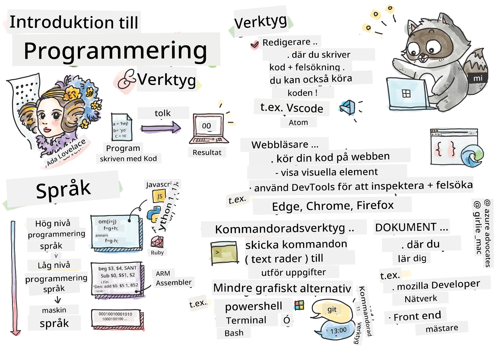
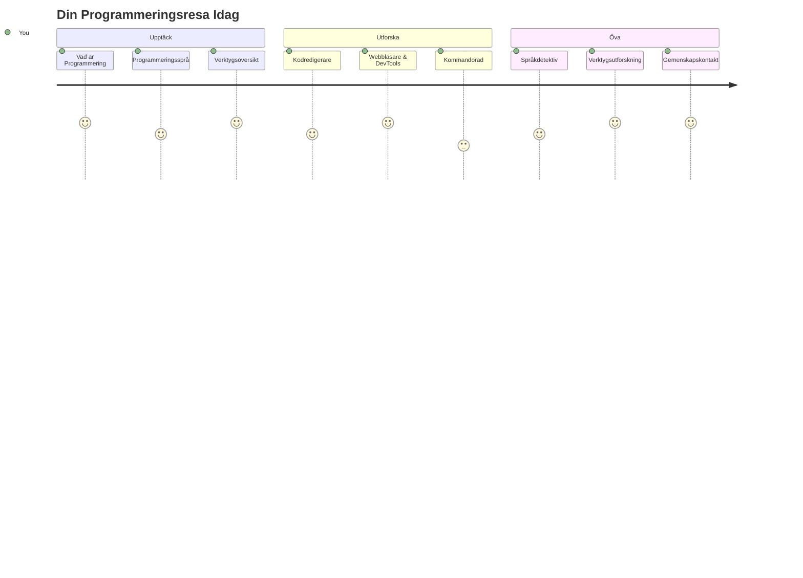
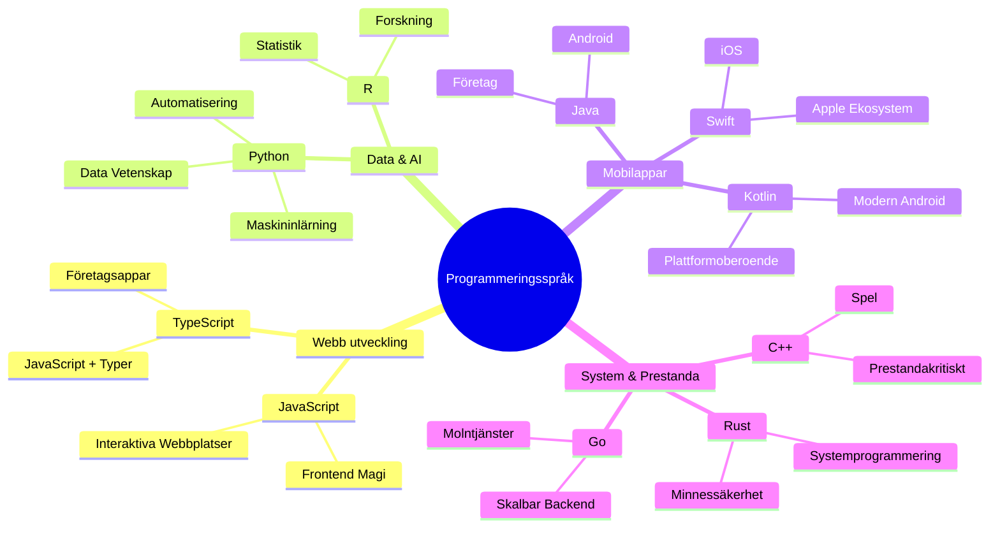
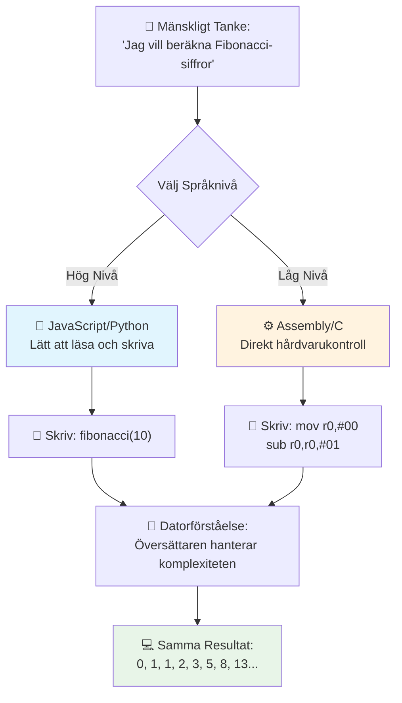
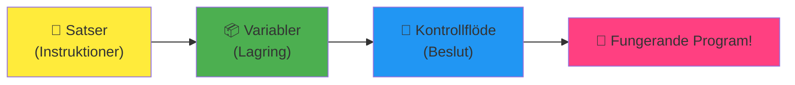
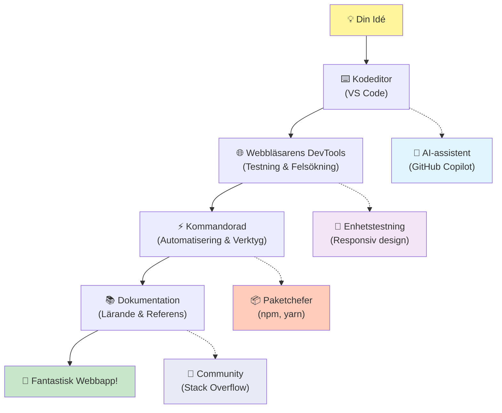
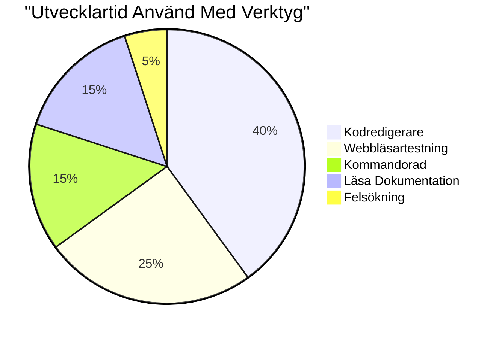
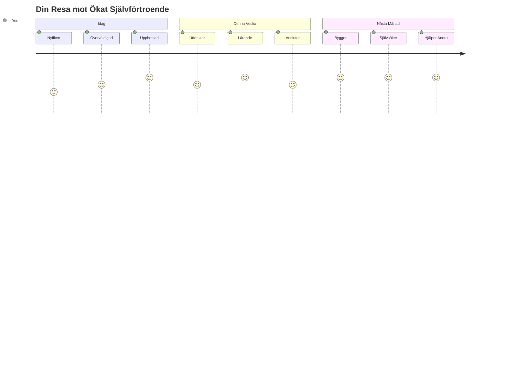

# Introduktion till programmeringsspråk och moderna utvecklarverktyg

Hej där, framtida utvecklare! 👋 Får jag berätta något som fortfarande ger mig rysningar varje dag? Du är på väg att upptäcka att programmering inte bara handlar om datorer – det handlar om att ha faktiska superkrafter för att förverkliga dina vildaste idéer!

Du vet det där ögonblicket när du använder din favoritapp och allt klickar perfekt? När du trycker på en knapp och något helt magiskt händer som får dig att tänka "wow, hur gjorde de DET där?" Någon precis som du – antagligen sittandes på sitt favoritkafé kl 2 på natten med sin tredje espresso – skrev koden som skapade den magin. Och här kommer något som kommer att blåsa dig av stolen: i slutet av den här lektionen kommer du inte bara förstå hur de gjorde, utan du kommer att längta efter att prova själv!

Lyssna, jag förstår helt om programmering känns skrämmande just nu. När jag började trodde jag faktiskt att man måste vara något slags mattegeni eller ha programmerat sedan man var fem år. Men här är vad som förändrade min syn helt: programmering är precis som att lära sig konversera på ett nytt språk. Man börjar med "hej" och "tack", sen jobbar man sig upp till att beställa kaffe, och innan man vet ordet av har man djupa filosofiska samtal! Fast i det här fallet pratar du med datorer, och ärligt talat? De är de mest tålmodiga samtalspartner du någonsin kommer träffa – de dömer aldrig dina misstag och är alltid glada att försöka igen!

Idag ska vi utforska de otroliga verktyg som gör modern webbutveckling inte bara möjlig, utan riktigt beroendeframkallande. Jag pratar om exakt de samma redigerare, webbläsare och arbetsflöden som utvecklare på Netflix, Spotify och din favorit indie-appstudio använder varje dag. Och här är delen som får dig att göra en glad minidans: de flesta av dessa professionella, industristandardverktyg är helt gratis!


> Sketchnote av [Tomomi Imura](https://twitter.com/girlie_mac)


```mermaid
journey
    title Din Programmeringsresa Idag
    section Upptäck
      Vad är Programmering: 5: You
      Programmeringsspråk: 4: You
      Verktygsöversikt: 5: You
    section Utforska
      Kodredigerare: 4: You
      Webbläsare & DevTools: 5: You
      Kommandorad: 3: You
    section Öva
      Språkdetektiv: 4: You
      Verktygsutforskning: 5: You
      Gemenskapskontakt: 5: You
```
## Låt oss se vad du redan kan!

Innan vi hoppar in i det roliga är jag nyfiken – vad vet du redan om den här programmeringsvärlden? Och om du tittar på de här frågorna och tänker "Jag har bokstavligen noll koll på något av detta," så är det inte bara okej, det är perfekt! Det betyder att du är på precis rätt plats. Tänk på den här quizzen som uppvärmning innan träningen – vi värmer bara upp hjärnmusklerna!

[Ta förberedande quiz](https://ff-quizzes.netlify.app/web/)


## Äventyret vi ska gå på tillsammans

Okej, jag studsar verkligen av spänning över vad vi ska utforska idag! Allvarligt talat, jag önskar att jag kunde se ditt ansikte när några av dessa koncept faller på plats. Här är den otroliga resan vi tar tillsammans:

- **Vad programmering faktiskt är (och varför det är det coolaste någonsin!)** – Vi ska upptäcka hur kod bokstavligen är den osynliga magin som driver allt omkring dig, från det där alarmet som på något sätt vet att det är måndag morgon till algoritmen som perfekt kuraterar dina Netflix-rekommendationer
- **Programmeringsspråk och deras fantastiska personligheter** – Tänk dig att gå in på en fest där varje person har helt olika superkrafter och sätt att lösa problem. Så är det i programmeringsspråkets värld, och du kommer älska att träffa dem!
- **De grundläggande byggstenarna som gör digital magi möjlig** – Tänk på dem som det ultimata kreativa LEGO-setet. När du förstår hur dessa bitar passar ihop inser du att du bokstavligen kan bygga vad som helst som din fantasi drömmer om
- **Professionella verktyg som får dig att känna att du precis fått en trollstav** – Jag överdriver inte här – de här verktygen får dig verkligen att känna att du har superkrafter, och det bästa? Det är samma verktyg som proffsen använder!

> 💡 **Här är grejen**: Försök inte ens att memorera allt idag! Just nu vill jag bara att du ska känna den där gnistan av spänning inför vad som är möjligt. Detaljerna kommer naturligt när vi övar tillsammans – så lär man sig på riktigt!

> Du kan göra den här lektionen på [Microsoft Learn](https://learn.microsoft.com/en-us/learn/modules/web-development-101/introduction-programming/?WT.mc_id=academic-77807-sagibbon)!

## Så vad är egentligen *programmering*?

Okej, låt oss ta itu med miljonfrågan: vad är programmering egentligen?

Jag ska berätta en historia som helt förändrade mitt sätt att se det här. I förra veckan försökte jag förklara för min mamma hur man använder vår nya smarta TV-fjärrkontroll. Jag hittade mig själv säga saker som "Tryck på den röda knappen, men inte den stora röda knappen, den lilla röda knappen till vänster... nej, din andra vänster... okej, håll nu knappen i två sekunder, inte en, inte tre..." Låter det bekant? 😅

Det är programmering! Det är konsten att ge otroligt detaljerade, steg-för-steg-instruktioner till något som är väldigt kraftfullt men behöver allt uttalat perfekt. Fast i det här fallet förklarar du inte för din mamma (som kan fråga "vilken röd knapp?!"), utan du förklarar för en dator (som bara gör precis vad du säger, även om det du sa inte riktigt är vad du menade).

Här är vad som blåste mina tankar när jag först lärde mig det här: datorer är faktiskt ganska enkla i sin kärna. De förstår bokstavligen bara två saker – 1 och 0, vilket i princip är "ja" och "nej" eller "på" och "av." Det är allt! Men här blir det magiskt – vi behöver inte prata i 1:or och 0:or som om vi var i The Matrix. Det är där **programmeringsspråken** kommer in i bilden. De är som världens bästa översättare som tar dina helt normala mänskliga tankar och konverterar dem till datorspråk.

Och här är vad som fortfarande ger mig riktiga rysningar varje morgon när jag vaknar: bokstavligen *allt* digitalt i ditt liv började med någon precis som du, antagligen sittandes i pyjamas med en kopp kaffe, som skriver kod på sin laptop. Det Instagram-filter som får dig att se felfri ut? Någon kodade det. Rekommendationen som ledde dig till din nya favoritlåt? En utvecklare byggde den algoritmen. Appen som hjälper dig att dela middagsnotan med vänner? Japp, någon tänkte "det här är irriterande, jag kan nog fixa det" och sen... gjorde de det!

När du lär dig programmera, lär du dig inte bara en ny färdighet – du blir en del av en otrolig gemenskap av problemlösare som spenderar sina dagar med att tänka, "Tänk om jag kunde bygga något som gör någons dag lite bättre?" Ärligt talat, finns det något coolare än det?

✅ **Rolig fakta-jakt**: Här är något supercoolt att kolla upp när du har en stund över – vem tror du var världens första programmerare? Jag ger dig en ledtråd: det är nog inte vem du förväntar dig! Historien bakom denna person är helt fascinerande och visar att programmering alltid handlat om kreativ problemlösning och att tänka utanför ramarna.

### 🧠 **Check-in: Hur känner du dig?**

**Ta en stund och fundera:**
- Känns idén att "ge instruktioner till datorer" vettig nu?
- Kan du tänka dig en vardagssyssla du skulle vilja automatisera med programmering?
- Vilka frågor kurrar i ditt huvud om hela det här programmeringsgrejen?

> **Kom ihåg**: Det är helt normalt om några koncept känns luddiga just nu. Att lära sig programmera är som att lära sig ett nytt språk – det tar tid för hjärnan att bygga de neurala banorna. Du gör det jättebra!

## Programmeringsspråk är som olika smaker av magi

Okej, det här kommer låta konstigt, men häng med – programmeringsspråk är väldigt lika olika musikstilar. Tänk på det: du har jazz som är mjuk och improviserad, rock som är kraftfull och rakt på sak, klassisk som är elegant och strukturerad, och hip-hop som är kreativ och uttrycksfull. Varje stil har sin egen känsla, sin egen gemenskap av passionerade fans, och varje är perfekt för olika tillfällen och sinnesstämningar.

Programmeringsspråk fungerar precis likadant! Du skulle inte använda samma språk för att bygga ett kul mobilspel som du använder för att knäcka enorma mängder klimatdata, precis som du inte skulle spela death metal på en yogaklass (ja, de flesta yogaklasser i alla fall! 😄).

Men här är något som alltid förvånar mig när jag tänker på det: de här språken är som att ha världens mest tålmodiga, briljanta tolk som sitter precis bredvid dig. Du kan uttrycka dina idéer på ett sätt som känns naturligt för din mänskliga hjärna, och de tar hand om allt otroligt komplicerat arbete att översätta det till 1:or och 0:or som datorerna faktiskt pratar. Det är som att ha en vän som är fullständigt flytande i både "mänsklig kreativitet" och "datormagi" – och som aldrig blir trött, aldrig behöver kaffepauser och aldrig dömer dig för att du frågar samma sak två gånger!

### Populära programmeringsspråk och deras användningsområden


```mermaid
mindmap
  root((Programmeringsspråk))
    Webb utveckling
      JavaScript
        Frontend Magi
        Interaktiva Webbplatser
      TypeScript
        JavaScript + Typer
        Företagsappar
    Data & AI
      Python
        Data Vetenskap
        Maskininlärning
        Automatisering
      R
        Statistik
        Forskning
    Mobilappar
      Java
        Android
        Företag
      Swift
        iOS
        Apple Ekosystem
      Kotlin
        Modern Android
        Plattformoberoende
    System & Prestanda
      C++
        Spel
        Prestandakritiskt
      Rust
        Minnessäkerhet
        Systemprogrammering
      Go
        Molntjänster
        Skalbar Backend
```
| Språk | Bäst för | Varför det är populärt |
|----------|----------|------------------|
| **JavaScript** | Webb­utveckling, användar­gränssnitt | Körs i webbläsare och driver interaktiva webbplatser |
| **Python** | Data­vetenskap, automation, AI | Lätt att läsa och lära, kraftfulla bibliotek |
| **Java** | Företags­applikationer, Android-appar | Plattformoberoende, robust för stora system |
| **C#** | Windows-appar, spelutveckling | Stark Microsoft-ekosystemstöd |
| **Go** | Molntjänster, backend­system | Snabbt, enkelt, designat för modern datoranvändning |

### Högnivå- vs. lågnivåspråk

Okej, det här var ärligt talat konceptet som spräckte min hjärna när jag först började lära mig, så jag delar med mig av analogin som äntligen fick det att klicka för mig – och jag hoppas verkligen att den hjälper dig också!

Föreställ dig att du besöker ett land där du inte pratar språket, och du måste desperat hitta närmaste toalett (vi har alla varit där, eller hur? 😅):

- **Lågnivåprogrammering** är som att lära sig den lokala dialekten så väl att du kan prata med farmodern som säljer frukt vid hörnet och använda kulturella referenser, lokal slang och insiderskämt som bara någon som vuxit upp där förstår. Superimponerande och otroligt effektivt... om du råkar vara flytande! Men ganska överväldigande när du bara försöker hitta en toalett.

- **Högnivåprogrammering** är som att ha den där fantastiska lokala vännen som bara fattar. Du kan säga "Jag måste verkligen hitta en toalett" på enkel engelska, och de fixar all kulturell översättning och ger dig vägbeskrivningen på ett sätt som din non-lokala hjärna förstår perfekt.

I programmeringstermer:
- **Lågnivåspråk** (som Assembly eller C) låter dig ha otroligt detaljerade samtal med datorns faktiska hårdvara, men du behöver tänka som en maskin, vilket är... ja, låt oss säga att det är ett ganska stort mentalt skifte!
- **Högnivåspråk** (som JavaScript, Python eller C#) låter dig tänka som en människa medan de fixar allt maskinspråk bakom kulisserna. Plus, de har otroligt välkomnande gemenskaper fulla av folk som minns hur det var att vara ny och verkligen vill hjälpa till!

Gissa vilka jag kommer föreslå att du börjar med? 😉 Högnivåspråk är som stödhjul du aldrig egentligen vill ta av för att de gör hela upplevelsen så mycket roligare!


```mermaid
flowchart TB
    A["👤 Mänskligt Tanke:<br/>'Jag vill beräkna Fibonacci-siffror'"] --> B{Välj Språknivå}
    
    B -->|Hög Nivå| C["🌟 JavaScript/Python<br/>Lätt att läsa och skriva"]
    B -->|Låg Nivå| D["⚙️ Assembly/C<br/>Direkt hårdvarukontroll"]
    
    C --> E["📝 Skriv: fibonacci(10)"]
    D --> F["📝 Skriv: mov r0,#00<br/>sub r0,r0,#01"]
    
    E --> G["🤖 Datorförståelse:<br/>Översättaren hanterar komplexiteten"]
    F --> G
    
    G --> H["💻 Samma Resultat:<br/>0, 1, 1, 2, 3, 5, 8, 13..."]
    
    style C fill:#e1f5fe
    style D fill:#fff3e0
    style H fill:#e8f5e8
```
### Låt mig visa varför högnivåspråk är mycket vänligare

Okej, jag är på väg att visa dig något som perfekt demonstrerar varför jag blev kär i högnivåspråk, men först – lova mig en sak. När du ser det första kodexemplet, bli inte panikslagen! Det ska se skrämmande ut. Det är precis poängen!

Vi ska titta på exakt samma uppgift skriven i två helt olika stilar. Båda skapar det som kallas Fibonacci-sekvensen – det är ett vackert matematiskt mönster där varje tal är summan av de två föregående: 0, 1, 1, 2, 3, 5, 8, 13... (Rolig fakta: du hittar detta mönster bokstavligen överallt i naturen – solrosfrömönster, kotteformar, till och med hur galaxer formas!)

Redo att se skillnaden? Kör vi!

**Högnivåspråk (JavaScript) – Mänskligt vänligt:**

```javascript
// Steg 1: Grundläggande Fibonacci-inställning
const fibonacciCount = 10;
let current = 0;
let next = 1;

console.log('Fibonacci sequence:');
```

**Det här gör koden:**
- **Deklarerar** en konstant för att specificera hur många Fibonacci-tal vi vill generera
- **Initierar** två variabler för att hålla reda på aktuellt och nästa tal i sekvensen
- **Ställer in** startvärdena (0 och 1) som definierar Fibonacci-mönstret
- **Visar** ett rubrikmeddelande för att identifiera vår utdata

```javascript
// Steg 2: Generera sekvensen med en loop
for (let i = 0; i < fibonacciCount; i++) {
  console.log(`Position ${i + 1}: ${current}`);
  
  // Beräkna nästa nummer i sekvensen
  const sum = current + next;
  current = next;
  next = sum;
}
```

**Så här fungerar det:**
- **Loopar** genom varje position i vår sekvens med en `for`-loop
- **Visar** varje tal med dess position med hjälp av mallsträngar
- **Beräknar** nästa Fibonacci-tal genom att lägga ihop aktuellt och nästa värde
- **Uppdaterar** våra spårningsvariabler för att gå till nästa steg

```javascript
// Steg 3: Modern funktionell metod
const generateFibonacci = (count) => {
  const sequence = [0, 1];
  
  for (let i = 2; i < count; i++) {
    sequence[i] = sequence[i - 1] + sequence[i - 2];
  }
  
  return sequence;
};

// Användningsexempel
const fibSequence = generateFibonacci(10);
console.log(fibSequence);
```

**I ovanstående har vi:**
- **Skapat** en återanvändbar funktion med modern pilar-funktionssyntax
- **Byggt** en array för att lagra hela sekvensen istället för att visa ett tal i taget
- **Använt** arrayindexering för att beräkna varje nytt tal utifrån tidigare värden
- **Returnerat** hela sekvensen för flexibel användning i andra delar av programmet

**Lågnivåspråk (ARM Assembly) – Datorvänligt:**

```assembly
 area ascen,code,readonly
 entry
 code32
 adr r0,thumb+1
 bx r0
 code16
thumb
 mov r0,#00
 sub r0,r0,#01
 mov r1,#01
 mov r4,#10
 ldr r2,=0x40000000
back add r0,r1
 str r0,[r2]
 add r2,#04
 mov r3,r0
 mov r0,r1
 mov r1,r3
 sub r4,#01
 cmp r4,#00
 bne back
 end
```

Lägg märke till hur JavaScript-versionen nästan läses som engelska instruktioner, medan Assembly-versionen använder kryptiska kommandon som direkt styr datorns processor. Båda utför exakt samma uppgift, men högnivåspråket är mycket enklare för människor att förstå, skriva och underhålla.

**Viktiga skillnader du kommer märka:**
- **Läsbarhet**: JavaScript använder beskrivande namn som `fibonacciCount` medan Assembly använder kryptiska etiketter som `r0`, `r1`
- **Kommentarer**: Hög-nivå språk uppmuntrar förklarande kommentarer som gör koden självförklarande
- **Struktur**: JavaScripts logiska flöde matchar hur människor tänker på problem steg för steg
- **Underhåll**: Att uppdatera JavaScript-versionen för olika krav är enkelt och tydligt

✅ **Om Fibonacci-sekvensen**: Detta helt fantastiska talmönster (där varje tal är summan av de två föregående: 0, 1, 1, 2, 3, 5, 8...) dyker bokstavligen upp *överallt* i naturen! Du hittar det i solrosspiraler, kottmönster, hur nautilusskal kröker sig och till och med i hur trädgrenar växer. Det är ganska häpnadsväckande hur matematik och kod kan hjälpa oss att förstå och återskapa de mönster som naturen använder för att skapa skönhet!


## Byggstenarna Som Gör Magin Möjlig

Okej, nu när du har sett hur programmeringsspråk ser ut i praktiken, låt oss bryta ner de grundläggande delarna som utgör bokstavligen varje program som någonsin har skrivits. Tänk på dessa som de essentiella ingredienserna i ditt favoritrecept – när du väl förstår vad varje del gör kommer du kunna läsa och skriva kod i nästan vilket språk som helst!

Det här är lite som att lära sig grammatiken för programmering. Kommer du ihåg när du lärde dig om substantiv, verb och hur man sätter ihop meningar i skolan? Programmering har sin egen version av grammatik, och ärligt talat är den mycket mer logisk och förlåtande än engelsk grammatik någonsin var! 😄

### Satser: Steg-för-steg-instruktioner

Låt oss börja med **satser** – de är som individuella meningar i en konversation med din dator. Varje sats säger åt datorn att göra en specifik sak, ungefär som att ge vägbeskrivningar: "Sväng vänster här," "Stanna vid rött ljus," "Parkera på den platsen."

Det jag gillar med satser är hur läsbara de vanligtvis är. Kolla in detta:

```javascript
// Grundläggande satser som utför enstaka åtgärder
const userName = "Alex";                    
console.log("Hello, world!");              
const sum = 5 + 3;                         
```

**Det här gör koden:**
- **Deklarerar** en konstant variabel för att lagra en användares namn
- **Visar** ett hälsningsmeddelande i konsolutmatningen
- **Beräknar** och sparar resultatet av en matematisk operation

```javascript
// Uttalanden som interagerar med webbsidor
document.title = "My Awesome Website";      
document.body.style.backgroundColor = "lightblue";
```

**Steg för steg händer detta:**
- **Modifierar** webbsidans titel som visas i webbläsarfliken
- **Byter** bakgrundsfärg på hela sidans kropp

### Variabler: Programmets minnessystem

Okej, **variabler** är ärligt talat ett av mina absoluta favoritkoncept att lära ut eftersom de är så lika saker du redan använder varje dag!

Tänk på telefonens kontaktlista ett ögonblick. Du memorerar inte allas telefonnummer – istället sparar du "Mamma," "Bästa Vän," eller "Pizzastället Som Levererar Till 2 På Morgonen" och låter telefonen komma ihåg de faktiska numren. Variabler fungerar precis på samma sätt! De är som märkta behållare där ditt program kan lagra information och sedan hämta den med ett namn som faktiskt är begripligt.

Det här är verkligen coolt: variabler kan ändras medan ditt program körs (därav namnet "variabel" – fattar du vad de gjorde där?). Precis som du kanske uppdaterar pizzaställeskontakten när du hittar ett ännu bättre ställe, kan variabler uppdateras när ditt program lär sig ny information eller när situationer förändras!

Låt mig visa hur vackert enkelt det kan vara:

```javascript
// Steg 1: Skapa grundläggande variabler
const siteName = "Weather Dashboard";        
let currentWeather = "sunny";               
let temperature = 75;                       
let isRaining = false;                      
```

**Förstå dessa koncept:**
- **Lagra** oföränderliga värden i `const` variabler (som webbplatsens namn)
- **Använda** `let` för värden som kan ändras under programmets gång
- **Tilldela** olika datatyper: strängar (text), siffror och booleaner (true/false)
- **Välja** beskrivande namn som förklarar vad varje variabel innehåller

```javascript
// Steg 2: Arbeta med objekt för att gruppera relaterad data
const weatherData = {                       
  location: "San Francisco",
  humidity: 65,
  windSpeed: 12
};
```

**I exemplet ovan har vi:**
- **Skapat** ett objekt för att gruppera relaterad väderinformation
- **Organiserat** flera datapunkter under ett variabelnamn
- **Använt** nyckel-värde-par för att tydligt märka varje informationsdel

```javascript
// Steg 3: Använda och uppdatera variabler
console.log(`${siteName}: Today is ${currentWeather} and ${temperature}°F`);
console.log(`Wind speed: ${weatherData.windSpeed} mph`);

// Uppdatera föränderliga variabler
currentWeather = "cloudy";                  
temperature = 68;                          
```

**Låt oss förstå varje del:**
- **Visa** informationen med mallsträngar med `${}` syntax
- **Hämta** objektsegenskaper med punktnotation (`weatherData.windSpeed`)
- **Uppdatera** variabler deklarerade med `let` för att reflektera förändrade förhållanden
- **Kombinera** flera variabler för att skapa meningsfulla meddelanden

```javascript
// Steg 4: Modern destrukturering för renare kod
const { location, humidity } = weatherData; 
console.log(`${location} humidity: ${humidity}%`);
```

**Det här behöver du veta:**
- **Extrahera** specifika egenskaper från objekt med destruktureringstilldelning
- **Skapa** nya variabler automatiskt med samma namn som objektets nycklar
- **Förenkla** kod genom att undvika repetitiv punktnotation

### Kontrollflöde: Lära ditt program att tänka

Okej, här blir programmering riktigt häpnadsväckande! **Kontrollflöde** handlar i princip om att lära ditt program att fatta smarta beslut, precis som du gör varje dag utan att ens tänka på det.

Föreställ dig detta: i morse gick du nog igenom något som "Om det regnar, tar jag med ett paraply. Om det är kallt, tar jag på mig en jacka. Om jag är sen, hoppar jag över frukosten och köper kaffe på vägen." Din hjärna följer automatiskt detta if-then-tänk dussintals gånger varje dag!

Det här är vad som gör att program känns intelligenta och levande istället för att bara följa ett tråkigt, förutsägbart manus. De kan faktiskt titta på en situation, värdera vad som händer och reagera lämpligt. Det är som att ge ditt program en hjärna som kan anpassa sig och göra val!

Vill du se hur vackert det fungerar? Låt mig visa:

```javascript
// Steg 1: Grundläggande villkorslogik
const userAge = 17;

if (userAge >= 18) {
  console.log("You can vote!");
} else {
  const yearsToWait = 18 - userAge;
  console.log(`You'll be able to vote in ${yearsToWait} year(s).`);
}
```

**Det här gör koden:**
- **Kontrollerar** om användarens ålder uppfyller röstkravet
- **Kör** olika kodblock baserat på villkorets resultat
- **Beräknar** och visar hur länge till röstbehörighet om under 18
- **Ger** specifik, hjälpsam feedback för varje scenario

```javascript
// Steg 2: Flera villkor med logiska operatorer
const userAge = 17;
const hasPermission = true;

if (userAge >= 18 && hasPermission) {
  console.log("Access granted: You can enter the venue.");
} else if (userAge >= 16) {
  console.log("You need parent permission to enter.");
} else {
  console.log("Sorry, you must be at least 16 years old.");
}
```

**Så här bryts det ned:**
- **Kombinerar** flera villkor med `&&` (och) operatorn
- **Skapar** en hierarki av villkor med `else if` för flera scenarier
- **Hantera** alla möjliga fall med ett slutligt `else`-påstående
- **Ger** tydlig, användbar feedback för varje situation

```javascript
// Steg 3: Kortfattat villkor med ternär operator
const votingStatus = userAge >= 18 ? "Can vote" : "Cannot vote yet";
console.log(`Status: ${votingStatus}`);
```

**Det här behöver du komma ihåg:**
- **Använda** ternära operatorn (`? :`) för enkla två-alternativs villkor
- **Skriv** villkoret först, följt av `?`, sedan sant resultat, sedan `:`, sedan falskt resultat
- **Applicera** detta mönster när du behöver tilldela värden baserat på villkor

```javascript
// Steg 4: Hantera flera specifika fall
const dayOfWeek = "Tuesday";

switch (dayOfWeek) {
  case "Monday":
  case "Tuesday":
  case "Wednesday":
  case "Thursday":
  case "Friday":
    console.log("It's a weekday - time to work!");
    break;
  case "Saturday":
  case "Sunday":
    console.log("It's the weekend - time to relax!");
    break;
  default:
    console.log("Invalid day of the week");
}
```

**Den här koden gör följande:**
- **Matchar** variabelvärdet mot flera specifika fall
- **Grupperar** liknande fall (vardagar vs. helger)
- **Kör** rätt kodblock när en match hittas
- **Inkluderar** ett `default`-fall för att hantera oväntade värden
- **Använder** `break`-satser för att förhindra att koden fortsätter till nästa fall

> 💡 **Verklighetsanalogi**: Tänk på kontrollflöde som att ha världens mest tålmodiga GPS som ger dig vägbeskrivningar. Den kan säga "Om det är trafik på Main Street, ta motorvägen istället. Om vägarbete blockerar motorvägen, prova den natursköna vägen." Program använder precis samma typ av villkorlig logik för att reagera intelligent på olika situationer och alltid ge användarna bästa möjliga upplevelse.

### 🎯 **Begreppskontroll: Mästerskap i byggstenar**

**Hur ligger du till med grunderna:**
- Kan du förklara skillnaden mellan en variabel och en sats med egna ord?
- Tänk på ett verkligt scenario där du skulle använda ett if-then-beslut (som i vårt röstexempel)
- Vad är en sak med programmeringslogik som överraskade dig?

**Snabbt självförtroendeboost:**

```mermaid
flowchart LR
    A["📝 Satser<br/>(Instruktioner)"] --> B["📦 Variabler<br/>(Lagring)"] --> C["🔀 Kontrollflöde<br/>(Beslut)"] --> D["🎉 Fungerande Program!"]
    
    style A fill:#ffeb3b
    style B fill:#4caf50
    style C fill:#2196f3
    style D fill:#ff4081
```
✅ **Vad som kommer härnäst**: Vi kommer ha en otrolig resa när vi går djupare in i dessa koncept tillsammans! Just nu, fokusera bara på att känna den där spänningen över alla fantastiska möjligheter som väntar. De specifika färdigheter och metoder kommer naturligtvis att fastna när vi övar tillsammans – jag lovar att detta kommer bli mycket roligare än du kanske tror!

## Verktygen i Verktygslådan

Okej, här blir jag ärligt talat så uppspelt att jag knappt kan hålla mig! 🚀 Vi ska prata om de otroliga verktygen som kommer få dig att känna att du precis fått nycklarna till ett digitalt rymdskepp.

Du vet hur en kock har de perfekt balanserade knivarna som känns som en förlängning av handen? Eller hur en musiker har den där gitarren som verkar sjunga i samma ögonblick som den rörs? Jo, utvecklare har vår egen version av dessa magiska verktyg, och här är det som kommer att slå dig helt – de flesta av dem är helt gratis!

Jag studsar nästan på stolen när jag tänker på att dela dessa med dig för de har helt förändrat hur vi bygger mjukvara. Vi pratar om AI-driven kodassistent som kan hjälpa dig skriva kod (jag skojar inte!), molnmiljöer där du kan skapa hela applikationer bokstavligen var som helst med Wi-Fi, och felsökningsverktyg så avancerade att det är som att ha röntgensyn för dina program.

Och här är delen som fortfarande ger mig rysningar: det här är inga "nybörjarverktyg" som du kommer växa ifrån. Det är exakt samma professionella verktyg som utvecklare på Google, Netflix och det där indieapp-studion du älskar använder just nu. Du kommer känna dig som ett proffs när du använder dem!


```mermaid
graph TD
    A["💡 Din Idé"] --> B["⌨️ Kodeditor<br/>(VS Code)"] 
    B --> C["🌐 Webbläsarens DevTools<br/>(Testning & Felsökning)"]
    C --> D["⚡ Kommandorad<br/>(Automatisering & Verktyg)"]
    D --> E["📚 Dokumentation<br/>(Lärande & Referens)"]
    E --> F["🚀 Fantastisk Webbapp!"]
    
    B -.-> G["🤖 AI-assistent<br/>(GitHub Copilot)"]
    C -.-> H["📱 Enhetstestning<br/>(Responsiv design)"]
    D -.-> I["📦 Paketchefer<br/>(npm, yarn)"]
    E -.-> J["👥 Community<br/>(Stack Overflow)"]
    
    style A fill:#fff59d
    style F fill:#c8e6c9
    style G fill:#e1f5fe
    style H fill:#f3e5f5
    style I fill:#ffccbc
    style J fill:#e8eaf6
```
### Kodredigerare och IDEs: Dina nya digitala bästa vänner

Låt oss prata kodredigerare – de här kommer seriöst bli dina nya favoritställen att hänga på! Tänk på dem som din personliga kodningsfrizon där du kommer spendera mest tid på att skapa och finslipa dina digitala alster.

Men här är det magiska med moderna redigerare: de är inte bara fina textredigerare. Det är som att ha den mest briljanta och stödjande kodningsmentorn sittandes precis bredvid dig dygnet runt. De fångar dina stavfel innan du ens märker dem, föreslår förbättringar som får dig att se smart ut, hjälper dig förstå vad varje kodbit gör, och några av dem kan till och med förutse vad du är på väg att skriva och erbjuda sig att avsluta dina tankar!

Jag minns när jag först upptäckte automatisk komplettering – jag kände verkligen att jag levde i framtiden. Du börjar skriva något och din redigerare säger, ”Hej, tänkte du på den här funktionen som gör precis vad du behöver?” Det är som att ha en tankeläsare som kodkompis!

**Vad gör dessa redigerare så otroliga?**

Moderna kodredigerare erbjuder en imponerande mängd funktioner designade för att öka din produktivitet:

| Funktion | Vad den gör | Varför det hjälper |
|---------|--------------|--------------|
| **Syntaxmarkering** | Färglägger olika delar av din kod | Gör koden enklare att läsa och hitta fel |
| **Automatisk komplettering** | Foreslår kod när du skriver | Snabbar upp kodandet och minskar stavfel |
| **Felsökningsverktyg** | Hjälper dig hitta och fixa fel | Sparar timmar av felsökning |
| **Tillägg** | Lägger till specialfunktioner | Anpassa din redigerare för vilken teknik som helst |
| **AI-assistenter** | Föreslår kod och förklaringar | Accelererar lärande och produktivitet |

> 🎥 **Videoresurs**: Vill du se dessa verktyg i aktion? Kolla in denna [Tools of the Trade video](https://youtube.com/watch?v=69WJeXGBdxg) för en heltäckande översikt.

#### Rekommenderade redigerare för webbprogrammering

**[Visual Studio Code](https://code.visualstudio.com/?WT.mc_id=academic-77807-sagibbon)** (Gratis)
- Mest populär bland webbutvecklare
- Utmärkt tilläggsekosystem
- Inbyggd terminal och Git-integration
- **Måste-ha-tillägg**:
  - [GitHub Copilot](https://marketplace.visualstudio.com/items?itemName=GitHub.copilot) - AI-drivna kodförslag
  - [Live Share](https://marketplace.visualstudio.com/items?itemName=MS-vsliveshare.vsliveshare) - Samarbete i realtid
  - [Prettier](https://marketplace.visualstudio.com/items?itemName=esbenp.prettier-vscode) - Automatisk kodformatering
  - [Code Spell Checker](https://marketplace.visualstudio.com/items?itemName=streetsidesoftware.code-spell-checker) - Fångar stavfel i din kod

**[JetBrains WebStorm](https://www.jetbrains.com/webstorm/)** (Betald, gratis för studenter)
- Avancerade verktyg för felsökning och testning
- Intelligent kodkomplettering
- Inbyggd versionskontroll

**Molnbaserade IDEs** (Olika prissättning)
- [GitHub Codespaces](https://github.com/features/codespaces) - Full VS Code i din webbläsare
- [Replit](https://replit.com/) - Perfekt för att lära sig och dela kod
- [StackBlitz](https://stackblitz.com/) - Direkt, fullstack webbprogrammering

> 💡 **Tips för att komma igång**: Börja med Visual Studio Code – det är gratis, används mycket i branschen och har en enorm community som skapar hjälpsamma tutorials och tillägg.


### Webbläsare: Ditt hemliga utvecklingslaboratorium

Okej, gör dig redo att få din hjärna helt bortblåst! Du vet hur du har använt webbläsare för att scrolla genom sociala medier och titta på videor? Jo, det visar sig att de har gömt ett otroligt hemligt utvecklingslaboratorium hela tiden, bara väntat på att du ska upptäcka det!

Varje gång du högerklickar på en webbsida och väljer "Inspektera" öppnar du en dold värld av utvecklarverktyg som är ärligt talat kraftfullare än många dyra programvaror jag brukade betala hundratals kronor för. Det är som att upptäcka att ditt vanliga gamla kök har dolts ett professionellt kocklaboratorium bakom en hemlig panel!
Första gången någon visade mig webbläsarens DevTools, spenderade jag typ tre timmar bara på att klicka runt och säga "VÄNTA, KAN DEN GÖRA DET OCKSÅ?!" Du kan bokstavligen redigera vilken webbplats som helst i realtid, se exakt hur snabbt allt laddas, testa hur din webbplats ser ut på olika enheter och till och med felsöka JavaScript som en riktig proffs. Det är helt otroligt!

**Här är varför webbläsare är ditt hemliga vapen:**

När du skapar en webbplats eller webbsida behöver du se hur den ser ut och fungerar i verkligheten. Webbläsare visar inte bara ditt arbete utan ger också detaljerad feedback om prestanda, tillgänglighet och potentiella problem.

#### Webbläsarens utvecklarverktyg (DevTools)

Moderna webbläsare inkluderar omfattande utvecklingspaket:

| Verktygskategori | Vad det gör | Exempel på användning |
|------------------|-------------|----------------------|
| **Elementinspektör** | Visa och redigera HTML/CSS i realtid | Justera styling för att se omedelbara resultat |
| **Konsol** | Visa felmeddelanden och testa JavaScript | Felsök problem och experimentera med kod |
| **Nätverksövervakare** | Spåra hur resurser laddas | Optimera prestanda och laddningstider |
| **Tillgänglighetskontroll** | Testa inkluderande design | Säkerställ att din webbplats fungerar för alla användare |
| **Enhetssimulator** | Förhandsgranska på olika skärmstorlekar | Testa responsiv design utan flera enheter |

#### Rekommenderade webbläsare för utveckling

- **[Chrome](https://developers.google.com/web/tools/chrome-devtools/)** - Industri-standard DevTools med omfattande dokumentation
- **[Firefox](https://developer.mozilla.org/docs/Tools)** - Utmärkta CSS Grid- och tillgänglighetsverktyg
- **[Edge](https://docs.microsoft.com/microsoft-edge/devtools-guide-chromium/?WT.mc_id=academic-77807-sagibbon)** - Byggd på Chromium med Microsofts utvecklarresurser

> ⚠️ **Viktig testningstips**: Testa alltid dina webbplatser i flera webbläsare! Vad som fungerar perfekt i Chrome kan se annorlunda ut i Safari eller Firefox. Professionella utvecklare testar över alla större webbläsare för att säkerställa en konsekvent användarupplevelse.


### Kommandoradsverktyg: Din port till utvecklarsuperkrafter

Okej, låt oss vara helt ärliga om kommandoraden, för jag vill att du ska höra detta från någon som verkligen förstår. När jag först såg den – bara den här läskiga svarta skärmen med blinkande text – tänkte jag bokstavligen, "Nej, absolut inte! Det ser ut som något från en hackerfilm på 1980-talet, och jag är definitivt inte tillräckligt smart för det här!" 😅

Men här är vad jag önskar att någon hade berättat för mig då, och vad jag säger till dig just nu: kommandoraden är inte skrämmande – det är faktiskt som att ha en direkt konversation med din dator. Tänk på det som skillnaden mellan att beställa mat genom en snygg app med bilder och menyer (vilket är trevligt och enkelt) jämfört med att gå in på din favoritlokala restaurang där kocken vet exakt vad du gillar och kan slänga ihop något perfekt bara för att du säger "överraska mig med något fantastiskt."

Kommandoraden är där utvecklare känner sig som riktiga trollkarlar. Du skriver några till synes magiska ord (okej, det är bara kommandon, men de känns magiska!), trycker på enter, och POFF – du har skapat hela projektstrukturer, installerat kraftfulla verktyg från hela världen, eller driftsatt din app till internet för miljontals människor att se. När du får din första smak av den kraften är det ärligt talat ganska beroendeframkallande!

**Varför kommandoraden kommer att bli ditt favoritverktyg:**

Medan grafiska gränssnitt är utmärkta för många uppgifter, är kommandoraden bäst på automatisering, precision och hastighet. Många utvecklingsverktyg fungerar främst genom kommandoradsgränssnitt, och att lära sig använda dem effektivt kan dramatiskt förbättra din produktivitet.

```bash
# Steg 1: Skapa och navigera till projektkatalogen
mkdir my-awesome-website
cd my-awesome-website
```

**Det här gör koden:**
- **Skapa** en ny katalog kallad "my-awesome-website" för ditt projekt
- **Navigera** in i den nyss skapade katalogen för att börja arbeta

```bash
# Steg 2: Initiera projekt med package.json
npm init -y

# Installera moderna utvecklingsverktyg
npm install --save-dev vite prettier eslint
npm install --save-dev @eslint/js
```

**Steg för steg, detta händer:**
- **Initiera** ett nytt Node.js-projekt med standardinställningar med `npm init -y`
- **Installera** Vite som ett modernt byggverktyg för snabb utveckling och produktion
- **Lägg till** Prettier för automatisk kodformatering och ESLint för kodkvalitetskontroller
- **Använd** flaggan `--save-dev` för att markera dessa som utvecklarexklusiva beroenden

```bash
# Steg 3: Skapa projektstruktur och filer
mkdir src assets
echo '<!DOCTYPE html><html><head><title>My Site</title></head><body><h1>Hello World</h1></body></html>' > index.html

# Starta utvecklingsserver
npx vite
```

**I ovanstående har vi:**
- **Organiserat** vårt projekt genom att skapa separata mappar för källkod och tillgångar
- **Genererat** en grundläggande HTML-fil med korrekt dokumentstruktur
- **Startat** Vite-utvecklingsservern för live-uppdateringar och hot module replacement

#### Viktiga kommandoradsverktyg för webbutveckling

| Verktyg | Syfte | Varför du behöver det |
|---------|-------|----------------------|
| **[Git](https://git-scm.com/)** | Versionshantering | Spåra förändringar, samarbeta med andra, säkerhetskopiera ditt arbete |
| **[Node.js & npm](https://nodejs.org/)** | JavaScript runtime & pakethantering | Kör JavaScript utanför webbläsare, installera moderna utvecklingsverktyg |
| **[Vite](https://vitejs.dev/)** | Byggverktyg & utvecklingsserver | Blixtsnabb utveckling med hot module replacement |
| **[ESLint](https://eslint.org/)** | Kodkvalitet | Hitta och fixa automatiskt problem i din JavaScript |
| **[Prettier](https://prettier.io/)** | Kodformatering | Håll din kod konsekvent formaterad och läsbar |

#### Plattformsspecifika alternativ

**Windows:**
- **[Windows Terminal](https://docs.microsoft.com/windows/terminal/?WT.mc_id=academic-77807-sagibbon)** - Modern terminal med många funktioner
- **[PowerShell](https://docs.microsoft.com/powershell/?WT.mc_id=academic-77807-sagibbon)** 💻 - Kraftfullt skriptmiljö
- **[Kommandoprompt](https://learn.microsoft.com/windows-server/administration/windows-commands/windows-commands)** 💻 - Traditionell Windows-kommandorad

**macOS:**
- **[Terminal](https://support.apple.com/guide/terminal/)** 💻 - Inbyggd terminalapplikation
- **[iTerm2](https://iterm2.com/)** - Förbättrad terminal med avancerade funktioner

**Linux:**
- **[Bash](https://www.gnu.org/software/bash/)** 💻 - Standard Linux-skal
- **[KDE Konsole](https://docs.kde.org/trunk5/en/konsole/konsole/index.html)** - Avancerad terminalemulator

> 💻 = Förinstallerat i operativsystemet

> 🎯 **Inlärningsväg**: Börja med grundläggande kommandon som `cd` (byta katalog), `ls` eller `dir` (lista filer) och `mkdir` (skapa mapp). Öva med moderna arbetsflödeskommandon som `npm install`, `git status` och `code .` (öppnar aktuell katalog i VS Code). När du blir mer bekväm plockar du upp mer avancerade kommandon och automatiseringstekniker naturligt.


### Dokumentation: Din alltid tillgängliga lärarmästare

Okej, jag ska dela en liten hemlighet som kommer få dig att känna dig mycket bättre som nybörjare: även de mest erfarna utvecklarna spenderar en stor del av sin tid på att läsa dokumentation. Och det är inte för att de inte vet vad de gör – det är faktiskt ett tecken på visdom!

Tänk på dokumentation som att ha tillgång till världens mest tålmodiga, kunniga lärare som finns tillgängliga dygnet runt. Fastnar du på ett problem klockan 2 på natten? Dokumentationen finns där med en varm virtuell kram och precis det svar du behöver. Vill du lära dig om någon spännande ny funktion som alla pratar om? Dokumentationen stöttar dig med steg-för-steg exempel. Försöker du förstå varför något fungerar som det gör? Gissade du rätt – dokumentationen är redo att förklara det på ett sätt som äntligen får allt att klicka!

Här är något som helt förändrade mitt perspektiv: webbutvecklingsvärlden rör sig otroligt snabbt, och ingen (jag menar verkligen ingen!) kommer ihåg allt utantill. Jag har sett seniora utvecklare med 15+ års erfarenhet slå upp grundläggande syntax, och vet du vad? Det är inte pinsamt – det är smart! Det handlar inte om att ha perfekt minne; det handlar om att veta var man snabbt hittar pålitliga svar och hur man applicerar dem.

**Här händer den verkliga magin:**

Professionella utvecklare spenderar en betydande del av sin tid på att läsa dokumentation – inte för att de inte vet vad de gör utan för att webbutvecklingslandskapet utvecklas så snabbt att det krävs kontinuerligt lärande för att hålla sig aktuell. Bra dokumentation hjälper dig att förstå inte bara *hur* man använder något, utan *varför* och *när* man ska använda det.

#### Viktiga dokumentationsresurser

**[Mozilla Developer Network (MDN)](https://developer.mozilla.org/docs/Web)**
- Guldkällan för webteknologidokumentation
- Omfattande guider för HTML, CSS och JavaScript
- Inkluderar webbläsarkompatibilitetsinformation
- Har praktiska exempel och interaktiva demos

**[Web.dev](https://web.dev)** (av Google)
- Moderna bästa praxis för webbutveckling
- Guider för prestandaoptimering
- Tillgänglighet och inkluderande designprinciper
- Fallstudier från verkliga projekt

**[Microsoft Developer Documentation](https://docs.microsoft.com/microsoft-edge/#microsoft-edge-for-developers)**
- Utvecklarresurser för Edge-webbläsaren
- Guider för Progressiva webbappar
- Insikter om plattformsövergripande utveckling

**[Frontend Masters Learning Paths](https://frontendmasters.com/learn/)**
- Strukturerade utbildningsprogram
- Videokurser från branschexperter
- Praktiska kodningsövningar

> 📚 **Studieteknik**: Försök inte memorera dokumentationen – lär dig istället navigera i den effektivt. Bokmärken för ofta använda referenser och öva på att använda sökfunktioner för att snabbt hitta specifik information.

### 🔧 **Verktygsmästarskapskontroll: Vad tilltalar dig?**

**Ta en stund och fundera:**
- Vilket verktyg är du mest taggad på att prova först? (Det finns inget fel svar!)
- Känns kommandoraden fortfarande skrämmande, eller är du nyfiken på den?
- Kan du föreställa dig att använda webbläsarens DevTools för att kika bakom kulisserna på dina favoritwebbplatser?


```mermaid
pie title "Utvecklartid Använd Med Verktyg"
    "Kodredigerare" : 40
    "Webbläsartestning" : 25
    "Kommandorad" : 15
    "Läsa Dokumentation" : 15
    "Felsökning" : 5
```
> **Rolig insikt**: De flesta utvecklare spenderar ungefär 40% av sin tid i sin kodredigerare, men lägg märke till hur mycket tid som går åt till testning, lärande och problemlösning. Programmering handlar inte bara om att skriva kod – det handlar om att skapa upplevelser!

✅ **Goda tankar**: Här är en intressant fråga – hur tror du att verktygen för att bygga webbplatser (utveckling) skiljer sig från verktygen för att designa hur de ser ut (design)? Det är som skillnaden mellan en arkitekt som designar ett vackert hus och entreprenören som faktiskt bygger det. Båda är avgörande, men de behöver olika verktygslådor! Den här typen av tänkande hjälper dig verkligen att se den större bilden av hur webbplatser kommer till liv.

## GitHub Copilot Agent-utmaning 🚀

Använd Agent-läget för att slutföra följande utmaning:

**Beskrivning:** Utforska funktionerna i en modern kodredigerare eller IDE och visa hur den kan förbättra ditt arbetsflöde som webbutvecklare.

**Uppmaning:** Välj en kodredigerare eller IDE (t.ex. Visual Studio Code, WebStorm eller en molnbaserad IDE). Lista tre funktioner eller tillägg som hjälper dig att skriva, felsöka eller underhålla kod mer effektivt. Ge för varje en kort förklaring av hur det förbättrar ditt arbetsflöde.

---

## 🚀 Utmaning

**Okej, detektiv, redo för ditt första fall?**

Nu när du har den här fantastiska grunden har jag ett äventyr som kommer hjälpa dig att se hur otroligt mångsidig och fascinerande programmeringsvärlden verkligen är. Och lyssna – det handlar inte om att skriva kod än, så ingen press där! Tänk dig själv som en programmeringsspråkdetektiv på ditt allra första spännande fall!

**Din mission, om du väljer att acceptera den:**
1. **Bli en språkupptäckare**: Välj tre programmeringsspråk från helt olika världar – kanske ett som bygger webbplatser, ett som skapar mobilappar och ett som bearbetar data för forskare. Hitta exempel på samma enkla uppgift skrivna i varje språk. Jag lovar att du kommer bli helt förbluffad över hur olika de kan se ut fast de gör exakt samma sak!

2. **Avslöja deras ursprungshistorier**: Vad gör varje språk speciellt? Här är ett häftigt faktum – varje programmeringsspråk skapades för att någon tänkte, "Vet du vad? Det måste finnas ett bättre sätt att lösa just det här problemet." Kan du lista ut vilka problem det var? Några av dessa historier är riktigt fascinerande!

3. **Träffa gemenskaperna**: Ta en titt på hur välkomnande och passionerade varje språks community är. Vissa har miljontals utvecklare som delar kunskap och hjälper varandra, andra är mindre men otroligt sammansvetsade och stödjande. Du kommer älska att se de olika personligheterna dessa communities har!

4. **Följ din magkänsla**: Vilket språk känns mest tillgängligt för dig just nu? Stressa inte över att göra det "perfekta" valet – lyssna bara på din magkänsla! Det finns ärligt talat inget fel svar här, och du kan alltid utforska andra senare.

**Bonusdetektivarbete**: Se om du kan ta reda på vilka stora webbplatser eller appar som byggts med varje språk. Jag garanterar att du kommer bli chockad att få veta vad som driver Instagram, Netflix eller det där mobilspel du inte kan sluta spela!

> 💡 **Kom ihåg**: Du försöker inte bli expert på något av dessa språk idag. Du lär bara känna området innan du bestämmer var du vill slå dig ner. Ta din tid, ha kul och låt din nyfikenhet vägleda dig!

## Låt oss fira vad du upptäckt!

Holy moly, du har tagit till dig så mycket otrolig information idag! Jag är verkligen exalterad över att se hur mycket av denna fantastiska resa som fastnat hos dig. Och kom ihåg – det här är inget test där du måste ha allt perfekt. Det är mer som en fest för alla de coola saker du lärt dig om den här fascinerande världen du är på väg att dyka in i!

[Ta efter-lektionsquizet](https://ff-quizzes.netlify.app/web/)

## Granska & självlärande

**Ta din tid att utforska och ha roligt med det!**
Du har täckt mycket idag, och det är något att vara stolt över! Nu kommer den roliga delen – att utforska de ämnen som väckte din nyfikenhet. Kom ihåg, det här är inget läxor – det är ett äventyr!

**Dyk djupare in i det som fascinerar dig:**

**Testa programmeringsspråk praktiskt:**
- Besök de officiella webbplatserna för 2-3 språk som fångade ditt intresse. Var och ett har sin egen personlighet och historia!
- Prova några online-kodningsmiljöer som [CodePen](https://codepen.io/), [JSFiddle](https://jsfiddle.net/), eller [Replit](https://replit.com/). Var inte rädd för att experimentera – det går inte att förstöra något!
- Läs om hur ditt favoritprogrammeringsspråk kom till. Seriöst, några av dessa ursprungshistorier är fascinerande och hjälper dig att förstå varför språken fungerar som de gör.

**Bli bekväm med dina nya verktyg:**
- Ladda ner Visual Studio Code om du inte redan gjort det – det är gratis och du kommer att älska det!
- Spendera några minuter på att bläddra i Extensions-marknaden. Det är som en appbutik för din kodredigerare!
- Öppna webbläsarens Developer Tools och klicka runt lite. Oroa dig inte för att förstå allt – bli bara bekant med vad som finns där.

**Gå med i gemenskapen:**
- Följ några utvecklargemenskaper på [Dev.to](https://dev.to/), [Stack Overflow](https://stackoverflow.com/), eller [GitHub](https://github.com/). Programmerargemenskapen är otroligt välkomnande mot nybörjare!
- Titta på några beginner-vänliga kodningsvideor på YouTube. Det finns så många bra skapare där ute som minns hur det var att börja.
- Överväg att gå med i lokala meetups eller online-gemenskaper. Tro mig, utvecklare älskar att hjälpa nykomlingar!

> 🎯 **Lyssna, det här vill jag att du ska komma ihåg**: Du förväntas inte bli en kodningsmagiker över en natt! Just nu lär du dig bara känna till denna fantastiska nya värld som du snart ska vara en del av. Ta din tid, njut av resan, och kom ihåg – varje utvecklare du beundrar satt en gång precis där du sitter nu, kände sig exalterad och kanske lite överväldigad. Det är helt normalt och betyder att du gör rätt!


## Uppgift

[Reading the Docs](assignment.md)

> 💡 **En liten knuff för din uppgift**: Jag skulle verkligen älska att se dig utforska några verktyg vi inte har gått igenom än! Hoppa över redigerare, webbläsare och kommandoradsverktyg vi redan pratat om – det finns en hel otrolig värld av fantastiska utvecklingsverktyg där ute som bara väntar på att upptäckas. Leta efter sådana som är aktivt underhållna och har livfulla, hjälpsamma gemenskaper (de har ofta de bästa guiderna och de mest stödjande människorna när du oundvikligen fastnar och behöver en vänlig hjälpande hand).

---

## 🚀 Din programmeringsresa tidslinje

### ⚡ **Vad du kan göra de närmsta 5 minuterna**
- [ ] Bokmärk 2-3 webbplatser för programmeringsspråk som fångade ditt intresse
- [ ] Ladda ner Visual Studio Code om du inte redan gjort det
- [ ] Öppna webbläsarens DevTools (F12) och klicka runt på valfri webbplats
- [ ] Gå med i en programmerargemenskap (Dev.to, Reddit r/webdev, eller Stack Overflow)

### ⏰ **Vad du kan åstadkomma denna timme**
- [ ] Gör quizet efter lektionen och reflektera över dina svar
- [ ] Ställ in VS Code med GitHub Copilot-tillägget
- [ ] Prova ett "Hello World"-exempel i 2 olika programmeringsspråk online
- [ ] Titta på en "En dag i en utvecklares liv"-video på YouTube
- [ ] Börja ditt detektivjobb kring programmeringsspråk (från utmaningen)

### 📅 **Ditt veckolånga äventyr**
- [ ] Slutför uppgiften och utforska 3 nya utvecklingsverktyg
- [ ] Följ 5 utvecklare eller programmeringskonton på sociala medier
- [ ] Försök bygga något litet i CodePen eller Replit (även bara "Hello, [Ditt namn]!")
- [ ] Läs ett utvecklarblogginlägg om någons kodningsresa
- [ ] Gå med i en virtuell meetup eller titta på ett programmeringstal
- [ ] Börja lära dig ditt valda språk med online-tutorials

### 🗓️ **Din månadslånga förvandling**
- [ ] Bygg ditt första lilla projekt (även en enkel webbsida räknas!)
- [ ] Bidra till ett open-source-projekt (börja med dokumentationsfixar)
- [ ] Mentora någon som precis börjat sin programmeringsresa
- [ ] Skapa din utvecklarportfolio-webbplats
- [ ] Anslut med lokala utvecklargemenskaper eller studiegrupper
- [ ] Börja planera din nästa lärandemilstolpe

### 🎯 **Slutgiltig reflektion**

**Innan du går vidare, ta en stund att fira:**
- Vad är en sak med programmering som gjorde dig exalterad idag?
- Vilket verktyg eller koncept vill du utforska först?
- Hur känner du inför att börja denna programmeringsresa?
- Vilken fråga skulle du vilja ställa en utvecklare just nu?


```mermaid
journey
    title Din Resa mot Ökat Självförtroende
    section Idag
      Nyfiken: 3: You
      Överväldigad: 4: You
      Upphetsad: 5: You
    section Denna Vecka
      Utforskar: 4: You
      Lärande: 5: You
      Ansluter: 4: You
    section Nästa Månad
      Bygger: 5: You
      Självsäker: 5: You
      Hjälper Andra: 5: You
```
> 🌟 **Kom ihåg**: Varje expert var en gång en nybörjare. Varje senior utvecklare har känt precis som du gör just nu – exalterad, kanske lite överväldigad, och definitivt nyfiken på vad som är möjligt. Du är i fantastiskt sällskap, och den här resan kommer att bli otrolig. Välkommen till den underbara världen av programmering! 🎉

---

<!-- CO-OP TRANSLATOR DISCLAIMER START -->
**Ansvarsfriskrivning**:  
Detta dokument har översatts med hjälp av AI-översättningstjänsten [Co-op Translator](https://github.com/Azure/co-op-translator). Även om vi strävar efter noggrannhet, var vänlig observera att automatiska översättningar kan innehålla fel eller brister. Det ursprungliga dokumentet på dess modersmål bör betraktas som den auktoritativa källan. För kritisk information rekommenderas professionell mänsklig översättning. Vi ansvarar inte för eventuella missförstånd eller feltolkningar som uppstår vid användning av denna översättning.
<!-- CO-OP TRANSLATOR DISCLAIMER END -->