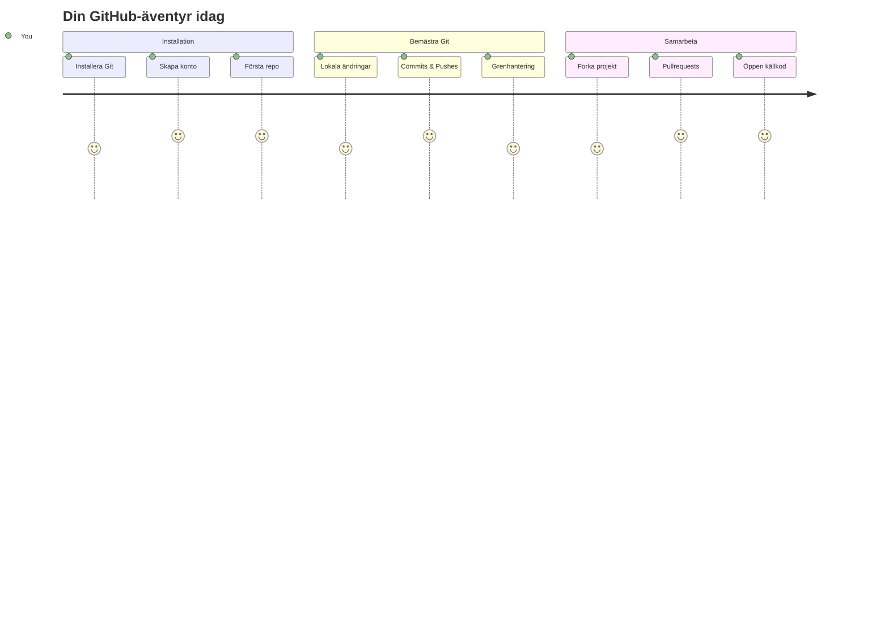
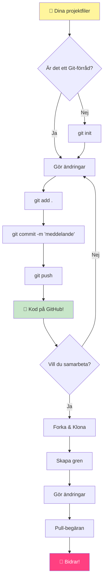
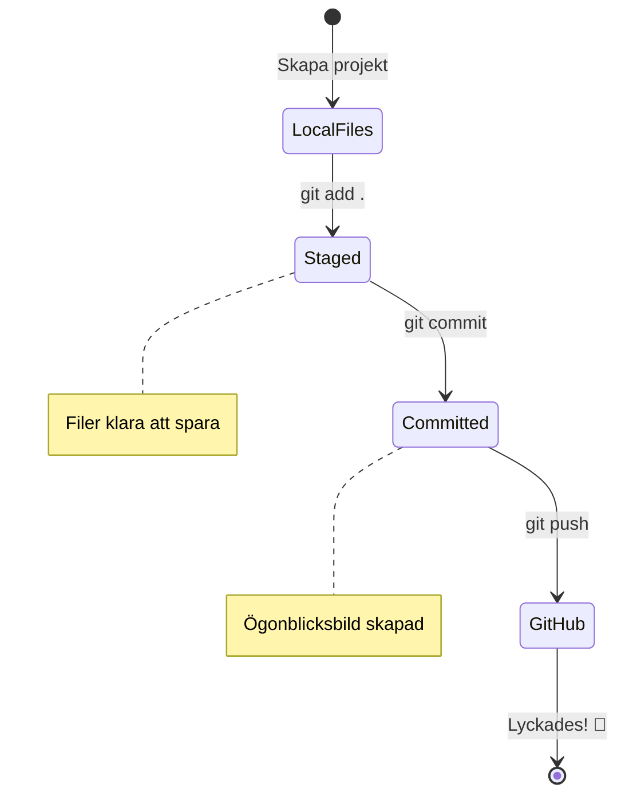
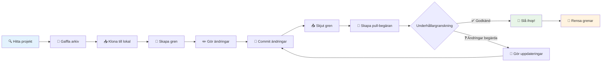
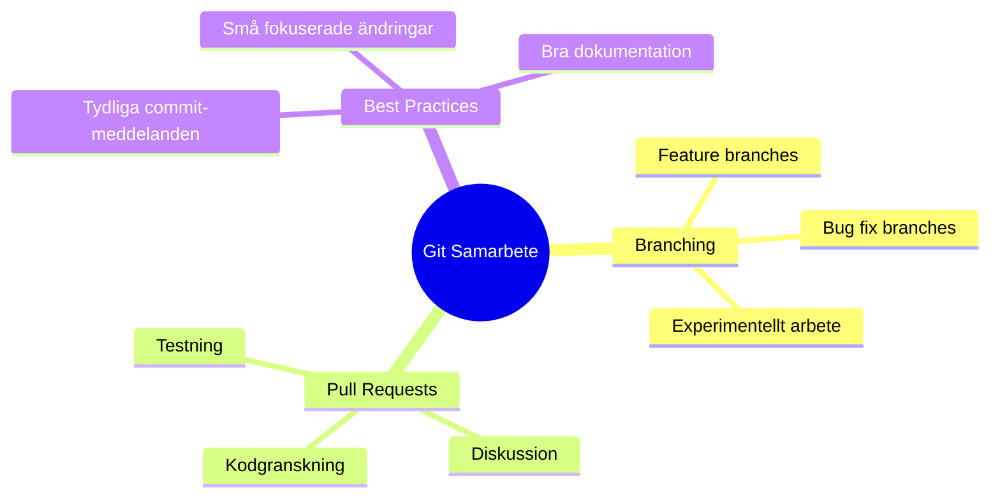
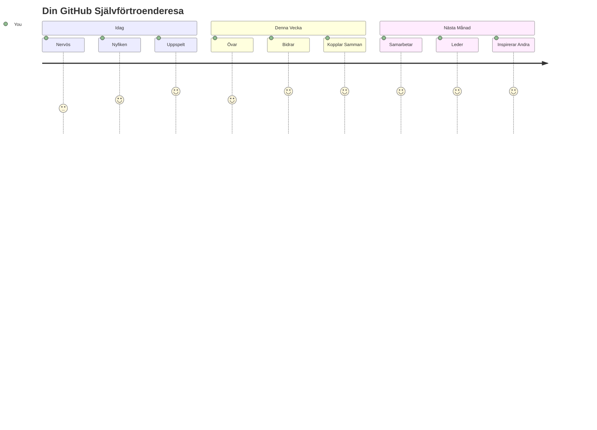

<!--
CO_OP_TRANSLATOR_METADATA:
{
  "original_hash": "5c383cc2cc23bb164b06417d1c107a44",
  "translation_date": "2026-01-06T23:18:18+00:00",
  "source_file": "1-getting-started-lessons/2-github-basics/README.md",
  "language_code": "sv"
}
-->
# Introduktion till GitHub

Hej där, framtida utvecklare! 👋 Redo att gå med i miljontals kodare runt om i världen? Jag är verkligen exalterad över att få introducera dig till GitHub – tänk på det som ett socialt medie för programmerare, fast istället för att dela bilder på din lunch, delar vi kod och bygger otroliga saker tillsammans!

Det som bara blåser mitt sinne är detta: varje app på din telefon, varje webbplats du besöker, och de flesta av verktygen du ska lära dig att använda är byggda av team av utvecklare som samarbetar på plattformar precis som GitHub. Den där musikappen du älskar? Någon som du har bidragit till den. Det där spelet du inte kan lägga ifrån dig? Ja, det är antagligen byggt med GitHub-samarbete. Och nu kommer DU att lära dig hur du blir en del av den fantastiska gemenskapen!

Jag vet att det här kan kännas mycket i början – jag minns att jag stirrade på min första GitHub-sida och tänkte ”Vad i hela världen betyder allt detta?” Men grejen är den: varje utvecklare började precis där du är just nu. I slutet av den här lektionen kommer du att ha ditt alldeles egna GitHub-repository (tänk på det som ditt personliga projektgalleri i molnet), och du kommer att veta hur man sparar sitt arbete, delar det med andra och till och med bidrar till projekt som miljontals människor använder.

Vi kommer att ta den här resan tillsammans, steg för steg. Ingen stress, inget tryck – bara du, jag och några riktigt coola verktyg som snart kommer att bli dina nya bästa vänner!


> Sketchnote av [Tomomi Imura](https://twitter.com/girlie_mac)


## Förföreläsningsquiz
[Pre-lecture quiz](https://ff-quizzes.netlify.app)

## Introduktion

Innan vi dyker in i det riktigt spännande, låt oss förbereda din dator för lite GitHub-magi! Tänk på det som att organisera dina konstmaterial innan du skapar ett mästerverk – att ha rätt verktyg redo gör allt så mycket smidigare och mycket roligare.

Jag kommer att guida dig genom varje installationssteg personligen, och jag lovar att det inte är alls lika skrämmande som det kan se ut vid första anblick. Om något inte klickar direkt, är det helt normalt! Jag minns när jag satte upp min första utvecklingsmiljö och kände att jag försökte läsa urgamla hieroglyfer. Varje utvecklare har varit precis där du är nu och undrat om de gör rätt. Spoiler alert: om du är här och lär dig, då gör du redan rätt! 🌟

I den här lektionen kommer vi att gå igenom:

- att spåra det arbete du gör på din dator
- arbeta med projekt tillsammans med andra
- hur man bidrar till öppen källkod

### Förkunskaper

Låt oss förbereda din dator för lite GitHub-magi! Oroa dig inte – den här inställningen behöver du bara göra en gång, och sedan är du redo för hela din kodningsresa.

Okej, låt oss börja med grunden! Först behöver vi kolla om Git redan finns på din dator. Git är ungefär som att ha en supersmart assistent som minns varje ändring du gör i din kod – mycket bättre än att desperat trycka Ctrl+S varannan sekund (vi har alla varit där!).

Låt oss se om Git redan är installerat genom att skriva det här magiska kommandot i din terminal:
`git --version`

Om Git inte redan finns, inga problem! Gå bara till [ladda ner Git](https://git-scm.com/downloads) och hämta det. När du har installerat det, behöver vi presentera Git ordentligt för dig:

> 💡 **Första gången-inställning**: Dessa kommandon talar om för Git vem du är. Denna information kommer att kopplas till varje commit du gör, så välj ett namn och en e-postadress som du är bekväm med att dela offentligt.

```bash
git config --global user.name "your-name"
git config --global user.email "your-email"
```

För att kontrollera om Git redan är konfigurerat kan du skriva:
```bash
git config --list
```

Du behöver också ett GitHub-konto, en kodredigerare (som Visual Studio Code) och du behöver öppna din terminal (eller: kommandoprompt).

Gå till [github.com](https://github.com/) och skapa ett konto om du inte redan har ett, eller logga in och fyll i din profil.

💡 **Modernt tips**: Överväg att sätta upp [SSH-nycklar](https://docs.github.com/en/authentication/connecting-to-github-with-ssh) eller använda [GitHub CLI](https://cli.github.com/) för enklare autentisering utan lösenord.

✅ GitHub är inte det enda kodförrådet i världen; det finns andra, men GitHub är det mest kända

### Förberedelse

Du behöver både en mapp med ett kodprojekt på din lokala dator (laptop eller PC) och ett offentligt repository på GitHub, som ska fungera som exempel på hur man kan bidra till andras projekt.

### Hålla Din Kod Säker

Låt oss prata om säkerhet en stund – men oroa dig inte, vi ska inte överväldiga dig med läskiga grejer! Tänk på dessa säkerhetssätt som att låsa din bil eller ditt hus. Det är enkla vanor som blir andra natur och skyddar ditt hårda arbete.

Vi visar dig de moderna, säkra sätten att arbeta med GitHub redan från början. På så sätt utvecklar du goda vanor som kommer att tjäna dig väl under hela din kodningskarriär.

När du arbetar med GitHub är det viktigt att följa säkerhetsbästa praxis:

| Säkerhetsområde | Bästa Praxis | Varför Det Är Viktigt |
|-----------------|--------------|-----------------------|
| **Autentisering** | Använd SSH-nycklar eller personliga åtkomsttoken | Lösenord är mindre säkra och fasas ut |
| **Tvåfaktorsautentisering** | Aktivera 2FA på ditt GitHub-konto | Lägger till ett extra lager av kontoskydd |
| **Repository-säkerhet** | Lägg aldrig upp känslig information | API-nycklar och lösenord ska aldrig finnas i offentliga repo |
| **Dependency Management** | Aktivera Dependabot för uppdateringar | Håller dina beroenden säkra och uppdaterade |

> ⚠️ **Kritiskt säkerhetspåminnelse**: Ladda aldrig upp API-nycklar, lösenord eller annan känslig information till något repository. Använd miljövariabler och `.gitignore`-filer för att skydda känsliga data.

**Modern autentiseringsuppsättning:**

```bash
# Generera SSH-nyckel (modern ed25519-algoritm)
ssh-keygen -t ed25519 -C "your_email@example.com"

# Ställ in Git för att använda SSH
git remote set-url origin git@github.com:username/repository.git
```

> 💡 **Proffstips**: SSH-nycklar eliminerar behovet av att skriva in lösenord upprepade gånger och är säkrare än traditionella autentiseringsmetoder.

---

## Hantera Din Kod Som Ett Proffs

Okej, HÄR blir det riktigt spännande! 🎉 Vi ska lära oss hur man spårar och hanterar din kod som proffsen gör, och ärligt talat är det en av mina favoritgrejer att lära ut eftersom det är en riktig spelväxlare.

Föreställ dig detta: du skriver en fantastisk berättelse och vill hålla koll på varje utkast, varje briljant redigering och varje ”vänta, det där är genialiskt!”-ögonblick på vägen. Det är precis vad Git gör för din kod! Det är som att ha den mest otroliga tidsresande anteckningsboken som minns ALLT – varje tangenttryckning, varje ändring, varje ”oj, det förstörde allt”-ögonblick som du kan ångra direkt.

Jag ska vara ärlig – det här kan kännas överväldigande i början. När jag började tänkte jag ”Varför kan jag inte bara spara mina filer som vanligt?” Men lita på mig: när Git klickar för dig (och det kommer det att göra!), kommer du att få en sådan där blixtupplevelse där du tänker ”Hur kunde jag NÅGONSIN koda utan det här?” Det är som att upptäcka att du kan flyga när du hela livet gått överallt till fots!

Säg att du har en mapp lokalt med ett kodprojekt och du vill börja spåra din utveckling med git – versionshanteringssystemet. Vissa jämför att använda git med att skriva ett kärleksbrev till ditt framtida jag. När du läser dina commit-meddelanden dagar, veckor eller månader senare kommer du att kunna minnas varför du tog ett beslut, eller ”rulla tillbaka” en ändring – det vill säga, när du skriver bra ”commit-meddelanden”.


### Uppgift: Skapa Ditt Första Repository!

> 🎯 **Din uppdrag (och jag är så exalterad för dig!)**: Vi kommer att skapa ditt allra första GitHub-repository tillsammans! När vi är klara här, kommer du att ha ditt eget lilla hörn av internet där din kod bor, och du kommer att ha gjort din första ”commit” (det är utvecklarespråk för att spara ditt arbete på ett riktigt smart sätt).
>
> Det här är verkligen ett speciellt ögonblick – du är på väg att officiellt gå med i den globala utvecklargemenskapen! Jag minns fortfarande pirret när jag skapade mitt första repo och tänkte ”Wow, jag gör verkligen detta!”

Låt oss gå igenom äventyret tillsammans, steg för steg. Ta din tid med varje del – det finns inget pris för att skynda, och jag lovar att varje steg kommer att göra mening. Kom ihåg, varje kodningssuperstjärna du beundrar har suttit precis där du är nu, redo att skapa sitt första repository. Hur coolt är inte det?

> Kolla in video
> 
> [](https://www.youtube.com/watch?v=9R31OUPpxU4)

**Vi gör detta tillsammans:**

1. **Skapa ditt repository på GitHub**. Gå till GitHub.com och leta efter den ljusgröna **New**-knappen (eller **+**-tecknet uppe i högra hörnet). Klicka på den och välj **New repository**.

   Så här gör du:
   1. Ge ditt repository ett namn – välj något som betyder något för dig!
   1. Lägg till en beskrivning om du vill (det hjälper andra att förstå vad ditt projekt handlar om)
   1. Bestäm om du vill ha det offentligt (alla kan se det) eller privat (bara du)
   1. Jag rekommenderar att du kryssar i rutan för att lägga till en README-fil – det är som förstasidan till ditt projekt
   1. Klicka på **Create repository** och fira – du har just skapat ditt första repo! 🎉

2. **Navigera till din projektmapp**. Nu öppnar vi din terminal (oroa dig inte, det är inte så skrämmande som det ser ut!). Vi behöver tala om för din dator var dina projektfiler finns. Skriv det här kommandot:

   ```bash
   cd [name of your folder]
   ```

   **Det vi gör här:**
   - Vi säger i princip ”Hej dator, ta mig till min projektmapp”
   - Det är som att öppna en specifik mapp på skrivbordet, fast vi gör det med textkommandon
   - Byt ut `[name of your folder]` till det faktiska namnet på din projektmapp

3. **Gör om din mapp till ett Git-repository**. Här händer magin! Skriv:

   ```bash
   git init
   ```

   **Det här har precis hänt (riktigt coolt!):**
   - Git har precis skapat en dold `.git`-mapp i ditt projekt – du kommer inte att se den, men den finns där!
   - Din vanliga mapp är nu ett ”repository” som kan spåra varje ändring du gör
   - Tänk på det som att ge din mapp superkrafter att minnas allt

4. **Kolla vad som händer**. Låt oss se vad Git tycker om ditt projekt just nu:

   ```bash
   git status
   ```

   **Att förstå vad Git berättar för dig:**
   
   Du kan se något som ser ut så här:

   ```output
   Changes not staged for commit:
   (use "git add <file>..." to update what will be committed)
   (use "git restore <file>..." to discard changes in working directory)

        modified:   file.txt
        modified:   file2.txt
   ```

   **Panika inte! Så här ska du tolka det:**
   - Filer i **rött** är filer som har ändringar men inte är redo att sparas ännu
   - Filer i **grönt** (när du ser dem) är redo att sparas
   - Git är hjälpsam och berättar exakt vad du kan göra härnäst

   > 💡 **Proffstips**: Kommandot `git status` är din bästa vän! Använd det när du är förvirrad över vad som pågår. Det är som att fråga Git ”Hej, hur ligger det till just nu?”

5. **Förbered dina filer för att spara** (det kallas ”staging”):

   ```bash
   git add .
   ```

   **Det vi just gjorde:**
   - Vi sa till Git ”Hej, jag vill inkludera ALLA mina filer i nästa sparning”
   - `.` betyder ”allt i den här mappen”
   - Nu är dina filer ”staged” och redo för nästa steg

   **Vill du vara mer selektiv?** Du kan lägga till specifika filer:

   ```bash
   git add [file or folder name]
   ```

   **Varför vill du kanske göra så här?**
   - Ibland vill du spara relaterade ändringar tillsammans
   - Det hjälper dig att organisera ditt arbete i logiska delar
   - Gör det enklare att förstå vad som ändrats och när

   **Ångrat dig?** Ingen fara! Du kan ta bort filer från staging så här:

   ```bash
   # Ta bort alla från staging
   git reset
   
   # Ta bort bara en fil från staging
   git reset [file name]
   ```

   Oroa dig inte – det tar inte bort ditt arbete, det tar bara bort filer från ”redo att spara”-högen.

6. **Spara ditt arbete permanent** (gör din första commit!):

   ```bash
   git commit -m "first commit"
   ```

   **🎉 Grattis! Du har precis gjort din första commit!**
   
   **Det här har precis hänt:**
   - Git tog en ”snapshot” av alla dina staged filer just nu
   - Ditt commit-meddelande ”first commit” förklarar vad denna sparpunkt handlar om
   - Git gav denna snapshot ett unikt ID så du alltid kan hitta det senare
   - Du har officiellt börjat spåra ditt projekts historia!

   > 💡 **Framtida commit-meddelanden**: Var mer beskrivande i nästa commits! Istället för ”uppdaterade grejer”, prova ”Lägg till kontaktformulär på startsidan” eller ”Fixar bugg i navigeringsmenyn”. Ditt framtida jag kommer att tacka dig!

7. **Koppla ditt lokala projekt till GitHub**. Just nu finns ditt projekt bara på din dator. Låt oss koppla det till ditt GitHub-repository så du kan dela det med världen!

   Gå först till din GitHub-repository-sida och kopiera URL:en. Kom tillbaka hit och skriv:

   ```bash
   git remote add origin https://github.com/username/repository_name.git
   ```
   
   (Byt ut den URL:en mot din faktiska repository-URL!)

   **Det vi just gjorde:**
   - Vi skapade en koppling mellan ditt lokala projekt och ditt GitHub-förråd
   - "Origin" är bara ett smeknamn för ditt GitHub-förråd – det är som att lägga till en kontakt i din telefon
   - Nu vet ditt lokala Git var det ska skicka din kod när du är redo att dela den

   💡 **Enklare sätt**: Om du har GitHub CLI installerat kan du göra detta med ett enda kommando:
   ```bash
   gh repo create my-repo --public --push --source=.
   ```

8. **Skicka din kod till GitHub** (det stora ögonblicket!):

   ```bash
   git push -u origin main
   ```

   **🚀 Här händer det! Du laddar upp din kod till GitHub!**
   
   **Vad som händer:**
   - Dina commits färdas från din dator till GitHub
   - `-u`-flaggan skapar en permanent anslutning så att framtida pushar blir enklare
   - "main" är namnet på din primära gren (som huvudmappen)
   - Efter detta kan du bara skriva `git push` för framtida uppladdningar!

   💡 **Snabb notis**: Om din gren heter något annat (som "master"), använd det namnet istället. Du kan kolla med `git branch --show-current`.

9. **Din nya dagliga kodningsrytm** (det är här det blir beroendeframkallande!):

   Från och med nu, när du gör ändringar i ditt projekt, har du denna enkla trestegs-dans:

   ```bash
   git add .
   git commit -m "describe what you changed"
   git push
   ```

   **Detta blir din kodningspuls:**
   - Gör några fantastiska ändringar i din kod ✨
   - Lägg till dem med `git add` ("Hej Git, uppmärksamma dessa ändringar!")
   - Spara dem med `git commit` och ett beskrivande meddelande (framtida du kommer tacka dig!)
   - Dela dem med världen med `git push` 🚀
   - Upprepa – seriöst, detta blir lika naturligt som att andas!

   Jag älskar detta arbetsflöde eftersom det är som att ha flera sparpunkter i ett videospel. Gjorde du en förändring du gillar? Commit:a den! Vill du testa något riskabelt? Inga problem – du kan alltid gå tillbaka till din senaste commit om saker och ting går fel!

   > 💡 **Tips**: Du kanske också vill använda en `.gitignore`-fil för att hindra filer du inte vill spåra från att visas på GitHub - som den där anteckningsfilen du lagrar i samma mapp men som inte hör hemma i ett offentligt förråd. Du kan hitta mallar för `.gitignore`-filer på [.gitignore templates](https://github.com/github/gitignore) eller skapa en med [gitignore.io](https://www.toptal.com/developers/gitignore).

### 🧠 **Första incheckningen i förrådet: Hur kändes det?**

**Ta en stund att fira och reflektera:**
- Hur kändes det att se din kod dyka upp på GitHub för första gången?
- Vilket steg kändes mest förvirrande, och vilket var oväntat enkelt?
- Kan du förklara skillnaden mellan `git add`, `git commit` och `git push` med egna ord?


> **Kom ihåg**: Även erfarna utvecklare glömmer ibland exakt vilka kommandon som ska användas. Att detta arbetsflöde blir muskelminne kräver övning – du gör det jättebra!

#### Moderna Git-arbetsflöden

Överväg att anta dessa moderna metoder:

- **Conventional Commits**: Använd ett standardiserat format för commit-meddelanden som `feat:`, `fix:`, `docs:`, etc. Läs mer på [conventionalcommits.org](https://www.conventionalcommits.org/)
- **Atomära commits**: Se till att varje commit representerar en enda logisk ändring
- **Frekventa commits**: Commita ofta med beskrivande meddelanden istället för stora, sällsynta commits

#### Commit-meddelanden

En bra Git commit-ämnesrad avslutar meningen:
Om denna görs kommer denna commit att <ditt ämne här>

Använd imperativ, presensform i ämnesraden: "change" och inte "changed" eller "changes". 
Precis som i ämnesraden ska du i brödtexten (valfri) också använda imperativ, presens. Brödtexten bör innehålla motivationen bakom ändringen och kontrastera detta med tidigare beteende. Du förklarar *varför*, inte *hur*.

✅ Ta några minuter och surf på GitHub. Kan du hitta ett riktigt bra commit-meddelande? Kan du hitta ett väldigt minimalistiskt? Vilken information tycker du är mest viktig och användbar att förmedla i ett commit-meddelande?

## Arbeta med andra (Den roliga delen!)

Håll i hatten för nu blir GitHub helt magiskt! 🪄 Du har lärt dig att hantera din egen kod, men nu dyker vi ner i min absoluta favoritdel – att samarbeta med fantastiska människor från hela världen.

Föreställ dig detta: du vaknar imorgon och ser att någon i Tokyo förbättrade din kod medan du sov. Sedan fixar någon i Berlin en bugg som du fastnat på. På eftermiddagen har en utvecklare i São Paulo lagt till en funktion du aldrig ens tänkt på. Det är ingen science fiction – det är bara en tisdag i GitHub-universumet!

Det som verkligen får mig att bli exalterad är att de samarbetsfärdigheter du är på väg att lära dig? Det är DESSA exakt samma arbetsflöden som team på Google, Microsoft och dina favorit-startups använder varje dag. Du lär dig inte bara ett häftigt verktyg – du lär dig det hemliga språket som får hela mjukvaruvärlden att samarbeta.

Allvarligt, när du väl känner känslan av att någon mergar din första pull request, förstår du varför utvecklare blir så passionerade för open source. Det är som att vara med i världens största, mest kreativa teamprojekt!

> Kolla på video
>
> [](https://www.youtube.com/watch?v=bFCM-PC3cu8)

Den främsta anledningen till att lägga saker på GitHub var att göra det möjligt att samarbeta med andra utvecklare.


I ditt förråd, gå till `Insights > Community` för att se hur ditt projekt står sig mot rekommenderade gemenskapsstandarder.

Vill du att ditt förråd ska se professionellt och välkomnande ut? Gå till ditt förråd och klicka på `Insights > Community`. Denna coola funktion visar hur ditt projekt står sig mot vad GitHub-gemenskapen anser är "goda förrådsvanor."

> 🎯 **Få ditt projekt att glänsa**: Ett välorganiserat förråd med bra dokumentation är som att ha en ren, inbjudande butikslokal. Det visar att du bryr dig om ditt arbete och får andra att vilja bidra!

**Det här gör ett förråd fantastiskt:**

| Vad att lägga till | Varför det är viktigt | Vad det ger dig |
|--------------------|----------------------|-----------------|
| **Beskrivning** | Första intrycket räknas! | Folk förstår direkt vad ditt projekt gör |
| **README** | Projektets förstasida | Som en vänlig guide för nya besökare |
| **Contributing Guidelines** | Visar att hjälp är välkommen | Folk vet exakt hur de kan hjälpa dig |
| **Code of Conduct** | Skapar en vänlig miljö | Alla känner sig välkomna att delta |
| **License** | Juridisk tydlighet | Andra vet hur de får använda din kod |
| **Security Policy** | Visar att du är ansvarsfull | Visar på professionella rutiner |

> 💡 **Proffstips**: GitHub tillhandahåller mallar för alla dessa filer. När du skapar ett nytt förråd, bocka av rutorna för att automatiskt generera dessa filer.

**Moderna GitHub-funktioner att utforska:**

🤖 **Automatisering & CI/CD:**
- **GitHub Actions** för automatiserad testning och distribution
- **Dependabot** för automatiska beroendeuppdateringar

💬 **Community & projektledning:**
- **GitHub Discussions** för gemenskapsdiskussioner utöver issues
- **GitHub Projects** för kanban-liknande projektledning
- **Branch protection rules** för att upprätthålla kodkvalitetsstandarder


Alla dessa resurser underlättar onboarding av nya teammedlemmar. Och det är typiskt sådant nya bidragsgivare tittar på innan de överhuvudtaget kollar på din kod, för att avgöra om ditt projekt är rätt plats för deras tid.

✅ README-filer, även om de tar tid att förbereda, försummas ofta av upptagna underhållare. Kan du hitta ett exempel på en särskilt beskrivande sådan? Notera: det finns några [verktyg för att skapa bra READMEs](https://www.makeareadme.com/) som du kanske vill prova.

### Uppgift: Merge:a lite kod

Contributing docs hjälper folk att bidra till projektet. De förklarar vilka slags bidrag du vill ha och hur processen fungerar. Bidragsgivare kommer behöva gå igenom ett antal steg för att kunna bidra till ditt repo på GitHub:


1. **Fork:a ditt repo** Du vill förmodligen att folk ska _fork:a_ ditt projekt. Forkning betyder att skapa en kopia av ditt förråd på deras GitHub-profil.
1. **Klona**. Därifrån klonar de projektet till sin lokala maskin. 
1. **Skapa en gren**. Du vill be dem skapa en _gren_ för sitt arbete. 
1. **Fokusera sin ändring på ett område**. Be bidragsgivare att koncentrera sina insatser på en sak i taget – då ökar chansen att du kan _merge:a_ deras arbete. Tänk dig att de skriver en buggfix, lägger till en ny funktion och uppdaterar flera tester – vad händer om du vill, eller bara kan, implementera 2 av 3 ändringar eller 1 av 3?

✅ Föreställ dig en situation där grenar är särskilt viktiga för att skriva och leverera bra kod. Vilka användningsfall kan du tänka dig?

> Tänk på att vara den förändring du vill se i världen och skapa grenar även för ditt eget arbete. Alla commits du gör kommer att göras på den gren du för närvarande är ”utcheckad” till. Använd `git status` för att se vilken gren det är.

Låt oss gå igenom ett arbetsflöde för bidragsgivare. Anta att bidragsgivaren redan _fork:at_ och _klonat_ repot så att de har ett Git-repo redo att jobbas med på sin lokala maskin:

1. **Skapa en gren**. Använd kommandot `git branch` för att skapa en gren som ska innehålla de ändringar de tänker bidra med:

   ```bash
   git branch [branch-name]
   ```

   > 💡 **Modernt tillvägagångssätt**: Du kan också skapa och byta till den nya grenen i ett enda kommando:
   ```bash
   git switch -c [branch-name]
   ```

1. **Byt till arbetsgrenen**. Byt till den angivna grenen och uppdatera arbetskatalogen med `git switch`:

   ```bash
   git switch [branch-name]
   ```

   > 💡 **Modern notis**: `git switch` är den moderna ersättaren för `git checkout` när du byter gren. Det är tydligare och säkrare för nybörjare.

1. **Gör jobbet**. Nu vill du lägga till dina ändringar. Glöm inte att be Git om det med följande kommandon:

   ```bash
   git add .
   git commit -m "my changes"
   ```

   > ⚠️ **Bra commit-meddelande**: Se till att ge din commit ett bra namn, både för din egen skull och för underhållaren av repot du hjälper. Var specifik om vad du har ändrat!

1. **Kombinera ditt arbete med `main`-grenen**. Vid något tillfälle är du klar och vill kombinera ditt arbete med `main`-grenens. `main` kan ha ändrats under tiden så se till att först uppdatera den till senaste version med följande kommandon:

   ```bash
   git switch main
   git pull
   ```

   Nu vill du försäkra dig om att eventuella _konflikter_, situationer där Git inte enkelt kan _kombinera_ ändringarna, inträffar i din arbetsgren. Så kör följande kommandon:

   ```bash
   git switch [branch_name]
   git merge main
   ```

   Kommandot `git merge main` hämtar in alla ändringar från `main` till din gren. Förhoppningsvis kan du fortsätta direkt. Om inte kommer VS Code visa var Git är _förvirrat_ och du ändrar bara i de berörda filerna för att säga vilken version som är korrekt.

   💡 **Modernare alternativ**: Överväg att använda `git rebase` för en renare historik:
   ```bash
   git rebase main
   ```
   Detta spelar upp dina commits ovanpå senaste main-grenen och skapar en linjär historik.

1. **Skicka ditt arbete till GitHub**. Att skicka arbetet till GitHub betyder två saker. Pusha din gren till ditt repo och sedan öppna ett PR, Pull Request.

   ```bash
   git push --set-upstream origin [branch-name]
   ```

   Kommandot ovan skapar grenen på ditt forkade repo.

### 🤝 **Checklista för samarbetsfärdigheter: Redo att arbeta med andra?**

**Så här känner du inför samarbete:**
- Känns idén med forking och pull requests klar för dig nu?
- Vad är en sak kring att arbeta med grenar som du vill öva mer på?
- Hur bekväm känner du dig med att bidra till någon annans projekt?


> **Självförtroendeboost**: Varje utvecklare du beundrar har varit nervös inför sin första pull request. GitHub-gemenskapen är otroligt välkomnande för nybörjare!

1. **Öppna ett PR**. Nästa steg är att öppna ett PR. Det gör du genom att gå till det forkade repot på GitHub. Du kommer se en indikation där GitHub frågar om du vill skapa en ny PR, klicka där så kommer du till en sida där du kan ändra commitmeddelandets titel, ge den en mer passande beskrivning. Nu kommer den som underhåller repot du forkade att se detta PR och *håller tummarna* att de gillar och *mergar* din PR. Du är nu en bidragsgivare, yay :)

   💡 **Modernt tips**: Du kan också skapa PRs med GitHub CLI:
   ```bash
   gh pr create --title "Your PR title" --body "Description of changes"
   ```

   🔧 **Bästa praxis för PRs**:
   - Länka till relaterade issues med nyckelord som "Fixes #123"
   - Lägg till skärmdumpar för UI-ändringar
   - Be om specifika granskare
   - Använd utkast-PRs för pågående arbete
   - Säkerställ att alla CI-kontroller passerar innan du begär granskning
1. **Rensa upp**. Det anses vara god praxis att _rensa upp_ efter att du framgångsrikt har mergat en PR. Du vill rensa upp både din lokala gren och grenen du pushade till GitHub. Först låt oss ta bort den lokalt med följande kommando:

   ```bash
   git branch -d [branch-name]
   ```

   Se till att du sedan går till GitHub-sidan för det forkade repot och tar bort den fjärrgren du precis pushade till det.

`Pull request` verkar vara ett konstigt begrepp eftersom du egentligen vill pusha dina ändringar till projektet. Men underhållaren (projektägaren) eller kärnteamet behöver granska dina ändringar innan de mergar dem med projektets "main"-gren, så du begär egentligen ett beslut om ändring från en underhållare.

En pull request är platsen där man jämför och diskuterar de skillnader som införs på en gren med granskningar, kommentarer, integrerade tester och mer. En bra pull request följer ungefär samma regler som ett commit-meddelande. Du kan lägga till en referens till ett issue i issue-tracker, när ditt arbete till exempel åtgärdar ett problem. Detta görs med `#` följt av numret på ditt issue. Till exempel `#97`.

🤞Håller tummarna att alla kontroller godkänns och att projektägaren/-ägarna mergar dina ändringar in i projektet🤞

Uppdatera din nuvarande lokala arbetsgren med alla nya commits från motsvarande fjärrgren på GitHub:

`git pull`

## Bidra till Open Source (Din chans att göra skillnad!)

Är du redo för något som verkligen kommer att blåsa ditt sinne? 🤯 Låt oss prata om att bidra till open source-projekt – och jag får gåshud bara av att tänka på att dela detta med dig!

Det här är din chans att bli en del av något verkligen extraordinärt. Föreställ dig att förbättra verktyg som miljontals utvecklare använder varje dag, eller att fixa en bugg i en app som dina vänner älskar. Det är inte bara en dröm – det är vad open source-bidrag handlar om!

Här är vad som ger mig rysningar varje gång jag tänker på det: varje verktyg du har lärt dig med – din kodredigerare, ramverken vi ska utforska, till och med webbläsaren du läser detta i – startade med någon precis som du som gjorde sitt allra första bidrag. Den geniala utvecklaren som byggde din favorit VS Code-extension? De var en gång en nybörjare som klickade på "create pull request" med darriga händer, precis som du ska göra.

Och här är det vackraste: open source-gemenskapen är som internet största gruppkram. De flesta projekt söker aktivt efter nykomlingar och har issues märkta "good first issue" specifikt för personer som du! Underhållare blir genuint glada när de ser nya bidragsgivare eftersom de minns sina egna första steg.

```mermaid
flowchart TD
    A[🔍 Utforska GitHub] --> B[🏷️ Hitta "bra första ärende"]
    B --> C[📖 Läs bidragsriktlinjer]
    C --> D[🍴 Gaffla arkivet]
    D --> E[💻 Sätt upp lokal miljö]
    E --> F[🌿 Skapa funktionsgren]
    F --> G[✨ Gör ditt bidrag]
    G --> H[🧪 Testa dina ändringar]
    H --> I[📝 Skriv tydlig commit]
    I --> J[📤 Pusha & skapa PR]
    J --> K[💬 Engagera dig i feedback]
    K --> L[🎉 Sammanslagen! Du är en bidragsgivare!]
    L --> M[🌟 Hitta nästa ärende]
    
    style A fill:#e1f5fe
    style L fill:#c8e6c9
    style M fill:#fff59d
```
Du lär dig inte bara att koda här – du förbereder dig för att gå med i en global familj av byggare som vaknar varje dag och tänker "Hur kan vi göra den digitala världen lite bättre?" Välkommen till klubben! 🌟

Först, låt oss hitta ett repository (eller **repo**) på GitHub som intresserar dig och som du vill bidra till med en ändring. Du vill kopiera dess innehåll till din dator.

✅ Ett bra sätt att hitta "nybörjarvänliga" repos är att [söka efter taggen 'good-first-issue'](https://github.blog/2020-01-22-browse-good-first-issues-to-start-contributing-to-open-source/).


Det finns flera sätt att kopiera kod. Ett sätt är att "klona" innehållet i repot, med HTTPS, SSH eller med GitHub CLI (Command Line Interface).

Öppna din terminal och klona repot så här:
```bash
# Använder HTTPS
git clone https://github.com/ProjectURL

# Använder SSH (kräver SSH-nyckelinstallation)
git clone git@github.com:username/repository.git

# Använder GitHub CLI
gh repo clone username/repository
```

För att arbeta på projektet, byt till rätt mapp:
`cd ProjectURL`

Du kan också öppna hela projektet med:
- **[GitHub Codespaces](https://github.com/features/codespaces)** - GitHubs molnutvecklingsmiljö med VS Code i webbläsaren
- **[GitHub Desktop](https://desktop.github.com/)** - En GUI-applikation för Git-operationer  
- **[GitHub.dev](https://github.dev)** - Tryck på `.`-knappen på vilket GitHub-repo som helst för att öppna VS Code i webbläsaren
- **VS Code** med GitHub Pull Requests-tillägget

Till sist kan du ladda ner koden i en zippad mapp.

### Några fler intressanta saker om GitHub

Du kan stjärnmärka, följa och/eller "forka" vilket offentligt repo som helst på GitHub. Du kan hitta dina stjärnmärkta repos i drop-downmenyn uppe till höger. Det är som bokmärken, fast för kod.

Projekt har en issue-tracker, mestadels på GitHub under fliken "Issues" såvida inte annat anges, där folk diskuterar problem relaterade till projektet. Och fliken Pull Requests är där man diskuterar och granskar pågående ändringar.

Projekt kan också ha diskussioner i forum, mejllistor eller chattkanaler som Slack, Discord eller IRC.

🔧 **Moderna GitHub-funktioner**:
- **GitHub Discussions** - Inbyggt forum för community-samtal
- **GitHub Sponsors** - Stöd underhållare ekonomiskt  
- **Security-tab** - Sårbarhetsrapporter och säkerhetsvarningar
- **Actions-tab** - Se automatiserade arbetsflöden och CI/CD pipelines
- **Insights-tab** - Analys av bidragsgivare, commits och projektets hälsa
- **Projects-tab** - GitHubs inbyggda projektledningsverktyg

✅ Ta en titt runt i ditt nya GitHub-repo och testa några saker, som att ändra inställningar, lägga till information till ditt repo, skapa ett projekt (som en Kanban-tavla), och sätta upp GitHub Actions för automatisering. Det finns massor du kan göra!

---

## 🚀 Utmaning

Okej, det är dags att testa dina glänsande nya GitHub-superkrafter! 🚀 Här är en utmaning som kommer göra att allt klickar på det mest tillfredsställande sätt:

Ta med en vän (eller den där familjemedlemmen som alltid frågar vad du pysslar med med all denna "datorgrej") och ge er ut på ett samarbetsäventyr med kod! Här händer den verkliga magin – skapa ett projekt, låt dem forka det, skapa några grenar och merg ändringar som de proffs ni håller på att bli.

Jag ska inte ljuga – ni kommer nog skratta någon gång (särskilt när ni båda försöker ändra samma rad), kanske klia er i huvudet i förvirring, men ni kommer helt klart att få de fantastiska "aha!"-ögonblicken som gör all inlärning värd det. Plus, det finns något speciellt med att dela den första lyckade mergningen med någon annan – det är som en liten firande av hur långt du har kommit!

Har du ingen kodkompis ännu? Ingen fara alls! GitHub-gemenskapen är full av otroligt välkomnande människor som minns hur det var att vara ny. Leta efter repositories med "good first issue"-etiketter – de säger i princip "Hej nybörjare, kom och lär med oss!" Hur fantastiskt är inte det?

## Quiz efter föreläsningen
[Quiz efter föreläsningen](https://ff-quizzes.netlify.app/web/en/)

## Granska & Fortsätt Lära

Puh! 🎉 Titta på dig – du har just bemästrat GitHub-grunderna som en riktig mästare! Om din hjärna känns lite full just nu är det helt normalt och faktiskt ett gott tecken. Du har precis lärt dig verktyg som tog mig veckor att känna mig bekväm med när jag började.

Git och GitHub är otroligt kraftfulla (på riktigt, superkraftfulla), och varje utvecklare jag känner – inklusive de som verkar vara trollkarlar nu – var tvungen att öva och snubbla runt lite innan allt föll på plats. Faktum är att du har klarat den här lektionen betyder att du redan är på väg att bemästra några av de viktigaste verktygen i en utvecklares verktygslåda.

Här är några helt fantastiska resurser för att hjälpa dig öva och bli ännu bättre:

- [Guide för att bidra till open source-programvara](https://opensource.guide/how-to-contribute/#how-to-submit-a-contribution) – Din vägledning för att göra skillnad
- [Git fusklapp](https://training.github.com/downloads/github-git-cheat-sheet/) – Håll denna nära för snabb referens!

Och kom ihåg: övning ger framsteg, inte perfektion! Ju mer du använder Git och GitHub, desto mer naturligt blir det. GitHub har skapat några fantastiska interaktiva kurser som låter dig öva i en säker miljö:

- [Introduktion till GitHub](https://github.com/skills/introduction-to-github)
- [Kommunicera med Markdown](https://github.com/skills/communicate-using-markdown)  
- [GitHub Pages](https://github.com/skills/github-pages)
- [Hantera merge-konflikter](https://github.com/skills/resolve-merge-conflicts)

**Känner du dig äventyrlig? Kolla in dessa moderna verktyg:**
- [GitHub CLI-dokumentation](https://cli.github.com/manual/) – För när du vill känna dig som en kommandoradstrollkarl
- [GitHub Codespaces dokumentation](https://docs.github.com/en/codespaces) – Koda i molnet!
- [GitHub Actions dokumentation](https://docs.github.com/en/actions) – Automatisera allt
- [Git bästa praxis](https://www.atlassian.com/git/tutorials/comparing-workflows) – Ta ditt arbetsflöde till nästa nivå

## GitHub Copilot Agent-utmaning 🚀

Använd Agent-läget för att utföra följande utmaning:

**Beskrivning:** Skapa ett samarbetsprojekt för webb-utveckling som demonstrerar hela GitHub-arbetsflödet du har lärt dig i denna lektion. Denna utmaning hjälper dig att öva på repository-skapande, samarbetsfunktioner och moderna Git-arbetsflöden i ett verkligt scenario.

**Uppmaning:** Skapa ett nytt offentligt GitHub-repository för ett enkelt "Web Development Resources"-projekt. Reporiet ska inkludera en välstrukturerad README.md-fil som listar användbara verktyg och resurser för webb-utveckling, organiserade i kategorier (HTML, CSS, JavaScript, etc.). Ställ in repot med rätt community-standarder inklusive en licens, riktlinjer för bidrag och en uppförandekod. Skapa minst två funktionsgrenar: en för att lägga till CSS-resurser och en annan för JavaScript-resurser. Gör commits till varje gren med beskrivande commit-meddelanden, och skapa sedan pull requests för att merg ändringarna till main. Aktivera GitHub-funktioner som Issues, Discussions och sätt upp ett grundläggande GitHub Actions-arbetsflöde för automatiska kontroller.

## Uppdrag

Ditt uppdrag, om du väljer att acceptera det: Slutför kursen [Introduction to GitHub](https://github.com/skills/introduction-to-github) på GitHub Skills. Denna interaktiva kurs låter dig öva allt du har lärt dig i en säker, guidad miljö. Dessutom får du ett coolt märke när du är klar! 🏅

**Känner du dig redo för mer utmaningar?**
- Ställ in SSH-autentisering för ditt GitHub-konto (inga fler lösenord!)
- Prova att använda GitHub CLI för dina dagliga Git-operationer
- Skapa ett repository med ett GitHub Actions-arbetsflöde
- Utforska GitHub Codespaces genom att öppna just detta repository i en molnbaserad editor

---

## 🚀 Din GitHub-mästerskapstidslinje

### ⚡ **Vad du kan göra inom de närmaste 5 minuterna**
- [ ] Stjärnmärka detta repository och 3 andra projekt som intresserar dig
- [ ] Ställa in tvåfaktorsautentisering på ditt GitHub-konto
- [ ] Skapa en enkel README för ditt första repository
- [ ] Följa 5 utvecklare vars arbete inspirerar dig

### 🎯 **Vad du kan åstadkomma denna timme**
- [ ] Genomföra quizet efter lektionen och reflektera över din GitHub-resa
- [ ] Ställa in SSH-nycklar för lösenordsfri GitHub-autentisering
- [ ] Göra din första meningsfulla commit med ett bra commit-meddelande
- [ ] Utforska GitHubs "Explore"-flik för att upptäcka trendande projekt
- [ ] Öva på att forka ett repository och göra en liten ändring

### 📅 **Din veckolånga GitHub-äventyr**
- [ ] Slutföra GitHub Skills-kurserna (Introduction to GitHub, Markdown)
- [ ] Göra din första pull request till ett open source-projekt
- [ ] Skapa en GitHub Pages-sida för att visa upp ditt arbete
- [ ] Gå med i GitHub Discussions om projekt som intresserar dig
- [ ] Skapa ett repository med korrekta community-standarder (README, Licens, etc.)
- [ ] Prova GitHub Codespaces för molnbaserad utveckling

### 🌟 **Din månadslånga förvandling**
- [ ] Bidra till 3 olika open source-projekt
- [ ] Vara mentor för någon ny på GitHub (ge vidare!)
- [ ] Sätta upp automatiserade arbetsflöden med GitHub Actions
- [ ] Bygga en portfolio som visar dina GitHub-bidrag
- [ ] Delta i Hacktoberfest eller liknande community-evenemang
- [ ] Bli underhållare för ditt eget projekt som andra bidrar till

### 🎓 **Slutlig GitHub-mästerskapscheck**

**Fira hur långt du har kommit:**
- Vad är det bästa med att använda GitHub, enligt dig?
- Vilken samarbetsfunktion tycker du är mest spännande?
- Hur självsäker känner du dig om att bidra till open source nu?
- Vilket är det första projektet du vill bidra till?


> 🌍 **Välkommen till den globala utvecklargemenskapen!** Du har nu verktygen för att samarbeta med miljontals utvecklare världen över. Ditt första bidrag kan verka litet, men kom ihåg – varje stort open source-projekt startade med någon som gjorde sitt allra första commit. Frågan är inte om du kommer att göra skillnad, utan vilket fantastiskt projekt som först kommer att dra nytta av ditt unika perspektiv! 🚀

Kom ihåg: varje expert var en gång nybörjare. Du klarar det här! 💪

---

<!-- CO-OP TRANSLATOR DISCLAIMER START -->
**Ansvarsfriskrivning**:
Detta dokument har översatts med hjälp av AI-översättningstjänsten [Co-op Translator](https://github.com/Azure/co-op-translator). Även om vi strävar efter noggrannhet, bör du vara medveten om att automatiska översättningar kan innehålla fel eller avvikelser. Det ursprungliga dokumentet på dess modersmål ska betraktas som den auktoritativa källan. För kritisk information rekommenderas professionell mänsklig översättning. Vi ansvarar inte för några missförstånd eller felaktiga tolkningar som uppstår från användningen av denna översättning.
<!-- CO-OP TRANSLATOR DISCLAIMER END -->