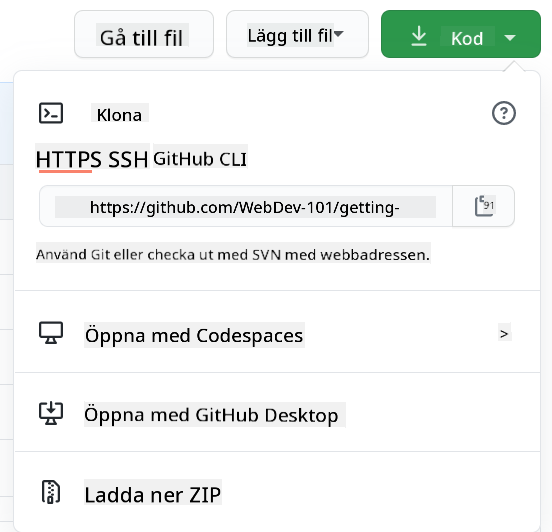

<!--
CO_OP_TRANSLATOR_METADATA:
{
  "original_hash": "ea65b75e488aa33a3cc5cb1c6c3f047a",
  "translation_date": "2025-10-03T14:00:11+00:00",
  "source_file": "1-getting-started-lessons/2-github-basics/README.md",
  "language_code": "sv"
}
-->
# Introduktion till GitHub

Den här lektionen täcker grunderna i GitHub, en plattform för att hosta och hantera ändringar i din kod.


> Sketchnote av [Tomomi Imura](https://twitter.com/girlie_mac)

## Quiz före föreläsningen
[Quiz före föreläsningen](https://ff-quizzes.netlify.app)

## Introduktion

I den här lektionen kommer vi att gå igenom:

- att spåra det arbete du gör på din dator
- att arbeta med projekt tillsammans med andra
- hur man bidrar till öppen källkod

### Förkunskaper

Innan du börjar, kontrollera om Git är installerat. Skriv i terminalen:  
`git --version`

Om Git inte är installerat, [ladda ner Git](https://git-scm.com/downloads). Ställ sedan in din lokala Git-profil i terminalen:
* `git config --global user.name "ditt-namn"`
* `git config --global user.email "din-epost"`

För att kontrollera om Git redan är konfigurerat kan du skriva:  
`git config --list`

Du behöver också ett GitHub-konto, en kodredigerare (som Visual Studio Code), och du behöver öppna din terminal (eller: kommandotolken).

Navigera till [github.com](https://github.com/) och skapa ett konto om du inte redan har ett, eller logga in och fyll i din profil.

✅ GitHub är inte den enda kodförvaringen i världen; det finns andra, men GitHub är den mest kända.

### Förberedelse

Du behöver både en mapp med ett kodprojekt på din lokala dator (laptop eller PC) och ett offentligt repository på GitHub, som kommer att fungera som ett exempel på hur man bidrar till andras projekt.

---

## Kodhantering

Låt oss säga att du har en mapp lokalt med ett kodprojekt och du vill börja spåra dina framsteg med hjälp av git - versionshanteringssystemet. Vissa jämför att använda git med att skriva ett kärleksbrev till ditt framtida jag. Genom att läsa dina commit-meddelanden dagar, veckor eller månader senare kommer du att kunna minnas varför du fattade ett beslut, eller "rulla tillbaka" en ändring - det vill säga, när du skriver bra "commit-meddelanden".

### Uppgift: Skapa ett repository och commit:a kod  

> Se video  
> 
> [](https://www.youtube.com/watch?v=9R31OUPpxU4)

1. **Skapa repository på GitHub**. På GitHub.com, i fliken repositories, eller från navigeringsfältet uppe till höger, hitta knappen **new repo**.

   1. Ge ditt repository (mapp) ett namn.
   1. Välj **create repository**.

1. **Navigera till din arbetsmapp**. I din terminal, byt till mappen (även kallad katalogen) du vill börja spåra. Skriv:

   ```bash
   cd [name of your folder]
   ```

1. **Initiera ett git-repository**. I ditt projekt, skriv:

   ```bash
   git init
   ```

1. **Kontrollera status**. För att kontrollera statusen för ditt repository, skriv:

   ```bash
   git status
   ```

   Utdata kan se ut ungefär så här:

   ```output
   Changes not staged for commit:
   (use "git add <file>..." to update what will be committed)
   (use "git checkout -- <file>..." to discard changes in working directory)

        modified:   file.txt
        modified:   file2.txt
   ```

   Vanligtvis berättar kommandot `git status` saker som vilka filer som är redo att _sparas_ till repositoryt eller har ändringar som du kanske vill bevara.

1. **Lägg till alla filer för spårning**  
   Detta kallas också att staga filer/lägga till filer i staging-området.

   ```bash
   git add .
   ```

   Argumentet `git add` plus `.` indikerar att alla dina filer och ändringar ska spåras.

1. **Lägg till utvalda filer för spårning**

   ```bash
   git add [file or folder name]
   ```

   Detta hjälper oss att lägga till endast utvalda filer i staging-området när vi inte vill commit:a alla filer på en gång.

1. **Avstaga alla filer**

   ```bash
   git reset
   ```

   Detta kommando hjälper oss att avstaga alla filer på en gång.

1. **Avstaga en specifik fil**

   ```bash
   git reset [file or folder name]
   ```

   Detta kommando hjälper oss att avstaga endast en specifik fil på en gång som vi inte vill inkludera i nästa commit.

1. **Bevara ditt arbete**. Vid det här laget har du lagt till filerna i ett så kallat _staging-område_. En plats där Git spårar dina filer. För att göra ändringen permanent behöver du _commit:a_ filerna. För att göra det skapar du en _commit_ med kommandot `git commit`. En _commit_ representerar en sparpunkt i historiken för ditt repository. Skriv följande för att skapa en _commit_:

   ```bash
   git commit -m "first commit"
   ```

   Detta commit:ar alla dina filer och lägger till meddelandet "first commit". För framtida commit-meddelanden vill du vara mer beskrivande i din beskrivning för att förmedla vilken typ av ändring du har gjort.

1. **Koppla ditt lokala Git-repository med GitHub**. Ett Git-repository är bra på din dator, men vid någon punkt vill du ha en backup av dina filer någonstans och även bjuda in andra att arbeta med dig på ditt repository. En sådan bra plats är GitHub. Kom ihåg att vi redan har skapat ett repository på GitHub, så det enda vi behöver göra är att koppla vårt lokala Git-repository med GitHub. Kommandot `git remote add` gör just det. Skriv följande kommando:

   > Observera, innan du skriver kommandot, gå till din GitHub-repository-sida för att hitta repository-URL:en. Du kommer att använda den i kommandot nedan. Ersätt ```https://github.com/username/repository_name.git``` med din GitHub-URL.

   ```bash
   git remote add origin https://github.com/username/repository_name.git
   ```

   Detta skapar en _remote_, eller anslutning, med namnet "origin" som pekar på GitHub-repositoryt du skapade tidigare.

1. **Skicka lokala filer till GitHub**. Hittills har du skapat en _anslutning_ mellan det lokala repositoryt och GitHub-repositoryt. Låt oss skicka dessa filer till GitHub med följande kommando `git push`, så här:  
   
   > Observera, ditt branch-namn kan vara annorlunda som standard från ```main```.

   ```bash
   git push -u origin main
   ```

   Detta skickar dina commits i din "main"-branch till GitHub. Att ställa in `upstream`-branchen inklusive `-u` i kommandot etablerar en länk mellan din lokala branch och den fjärranslutna branchen, så att du enkelt kan använda git push eller git pull utan att ange branch-namnet i framtiden. Git kommer automatiskt att använda upstream-branchen och du behöver inte ange branch-namnet explicit i framtida kommandon.

2. **För att lägga till fler ändringar**. Om du vill fortsätta göra ändringar och skicka dem till GitHub behöver du bara använda följande tre kommandon:

   ```bash
   git add .
   git commit -m "type your commit message here"
   git push
   ```

   > Tips, du kanske också vill använda en `.gitignore`-fil för att förhindra att filer du inte vill spåra visas på GitHub - som den där anteckningsfilen du lagrar i samma mapp men som inte har någon plats i ett offentligt repository. Du kan hitta mallar för `.gitignore`-filer på [.gitignore templates](https://github.com/github/gitignore).

#### Commit-meddelanden

En bra Git commit-rubrik kompletterar följande mening:  
Om den tillämpas, kommer denna commit att <din rubrik här>

För rubriken, använd imperativ, presens: "ändra" inte "ändrade" eller "ändringar".  
Precis som i rubriken, använd också imperativ, presens i kroppen (valfritt). Kroppen bör inkludera motivationen för ändringen och kontrastera detta med tidigare beteende. Du förklarar `varför`, inte `hur`.

✅ Ta några minuter att surfa runt på GitHub. Kan du hitta ett riktigt bra commit-meddelande? Kan du hitta ett riktigt minimalt? Vilken information tycker du är den viktigaste och mest användbara att förmedla i ett commit-meddelande?

### Uppgift: Samarbeta

Huvudsyftet med att lägga upp saker på GitHub var att göra det möjligt att samarbeta med andra utvecklare.

## Arbeta med projekt tillsammans med andra

> Se video  
>
> [](https://www.youtube.com/watch?v=bFCM-PC3cu8)

I ditt repository, navigera till `Insights > Community` för att se hur ditt projekt jämför sig med rekommenderade community-standarder.

   Här är några saker som kan förbättra ditt GitHub-repository:
   - **Beskrivning**. Har du lagt till en beskrivning för ditt projekt?
   - **README**. Har du lagt till en README? GitHub ger vägledning för att skriva en [README](https://docs.github.com/articles/about-readmes/?WT.mc_id=academic-77807-sagibbon).
   - **Riktlinjer för bidrag**. Har ditt projekt [riktlinjer för bidrag](https://docs.github.com/articles/setting-guidelines-for-repository-contributors/?WT.mc_id=academic-77807-sagibbon)?
   - **Uppförandekod**. En [uppförandekod](https://docs.github.com/articles/adding-a-code-of-conduct-to-your-project/).
   - **Licens**. Kanske viktigast av allt, en [licens](https://docs.github.com/articles/adding-a-license-to-a-repository/)?

Alla dessa resurser kommer att gynna onboarding av nya teammedlemmar. Och det är typiskt sådana saker nya bidragsgivare tittar på innan de ens tittar på din kod, för att ta reda på om ditt projekt är rätt plats för dem att spendera sin tid.

✅ README-filer, även om de tar tid att förbereda, försummas ofta av upptagna underhållare. Kan du hitta ett exempel på en särskilt beskrivande README? Obs: det finns några [verktyg för att skapa bra README-filer](https://www.makeareadme.com/) som du kanske vill prova.

### Uppgift: Slå ihop kod

Bidragsdokument hjälper människor att bidra till projektet. Det förklarar vilka typer av bidrag du letar efter och hur processen fungerar. Bidragsgivare kommer att behöva gå igenom en serie steg för att kunna bidra till ditt repository på GitHub:

1. **Forka ditt repository**. Du kommer förmodligen vilja att folk ska _forka_ ditt projekt. Forkning innebär att skapa en kopia av ditt repository på deras GitHub-profil.
1. **Klona**. Därefter kommer de att klona projektet till sin lokala dator.
1. **Skapa en branch**. Du kommer vilja be dem att skapa en _branch_ för sitt arbete.
1. **Fokusera ändringen på ett område**. Be bidragsgivare att koncentrera sina bidrag på en sak i taget - på så sätt är chansen att du kan _slå ihop_ deras arbete högre. Tänk dig att de skriver en buggfix, lägger till en ny funktion och uppdaterar flera tester - vad händer om du vill, eller bara kan implementera 2 av 3, eller 1 av 3 ändringar?

✅ Föreställ dig en situation där branches är särskilt kritiska för att skriva och leverera bra kod. Vilka användningsfall kan du tänka dig?

> Obs, var den förändring du vill se i världen och skapa branches för ditt eget arbete också. Alla commits du gör kommer att göras på den branch du för närvarande är "utcheckad" till. Använd `git status` för att se vilken branch det är.

Låt oss gå igenom en bidragsgivares arbetsflöde. Anta att bidragsgivaren redan har _forkat_ och _klonat_ repositoryt så att de har ett Git-repository redo att arbeta med på sin lokala dator:

1. **Skapa en branch**. Använd kommandot `git branch` för att skapa en branch som kommer att innehålla de ändringar de avser att bidra med:

   ```bash
   git branch [branch-name]
   ```

1. **Byt till arbetsbranch**. Byt till den angivna branchen och uppdatera arbetskatalogen med `git switch`:

   ```bash
   git switch [branch-name]
   ```

1. **Utför arbete**. Vid det här laget vill du lägga till dina ändringar. Glöm inte att berätta för Git om det med följande kommandon:

   ```bash
   git add .
   git commit -m "my changes"
   ```

   Se till att ge din commit ett bra namn, för din egen skull såväl som för underhållaren av repositoryt du hjälper till med.

1. **Kombinera ditt arbete med `main`-branchen**. Vid någon punkt är du klar med ditt arbete och du vill kombinera ditt arbete med det i `main`-branchen. `main`-branchen kan ha ändrats under tiden, så se till att du först uppdaterar den till det senaste med följande kommandon:

   ```bash
   git switch main
   git pull
   ```

   Vid det här laget vill du se till att eventuella _konflikter_, situationer där Git inte enkelt kan _kombinera_ ändringarna, händer i din arbetsbranch. Kör därför följande kommandon:

   ```bash
   git switch [branch_name]
   git merge main
   ```

   Kommandot `git merge main` kommer att ta in alla ändringar från `main` till din branch. Förhoppningsvis kan du bara fortsätta. Om inte, kommer VS Code att berätta var Git är _förvirrad_ och du ändrar bara de berörda filerna för att ange vilket innehåll som är mest korrekt.

   För att byta till en annan branch, använd det moderna kommandot `git switch`:
   ```bash
   git switch [branch_name]


1. **Skicka ditt arbete till GitHub**. Att skicka ditt arbete till GitHub innebär två saker. Att pusha din branch till ditt repository och sedan öppna en PR, Pull Request.

   ```bash
   git push --set-upstream origin [branch-name]
   ```

   Kommandot ovan skapar branchen på ditt forkade repository.
1. **Öppna en PR**. Nästa steg är att öppna en PR. Det gör du genom att navigera till den forkade repot på GitHub. Du kommer att se en indikation på GitHub där det frågas om du vill skapa en ny PR, klicka på det och du tas till en gränssnitt där du kan ändra commit-meddelandets titel och ge det en mer passande beskrivning. Nu kommer underhållaren av repot du forkade att se denna PR och _hoppas på det bästa_ att de uppskattar och _merger_ din PR. Du är nu en bidragsgivare, yay :)

1. **Rensa upp**. Det anses vara god praxis att _rensa upp_ efter att du framgångsrikt har mergat en PR. Du vill rensa upp både din lokala branch och den branch du pushade till GitHub. Först, låt oss ta bort den lokalt med följande kommando:

   ```bash
   git branch -d [branch-name]
   ```

   Se till att du går till GitHub-sidan för det forkade repot och tar bort den fjärrgren du just pushade till.

`Pull request` kan verka som ett konstigt begrepp eftersom du egentligen vill pusha dina ändringar till projektet. Men underhållaren (projektägaren) eller kärnteamet behöver överväga dina ändringar innan de mergas med projektets "main"-branch, så du begär egentligen ett beslut om ändring från en underhållare.

En pull request är platsen där man jämför och diskuterar skillnader som introducerats på en branch med recensioner, kommentarer, integrerade tester och mer. En bra pull request följer ungefär samma regler som ett commit-meddelande. Du kan lägga till en referens till ett ärende i ärendespåraren, till exempel när ditt arbete löser ett problem. Detta görs med ett `#` följt av numret på ditt ärende. Till exempel `#97`.

🤞Hoppas att alla kontroller går igenom och att projektägaren/ägarna mergar dina ändringar till projektet🤞

Uppdatera din aktuella lokala arbetsbranch med alla nya commits från motsvarande fjärrbranch på GitHub:

`git pull`

## Hur man bidrar till open source

Först, låt oss hitta ett repository (eller **repo**) på GitHub som intresserar dig och som du vill bidra med en ändring till. Du kommer att vilja kopiera dess innehåll till din dator.

✅ Ett bra sätt att hitta 'nybörjarvänliga' repos är att [söka efter taggen 'good-first-issue'](https://github.blog/2020-01-22-browse-good-first-issues-to-start-contributing-to-open-source/).



Det finns flera sätt att kopiera kod. Ett sätt är att "klona" innehållet i repot, med hjälp av HTTPS, SSH eller GitHub CLI (Command Line Interface).

Öppna din terminal och klona repot så här:
`git clone https://github.com/ProjectURL`

För att arbeta med projektet, byt till rätt mapp:
`cd ProjectURL`

Du kan också öppna hela projektet med [Codespaces](https://github.com/features/codespaces), GitHubs inbyggda kodredigerare / molnutvecklingsmiljö, eller [GitHub Desktop](https://desktop.github.com/).

Slutligen kan du ladda ner koden i en zippad mapp.

### Några fler intressanta saker om GitHub

Du kan stjärnmärka, bevaka och/eller "forka" vilket offentligt repository som helst på GitHub. Du hittar dina stjärnmärkta repositories i rullgardinsmenyn längst upp till höger. Det är som att bokmärka, fast för kod.

Projekt har en ärendespårare, oftast på GitHub under fliken "Issues" om inte annat anges, där folk diskuterar problem relaterade till projektet. Och fliken Pull Requests är där folk diskuterar och granskar ändringar som är på gång.

Projekt kan också ha diskussioner i forum, e-postlistor eller chattkanaler som Slack, Discord eller IRC.

✅ Ta en titt runt ditt nya GitHub-repo och prova några saker, som att redigera inställningar, lägga till information till ditt repo och skapa ett projekt (som en Kanban-tavla). Det finns mycket du kan göra!

---

## 🚀 Utmaning

Arbeta tillsammans med en vän för att arbeta med varandras kod. Skapa ett projekt tillsammans, forka kod, skapa branches och merge ändringar.

## Quiz efter föreläsningen
[Quiz efter föreläsningen](https://ff-quizzes.netlify.app/web/en/)

## Granskning & Självstudier

Läs mer om [att bidra till open source-programvara](https://opensource.guide/how-to-contribute/#how-to-submit-a-contribution).

[Git fusklapp](https://training.github.com/downloads/github-git-cheat-sheet/).

Öva, öva, öva. GitHub har fantastiska inlärningsvägar tillgängliga via [skills.github.com](https://skills.github.com):

- [Första veckan på GitHub](https://skills.github.com/#first-week-on-github)

Du hittar också mer avancerade kurser.

## Uppgift

Slutför [kursen Första veckan på GitHub](https://skills.github.com/#first-week-on-github)

---

**Ansvarsfriskrivning**:  
Detta dokument har översatts med hjälp av AI-översättningstjänsten [Co-op Translator](https://github.com/Azure/co-op-translator). Även om vi strävar efter noggrannhet, bör det noteras att automatiserade översättningar kan innehålla fel eller felaktigheter. Det ursprungliga dokumentet på dess originalspråk bör betraktas som den auktoritativa källan. För kritisk information rekommenderas professionell mänsklig översättning. Vi ansvarar inte för eventuella missförstånd eller feltolkningar som uppstår vid användning av denna översättning.