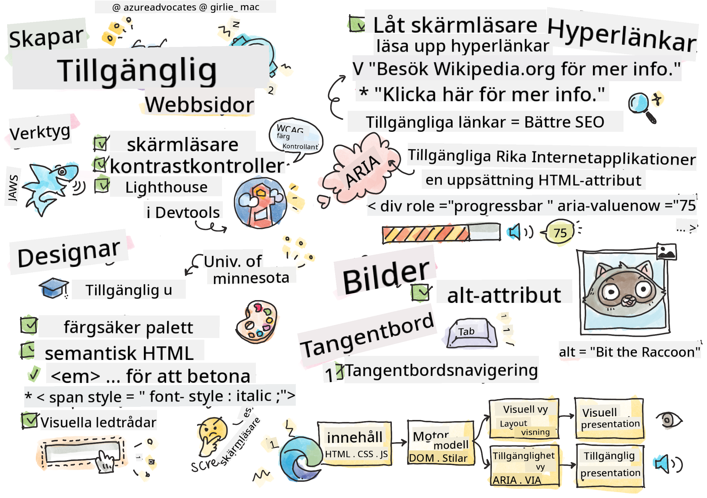
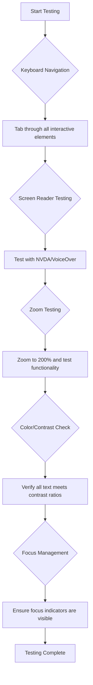
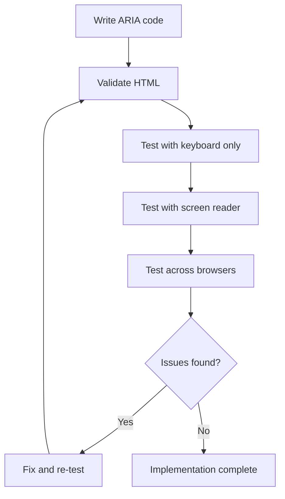

<!--
CO_OP_TRANSLATOR_METADATA:
{
  "original_hash": "90b19cde5b79b29e91babd3138cd8035",
  "translation_date": "2025-10-23T21:31:17+00:00",
  "source_file": "1-getting-started-lessons/3-accessibility/README.md",
  "language_code": "sv"
}
-->
# Skapa tillgängliga webbsidor


> Sketchnote av [Tomomi Imura](https://twitter.com/girlie_mac)

## Quiz före föreläsningen
[Quiz före föreläsningen](https://ff-quizzes.netlify.app/web/)

> Webben är kraftfull tack vare sin universalitet. Tillgång för alla, oavsett funktionsnedsättning, är en grundläggande aspekt.
>
> \- Sir Timothy Berners-Lee, W3C-direktör och uppfinnare av World Wide Web

Här är något som kanske överraskar dig: när du bygger tillgängliga webbplatser hjälper du inte bara personer med funktionsnedsättningar – du gör faktiskt webben bättre för alla!

Har du någonsin lagt märke till de små ramperna vid gatuhörn? De var ursprungligen designade för rullstolar, men nu hjälper de även personer med barnvagnar, budbärare med vagnar, resenärer med rullväskor och cyklister. Det är precis så tillgänglig webbdesign fungerar – lösningar som hjälper en grupp gynnar ofta alla. Ganska häftigt, eller hur?

I den här lektionen ska vi utforska hur man skapar webbplatser som verkligen fungerar för alla, oavsett hur de surfar på webben. Du kommer att upptäcka praktiska tekniker som redan är inbyggda i webbstandarder, få praktisk erfarenhet av testverktyg och se hur tillgänglighet gör dina webbplatser mer användarvänliga för alla.

I slutet av den här lektionen kommer du att ha självförtroendet att göra tillgänglighet till en naturlig del av din utvecklingsprocess. Är du redo att utforska hur genomtänkta designval kan öppna upp webben för miljarder användare? Låt oss sätta igång!

> Du kan ta den här lektionen på [Microsoft Learn](https://docs.microsoft.com/learn/modules/web-development-101/accessibility/?WT.mc_id=academic-77807-sagibbon)!

## Förstå hjälpmedelstekniker

Innan vi börjar koda, låt oss ta en stund att förstå hur personer med olika förmågor faktiskt upplever webben. Det här är inte bara teori – att förstå dessa verkliga navigationsmönster kommer att göra dig till en mycket bättre utvecklare!

Hjälpmedelstekniker är fantastiska verktyg som hjälper personer med funktionsnedsättningar att interagera med webbplatser på sätt som kan överraska dig. När du väl får grepp om hur dessa tekniker fungerar blir det mycket mer intuitivt att skapa tillgängliga webbupplevelser. Det är som att lära sig se din kod genom någon annans ögon.

### Skärmläsare

[Skärmläsare](https://en.wikipedia.org/wiki/Screen_reader) är ganska sofistikerade teknologier som omvandlar digital text till tal eller punktskrift. Även om de främst används av personer med synnedsättningar, är de också mycket hjälpsamma för användare med inlärningssvårigheter som dyslexi.

Jag gillar att tänka på en skärmläsare som en riktigt smart berättare som läser en bok för dig. Den läser innehåll högt i en logisk ordning, meddelar interaktiva element som "knapp" eller "länk" och ger tangentbordsgenvägar för att navigera på en sida. Men här är grejen – skärmläsare kan bara göra sitt jobb om vi bygger webbplatser med rätt struktur och meningsfullt innehåll. Det är där du som utvecklare kommer in!

**Populära skärmläsare på olika plattformar:**
- **Windows**: [NVDA](https://www.nvaccess.org/about-nvda/) (gratis och mest populär), [JAWS](https://webaim.org/articles/jaws/), [Narrator](https://support.microsoft.com/windows/complete-guide-to-narrator-e4397a0d-ef4f-b386-d8ae-c172f109bdb1/?WT.mc_id=academic-77807-sagibbon) (inbyggd)
- **macOS/iOS**: [VoiceOver](https://support.apple.com/guide/voiceover/welcome/10) (inbyggd och mycket kapabel)
- **Android**: [TalkBack](https://support.google.com/accessibility/android/answer/6283677) (inbyggd)
- **Linux**: [Orca](https://wiki.gnome.org/Projects/Orca) (gratis och öppen källkod)

**Hur skärmläsare navigerar webb-innehåll:**

Skärmläsare erbjuder flera navigationsmetoder som gör surfandet effektivt för erfarna användare:
- **Sekventiell läsning**: Läser innehåll från toppen till botten, som att följa en bok
- **Landmärkesnavigering**: Hoppa mellan sidans sektioner (huvud, navigering, huvuddel, sidfot)
- **Rubriknavigering**: Hoppa mellan rubriker för att förstå sidans struktur
- **Länklistor**: Generera en lista över alla länkar för snabb åtkomst
- **Formulärkontroller**: Navigera direkt mellan inmatningsfält och knappar

> 💡 **Här är något som förvånade mig**: 68% av skärmläsaranvändare navigerar främst via rubriker ([WebAIM-undersökning](https://webaim.org/projects/screenreadersurvey9/#finding)). Det betyder att din rubrikstruktur är som en karta för användare – när du gör det rätt hjälper du bokstavligen människor att hitta runt i ditt innehåll snabbare!

### Bygga din testprocess

Här är några goda nyheter – effektiv tillgänglighetstestning behöver inte vara överväldigande! Du vill kombinera automatiska verktyg (de är fantastiska på att hitta uppenbara problem) med lite praktisk testning. Här är en systematisk metod som jag har funnit fångar de flesta problemen utan att ta upp hela din dag:

**Grundläggande manuell testprocess:**



**Steg-för-steg testchecklista:**
1. **Tangentbordsnavigering**: Använd endast Tab, Shift+Tab, Enter, Space och piltangenter
2. **Skärmläsartestning**: Aktivera NVDA, VoiceOver eller Narrator och navigera med ögonen stängda
3. **Zoomtestning**: Testa vid 200% och 400% zoomnivåer
4. **Färgkontrastverifiering**: Kontrollera all text och UI-komponenter
5. **Fokusindikator-testning**: Säkerställ att alla interaktiva element har synliga fokuslägen

✅ **Börja med Lighthouse**: Öppna din webbläsares DevTools, kör en Lighthouse-tillgänglighetsgranskning och använd resultaten för att fokusera på områden för manuell testning.

### Zoom- och förstoringstekniker

Du vet hur du ibland zoomar in på din telefon när texten är för liten, eller kisar mot din datorskärm i starkt solljus? Många användare förlitar sig på förstoringstekniker för att göra innehåll läsbart varje dag. Detta inkluderar personer med nedsatt syn, äldre vuxna och alla som någonsin försökt läsa en webbplats utomhus.

Moderna zoomteknologier har utvecklats bortom att bara göra saker större. Att förstå hur dessa verktyg fungerar hjälper dig att skapa responsiva designer som förblir funktionella och attraktiva på alla förstorningsnivåer.

**Moderna webbläsarens zoomfunktioner:**
- **Sidzoom**: Skalar allt innehåll proportionellt (text, bilder, layout) – detta är den föredragna metoden
- **Endast textzoom**: Ökar teckenstorleken medan den ursprungliga layouten bibehålls
- **Pinch-to-zoom**: Mobilgeststöd för tillfällig förstoring
- **Webbläsarstöd**: Alla moderna webbläsare stödjer zoom upp till 500% utan att bryta funktionaliteten

**Specialiserad förstoring mjukvara:**
- **Windows**: [Förstoringsglas](https://support.microsoft.com/windows/use-magnifier-to-make-things-on-the-screen-easier-to-see-414948ba-8b1c-d3bd-8615-0e5e32204198) (inbyggd), [ZoomText](https://www.freedomscientific.com/training/zoomtext/getting-started/)
- **macOS/iOS**: [Zoom](https://www.apple.com/accessibility/mac/vision/) (inbyggd med avancerade funktioner)

> ⚠️ **Designövervägande**: WCAG kräver att innehåll förblir funktionellt när det zoomas till 200%. På denna nivå bör horisontell rullning vara minimal och alla interaktiva element bör förbli tillgängliga.

✅ **Testa din responsiva design**: Zooma din webbläsare till 200% och 400%. Anpassar sig din layout smidigt? Kan du fortfarande komma åt all funktionalitet utan överdriven rullning?

## Moderna tillgänglighetstestverktyg

Nu när du förstår hur människor navigerar på webben med hjälpmedelstekniker, låt oss utforska verktygen som hjälper dig att bygga och testa tillgängliga webbplatser.

Tänk på det så här: automatiska verktyg är bra på att hitta uppenbara problem (som saknad alt-text), medan praktisk testning hjälper dig att säkerställa att din webbplats känns bra att använda i verkligheten. Tillsammans ger de dig självförtroendet att dina webbplatser fungerar för alla.

### Testning av färgkontrast

Här är några goda nyheter: färgkontrast är ett av de vanligaste tillgänglighetsproblemen, men det är också ett av de enklaste att åtgärda. Bra kontrast gynnar alla – från användare med synnedsättningar till personer som försöker läsa sina telefoner på stranden.

**WCAG-kontrastkrav:**

| Texttyp | WCAG AA (Minimi) | WCAG AAA (Förbättrad) |
|---------|------------------|-----------------------|
| **Normal text** (under 18pt) | 4.5:1 kontrastförhållande | 7:1 kontrastförhållande |
| **Stor text** (18pt+ eller 14pt+ fetstil) | 3:1 kontrastförhållande | 4.5:1 kontrastförhållande |
| **UI-komponenter** (knappar, formulärramar) | 3:1 kontrastförhållande | 3:1 kontrastförhållande |

**Viktiga testverktyg:**
- [Colour Contrast Analyser](https://www.tpgi.com/color-contrast-checker/) - Desktop-app med färgväljare
- [WebAIM Contrast Checker](https://webaim.org/resources/contrastchecker/) - Webbaserad med omedelbar feedback
- [Stark](https://www.getstark.co/) - Designverktygsplugin för Figma, Sketch, Adobe XD
- [Accessible Colors](https://accessible-colors.com/) - Hitta tillgängliga färgpaletter

✅ **Bygg bättre färgpaletter**: Börja med dina varumärkesfärger och använd kontrastkontroller för att skapa tillgängliga variationer. Dokumentera dessa som tillgängliga färgkoder i ditt designsystem.

### Omfattande tillgänglighetsgranskning

Den mest effektiva tillgänglighetstestningen kombinerar flera metoder. Inget enskilt verktyg fångar allt, så att bygga en testprocess med olika metoder säkerställer en grundlig granskning.

**Webbläsarbaserad testning (inbyggd i DevTools):**
- **Chrome/Edge**: Lighthouse tillgänglighetsgranskning + Tillgänglighetspanel
- **Firefox**: Tillgänglighetsinspektör med detaljerad trädvy
- **Safari**: Granskningsflik i Web Inspector med VoiceOver-simulering

**Professionella testtillägg:**
- [axe DevTools](https://www.deque.com/axe/devtools/) - Branschstandard för automatiserad testning
- [WAVE](https://wave.webaim.org/extension/) - Visuell feedback med felmarkering
- [Accessibility Insights](https://accessibilityinsights.io/) - Microsofts omfattande testsvit

**Kommandorad och CI/CD-integration:**
- [axe-core](https://github.com/dequelabs/axe-core) - JavaScript-bibliotek för automatiserad testning
- [Pa11y](https://pa11y.org/) - Kommandoradsverktyg för tillgänglighetstestning
- [Lighthouse CI](https://github.com/GoogleChrome/lighthouse-ci) - Automatiserad tillgänglighetspoäng

> 🎯 **Testmål**: Sikta på en Lighthouse-tillgänglighetspoäng på 95+ som din baslinje. Kom ihåg att automatiska verktyg bara fångar cirka 30-40% av tillgänglighetsproblemen – manuell testning är fortfarande avgörande!

## Bygga tillgänglighet från grunden

Nyckeln till framgång med tillgänglighet är att bygga in det i grunden från dag ett. Jag vet att det kan vara frestande att tänka "Jag lägger till tillgänglighet senare", men det är som att försöka lägga till en ramp till ett hus efter att det redan är byggt. Möjligt? Ja. Lätt? Inte direkt.

Tänk på tillgänglighet som att planera ett hus – det är mycket enklare att inkludera rullstolstillgänglighet i dina ursprungliga arkitektoniska planer än att eftermontera allt senare.

### Principerna POUR: Din tillgänglighetsgrund

Web Content Accessibility Guidelines (WCAG) är uppbyggda kring fyra grundläggande principer som bildar akronymen POUR. Oroa dig inte – det här är inte torra akademiska begrepp! De är faktiskt praktiska riktlinjer för att skapa innehåll som fungerar för alla.

När du väl får grepp om POUR blir det mycket mer intuitivt att fatta tillgänglighetsbeslut. Det är som att ha en mental checklista som vägleder dina designval. Låt oss bryta ner det:

**🔍 Uppfattbart**: Information måste presenteras på sätt som användare kan uppfatta med sina tillgängliga sinnen

- Tillhandahåll textalternativ för icke-textinnehåll (bilder, videor, ljud)
- Säkerställ tillräcklig färgkontrast för all text och UI-komponenter
- Erbjud undertexter och transkriptioner för multimedia
- Designa innehåll som förblir funktionellt när det förstoras upp till 200%
- Använd flera sensoriska egenskaper (inte bara färg) för att förmedla information

**🎮 Opererbart**: Alla gränssnittskomponenter måste vara opererbara via tillgängliga inmatningsmetoder

- Gör all funktionalitet tillgänglig via tangentbordsnavigering
- Ge användare tillräckligt med tid att läsa och interagera med innehåll
- Undvik innehåll som orsakar anfall eller vestibulära störningar
- Hjälp användare att navigera effektivt med tydlig struktur och landmärken
- Säkerställ att interaktiva element har tillräckliga målstorlekar (minst 44px)

**📖 Förståeligt**: Information och UI-funktioner måste vara tydliga och begripliga

- Använd tydligt, enkelt språk som är lämpligt för din målgrupp
- Säkerställ att innehåll visas och fungerar på förutsägbara, konsekventa sätt
- Ge tydliga instruktioner och felmeddelanden för användarinmatning
- Hjälp användare att förstå och korrigera misstag i formulär
- Organisera innehåll med logisk läsordning och informationshierarki

**💪 Robust**: Innehåll måste fungera pålitligt över olika teknologier och hjälpmedel

- Använd giltig, semantisk HTML som grund
- Säkerställ kompatibilitet med nuvarande och framtida hjälpmedelstekniker
- Följ webbstandarder och bästa praxis för markup
- Testa på olika webbläsare, enheter och hjälpmedel
- Strukturera innehåll så att det degraderas smidigt när avancerade funktioner inte stöds

## Skapa tillgänglig visuell design

Bra visuell design och tillgänglighet går hand i hand. När du designar med tillgänglighet i åtanke upptäcker du ofta att dessa begränsningar leder till renare, mer eleganta lösningar som gynnar alla användare.

Låt oss utforska hur man skapar visuellt tilltalande designer som fungerar för alla, oavsett deras visuella förmågor eller de förhållanden under vilka de ser ditt innehåll.

### Färg- och visuella tillgänglighetsstrategier
Färg är ett kraftfullt verktyg för kommunikation, men det bör aldrig vara det enda sättet att förmedla viktig information. Att designa bortom färg skapar mer robusta och inkluderande upplevelser som fungerar i fler situationer.

**Designa för färgseendedifferenser:**

Ungefär 8 % av män och 0,5 % av kvinnor har någon form av färgseendedifferens (ofta kallat "färgblindhet"). De vanligaste typerna är:
- **Deuteranopi**: Svårigheter att skilja mellan rött och grönt
- **Protanopi**: Rött framstår som mer dämpat
- **Tritanopi**: Svårigheter med blått och gult (sällsynt)

**Inkluderande färgstrategier:**

```css
/* ❌ Bad: Using only color to indicate status */
.error { color: red; }
.success { color: green; }

/* ✅ Good: Color plus icons and context */
.error {
  color: #d32f2f;
  border-left: 4px solid #d32f2f;
}
.error::before {
  content: "⚠️";
  margin-right: 8px;
}

.success {
  color: #2e7d32;
  border-left: 4px solid #2e7d32;
}
.success::before {
  content: "✅";
  margin-right: 8px;
}
```

**Utöver grundläggande kontrastkrav:**
- Testa dina färgval med simulatorer för färgblindhet
- Använd mönster, texturer eller former tillsammans med färgkodning
- Säkerställ att interaktiva tillstånd är urskiljbara utan färg
- Tänk på hur din design ser ut i högkontrastläge

✅ **Testa din färgtillgänglighet**: Använd verktyg som [Coblis](https://www.color-blindness.com/coblis-color-blindness-simulator/) för att se hur din webbplats ser ut för användare med olika typer av färgseende.

### Fokusindikatorer och interaktionsdesign

Fokusindikatorer är den digitala motsvarigheten till en markör – de visar tangentbordsanvändare var de befinner sig på sidan. Välutformade fokusindikatorer förbättrar upplevelsen för alla genom att göra interaktioner tydliga och förutsägbara.

**Moderna bästa praxis för fokusindikatorer:**

```css
/* Enhanced focus styles that work across browsers */
button:focus-visible {
  outline: 2px solid #0066cc;
  outline-offset: 2px;
  box-shadow: 0 0 0 4px rgba(0, 102, 204, 0.25);
}

/* Remove focus outline for mouse users, preserve for keyboard users */
button:focus:not(:focus-visible) {
  outline: none;
}

/* Focus-within for complex components */
.card:focus-within {
  box-shadow: 0 0 0 3px rgba(74, 144, 164, 0.5);
  border-color: #4A90A4;
}

/* Ensure focus indicators meet contrast requirements */
.custom-focus:focus-visible {
  outline: 3px solid #ffffff;
  outline-offset: 2px;
  box-shadow: 0 0 0 6px #000000;
}
```

**Krav för fokusindikatorer:**
- **Synlighet**: Måste ha minst 3:1 kontrastförhållande med omgivande element
- **Bredd**: Minst 2px tjocklek runt hela elementet
- **Beständighet**: Bör förbli synlig tills fokus flyttas någon annanstans
- **Distinktion**: Måste vara visuellt annorlunda från andra UI-tillstånd

> 💡 **Designtips**: Bra fokusindikatorer använder ofta en kombination av kontur, box-shadow och färgförändringar för att säkerställa synlighet över olika bakgrunder och sammanhang.

✅ **Granska fokusindikatorer**: Tabba genom din webbplats och notera vilka element som har tydliga fokusindikatorer. Är några svåra att se eller saknas helt?

### Semantisk HTML: Grunden för tillgänglighet

Semantisk HTML är som att ge hjälpmedelsteknologier ett GPS-system för din webbplats. När du använder rätt HTML-element för deras avsedda syfte, ger du i princip skärmläsare, tangentbord och andra verktyg en detaljerad karta för att hjälpa användare att navigera effektivt.

Här är en analogi som verkligen klickade för mig: semantisk HTML är skillnaden mellan ett välorganiserat bibliotek med tydliga kategorier och hjälpsamma skyltar jämfört med ett lager där böcker är spridda slumpmässigt. Båda platserna har samma böcker, men vilken skulle du föredra att försöka hitta något i? Precis!

**Byggstenar för en tillgänglig sidstruktur:**

```html
<!-- Landmark elements provide page navigation structure -->
<header>
  <h1>Your Site Name</h1>
  <nav aria-label="Main navigation">
    <ul>
      <li><a href="/home">Home</a></li>
      <li><a href="/about">About</a></li>
      <li><a href="/services">Services</a></li>
    </ul>
  </nav>
</header>

<main>
  <article>
    <header>
      <h1>Article Title</h1>
      <p>Published on <time datetime="2024-10-14">October 14, 2024</time></p>
    </header>
    
    <section>
      <h2>First Section</h2>
      <p>Content that relates to this section...</p>
    </section>
    
    <section>
      <h2>Second Section</h2>
      <p>More related content...</p>
    </section>
  </article>
  
  <aside>
    <h2>Related Links</h2>
    <nav aria-label="Related articles">
      <ul>
        <li><a href="/related-1">First related article</a></li>
        <li><a href="/related-2">Second related article</a></li>
      </ul>
    </nav>
  </aside>
</main>

<footer>
  <p>&copy; 2024 Your Site Name. All rights reserved.</p>
  <nav aria-label="Footer links">
    <ul>
      <li><a href="/privacy">Privacy Policy</a></li>
      <li><a href="/contact">Contact Us</a></li>
    </ul>
  </nav>
</footer>
```

**Varför semantisk HTML förbättrar tillgänglighet:**

| Semantiskt element | Syfte | Fördel för skärmläsare |
|--------------------|-------|------------------------|
| `<header>` | Sid- eller avsnittshuvud | "Bannerlandmärke" - snabb navigering till toppen |
| `<nav>` | Navigeringslänkar | "Navigeringslandmärke" - lista över navigeringssektioner |
| `<main>` | Primärt sidinnehåll | "Huvudlandmärke" - hoppa direkt till innehållet |
| `<article>` | Självständigt innehåll | Meddelar artikelgränser |
| `<section>` | Tematiska innehållsgrupper | Ger innehållsstruktur |
| `<aside>` | Relaterat sidoinnehåll | "Komplementärt landmärke" |
| `<footer>` | Sid- eller avsnittsfot | "Innehållsinfolandmärke" |

**Skärmläsarens superkrafter med semantisk HTML:**
- **Landmärkesnavigering**: Hoppa mellan större sidsektioner direkt
- **Rubriköversikter**: Skapa en innehållsförteckning från din rubrikstruktur
- **Elementlistor**: Skapa listor över alla länkar, knappar eller formulärkontroller
- **Kontextmedvetenhet**: Förstå relationer mellan innehållssektioner

> 🎯 **Snabbtest**: Försök navigera på din webbplats med en skärmläsare med hjälp av landmärkesgenvägar (D för landmärke, H för rubrik, K för länk i NVDA/JAWS). Är navigeringen logisk?

✅ **Granska din semantiska struktur**: Använd tillgänglighetspanelen i din webbläsares utvecklarverktyg för att visa tillgänglighetsträdet och säkerställ att din markup skapar en logisk struktur.

### Rubrikhierarki: Skapa en logisk innehållsöversikt

Rubriker är helt avgörande för tillgängligt innehåll – de är som ryggraden som håller allt samman. Skärmläsaranvändare förlitar sig starkt på rubriker för att förstå och navigera i ditt innehåll. Tänk på det som att tillhandahålla en innehållsförteckning för din sida.

**Här är den gyllene regeln för rubriker:**
Hoppa aldrig över nivåer. Gå alltid logiskt från `<h1>` till `<h2>` till `<h3>` och så vidare. Kommer du ihåg hur man gjorde dispositioner i skolan? Det är exakt samma princip – du skulle inte hoppa från "I. Huvudpunkt" direkt till "C. Under-underpunkt" utan en "A. Underpunkt" däremellan, eller hur?

**Exempel på perfekt rubrikstruktur:**

```html
<!-- ✅ Excellent: Logical, hierarchical progression -->
<main>
  <h1>Complete Guide to Web Accessibility</h1>
  
  <section>
    <h2>Understanding Screen Readers</h2>
    <p>Introduction to screen reader technology...</p>
    
    <h3>Popular Screen Reader Software</h3>
    <p>NVDA, JAWS, and VoiceOver comparison...</p>
    
    <h3>Testing with Screen Readers</h3>
    <p>Step-by-step testing instructions...</p>
  </section>
  
  <section>
    <h2>Color and Contrast Guidelines</h2>
    <p>Designing with sufficient contrast...</p>
    
    <h3>WCAG Contrast Requirements</h3>
    <p>Understanding the different contrast levels...</p>
    
    <h3>Testing Tools and Techniques</h3>
    <p>Tools for verifying contrast ratios...</p>
  </section>
</main>
```

```html
<!-- ❌ Problematic: Skipping levels, inconsistent structure -->
<h1>Page Title</h1>
<h3>Subsection</h3> <!-- Skipped h2 -->
<h2>This should come before h3</h2>
<h1>Another main heading?</h1> <!-- Multiple h1s -->
```

**Bästa praxis för rubriker:**
- **En `<h1>` per sida**: Vanligtvis din huvudsakliga sidtitel eller primära innehållsrubrik
- **Logisk progression**: Hoppa aldrig över nivåer (h1 → h2 → h3, inte h1 → h3)
- **Beskrivande innehåll**: Gör rubriker meningsfulla även när de läses ur sitt sammanhang
- **Visuell styling med CSS**: Använd CSS för utseende, HTML-nivåer för struktur

**Statistik för skärmläsarnavigering:**
- 68 % av skärmläsaranvändare navigerar med hjälp av rubriker ([WebAIM-undersökning](https://webaim.org/projects/screenreadersurvey9/#finding))
- Användare förväntar sig att hitta en logisk rubriköversikt
- Rubriker ger det snabbaste sättet att förstå sidans struktur

> 💡 **Proffstips**: Använd webbläsartillägg som "HeadingsMap" för att visualisera din rubrikstruktur. Den bör läsas som en välorganiserad innehållsförteckning.

✅ **Testa din rubrikstruktur**: Använd en skärmläsares rubriknavigering (H-tangenten i NVDA) för att hoppa mellan dina rubriker. Berättar progressionen logiskt om ditt innehåll?

### Avancerade tekniker för visuell tillgänglighet

Utöver grundläggande kontrast och färg finns det sofistikerade tekniker som hjälper till att skapa verkligt inkluderande visuella upplevelser. Dessa metoder säkerställer att ditt innehåll fungerar i olika visningsförhållanden och med hjälpmedelsteknologier.

**Viktiga strategier för visuell kommunikation:**

- **Multimodal feedback**: Kombinera visuella, textuella och ibland ljudbaserade ledtrådar
- **Progressiv avslöjning**: Presentera information i hanterbara delar
- **Konsekventa interaktionsmönster**: Använd välbekanta UI-konventioner
- **Responsiv typografi**: Anpassa textstorlek för olika enheter
- **Laddnings- och felmeddelanden**: Ge tydlig feedback för alla användaråtgärder

**CSS-verktyg för förbättrad tillgänglighet:**

```css
/* Screen reader only text - visually hidden but accessible */
.sr-only {
  position: absolute;
  width: 1px;
  height: 1px;
  padding: 0;
  margin: -1px;
  overflow: hidden;
  clip: rect(0, 0, 0, 0);
  white-space: nowrap;
  border: 0;
}

/* Skip link for keyboard navigation */
.skip-link {
  position: absolute;
  top: -40px;
  left: 6px;
  background: #000000;
  color: #ffffff;
  padding: 8px 16px;
  text-decoration: none;
  border-radius: 4px;
  font-weight: bold;
  transition: top 0.3s ease;
  z-index: 1000;
}

.skip-link:focus {
  top: 6px;
}

/* Reduced motion respect */
@media (prefers-reduced-motion: reduce) {
  .skip-link {
    transition: none;
  }
  
  * {
    animation-duration: 0.01ms !important;
    animation-iteration-count: 1 !important;
    transition-duration: 0.01ms !important;
  }
}

/* High contrast mode support */
@media (prefers-contrast: high) {
  .button {
    border: 2px solid;
  }
}
```

> 🎯 **Tillgänglighetsmönster**: "Hoppa till innehåll"-länken är viktig för tangentbordsanvändare. Den bör vara det första fokuserbara elementet på din sida och hoppa direkt till huvudinnehållet.

✅ **Implementera navigering**: Lägg till "hoppa till innehåll"-länkar på dina sidor och testa dem genom att trycka på Tab så snart sidan laddas. De bör visas och låta dig hoppa till huvudinnehållet.

## Skapa meningsfull länktext

Länkar är i princip webben motorvägar, men dåligt skriven länktext är som att ha vägskyltar som bara säger "Plats" istället för "Centrala Stockholm." Inte särskilt hjälpsamt, eller hur?

Här är något som verkligen fascinerade mig när jag först lärde mig det: skärmläsare kan extrahera alla länkar från en sida och visa dem som en stor lista. Tänk dig att någon ger dig en katalog över varje länk på din sida. Skulle varje länk vara begriplig på egen hand? Det är testet din länktext måste klara!

### Förstå navigeringsmönster för länkar

Skärmläsare erbjuder kraftfulla navigeringsfunktioner för länkar som bygger på välskriven länktext:

**Navigeringsmetoder för länkar:**
- **Sekventiell läsning**: Länkar läses i sitt sammanhang som en del av innehållsflödet
- **Generering av länklistor**: Alla sidlänkar sammanställs till en sökbar katalog
- **Snabbnavigering**: Hoppa mellan länkar med hjälp av tangentbordsgenvägar (K i NVDA)
- **Sökfunktion**: Hitta specifika länkar genom att skriva in delar av texten

**Varför kontext är viktigt:**
När skärmläsaranvändare genererar en länklista ser de något i stil med detta:
- "Ladda ner rapport"
- "Läs mer"
- "Klicka här"
- "Integritetspolicy"
- "Klicka här"

Endast två av dessa länkar ger användbar information när de läses ur sitt sammanhang!

> 📊 **Användarpåverkan**: Skärmläsaranvändare skannar länklistor för att snabbt förstå sidans innehåll. Generisk länktext tvingar dem att navigera tillbaka till varje länks kontext, vilket avsevärt saktar ner deras surfupplevelse.

### Vanliga misstag med länktext att undvika

Att förstå vad som inte fungerar hjälper dig att identifiera och åtgärda tillgänglighetsproblem i befintligt innehåll.

**❌ Generisk länktext som inte ger någon kontext:**

```html
<!-- Meaningless when read from a link list -->
<p>Our sustainability efforts are detailed in our recent report. 
   <a href="/sustainability-2024.pdf">Click here</a> to view it.</p>

<!-- Repeated generic text throughout the page -->
<div class="article-card">
  <h3>Web Accessibility Guide</h3>
  <p>Learn the fundamentals...</p>
  <a href="/accessibility-guide">Read more</a>
</div>
<div class="article-card">
  <h3>Color Contrast Tips</h3>
  <p>Improve your design...</p>
  <a href="/color-contrast">Read more</a>
</div>

<!-- URLs as link text (difficult for screen readers to announce) -->
<p>Visit https://www.w3.org/WAI/WCAG21/quickref/ for WCAG guidelines.</p>

<!-- Vague action words -->
<a href="/contact">Go</a> | <a href="/about">See</a> | <a href="/help">View</a>
```

**Varför dessa mönster misslyckas:**
- **"Klicka här"** säger ingenting om destinationen
- **"Läs mer"** som upprepas flera gånger skapar förvirring
- **Råa URL:er** är svåra för skärmläsare att uttala tydligt
- **Enstaka ord** som "Gå" eller "Se" saknar beskrivande kontext

### Skriva utmärkt länktext

Beskrivande länktext gynnar alla – synliga användare kan snabbt skanna länkar, och skärmläsaranvändare förstår destinationer direkt.

**✅ Exempel på tydlig, beskrivande länktext:**

```html
<!-- Descriptive text that explains the destination -->
<p>Our comprehensive <a href="/sustainability-2024.pdf">2024 sustainability report (PDF, 2.1MB)</a> details our environmental initiatives.</p>

<!-- Specific, unique link text for each card -->
<div class="article-card">
  <h3>Web Accessibility Guide</h3>
  <p>Learn the fundamentals of inclusive design...</p>
  <a href="/accessibility-guide">Read our complete web accessibility guide</a>
</div>
<div class="article-card">
  <h3>Color Contrast Tips</h3>
  <p>Improve your design with better color choices...</p>
  <a href="/color-contrast">Explore color contrast best practices</a>
</div>

<!-- Meaningful text instead of raw URLs -->
<p>The <a href="https://www.w3.org/WAI/WCAG21/quickref/">WCAG 2.1 Quick Reference guide</a> provides comprehensive accessibility guidelines.</p>

<!-- Descriptive action links -->
<a href="/contact">Contact our support team</a> | 
<a href="/about">About our company</a> | 
<a href="/help">Get help with your account</a>
```

**Bästa praxis för länktext:**
- **Var specifik**: "Ladda ner kvartalsrapporten" vs. "Ladda ner"
- **Inkludera filtyp och storlek**: "(PDF, 1,2 MB)" för nedladdningsbara filer
- **Nämn om länkar öppnas externt**: "(öppnas i nytt fönster)" när det är lämpligt
- **Använd aktivt språk**: "Kontakta oss" vs. "Kontaktsida"
- **Håll det kortfattat**: Sikta på 2–8 ord när det är möjligt

### Avancerade tillgänglighetsmönster för länkar

Ibland kräver visuella designbegränsningar eller tekniska krav speciella lösningar. Här är sofistikerade tekniker för vanliga utmanande scenarier:

**Använda ARIA för förbättrad kontext:**

```html
<!-- When button text must be short but needs more context -->
<a href="/report.pdf" 
   aria-label="Download 2024 annual financial report, PDF format, 2.3MB">
  Download Report
</a>

<!-- When the full context comes from surrounding content -->
<h3 id="sustainability-heading">Sustainability Initiative</h3>
<p>Our efforts to reduce environmental impact...</p>
<a href="/sustainability-details" 
   aria-labelledby="sustainability-heading"
   aria-describedby="sustainability-summary">
  Learn more
</a>
<p id="sustainability-summary">Detailed breakdown of our 2024 environmental goals and achievements</p>
```

**Indikera filtyper och externa destinationer:**

```html
<!-- Method 1: Include information in visible link text -->
<a href="/annual-report.pdf">
  Download our 2024 annual report (PDF, 2.3MB)
</a>

<!-- Method 2: Use screen reader-only text for file details -->
<a href="/annual-report.pdf">
  Download our 2024 annual report
  <span class="sr-only">(PDF format, 2.3MB)</span>
</a>

<!-- Method 3: External link indication -->
<a href="https://example.com" 
   target="_blank" 
   aria-describedby="external-link-warning">
  Visit external resource
</a>
<span id="external-link-warning" class="sr-only">
  (opens in new window)
</span>

<!-- Method 4: Using CSS for visual indicators -->
<a href="https://example.com" class="external-link">
  External resource
</a>
```

```css
/* Visual indicator for external links */
.external-link::after {
  content: " ↗";
  font-size: 0.8em;
  color: #666;
}

/* Screen reader announcement for external links */
.external-link::before {
  content: "External link: ";
  position: absolute;
  left: -10000px;
  width: 1px;
  height: 1px;
  overflow: hidden;
}
```

> ⚠️ **Viktigt**: När du använder `target="_blank"`, informera alltid användare om att länken öppnas i ett nytt fönster eller flik. Oväntade navigeringsändringar kan vara förvirrande.

✅ **Testa din länktext**: Använd din webbläsares utvecklarverktyg för att generera en lista över alla länkar på din sida. Kan du förstå varje länks syfte utan någon omgivande kontext?

## ARIA: Superladdning av HTML-tillgänglighet

[Accessible Rich Internet Applications (ARIA)](https://developer.mozilla.org/docs/Web/Accessibility/ARIA) är som att ha en universell översättare mellan dina komplexa webbapplikationer och hjälpmedelsteknologier. När HTML ensam inte kan uttrycka allt som dina interaktiva komponenter gör, kliver ARIA in för att fylla dessa luckor.

Jag gillar att tänka på ARIA som att lägga till hjälpsamma kommentarer till din HTML – ungefär som scenanvisningar i ett manus som hjälper skådespelare att förstå sina roller och relationer.

**Här är den viktigaste regeln om ARIA**: Använd alltid semantisk HTML först, och lägg sedan till ARIA för att förbättra den. Tänk på ARIA som kryddan, inte huvudrätten. Det ska förtydliga och förbättra din HTML-struktur, aldrig ersätta den. Få den grunden rätt först!

### Strategisk implementering av ARIA

ARIA är kraftfullt, men med stor kraft kommer stort ansvar. Felaktig användning av ARIA kan göra tillgängligheten sämre än ingen ARIA alls. Här är när och hur du använder det effektivt:

**✅ Använd ARIA när:**
- Du skapar anpassade interaktiva widgets (dragspel, flikar, karuseller)
- Du bygger dynamiskt innehåll som ändras utan sidladdning
- Du tillhandahåller ytterligare kontext för komplexa UI-relationer
- Du indikerar laddningstillstånd eller live-innehållsuppdateringar
- Du skapar app-liknande gränssnitt med anpassade kontroller

**❌ Undvik ARIA när:**
- Standard HTML-element redan tillhandahåller den nödvändiga semantiken
- Du är osäker på hur du implementerar det korrekt
- Det duplicerar information som redan tillhandahålls av semantisk HTML
- Du har inte testat med faktiska hjälpmedelsteknologier

> 🎯 **ARIA Gyllene Regel**: "Ändra inte semantiken om du inte absolut måste, säkerställ alltid tangentbordstillgänglighet och testa med verkliga hjälpmedelsteknologier."

**De fem kategorierna av ARIA:**

1. **Roller**: Vad är detta element? (`button`, `tab`, `dialog`)
2. **Egenskaper**: Vilka är dess funktioner? (`aria-required`, `aria-haspopup`)
3. **Tillstånd**: Vad är dess aktuella status? (`aria-expanded`, `aria-checked`)
4. **Landmärken**: Var är det i sidstrukturen? (`banner`, `navigation`, `main`)
5. **Live-regioner**: Hur ska ändringar meddelas? (`aria-live`, `aria-atomic`)

### Viktiga ARIA-mönster för moderna webbappar

Dessa mönster löser de vanligaste tillgänglighetsutmaningarna i interaktiva webbapplikationer:

**Namngivning och beskrivning av element:**

```html
<!-- aria-label: Provides accessible name when visible text isn't sufficient -->
<button aria-label="Close newsletter subscription dialog">×</button>

<!-- aria-labelledby: References existing text as the accessible name -->
<section aria-labelledby="news-heading">
  <h2 id="news-heading">Latest News</h2>
  <!-- news content -->
</section>

<!-- aria-describedby: Links to additional descriptive text -->
<input type="password" 
       aria-describedby="pwd-requirements pwd-strength"
       required>
<div id="pwd-requirements">
  Password must contain at least 8 characters, including uppercase, lowercase, and numbers.
</div>
<div id="pwd-strength" aria-live="polite">
  <!-- Dynamic password strength indicator -->
</div>
```

**Live-regioner för dynamiskt innehåll:**

```html
<!-- Polite announcements (don't interrupt current speech) -->
<div aria-live="polite" id="status-updates">
  <!-- Status messages appear here -->
</div>

<!-- Assertive announcements (interrupt and announce immediately) -->
<div aria-live="assertive" id="urgent-alerts">
  <!-- Error messages and critical alerts -->
</div>

<!-- Loading states with live regions -->
<button id="submit-btn" aria-describedby="loading-status">
  Submit Application
</button>
<div id="loading-status" aria-live="polite" aria-atomic="true">
  <!-- "Processing your application..." appears here -->
</div>
```

**Exempel på interaktiv widget (dragspel):**

```html
<div class="accordion">
  <h3>
    <button aria-expanded="false" 
            aria-controls="panel-1" 
            id="accordion-trigger-1"
            class="accordion-trigger">
      Accessibility Guidelines
    </button>
  </h3>
  <div id="panel-1" 
       role="region"
       aria-labelledby="accordion-trigger-1" 
       hidden>
    <p>WCAG 2.1 provides comprehensive guidelines...</p>
  </div>
</div>
```

```javascript
// JavaScript to manage accordion state
function toggleAccordion(trigger) {
  const panel = document.getElementById(trigger.getAttribute('aria-controls'));
  const isExpanded = trigger.getAttribute('aria-expanded') === 'true';
  
  // Toggle states
  trigger.setAttribute('aria-expanded', !isExpanded);
  panel.hidden = isExpanded;
  
  // Announce change to screen readers
  const status = document.getElementById('status-updates');
  status.textContent = isExpanded ? 'Section collapsed' : 'Section expanded';
}
```

### Bästa praxis för ARIA-implementering

ARIA är kraftfullt men kräver noggrann implementering. Att följa dessa riktlinjer hjälper till att säkerställa att din ARIA förbättrar snarare än hindrar tillgängligheten:

**🛡️ Grundprinciper:**

1. **Semantisk HTML först**: Föredra alltid `<button>` framför `<div role="button">`
2. **Bryt inte semantiken**: Överskriv aldrig befintlig HTML-betydelse (undvik `<h1 role="button">`)
3. **Bibehåll tangentbordstillgänglighet**: Alla interaktiva ARIA-element måste vara fullt tangentbordstillgängliga
4. **Testa med riktiga användare**: ARIA-stöd varierar avsevärt mellan hjälpmedelsteknologier
5. **Börja enkelt**: Komplexa ARIA-implementeringar har större risk för fel

**🔍 Testningsflöde:**



**🚫 Vanliga ARIA-misstag att undvika:**

- **Motstridig information**: Undvik att motsäga HTML-semantik
- **Överdriven märkning**: För mycket ARIA-information kan förvirra användare
- **Statisk ARIA**: Glömmer att uppdatera ARIA-tillstånd när innehållet ändras
- **Otestade implementeringar**: ARIA som fungerar i teorin men inte i praktiken
- **Saknad tangentbordsstöd**: ARIA-roller utan motsvarande tangentbordsinteraktioner

> 💡 **Testresurser**: Använd verktyg som [accessibility-checker](https://www.npmjs.com/package/accessibility-checker) för automatiserad ARIA-validering, men testa alltid med riktiga skärmläsare för en komplett upplevelse.

✅ **Lär dig av experter**: Studera [ARIA Authoring Practices Guide](https://w3c.github.io/aria-practices/) för beprövade mönster och implementeringar av komplexa interaktiva widgets.

## Gör bilder och media tillgängliga

Visuellt och ljudbaserat innehåll är viktiga delar av moderna webbupplevelser, men de kan skapa hinder om de inte implementeras på ett genomtänkt sätt. Målet är att säkerställa att informationen och den känslomässiga effekten av ditt media når alla användare. När du väl har fått kläm på det blir det en självklarhet.

Olika typer av media kräver olika tillgänglighetsmetoder. Det är som att laga mat—du skulle inte behandla en känslig fisk på samma sätt som en robust biff. Att förstå dessa skillnader hjälper dig att välja rätt lösning för varje situation.

### Strategisk bildtillgänglighet

Varje bild på din webbplats har ett syfte. Att förstå det syftet hjälper dig att skriva bättre alternativtext och skapa mer inkluderande upplevelser.

**De fyra typerna av bilder och deras strategier för alt-text:**

**Informativa bilder** - förmedlar viktig information:
```html

```

**Dekorativa bilder** - endast visuella utan informationsvärde:
```html

```

**Funktionella bilder** - fungerar som knappar eller kontroller:
```html
<button>
  
</button>
```

**Komplexa bilder** - diagram, grafer, infografik:
```html

<div id="chart-description">
  <p>Detailed description: Sales data shows a steady increase across all quarters...</p>
</div>
```

### Video- och ljudtillgänglighet

**Videokrav:**
- **Undertexter**: Textversion av talat innehåll och ljudeffekter
- **Ljudbeskrivningar**: Berättelse om visuella element för blinda användare
- **Transkriptioner**: Fullständig textversion av allt ljud- och visuellt innehåll

```html
<video controls>
  <source src="video.mp4" type="video/mp4">
  <track kind="captions" src="captions.vtt" srclang="en" label="English">
  <track kind="descriptions" src="descriptions.vtt" srclang="en" label="Audio descriptions">
</video>
```

**Ljudkrav:**
- **Transkriptioner**: Textversion av allt talat innehåll
- **Visuella indikatorer**: För ljudbaserat innehåll, tillhandahåll visuella ledtrådar

### Moderna bildtekniker

**Använda CSS för dekorativa bilder:**
```css
.hero-section {
  background-image: url('decorative-hero.jpg');
  /* Decorative images in CSS don't need alt text */
}
```

**Responsiva bilder med tillgänglighet:**
```html
<picture>
  <source media="(min-width: 800px)" srcset="large-chart.png">
  <source media="(min-width: 400px)" srcset="medium-chart.png">
  
</picture>
```

✅ **Testa bildtillgänglighet**: Använd en skärmläsare för att navigera på en sida med bilder. Får du tillräckligt med information för att förstå innehållet?

## Tangentbordsnavigering och fokusstyrning

Många användare navigerar på webben helt med tangentbordet. Detta inkluderar personer med motoriska funktionsnedsättningar, avancerade användare som tycker att tangentbord är snabbare än musen, och alla vars mus har slutat fungera. Att säkerställa att din webbplats fungerar bra med tangentbordsinmatning är viktigt och gör ofta din webbplats mer effektiv för alla.

### Grundläggande tangentbordsnavigeringsmönster

**Standardinteraktioner med tangentbord:**
- **Tab**: Flytta fokus framåt genom interaktiva element
- **Shift + Tab**: Flytta fokus bakåt
- **Enter**: Aktivera knappar och länkar
- **Space**: Aktivera knappar, markera kryssrutor
- **Piltangenter**: Navigera inom komponentgrupper (radioknappar, menyer)
- **Escape**: Stäng modaler, rullgardinsmenyer eller avbryt operationer

### Bästa praxis för fokusstyrning

**Synliga fokusindikatorer:**
```css
/* Ensure focus is always visible */
button:focus-visible {
  outline: 2px solid #4A90A4;
  outline-offset: 2px;
}

/* Custom focus styles for different components */
.card:focus-within {
  box-shadow: 0 0 0 3px rgba(74, 144, 164, 0.5);
}
```

**Hopplänkar för effektiv navigering:**
```html
<a href="#main-content" class="skip-link">Skip to main content</a>
<a href="#navigation" class="skip-link">Skip to navigation</a>

<nav id="navigation">
  <!-- navigation content -->
</nav>
<main id="main-content">
  <!-- main content -->
</main>
```

**Korrekt tabbordning:**
```html
<!-- Use semantic HTML for natural tab order -->
<form>
  <label for="name">Name:</label>
  <input type="text" id="name" tabindex="0">
  
  <label for="email">Email:</label>
  <input type="email" id="email" tabindex="0">
  
  <button type="submit" tabindex="0">Submit</button>
</form>
```

### Fokusfångning i modaler

När modaldialoger öppnas bör fokus vara fångat inom modalen:

```javascript
// Modern focus trap implementation
function trapFocus(element) {
  const focusableElements = element.querySelectorAll(
    'button, [href], input, select, textarea, [tabindex]:not([tabindex="-1"])'
  );
  
  const firstElement = focusableElements[0];
  const lastElement = focusableElements[focusableElements.length - 1];

  element.addEventListener('keydown', (e) => {
    if (e.key === 'Tab') {
      if (e.shiftKey && document.activeElement === firstElement) {
        e.preventDefault();
        lastElement.focus();
      } else if (!e.shiftKey && document.activeElement === lastElement) {
        e.preventDefault();
        firstElement.focus();
      }
    }
    
    if (e.key === 'Escape') {
      closeModal();
    }
  });
  
  // Focus first element when modal opens
  firstElement.focus();
}
```

✅ **Testa tangentbordsnavigering**: Försök att navigera på din webbplats med endast Tab-tangenten. Kan du nå alla interaktiva element? Är fokusordningen logisk? Är fokusindikatorerna tydligt synliga?

## Formulärens tillgänglighet

Formulär är avgörande för användarinteraktion och kräver särskild uppmärksamhet för att vara tillgängliga.

### Koppling mellan etiketter och formulärkontroller

**Varje formulärkontroll behöver en etikett:**
```html
<!-- Explicit labeling (preferred) -->
<label for="username">Username:</label>
<input type="text" id="username" name="username" required>

<!-- Implicit labeling -->
<label>
  Password:
  <input type="password" name="password" required>
</label>

<!-- Using aria-label when visual label isn't desired -->
<input type="search" aria-label="Search products" placeholder="Search...">
```

### Felhantering och validering

**Tillgängliga felmeddelanden:**
```html
<label for="email">Email Address:</label>
<input type="email" id="email" name="email" 
       aria-describedby="email-error" 
       aria-invalid="true" required>
<div id="email-error" role="alert">
  Please enter a valid email address
</div>
```

**Bästa praxis för formulärvalidering:**
- Använd `aria-invalid` för att indikera ogiltiga fält
- Tillhandahåll tydliga, specifika felmeddelanden
- Använd `role="alert"` för viktiga felmeddelanden
- Visa fel både direkt och vid formulärinlämning

### Fieldsets och gruppering

**Gruppera relaterade formulärkontroller:**
```html
<fieldset>
  <legend>Shipping Address</legend>
  <label for="street">Street Address:</label>
  <input type="text" id="street" name="street">
  
  <label for="city">City:</label>
  <input type="text" id="city" name="city">
</fieldset>

<fieldset>
  <legend>Preferred Contact Method</legend>
  <input type="radio" id="contact-email" name="contact" value="email">
  <label for="contact-email">Email</label>
  
  <input type="radio" id="contact-phone" name="contact" value="phone">
  <label for="contact-phone">Phone</label>
</fieldset>
```

## Din tillgänglighetsresa: Viktiga insikter

Grattis! Du har precis fått grundläggande kunskaper för att skapa verkligt inkluderande webbupplevelser. Det här är riktigt spännande! Webbtillgänglighet handlar inte bara om att uppfylla krav—det handlar om att förstå de olika sätt som människor interagerar med digitalt innehåll och att designa för den fantastiska komplexiteten.

Du är nu en del av en växande gemenskap av utvecklare som förstår att bra design fungerar för alla. Välkommen till klubben!

**🎯 Din tillgänglighetsverktygslåda innehåller nu:**

| Grundprincip | Implementering | Effekt |
|--------------|----------------|--------|
| **Semantisk HTML-grund** | Använd rätt HTML-element för deras avsedda syfte | Skärmläsare kan navigera effektivt, tangentbord fungerar automatiskt |
| **Inkluderande visuell design** | Tillräcklig kontrast, meningsfull färganvändning, synliga fokusindikatorer | Tydligt för alla i alla ljusförhållanden |
| **Beskrivande innehåll** | Meningsfull länktext, alt-text, rubriker | Användare förstår innehållet utan visuell kontext |
| **Tangentbordstillgänglighet** | Tabbordning, tangentbordsgenvägar, fokusstyrning | Motorisk tillgänglighet och effektivitet för avancerade användare |
| **ARIA-förbättring** | Strategisk användning för att fylla semantiska luckor | Komplexa applikationer fungerar med hjälpmedelsteknik |
| **Omfattande testning** | Automatiserade verktyg + manuell verifiering + tester med riktiga användare | Upptäck problem innan de påverkar användare |

**🚀 Dina nästa steg:**

1. **Integrera tillgänglighet i din arbetsprocess**: Gör testning till en naturlig del av din utvecklingsprocess
2. **Lär dig av riktiga användare**: Sök feedback från personer som använder hjälpmedelsteknik
3. **Håll dig uppdaterad**: Tillgänglighetstekniker utvecklas med nya teknologier och standarder
4. **Förespråka inkludering**: Dela din kunskap och gör tillgänglighet till en teamprioritet

> 💡 **Kom ihåg**: Begränsningar inom tillgänglighet leder ofta till innovativa, eleganta lösningar som gynnar alla. Ramper, undertexter och röststyrning började som tillgänglighetsfunktioner och blev mainstreamförbättringar.

**Affärsnyttan är glasklar**: Tillgängliga webbplatser når fler användare, rankas bättre i sökmotorer, har lägre underhållskostnader och undviker juridiska risker. Men ärligt talat? Den verkliga anledningen att bry sig om tillgänglighet går mycket djupare. Tillgängliga webbplatser förkroppsligar webbens bästa värderingar—öppenhet, inkludering och idén att alla förtjänar lika tillgång till information.

Du är nu utrustad för att bygga framtidens inkluderande webb. Varje tillgänglig webbplats du skapar gör internet till en mer välkomnande plats för alla. Det är ganska fantastiskt när man tänker på det!

## Ytterligare resurser

Fortsätt din tillgänglighetslärande resa med dessa viktiga resurser:

**📚 Officiella standarder och riktlinjer:**
- [WCAG 2.1 Guidelines](https://www.w3.org/WAI/WCAG21/quickref/) - Den officiella tillgänglighetsstandarden med snabbreferens
- [ARIA Authoring Practices Guide](https://w3c.github.io/aria-practices/) - Omfattande mönster för interaktiva widgets
- [WebAIM Guidelines](https://webaim.org/) - Praktiska, nybörjarvänliga tillgänglighetsråd

**🛠️ Verktyg och testresurser:**
- [axe DevTools](https://www.deque.com/axe/devtools/) - Branschstandard för tillgänglighetstestning
- [A11y Project Checklist](https://www.a11yproject.com/checklist/) - Steg-för-steg tillgänglighetsverifiering
- [Accessibility Insights](https://accessibilityinsights.io/) - Microsofts omfattande testsvit
- [Color Oracle](https://colororacle.org/) - Färgsimulering för designtestning

**🎓 Lärande och gemenskap:**
- [WebAIM Screen Reader Survey](https://webaim.org/projects/screenreadersurvey9/) - Riktiga användares preferenser och beteenden
- [Inclusive Components](https://inclusive-components.design/) - Moderna tillgängliga komponentmönster
- [A11y Coffee](https://a11y.coffee/) - Snabba tillgänglighetstips och insikter
- [Web Accessibility Initiative (WAI)](https://www.w3.org/WAI/) - W3C:s omfattande tillgänglighetsresurser

**🎥 Praktiskt lärande:**
- [Accessibility Developer Guide](https://www.accessibility-developer-guide.com/) - Praktisk implementeringsvägledning
- [Deque University](https://dequeuniversity.com/) - Professionella utbildningskurser inom tillgänglighet

## GitHub Copilot Agent Challenge 🚀

Använd Agent-läget för att slutföra följande utmaning:

**Beskrivning:** Skapa en tillgänglig modaldialogkomponent som demonstrerar korrekt fokusstyrning, ARIA-attribut och tangentbordsnavigeringsmönster.

**Uppmaning:** Bygg en komplett modaldialogkomponent med HTML, CSS och JavaScript som inkluderar: korrekt fokusfångning, ESC-tangent för att stänga, klick utanför för att stänga, ARIA-attribut för skärmläsare och synliga fokusindikatorer. Modalen ska innehålla ett formulär med korrekta etiketter och felhantering. Säkerställ att komponenten uppfyller WCAG 2.1 AA-standarder.


## 🚀 Utmaning

Ta denna HTML och skriv om den för att göra den så tillgänglig som möjligt, med de strategier du har lärt dig.

```html
<!DOCTYPE html>
<html lang="en">
  <head>
    <meta charset="UTF-8">
    <meta name="viewport" content="width=device-width, initial-scale=1.0">
    <title>Turtle Ipsum - The World's Premier Turtle Fan Club</title>
    <link href='../assets/style.css' rel='stylesheet' type='text/css'>
  </head>
  <body>
    <header class="site-header">
      <h1 class="site-title">Turtle Ipsum</h1>
      <p class="site-subtitle">The World's Premier Turtle Fan Club</p>
    </header>
    
    <nav class="main-nav" aria-label="Main navigation">
      <h2 class="nav-header">Resources</h2>
      <ul class="nav-list">
        <li><a href="https://www.youtube.com/watch?v=CMNry4PE93Y">"I like turtles" video</a></li>
        <li><a href="https://en.wikipedia.org/wiki/Turtle">Basic turtle information</a></li>
        <li><a href="https://en.wikipedia.org/wiki/Turtles_(chocolate)">Chocolate turtles candy</a></li>
      </ul>
    </nav>
    
    <main class="main-content">
      <article>
        <h1>Welcome to Turtle Ipsum</h1>
        <p class="intro">
          <a href="/about">Learn more about our turtle community</a> and discover fascinating facts about these amazing creatures.
        </p>
        <p class="article-text">
          Turtle ipsum dolor sit amet, consectetur adipiscing elit, sed do eiusmod tempor incididunt ut labore et dolore magna aliqua. Ut enim ad minim veniam, quis nostrud exercitation ullamco laboris nisi ut aliquip ex ea commodo consequat. Duis aute irure dolor in reprehenderit in voluptate velit esse cillum dolore eu fugiat nulla pariatur. Excepteur sint occaecat cupidatat non proident, sunt in culpa qui officia deserunt mollit anim id est laborum.
        </p>
      </article>
    </main>
    
    <footer class="footer">
      <section class="newsletter-signup">
        <h2>Stay Updated</h2>
        <button type="button" onclick="showNewsletterForm()">Sign up for turtle news</button>
      </section>
      
      <nav class="footer-nav" aria-label="Footer navigation">
        <h2>Site Pages</h2>
        <ul>
          <li><a href="../">Home</a></li>
          <li><a href="../semantic">Semantic HTML example</a></li>
        </ul>
      </nav>
      
      <p class="footer-copyright">&copy; 2024 Instrument. All rights reserved.</p>
    </footer>
  </body>
</html>
```

**Viktiga förbättringar som gjorts:**
- Lagt till korrekt semantisk HTML-struktur
- Fixat rubrikhierarki (endast en h1, logisk progression)
- Lagt till meningsfull länktext istället för "klicka här"
- Inkluderat korrekta ARIA-etiketter för navigering
- Lagt till lang-attribut och korrekta meta-taggar
- Använt knappelement för interaktiva element
- Strukturerat innehåll i sidfoten med korrekta landmärken

## Efterföreläsningsquiz
[Quiz efter föreläsningen](https://ff-quizzes.netlify.app/web/en/)

## Granskning & Självstudier

Många regeringar har lagar om tillgänglighetskrav. Läs om ditt hemlands tillgänglighetslagar. Vad täcks och vad täcks inte? Ett exempel är [denna regeringswebbplats](https://accessibility.blog.gov.uk/).

## Uppgift
 
[Analysera en icke-tillgänglig webbplats](assignment.md)

Credits: [Turtle Ipsum](https://github.com/Instrument/semantic-html-sample) av Instrument

---

**Ansvarsfriskrivning**:  
Detta dokument har översatts med hjälp av AI-översättningstjänsten [Co-op Translator](https://github.com/Azure/co-op-translator). Även om vi strävar efter noggrannhet, bör det noteras att automatiserade översättningar kan innehålla fel eller felaktigheter. Det ursprungliga dokumentet på dess ursprungliga språk bör betraktas som den auktoritativa källan. För kritisk information rekommenderas professionell mänsklig översättning. Vi ansvarar inte för eventuella missförstånd eller feltolkningar som uppstår vid användning av denna översättning.