<!--
CO_OP_TRANSLATOR_METADATA:
{
  "original_hash": "7f2c48e04754724123ea100a822765e5",
  "translation_date": "2026-01-06T23:13:10+00:00",
  "source_file": "1-getting-started-lessons/3-accessibility/README.md",
  "language_code": "sv"
}
-->
# Skapa tillgängliga webbsidor


> Sketchnote av [Tomomi Imura](https://twitter.com/girlie_mac)

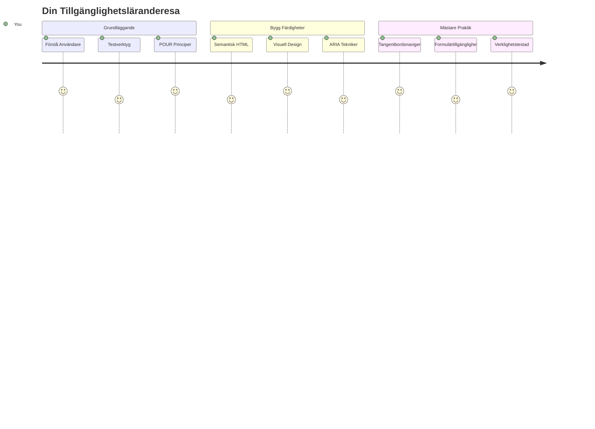
## Förföreläsningsquiz
[Förföreläsningsquiz](https://ff-quizzes.netlify.app/web/)

> Webben kraft ligger i dess universalitet. Tillgång för alla oavsett funktionsnedsättning är en grundläggande aspekt.
>
> \- Sir Timothy Berners-Lee, W3Cs chef och uppfinnare av World Wide Web

Här är något som kanske överraskar dig: när du bygger tillgängliga webbplatser hjälper du inte bara personer med funktionsnedsättningar – du gör faktiskt webben bättre för alla!

Har du någonsin lagt märke till de där trottoarkantsnedsättningarna vid gatuhörn? De designades ursprungligen för rullstolar, men nu hjälper de personer med barnvagnar, leveransarbetare med kärror, resenärer med rullande bagage och även cyklister. Det är precis så tillgänglig webbdesign fungerar – lösningar som hjälper en grupp gynnar ofta alla. Ganska häftigt, eller hur?

I denna lektion kommer vi att utforska hur man skapar webbplatser som verkligen fungerar för alla, oavsett hur de surfar på webben. Du kommer att upptäcka praktiska tekniker som redan finns inbyggda i webbstandarder, göra praktiska tester med hjälp av testverktyg och se hur tillgänglighet gör dina sidor mer användarvänliga för alla användare.

I slutet av denna lektion kommer du att ha förtroendet att göra tillgänglighet till en naturlig del av din utvecklingsprocess. Redo att utforska hur genomtänkta designval kan öppna webben för miljarder användare? Låt oss sätta igång!

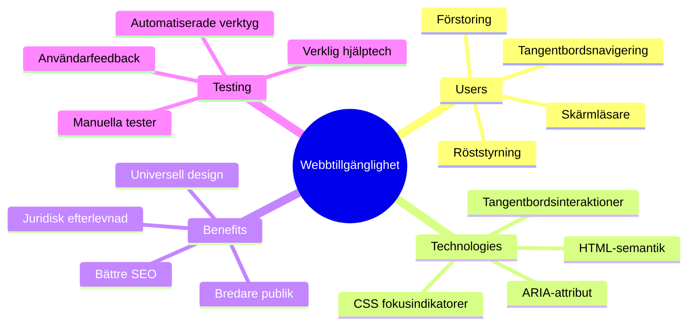
> Du kan ta denna lektion på [Microsoft Learn](https://docs.microsoft.com/learn/modules/web-development-101/accessibility/?WT.mc_id=academic-77807-sagibbon)!

## Förståelse för hjälpmedelsteknologier

Innan vi hoppar in i kodningen, låt oss ta en stund för att förstå hur personer med olika förmågor faktiskt upplever webben. Detta är inte bara teori – att förstå dessa verkliga navigationsmönster gör dig till en mycket bättre utvecklare!

Hjälpmedelsteknologier är ganska fantastiska verktyg som hjälper personer med funktionsnedsättningar att interagera med webbplatser på sätt som kan överraska dig. När du väl behärskar hur dessa teknologier fungerar blir det mycket mer intuitivt att skapa tillgängliga webbupplevelser. Det är som att lära sig se sin kod genom någon annans ögon.

### Skärmläsare

[Skärmläsare](https://en.wikipedia.org/wiki/Screen_reader) är ganska sofistikerade tekniklösningar som omvandlar digital text till tal eller punktskrift. Även om de främst används av personer med synnedsättning är de också väldigt hjälpsamma för användare med inlärningssvårigheter som dyslexi.

Jag gillar att tänka på en skärmläsare som en riktigt smart berättare som läser en bok för dig. Den läser innehåll högt i en logisk ordning, meddelar interaktiva element som "knapp" eller "länk" och erbjuder kortkommandon för att hoppa runt på en sida. Men här är grejen – skärmläsare kan bara göra sitt magiska jobb om vi bygger webbplatser med korrekt struktur och meningsfullt innehåll. Där kommer du in som utvecklare!

**Populära skärmläsare över plattformar:**
- **Windows**: [NVDA](https://www.nvaccess.org/about-nvda/) (gratis och mest populär), [JAWS](https://webaim.org/articles/jaws/), [Narrator](https://support.microsoft.com/windows/complete-guide-to-narrator-e4397a0d-ef4f-b386-d8ae-c172f109bdb1/?WT.mc_id=academic-77807-sagibbon) (inbyggd)
- **macOS/iOS**: [VoiceOver](https://support.apple.com/guide/voiceover/welcome/10) (inbyggd och mycket kapabel)
- **Android**: [TalkBack](https://support.google.com/accessibility/android/answer/6283677) (inbyggd)
- **Linux**: [Orca](https://wiki.gnome.org/Projects/Orca) (gratis och öppen källkod)

**Hur skärmläsare navigerar webbinnehåll:**

Skärmläsare erbjuder flera navigeringsmetoder som gör surfandet effektivt för erfarna användare:
- **Sekventiell läsning**: Läser innehållet uppifrån och ner, som att följa en bok
- **Landmark-navigering**: Hoppar mellan sidans sektioner (huvud, nav, main, sidfot)
- **Rubriknavigering**: Hoppar mellan rubriker för att förstå sidans struktur
- **Länklistor**: Genererar en lista över alla länkar för snabb åtkomst
- **Formulärkontroller**: Navigerar direkt mellan inmatningsfält och knappar

> 💡 **Det här öppnade mina ögon**: 68% av skärmläsaranvändare navigerar främst via rubriker ([WebAIM Survey](https://webaim.org/projects/screenreadersurvey9/#finding)). Det betyder att din rubrikstruktur är som en karta för användarna – när du får den rätt hjälper du bokstavligen folk att hitta runt i ditt innehåll snabbare!

### Bygg din testarbetsflöde

Här är goda nyheter – effektiv tillgänglighetstestning behöver inte vara överväldigande! Du vill kombinera automatiska verktyg (de är fantastiska på att hitta uppenbara problem) med praktisk testning. Här är en systematisk metod som jag har funnit fångar flest problem utan att ta upp hela din dag:

**Väsentligt manuellt testarbetsflöde:**

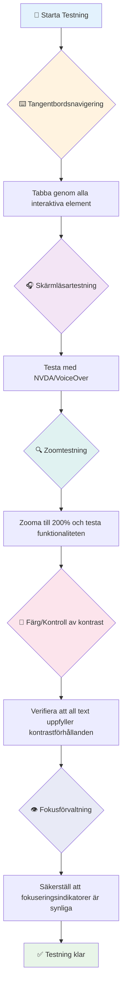
**Checklista för steg-för-steg-testning:**
1. **Tangentbordsnavigering**: Använd endast Tab, Shift+Tab, Enter, Space och piltangenter
2. **Testa med skärmläsare**: Aktivera NVDA, VoiceOver eller Narrator och navigera med stängda ögon
3. **Zoomtest**: Testa vid 200 % och 400 % zoomnivåer
4. **Kontroll av färgkontrast**: Kontrollera all text och UI-komponenter
5. **Test av fokusindikator**: Säkerställ att alla interaktiva element har synliga fokusmarkeringar

✅ **Börja med Lighthouse**: Öppna din webbläsares DevTools, kör en Lighthouse accessibility audit och använd sedan resultaten för att styra din manuella testning.

### Zoom och förstoringverktyg

Du vet hur du ibland nypzoomar på din telefon när texten är för liten, eller kisar på din laptop i starkt solljus? Många användare förlitar sig dagligen på förstoringsverktyg för att göra innehållet läsbart. Det inkluderar personer med nedsatt syn, äldre och alla som någonsin försökt läsa en webbplats utomhus.

Moderna zoomtekniker har utvecklats bortom att bara göra saker större. Att förstå hur dessa verktyg fungerar hjälper dig att skapa responsiva designer som förblir funktionella och attraktiva vid alla förstoringsnivåer.

**Moderna webbläsares zoomfunktioner:**
- **Sidzoom**: Skalar allt innehåll proportionellt (text, bilder, layout) – detta är den föredragna metoden
- **Endast textzoom**: Ökar teckenstorleken samtidigt som originallayouten behålls
- **Nyp-zoom**: Mobilgest för tillfällig förstorning
- **Webbläsarstöd**: Alla moderna webbläsare stöder zoom upp till 500 % utan att bryta funktionalitet

**Specialiserad förstoringsprogramvara:**
- **Windows**: [Förstoringsglas](https://support.microsoft.com/windows/use-magnifier-to-make-things-on-the-screen-easier-to-see-414948ba-8b1c-d3bd-8615-0e5e32204198) (inbyggd), [ZoomText](https://www.freedomscientific.com/training/zoomtext/getting-started/)
- **macOS/iOS**: [Zoom](https://www.apple.com/accessibility/mac/vision/) (inbyggd med avancerade funktioner)

> ⚠️ **Designövervägande**: WCAG kräver att innehåll förblir funktionellt vid 200 % zoom. Vid denna nivå bör horisontell scrollning vara minimal, och alla interaktiva element ska vara tillgängliga.

✅ **Testa din responsiva design**: Zooma din webbläsare till 200 % och 400 %. Anpassar sig din layout smidigt? Kan du fortfarande nå all funktionalitet utan alltför mycket scrollning?

## Moderna tillgänglighetstestverktyg

Nu när du förstår hur människor navigerar webben med hjälpmedelsteknologier, låt oss utforska de verktyg som hjälper dig att bygga och testa tillgängliga webbplatser.

Tänk så här: automatiska verktyg är bra på att hitta uppenbara problem (som saknad alt-text), medan praktiska tester hjälper dig att säkerställa att din sida känns bra att använda i verkligheten. Tillsammans ger de dig förtroende för att dina sidor fungerar för alla.

### Test av färgkontrast

Här är goda nyheter: färgkontrast är ett av de vanligaste tillgänglighetsproblemen, men också ett av de enklaste att fixa. Bra kontrast gynnar alla – från användare med synnedsättning till personer som försöker läsa telefonen på stranden.

**WCAG kontrastkrav:**

| Texttyp | WCAG AA (Minimalt) | WCAG AAA (Förbättrat) |
|---------|--------------------|----------------------|
| **Normal text** (under 18pt) | 4.5:1 kontrastförhållande | 7:1 kontrastförhållande |
| **Stor text** (18pt+ eller 14pt+ fetstil) | 3:1 kontrastförhållande | 4.5:1 kontrastförhållande |
| **UI-komponenter** (knappar, formulärgränser) | 3:1 kontrastförhållande | 3:1 kontrastförhållande |

**Nödvändiga testverktyg:**
- [Colour Contrast Analyser](https://www.tpgi.com/color-contrast-checker/) – Skrivbordsapp med färgplockare
- [WebAIM Contrast Checker](https://webaim.org/resources/contrastchecker/) – Webb-baserad med omedelbar återkoppling
- [Stark](https://www.getstark.co/) – Designplugin för Figma, Sketch, Adobe XD
- [Accessible Colors](https://accessible-colors.com/) – Hitta tillgängliga färgpaletter

✅ **Skapa bättre färgpaletter**: Börja med dina varumärkesfärger och använd kontrastkontroller för att skapa tillgängliga variationer. Dokumentera dessa som dina tillgängliga färgtokens i designsystemet.

### Omfattande tillgänglighetsrevision

Den mest effektiva tillgänglighetstestningen kombinerar flera metoder. Inget enskilt verktyg fångar allt, så skapa en testvana med olika metoder för att säkerställa heltäckande analys.

**Webbläsarbaserad testning (inbyggd i DevTools):**
- **Chrome/Edge**: Lighthouse accessibility audit + Accessibility-panel
- **Firefox**: Accessibility Inspector med detaljerad trädvy
- **Safari**: Audit-flik i Web Inspector med VoiceOver-simulering

**Professionella testtillägg:**
- [axe DevTools](https://www.deque.com/axe/devtools/) – Industriell standard för automatisk testning
- [WAVE](https://wave.webaim.org/extension/) – Visuell återkoppling med felmarkeringar
- [Accessibility Insights](https://accessibilityinsights.io/) – Microsofts omfattande testsuite

**Kommando-rads- och CI/CD-integration:**
- [axe-core](https://github.com/dequelabs/axe-core) – JavaScript-bibliotek för automatiserad testning
- [Pa11y](https://pa11y.org/) – Kommandoradsverktyg för tillgänglighetstestning
- [Lighthouse CI](https://github.com/GoogleChrome/lighthouse-ci) – Automatiserad tillgänglighetspoäng

> 🎯 **Testmål**: Sikta på en Lighthouse-tillgänglighetspoäng på 95+ som din baslinje. Kom ihåg att automatiska verktyg bara hittar cirka 30–40 % av tillgänglighetsproblemen – manuell testning är fortfarande väsentlig!

### 🧠 **Testfärdigheter: Redo att hitta problem?**

**Låt oss se hur du känner inför tillgänglighetstestning:**
- Vilken testmetod verkar mest tillgänglig för dig just nu?
- Kan du tänka dig att använda bara tangentbord för navigering en hel dag?
- Vad är ett tillgänglighetshinder du personligen upplevt online?

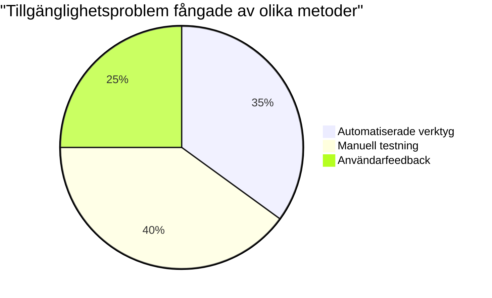
> **Självförtroendeboost**: Professionella tillgänglighetstestare använder denna exakta kombination av metoder. Du lär dig industristandardpraxis!

## Bygg tillgänglighet från grunden

Nyckeln till framgång med tillgänglighet är att bygga in det i grunden från dag ett. Jag vet att det är frestande att tänka ”jag lägger till tillgänglighet senare,” men det är som att försöka lägga till en ramp till ett hus efter att det redan är byggt. Möjligt? Ja. Enkelt? Inte riktigt.

Tänk på tillgänglighet som att planera ett hus – det är mycket lättare att inkludera rullstolstillgång i dina initiala arkitektplaner än att anpassa allt i efterhand.

### P-O-U-R-principerna: Din tillgänglighetsgrund

Web Content Accessibility Guidelines (WCAG) bygger på fyra grundläggande principer som bildar förkortningen POUR. Oroa dig inte – detta är inte tråkiga akademiska begrepp! De är praktiska riktlinjer för att skapa innehåll som fungerar för alla.

När du väl bekantar dig med POUR blir tillgänglighetsbeslut mycket mer intuitiva. Det är som en mental checklista som vägleder dina designval. Låt oss bryta ner det:

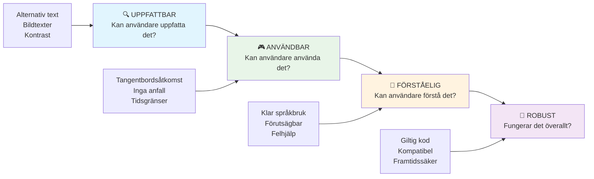
**🔍 Perceivable (Uppfattbart)**: Information måste kunna presenteras på sätt som användare kan uppfatta via sina tillgängliga sinnen

- Ge textalternativ för icke-textinnehåll (bilder, videor, ljud)
- Säkerställ tillräcklig färgkontrast för all text och UI-komponenter
- Erbjud undertexter och transkript för multimediainnehåll
- Designa innehåll som fungerar när det förstoras upp till 200 %
- Använd flera sensoriska egenskaper (inte bara färg) för att förmedla information

**🎮 Operable (Han­terbart)**: Alla gränssnittskomponenter måste kunna hanteras via tillgängliga inmatningsmetoder

- Gör all funktionalitet tillgänglig via tangentbordsnavigering
- Ge användare tillräckligt med tid att läsa och interagera med innehåll
- Undvik innehåll som orsakar anfall eller vestibulära störningar
- Hjälp användare navigera effektivt med klar struktur och landmärken
- Säkerställ att interaktiva element har tillräckligt stora målytor (minst 44px)

**📖 Understandable (Förståeligt)**: Information och gränssnittets funktion måste vara tydligt och begripligt

- Använd klart, enkelt språk som är anpassat för din målgrupp
- Säkerställ att innehållet visas och fungerar på förutsägbara, konsekventa sätt
- Ge tydliga instruktioner och felmeddelanden vid användarinmatning
- Hjälp användare att förstå och rätta till fel i formulär
- Organisera innehållet med logisk läsordning och informationshierarki

**💪 Robust (Robust)**: Innehåll måste fungera pålitligt över olika teknologier och hjälpmedel

- **Använd giltig, semantisk HTML som grund**
- **Säkra kompatibilitet med nuvarande och framtida hjälpmedelsteknologier**
- **Följ webbstandarder och bästa praxis för markering**
- **Testa i olika webbläsare, enheter och hjälpmedel**
- **Strukturera innehållet så att det försämras gradvis när avancerade funktioner inte stöds**

### 🎯 **POUR-principernas Kontroll: Att Göra Det Hållbart**

**Snabb reflektion över grunderna:**
- Kan du tänka dig en webbplatsfunktion som bryter mot varje POUR-princip?
- Vilken princip känns mest naturlig för dig som utvecklare?
- Hur kan dessa principer förbättra designen för alla, inte bara för personer med funktionsnedsättningar?

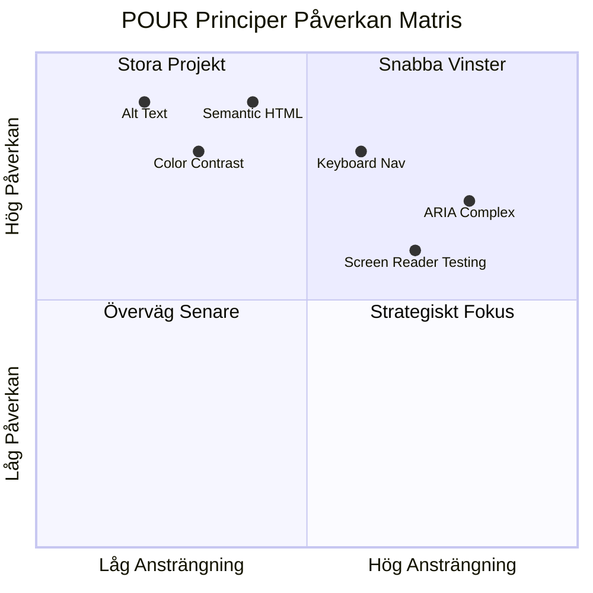
> **Kom ihåg**: Börja med förbättringar som har stor effekt men kräver lite arbete. Semantisk HTML och alt-text ger dig den största tillgänglighetsboostern med minst ansträngning!

## Skapa Tillgänglig Visuell Design

Bra visuell design och tillgänglighet går hand i hand. När du designar med tillgänglighet i åtanke upptäcker du ofta att dessa begränsningar leder till renare, mer eleganta lösningar som gagnar alla användare.

Låt oss utforska hur man skapar visuellt tilltalande designer som fungerar för alla, oavsett deras visuella förmågor eller under vilka förhållanden de ser ditt innehåll.

### Färg och strategier för visuell tillgänglighet

Färg är ett kraftfullt kommunikationsmedel, men det bör aldrig vara det enda sättet du förmedlar viktig information. Att designa bortom färg skapar mer robusta, inkluderande upplevelser som fungerar i fler situationer.

**Designa för skillnader i färgseende:**

Ungefär 8 % av män och 0,5 % av kvinnor har någon form av färgseendedifferentiering (ofta kallat "färgblindhet"). De vanligaste typerna är:
- **Deuteranopi**: Svårighet att skilja rött från grönt
- **Protanopi**: Rött framstår som mer dämpat
- **Tritanopi**: Svårighet med blått och gult (ovanligt)

**Inkluderande färgstrategier:**

```css
/* ❌ Bad: Using only color to indicate status */
.error { color: red; }
.success { color: green; }

/* ✅ Good: Color plus icons and context */
.error {
  color: #d32f2f;
  border-left: 4px solid #d32f2f;
}
.error::before {
  content: "⚠️";
  margin-right: 8px;
}

.success {
  color: #2e7d32;
  border-left: 4px solid #2e7d32;
}
.success::before {
  content: "✅";
  margin-right: 8px;
}
```

**Bortom grundläggande kontrastkrav:**
- Testa dina färgval med simulatorer för färgblindhet
- Använd mönster, texturer eller former tillsammans med färgkodning
- Säkerställ att interaktiva tillstånd förblir urskiljbara utan färg
- Tänk på hur din design ser ut i högkontrastläge

✅ **Testa din färgtillgänglighet**: Använd verktyg som [Coblis](https://www.color-blindness.com/coblis-color-blindness-simulator/) för att se hur din webbplats ser ut för användare med olika typer av färgseende.

### Fokusindikatorer och interaktionsdesign

Fokusindikatorer är den digitala motsvarigheten till en markör—de visar för tangentbordsanvändare var de befinner sig på sidan. Väl designade fokusindikatorer förbättrar upplevelsen för alla genom att göra interaktioner tydliga och förutsägbara.

**Moderna bästa praxis för fokusindikatorer:**

```css
/* Enhanced focus styles that work across browsers */
button:focus-visible {
  outline: 2px solid #0066cc;
  outline-offset: 2px;
  box-shadow: 0 0 0 4px rgba(0, 102, 204, 0.25);
}

/* Remove focus outline for mouse users, preserve for keyboard users */
button:focus:not(:focus-visible) {
  outline: none;
}

/* Focus-within for complex components */
.card:focus-within {
  box-shadow: 0 0 0 3px rgba(74, 144, 164, 0.5);
  border-color: #4A90A4;
}

/* Ensure focus indicators meet contrast requirements */
.custom-focus:focus-visible {
  outline: 3px solid #ffffff;
  outline-offset: 2px;
  box-shadow: 0 0 0 6px #000000;
}
```

**Krav på fokusindikatorer:**
- **Synlighet**: Ska ha minst 3:1 kontrastförhållande mot omgivande element
- **Bredd**: Minst 2px tjock runt hela elementet
- **Beständighet**: Bör förbli synlig tills fokus flyttas någon annanstans
- **Särskiljning**: Måste vara visuellt annorlunda än andra UI-tillstånd

> 💡 **Designtips**: Bra fokusindikatorer använder ofta en kombination av kontur, box-skugga och färgändringar för att säkerställa synlighet över olika bakgrunder och kontexter.

✅ **Granska fokusindikatorer**: Tabba igenom din webbplats och notera vilka element som har tydliga fokusindikatorer. Är några svåra att se eller saknas helt?

### Semantisk HTML: Grunden för tillgänglighet

Semantisk HTML är som att ge hjälpmedel ett GPS-system för din webbplats. När du använder rätt HTML-element för deras avsedda syfte ger du i princip skärmläsare, tangentbord och andra verktyg en detaljerad karta som hjälper användare att navigera effektivt.

Här är en liknelse som verkligen fastnade för mig: semantisk HTML är skillnaden mellan ett välorganiserat bibliotek med tydliga kategorier och hjälpsamma skyltar versus ett lager där böcker är slumpmässigt utspridda. Båda ställena har samma böcker, men i vilket skulle du helst leta efter något? Precis!

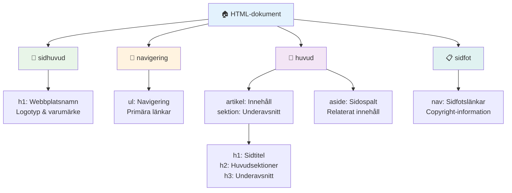
**Byggstenar för tillgänglig sidstruktur:**

```html
<!-- Landmark elements provide page navigation structure -->
<header>
  <h1>Your Site Name</h1>
  <nav aria-label="Main navigation">
    <ul>
      <li><a href="/home">Home</a></li>
      <li><a href="/about">About</a></li>
      <li><a href="/services">Services</a></li>
    </ul>
  </nav>
</header>

<main>
  <article>
    <header>
      <h1>Article Title</h1>
      <p>Published on <time datetime="2024-10-14">October 14, 2024</time></p>
    </header>
    
    <section>
      <h2>First Section</h2>
      <p>Content that relates to this section...</p>
    </section>
    
    <section>
      <h2>Second Section</h2>
      <p>More related content...</p>
    </section>
  </article>
  
  <aside>
    <h2>Related Links</h2>
    <nav aria-label="Related articles">
      <ul>
        <li><a href="/related-1">First related article</a></li>
        <li><a href="/related-2">Second related article</a></li>
      </ul>
    </nav>
  </aside>
</main>

<footer>
  <p>&copy; 2024 Your Site Name. All rights reserved.</p>
  <nav aria-label="Footer links">
    <ul>
      <li><a href="/privacy">Privacy Policy</a></li>
      <li><a href="/contact">Contact Us</a></li>
    </ul>
  </nav>
</footer>
```

**Varför semantisk HTML förändrar tillgängligheten:**

| Semantiskt Element | Syfte | Fördel för Skärmläsare |
|--------------------|--------|------------------------|
| `<header>`         | Sid- eller sektionshuvud | "Banner landmark" - snabb navigering till toppen |
| `<nav>`            | Navigeringslänkar | "Navigation landmark" - lista över navigeringssektioner |
| `<main>`           | Huvudinnehåll på sidan | "Main landmark" - hoppa direkt till innehållet |
| `<article>`        | Självständigt innehåll | Markerar artikelgränser |
| `<section>`        | Tematiska innehållsgrupper | Ger innehållsstruktur |
| `<aside>`          | Relaterat sidinnehåll | "Complementary landmark" |
| `<footer>`         | Sid- eller sektionsfot | "Contentinfo landmark" |

**Superkrafter för skärmläsare med semantisk HTML:**
- **Landmark-navigering**: Hoppa snabbt mellan stora sidsektioner
- **Rubriköversikter**: Skapa en innehållsförteckning baserat på din rubrikstruktur
- **Elementlistor**: Skapa listor med alla länkar, knappar eller formulärkontroller
- **Kontextmedvetenhet**: Förstå relationer mellan innehållssektioner

> 🎯 **Snabb test**: Prova att navigera din webbplats med en skärmläsare med hjälp av landmark-genvägar (D för landmark, H för rubrik, K för länk i NVDA/JAWS). Är navigeringen logisk?

### 🏗️ **Kontroll av Semantisk HTML-mästerskap: Bygga Starka Grunder**

**Låt oss utvärdera din semantiska förståelse:**
- Kan du identifiera landmarks på en webbsida bara genom att titta på HTML?
- Hur skulle du förklara skillnaden mellan `<section>` och `<div>` för en vän?
- Vad är det första du skulle kolla om en skärmläsaranvändare rapporterade navigationsproblem?

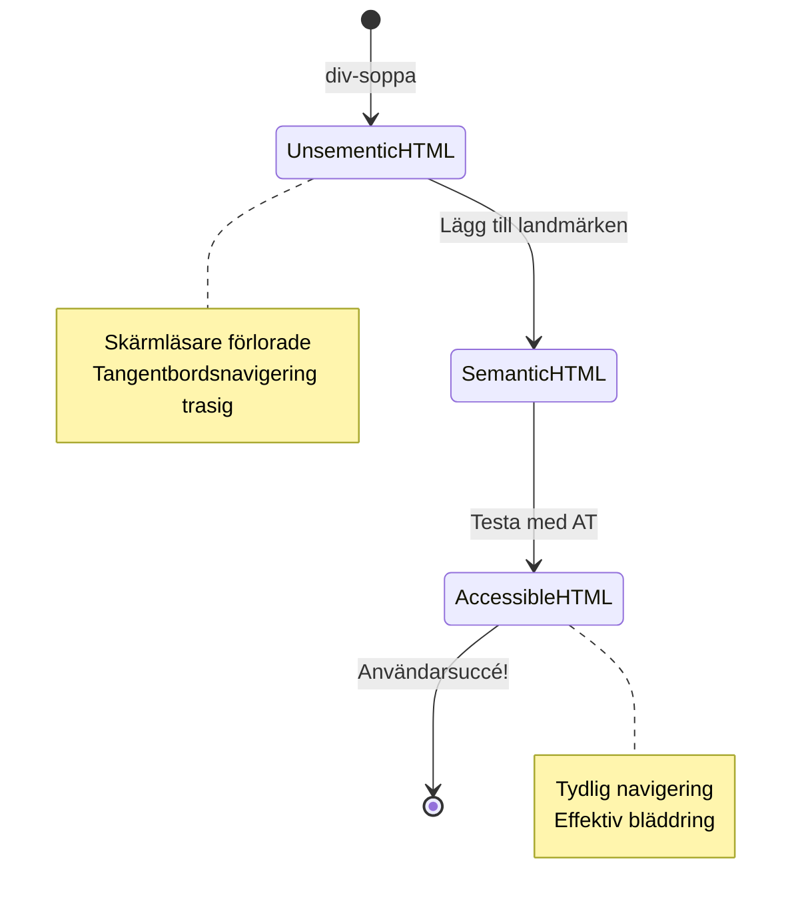
> **Proffstips**: Bra semantisk HTML löser ungefär 70 % av tillgänglighetsproblem automatiskt. Bemästra denna grund så är du väl på väg!

✅ **Granska din semantiska struktur**: Använd Tillgänglighetspanelen i webbläsarens DevTools för att visa tillgänglighetsträdet och säkerställ att ditt markup skapar en logisk struktur.

### Rubrikhierarki: Skapa en logisk innehållsöversikt

Rubriker är absolut avgörande för tillgängligt innehåll—de är som ryggraden som håller allt samman. Skärmläsaranvändare förlitar sig mycket på rubriker för att förstå och navigera i ditt innehåll. Tänk på det som att tillhandahålla en innehållsförteckning för din sida.

**Här är den gyllene regeln för rubriker:**
Hoppa aldrig över nivåer. Gå alltid logiskt från `<h1>` till `<h2>` till `<h3>`, och så vidare. Kommer du ihåg att göra dispositioner i skolan? Det är samma princip—du skulle ju inte hoppa från "I. Huvudpunkt" direkt till "C. Underunderpunkt" utan "A. Underpunkt" emellan, eller hur?

**Exempel på perfekt rubrikstruktur:**

```html
<!-- ✅ Excellent: Logical, hierarchical progression -->
<main>
  <h1>Complete Guide to Web Accessibility</h1>
  
  <section>
    <h2>Understanding Screen Readers</h2>
    <p>Introduction to screen reader technology...</p>
    
    <h3>Popular Screen Reader Software</h3>
    <p>NVDA, JAWS, and VoiceOver comparison...</p>
    
    <h3>Testing with Screen Readers</h3>
    <p>Step-by-step testing instructions...</p>
  </section>
  
  <section>
    <h2>Color and Contrast Guidelines</h2>
    <p>Designing with sufficient contrast...</p>
    
    <h3>WCAG Contrast Requirements</h3>
    <p>Understanding the different contrast levels...</p>
    
    <h3>Testing Tools and Techniques</h3>
    <p>Tools for verifying contrast ratios...</p>
  </section>
</main>
```

```html
<!-- ❌ Problematic: Skipping levels, inconsistent structure -->
<h1>Page Title</h1>
<h3>Subsection</h3> <!-- Skipped h2 -->
<h2>This should come before h3</h2>
<h1>Another main heading?</h1> <!-- Multiple h1s -->
```

**Bästa praxis för rubriker:**
- **Endast en `<h1>` per sida**: Vanligtvis sidans huvudtitel eller primära innehållsrubrik
- **Logisk progression**: Hoppa aldrig över nivåer (h1 → h2 → h3, inte h1 → h3)
- **Beskrivande innehåll**: Gör rubriker meningsfulla även om de läses ur kontext
- **Visuell formatering med CSS**: Använd CSS för utseende, HTML-nivåer för struktur

**Statistik om skärmläsarnas navigering:**
- 68 % av skärmläsaranvändare navigerar med rubriker ([WebAIM Survey](https://webaim.org/projects/screenreadersurvey9/#finding))
- Användare förväntar sig att hitta en logisk rubriköversikt
- Rubriker är det snabbaste sättet att förstå sidstrukturen

> 💡 **Profftips**: Använd webbläsartillägg som "HeadingsMap" för att visualisera din rubrikstruktur. Den ska läsas som en välorganiserad innehållsförteckning.

✅ **Testa din rubrikstruktur**: Använd en skärmläsares rubriknavigering (H-tangenten i NVDA) för att hoppa mellan rubrikerna. Berättar progressionen historien om ditt innehåll logiskt?

### Avancerade tekniker för visuell tillgänglighet

Utöver grunder som kontrast och färg finns det sofistikerade metoder som hjälper till att skapa verkligen inkluderande visuella upplevelser. Dessa metoder säkerställer att ditt innehåll fungerar under olika visningsförhållanden och med hjälpmedel.

**Väsentliga strategier för visuell kommunikation:**

- **Multimodal återkoppling**: Kombinera visuella, textbaserade och ibland ljudsignaler
- **Progressiv avslöjning**: Presentera information i hanterbara delar
- **Konsekventa interaktionsmönster**: Använd välbekanta UI-konventioner
- **Responsiv typografi**: Skala text lämpligt över olika enheter
- **Laddnings- och felmeddelanden**: Ge tydlig återkoppling för alla användarhandlingar

**CSS-verktyg för förbättrad tillgänglighet:**

```css
/* Screen reader only text - visually hidden but accessible */
.sr-only {
  position: absolute;
  width: 1px;
  height: 1px;
  padding: 0;
  margin: -1px;
  overflow: hidden;
  clip: rect(0, 0, 0, 0);
  white-space: nowrap;
  border: 0;
}

/* Skip link for keyboard navigation */
.skip-link {
  position: absolute;
  top: -40px;
  left: 6px;
  background: #000000;
  color: #ffffff;
  padding: 8px 16px;
  text-decoration: none;
  border-radius: 4px;
  font-weight: bold;
  transition: top 0.3s ease;
  z-index: 1000;
}

.skip-link:focus {
  top: 6px;
}

/* Reduced motion respect */
@media (prefers-reduced-motion: reduce) {
  .skip-link {
    transition: none;
  }
  
  * {
    animation-duration: 0.01ms !important;
    animation-iteration-count: 1 !important;
    transition-duration: 0.01ms !important;
  }
}

/* High contrast mode support */
@media (prefers-contrast: high) {
  .button {
    border: 2px solid;
  }
}
```

> 🎯 **Tillgänglighetsmönster**: "skip link" är viktig för tangentbordsanvändare. Den bör vara det första fokuserbara elementet på din sida och hoppa direkt till huvudinnehållet.

✅ **Implementera hoppnavigering**: Lägg till skip links på dina sidor och testa dem genom att trycka på Tab så snart sidan laddats. De ska synas och låta dig hoppa till huvudinnehållet.

## Skapa Meningsfull Länktext

Länkar är i princip webben motorvägar, men dåligt skriven länktext är som vägskyltar som bara säger "Plats" istället för "Stadskärnan Chicago." Inte särskilt hjälpsamt, eller hur?

Här är något som verkligen förvånade mig när jag först lärde mig det: skärmläsare kan extrahera alla länkar från en sida och visa dem som en stor lista. Föreställ dig att någon ger dig en katalog över varje länk på din sida. Skulle varje länk vara begriplig på egen hand? Det är testet din länktext måste klara!

### Förstå navigationsmönster för länkar

Skärmläsare erbjuder kraftfulla navigeringsfunktioner för länkar som bygger på välskriven länktext:

**Metoder för länk-navigering:**
- **Sekventiell läsning**: Länkar läses i kontext som en del av innehållets flöde
- **Generering av länklister**: Alla sidans länkar sammanställs i en sökbar katalog
- **Snabbnavigering**: Hoppa mellan länkar med tangentbordsgenvägar (K i NVDA)
- **Sökmöjlighet**: Hitta specifika länkar genom att skriva deltext

**Varför kontext är viktigt:**
När skärmläsaranvändare genererar en länkliste, ser de något som detta:
- "Ladda ner rapport"
- "Läs mer"
- "Klicka här"
- "Integritetspolicy"
- "Klicka här"

Endast två av dessa länkar ger användbar information när de läses ur kontext!

> 📊 **Användarpåverkan**: Skärmläsaranvändare skannar länklistor för att snabbt förstå sidans innehåll. Generisk länktext tvingar dem att navigera tillbaka till varje länks kontext, vilket avsevärt saktar ner deras surfupplevelse.

### Vanliga misstag med länktext att undvika

Att förstå vad som inte fungerar hjälper dig att känna igen och åtgärda tillgänglighetsproblem i befintligt innehåll.

**❌ Generisk länktext som inte ger kontext:**

```html
<!-- Meaningless when read from a link list -->
<p>Our sustainability efforts are detailed in our recent report. 
   <a href="/sustainability-2024.pdf">Click here</a> to view it.</p>

<!-- Repeated generic text throughout the page -->
<div class="article-card">
  <h3>Web Accessibility Guide</h3>
  <p>Learn the fundamentals...</p>
  <a href="/accessibility-guide">Read more</a>
</div>
<div class="article-card">
  <h3>Color Contrast Tips</h3>
  <p>Improve your design...</p>
  <a href="/color-contrast">Read more</a>
</div>

<!-- URLs as link text (difficult for screen readers to announce) -->
<p>Visit https://www.w3.org/WAI/WCAG21/quickref/ for WCAG guidelines.</p>

<!-- Vague action words -->
<a href="/contact">Go</a> | <a href="/about">See</a> | <a href="/help">View</a>
```

**Varför dessa mönster misslyckas:**
- **"Klicka här"** säger ingenting om länkmålet
- **"Läs mer"** som upprepas flera gånger skapar förvirring
- **Råa URL:er** är svåra för skärmläsare att uttala tydligt
- **Enstaka ord** som "Gå" eller "Se" saknar beskrivande kontext

### Skriva utmärkt länktext

Beskrivande länktext gynnar alla—seende användare kan snabbt skanna länkar och skärmläsaranvändare förstår direkt vart länken leder.

**✅ Klara, beskrivande exempel på länktext:**

```html
<!-- Descriptive text that explains the destination -->
<p>Our comprehensive <a href="/sustainability-2024.pdf">2024 sustainability report (PDF, 2.1MB)</a> details our environmental initiatives.</p>

<!-- Specific, unique link text for each card -->
<div class="article-card">
  <h3>Web Accessibility Guide</h3>
  <p>Learn the fundamentals of inclusive design...</p>
  <a href="/accessibility-guide">Read our complete web accessibility guide</a>
</div>
<div class="article-card">
  <h3>Color Contrast Tips</h3>
  <p>Improve your design with better color choices...</p>
  <a href="/color-contrast">Explore color contrast best practices</a>
</div>

<!-- Meaningful text instead of raw URLs -->
<p>The <a href="https://www.w3.org/WAI/WCAG21/quickref/">WCAG 2.1 Quick Reference guide</a> provides comprehensive accessibility guidelines.</p>

<!-- Descriptive action links -->
<a href="/contact">Contact our support team</a> | 
<a href="/about">About our company</a> | 
<a href="/help">Get help with your account</a>
```

**Bästa praxis för länktext:**
- **Var specifik**: "Ladda ner kvartalsrapporten" istället för bara "Ladda ner"
- **Inkludera filtyp och storlek**: "(PDF, 1,2 MB)" för nedladdningsbara filer
- **Ange om länkar öppnas externt**: "(öppnas i nytt fönster)" när det är lämpligt
- **Använd aktivt språk**: "Kontakta oss" istället för "Kontaktsida"
- **Håll det kortfattat**: Sikta på 2–8 ord när det är möjligt

### Avancerade mönster för länkarnas tillgänglighet

Ibland kräver visuella designbegränsningar eller tekniska krav speciella lösningar. Här är sofistikerade tekniker för vanliga utmanande scenarier:

**Använda ARIA för förbättrad kontext:**

```html
<!-- When button text must be short but needs more context -->
<a href="/report.pdf" 
   aria-label="Download 2024 annual financial report, PDF format, 2.3MB">
  Download Report
</a>

<!-- When the full context comes from surrounding content -->
<h3 id="sustainability-heading">Sustainability Initiative</h3>
<p>Our efforts to reduce environmental impact...</p>
<a href="/sustainability-details" 
   aria-labelledby="sustainability-heading"
   aria-describedby="sustainability-summary">
  Learn more
</a>
<p id="sustainability-summary">Detailed breakdown of our 2024 environmental goals and achievements</p>
```

**Angivelse av filtyper och externa mål:**

```html
<!-- Method 1: Include information in visible link text -->
<a href="/annual-report.pdf">
  Download our 2024 annual report (PDF, 2.3MB)
</a>

<!-- Method 2: Use screen reader-only text for file details -->
<a href="/annual-report.pdf">
  Download our 2024 annual report
  <span class="sr-only">(PDF format, 2.3MB)</span>
</a>

<!-- Method 3: External link indication -->
<a href="https://example.com" 
   target="_blank" 
   aria-describedby="external-link-warning">
  Visit external resource
</a>
<span id="external-link-warning" class="sr-only">
  (opens in new window)
</span>

<!-- Method 4: Using CSS for visual indicators -->
<a href="https://example.com" class="external-link">
  External resource
</a>
```

```css
/* Visual indicator for external links */
.external-link::after {
  content: " ↗";
  font-size: 0.8em;
  color: #666;
}

/* Screen reader announcement for external links */
.external-link::before {
  content: "External link: ";
  position: absolute;
  left: -10000px;
  width: 1px;
  height: 1px;
  overflow: hidden;
}
```

> ⚠️ **Viktigt**: När du använder `target="_blank"` måste du alltid informera användare om att länken öppnas i ett nytt fönster eller flik. Oförutsedda navigationsändringar kan vara desorienterande.

✅ **Testa din länk-kontekst**: Använd din webbläsares utvecklarverktyg för att generera en lista med alla länkar på din sida. Kan du förstå syftet med varje länk utan någon omgivande kontext?

## ARIA: Superladda HTML Tillgänglighet

[Accessible Rich Internet Applications (ARIA)](https://developer.mozilla.org/docs/Web/Accessibility/ARIA) är som en universell översättare mellan dina komplexa webbapplikationer och hjälpmedel. När HTML ensam inte kan uttrycka allt dina interaktiva komponenter gör fyller ARIA i dessa luckor.

Jag tycker om att tänka på ARIA som hjälpsamma anteckningar i din HTML—ungefär som scenanvisningar i ett manus som hjälper skådespelare att förstå sina roller och relationer.

**Här är den viktigaste regeln om ARIA**: Använd alltid semantisk HTML först, lägg sedan till ARIA för att förbättra den. Tänk på ARIA som krydda, inte huvudrätten. Det ska förtydliga och förbättra din HTML-struktur, aldrig ersätta den. Få grunden rätt först!

### Strategisk ARIA-implementering

ARIA är kraftfullt, men med kraft kommer ansvar. Felaktig ARIA kan göra tillgängligheten sämre än ingen ARIA alls. Här är när och hur du använder det effektivt:

**✅ Använd ARIA när:**
- Du skapar egna interaktiva widgetar (t.ex. accordions, flikar, karuseller)
- Du bygger dynamiskt innehåll som förändras utan att sidan laddas om
- Du ger extra kontext för komplexa UI-relationer
- Du indikerar laddningstillstånd eller levande uppdateringar av innehåll
- Du skapar app-liknande gränssnitt med anpassade kontroller

**❌ Undvik ARIA när:**
- Standard HTML-element redan ger nödvändig semantik
- Du är osäker på hur du implementerar det korrekt
- Det dubblar information som redan ges av semantisk HTML
- Du inte har testat med faktiska hjälpmedel

> 🎯 **ARIA:s gyllene regel**: "Ändra inte semantik om du inte absolut måste, säkerställ alltid tangentbordstillgänglighet och testa med riktiga hjälpmedel."

**De fem kategorierna av ARIA:**

1. **Roller**: Vad är det här elementet? (`button`, `tab`, `dialog`)
2. **Egenskaper**: Vilka är dess funktioner? (`aria-required`, `aria-haspopup`)
3. **Tillstånd**: Vad är dess aktuella tillstånd? (`aria-expanded`, `aria-checked`)
4. **Landmärken**: Var är det i sidans struktur? (`banner`, `navigation`, `main`)
5. **Live regioner**: Hur ska ändringar meddelas? (`aria-live`, `aria-atomic`)

### Viktiga ARIA-mönster för moderna webbappar

Dessa mönster löser de vanligaste tillgänglighetsutmaningarna i interaktiva webbapplikationer:

**Namnge och beskriv element:**

```html
<!-- aria-label: Provides accessible name when visible text isn't sufficient -->
<button aria-label="Close newsletter subscription dialog">×</button>

<!-- aria-labelledby: References existing text as the accessible name -->
<section aria-labelledby="news-heading">
  <h2 id="news-heading">Latest News</h2>
  <!-- news content -->
</section>

<!-- aria-describedby: Links to additional descriptive text -->
<input type="password" 
       aria-describedby="pwd-requirements pwd-strength"
       required>
<div id="pwd-requirements">
  Password must contain at least 8 characters, including uppercase, lowercase, and numbers.
</div>
<div id="pwd-strength" aria-live="polite">
  <!-- Dynamic password strength indicator -->
</div>
```

**Live regioner för dynamiskt innehåll:**

```html
<!-- Polite announcements (don't interrupt current speech) -->
<div aria-live="polite" id="status-updates">
  <!-- Status messages appear here -->
</div>

<!-- Assertive announcements (interrupt and announce immediately) -->
<div aria-live="assertive" id="urgent-alerts">
  <!-- Error messages and critical alerts -->
</div>

<!-- Loading states with live regions -->
<button id="submit-btn" aria-describedby="loading-status">
  Submit Application
</button>
<div id="loading-status" aria-live="polite" aria-atomic="true">
  <!-- "Processing your application..." appears here -->
</div>
```

**Exempel på interaktiv widget (ackordion):**

```html
<div class="accordion">
  <h3>
    <button aria-expanded="false" 
            aria-controls="panel-1" 
            id="accordion-trigger-1"
            class="accordion-trigger">
      Accessibility Guidelines
    </button>
  </h3>
  <div id="panel-1" 
       role="region"
       aria-labelledby="accordion-trigger-1" 
       hidden>
    <p>WCAG 2.1 provides comprehensive guidelines...</p>
  </div>
</div>
```

```javascript
// JavaScript för att hantera accordion-tillstånd
function toggleAccordion(trigger) {
  const panel = document.getElementById(trigger.getAttribute('aria-controls'));
  const isExpanded = trigger.getAttribute('aria-expanded') === 'true';
  
  // Växla tillstånd
  trigger.setAttribute('aria-expanded', !isExpanded);
  panel.hidden = isExpanded;
  
  // Meddela ändring till skärmläsare
  const status = document.getElementById('status-updates');
  status.textContent = isExpanded ? 'Section collapsed' : 'Section expanded';
}
```

### Bästa praxis för ARIA-implementering

ARIA är kraftfullt men kräver noggrann implementering. Att följa dessa riktlinjer hjälper till att säkerställa att din ARIA förbättrar snarare än försvårar tillgängligheten:

**🛡️ Kärnprinciper:**

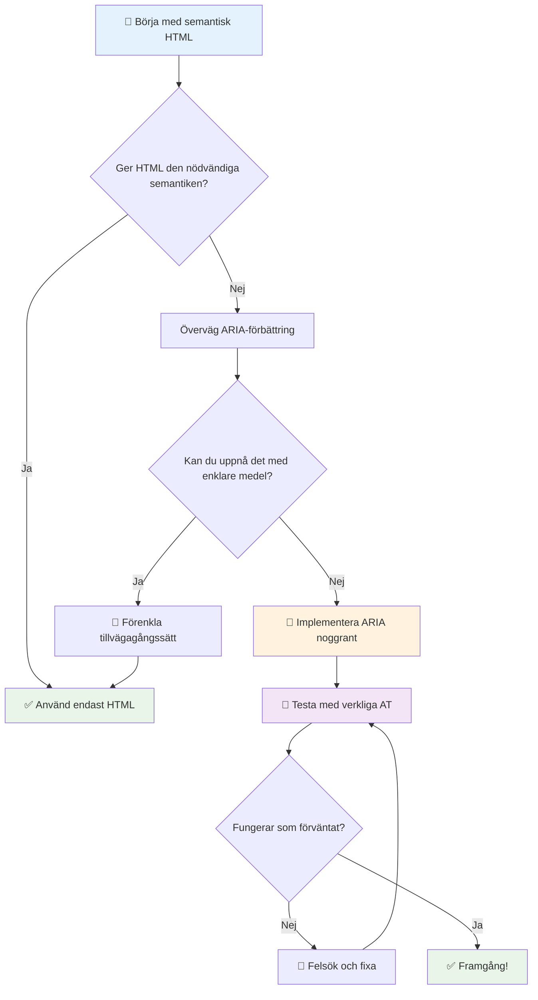
1. **Semantisk HTML först**: Föredra alltid `<button>` framför `<div role="button">`
2. **Bryt inte semantik**: Överskriv aldrig befintlig HTML-betydelse (undvik `<h1 role="button">`)
3. **Behåll tangentbordsåtkomst**: Alla interaktiva ARIA-element måste vara fullt tangentbordsåtkomliga
4. **Testa med riktiga användare**: ARIA-stöd varierar mycket mellan hjälpmedelsteknologier
5. **Börja enkelt**: Komplexa ARIA-implementationer har större sannolikhet att innehålla fel

**🔍 Testflöde:**

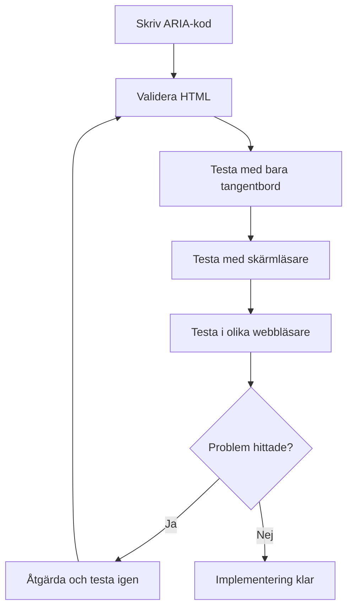
**🚫 Vanliga ARIA-misstag att undvika:**

- **Motstridig information**: Motsäg inte HTML-semantik
- **Överkommentering**: För mycket ARIA-information överväldigar användare
- **Statisk ARIA**: Glöm inte uppdatera ARIA-tillstånd när innehållet ändras
- **Otestade implementationer**: ARIA som fungerar i teorin men inte i praktiken
- **Saknad tangentbordsstöd**: ARIA-roller utan motsvarande tangentbordsinteraktioner

> 💡 **Testresurser**: Använd verktyg som [accessibility-checker](https://www.npmjs.com/package/accessibility-checker) för automatiserad ARIA-validering, men testa alltid med riktiga skärmläsare för att få hela upplevelsen.

### 🎭 **ARIA-färdighetstest: Redo för komplexa interaktioner?**

**Bedöm din ARIA-självförtroende:**
- När skulle du välja ARIA istället för semantisk HTML? (Tips: nästan aldrig!)
- Kan du förklara varför `<div role="button">` vanligtvis är sämre än `<button>`?
- Vad är det viktigaste att komma ihåg om ARIA-testning?

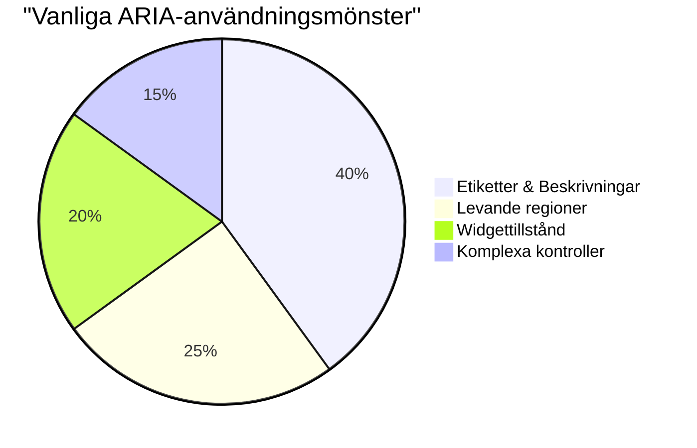
> **Viktig insikt**: Det mesta av ARIA-användningen är för namngivning och beskrivning av element. Komplexa widgetmönster är mycket ovanligare än du kanske tror!

✅ **Lär av experter**: Studera [ARIA Authoring Practices Guide](https://w3c.github.io/aria-practices/) för beprövade mönster och implementationer av komplexa interaktiva widgets.

## Göra bilder och media tillgängliga

Visuellt och ljudinnehåll är viktiga delar av moderna webbupplevelser, men de kan skapa barriärer om de inte implementeras på ett genomtänkt sätt. Målet är att säkerställa att informationen och den känslomässiga påverkan av ditt media når alla användare. När du behärskar det blir det andra natur.

Olika typer av media kräver olika tillgänglighetsmetoder. Det är som att laga mat – du skulle inte behandla en känslig fisk på samma sätt som en stadig biff. Att förstå dessa skillnader hjälper dig att välja rätt lösning för varje situation.

### Strategisk bildtillgänglighet

Varje bild på din webbplats har ett syfte. Att förstå detta syfte hjälper dig att skriva bättre alternativtext och skapa mer inkluderande upplevelser.

**De fyra typerna av bilder och deras strategier för alt-text:**

**Informativa bilder** - förmedlar viktig information:  
```html

```
  
**Dekorativa bilder** - rent visuella utan informationsvärde:  
```html

```
  
**Funktionella bilder** - fungerar som knappar eller kontroller:  
```html
<button>
  
</button>
```
  
**Komplexa bilder** - diagram, scheman, informationsgrafik:  
```html

<div id="chart-description">
  <p>Detailed description: Sales data shows a steady increase across all quarters...</p>
</div>
```
  
### Video- och ljudtillgänglighet

**Video krav:**  
- **Bildtexter**: Textversion av talat innehåll och ljudeffekter  
- **Ljudbeskrivningar**: Beskrivning av visuella element för blinda användare  
- **Transkript**: Fullständig textversion av allt ljud- och bildinnehåll  

```html
<video controls>
  <source src="video.mp4" type="video/mp4">
  <track kind="captions" src="captions.vtt" srclang="en" label="English">
  <track kind="descriptions" src="descriptions.vtt" srclang="en" label="Audio descriptions">
</video>
```
  
**Ljudkrav:**  
- **Transkript**: Textversion av allt talat innehåll  
- **Visuella indikatorer**: För endast ljudinnehåll, ge visuella signaler  

### Moderna bildtekniker

**Använda CSS för dekorativa bilder:**  
```css
.hero-section {
  background-image: url('decorative-hero.jpg');
  /* Decorative images in CSS don't need alt text */
}
```
  
**Responsiva bilder med tillgänglighet:**  
```html
<picture>
  <source media="(min-width: 800px)" srcset="large-chart.png">
  <source media="(min-width: 400px)" srcset="medium-chart.png">
  
</picture>
```
  
✅ **Testa bildtillgänglighet**: Använd en skärmläsare för att navigera en sida med bilder. Får du tillräckligt med information för att förstå innehållet?

## Tangentbordsnavigering och fokus-hantering

Många användare navigerar på webben enbart med tangentbordet. Detta inkluderar personer med rörelsehinder, kraftanvändare som tycker att tangentbord är snabbare än mus, och alla vars mus slutat fungera. Att se till att din webbplats fungerar bra med tangentbordsinmatning är avgörande och gör ofta din webbplats effektivare för alla.

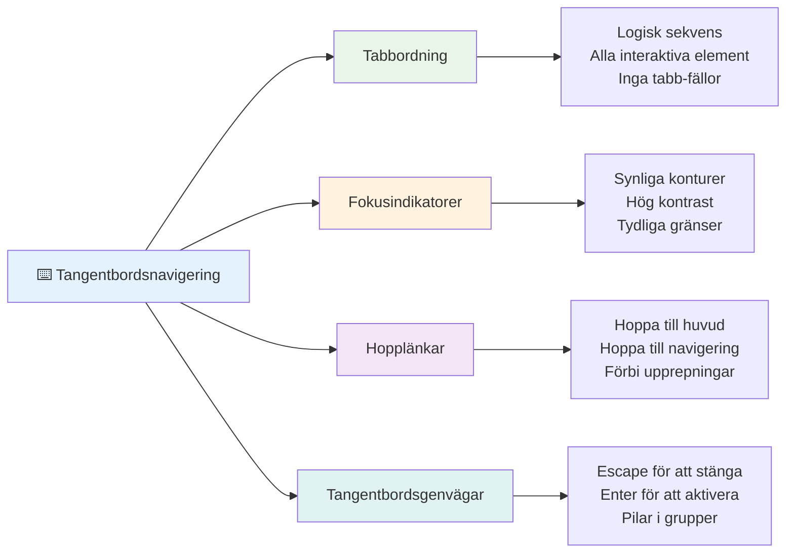
### Viktiga tangentbordsnavigeringsmönster

**Standard tangentbordsinteraktioner:**  
- **Tab**: Flytta fokus framåt mellan interaktiva element  
- **Shift + Tab**: Flytta fokus bakåt  
- **Enter**: Aktivera knappar och länkar  
- **Mellanslag**: Aktivera knappar, markera kryssrutor  
- **Piltangenter**: Navigera inom komponentgrupper (radioknappar, menyer)  
- **Escape**: Stäng modala fönster, dropdowns, eller avbryt operationer  

### Bästa praxis för fokus-hantering

**Synliga fokusindikatorer:**  
```css
/* Ensure focus is always visible */
button:focus-visible {
  outline: 2px solid #4A90A4;
  outline-offset: 2px;
}

/* Custom focus styles for different components */
.card:focus-within {
  box-shadow: 0 0 0 3px rgba(74, 144, 164, 0.5);
}
```
  
**Hopplänkar för effektiv navigation:**  
```html
<a href="#main-content" class="skip-link">Skip to main content</a>
<a href="#navigation" class="skip-link">Skip to navigation</a>

<nav id="navigation">
  <!-- navigation content -->
</nav>
<main id="main-content">
  <!-- main content -->
</main>
```
  
**Korrekt tabbordning:**  
```html
<!-- Use semantic HTML for natural tab order -->
<form>
  <label for="name">Name:</label>
  <input type="text" id="name" tabindex="0">
  
  <label for="email">Email:</label>
  <input type="email" id="email" tabindex="0">
  
  <button type="submit" tabindex="0">Submit</button>
</form>
```
  
### Fokusfångst i modalfönster

När man öppnar modala dialoger bör fokus hållas inom den modalen:

```javascript
// Modern implementation av fokusfälla
function trapFocus(element) {
  const focusableElements = element.querySelectorAll(
    'button, [href], input, select, textarea, [tabindex]:not([tabindex="-1"])'
  );
  
  const firstElement = focusableElements[0];
  const lastElement = focusableElements[focusableElements.length - 1];

  element.addEventListener('keydown', (e) => {
    if (e.key === 'Tab') {
      if (e.shiftKey && document.activeElement === firstElement) {
        e.preventDefault();
        lastElement.focus();
      } else if (!e.shiftKey && document.activeElement === lastElement) {
        e.preventDefault();
        firstElement.focus();
      }
    }
    
    if (e.key === 'Escape') {
      closeModal();
    }
  });
  
  // Fokusera första elementet när modalen öppnas
  firstElement.focus();
}
```
  
✅ **Testa tangentbordsnavigering**: Försök navigera din webbplats endast med Tab-tangenten. Kan du nå alla interaktiva element? Är fokusordningen logisk? Är fokusindikatorerna tydligt synliga?

## Formulärtillgänglighet

Formulär är kritiska för användarinteraktion och behöver särskild uppmärksamhet gällande tillgänglighet.

### Etikett- och formulärkontrollkoppling

**Varje formulärkontroll behöver en etikett:**  
```html
<!-- Explicit labeling (preferred) -->
<label for="username">Username:</label>
<input type="text" id="username" name="username" required>

<!-- Implicit labeling -->
<label>
  Password:
  <input type="password" name="password" required>
</label>

<!-- Using aria-label when visual label isn't desired -->
<input type="search" aria-label="Search products" placeholder="Search...">
```
  
### Felhantering och validering

**Tillgängliga felmeddelanden:**  
```html
<label for="email">Email Address:</label>
<input type="email" id="email" name="email" 
       aria-describedby="email-error" 
       aria-invalid="true" required>
<div id="email-error" role="alert">
  Please enter a valid email address
</div>
```
  
**Bästa praxis för formulärvalidering:**  
- Använd `aria-invalid` för att indikera ogiltiga fält  
- Tillhandahåll tydliga, specifika felmeddelanden  
- Använd `role="alert"` för viktiga felmeddelanden  
- Visa fel både direkt och vid forminskickning  

### Fältset och gruppering

**Gruppera relaterade formulärkontroller:**  
```html
<fieldset>
  <legend>Shipping Address</legend>
  <label for="street">Street Address:</label>
  <input type="text" id="street" name="street">
  
  <label for="city">City:</label>
  <input type="text" id="city" name="city">
</fieldset>

<fieldset>
  <legend>Preferred Contact Method</legend>
  <input type="radio" id="contact-email" name="contact" value="email">
  <label for="contact-email">Email</label>
  
  <input type="radio" id="contact-phone" name="contact" value="phone">
  <label for="contact-phone">Phone</label>
</fieldset>
```
  
## Din tillgänglighetsresa: Viktiga insikter

Grattis! Du har just fått grundläggande kunskap för att skapa verkligt inkluderande webbupplevelser. Det är ganska spännande! Webbåtkomlighet handlar inte bara om att bocka av i ruta – det handlar om att förstå de mångfaldiga sätt som människor interagerar med digitalt innehåll och designa för den fantastiska komplexiteten.

Du är nu en del av en växande gemenskap av utvecklare som förstår att bra design fungerar för alla. Välkommen i klubben!

**🎯 Din tillgänglighetsverktygslåda innehåller nu:**

| Kärnprincip | Implementation | Påverkan |
|-------------|----------------|----------|
| **Semantisk HTML-grund** | Använd rätt HTML-element för deras avsedda syfte | Skärmläsare kan navigera effektivt, tangentbord fungerar automatiskt |
| **Inkluderande visuell design** | Tillräcklig kontrast, meningsfull färganvändning, synliga fokusindikatorer | Tydligt för alla i alla ljusförhållanden |
| **Beskrivande innehåll** | Meningsfull länktext, alt-text, rubriker | Användare förstår innehåll utan visuellt sammanhang |
| **Tangentbordsåtkomst** | Tabbordning, kortkommandon, fokus-hantering | Motorisk tillgänglighet och effektivitet för kraftanvändare |
| **ARIA-förbättring** | Strategisk användning för att fylla semantiska luckor | Komplexa applikationer fungerar med hjälpmedelsteknologier |
| **Omfattande testning** | Automatiska verktyg + manuell verifiering + riktiga användartester | Fångar problem innan de påverkar användarna |

**🚀 Dina nästa steg:**

1. **Bygg in tillgänglighet i ditt arbetsflöde**: Gör testning till en naturlig del av din utvecklingsprocess  
2. **Lär av riktiga användare**: Sök feedback från personer som använder hjälpmedelsteknologier  
3. **Håll dig uppdaterad**: Tillgänglighetstekniker utvecklas med ny teknik och standarder  
4. **Förespråka inkludering**: Dela dina kunskaper och prioritera tillgänglighet i teamet  

> 💡 **Kom ihåg**: Begränsningar för tillgänglighet leder ofta till innovativa, eleganta lösningar som gynnar alla. Rampkantningar, textning och röststyrning började alla som tillgänglighetsfunktioner och blev mainstream-förbättringar.

**Affärsargumentet är kristallklart**: Tillgängliga webbplatser når fler användare, rankas bättre i sökmotorer, har lägre underhållskostnader och undviker juridiska risker. Men ärligt talat? Den verkliga anledningen att bry sig om tillgänglighet går mycket djupare. Tillgängliga webbplatser förkroppsligar webbens bästa värderingar – öppenhet, inkludering och idén att alla förtjänar lika tillgång till information.

Du är nu redo att bygga det inkluderande webb framtiden. Varje tillgänglig webbplats du skapar gör internet till en mer välkomnande plats för alla. Det är ganska fantastiskt när man tänker på det!

## Ytterligare resurser

Fortsätt din tillgänglighetslärande med dessa viktiga resurser:

**📚 Officiella standarder och riktlinjer:**  
- [WCAG 2.1-riktlinjer](https://www.w3.org/WAI/WCAG21/quickref/) – Den officiella tillgänglighetsstandarden med snabbreferens  
- [ARIA Authoring Practices Guide](https://w3c.github.io/aria-practices/) – Omfattande mönster för interaktiva widgets  
- [WebAIM-riktlinjer](https://webaim.org/) – Praktisk, nybörjarvänlig tillgänglighetsvägledning  

**🛠️ Verktyg och testresurser:**  
- [axe DevTools](https://www.deque.com/axe/devtools/) – Industri-standard för tillgänglighetstestning  
- [A11y Project Checklist](https://www.a11yproject.com/checklist/) – Steg-för-steg verifiering av tillgänglighet  
- [Accessibility Insights](https://accessibilityinsights.io/) – Microsofts omfattande testpaket  
- [Color Oracle](https://colororacle.org/) – Simulering av färgblindhet för design-testning  

**🎓 Lärande och gemenskap:**  
- [WebAIM Screen Reader Survey](https://webaim.org/projects/screenreadersurvey9/) – Riktiga användares preferenser och beteenden  
- [Inclusive Components](https://inclusive-components.design/) – Moderna tillgängliga komponentmönster  
- [A11y Coffee](https://a11y.coffee/) – Snabba tillgänglighetstips och insikter  
- [Web Accessibility Initiative (WAI)](https://www.w3.org/WAI/) – W3C:s omfattande tillgänglighetsresurser  

**🎥 Praktiskt lärande:**  
- [Accessibility Developer Guide](https://www.accessibility-developer-guide.com/) – Praktisk implementeringsvägledning  
- [Deque University](https://dequeuniversity.com/) – Professionella tillgänglighetsträningskurser  

## GitHub Copilot Agent-utmaning 🚀

Använd Agent-läget för att slutföra följande utmaning:

**Beskrivning:** Skapa en tillgänglig modal dialogkomponent som demonstrerar korrekt fokus-hantering, ARIA-attribut och tangentbordsnavigeringsmönster.

**Prompt:** Bygg en komplett modal dialogkomponent med HTML, CSS och JavaScript som inkluderar: korrekt fokusfångst, ESC-tangent för att stänga, klick utanför för att stänga, ARIA-attribut för skärmläsare och synliga fokusindikatorer. Modalen ska innehålla ett formulär med korrekta etiketter och felhantering. Säkerställ att komponenten uppfyller WCAG 2.1 AA-standarder.


## 🚀 Utmaning

Ta denna HTML och skriv om den för att vara så tillgänglig som möjligt, med de strategier du lärt dig.

```html
<!DOCTYPE html>
<html lang="en">
  <head>
    <meta charset="UTF-8">
    <meta name="viewport" content="width=device-width, initial-scale=1.0">
    <title>Turtle Ipsum - The World's Premier Turtle Fan Club</title>
    <link href='../assets/style.css' rel='stylesheet' type='text/css'>
  </head>
  <body>
    <header class="site-header">
      <h1 class="site-title">Turtle Ipsum</h1>
      <p class="site-subtitle">The World's Premier Turtle Fan Club</p>
    </header>
    
    <nav class="main-nav" aria-label="Main navigation">
      <h2 class="nav-header">Resources</h2>
      <ul class="nav-list">
        <li><a href="https://www.youtube.com/watch?v=CMNry4PE93Y">"I like turtles" video</a></li>
        <li><a href="https://en.wikipedia.org/wiki/Turtle">Basic turtle information</a></li>
        <li><a href="https://en.wikipedia.org/wiki/Turtles_(chocolate)">Chocolate turtles candy</a></li>
      </ul>
    </nav>
    
    <main class="main-content">
      <article>
        <h1>Welcome to Turtle Ipsum</h1>
        <p class="intro">
          <a href="/about">Learn more about our turtle community</a> and discover fascinating facts about these amazing creatures.
        </p>
        <p class="article-text">
          Turtle ipsum dolor sit amet, consectetur adipiscing elit, sed do eiusmod tempor incididunt ut labore et dolore magna aliqua. Ut enim ad minim veniam, quis nostrud exercitation ullamco laboris nisi ut aliquip ex ea commodo consequat. Duis aute irure dolor in reprehenderit in voluptate velit esse cillum dolore eu fugiat nulla pariatur. Excepteur sint occaecat cupidatat non proident, sunt in culpa qui officia deserunt mollit anim id est laborum.
        </p>
      </article>
    </main>
    
    <footer class="footer">
      <section class="newsletter-signup">
        <h2>Stay Updated</h2>
        <button type="button" onclick="showNewsletterForm()">Sign up for turtle news</button>
      </section>
      
      <nav class="footer-nav" aria-label="Footer navigation">
        <h2>Site Pages</h2>
        <ul>
          <li><a href="../">Home</a></li>
          <li><a href="../semantic">Semantic HTML example</a></li>
        </ul>
      </nav>
      
      <p class="footer-copyright">&copy; 2024 Instrument. All rights reserved.</p>
    </footer>
  </body>
</html>
```

**Viktiga förbättringar som gjorts:**  
- Lagt till korrekt semantisk HTML-struktur  
- Fixat rubrikhierarki (enda h1, logisk progression)  
- Lagt till meningsfull länktext istället för "klicka här"  
- Inkluderat korrekta ARIA-etiketter för navigering  
- Lagt till lang-attribut och korrekta metataggar  
- Använt knapp-element för interaktiva element  
- Strukturerat sidfotens innehåll med korrekta landmärken  

## Quiz efter föreläsning  
[Post-lecture quiz](https://ff-quizzes.netlify.app/web/en/)

## Genomgång & Självstudier

Många regeringar har lagar gällande tillgänglighetskrav. Läs på om ditt hemlands tillgänglighetslagar. Vad omfattas, och vad gör det inte? Ett exempel är [denna myndighetswebbplats](https://accessibility.blog.gov.uk/).

## Uppgift

[Analysera en icke-tillgänglig webbplats](assignment.md)

Credits: [Turtle Ipsum](https://github.com/Instrument/semantic-html-sample) av Instrument

---

## 🚀 Din tidslinje för tillgänglighetsmästerskap

### ⚡ **Vad du kan göra på 5 minuter**  
- [ ] Installera axe DevTools-tillägg i din webbläsare  
- [ ] Kör en Lighthouse-tillgänglighetsrevision på din favoritwebbplats  
- [ ] Försök navigera en webbplats endast med Tab-tangenten  
- [ ] Testa webbläsarens inbyggda skärmläsare (Narrator/VoiceOver)  

### 🎯 **Vad du kan åstadkomma denna timme**  
- [ ] Genomför quiz efter lektion och reflektera över tillgänglighetsinsikter  
- [ ] Öva på att skriva meningsfull alt-text för 10 olika bilder  
- [ ] Granska en webbplats rubrikstruktur med HeadingsMap-tillägget  
- [ ] Fixa tillgänglighetsproblem som hittats i utmanings-HTML:en  
- [ ] Testa färgkontrast på ditt nuvarande projekt med WebAIM:s verktyg  

### 📅 **Din veckolånga tillgänglighetsresa**  
- [ ] Slutför uppgiften att analysera en icke-tillgänglig webbplats  
- [ ] Sätt upp din utvecklingsmiljö med verktyg för tillgänglighetstestning  

- [ ] Öva tangentbordsnavigering på 5 olika komplexa webbplatser
- [ ] Bygg ett enkelt formulär med korrekta etiketter, felhantering och ARIA
- [ ] Gå med i en tillgänglighetsgemenskap (A11y Slack, WebAIM forum)
- [ ] Titta på riktiga användare med funktionsnedsättningar som navigerar på webbplatser (YouTube har fantastiska exempel)

### 🌟 **Din månadslånga förvandling**
- [ ] Integrera tillgänglighetstestning i din utvecklingsarbetsflöde
- [ ] Bidra till ett open source-projekt genom att fixa tillgänglighetsproblem
- [ ] Genomför användbarhetstestning med någon som använder hjälpmedelsteknik
- [ ] Bygg ett tillgängligt komponentbibliotek för ditt team
- [ ] Förespråka för tillgänglighet på din arbetsplats eller i ditt samhälle
- [ ] Mentorskap för någon som är ny inom tillgänglighetskoncept

### 🏆 **Slutgiltig tillgänglighetsmästare-incheckning**

**Fira din tillgänglighetsresa:**
- Vad är det mest överraskande du har lärt dig om hur människor använder webben?
- Vilken tillgänglighetsprincip passar bäst med din utvecklingsstil?
- Hur har lärandet om tillgänglighet förändrat ditt perspektiv på design?
- Vilken är den första tillgänglighetsförbättringen du vill göra på ett verkligt projekt?

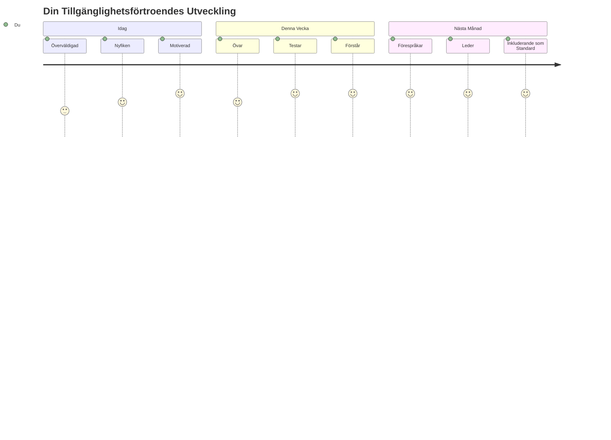
> 🌍 **Du är nu en tillgänglighetsmästare!** Du förstår att fantastiska webbupplevelser fungerar för alla, oavsett hur de får tillgång till webben. Varje tillgänglig funktion du bygger gör internet mer inkluderande. Webben behöver utvecklare som du som ser tillgänglighet inte som en begränsning, utan som en möjlighet att skapa bättre upplevelser för alla användare. Välkommen till rörelsen! 🎉

---

<!-- CO-OP TRANSLATOR DISCLAIMER START -->
**Ansvarsfriskrivning**:
Detta dokument har översatts med hjälp av AI-översättningstjänsten [Co-op Translator](https://github.com/Azure/co-op-translator). Även om vi strävar efter noggrannhet, vänligen notera att automatiska översättningar kan innehålla fel eller brister. Originaldokumentet på dess ursprungliga språk bör betraktas som den auktoritativa källan. För kritisk information rekommenderas professionell mänsklig översättning. Vi ansvarar inte för några missförstånd eller feltolkningar som uppstår till följd av användning av denna översättning.
<!-- CO-OP TRANSLATOR DISCLAIMER END -->