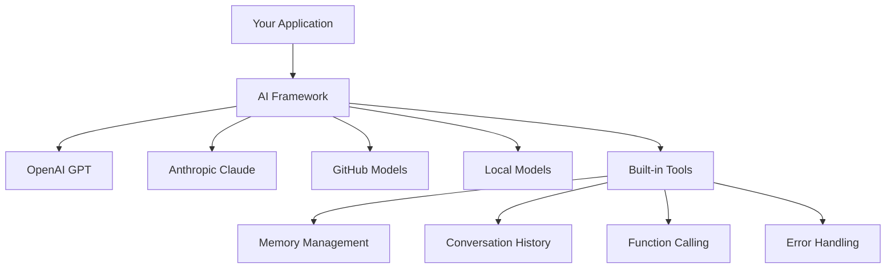
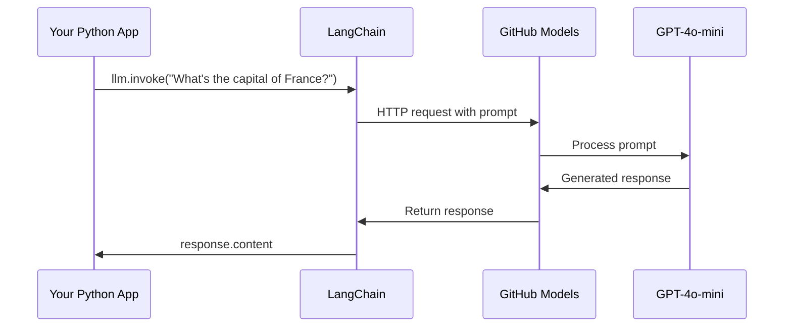
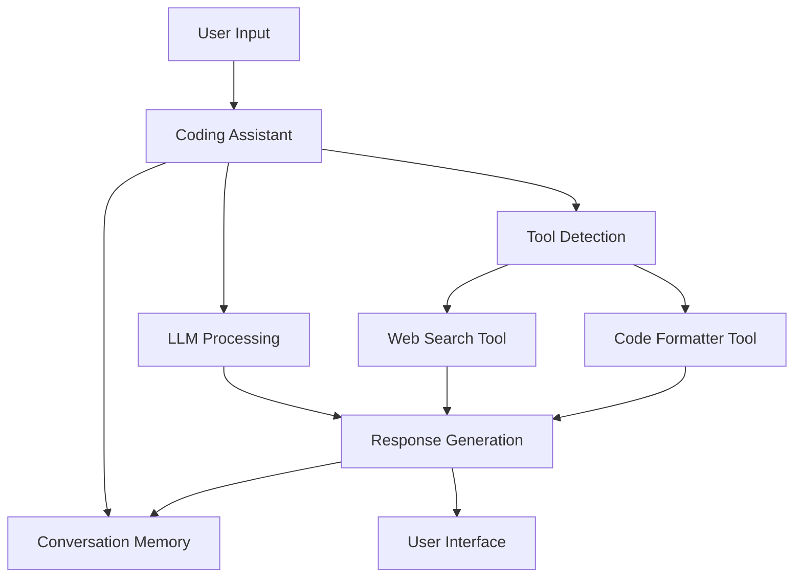
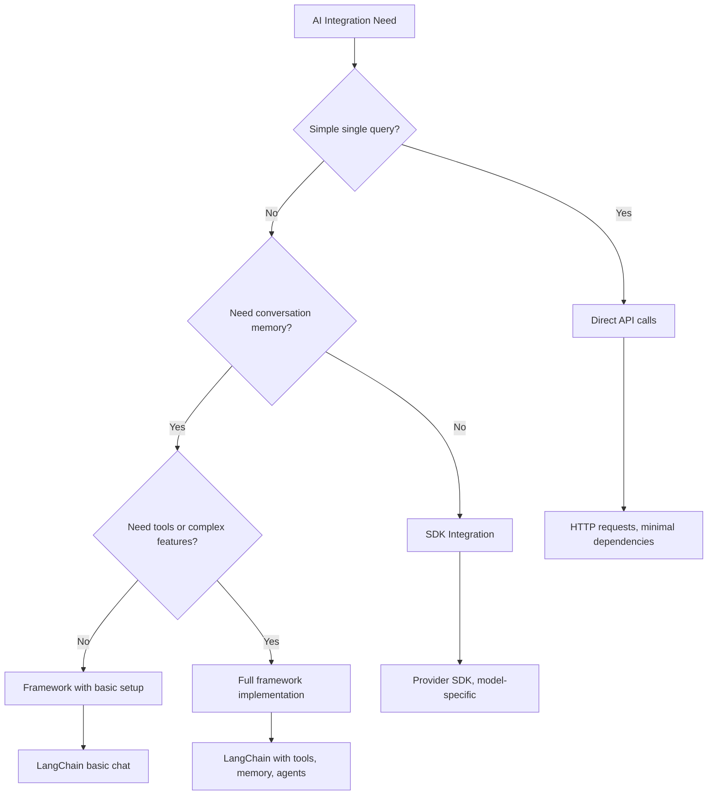

<!--
CO_OP_TRANSLATOR_METADATA:
{
  "original_hash": "e2c4ae5688e34b4b8b09d52aec56c79e",
  "translation_date": "2025-10-23T21:34:05+00:00",
  "source_file": "10-ai-framework-project/README.md",
  "language_code": "sv"
}
-->
# AI-ramverk

Har du någonsin känt dig överväldigad när du försöker bygga AI-applikationer från grunden? Du är inte ensam! AI-ramverk är som en schweizisk armékniv för AI-utveckling - kraftfulla verktyg som kan spara dig tid och huvudvärk när du bygger intelligenta applikationer. Tänk på ett AI-ramverk som ett välorganiserat bibliotek: det erbjuder färdigbyggda komponenter, standardiserade API:er och smarta abstraktioner så att du kan fokusera på att lösa problem istället för att brottas med implementeringsdetaljer.

I den här lektionen kommer vi att utforska hur ramverk som LangChain kan förvandla tidigare komplexa AI-integreringsuppgifter till ren och läsbar kod. Du kommer att upptäcka hur du kan hantera verkliga utmaningar som att hålla koll på konversationer, implementera verktygsanrop och jonglera olika AI-modeller genom ett enhetligt gränssnitt.

När vi är klara kommer du att veta när du ska använda ramverk istället för råa API-anrop, hur du använder deras abstraktioner effektivt och hur du bygger AI-applikationer som är redo för verklig användning. Låt oss utforska vad AI-ramverk kan göra för dina projekt.

## Varför välja ett ramverk?

Så du är redo att bygga en AI-app - fantastiskt! Men här är grejen: du har flera olika vägar att ta, och varje har sina egna för- och nackdelar. Det är lite som att välja mellan att gå, cykla eller köra bil för att komma någonstans - alla tar dig dit, men upplevelsen (och ansträngningen) kommer att vara helt olika.

Låt oss bryta ner de tre huvudsakliga sätten du kan integrera AI i dina projekt:

| Tillvägagångssätt | Fördelar | Bäst för | Överväganden |
|-------------------|----------|----------|--------------|
| **Direkta HTTP-anrop** | Full kontroll, inga beroenden | Enkla frågor, lära sig grunderna | Mer detaljerad kod, manuell felhantering |
| **SDK-integration** | Mindre boilerplate, modell-specifik optimering | Applikationer med en modell | Begränsad till specifika leverantörer |
| **AI-ramverk** | Enhetligt API, inbyggda abstraktioner | Appar med flera modeller, komplexa arbetsflöden | Inlärningskurva, potentiell över-abstraktion |

### Fördelar med ramverk i praktiken



**Varför ramverk är viktiga:**
- **Enhetliggör** flera AI-leverantörer under ett gränssnitt
- **Hantera** konversationsminne automatiskt
- **Tillhandahåller** färdiga verktyg för vanliga uppgifter som embeddings och funktionsanrop
- **Sköter** felhantering och återförsökslogik
- **Förvandlar** komplexa arbetsflöden till läsbara metodanrop

> 💡 **Proffstips**: Använd ramverk när du växlar mellan olika AI-modeller eller bygger komplexa funktioner som agenter, minne eller verktygsanrop. Håll dig till direkta API:er när du lär dig grunderna eller bygger enkla, fokuserade applikationer.

**Slutsats**: Precis som att välja mellan en hantverkares specialverktyg och en komplett verkstad handlar det om att matcha verktyget med uppgiften. Ramverk är utmärkta för komplexa, funktionsrika applikationer, medan direkta API:er fungerar bra för enkla användningsfall.

## Introduktion

I den här lektionen kommer vi att lära oss att:

- Använda ett vanligt AI-ramverk.
- Hantera vanliga problem som chattkonversationer, verktygsanvändning, minne och kontext.
- Utnyttja detta för att bygga AI-appar.

## Din första AI-prompt

Låt oss börja med grunderna genom att skapa din första AI-applikation som skickar en fråga och får ett svar tillbaka. Precis som Archimedes upptäckte principen om förskjutning i sitt badkar kan ibland de enklaste observationerna leda till de mest kraftfulla insikterna - och ramverk gör dessa insikter tillgängliga.

### Ställa in LangChain med GitHub-modeller

Vi ska använda LangChain för att ansluta till GitHub-modeller, vilket är riktigt bra eftersom det ger dig gratis tillgång till olika AI-modeller. Det bästa? Du behöver bara några enkla konfigurationsparametrar för att komma igång:

```python
from langchain_openai import ChatOpenAI
import os

llm = ChatOpenAI(
    api_key=os.environ["GITHUB_TOKEN"],
    base_url="https://models.github.ai/inference",
    model="openai/gpt-4o-mini",
)

# Send a simple prompt
response = llm.invoke("What's the capital of France?")
print(response.content)
```

**Låt oss bryta ner vad som händer här:**
- **Skapar** en LangChain-klient med klassen `ChatOpenAI` - detta är din port till AI!
- **Konfigurerar** anslutningen till GitHub-modeller med din autentiseringstoken
- **Anger** vilken AI-modell som ska användas (`gpt-4o-mini`) - tänk på detta som att välja din AI-assistent
- **Skickar** din fråga med metoden `invoke()` - här sker magin
- **Extraherar** och visar svaret - och voilà, du chattar med AI!

> 🔧 **Inställningsnotering**: Om du använder GitHub Codespaces har du tur - `GITHUB_TOKEN` är redan inställt för dig! Arbetar du lokalt? Ingen fara, du behöver bara skapa en personlig åtkomsttoken med rätt behörigheter.

**Förväntat resultat:**
```text
The capital of France is Paris.
```



## Bygga konverserande AI

Det första exemplet visar grunderna, men det är bara ett enda utbyte - du ställer en fråga, får ett svar och det är allt. I verkliga applikationer vill du att din AI ska komma ihåg vad ni har diskuterat, ungefär som hur Watson och Holmes byggde sina undersökande samtal över tid.

Det är här LangChain blir särskilt användbart. Det tillhandahåller olika meddelandetyper som hjälper till att strukturera konversationer och låter dig ge din AI en personlighet. Du kommer att bygga chattupplevelser som bibehåller kontext och karaktär.

### Förstå meddelandetyper

Tänk på dessa meddelandetyper som olika "roller" som deltagarna har i en konversation. LangChain använder olika meddelandeklasser för att hålla reda på vem som säger vad:

| Meddelandetyp | Syfte | Exempel på användning |
|---------------|-------|-----------------------|
| `SystemMessage` | Definierar AI:s personlighet och beteende | "Du är en hjälpsam kodningsassistent" |
| `HumanMessage` | Representerar användarinmatning | "Förklara hur funktioner fungerar" |
| `AIMessage` | Lagrar AI-svar | Tidigare AI-svar i konversationen |

### Skapa din första konversation

Låt oss skapa en konversation där vår AI antar en specifik roll. Vi låter den gestalta kapten Picard - en karaktär känd för sin diplomatiska visdom och ledarskap:

```python
messages = [
    SystemMessage(content="You are Captain Picard of the Starship Enterprise"),
    HumanMessage(content="Tell me about you"),
]
```

**Bryta ner denna konversationsinställning:**
- **Fastställer** AI:s roll och personlighet genom `SystemMessage`
- **Tillhandahåller** den initiala användarfrågan via `HumanMessage`
- **Skapar** en grund för flervägs-konversation

Den fullständiga koden för detta exempel ser ut så här:

```python
from langchain_core.messages import HumanMessage, SystemMessage
from langchain_openai import ChatOpenAI
import os

llm = ChatOpenAI(
    api_key=os.environ["GITHUB_TOKEN"],
    base_url="https://models.github.ai/inference",
    model="openai/gpt-4o-mini",
)

messages = [
    SystemMessage(content="You are Captain Picard of the Starship Enterprise"),
    HumanMessage(content="Tell me about you"),
]


# works
response  = llm.invoke(messages)
print(response.content)
```

Du bör se ett resultat som liknar:

```text
I am Captain Jean-Luc Picard, the commanding officer of the USS Enterprise (NCC-1701-D), a starship in the United Federation of Planets. My primary mission is to explore new worlds, seek out new life and new civilizations, and boldly go where no one has gone before. 

I believe in the importance of diplomacy, reason, and the pursuit of knowledge. My crew is diverse and skilled, and we often face challenges that test our resolve, ethics, and ingenuity. Throughout my career, I have encountered numerous species, grappled with complex moral dilemmas, and have consistently sought peaceful solutions to conflicts.

I hold the ideals of the Federation close to my heart, believing in the importance of cooperation, understanding, and respect for all sentient beings. My experiences have shaped my leadership style, and I strive to be a thoughtful and just captain. How may I assist you further?
```

För att bibehålla konversationskontinuitet (istället för att återställa kontext varje gång) måste du fortsätta lägga till svar i din meddelandelista. Precis som muntliga traditioner bevarade berättelser över generationer bygger detta en varaktig minnesbank:

```python
from langchain_core.messages import HumanMessage, SystemMessage
from langchain_openai import ChatOpenAI
import os

llm = ChatOpenAI(
    api_key=os.environ["GITHUB_TOKEN"],
    base_url="https://models.github.ai/inference",
    model="openai/gpt-4o-mini",
)

messages = [
    SystemMessage(content="You are Captain Picard of the Starship Enterprise"),
    HumanMessage(content="Tell me about you"),
]


# works
response  = llm.invoke(messages)

print(response.content)

print("---- Next ----")

messages.append(response)
messages.append(HumanMessage(content="Now that I know about you, I'm Chris, can I be in your crew?"))

response  = llm.invoke(messages)

print(response.content)

```

Ganska häftigt, eller hur? Vad som händer här är att vi anropar LLM två gånger - först med bara våra initiala två meddelanden, men sedan igen med hela konversationshistoriken. Det är som om AI faktiskt följer med i vår chatt!

När du kör denna kod får du ett andra svar som låter ungefär så här:

```text
Welcome aboard, Chris! It's always a pleasure to meet those who share a passion for exploration and discovery. While I cannot formally offer you a position on the Enterprise right now, I encourage you to pursue your aspirations. We are always in need of talented individuals with diverse skills and backgrounds. 

If you are interested in space exploration, consider education and training in the sciences, engineering, or diplomacy. The values of curiosity, resilience, and teamwork are crucial in Starfleet. Should you ever find yourself on a starship, remember to uphold the principles of the Federation: peace, understanding, and respect for all beings. Your journey can lead you to remarkable adventures, whether in the stars or on the ground. Engage!
```

Jag tar det som ett kanske ;)

## Strömmande svar

Har du någonsin märkt hur ChatGPT verkar "skriva" sina svar i realtid? Det är strömning i aktion. Precis som att se en skicklig kalligraf arbeta - att se tecken dyka upp streck för streck istället för att materialiseras direkt - gör strömning interaktionen mer naturlig och ger omedelbar feedback.

### Implementera strömning med LangChain

```python
from langchain_openai import ChatOpenAI
import os

llm = ChatOpenAI(
    api_key=os.environ["GITHUB_TOKEN"],
    base_url="https://models.github.ai/inference",
    model="openai/gpt-4o-mini",
    streaming=True
)

# Stream the response
for chunk in llm.stream("Write a short story about a robot learning to code"):
    print(chunk.content, end="", flush=True)
```

**Varför strömning är fantastiskt:**
- **Visar** innehåll medan det skapas - ingen mer pinsam väntan!
- **Får** användare att känna att något faktiskt händer
- **Känns** snabbare, även när det tekniskt sett inte är det
- **Låter** användare börja läsa medan AI fortfarande "tänker"

> 💡 **Användarupplevelsetips**: Strömning är verkligen användbart när du hanterar längre svar som kodförklaringar, kreativt skrivande eller detaljerade handledningar. Dina användare kommer att älska att se framsteg istället för att stirra på en tom skärm!

## Promptmallar

Promptmallar fungerar som de retoriska strukturer som användes i klassisk retorik - tänk på hur Cicero skulle anpassa sina talmönster för olika publiker samtidigt som han behöll samma övertygande ramverk. De låter dig skapa återanvändbara prompts där du kan byta ut olika informationsdelar utan att behöva skriva om allt från början. När du har ställt in mallen fyller du bara i variablerna med de värden du behöver.

### Skapa återanvändbara prompts

```python
from langchain_core.prompts import ChatPromptTemplate

# Define a template for code explanations
template = ChatPromptTemplate.from_messages([
    ("system", "You are an expert programming instructor. Explain concepts clearly with examples."),
    ("human", "Explain {concept} in {language} with a practical example for {skill_level} developers")
])

# Use the template with different values
questions = [
    {"concept": "functions", "language": "JavaScript", "skill_level": "beginner"},
    {"concept": "classes", "language": "Python", "skill_level": "intermediate"},
    {"concept": "async/await", "language": "JavaScript", "skill_level": "advanced"}
]

for question in questions:
    prompt = template.format_messages(**question)
    response = llm.invoke(prompt)
    print(f"Topic: {question['concept']}\n{response.content}\n---\n")
```

**Varför du kommer att älska att använda mallar:**
- **Håller** dina prompts konsekventa över hela din app
- **Ingen mer** rörig strängkonkatenering - bara rena, enkla variabler
- **Din AI** beter sig förutsägbart eftersom strukturen förblir densamma
- **Uppdateringar** är enkla - ändra mallen en gång, och det är fixat överallt

## Strukturerad output

Har du någonsin blivit frustrerad över att försöka tolka AI-svar som kommer tillbaka som ostrukturerad text? Strukturerad output är som att lära din AI att följa det systematiska tillvägagångssätt som Linné använde för biologisk klassificering - organiserat, förutsägbart och lätt att arbeta med. Du kan begära JSON, specifika datastrukturer eller vilket format du behöver.

### Definiera output-scheman

```python
from langchain_core.prompts import ChatPromptTemplate
from langchain_core.output_parsers import JsonOutputParser
from pydantic import BaseModel, Field

class CodeReview(BaseModel):
    score: int = Field(description="Code quality score from 1-10")
    strengths: list[str] = Field(description="List of code strengths")
    improvements: list[str] = Field(description="List of suggested improvements")
    overall_feedback: str = Field(description="Summary feedback")

# Set up the parser
parser = JsonOutputParser(pydantic_object=CodeReview)

# Create prompt with format instructions
prompt = ChatPromptTemplate.from_messages([
    ("system", "You are a code reviewer. {format_instructions}"),
    ("human", "Review this code: {code}")
])

# Format the prompt with instructions
chain = prompt | llm | parser

# Get structured response
code_sample = """
def calculate_average(numbers):
    return sum(numbers) / len(numbers)
"""

result = chain.invoke({
    "code": code_sample,
    "format_instructions": parser.get_format_instructions()
})

print(f"Score: {result['score']}")
print(f"Strengths: {', '.join(result['strengths'])}")
```

**Varför strukturerad output är en game-changer:**
- **Ingen mer** gissning om vilket format du får tillbaka - det är konsekvent varje gång
- **Pluggar** direkt in i dina databaser och API:er utan extra arbete
- **Fångar** konstiga AI-svar innan de förstör din app
- **Gör** din kod renare eftersom du vet exakt vad du arbetar med

## Verktygsanrop

Nu når vi en av de mest kraftfulla funktionerna: verktyg. Det är så du ger din AI praktiska förmågor utöver konversation. Precis som hur medeltida skrån utvecklade specialverktyg för specifika hantverk kan du utrusta din AI med fokuserade instrument. Du beskriver vilka verktyg som är tillgängliga, och när någon begär något som matchar kan din AI agera.

### Använda Python

Låt oss lägga till några verktyg så här:

```python
from typing_extensions import Annotated, TypedDict

class add(TypedDict):
    """Add two integers."""

    # Annotations must have the type and can optionally include a default value and description (in that order).
    a: Annotated[int, ..., "First integer"]
    b: Annotated[int, ..., "Second integer"]

tools = [add]

functions = {
    "add": lambda a, b: a + b
}
```

Så vad händer här? Vi skapar en ritning för ett verktyg som heter `add`. Genom att ärva från `TypedDict` och använda de snygga `Annotated`-typerna för `a` och `b` ger vi LLM en tydlig bild av vad detta verktyg gör och vad det behöver. Ordboken `functions` är som vår verktygslåda - den berättar för vår kod exakt vad den ska göra när AI bestämmer sig för att använda ett specifikt verktyg.

Låt oss se hur vi anropar LLM med detta verktyg nästa:

```python
llm = ChatOpenAI(
    api_key=os.environ["GITHUB_TOKEN"],
    base_url="https://models.github.ai/inference",
    model="openai/gpt-4o-mini",
)

llm_with_tools = llm.bind_tools(tools)
```

Här anropar vi `bind_tools` med vår array `tools` och därmed har LLM `llm_with_tools` nu kunskap om detta verktyg.

För att använda denna nya LLM kan vi skriva följande kod:

```python
query = "What is 3 + 12?"

res = llm_with_tools.invoke(query)
if(res.tool_calls):
    for tool in res.tool_calls:
        print("TOOL CALL: ", functions[tool["name"]](../../../10-ai-framework-project/**tool["args"]))
print("CONTENT: ",res.content)
```

Nu när vi anropar `invoke` på denna nya LLM, som har verktyg, kanske egenskapen `tool_calls` fylls i. Om så är fallet har alla identifierade verktyg en egenskap `name` och `args` som identifierar vilket verktyg som ska anropas och med vilka argument. Den fullständiga koden ser ut så här:

```python
from langchain_core.messages import HumanMessage, SystemMessage
from langchain_openai import ChatOpenAI
import os
from typing_extensions import Annotated, TypedDict

class add(TypedDict):
    """Add two integers."""

    # Annotations must have the type and can optionally include a default value and description (in that order).
    a: Annotated[int, ..., "First integer"]
    b: Annotated[int, ..., "Second integer"]

tools = [add]

functions = {
    "add": lambda a, b: a + b
}

llm = ChatOpenAI(
    api_key=os.environ["GITHUB_TOKEN"],
    base_url="https://models.github.ai/inference",
    model="openai/gpt-4o-mini",
)

llm_with_tools = llm.bind_tools(tools)

query = "What is 3 + 12?"

res = llm_with_tools.invoke(query)
if(res.tool_calls):
    for tool in res.tool_calls:
        print("TOOL CALL: ", functions[tool["name"]](../../../10-ai-framework-project/**tool["args"]))
print("CONTENT: ",res.content)
```

När du kör denna kod bör du se ett resultat som liknar:

```text
TOOL CALL:  15
CONTENT: 
```

AI undersökte "Vad är 3 + 12" och insåg att detta var en uppgift för verktyget `add`. Precis som hur en skicklig bibliotekarie vet vilken referens som ska konsulteras baserat på typen av fråga, gjorde den denna bedömning utifrån verktygets namn, beskrivning och fältspecifikationer. Resultatet 15 kommer från vår ordbok `functions` som utför verktyget:

```python
print("TOOL CALL: ", functions[tool["name"]](../../../10-ai-framework-project/**tool["args"]))
```

### Ett mer intressant verktyg som anropar ett webb-API

Att lägga till siffror demonstrerar konceptet, men riktiga verktyg utför vanligtvis mer komplexa operationer, som att anropa webb-API:er. Låt oss utöka vårt exempel för att låta AI hämta innehåll från internet - liknande hur telegrafoperatörer en gång kopplade avlägsna platser:

```python
class joke(TypedDict):
    """Tell a joke."""

    # Annotations must have the type and can optionally include a default value and description (in that order).
    category: Annotated[str, ..., "The joke category"]

def get_joke(category: str) -> str:
    response = requests.get(f"https://api.chucknorris.io/jokes/random?category={category}", headers={"Accept": "application/json"})
    if response.status_code == 200:
        return response.json().get("value", f"Here's a {category} joke!")
    return f"Here's a {category} joke!"

functions = {
    "add": lambda a, b: a + b,
    "joke": lambda category: get_joke(category)
}

query = "Tell me a joke about animals"

# the rest of the code is the same
```

Nu om du kör denna kod får du ett svar som säger något i stil med:

```text
TOOL CALL:  Chuck Norris once rode a nine foot grizzly bear through an automatic car wash, instead of taking a shower.
CONTENT:  
```

Här är koden i sin helhet:

```python
from langchain_openai import ChatOpenAI
import requests
import os
from typing_extensions import Annotated, TypedDict

class add(TypedDict):
    """Add two integers."""

    # Annotations must have the type and can optionally include a default value and description (in that order).
    a: Annotated[int, ..., "First integer"]
    b: Annotated[int, ..., "Second integer"]

class joke(TypedDict):
    """Tell a joke."""

    # Annotations must have the type and can optionally include a default value and description (in that order).
    category: Annotated[str, ..., "The joke category"]

tools = [add, joke]

def get_joke(category: str) -> str:
    response = requests.get(f"https://api.chucknorris.io/jokes/random?category={category}", headers={"Accept": "application/json"})
    if response.status_code == 200:
        return response.json().get("value", f"Here's a {category} joke!")
    return f"Here's a {category} joke!"

functions = {
    "add": lambda a, b: a + b,
    "joke": lambda category: get_joke(category)
}

llm = ChatOpenAI(
    api_key=os.environ["GITHUB_TOKEN"],
    base_url="https://models.github.ai/inference",
    model="openai/gpt-4o-mini",
)

llm_with_tools = llm.bind_tools(tools)

query = "Tell me a joke about animals"

res = llm_with_tools.invoke(query)
if(res.tool_calls):
    for tool in res.tool_calls:
        # print("TOOL CALL: ", tool)
        print("TOOL CALL: ", functions[tool["name"]](../../../10-ai-framework-project/**tool["args"]))
print("CONTENT: ",res.content)
```

## Embeddings och dokumentbearbetning

Embeddings representerar en av de mest eleganta lösningarna inom modern AI. Tänk dig att du kan ta vilken text som helst och konvertera den till numeriska koordinater som fångar dess betydelse. Det är precis vad embeddings gör - de omvandlar text till punkter i ett multidimensionellt rum där liknande koncept klustrar sig tillsammans. Det är som att ha ett koordinatsystem för idéer, påminnande om hur Mendelejev organiserade det periodiska systemet efter atomära egenskaper.

### Skapa och använda embeddings

```python
from langchain_openai import OpenAIEmbeddings
from langchain_community.vectorstores import FAISS
from langchain_community.document_loaders import TextLoader
from langchain.text_splitter import CharacterTextSplitter

# Initialize embeddings
embeddings = OpenAIEmbeddings(
    api_key=os.environ["GITHUB_TOKEN"],
    base_url="https://models.github.ai/inference",
    model="text-embedding-3-small"
)

# Load and split documents
loader = TextLoader("documentation.txt")
documents = loader.load()

text_splitter = CharacterTextSplitter(chunk_size=1000, chunk_overlap=0)
texts = text_splitter.split_documents(documents)

# Create vector store
vectorstore = FAISS.from_documents(texts, embeddings)

# Perform similarity search
query = "How do I handle user authentication?"
similar_docs = vectorstore.similarity_search(query, k=3)

for doc in similar_docs:
    print(f"Relevant content: {doc.page_content[:200]}...")
```

### Dokumentladdare för olika format

```python
from langchain_community.document_loaders import (
    PyPDFLoader,
    CSVLoader,
    JSONLoader,
    WebBaseLoader
)

# Load different document types
pdf_loader = PyPDFLoader("manual.pdf")
csv_loader = CSVLoader("data.csv")
json_loader = JSONLoader("config.json")
web_loader = WebBaseLoader("https://example.com/docs")

# Process all documents
all_documents = []
for loader in [pdf_loader, csv_loader, json_loader, web_loader]:
    docs = loader.load()
    all_documents.extend(docs)
```

**Vad du kan göra med embeddings:**
- **Bygg** sökfunktioner som faktiskt förstår vad du menar, inte bara nyckelordsmatchning
- **Skapa** AI som kan svara på frågor om dina dokument
- **Gör** rekommendationssystem som föreslår verkligen relevant innehåll
- **Organisera** och kategorisera ditt innehåll automatiskt

## Bygga en komplett AI-applikation

Nu ska vi integrera allt du har lärt dig i en omfattande applikation - en kodningsassistent som kan svara på frågor, använda verktyg och bibehålla konversationsminne. Precis som hur tryckpressen kombinerade befintliga teknologier (rörliga typer, bläck, papper och tryck) till något transformativt, kommer vi att kombinera våra AI-komponenter till något praktiskt och användbart.

### Komplett applikationsexempel

```python
from langchain_openai import ChatOpenAI, OpenAIEmbeddings
from langchain_core.prompts import ChatPromptTemplate
from langchain_core.messages import HumanMessage, SystemMessage, AIMessage
from langchain_community.vectorstores import FAISS
from typing_extensions import Annotated, TypedDict
import os
import requests

class CodingAssistant:
    def __init__(self):
        self.llm = ChatOpenAI(
            api_key=os.environ["GITHUB_TOKEN"],
            base_url="https://models.github.ai/inference",
            model="openai/gpt-4o-mini"
        )
        
        self.conversation_history = [
            SystemMessage(content="""You are an expert coding assistant. 
            Help users learn programming concepts, debug code, and write better software.
            Use tools when needed and maintain a helpful, encouraging tone.""")
        ]
        
        # Define tools
        self.setup_tools()
    
    def setup_tools(self):
        class web_search(TypedDict):
            """Search for programming documentation or examples."""
            query: Annotated[str, "Search query for programming help"]
        
        class code_formatter(TypedDict):
            """Format and validate code snippets."""
            code: Annotated[str, "Code to format"]
            language: Annotated[str, "Programming language"]
        
        self.tools = [web_search, code_formatter]
        self.llm_with_tools = self.llm.bind_tools(self.tools)
    
    def chat(self, user_input: str):
        # Add user message to conversation
        self.conversation_history.append(HumanMessage(content=user_input))
        
        # Get AI response
        response = self.llm_with_tools.invoke(self.conversation_history)
        
        # Handle tool calls if any
        if response.tool_calls:
            for tool_call in response.tool_calls:
                tool_result = self.execute_tool(tool_call)
                print(f"🔧 Tool used: {tool_call['name']}")
                print(f"📊 Result: {tool_result}")
        
        # Add AI response to conversation
        self.conversation_history.append(response)
        
        return response.content
    
    def execute_tool(self, tool_call):
        tool_name = tool_call['name']
        args = tool_call['args']
        
        if tool_name == 'web_search':
            return f"Found documentation for: {args['query']}"
        elif tool_name == 'code_formatter':
            return f"Formatted {args['language']} code: {args['code'][:50]}..."
        
        return "Tool execution completed"

# Usage example
assistant = CodingAssistant()

print("🤖 Coding Assistant Ready! Type 'quit' to exit.\n")

while True:
    user_input = input("You: ")
    if user_input.lower() == 'quit':
        break
    
    response = assistant.chat(user_input)
    print(f"🤖 Assistant: {response}\n")
```

**Applikationsarkitektur:**



**Nyckelfunktioner vi har implementerat:**
- **Kommer ihåg** hela din konversation för kontextkontinuitet
- **Utför åtgärder** genom verktygsanrop, inte bara konversation
- **Följer** förutsägbara interaktionsmönster
- **Hantera** felhantering och komplexa arbetsflöden automatiskt

## Uppgift: Bygg din egen AI-drivna studieassistent

**Mål**: Skapa en AI-applikation som hjälper studenter att lära sig programmeringskoncept genom att tillhandahålla förklaringar, kodexempel och interaktiva frågesporter.

### Krav

**Kärnfunktioner (Obligatoriska):**
1. **Konversationsgränssnitt**: Implementera ett chattsystem som bibehåller kontext över flera frågor
2. **Utbildningsverktyg**: Skapa minst två verktyg som hjälper till med lärande:
   - Verktyg för kodförklaringar
   - Generator för konceptfrågesporter
3. **Personanpassat lärande**: Använd systemmeddelanden för att anpassa svar till olika kunskapsnivåer  
4. **Svarformat**: Implementera strukturerad output för quizfrågor  

### Implementeringssteg  

**Steg 1: Ställ in din miljö**  
```bash
pip install langchain langchain-openai
```
  
**Steg 2: Grundläggande chattfunktionalitet**  
- Skapa en `StudyAssistant`-klass  
- Implementera konversationsminne  
- Lägg till personlighetskonfiguration för pedagogiskt stöd  

**Steg 3: Lägg till utbildningsverktyg**  
- **Kodförklarare**: Bryter ner kod i förståeliga delar  
- **Quizgenerator**: Skapar frågor om programmeringskoncept  
- **Framstegsspårare**: Håller koll på täckta ämnen  

**Steg 4: Förbättrade funktioner (valfritt)**  
- Implementera strömmande svar för bättre användarupplevelse  
- Lägg till dokumentladdning för att integrera kursmaterial  
- Skapa embeddings för innehållsbaserad likhetsåtervinning  

### Utvärderingskriterier  

| Funktion | Utmärkt (4) | Bra (3) | Tillfredsställande (2) | Behöver förbättras (1) |  
|----------|-------------|---------|------------------------|------------------------|  
| **Konversationsflöde** | Naturliga, kontextmedvetna svar | Bra kontextbevarande | Grundläggande konversation | Ingen minnesfunktion mellan utbyten |  
| **Verktygsintegration** | Flera användbara verktyg som fungerar sömlöst | 2+ verktyg implementerade korrekt | 1-2 grundläggande verktyg | Verktyg fungerar inte |  
| **Kodkvalitet** | Ren, väl dokumenterad, felhantering | Bra struktur, viss dokumentation | Grundläggande funktionalitet fungerar | Dålig struktur, ingen felhantering |  
| **Pedagogiskt värde** | Verkligt hjälpsam för lärande, anpassningsbar | Bra stöd för lärande | Grundläggande förklaringar | Begränsad pedagogisk nytta |  

### Exempel på kodstruktur  

```python
class StudyAssistant:
    def __init__(self, skill_level="beginner"):
        # Initialize LLM, tools, and conversation memory
        pass
    
    def explain_code(self, code, language):
        # Tool: Explain how code works
        pass
    
    def generate_quiz(self, topic, difficulty):
        # Tool: Create practice questions
        pass
    
    def chat(self, user_input):
        # Main conversation interface
        pass

# Example usage
assistant = StudyAssistant(skill_level="intermediate")
response = assistant.chat("Explain how Python functions work")
```
  
**Bonusutmaningar:**  
- Lägg till röstinmatning/utmatning  
- Implementera ett webbgränssnitt med Streamlit eller Flask  
- Skapa en kunskapsbas från kursmaterial med hjälp av embeddings  
- Lägg till framstegsspårning och personanpassade lärvägar  

## Sammanfattning  

🎉 Du har nu bemästrat grunderna i AI-ramverksutveckling och lärt dig hur man bygger sofistikerade AI-applikationer med LangChain. Som att avsluta en omfattande lärlingsutbildning har du skaffat dig en gedigen verktygslåda med färdigheter. Låt oss sammanfatta vad du har åstadkommit.  

### Vad du har lärt dig  

**Grundläggande ramverkskoncept:**  
- **Fördelar med ramverk**: Förstå när det är bäst att välja ramverk framför direkta API-anrop  
- **Grunderna i LangChain**: Ställa in och konfigurera AI-modellanslutningar  
- **Meddelandetyper**: Använda `SystemMessage`, `HumanMessage` och `AIMessage` för strukturerade konversationer  

**Avancerade funktioner:**  
- **Verktygsanrop**: Skapa och integrera anpassade verktyg för förbättrade AI-funktioner  
- **Konversationsminne**: Bibehålla kontext över flera konversationsvändningar  
- **Strömmande svar**: Implementera realtidsleverans av svar  
- **Promptmallar**: Bygga återanvändbara, dynamiska prompts  
- **Strukturerad output**: Säkerställa konsekventa, parsbara AI-svar  
- **Embeddings**: Skapa semantisk sökning och dokumentbearbetningsmöjligheter  

**Praktiska tillämpningar:**  
- **Bygga kompletta appar**: Kombinera flera funktioner till produktionsklara applikationer  
- **Felhantering**: Implementera robust felhantering och validering  
- **Verktygsintegration**: Skapa anpassade verktyg som utökar AI-funktioner  

### Viktiga insikter  

> 🎯 **Kom ihåg**: AI-ramverk som LangChain är i princip dina komplexitetsskyddande, funktionspackade bästa vänner. De är perfekta när du behöver konversationsminne, verktygsanrop eller vill arbeta med flera AI-modeller utan att bli galen.  

**Beslutsramverk för AI-integration:**  


  
### Vad gör du härnäst?  

**Börja bygga direkt:**  
- Ta dessa koncept och bygg något som inspirerar DIG!  
- Experimentera med olika AI-modeller via LangChain - det är som en lekplats för AI-modeller  
- Skapa verktyg som löser verkliga problem du stöter på i ditt arbete eller dina projekt  

**Redo för nästa nivå?**  
- **AI-agenter**: Bygg AI-system som faktiskt kan planera och utföra komplexa uppgifter på egen hand  
- **RAG (Retrieval-Augmented Generation)**: Kombinera AI med dina egna kunskapsbaser för superkraftiga applikationer  
- **Multimodal AI**: Arbeta med text, bilder och ljud tillsammans - möjligheterna är oändliga!  
- **Produktionsimplementering**: Lär dig hur du skalar dina AI-appar och övervakar dem i verkligheten  

**Gå med i gemenskapen:**  
- LangChain-gemenskapen är fantastisk för att hålla sig uppdaterad och lära sig bästa praxis  
- GitHub Models ger dig tillgång till den senaste AI-kapaciteten - perfekt för experimentering  
- Fortsätt att öva med olika användningsområden - varje projekt lär dig något nytt  

Du har nu kunskapen att bygga intelligenta, konversationsapplikationer som kan hjälpa människor att lösa verkliga problem. Precis som renässansens hantverkare som kombinerade konstnärlig vision med teknisk skicklighet, kan du nu förena AI-funktioner med praktisk tillämpning. Frågan är: vad kommer du att skapa? 🚀  

## GitHub Copilot Agent-utmaning 🚀  

Använd Agent-läget för att slutföra följande utmaning:  

**Beskrivning:** Bygg en avancerad AI-driven kodgranskningsassistent som kombinerar flera LangChain-funktioner inklusive verktygsanrop, strukturerad output och konversationsminne för att ge omfattande feedback på kodinlämningar.  

**Prompt:** Skapa en CodeReviewAssistant-klass som implementerar:  
1. Ett verktyg för att analysera kodens komplexitet och föreslå förbättringar  
2. Ett verktyg för att kontrollera kod mot bästa praxis  
3. Strukturerad output med Pydantic-modeller för konsekvent granskningsformat  
4. Konversationsminne för att spåra granskningssessioner  
5. Ett huvudchattgränssnitt som kan hantera kodinlämningar och ge detaljerad, handlingsbar feedback  

Assistenten ska kunna granska kod i flera programmeringsspråk, bibehålla kontext över flera kodinlämningar i en session och ge både sammanfattande poäng och detaljerade förbättringsförslag.  

Läs mer om [agent mode](https://code.visualstudio.com/blogs/2025/02/24/introducing-copilot-agent-mode) här.  

---

**Ansvarsfriskrivning**:  
Detta dokument har översatts med hjälp av AI-översättningstjänsten [Co-op Translator](https://github.com/Azure/co-op-translator). Även om vi strävar efter noggrannhet, bör det noteras att automatiserade översättningar kan innehålla fel eller felaktigheter. Det ursprungliga dokumentet på dess ursprungliga språk bör betraktas som den auktoritativa källan. För kritisk information rekommenderas professionell mänsklig översättning. Vi ansvarar inte för eventuella missförstånd eller feltolkningar som uppstår vid användning av denna översättning.