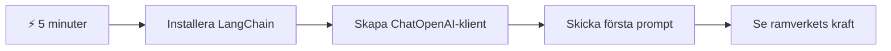
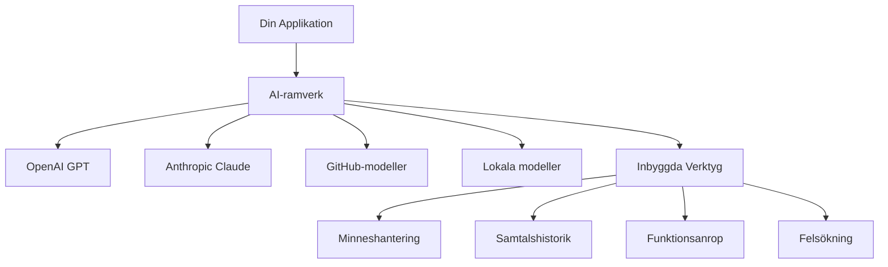
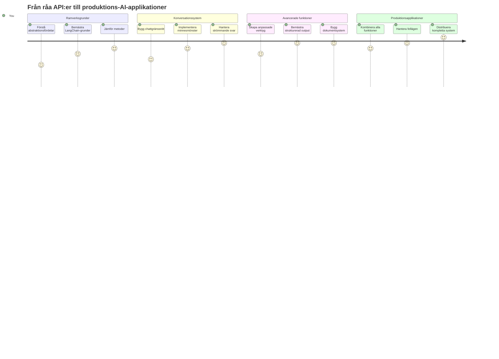
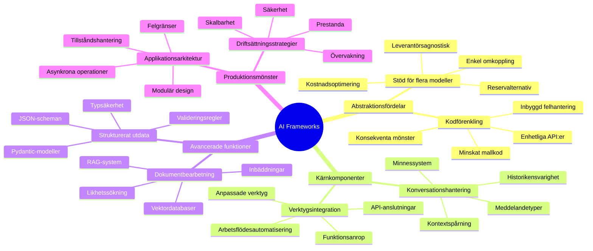
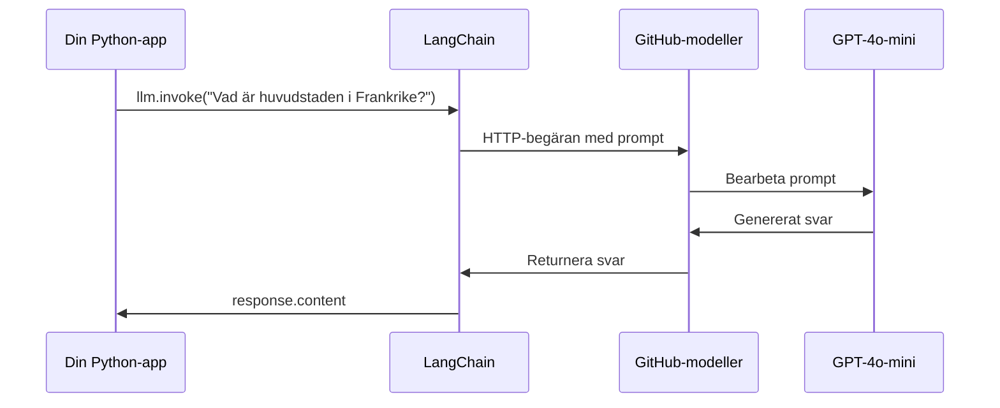
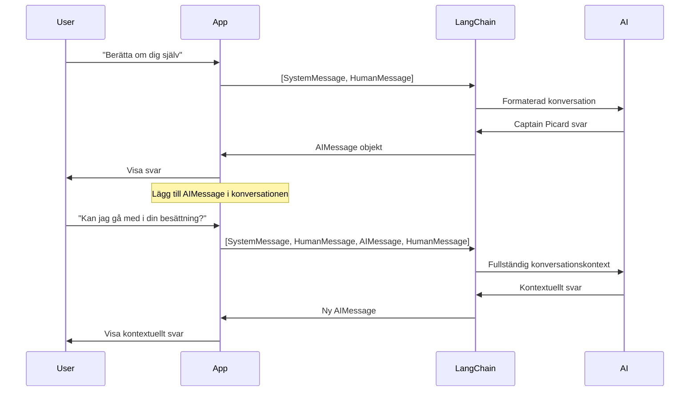
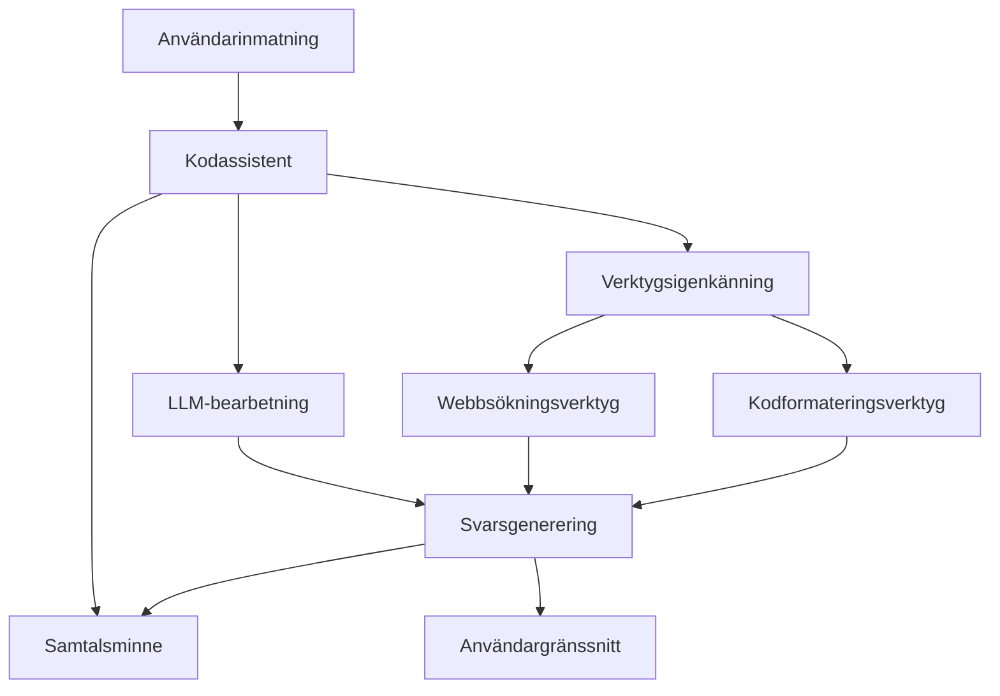
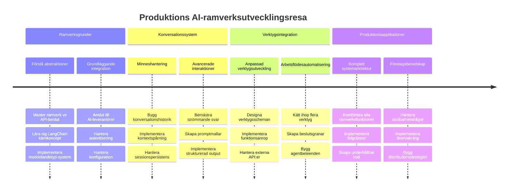
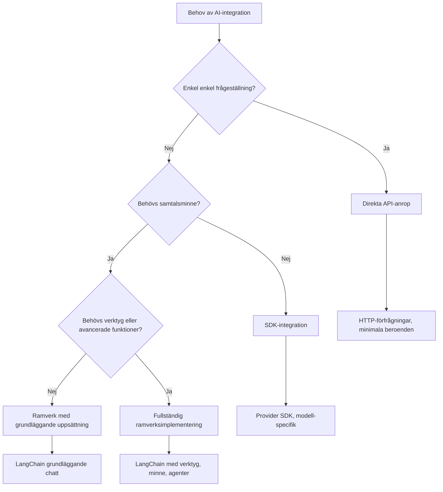

<!--
CO_OP_TRANSLATOR_METADATA:
{
  "original_hash": "3925b6a1c31c60755eaae4d578232c25",
  "translation_date": "2026-01-06T22:29:41+00:00",
  "source_file": "10-ai-framework-project/README.md",
  "language_code": "sv"
}
-->
# AI-ramverk

Har du någonsin känt dig överväldigad när du försökt bygga AI-applikationer från grunden? Du är inte ensam! AI-ramverk är som en schweizisk armékniv för AI-utveckling - de är kraftfulla verktyg som kan spara dig tid och huvudvärk när du bygger intelligenta applikationer. Tänk på ett AI-ramverk som ett välorganiserat bibliotek: det tillhandahåller färdiga komponenter, standardiserade API:er och smarta abstraktioner så att du kan fokusera på att lösa problem istället för att kämpa med implementationsdetaljer.

I den här lektionen ska vi utforska hur ramverk som LangChain kan förvandla vad som tidigare var komplexa AI-integrationsuppgifter till ren, läsbar kod. Du kommer att upptäcka hur du hanterar verkliga utmaningar som att hålla reda på konversationer, implementera verktygsanrop och jonglera olika AI-modeller genom ett enhetligt gränssnitt.

När vi är klara kommer du att veta när du ska använda ramverk istället för råa API-anrop, hur du använder deras abstraktioner effektivt, och hur du bygger AI-applikationer som är redo för verklig användning. Låt oss utforska vad AI-ramverk kan göra för dina projekt.

## ⚡ Vad du kan göra på nästa 5 minuter

**Snabbstartsväg för upptagna utvecklare**


- **Minut 1**: Installera LangChain: `pip install langchain langchain-openai`
- **Minut 2**: Ställ in din GitHub-token och importera ChatOpenAI-klienten
- **Minut 3**: Skapa en enkel konversation med system- och människomeddelanden
- **Minut 4**: Lägg till ett grundläggande verktyg (som en add-funktion) och se AI:s verktygsanrop
- **Minut 5**: Upplev skillnaden mellan råa API-anrop och ramverksabstraktion

**Snabb testkod**:
```python
from langchain_openai import ChatOpenAI
from langchain_core.messages import SystemMessage, HumanMessage

llm = ChatOpenAI(
    api_key=os.environ["GITHUB_TOKEN"],
    base_url="https://models.github.ai/inference",
    model="openai/gpt-4o-mini"
)

response = llm.invoke([
    SystemMessage(content="You are a helpful coding assistant"),
    HumanMessage(content="Explain Python functions briefly")
])
print(response.content)
```

**Varför detta är viktigt**: På 5 minuter kommer du att uppleva hur AI-ramverk förvandlar komplex AI-integration till enkla metodanrop. Detta är grunden som driver produktionsklara AI-applikationer.

## Varför välja ett ramverk?

Så du är redo att bygga en AI-app - fantastiskt! Men här är saken: du har flera olika vägar att ta, och varje har sina för- och nackdelar. Det är lite som att välja mellan att gå, cykla eller köra bil för att ta sig någonstans - alla tar dig dit, men upplevelsen (och ansträngningen) blir helt annorlunda.

Låt oss bryta ner de tre huvudsakliga sätten du kan integrera AI i dina projekt:

| Tillvägagångssätt | Fördelar | Passar bäst för | Överväganden |
|-------------------|----------|-----------------|--------------|
| **Direkta HTTP-förfrågningar** | Full kontroll, inga beroenden | Enkla förfrågningar, lära sig grunderna | Mer omständlig kod, manuell felhantering |
| **SDK-integration** | Mindre boilerplate, modell-specifik optimering | Applikationer med en modell | Begränsad till specifika leverantörer |
| **AI-ramverk** | Enhetligt API, inbyggda abstraktioner | Applikationer med flera modeller, komplexa arbetsflöden | Inlärningskurva, potentiell över-abstraktion |

### Ramverkets fördelar i praktiken


**Varför ramverk är viktiga:**
- **Samlar** flera AI-leverantörer under ett gränssnitt
- **Hanterar** konversationsminne automatiskt
- **Tillhandahåller** färdiga verktyg för vanliga uppgifter som inbäddningar och funktionsanrop
- **Sköter** felhantering och repetitionslogik
- **Förvandlar** komplexa arbetsflöden till läsbara metodanrop

> 💡 **Proftips**: Använd ramverk när du byter mellan olika AI-modeller eller bygger komplexa funktioner som agenter, minne eller verktygsanrop. Håll dig till direkta API:er när du lär dig grunderna eller bygger enkla, fokuserade applikationer.

**Slutsatsen**: Som att välja mellan en hantverkares specialverktyg och en komplett verkstad handlar det om att matcha verktyget med uppgiften. Ramverk är bäst för komplexa, funktionsrika applikationer, medan direkta API:er fungerar bra för enkla användningsfall.

## 🗺️ Din läranderesa genom AI-ramverksmästerskap


**Din resas mål**: I slutet av denna lektion kommer du att ha behärskat AI-ramverksutveckling och kunna bygga sofistikerade, produktionsklara AI-applikationer som kan mäta sig med kommersiella AI-assistenter.

## Introduktion

I denna lektion ska vi lära oss att:

- Använda ett vanligt AI-ramverk.
- Hantera vanliga problem som chattkonversationer, verktygsanvändning, minne och kontext.
- Utnyttja detta för att bygga AI-appar.

## 🧠 AI-ramverksutvecklings-ekosystem


**Kärnprincip**: AI-ramverk abstraherar komplexitet samtidigt som de tillhandahåller kraftfulla abstraktioner för konversationshantering, verktygsintegration och dokumentbearbetning, vilket gör det möjligt för utvecklare att bygga sofistikerade AI-applikationer med ren, underhållbar kod.

## Din första AI-prompt

Låt oss börja med grunderna genom att skapa din första AI-applikation som skickar en fråga och får ett svar tillbaka. Som Archimedes som upptäckte principen om förskjutning i sitt badkar, leder ibland de enklaste observationerna till de mest kraftfulla insikterna - och ramverk gör dessa insikter tillgängliga.

### Ställa in LangChain med GitHub Models

Vi ska använda LangChain för att koppla till GitHub Models, vilket är ganska bra eftersom det ger dig gratis tillgång till olika AI-modeller. Det bästa? Du behöver bara några enkla konfigurationsparametrar för att komma igång:

```python
from langchain_openai import ChatOpenAI
import os

llm = ChatOpenAI(
    api_key=os.environ["GITHUB_TOKEN"],
    base_url="https://models.github.ai/inference",
    model="openai/gpt-4o-mini",
)

# Skicka en enkel uppmaning
response = llm.invoke("What's the capital of France?")
print(response.content)
```

**Låt oss bryta ner vad som händer här:**
- **Skapar** en LangChain-klient med `ChatOpenAI`-klassen - detta är din port till AI!
- **Konfigurerar** anslutningen till GitHub Models med din autentiseringstoken
- **Specificerar** vilken AI-modell som ska användas (`gpt-4o-mini`) - tänk på detta som att välja din AI-assistent
- **Skickar** din fråga med `invoke()`-metoden - här händer magin
- **Extraherar** och visar svaret - och voilà, du chattar med AI!

> 🔧 **Installationsnotering**: Om du använder GitHub Codespaces är du lyckligt lottad - `GITHUB_TOKEN` är redan konfigurerad åt dig! Jobbar du lokalt? Ingen fara, du behöver bara skapa en personlig åtkomsttoken med rätt behörigheter.

**Förväntad utdata:**
```text
The capital of France is Paris.
```


## Bygga konversationell AI

Det första exemplet visar grunderna, men det är bara ett enda utbyte - du ställer en fråga, får ett svar, och det är allt. I riktiga applikationer vill du att din AI ska minnas vad ni har diskuterat, som hur Watson och Holmes byggde sina utredande samtal över tid.

Här blir LangChain särskilt användbart. Det tillhandahåller olika meddelandetyper som hjälper till att strukturera konversationer och låter dig ge din AI en personlighet. Du kommer att bygga chattupplevelser som behåller kontext och karaktär.

### Förstå meddelandetyper

Tänk på dessa meddelandetyper som olika "hattar" som deltagare bär i en konversation. LangChain använder olika meddelandeklasser för att hålla reda på vem som säger vad:

| Meddelandetyp | Syfte | Exempel på användning |
|--------------|---------|----------------------|
| `SystemMessage` | Definierar AI:s personlighet och beteende | "Du är en hjälpsam kodningsassistent" |
| `HumanMessage` | Representerar användarens input | "Förklara hur funktioner fungerar" |
| `AIMessage` | Sparar AI:s svar | Tidigare AI-svar i konversationen |

### Skapa din första konversation

Låt oss skapa en konversation där vår AI antar en specifik roll. Vi låter den gestalta kapten Picard - en karaktär känd för sin diplomatiska visdom och ledarskap:

```python
messages = [
    SystemMessage(content="You are Captain Picard of the Starship Enterprise"),
    HumanMessage(content="Tell me about you"),
]
```

**Bryt ner denna konversationsinställning:**
- **Etablerar** AI:s roll och personlighet genom `SystemMessage`
- **Tillhandahåller** den initiala användarfrågan via `HumanMessage`
- **Skapar** en grund för fleromgångs-konversation

Den fullständiga koden för detta exempel ser ut så här:

```python
from langchain_core.messages import HumanMessage, SystemMessage
from langchain_openai import ChatOpenAI
import os

llm = ChatOpenAI(
    api_key=os.environ["GITHUB_TOKEN"],
    base_url="https://models.github.ai/inference",
    model="openai/gpt-4o-mini",
)

messages = [
    SystemMessage(content="You are Captain Picard of the Starship Enterprise"),
    HumanMessage(content="Tell me about you"),
]


# fungerar
response  = llm.invoke(messages)
print(response.content)
```

Du bör se ett resultat som liknar:

```text
I am Captain Jean-Luc Picard, the commanding officer of the USS Enterprise (NCC-1701-D), a starship in the United Federation of Planets. My primary mission is to explore new worlds, seek out new life and new civilizations, and boldly go where no one has gone before. 

I believe in the importance of diplomacy, reason, and the pursuit of knowledge. My crew is diverse and skilled, and we often face challenges that test our resolve, ethics, and ingenuity. Throughout my career, I have encountered numerous species, grappled with complex moral dilemmas, and have consistently sought peaceful solutions to conflicts.

I hold the ideals of the Federation close to my heart, believing in the importance of cooperation, understanding, and respect for all sentient beings. My experiences have shaped my leadership style, and I strive to be a thoughtful and just captain. How may I assist you further?
```

För att behålla kontinuiteten i konversationen (istället för att återställa kontext varje gång) måste du fortsätta lägga till svar i din meddelandelista. Som de muntliga traditioner som bevarade berättelser över generationer bygger detta ett bestående minne:

```python
from langchain_core.messages import HumanMessage, SystemMessage
from langchain_openai import ChatOpenAI
import os

llm = ChatOpenAI(
    api_key=os.environ["GITHUB_TOKEN"],
    base_url="https://models.github.ai/inference",
    model="openai/gpt-4o-mini",
)

messages = [
    SystemMessage(content="You are Captain Picard of the Starship Enterprise"),
    HumanMessage(content="Tell me about you"),
]


# fungerar
response  = llm.invoke(messages)

print(response.content)

print("---- Next ----")

messages.append(response)
messages.append(HumanMessage(content="Now that I know about you, I'm Chris, can I be in your crew?"))

response  = llm.invoke(messages)

print(response.content)

```

Rätt snyggt, eller hur? Det som händer här är att vi anropar LLM två gånger - först med bara våra initiala två meddelanden, men sedan igen med hela konversationshistoriken. Det är som om AI faktiskt följer med i vår chatt!

När du kör denna kod får du ett andra svar som låter ungefär så här:

```text
Welcome aboard, Chris! It's always a pleasure to meet those who share a passion for exploration and discovery. While I cannot formally offer you a position on the Enterprise right now, I encourage you to pursue your aspirations. We are always in need of talented individuals with diverse skills and backgrounds. 

If you are interested in space exploration, consider education and training in the sciences, engineering, or diplomacy. The values of curiosity, resilience, and teamwork are crucial in Starfleet. Should you ever find yourself on a starship, remember to uphold the principles of the Federation: peace, understanding, and respect for all beings. Your journey can lead you to remarkable adventures, whether in the stars or on the ground. Engage!
```


Jag tolkar det som ett kanske ;)

## Strömmande svar

Har du märkt hur ChatGPT verkar "skriva" sina svar i realtid? Det är strömning i aktion. Som att se en skicklig kalligraf arbeta - se tecknen dyka upp streck för streck istället för att materialisera direkt - gör strömning interaktionen mer naturlig och ger omedelbar återkoppling.

### Implementera strömning med LangChain

```python
from langchain_openai import ChatOpenAI
import os

llm = ChatOpenAI(
    api_key=os.environ["GITHUB_TOKEN"],
    base_url="https://models.github.ai/inference",
    model="openai/gpt-4o-mini",
    streaming=True
)

# Strömma svaret
for chunk in llm.stream("Write a short story about a robot learning to code"):
    print(chunk.content, end="", flush=True)
```

**Varför strömning är fantastiskt:**
- **Visar** innehållet medan det skapas - inget mer pinsamt väntande!
- **Får** användare att känna att något verkligen händer
- **Känns** snabbare, även när det tekniskt inte är det
- **Låter** användare börja läsa medan AI fortfarande "tänker"

> 💡 **Användartips**: Strömning lyser verkligen när du hanterar längre svar som kodförklaringar, kreativt skrivande eller detaljerade handledningar. Dina användare kommer att älska att se framsteg istället för att stirra på en tom skärm!

### 🎯 Pedagogisk kontroll: Ramverksabstraktionsfördelar

**Pausa och reflektera**: Du har precis upplevt kraften i AI-ramverksabstraktioner. Jämför vad du lärt dig med råa API-anrop från tidigare lektioner.

**Snabb självutvärdering**:
- Kan du förklara hur LangChain förenklar konversationshantering jämfört med manuell meddelandespårning?
- Vad är skillnaden mellan `invoke()` och `stream()`-metoderna, och när skulle du använda varje?
- Hur förbättrar ramverkets meddelandetyp-system kodorganisationen?

**Verklighetskoppling**: De abstraktionsmönster du lärt dig (meddelandetyper, strömningsgränssnitt, konversationsminne) används i varje större AI-applikation - från ChatGPT:s gränssnitt till GitHub Copilots kodassistans. Du bemästrar samma arkitekturprinciper som professionella AI-utvecklingsteam använder.

**Utmaningsfråga**: Hur skulle du designa en ramverksabstraktion för att hantera olika AI-modellleverantörer (OpenAI, Anthropic, Google) med ett enda gränssnitt? Överväg fördelarna och nackdelarna.

## Promptmallar

Promptmallar fungerar som de retoriska strukturer som används i klassisk retorik - tänk på hur Cicero anpassade sina talmönster för olika publiker samtidigt som den övertygande ramen behölls. De låter dig skapa återanvändbara prompts där du kan byta ut olika informationsdelar utan att skriva om allt från början. När du har ställt in mallen fyller du bara i variablerna med de värden du behöver.

### Skapa återanvändbara prompts

```python
from langchain_core.prompts import ChatPromptTemplate

# Definiera en mall för kodförklaringar
template = ChatPromptTemplate.from_messages([
    ("system", "You are an expert programming instructor. Explain concepts clearly with examples."),
    ("human", "Explain {concept} in {language} with a practical example for {skill_level} developers")
])

# Använd mallen med olika värden
questions = [
    {"concept": "functions", "language": "JavaScript", "skill_level": "beginner"},
    {"concept": "classes", "language": "Python", "skill_level": "intermediate"},
    {"concept": "async/await", "language": "JavaScript", "skill_level": "advanced"}
]

for question in questions:
    prompt = template.format_messages(**question)
    response = llm.invoke(prompt)
    print(f"Topic: {question['concept']}\n{response.content}\n---\n")
```

**Varför du kommer att älska att använda mallar:**
- **Håller** dina prompts konsekventa över hela din app
- **Inget mer** rörigt strängsammanfogande - bara rena, enkla variabler
- **Din AI** beter sig förutsägbart eftersom strukturen förblir densamma
- **Uppdateringar** är en enkel match - ändra mallen en gång, så är det fixat överallt

## Strukturerad output

Har du någonsin blivit frustrerad när du försökt tolka AI-svar som kommer tillbaka som ostrukturerad text? Strukturerad output är som att lära din AI att följa det systematiska tillvägagångssätt som Linné använde för biologisk klassificering - organiserat, förutsägbart och lätt att arbeta med. Du kan begära JSON, specifika datastrukturer eller vilket format du behöver.

### Definiera outputscheman

```python
from langchain_core.prompts import ChatPromptTemplate
from langchain_core.output_parsers import JsonOutputParser
from pydantic import BaseModel, Field

class CodeReview(BaseModel):
    score: int = Field(description="Code quality score from 1-10")
    strengths: list[str] = Field(description="List of code strengths")
    improvements: list[str] = Field(description="List of suggested improvements")
    overall_feedback: str = Field(description="Summary feedback")

# Ställ in parsern
parser = JsonOutputParser(pydantic_object=CodeReview)

# Skapa prompt med formatinstruktioner
prompt = ChatPromptTemplate.from_messages([
    ("system", "You are a code reviewer. {format_instructions}"),
    ("human", "Review this code: {code}")
])

# Formatera prompten med instruktioner
chain = prompt | llm | parser

# Hämta strukturerat svar
code_sample = """
def calculate_average(numbers):
    return sum(numbers) / len(numbers)
"""

result = chain.invoke({
    "code": code_sample,
    "format_instructions": parser.get_format_instructions()
})

print(f"Score: {result['score']}")
print(f"Strengths: {', '.join(result['strengths'])}")
```

**Varför strukturerad output är en spelväxlare:**
- **Inget mer** gissande om vilket format du får tillbaka - det är konsekvent varje gång
- **Kan** direkt kopplas in i dina databaser och API:er utan extra arbete
- **Fångar** konstiga AI-svar innan de förstör din app
- **Gör** din kod renare eftersom du vet exakt vad du arbetar med

## Verktygsanrop

Nu når vi en av de mest kraftfulla funktionerna: verktyg. Så här ger du din AI praktiska möjligheter bortom konversation. Precis som medeltida skrån utvecklade specialiserade verktyg för specifika hantverk, kan du utrusta din AI med fokuserade instrument. Du beskriver vilka verktyg som är tillgängliga, och när någon begär något som matchar, kan din AI agera.

### Använda Python

Låt oss lägga till några verktyg så här:

```python
from typing_extensions import Annotated, TypedDict

class add(TypedDict):
    """Add two integers."""

    # Anmärkningar måste ha typen och kan valfritt inkludera ett standardvärde och en beskrivning (i den ordningen).
    a: Annotated[int, ..., "First integer"]
    b: Annotated[int, ..., "Second integer"]

tools = [add]

functions = {
    "add": lambda a, b: a + b
}
```

Så vad händer här? Vi skapar en mall för ett verktyg som heter `add`. Genom att ärva från `TypedDict` och använda de där fina `Annotated`-typerna för `a` och `b` ger vi LLM en tydlig bild av vad detta verktyg gör och vad det behöver. Ordboken `functions` är som vår verktygslåda - den berättar för vår kod exakt vad som ska göras när AI bestämmer sig för att använda ett specifikt verktyg.

Låt oss se hur vi anropar LLM med detta verktyg nästa:

```python
llm = ChatOpenAI(
    api_key=os.environ["GITHUB_TOKEN"],
    base_url="https://models.github.ai/inference",
    model="openai/gpt-4o-mini",
)

llm_with_tools = llm.bind_tools(tools)
```

Här anropar vi `bind_tools` med vår `tools`-array och därmed har LLM `llm_with_tools` nu kunskap om detta verktyg.

För att använda denna nya LLM kan vi skriva följande kod:

```python
query = "What is 3 + 12?"

res = llm_with_tools.invoke(query)
if(res.tool_calls):
    for tool in res.tool_calls:
        print("TOOL CALL: ", functions[tool["name"]](../../../10-ai-framework-project/**tool["args"]))
print("CONTENT: ",res.content)
```

Nu när vi anropar `invoke` på denna nya llm, som har verktyg, får vi kanske egenskapen `tool_calls` ifylld. Om så är fallet har alla identifierade verktyg en `name` och `args`-egenskap som anger vilket verktyg som ska anropas och med vilka argument. Den fullständiga koden ser ut så här:

```python
from langchain_core.messages import HumanMessage, SystemMessage
from langchain_openai import ChatOpenAI
import os
from typing_extensions import Annotated, TypedDict

class add(TypedDict):
    """Add two integers."""

    # Anmärkningar måste ha typ och kan valfritt inkludera ett standardvärde och beskrivning (i den ordningen).
    a: Annotated[int, ..., "First integer"]
    b: Annotated[int, ..., "Second integer"]

tools = [add]

functions = {
    "add": lambda a, b: a + b
}

llm = ChatOpenAI(
    api_key=os.environ["GITHUB_TOKEN"],
    base_url="https://models.github.ai/inference",
    model="openai/gpt-4o-mini",
)

llm_with_tools = llm.bind_tools(tools)

query = "What is 3 + 12?"

res = llm_with_tools.invoke(query)
if(res.tool_calls):
    for tool in res.tool_calls:
        print("TOOL CALL: ", functions[tool["name"]](../../../10-ai-framework-project/**tool["args"]))
print("CONTENT: ",res.content)
```

När du kör denna kod bör du se output som liknar:

```text
TOOL CALL:  15
CONTENT: 
```

AI:n undersökte "What is 3 + 12" och kände igen detta som en uppgift för verktyget `add`. Som en skicklig bibliotekarie som vet vilken referens som ska konsulteras baserat på typen av fråga, gjorde den denna bedömning utifrån verktygets namn, beskrivning och fältspecifikationer. Resultatet 15 kommer från vår ordbok `functions` som utför verktyget:

```python
print("TOOL CALL: ", functions[tool["name"]](../../../10-ai-framework-project/**tool["args"]))
```

### Ett mer intressant verktyg som anropar ett web-API
Att lägga till siffror demonstrerar konceptet, men verkliga verktyg utför vanligtvis mer komplexa operationer, som att anropa web API:er. Låt oss utöka vårt exempel till att låta AI hämta innehåll från internet - liknande hur telegrafoperatörer en gång kopplade samman avlägsna platser:

```python
class joke(TypedDict):
    """Tell a joke."""

    # Anmärkningar måste ha typen och kan valfritt inkludera ett standardvärde och beskrivning (i den ordningen).
    category: Annotated[str, ..., "The joke category"]

def get_joke(category: str) -> str:
    response = requests.get(f"https://api.chucknorris.io/jokes/random?category={category}", headers={"Accept": "application/json"})
    if response.status_code == 200:
        return response.json().get("value", f"Here's a {category} joke!")
    return f"Here's a {category} joke!"

functions = {
    "add": lambda a, b: a + b,
    "joke": lambda category: get_joke(category)
}

query = "Tell me a joke about animals"

# resten av koden är samma
```

Nu, om du kör denna kod, kommer du att få ett svar som säger något i stil med:

```text
TOOL CALL:  Chuck Norris once rode a nine foot grizzly bear through an automatic car wash, instead of taking a shower.
CONTENT:  
```

```mermaid
flowchart TD
    A[Användarfråga: "Berätta ett skämt om djur"] --> B[LangChain-analys]
    B --> C{Verktyg tillgängligt?}
    C -->|Ja| D[Välj skämtverktyg]
    C -->|Nej| E[Generera direkt svar]
    
    D --> F[Extrahera parametrar]
    F --> G[Ropa skämt(kategori="djur")]
    G --> H[API-förfrågan till chucknorris.io]
    H --> I[Returnera skämtinnehåll]
    I --> J[Visa för användare]
    
    E --> K[AI-genererat svar]
    K --> J
    
    subgraph "Verktygsdefinitionslager"
        L[TypedDict-schema]
        M[Funktionsimplementation]
        N[Parameterkontroll]
    end
    
    D --> L
    F --> N
    G --> M
```
Här är koden i sin helhet:

```python
from langchain_openai import ChatOpenAI
import requests
import os
from typing_extensions import Annotated, TypedDict

class add(TypedDict):
    """Add two integers."""

    # Anmärkningar måste ha typen och kan valfritt inkludera ett standardvärde och beskrivning (i den ordningen).
    a: Annotated[int, ..., "First integer"]
    b: Annotated[int, ..., "Second integer"]

class joke(TypedDict):
    """Tell a joke."""

    # Anmärkningar måste ha typen och kan valfritt inkludera ett standardvärde och beskrivning (i den ordningen).
    category: Annotated[str, ..., "The joke category"]

tools = [add, joke]

def get_joke(category: str) -> str:
    response = requests.get(f"https://api.chucknorris.io/jokes/random?category={category}", headers={"Accept": "application/json"})
    if response.status_code == 200:
        return response.json().get("value", f"Here's a {category} joke!")
    return f"Here's a {category} joke!"

functions = {
    "add": lambda a, b: a + b,
    "joke": lambda category: get_joke(category)
}

llm = ChatOpenAI(
    api_key=os.environ["GITHUB_TOKEN"],
    base_url="https://models.github.ai/inference",
    model="openai/gpt-4o-mini",
)

llm_with_tools = llm.bind_tools(tools)

query = "Tell me a joke about animals"

res = llm_with_tools.invoke(query)
if(res.tool_calls):
    for tool in res.tool_calls:
        # print("VERKTYGSANROP: ", tool)
        print("TOOL CALL: ", functions[tool["name"]](../../../10-ai-framework-project/**tool["args"]))
print("CONTENT: ",res.content)
```

## Embeddings och dokumentbearbetning

Embeddings representerar en av de mest eleganta lösningarna inom modern AI. Föreställ dig att du kan ta vilken textbit som helst och omvandla den till numeriska koordinater som fångar dess betydelse. Det är precis vad embeddings gör - de omvandlar text till punkter i ett flerdimensionellt rum där liknande koncept klustras tillsammans. Det är som att ha ett koordinatsystem för idéer, påminnande om hur Mendeleev organiserade det periodiska systemet efter atomära egenskaper.

### Skapa och använda embeddings

```python
from langchain_openai import OpenAIEmbeddings
from langchain_community.vectorstores import FAISS
from langchain_community.document_loaders import TextLoader
from langchain.text_splitter import CharacterTextSplitter

# Initiera inbäddningar
embeddings = OpenAIEmbeddings(
    api_key=os.environ["GITHUB_TOKEN"],
    base_url="https://models.github.ai/inference",
    model="text-embedding-3-small"
)

# Ladda och dela upp dokument
loader = TextLoader("documentation.txt")
documents = loader.load()

text_splitter = CharacterTextSplitter(chunk_size=1000, chunk_overlap=0)
texts = text_splitter.split_documents(documents)

# Skapa vektorlagring
vectorstore = FAISS.from_documents(texts, embeddings)

# Utför likhetssökning
query = "How do I handle user authentication?"
similar_docs = vectorstore.similarity_search(query, k=3)

for doc in similar_docs:
    print(f"Relevant content: {doc.page_content[:200]}...")
```

### Dokumentladdare för olika format

```python
from langchain_community.document_loaders import (
    PyPDFLoader,
    CSVLoader,
    JSONLoader,
    WebBaseLoader
)

# Ladda olika dokumenttyper
pdf_loader = PyPDFLoader("manual.pdf")
csv_loader = CSVLoader("data.csv")
json_loader = JSONLoader("config.json")
web_loader = WebBaseLoader("https://example.com/docs")

# Bearbeta alla dokument
all_documents = []
for loader in [pdf_loader, csv_loader, json_loader, web_loader]:
    docs = loader.load()
    all_documents.extend(docs)
```

**Vad du kan göra med embeddings:**
- **Bygga** sökningar som verkligen förstår vad du menar, inte bara nyckelordsmatchning
- **Skapa** AI som kan svara på frågor om dina dokument
- **Göra** rekommendationssystem som föreslår verkligt relevant innehåll
- **Automatiskt** organisera och kategorisera ditt innehåll

```mermaid
flowchart LR
    A[Dokument] --> B[Textdelare]
    B --> C[Skapa Embeddings]
    C --> D[Vektorbutik]
    
    E[Användarfråga] --> F[Frågeembedding]
    F --> G[Likhetssökning]
    G --> D
    D --> H[Relevanta Dokument]
    H --> I[AI-svar]
    
    subgraph "Vektorutrymme"
        J[Dokument A: [0.1, 0.8, 0.3...]]
        K[Dokument B: [0.2, 0.7, 0.4...]]
        L[Fråga: [0.15, 0.75, 0.35...]]
    end
    
    C --> J
    C --> K
    F --> L
    G --> J
    G --> K
```
## Bygga en komplett AI-applikation

Nu ska vi integrera allt du lärt dig till en omfattande applikation - en kodningsassistent som kan svara på frågor, använda verktyg och behålla samtalsminne. Precis som boktryckarkonsten kombinerade befintliga teknologier (rörlig typ, bläck, papper och tryck) till något transformerande, kommer vi kombinera våra AI-komponenter till något praktiskt och användbart.

### Komplett applikationsexempel

```python
from langchain_openai import ChatOpenAI, OpenAIEmbeddings
from langchain_core.prompts import ChatPromptTemplate
from langchain_core.messages import HumanMessage, SystemMessage, AIMessage
from langchain_community.vectorstores import FAISS
from typing_extensions import Annotated, TypedDict
import os
import requests

class CodingAssistant:
    def __init__(self):
        self.llm = ChatOpenAI(
            api_key=os.environ["GITHUB_TOKEN"],
            base_url="https://models.github.ai/inference",
            model="openai/gpt-4o-mini"
        )
        
        self.conversation_history = [
            SystemMessage(content="""You are an expert coding assistant. 
            Help users learn programming concepts, debug code, and write better software.
            Use tools when needed and maintain a helpful, encouraging tone.""")
        ]
        
        # Definiera verktyg
        self.setup_tools()
    
    def setup_tools(self):
        class web_search(TypedDict):
            """Search for programming documentation or examples."""
            query: Annotated[str, "Search query for programming help"]
        
        class code_formatter(TypedDict):
            """Format and validate code snippets."""
            code: Annotated[str, "Code to format"]
            language: Annotated[str, "Programming language"]
        
        self.tools = [web_search, code_formatter]
        self.llm_with_tools = self.llm.bind_tools(self.tools)
    
    def chat(self, user_input: str):
        # Lägg till användarmeddelande i konversationen
        self.conversation_history.append(HumanMessage(content=user_input))
        
        # Hämta AI-svar
        response = self.llm_with_tools.invoke(self.conversation_history)
        
        # Hantera verktygsanrop om några finns
        if response.tool_calls:
            for tool_call in response.tool_calls:
                tool_result = self.execute_tool(tool_call)
                print(f"🔧 Tool used: {tool_call['name']}")
                print(f"📊 Result: {tool_result}")
        
        # Lägg till AI-svar i konversationen
        self.conversation_history.append(response)
        
        return response.content
    
    def execute_tool(self, tool_call):
        tool_name = tool_call['name']
        args = tool_call['args']
        
        if tool_name == 'web_search':
            return f"Found documentation for: {args['query']}"
        elif tool_name == 'code_formatter':
            return f"Formatted {args['language']} code: {args['code'][:50]}..."
        
        return "Tool execution completed"

# Användningsexempel
assistant = CodingAssistant()

print("🤖 Coding Assistant Ready! Type 'quit' to exit.\n")

while True:
    user_input = input("You: ")
    if user_input.lower() == 'quit':
        break
    
    response = assistant.chat(user_input)
    print(f"🤖 Assistant: {response}\n")
```

**Applikationsarkitektur:**


**Nyckelfunktioner vi implementerat:**
- **Kommer ihåg** hela din konversation för kontinuitet i kontexten
- **Utför åtgärder** genom att anropa verktyg, inte bara konversation
- **Följer** förutsägbara interaktionsmönster
- **Hanterar** fel och komplexa arbetsflöden automatiskt

### 🎯 Pedagogisk avstämning: Produktions-AI-arkitektur

**Förståelse av arkitektur**: Du har byggt en komplett AI-applikation som kombinerar konversationshantering, verktygsanrop och strukturerade arbetsflöden. Detta representerar utveckling av AI-applikationer på produktionsnivå.

**Centrala koncept behärskade**:
- **Klassbaserad arkitektur**: Organiserad och underhållbar AI-applikationsstruktur
- **Verktygsintegration**: Anpassad funktionalitet utöver konversation
- **Minneshantering**: Bestående kontext för konversation
- **Felhantering**: Robust applikationsbeteende

**Branschkoppling**: De arkitekturmönster du implementerat (konversationsklasser, verktygssystem, minneshantering) är samma som används i företags-AI-applikationer som Slack's AI-assistent, GitHub Copilot och Microsoft Copilot. Du bygger med professionellt arkitekturtänk.

**Reflektionsfråga**: Hur skulle du utöka denna applikation för att hantera flera användare, beständig lagring eller integration med externa databaser? Tänk på skalbarhet och tillståndshantering.

## Uppgift: Bygg din egen AI-drivna studierassistent

**Mål**: Skapa en AI-applikation som hjälper studenter att lära sig programmeringskoncept genom att erbjuda förklaringar, kodexempel och interaktiva quiz.

### Krav

**Kärnfunktioner (Obligatoriska):**
1. **Konversationsgränssnitt**: Implementera ett chatt-system som behåller kontext över flera frågor
2. **Utbildningsverktyg**: Skapa minst två verktyg som hjälper med lärandet:
   - Verktyg för kodförklaring
   - Quizgenerator för konceptfrågor
3. **Personanpassat lärande**: Använd systemmeddelanden för att anpassa svar efter olika kunskapsnivåer
4. **Svarformatering**: Implementera strukturerad utdata för quizfrågor

### Implementeringssteg

**Steg 1: Ställ in din miljö**
```bash
pip install langchain langchain-openai
```

**Steg 2: Grundläggande chattfunktionalitet**
- Skapa en `StudyAssistant`-klass
- Implementera samtalsminne
- Lägg till personlighet för pedagogiskt stöd

**Steg 3: Lägg till utbildningsverktyg**
- **Kodförklarare**: Bryter ner kod i begripliga delar
- **Quizgenerator**: Skapar frågor om programmeringskoncept
- **Framstegsregistrerare**: Håller koll på täckta ämnen

**Steg 4: Avancerade funktioner (valfritt)**
- Implementera strömmade svar för bättre användarupplevelse
- Lägg till dokumentladdning för att inkludera kursmaterial
- Skapa embeddings för likhetsbaserad innehållshämtning

### Utvärderingskriterier

| Funktion | Utmärkt (4) | Bra (3) | Tillfredsställande (2) | Behöver förbättras (1) |
|---------|--------------|---------|------------------------|------------------------|
| **Konversationsflöde** | Naturliga, kontextmedvetna svar | Bra kontextbehållning | Grundläggande konversation | Inget minne mellan meddelanden |
| **Verktygsintegration** | Flera användbara verktyg fungerar sömlöst | 2+ verktyg implementerade korrekt | 1-2 grundläggande verktyg | Verktyg fungerar inte |
| **Kodkvalitet** | Ren, väl dokumenterad, felhantering | Bra struktur, viss dokumentation | Grundläggande funktionalitet fungerar | Dålig struktur, ingen felhantering |
| **Pedagogiskt värde** | Verkligen hjälpsam för lärande, adaptiv | Bra stöd för lärande | Grundläggande förklaringar | Begränsat pedagogiskt värde |

### Exempel på kodstruktur

```python
class StudyAssistant:
    def __init__(self, skill_level="beginner"):
        # Initialisera LLM, verktyg och samtalsminne
        pass
    
    def explain_code(self, code, language):
        # Verktyg: Förklara hur koden fungerar
        pass
    
    def generate_quiz(self, topic, difficulty):
        # Verktyg: Skapa övningsfrågor
        pass
    
    def chat(self, user_input):
        # Huvudgränssnitt för konversation
        pass

# Exempel på användning
assistant = StudyAssistant(skill_level="intermediate")
response = assistant.chat("Explain how Python functions work")
```

**Bonusutmaningar:**
- Lägg till röstinmatning/-utmatning
- Implementera ett webbgränssnitt med Streamlit eller Flask
- Skapa en kunskapsbas från kursmaterial med embeddings
- Lägg till framstegsuppföljning och personliga lärvägar

## 📈 Din tidslinje för mästerskap i AI-ramverksutveckling


**🎓 Examensmilstolpe**: Du har framgångsrikt behärskat AI-ramverksutveckling med samma verktyg och mönster som driver moderna AI-applikationer. Dessa färdigheter representerar framkanten inom AI-applikationsutveckling och förbereder dig för att bygga intelligenta system i företagsklass.

**🔄 Nästa nivå-funktioner**:
- Redo att utforska avancerade AI-arkitekturer (agenter, multi-agent system)
- Förberedd för att bygga RAG-system med vektordatabaser
- Utrustad för att skapa multimodala AI-applikationer
- Grundlagd för skalning och optimering av AI-applikationer

## Sammanfattning

🎉 Du har nu behärskat grunderna i AI-ramverksutveckling och lärt dig hur man bygger sofistikerade AI-applikationer med LangChain. Som att genomföra en omfattande lärlingsutbildning har du samlat en betydande verktygslåda av färdigheter. Låt oss gå igenom vad du har åstadkommit.

### Vad du har lärt dig

**Kärnkoncept för ramverk:**
- **Ramverksfördelar**: Förstå när man ska välja ramverk över direkta API-anrop
- **LangChains grunder**: Ställa in och konfigurera AI-modellsanslutningar
- **Meddelandetyper**: Använda `SystemMessage`, `HumanMessage` och `AIMessage` för strukturerade konversationer

**Avancerade funktioner:**
- **Verktygsanrop**: Skapa och integrera anpassade verktyg för förbättrade AI-möjligheter
- **Samtalsminne**: Behålla kontext över flera samtalsturer
- **Strömmande svar**: Implementera realtidsleverans av svar
- **Promptmallar**: Bygga återanvändbara, dynamiska promptingar
- **Strukturerad utdata**: Säkerställa konsekventa, parsbara AI-svar
- **Embeddings**: Skapa semantisk sökning och dokumenthantering

**Praktiska tillämpningar:**
- **Bygga kompletta appar**: Kombinera flera funktioner till produktionsklara applikationer
- **Felhantering**: Implementera robust felhantering och validering
- **Verktygsintegration**: Skapa anpassade verktyg som utökar AI-funktionalitet

### Viktiga insikter

> 🎯 **Kom ihåg**: AI-ramverk som LangChain är i princip dina komplexitetssmusslande, funktionsfyllda bästa vänner. De är perfekta när du behöver samtalsminne, verktygsanrop eller vill arbeta med flera AI-modeller utan att tappa förståndet.

**Beslutsram för AI-integration:**


### Vad gör du härnäst?

**Börja bygga direkt:**
- Ta dessa koncept och bygg något som EXCITERAR DIG!
- Lek med olika AI-modeller via LangChain – det är som en lekplats för AI-modeller
- Skapa verktyg som löser riktiga problem du möter i arbete eller projekt

**Redo för nästa nivå?**
- **AI-agenter**: Bygg AI-system som faktiskt kan planera och utföra komplexa uppgifter självständigt
- **RAG (Retrieval-Augmented Generation)**: Kombinera AI med egna kunskapsbaser för superkraftfulla applikationer
- **Multimodal AI**: Arbeta med text, bilder och ljud tillsammans – möjligheterna är oändliga!
- **Produktionssättning**: Lär dig hur du skalar dina AI-appar och övervakar dem i verkliga världen

**Gå med i communityn:**
- LangChain-communityn är fantastisk för att hålla sig uppdaterad och lära sig bästa praxis
- GitHub Models ger dig tillgång till toppmoderna AI-funktioner – perfekt för experiment
- Fortsätt öva med olika användningsfall – varje projekt lär dig något nytt

Du har nu kunskapen att bygga intelligenta, konverserande applikationer som kan hjälpa människor att lösa verkliga problem. Precis som renässanshantverkare som kombinerade konstnärlig vision med teknisk skicklighet, kan du nu förena AI-funktioner med praktisk tillämpning. Frågan är: vad kommer du skapa? 🚀

## GitHub Copilot Agent-utmaningen 🚀

Använd Agent-läget för att slutföra följande utmaning:

**Beskrivning:** Bygg en avancerad AI-driven kodgranskningsassistent som kombinerar flera LangChain-funktioner inklusive verktygsanrop, strukturerad utdata och samtalsminne för att ge omfattande feedback på kodinsändningar.

**Prompt:** Skapa en CodeReviewAssistant-klass som implementerar:
1. Ett verktyg för att analysera kodkomplexitet och föreslå förbättringar
2. Ett verktyg för att kontrollera kod mot bästa praxis
3. Strukturerad utdata med Pydantic-modeller för konsekvent granskningsformat
4. Samtalsminne för att spåra granskningssessioner
5. Ett huvudchattgränssnitt som kan hantera kodinsändningar och ge detaljerad, handlingsbar feedback

Assistenten ska kunna granska kod i flera programmeringsspråk, behålla kontext över flera kodinsändningar i en session och ge både sammanfattande betyg och detaljerade förbättringsförslag.

Läs mer om [agent-läget](https://code.visualstudio.com/blogs/2025/02/24/introducing-copilot-agent-mode) här.

---

<!-- CO-OP TRANSLATOR DISCLAIMER START -->
**Ansvarsfriskrivning**:
Detta dokument har översatts med hjälp av AI-översättningstjänsten [Co-op Translator](https://github.com/Azure/co-op-translator). Även om vi strävar efter noggrannhet, var vänlig uppmärksam på att automatiska översättningar kan innehålla fel eller brister. Det ursprungliga dokumentet på dess modersmål bör betraktas som den auktoritativa källan. För viktig information rekommenderas professionell mänsklig översättning. Vi ansvarar inte för några missförstånd eller feltolkningar som uppstår från användningen av denna översättning.
<!-- CO-OP TRANSLATOR DISCLAIMER END -->