<!--
CO_OP_TRANSLATOR_METADATA:
{
  "original_hash": "672b0bb6e8b431075f3bdb7130590d2d",
  "translation_date": "2026-01-06T22:39:33+00:00",
  "source_file": "2-js-basics/1-data-types/README.md",
  "language_code": "sv"
}
-->
# JavaScript Basics: Datatyper

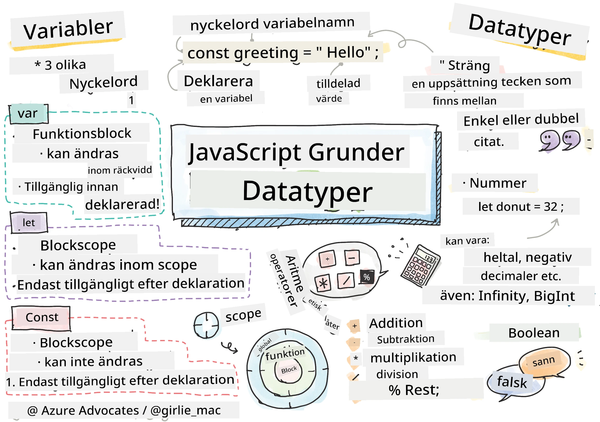
> Sketchnote av [Tomomi Imura](https://twitter.com/girlie_mac)

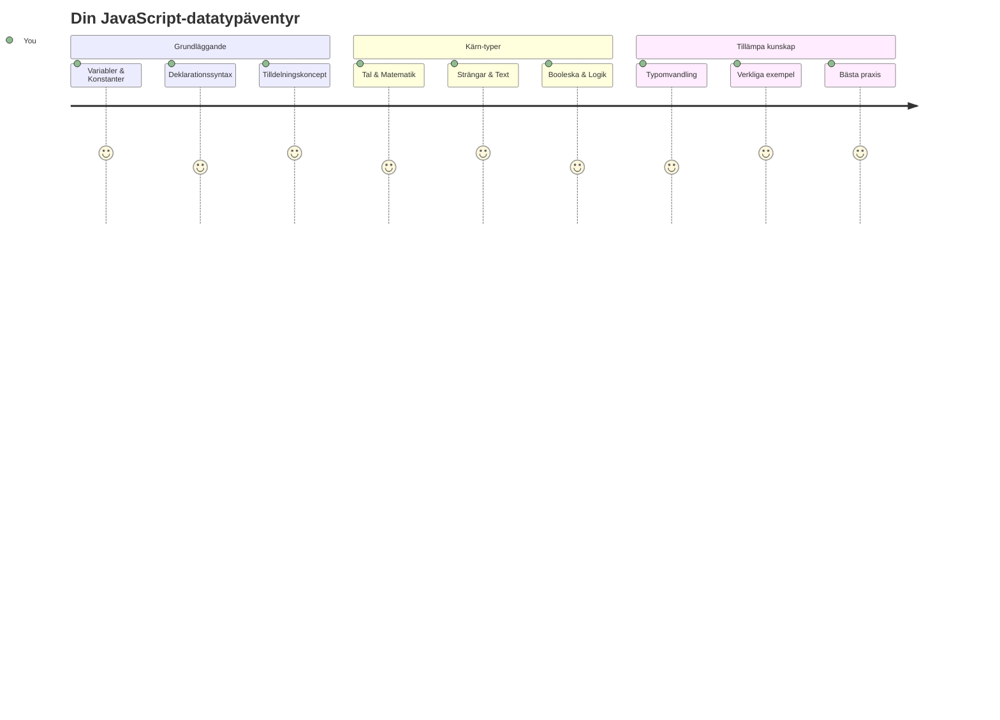
Datatyper är ett av de grundläggande begreppen i JavaScript som du kommer att stöta på i varje program du skriver. Tänk på datatyper som det arkivsystem som användes av de gamla bibliotekarierna i Alexandria – de hade specifika platser för rullar som innehöll poesi, matematik och historiska anteckningar. JavaScript organiserar information på ett liknande sätt med olika kategorier för olika typer av data.

I denna lektion ska vi utforska kärndatatyperna som får JavaScript att fungera. Du kommer att lära dig hur man hanterar siffror, text, sant/falskt-värden och förstå varför det är viktigt att välja rätt typ för dina program. Dessa koncept kan verka abstrakta till en början, men med övning kommer de att bli andra natur.

Att förstå datatyper kommer att göra allt annat i JavaScript mycket tydligare. Precis som arkitekter behöver förstå olika byggmaterial innan de bygger en katedral, kommer dessa grunder att stödja allt du bygger framöver.

## Förföreläsningsquiz
[Förföreläsningsquiz](https://ff-quizzes.netlify.app/web/)

Den här lektionen täcker grunderna i JavaScript, språket som möjliggör interaktivitet på webben.

> Du kan ta denna lektion på [Microsoft Learn](https://docs.microsoft.com/learn/modules/web-development-101-variables/?WT.mc_id=academic-77807-sagibbon)!

[](https://youtube.com/watch?v=JNIXfGiDWM8 "Variables in JavaScript")

[](https://youtube.com/watch?v=AWfA95eLdq8 "Data Types in JavaScript")

> 🎥 Klicka på bilderna ovan för videor om variabler och datatyper

Låt oss börja med variabler och datatyperna som fyller dem!

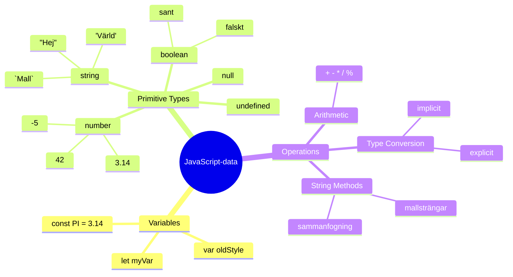
## Variabler

Variabler är grundläggande byggstenar i programmering. Som de märkta burkar som medeltida alkemister använde för att förvara olika substanser, låter variabler dig lagra information och ge den ett beskrivande namn så att du kan referera till den senare. Behöver du komma ihåg någons ålder? Spara det i en variabel som heter `age`. Vill du hålla koll på en användares namn? Spara det i en variabel som heter `userName`.

Vi kommer att fokusera på det moderna sättet att skapa variabler i JavaScript. De tekniker du lär dig här representerar år av språkutveckling och bästa praxis utvecklad av programmeringsgemenskapen.

Att skapa och **deklarera** en variabel har följande syntax **[keyword] [name]**. Det består av två delar:

- **Nyckelord**. Använd `let` för variabler som kan förändras, eller `const` för värden som förblir oförändrade.
- **Variabelnamnet**, detta är ett beskrivande namn som du själv väljer.

✅ Nyckelordet `let` introducerades i ES6 och ger din variabel så kallad _block scope_. Det rekommenderas att du använder `let` eller `const` istället för det äldre nyckelordet `var`. Vi kommer att gå igenom block scope mer ingående i senare delar.

### Uppgift - arbeta med variabler

1. **Deklarera en variabel**. Låt oss börja med att skapa vår första variabel:

    ```javascript
    let myVariable;
    ```

   **Det här innebär:**
   - Det talar om för JavaScript att skapa en lagringsplats kallad `myVariable`
   - JavaScript allokerar minnesutrymme för denna variabel
   - Variabeln har för närvarande inget värde (undefined)

2. **Ge den ett värde**. Nu lägger vi in något i vår variabel:

    ```javascript
    myVariable = 123;
    ```

   **Hur tilldelning fungerar:**
   - Operatören `=` tilldelar värdet 123 till vår variabel
   - Variabeln innehåller nu detta värde istället för att vara undefined
   - Du kan referera till detta värde i hela din kod med `myVariable`

   > Notera: användningen av `=` i denna lektion betyder att vi använder en "tilldelningsoperator" för att sätta ett värde till en variabel. Det betyder inte likhet.

3. **Gör det smartare**. Faktiskt, låt oss kombinera dessa två steg:

    ```javascript
    let myVariable = 123;
    ```

    **Detta tillvägagångssätt är mer effektivt:**
    - Du deklarerar variabeln och tilldelar värde i ett uttalande
    - Detta är standardpraxis bland utvecklare
    - Det minskar kodlängden samtidigt som tydligheten bibehålls

4. **Byt dig**. Tänk om vi vill lagra ett annat nummer?

   ```javascript
   myVariable = 321;
   ```

   **Förstå tilldelning på nytt:**
   - Variabeln innehåller nu 321 istället för 123
   - Det tidigare värdet ersätts – variabler lagrar bara ett värde åt gången
   - Denna muterbarhet är en nyckelkaraktäristik för variabler deklarerade med `let`

   ✅ Testa! Du kan skriva JavaScript direkt i din webbläsare. Öppna en webbläsare och gå till Utvecklarverktyg. I konsolen finns en prompt; skriv `let myVariable = 123`, tryck enter, skriv sedan `myVariable`. Vad händer? Notera, du lär dig mer om dessa begrepp i kommande lektioner.

### 🧠 **Variabler Kontroll: Bekvämlighet**

**Låt oss se hur du känner inför variabler:**
- Kan du förklara skillnaden mellan att deklarera och tilldela en variabel?
- Vad händer om du försöker använda en variabel innan du deklarerar den?
- När skulle du välja `let` framför `const` för en variabel?

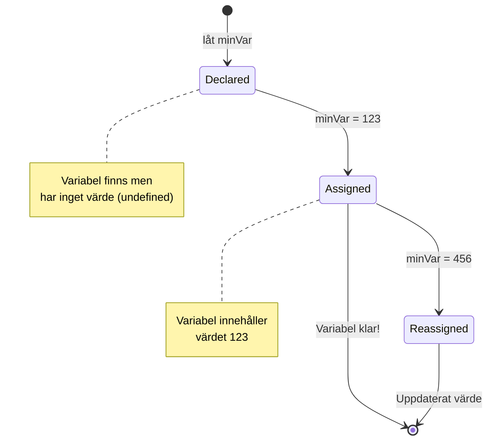
> **Snabbtips**: Tänk på variabler som märkta förvaringslådor. Du skapar lådan (`let`), lägger något i den (`=`), och kan senare byta innehåll om det behövs!

## Konstanter

Ibland behöver du lagra information som aldrig ska ändras under programmets körning. Tänk på konstanter som de matematiska principer som Euklides fastställde i det antika Grekland – när de bevisades och dokumenterades förblev de fasta för all framtid.

Konstanter fungerar liknande variabler, men med en viktig begränsning: när du tilldelar deras värde kan det inte ändras. Denna oföränderlighet hjälper till att förhindra oavsiktliga modifieringar av kritiska värden i ditt program.

Deklaration och initialisering av en konstant följer samma koncept som en variabel, med undantag av nyckelordet `const`. Konstanter deklareras vanligtvis med stora bokstäver.

```javascript
const MY_VARIABLE = 123;
```

**Här är vad denna kod gör:**
- **Skapar** en konstant som heter `MY_VARIABLE` med värdet 123
- **Använder** versaler som namngivningskonvention för konstanter
- **Förhindrar** framtida ändringar av detta värde

Konstanter har två huvudsakliga regler:

- **Du måste ge dem ett värde direkt** – inga tomma konstanter tillåts!
- **Du kan aldrig ändra detta värde** – JavaScript kastar ett fel om du försöker. Låt oss se vad jag menar:

   **Enkelt värde** - Följande är INTE tillåtet:
   
      ```javascript
      const PI = 3;
      PI = 4; // inte tillåtet
      ```

   **Vad du behöver minnas:**
   - **Försök** att tilldela om en konstant kommer att orsaka ett fel
   - **Skyddar** viktiga värden från oavsiktliga ändringar
   - **Säkerställer** att värdet förblir konsekvent under hela programmet
 
   **Objektreferens är skyddad** - Följande är INTE tillåtet:
   
      ```javascript
      const obj = { a: 3 };
      obj = { b: 5 } // inte tillåtet
      ```

   **Förstå dessa koncept:**
   - **Förhindrar** att hela objektet ersätts med ett nytt
   - **Skyddar** referensen till det ursprungliga objektet
   - **Bibehåller** objektets identitet i minnet

    **Objektets värde är inte skyddat** - Följande ÄR tillåtet:
    
      ```javascript
      const obj = { a: 3 };
      obj.a = 5;  // tillåtet
      ```

      **Här är vad som händer:**
      - **Modifierar** egenskapens värde inuti objektet
      - **Behåller** samma objekteferens
      - **Visar** att objektets innehåll kan ändras medan referensen förblir konstant

   > Notera, en `const` betyder att referensen skyddas från omtilldelning. Värdet är dock inte _oföränderligt_ och kan ändras, särskilt om det är en komplex konstruktion som ett objekt.

## Datatyper

JavaScript organiserar information i olika kategorier kallade datatyper. Detta koncept speglar hur gamla lärda kategoriserade kunskap – Aristoteles skiljde mellan olika typer av resonemang, och visste att logiska principer inte kunde tillämpas på samma sätt för poesi, matematik och naturfilosofi.

Datatyper är viktiga eftersom olika operationer fungerar med olika typer av information. Precis som du inte kan utföra aritmetik på en persons namn eller alfabetisera en matematisk ekvation, kräver JavaScript rätt datatyp för varje operation. Att förstå detta förebygger fel och gör din kod mer pålitlig.

Variabler kan lagra många olika typer av värden, som nummer och text. Dessa olika typer av värden kallas för **datatyp**. Datatyper är en viktig del av mjukvaruutveckling eftersom det hjälper utvecklare att fatta beslut om hur koden ska skrivas och hur mjukvaran ska fungera. Dessutom har vissa datatyper unika egenskaper som hjälper till att omvandla eller extrahera ytterligare information i ett värde.

✅ Datatyper kallas också för JavaScripts dataprimitiver, eftersom de är de lägsta nivåns datatyper som språket tillhandahåller. Det finns 7 primitiva datatyper: string, number, bigint, boolean, undefined, null och symbol. Ta en minut att föreställa dig vad var och en av dessa primitiva kan representera. Vad är en `zebra`? Hur är det med `0`? `true`?

### Nummer

Nummer är den mest enkla datatypen i JavaScript. Oavsett om du arbetar med heltal som 42, decimaltal som 3.14, eller negativa tal som -5, hanterar JavaScript dem på ett enhetligt sätt.

Kommer du ihåg vår variabel från tidigare? Det 123 vi sparade var i själva verket en nummer-datatyp:

```javascript
let myVariable = 123;
```

**Viktiga egenskaper:**
- JavaScript känner automatiskt igen numeriska värden
- Du kan utföra matematiska operationer med dessa variabler
- Ingen explicit typdeklaration krävs

Variabler kan lagra alla typer av nummer, inklusive decimaltal eller negativa tal. Nummer kan också användas med aritmetiska operatorer som tas upp i [nästa avsnitt](../../../../2-js-basics/1-data-types).

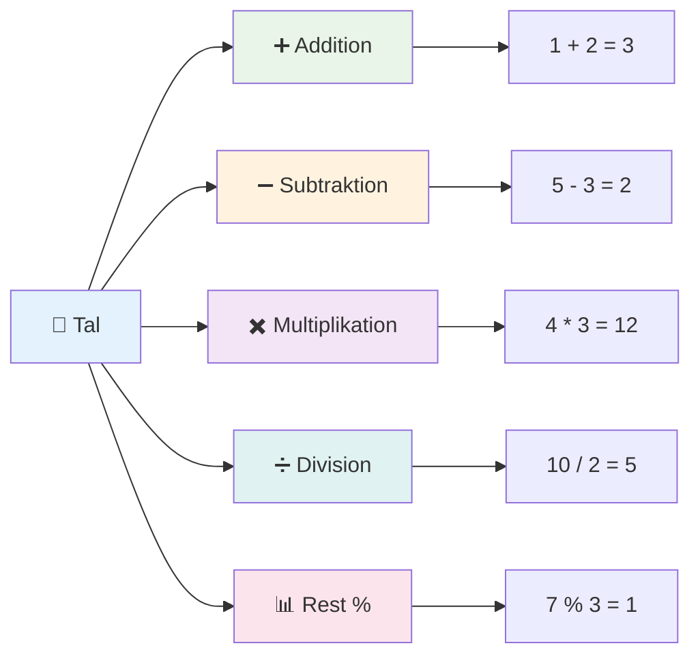
### Aritmetiska operatorer

Aritmetiska operatorer tillåter dig att utföra matematiska beräkningar i JavaScript. Dessa operatorer följer samma principer som matematiker använt i århundraden – samma symboler som fanns i verk av lärda som Al-Khwarizmi, som utvecklade algebraisk notation.

Operatorerna fungerar som du förväntar dig från traditionell matematik: plus för addition, minus för subtraktion och så vidare.

Det finns flera typer av operatorer att använda vid aritmetiska funktioner, och några listas här:

| Symbol | Beskrivning                                                              | Exempel                          |
| ------ | ------------------------------------------------------------------------ | -------------------------------- |
| `+`    | **Addition**: Beräknar summan av två tal                                 | `1 + 2 //förväntat svar är 3`    |
| `-`    | **Subtraktion**: Beräknar skillnaden mellan två tal                      | `1 - 2 //förväntat svar är -1`   |
| `*`    | **Multiplikation**: Beräknar produkten av två tal                        | `1 * 2 //förväntat svar är 2`    |
| `/`    | **Division**: Beräknar kvoten av två tal                                | `1 / 2 //förväntat svar är 0.5`  |
| `%`    | **Rest**: Beräknar resten från division av två tal                       | `1 % 2 //förväntat svar är 1`    |

✅ Testa! Prova en aritmetisk operation i din webbläsares konsol. Blir du förvånad över resultaten?

### 🧮 **Mattekunskap Kontroll: Beräkna med självförtroende**

**Testa din förståelse för aritmetik:**
- Vad är skillnaden mellan `/` (division) och `%` (rest)?
- Kan du förutsäga vad `10 % 3` blir? (Tips: det är inte 3.33...)
- Varför kan restoperatorn vara användbar i programmering?

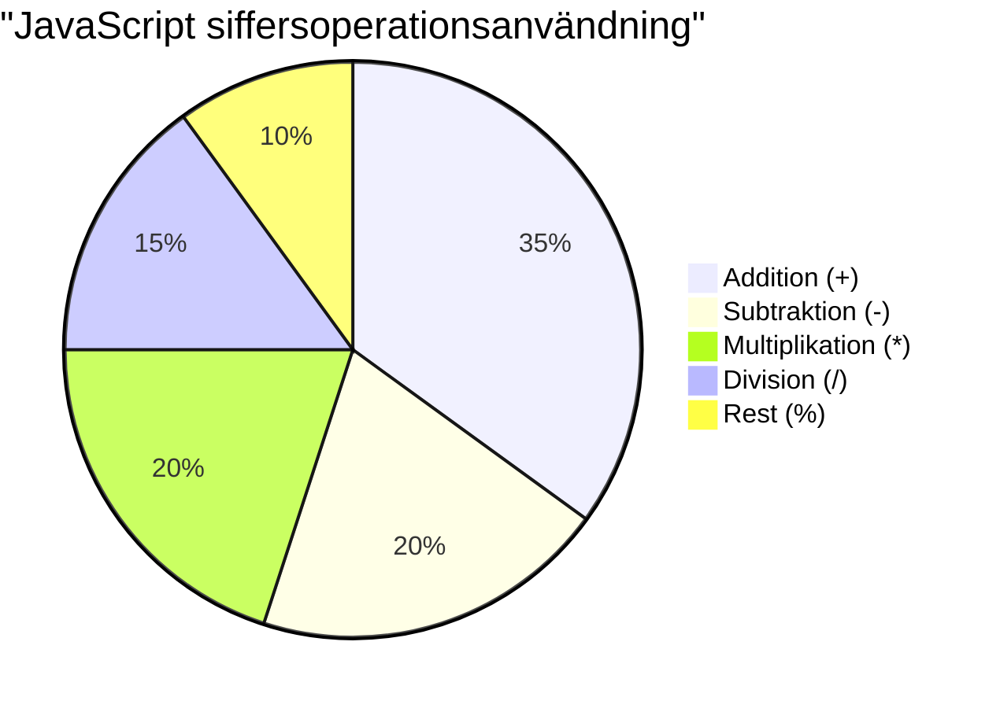
> **Insikt från verkligheten**: Restoperatorn (%) är superanvändbar för att kolla om tal är udda/jämna, skapa mönster eller cykla genom arrayer!

### Strängar

I JavaScript representeras textuell data som strängar. Termen "string" kommer från konceptet att karaktärer är upphängda i sekvens, ungefär som hur skrivare i medeltida kloster kopplade samman bokstäver för att bilda ord och meningar i sina manuskript.

Strängar är grundläggande för webbdesign. Varje textbit som visas på en webbplats – användarnamn, knappetiketter, felmeddelanden, innehåll – hanteras som strängdata. Att förstå strängar är avgörande för att skapa funktionella användargränssnitt.

Strängar är uppsättningar av tecken som placeras mellan enkla eller dubbla citationstecken.

```javascript
'This is a string'
"This is also a string"
let myString = 'This is a string value stored in a variable';
```

**Förstå dessa koncept:**
- **Använder** antingen enkla citattecken `'` eller dubbla citattecken `"` för att definiera strängar
- **Lagrar** textdata som kan innehålla bokstäver, siffror och symboler
- **Tilldelar** strängvärden till variabler för senare användning
- **Kräver** citattecken för att skilja text från variabelnamn

Kom ihåg att använda citattecken när du skriver en sträng, annars antar JavaScript att det är ett variabelnamn.

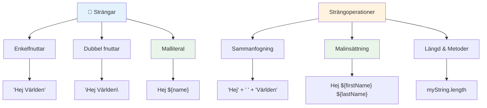
### Formatering av strängar

Strängmanipulation låter dig kombinera textelement, inkludera variabler och skapa dynamiskt innehåll som reagerar på programmets tillstånd. Denna teknik gör att du kan bygga text programmässigt.

Ofta behöver du sammanfoga flera strängar – denna process kallas konkatenering.
Att **konkatenera** två eller fler strängar, eller sätta ihop dem, använd `+`-operatorn.

```javascript
let myString1 = "Hello";
let myString2 = "World";

myString1 + myString2 + "!"; //HejVärlden!
myString1 + " " + myString2 + "!"; //Hej Världen!
myString1 + ", " + myString2 + "!"; //Hej, Världen!
```

**Steg för steg, här är vad som händer:**
- **Kombinerar** flera strängar med `+`-operatorn
- **Sätter ihop** strängar direkt utan mellanslag i det första exemplet
- **Lägger till** mellanslag `" "` mellan strängarna för läsbarhet
- **Infogar** skiljetecken som kommatecken för att skapa korrekt formatering

✅ Varför blir `1 + 1 = 2` i JavaScript, men `'1' + '1' = 11`? Tänk på det. Vad händer med `'1' + 1`?

**Mallsträngar** är ett annat sätt att formatera strängar, men istället för citattecken används backtick. Allt som inte är vanlig text måste placeras inom platshållare `${ }`. Detta inkluderar variabler som kan vara strängar.

```javascript
let myString1 = "Hello";
let myString2 = "World";

`${myString1} ${myString2}!` //Hej världen!
`${myString1}, ${myString2}!` //Hej, världen!
```

**Låt oss förstå varje del:**
- **Använder** backticks `` ` `` istället för vanliga citattecken för att skapa mallsträngar
- **Bäddar in** variabler direkt med `${}`-platshållarsyntax
- **Bevarar** mellanslag och formatering exakt som skrivet
- **Erbjuder** ett renare sätt att skapa komplexa strängar med variabler

Du kan uppnå dina formateringsmål med båda metoder, men mallsträngar respekterar alla mellanslag och radbrytningar.

✅ När skulle du använda mallsträngar istället för en vanlig sträng?

### 🔤 **Strängbehärskning: Självförtroende i textmanipulation**

**Utvärdera dina strängkunskaper:**
- Kan du förklara varför `'1' + '1'` blir `'11'` istället för `2`?
- Vilken strängmetod tycker du är mest läsbar: konkatenering eller mallsträngar?
- Vad händer om du glömmer citattecknen runt en sträng?

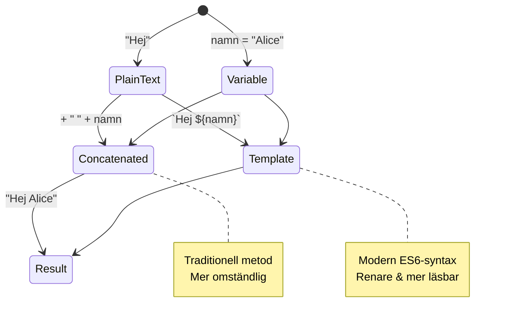
> **Proffstips**: Mallsträngar föredras generellt för komplex strängbyggnad eftersom de är mer läsbara och hanterar flerradiga strängar fantastiskt bra!

### Booleaner

Booleaner representerar den enklaste formen av data: de kan bara innehålla ett av två värden – `true` eller `false`. Detta binära logiska system går tillbaka till George Boole, en matematiker från 1800-talet som utvecklade boolesk algebra.

Trots sin enkelhet är booleaner viktiga för programlogik. De gör att din kod kan fatta beslut baserat på villkor – om en användare är inloggad, om en knapp klickades eller om vissa kriterier uppfylls.

Booleaner kan bara vara två värden: `true` eller `false`. De hjälper till att avgöra vilka kodrader som ska köras när vissa villkor är uppfyllda. I många fall hjälper [operatorer](../../../../2-js-basics/1-data-types) till med att sätta värdet för en boolean och du kommer ofta att se och skriva variabler som initialiseras eller får sina värden uppdaterade med en operator.

```javascript
let myTrueBool = true;
let myFalseBool = false;
```

**I ovanstående har vi:**
- **Skapat** en variabel som lagrar booleanvärdet `true`
- **Visat** hur man lagrar booleanvärdet `false`
- **Använt** de exakta nyckelorden `true` och `false` (inga citattecken behövs)
- **Förberett** dessa variabler för användning i villkorssatser

✅ En variabel kan betraktas som 'truthy' om den utvärderas till booleanvärdet `true`. Intressant nog är [alla värden "truthy" i JavaScript om de inte definierats som falsy](https://developer.mozilla.org/docs/Glossary/Truthy).

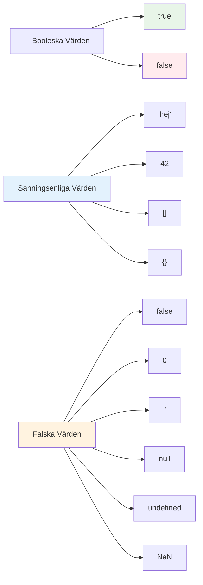
### 🎯 **Booleanlogik: Kontrollera din beslutsförmåga**

**Testa din förståelse för booleaner:**
- Varför tror du att JavaScript har "truthy" och "falsy" värden utöver bara `true` och `false`?
- Kan du förutspå vilken av dessa som är falsy: `0`, `"0"`, `[]`, `"false"`?
- Hur kan booleaner vara användbara för att styra programmets flöde?

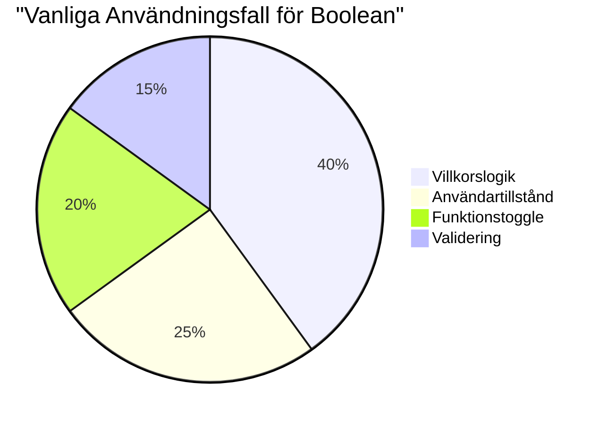
> **Kom ihåg**: I JavaScript finns bara 6 falsy värden: `false`, `0`, `""`, `null`, `undefined`, och `NaN`. Allt annat är truthy!

---

## 📊 **Din sammanfattning av datatypsverktyg**

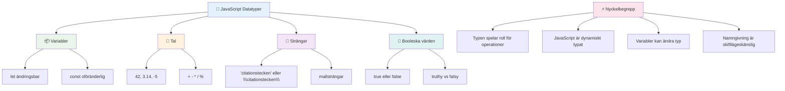
## GitHub Copilot Agent-utmaning 🚀

Använd Agent-läget för att slutföra följande utmaning:

**Beskrivning:** Skapa en personlig informationshanterare som demonstrerar alla JavaScript-datatyper du lärt dig i denna lektion, samtidigt som den hanterar verkliga datascenarier.

**Uppgift:** Bygg ett JavaScript-program som skapar ett användarprofilobjekt innehållande: en persons namn (sträng), ålder (nummer), studentstatus (boolean), favoritfärger som en array, och en adressobjekt med gatunamn, stad och postnummer. Inkludera funktioner för att visa profilinformationen och uppdatera individuella fält. Visa stringkonkatenering, mallsträngar, aritmetiska operationer med åldern, och booleanlogik för studentstatusen.

Läs mer om [agent mode](https://code.visualstudio.com/blogs/2025/02/24/introducing-copilot-agent-mode) här.

## 🚀 Utmaning

JavaScript har vissa beteenden som kan överraska utvecklare. Här är ett klassiskt exempel att utforska: prova att skriva detta i din webbläsares konsol: `let age = 1; let Age = 2; age == Age` och observera resultatet. Det returnerar `false` – kan du ta reda på varför?

Detta är ett av många JavaScript-beteenden som är bra att förstå. Att känna till dessa nycker hjälper dig att skriva mer tillförlitlig kod och debugga mer effektivt.

## Quiz efter föreläsningen
[Post-lecture quiz](https://ff-quizzes.netlify.app)

## Repetition & Självstudier

Ta en titt på [denna lista med JavaScript-övningar](https://css-tricks.com/snippets/javascript/) och prova någon. Vad lärde du dig?

## Uppgift

[Data Types Practice](assignment.md)

## 🚀 Din tidslinje för att behärska JavaScripts datatyper

### ⚡ **Vad du kan göra de närmaste 5 minuterna**
- [ ] Öppna din webbläsares konsol och skapa 3 variabler med olika datatyper
- [ ] Prova utmaningen: `let age = 1; let Age = 2; age == Age` och lista ut varför det är falskt
- [ ] Öva strängkonkatenering med ditt namn och favoritnummer
- [ ] Testa vad som händer när du lägger till ett nummer till en sträng

### 🎯 **Vad du kan uppnå under denna timme**
- [ ] Avsluta quiz efter lektionen och gå igenom eventuella förvirrande koncept
- [ ] Skapa en mini-kalkylator som lägger till, subtraherar, multiplicerar och dividerar två tal
- [ ] Bygg en enkel namnformatterare med mallsträngar
- [ ] Utforska skillnaderna mellan jämförelseoperatorerna `==` och `===`
- [ ] Öva på att konvertera mellan olika datatyper

### 📅 **Din JavaScript-grund under en vecka**
- [ ] Slutför uppgiften med självförtroende och kreativitet
- [ ] Skapa ett personligt profilobjekt med alla inlärda datatyper
- [ ] Öva med [JavaScript-övningar från CSS-Tricks](https://css-tricks.com/snippets/javascript/)
- [ ] Bygg en enkel formulärvalidator med booleanlogik
- [ ] Experimentera med array- och objekt-datatyper (en förhandsvisning av kommande lektioner)
- [ ] Gå med i en JavaScript-community och ställ frågor om datatyper

### 🌟 **Din månadslånga förvandling**
- [ ] Integrera datatypkunskap i större programmeringsprojekt
- [ ] Förstå när och varför varje datatyp används i riktiga applikationer
- [ ] Hjälp andra nybörjare att förstå JavaScripts grunder
- [ ] Bygg en liten applikation som hanterar olika typer av användardata
- [ ] Utforska avancerade datatypkoncept som typkonvertering och strikt likhet
- [ ] Bidra till öppen källkodsprojekt för JavaScript med dokumentationsförbättringar

### 🧠 **Slutgiltig kontroll av datatypsbehärskning**

**Fira din JavaScript-grund:**
- Vilken datatyp överraskade dig mest med sitt beteende?
- Hur bekväm känner du dig att förklara variabler vs konstanter för en vän?
- Vad är det mest intressanta du upptäckte om JavaScripts typsystem?
- Vilken verklig applikation kan du föreställa dig att bygga med dessa grunder?

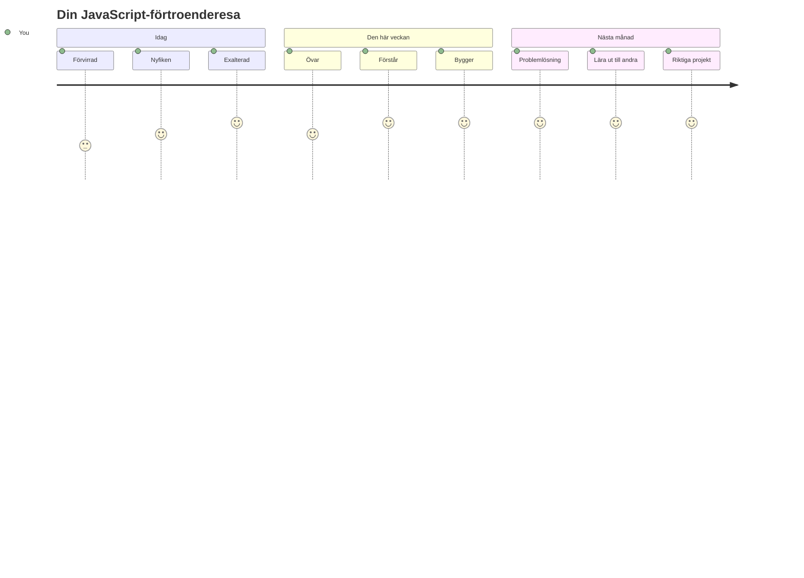
> 💡 **Du har byggt grunden!** Att förstå datatyper är som att lära sig alfabetet innan man skriver berättelser. Varje JavaScript-program du någonsin skriver kommer att använda dessa grundläggande koncept. Du har nu byggstenarna för att skapa interaktiva webbplatser, dynamiska applikationer och lösa verkliga problem med kod. Välkommen till den underbara världen av JavaScript! 🎉

---

<!-- CO-OP TRANSLATOR DISCLAIMER START -->
**Ansvarsfriskrivning**:
Detta dokument har översatts med hjälp av AI-översättningstjänsten [Co-op Translator](https://github.com/Azure/co-op-translator). Även om vi strävar efter noggrannhet, bör du vara medveten om att automatiska översättningar kan innehålla fel eller brister. Det ursprungliga dokumentet på dess ursprungliga språk ska betraktas som den auktoritativa källan. För viktig information rekommenderas professionell mänsklig översättning. Vi ansvarar inte för några missförstånd eller feltolkningar som uppstår genom användningen av denna översättning.
<!-- CO-OP TRANSLATOR DISCLAIMER END -->