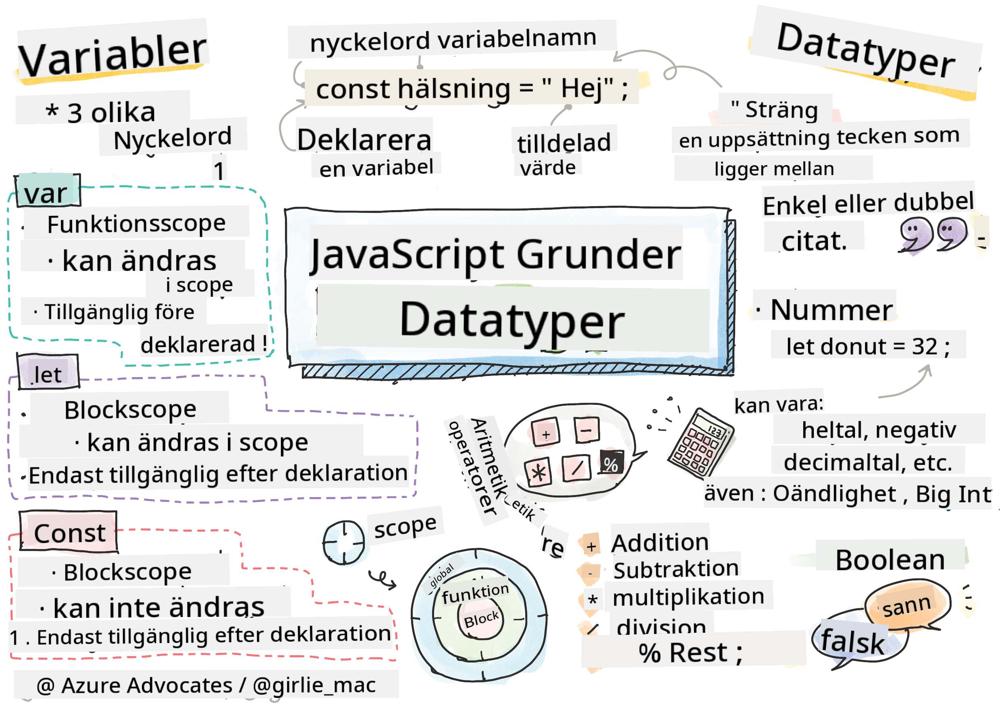

<!--
CO_OP_TRANSLATOR_METADATA:
{
  "original_hash": "b95fdd8310ef467305015ece1b0f9411",
  "translation_date": "2025-08-29T07:57:14+00:00",
  "source_file": "2-js-basics/1-data-types/README.md",
  "language_code": "sv"
}
-->
# JavaScript Grunder: Datatyper


> Sketchnote av [Tomomi Imura](https://twitter.com/girlie_mac)

## Quiz före föreläsning
[Quiz före föreläsning](https://ff-quizzes.netlify.app/web/)

Den här lektionen täcker grunderna i JavaScript, språket som ger interaktivitet på webben.

> Du kan ta den här lektionen på [Microsoft Learn](https://docs.microsoft.com/learn/modules/web-development-101-variables/?WT.mc_id=academic-77807-sagibbon)!

[](https://youtube.com/watch?v=JNIXfGiDWM8 "Variabler i JavaScript")

[](https://youtube.com/watch?v=AWfA95eLdq8 "Datatyper i JavaScript")

> 🎥 Klicka på bilderna ovan för videor om variabler och datatyper

Låt oss börja med variabler och de datatyper som fyller dem!
## Variabler

Variabler lagrar värden som kan användas och ändras i din kod.

Att skapa och **deklarera** en variabel har följande syntax **[nyckelord] [namn]**. Det består av två delar:

- **Nyckelord**. Nyckelord kan vara `let` eller `var`.  

✅ Nyckelordet `let` introducerades i ES6 och ger din variabel en så kallad _blockscope_. Det rekommenderas att du använder `let` istället för `var`. Vi kommer att gå igenom blockscope mer ingående i framtida delar.
- **Variabelnamnet**, detta är ett namn du väljer själv.

### Uppgift - arbeta med variabler

1. **Deklarera en variabel**. Låt oss deklarera en variabel med nyckelordet `let`:

    ```javascript
    let myVariable;
    ```

   `myVariable` har nu deklarerats med nyckelordet `let`. Den har för närvarande inget värde.

1. **Tilldela ett värde**. Lagra ett värde i en variabel med operatorn `=` följt av det förväntade värdet.

    ```javascript
    myVariable = 123;
    ```

   > Obs: användningen av `=` i den här lektionen innebär att vi använder en "tilldelningsoperator", som används för att sätta ett värde till en variabel. Det betyder inte likhet.

   `myVariable` har nu *initierats* med värdet 123.

1. **Refaktorisera**. Ersätt din kod med följande uttalande.

    ```javascript
    let myVariable = 123;
    ```

    Ovanstående kallas en _explicit initiering_ när en variabel deklareras och tilldelas ett värde samtidigt.

1. **Ändra variabelns värde**. Ändra variabelns värde på följande sätt:

   ```javascript
   myVariable = 321;
   ```

   När en variabel har deklarerats kan du ändra dess värde när som helst i din kod med operatorn `=` och det nya värdet.

   ✅ Prova! Du kan skriva JavaScript direkt i din webbläsare. Öppna ett webbläsarfönster och navigera till Developer Tools. I konsolen hittar du en prompt; skriv `let myVariable = 123`, tryck på retur och skriv sedan `myVariable`. Vad händer? Obs, du kommer att lära dig mer om dessa koncept i efterföljande lektioner.

## Konstanter

Deklaration och initiering av en konstant följer samma koncept som en variabel, med undantag för nyckelordet `const`. Konstanter deklareras vanligtvis med enbart versaler.

```javascript
const MY_VARIABLE = 123;
```

Konstanter liknar variabler, med två undantag:

- **Måste ha ett värde**. Konstanter måste initieras, annars uppstår ett fel när koden körs.
- **Referensen kan inte ändras**. Referensen för en konstant kan inte ändras efter initiering, annars uppstår ett fel när koden körs. Låt oss titta på två exempel:
   - **Enkelt värde**. Följande är INTE tillåtet:
   
      ```javascript
      const PI = 3;
      PI = 4; // not allowed
      ```
 
   - **Objektreferens är skyddad**. Följande är INTE tillåtet.
   
      ```javascript
      const obj = { a: 3 };
      obj = { b: 5 } // not allowed
      ```

    - **Objektvärde är inte skyddat**. Följande ÄR tillåtet:
    
      ```javascript
      const obj = { a: 3 };
      obj.a = 5;  // allowed
      ```

      Ovan ändrar du värdet på objektet men inte själva referensen, vilket gör det tillåtet.

   > Obs, en `const` innebär att referensen är skyddad från omtilldelning. Värdet är dock inte _oföränderligt_ och kan ändras, särskilt om det är en komplex konstruktion som ett objekt.

## Datatyper

Variabler kan lagra många olika typer av värden, som siffror och text. Dessa olika typer av värden kallas **datatyper**. Datatyper är en viktig del av mjukvaruutveckling eftersom de hjälper utvecklare att fatta beslut om hur koden ska skrivas och hur mjukvaran ska köras. Dessutom har vissa datatyper unika egenskaper som hjälper till att transformera eller extrahera ytterligare information från ett värde.

✅ Datatyper kallas också för JavaScript-dataprimitiver, eftersom de är de mest grundläggande datatyperna som tillhandahålls av språket. Det finns 7 primitiva datatyper: string, number, bigint, boolean, undefined, null och symbol. Ta en minut och visualisera vad var och en av dessa primitiva typer kan representera. Vad är en `zebra`? Hur är det med `0`? `true`?

### Siffror

I föregående avsnitt var värdet av `myVariable` en datatyp för siffror.

`let myVariable = 123;`

Variabler kan lagra alla typer av siffror, inklusive decimaltal eller negativa tal. Siffror kan också användas med aritmetiska operatorer, som täcks i [nästa avsnitt](../../../../2-js-basics/1-data-types).

### Aritmetiska operatorer

Det finns flera typer av operatorer att använda när man utför aritmetiska funktioner, och några listas här:

| Symbol | Beskrivning                                                              | Exempel                          |
| ------ | ------------------------------------------------------------------------ | -------------------------------- |
| `+`    | **Addition**: Beräknar summan av två tal                                 | `1 + 2 //förväntat svar är 3`    |
| `-`    | **Subtraktion**: Beräknar skillnaden mellan två tal                      | `1 - 2 //förväntat svar är -1`   |
| `*`    | **Multiplikation**: Beräknar produkten av två tal                        | `1 * 2 //förväntat svar är 2`    |
| `/`    | **Division**: Beräknar kvoten av två tal                                 | `1 / 2 //förväntat svar är 0.5`  |
| `%`    | **Rest**: Beräknar resten från divisionen av två tal                     | `1 % 2 //förväntat svar är 1`    |

✅ Prova! Testa en aritmetisk operation i din webbläsares konsol. Förvånar resultaten dig?

### Strängar

Strängar är uppsättningar av tecken som ligger mellan enkla eller dubbla citattecken.

- `'Det här är en sträng'`
- `"Det här är också en sträng"`
- `let myString = 'Det här är ett strängvärde lagrat i en variabel';`

Kom ihåg att använda citattecken när du skriver en sträng, annars antar JavaScript att det är ett variabelnamn.

### Formatering av strängar

Strängar är textbaserade och behöver ibland formateras.

För att **konkatenera** två eller fler strängar, eller slå ihop dem, använd operatorn `+`.

```javascript
let myString1 = "Hello";
let myString2 = "World";

myString1 + myString2 + "!"; //HelloWorld!
myString1 + " " + myString2 + "!"; //Hello World!
myString1 + ", " + myString2 + "!"; //Hello, World!

```

✅ Varför är `1 + 1 = 2` i JavaScript, men `'1' + '1' = 11?` Fundera på det. Vad händer med `'1' + 1`?

**Mallsträngar** är ett annat sätt att formatera strängar, förutom citattecken används backtick. Allt som inte är vanlig text måste placeras inom platshållare `${ }`. Detta inkluderar alla variabler som kan vara strängar.

```javascript
let myString1 = "Hello";
let myString2 = "World";

`${myString1} ${myString2}!` //Hello World!
`${myString1}, ${myString2}!` //Hello, World!
```

Du kan uppnå dina formateringsmål med båda metoderna, men mallsträngar respekterar alla mellanslag och radbrytningar.

✅ När skulle du använda en mallsträng jämfört med en vanlig sträng?

### Booleans

Booleans kan bara ha två värden: `true` eller `false`. Booleans kan hjälpa till att fatta beslut om vilka rader av kod som ska köras när vissa villkor är uppfyllda. I många fall hjälper [operatorer](../../../../2-js-basics/1-data-types) till med att sätta värdet på en Boolean, och du kommer ofta att märka och skriva variabler som initieras eller vars värden uppdateras med en operator.

- `let myTrueBool = true`
- `let myFalseBool = false`

✅ En variabel kan anses vara 'truthy' om den utvärderas till en boolean `true`. Intressant nog är [alla värden truthy om de inte definieras som falsy](https://developer.mozilla.org/docs/Glossary/Truthy) i JavaScript.

---

## 🚀 Utmaning

JavaScript är känt för sina överraskande sätt att hantera datatyper ibland. Gör lite research om dessa 'gotchas'. Till exempel: skiftlägeskänslighet kan ställa till det! Testa detta i din konsol: `let age = 1; let Age = 2; age == Age` (ger `false` -- varför?). Vilka andra gotchas kan du hitta?

## Quiz efter föreläsning
[Quiz efter föreläsning](https://ff-quizzes.netlify.app)

## Granskning & Självstudier

Ta en titt på [den här listan med JavaScript-övningar](https://css-tricks.com/snippets/javascript/) och prova en. Vad lärde du dig?

## Uppgift

[Övning med datatyper](assignment.md)

---

**Ansvarsfriskrivning**:  
Detta dokument har översatts med hjälp av AI-översättningstjänsten [Co-op Translator](https://github.com/Azure/co-op-translator). Även om vi strävar efter noggrannhet, vänligen notera att automatiska översättningar kan innehålla fel eller felaktigheter. Det ursprungliga dokumentet på dess originalspråk bör betraktas som den auktoritativa källan. För kritisk information rekommenderas professionell mänsklig översättning. Vi ansvarar inte för eventuella missförstånd eller feltolkningar som uppstår vid användning av denna översättning.