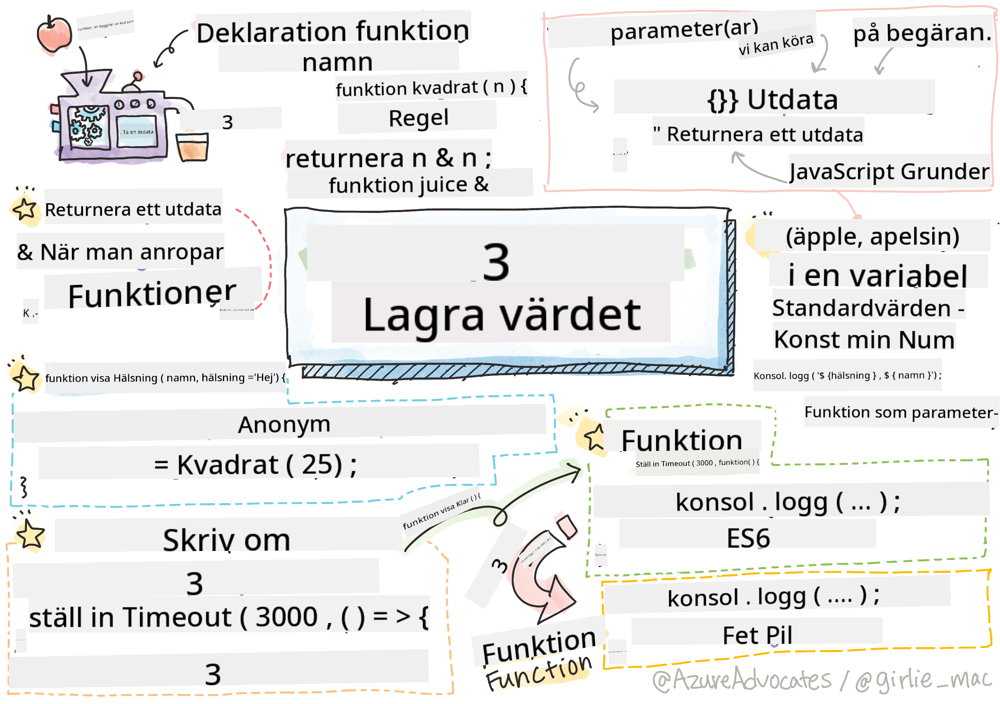

<!--
CO_OP_TRANSLATOR_METADATA:
{
  "original_hash": "ec43b53e8e015cdabfd3ad877b3c28e5",
  "translation_date": "2025-10-23T21:27:03+00:00",
  "source_file": "2-js-basics/2-functions-methods/README.md",
  "language_code": "sv"
}
-->
# JavaScript Grunder: Metoder och Funktioner


> Sketchnote av [Tomomi Imura](https://twitter.com/girlie_mac)

## Quiz före föreläsningen
[Quiz före föreläsningen](https://ff-quizzes.netlify.app)

Att skriva samma kod om och om igen är en av de vanligaste frustreringarna inom programmering. Funktioner löser detta problem genom att låta dig paketera kod i återanvändbara block. Tänk på funktioner som de standardiserade delarna som gjorde Henry Fords löpande band revolutionerande – när du väl skapar en pålitlig komponent kan du använda den var som helst utan att bygga om från grunden.

Funktioner gör det möjligt att samla kodbitar så att du kan återanvända dem i hela ditt program. Istället för att kopiera och klistra in samma logik överallt kan du skapa en funktion en gång och kalla på den när det behövs. Detta tillvägagångssätt håller din kod organiserad och gör uppdateringar mycket enklare.

I denna lektion kommer du att lära dig hur du skapar dina egna funktioner, skickar information till dem och får användbara resultat tillbaka. Du kommer att upptäcka skillnaden mellan funktioner och metoder, lära dig moderna syntaxmetoder och se hur funktioner kan fungera tillsammans med andra funktioner. Vi bygger dessa koncept steg för steg.

[](https://youtube.com/watch?v=XgKsD6Zwvlc "Metoder och Funktioner")

> 🎥 Klicka på bilden ovan för en video om metoder och funktioner.

> Du kan ta denna lektion på [Microsoft Learn](https://docs.microsoft.com/learn/modules/web-development-101-functions/?WT.mc_id=academic-77807-sagibbon)!

## Funktioner

En funktion är ett självständigt kodblock som utför en specifik uppgift. Den kapslar in logik som du kan köra när det behövs.

Istället för att skriva samma kod flera gånger i ditt program kan du paketera den i en funktion och kalla på den när du behöver den. Detta tillvägagångssätt håller din kod ren och gör uppdateringar mycket enklare. Tänk på hur svårt det skulle vara att ändra logik som är utspridd på 20 olika platser i din kodbas.

Att ge dina funktioner beskrivande namn är viktigt. En väl namngiven funktion kommunicerar sitt syfte tydligt – när du ser `cancelTimer()` förstår du direkt vad den gör, precis som en tydligt märkt knapp berättar exakt vad som händer när du klickar på den.

## Skapa och kalla på en funktion

Låt oss undersöka hur man skapar en funktion. Syntaxen följer ett konsekvent mönster:

```javascript
function nameOfFunction() { // function definition
 // function definition/body
}
```

Låt oss bryta ner detta:
- Nyckelordet `function` talar om för JavaScript "Hej, jag skapar en funktion!"
- `nameOfFunction` är där du ger din funktion ett beskrivande namn
- Parenteserna `()` är där du kan lägga till parametrar (vi kommer till det snart)
- Klammrarna `{}` innehåller den faktiska koden som körs när du kallar på funktionen

Låt oss skapa en enkel hälsningsfunktion för att se detta i praktiken:

```javascript
function displayGreeting() {
  console.log('Hello, world!');
}
```

Denna funktion skriver ut "Hello, world!" till konsolen. När du väl har definierat den kan du använda den så många gånger som behövs.

För att köra (eller "kalla på") din funktion, skriv dess namn följt av parenteser. JavaScript tillåter dig att definiera din funktion före eller efter att du kallar på den – JavaScript-motorn hanterar exekveringsordningen.

```javascript
// calling our function
displayGreeting();
```

När du kör denna rad exekveras all kod inuti din `displayGreeting`-funktion och visar "Hello, world!" i din webbläsares konsol. Du kan kalla på denna funktion upprepade gånger.

> **Note:** Du har använt **metoder** under dessa lektioner. `console.log()` är en metod – i princip en funktion som tillhör `console`-objektet. Den stora skillnaden är att metoder är kopplade till objekt, medan funktioner står självständigt. Många utvecklare använder dessa termer omväxlande i vardagligt tal.

### Bästa praxis för funktioner

Här är några tips för att hjälpa dig skriva bra funktioner:

- Ge dina funktioner tydliga, beskrivande namn – ditt framtida jag kommer att tacka dig!
- Använd **camelCasing** för namn med flera ord (som `calculateTotal` istället för `calculate_total`)
- Håll varje funktion fokuserad på att göra en sak bra

## Skicka information till en funktion

Vår `displayGreeting`-funktion är begränsad – den kan bara visa "Hello, world!" för alla. Parametrar gör det möjligt för oss att göra funktioner mer flexibla och användbara.

**Parametrar** fungerar som platshållare där du kan sätta in olika värden varje gång du använder funktionen. På så sätt kan samma funktion arbeta med olika information vid varje anrop.

Du listar parametrar inom parenteserna när du definierar din funktion och separerar flera parametrar med kommatecken:

```javascript
function name(param, param2, param3) {

}
```

Varje parameter fungerar som en platshållare – när någon kallar på din funktion kommer de att tillhandahålla faktiska värden som sätts in på dessa platser.

Låt oss uppdatera vår hälsningsfunktion för att acceptera någons namn:

```javascript
function displayGreeting(name) {
  const message = `Hello, ${name}!`;
  console.log(message);
}
```

Observera hur vi använder bakåtsnedsänkta citattecken (`` ` ``) och `${}` för att sätta in namnet direkt i vårt meddelande – detta kallas en mallliteral och är ett riktigt praktiskt sätt att bygga strängar med variabler blandade.

Nu när vi kallar på vår funktion kan vi skicka in vilket namn som helst:

```javascript
displayGreeting('Christopher');
// displays "Hello, Christopher!" when run
```

JavaScript tar strängen `'Christopher'`, tilldelar den till parametern `name` och skapar det personliga meddelandet "Hello, Christopher!"

## Standardvärden

Vad händer om vi vill göra vissa parametrar valfria? Det är här standardvärden kommer till nytta!

Låt oss säga att vi vill att folk ska kunna anpassa hälsningsordet, men om de inte specificerar ett, använder vi bara "Hello" som reserv. Du kan ställa in standardvärden genom att använda likhetstecknet, precis som när du ställer in en variabel:

```javascript
function displayGreeting(name, salutation='Hello') {
  console.log(`${salutation}, ${name}`);
}
```

Här är `name` fortfarande obligatoriskt, men `salutation` har ett reservvärde på `'Hello'` om ingen tillhandahåller en annan hälsning.

Nu kan vi kalla på denna funktion på två olika sätt:

```javascript
displayGreeting('Christopher');
// displays "Hello, Christopher"

displayGreeting('Christopher', 'Hi');
// displays "Hi, Christopher"
```

Vid det första anropet använder JavaScript standardvärdet "Hello" eftersom vi inte specificerade någon hälsning. Vid det andra anropet använder det vår anpassade "Hi" istället. Denna flexibilitet gör funktioner anpassningsbara till olika scenarier.

## Returneringsvärden

Våra funktioner hittills har bara skrivit ut meddelanden till konsolen, men vad händer om du vill att en funktion ska beräkna något och ge dig tillbaka resultatet?

Det är här **returneringsvärden** kommer in. Istället för att bara visa något kan en funktion ge dig tillbaka ett värde som du kan lagra i en variabel eller använda i andra delar av din kod.

För att skicka tillbaka ett värde använder du nyckelordet `return` följt av vad du vill returnera:

```javascript
return myVariable;
```

Här är något viktigt: när en funktion når ett `return`-uttalande slutar den omedelbart att köras och skickar tillbaka det värdet till den som kallade på den.

Låt oss ändra vår hälsningsfunktion så att den returnerar meddelandet istället för att skriva ut det:

```javascript
function createGreetingMessage(name) {
  const message = `Hello, ${name}`;
  return message;
}
```

Nu istället för att skriva ut hälsningen skapar denna funktion meddelandet och ger det tillbaka till oss.

För att använda det returnerade värdet kan vi lagra det i en variabel precis som vilket annat värde som helst:

```javascript
const greetingMessage = createGreetingMessage('Christopher');
```

Nu innehåller `greetingMessage` "Hello, Christopher" och vi kan använda det var som helst i vår kod – för att visa det på en webbsida, inkludera det i ett e-postmeddelande eller skicka det till en annan funktion.

## Funktioner som parametrar för funktioner

Funktioner kan skickas som parametrar till andra funktioner. Även om detta koncept kan verka komplext till en början är det en kraftfull funktion som möjliggör flexibla programmeringsmönster.

Detta mönster är mycket vanligt när du vill säga "när något händer, gör detta andra." Till exempel, "när timern är klar, kör denna kod" eller "när användaren klickar på knappen, kalla på denna funktion."

Låt oss titta på `setTimeout`, som är en inbyggd funktion som väntar en viss tid och sedan kör viss kod. Vi måste tala om för den vilken kod som ska köras – perfekt användningsfall för att skicka en funktion!

Prova denna kod – efter 3 sekunder ser du ett meddelande:

```javascript
function displayDone() {
  console.log('3 seconds has elapsed');
}
// timer value is in milliseconds
setTimeout(displayDone, 3000);
```

Observera hur vi skickar `displayDone` (utan parenteser) till `setTimeout`. Vi kallar inte på funktionen själva – vi överlämnar den till `setTimeout` och säger "kalla på denna om 3 sekunder."

### Anonyma funktioner

Ibland behöver du en funktion för bara en sak och vill inte ge den ett namn. Tänk på det – om du bara använder en funktion en gång, varför belasta din kod med ett extra namn?

JavaScript låter dig skapa **anonyma funktioner** – funktioner utan namn som du kan definiera precis där du behöver dem.

Här är hur vi kan skriva om vårt timerexempel med en anonym funktion:

```javascript
setTimeout(function() {
  console.log('3 seconds has elapsed');
}, 3000);
```

Detta uppnår samma resultat, men funktionen definieras direkt inom `setTimeout`-anropet, vilket eliminerar behovet av en separat funktionsdeklaration.

### Fet pil-funktioner

Modern JavaScript har ett ännu kortare sätt att skriva funktioner som kallas **pilfunktioner**. De använder `=>` (som ser ut som en pil – fattar du?) och är superpopulära bland utvecklare.

Pilfunktioner låter dig hoppa över nyckelordet `function` och skriva mer koncis kod.

Här är vårt timerexempel med en pilfunktion:

```javascript
setTimeout(() => {
  console.log('3 seconds has elapsed');
}, 3000);
```

`()` är där parametrar skulle gå (tomt i detta fall), sedan kommer pilen `=>`, och slutligen funktionskroppen inom klamrar. Detta ger samma funktionalitet med mer koncis syntax.

### När ska man använda varje strategi

När ska du använda varje tillvägagångssätt? En praktisk riktlinje: om du kommer att använda funktionen flera gånger, ge den ett namn och definiera den separat. Om det är för ett specifikt användningsområde, överväg en anonym funktion. Både pilfunktioner och traditionell syntax är giltiga val, även om pilfunktioner är vanliga i moderna JavaScript-kodbaser.

---


## 🚀 Utmaning

Kan du formulera skillnaden mellan funktioner och metoder i en mening? Ge det ett försök!

## GitHub Copilot Agent Utmaning 🚀

Använd Agent-läget för att slutföra följande utmaning:

**Beskrivning:** Skapa ett verktygsbibliotek med matematiska funktioner som demonstrerar olika funktionskoncept som täcks i denna lektion, inklusive parametrar, standardvärden, returneringsvärden och pilfunktioner.

**Uppmaning:** Skapa en JavaScript-fil som heter `mathUtils.js` som innehåller följande funktioner:
1. En funktion `add` som tar två parametrar och returnerar deras summa
2. En funktion `multiply` med standardvärden för parametrar (andra parametern har standardvärdet 1)
3. En pilfunktion `square` som tar ett nummer och returnerar dess kvadrat
4. En funktion `calculate` som accepterar en annan funktion som parameter och två nummer, och sedan tillämpar funktionen på dessa nummer
5. Demonstrera anrop av varje funktion med lämpliga testfall

Läs mer om [agent-läge](https://code.visualstudio.com/blogs/2025/02/24/introducing-copilot-agent-mode) här.

## Quiz efter föreläsningen
[Quiz efter föreläsningen](https://ff-quizzes.netlify.app)

## Granskning & Självstudier

Det är värt att [läsa lite mer om pilfunktioner](https://developer.mozilla.org/docs/Web/JavaScript/Reference/Functions/Arrow_functions), eftersom de används alltmer i kodbaser. Öva på att skriva en funktion och sedan skriva om den med denna syntax.

## Uppgift

[Roligt med Funktioner](assignment.md)

---

**Ansvarsfriskrivning**:  
Detta dokument har översatts med hjälp av AI-översättningstjänsten [Co-op Translator](https://github.com/Azure/co-op-translator). Även om vi strävar efter noggrannhet, bör det noteras att automatiserade översättningar kan innehålla fel eller felaktigheter. Det ursprungliga dokumentet på dess ursprungliga språk bör betraktas som den auktoritativa källan. För kritisk information rekommenderas professionell mänsklig översättning. Vi ansvarar inte för eventuella missförstånd eller feltolkningar som uppstår vid användning av denna översättning.