<!--
CO_OP_TRANSLATOR_METADATA:
{
  "original_hash": "71f7d7dafa1c7194d79ddac87f669ff9",
  "translation_date": "2026-01-06T22:37:42+00:00",
  "source_file": "2-js-basics/2-functions-methods/README.md",
  "language_code": "sv"
}
-->
# JavaScript-grunder: Metoder och Funktioner


> Sketchnote av [Tomomi Imura](https://twitter.com/girlie_mac)

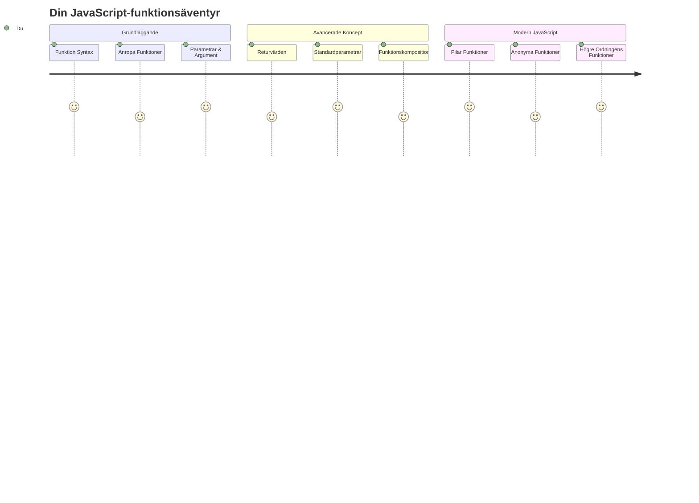
## Förföreläsningsquiz
[Förföreläsningsquiz](https://ff-quizzes.netlify.app)

Att skriva samma kod om och om igen är en av programmeringens vanligaste frustrationer. Funktioner löser detta problem genom att låta dig paketera kod i återanvändbara block. Tänk på funktioner som de standardiserade delarna som gjorde Henry Fords löpande band revolutionerande – när du skapar en pålitlig komponent kan du använda den var som helst utan att bygga om från grunden.

Funktioner gör det möjligt att samla kodbitar så att du kan återanvända dem i hela ditt program. Istället för att kopiera och klistra in samma logik överallt kan du skapa en funktion en gång och anropa den när det behövs. Detta håller din kod organiserad och gör uppdateringar mycket enklare.

I denna lektion lär du dig hur du skapar egna funktioner, skickar information till dem och får användbara resultat tillbaka. Du kommer att upptäcka skillnaden mellan funktioner och metoder, lära dig moderna syntaxmetoder och se hur funktioner kan fungera tillsammans med andra funktioner. Vi bygger upp dessa koncept steg för steg.

[](https://youtube.com/watch?v=XgKsD6Zwvlc "Methods and Functions")

> 🎥 Klicka på bilden ovan för en video om metoder och funktioner.

> Du kan ta denna lektion på [Microsoft Learn](https://docs.microsoft.com/learn/modules/web-development-101-functions/?WT.mc_id=academic-77807-sagibbon)!

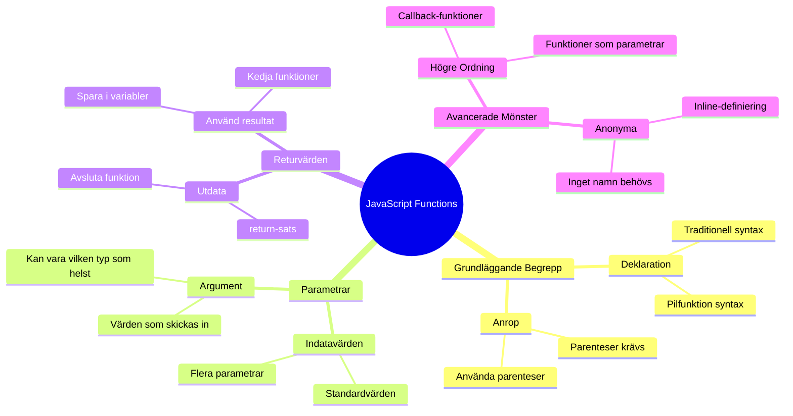
## Funktioner

En funktion är ett självständigt kodblock som utför en specifik uppgift. Den kapslar in logik som du kan exekvera när som helst.

Istället för att skriva samma kod flera gånger i ditt program kan du paketera den i en funktion och anropa den när du behöver den. Detta håller din kod ren och gör uppdateringar mycket enklare. Tänk på underhållsutmaningen om du var tvungen att ändra logik som var utspridd över 20 olika ställen i din kodbas.

Att namnge dina funktioner beskrivande är avgörande. En väl namngiven funktion kommunicerar sitt syfte tydligt – när du ser `cancelTimer()` förstår du genast vad den gör, precis som en tydligt märkt knapp talar om exakt vad som händer när du klickar på den.

## Skapa och anropa en funktion

Låt oss undersöka hur man skapar en funktion. Syntaxen följer ett konsekvent mönster:

```javascript
function nameOfFunction() { // funktionsdefinition
 // funktionsdefinition/kropp
}
```

Låt oss bryta ned detta:
- Nyckelordet `function` säger till JavaScript "Hej, jag skapar en funktion!"
- `nameOfFunction` är platsen där du ger din funktion ett beskrivande namn
- Parentestena `()` är där du kan lägga till parametrar (det tar vi snart)
- De klammerparenteser `{}` innehåller den faktiska koden som körs när du anropar funktionen

Låt oss skapa en enkel hälsningsfunktion för att se detta i praktiken:

```javascript
function displayGreeting() {
  console.log('Hello, world!');
}
```

Denna funktion skriver ut "Hello, world!" till konsolen. När du har definierat den kan du använda den så många gånger du vill.

För att exekvera (eller "anropa") din funktion, skriv dess namn följt av parenteser. JavaScript tillåter att du definierar din funktion före eller efter anropet – JavaScript-motorn hanterar exekveringsordningen.

```javascript
// anropar vår funktion
displayGreeting();
```

När du kör denna rad exekveras all kod inuti din `displayGreeting`-funktion, och "Hello, world!" visas i webbläsarens konsol. Du kan anropa denna funktion flera gånger.

### 🧠 **Grundläggande Funktioner Kontroll: Bygga Dina Första Funktioner**

**Låt oss se hur du känner inför grundläggande funktioner:**
- Kan du förklara varför vi använder klammerparenteser `{}` i funktionsdefinitioner?
- Vad händer om du skriver `displayGreeting` utan parenteserna?
- Varför kan du vilja anropa samma funktion flera gånger?

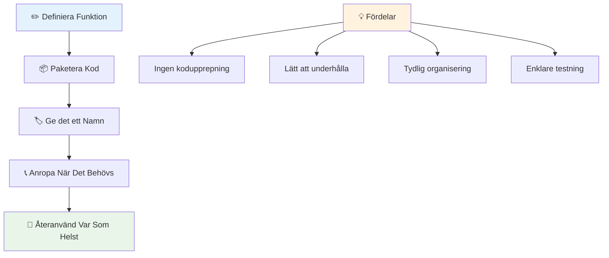
> **Notering:** Du har använt **metoder** genom dessa lektioner. `console.log()` är en metod – i princip en funktion som tillhör `console`-objektet. Den avgörande skillnaden är att metoder är kopplade till objekt, medan funktioner står självständiga. Många utvecklare använder dessa termer omväxlande i vardagligt tal.

### Bästa praxis för funktioner

Här är några tips för att hjälpa dig skriva bra funktioner:

- Ge dina funktioner tydliga, beskrivande namn – ditt framtida jag kommer att tacka dig!
- Använd **camelCase** för flersordsnamn (som `calculateTotal` istället för `calculate_total`)
- Håll varje funktion fokuserad på att göra en sak väl

## Att skicka information till en funktion

Vår `displayGreeting`-funktion är begränsad – den kan bara visa "Hello, world!" för alla. Parametrar låter oss göra funktioner mer flexibla och användbara.

**Parametrar** fungerar som platshållare där du kan sätta in olika värden varje gång du använder funktionen. På så sätt kan samma funktion arbeta med olika information vid varje anrop.

Du listar parametrar inom parenteserna när du definierar din funktion, och separerar flera parametrar med kommatecken:

```javascript
function name(param, param2, param3) {

}
```

Varje parameter fungerar som en platshållare – när någon anropar din funktion tillhandahåller de faktiska värden som sätts in på dessa platser.

Låt oss uppdatera vår hälsningsfunktion så att den accepterar någons namn:

```javascript
function displayGreeting(name) {
  const message = `Hello, ${name}!`;
  console.log(message);
}
```

Notera hur vi använder backticks (`` ` ``) och `${}` för att infoga namnet direkt i vår text – detta kallas en template literal, och det är ett mycket användbart sätt att bygga strängar med variabler inblandade.

Nu när vi anropar vår funktion kan vi skicka in vilket namn som helst:

```javascript
displayGreeting('Christopher');
// visar "Hej, Christopher!" när den körs
```

JavaScript tar strängen `'Christopher'`, tilldelar den parametern `name` och skapar det personliga meddelandet "Hello, Christopher!"

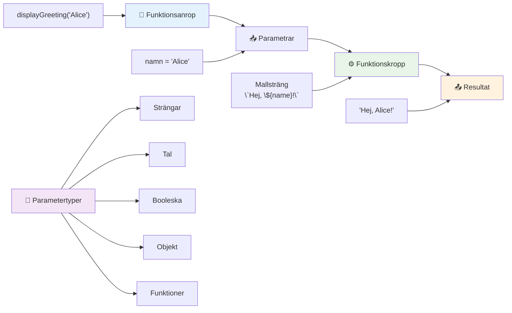
## Standardvärden

Vad händer om vi vill göra vissa parametrar valfria? Det är där standardvärden kommer in!

Säg att vi vill att folk ska kunna anpassa hälsningsord, men om de inte specificerar något använder vi bara "Hello" som standard. Du kan ställa in standardvärden med likhetstecknet, precis som när du sätter en variabel:

```javascript
function displayGreeting(name, salutation='Hello') {
  console.log(`${salutation}, ${name}`);
}
```

Här är `name` fortfarande obligatoriskt, men `salutation` har ett reservvärde `'Hello'` om ingen anger en annan hälsning.

Nu kan vi anropa denna funktion på två olika sätt:

```javascript
displayGreeting('Christopher');
// visar "Hej, Christopher"

displayGreeting('Christopher', 'Hi');
// visar "Hej, Christopher"
```

I det första anropet använder JavaScript standard "Hello" eftersom vi inte specificerade någon hälsning. I det andra anropet används vår anpassade "Hi" istället. Denna flexibilitet gör funktioner anpassningsbara till olika situationer.

### 🎛️ **Parameterkontroll: Göra Funktioner Flexibla**

**Testa din förståelse för parametrar:**
- Vad är skillnaden mellan en parameter och ett argument?
- Varför är standardvärden användbara i verklig programmering?
- Kan du förutsäga vad som händer om du skickar fler argument än parametrar?

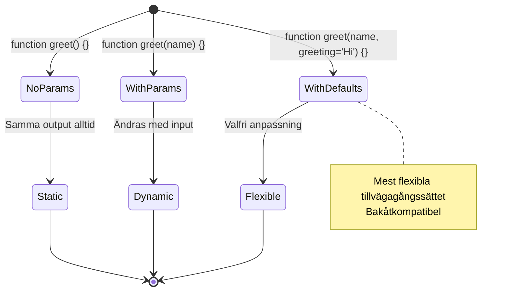
> **Proffstips**: Standardparametrar gör dina funktioner mer användarvänliga. Användare kan komma igång snabbt med vettiga standardvärden, men ändå anpassa vid behov!

## Returvärden

Våra funktioner har hittills bara skrivit ut meddelanden i konsolen, men vad händer om du vill att en funktion ska räkna ut något och ge dig tillbaka resultatet?

Det är där **returvärden** kommer in. Istället för att bara visa något kan en funktion ge tillbaka ett värde som du kan lagra i en variabel eller använda i andra delar av din kod.

För att skicka tillbaka ett värde använder du nyckelordet `return` följt av vad du vill returnera:

```javascript
return myVariable;
```

Här är något viktigt: när en funktion träffar på ett `return`-uttryck stoppar den omedelbart körningen och skickar det värdet tillbaka till den som anropade den.

Låt oss ändra vår hälsningsfunktion så att den returnerar meddelandet istället för att skriva ut det:

```javascript
function createGreetingMessage(name) {
  const message = `Hello, ${name}`;
  return message;
}
```

Nu skapar denna funktion meddelandet och lämnar det till oss istället för att skriva ut hälsningen.

För att använda det returnerade värdet kan vi lagra det i en variabel precis som vilket annat värde som helst:

```javascript
const greetingMessage = createGreetingMessage('Christopher');
```

Nu innehåller `greetingMessage` "Hello, Christopher" och vi kan använda det varsomhelst i vår kod – för att visa på en webbsida, inkludera i ett e-postmeddelande eller skicka till en annan funktion.

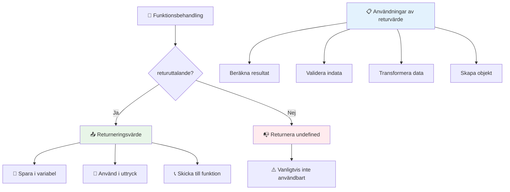
### 🔄 **Returvärden Kontroll: Få Resultat Tillbaka**

**Utvärdera din förståelse för returvärden:**
- Vad händer med koden efter ett `return`-uttryck i en funktion?
- Varför är det ofta bättre att returnera värden än att bara skriva ut till konsol?
- Kan en funktion returnera olika typer av värden (sträng, nummer, boolean)?

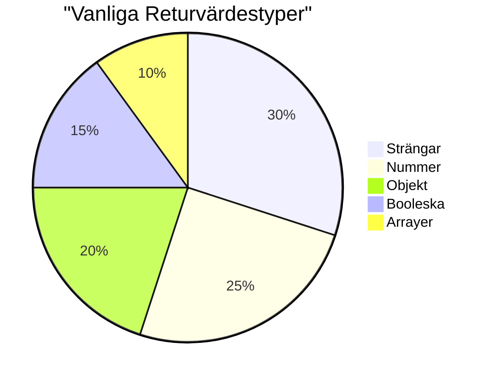
> **Viktig insikt**: Funktioner som returnerar värden är mer mångsidiga eftersom anropssidan avgör vad som ska göras med resultatet. Detta gör din kod mer modulär och återanvändbar!

## Funktioner som parametrar till funktioner

Funktioner kan skickas som parametrar till andra funktioner. Även om detta koncept kan verka komplext till en början är det en kraftfull funktion som möjliggör flexibla programmeringsmönster.

Detta mönster är supervanligt när du vill säga "när något händer, gör det här andra". Till exempel "när timern är klar, kör denna kod" eller "när användaren klickar på knappen, anropa denna funktion."

Låt oss titta på `setTimeout`, som är en inbyggd funktion som väntar en viss tid och sedan kör lite kod. Vi måste säga vad den ska köra – perfekt användning för att skicka en funktion!

Testa denna kod – efter 3 sekunder ser du ett meddelande:

```javascript
function displayDone() {
  console.log('3 seconds has elapsed');
}
// tidsvärdet är i millisekunder
setTimeout(displayDone, 3000);
```

Notera hur vi skickar `displayDone` (utan parenteser) till `setTimeout`. Vi anropar inte funktionen själva – vi lämnar över den till `setTimeout` och säger "anropa denna om 3 sekunder."

### Anonyma funktioner

Ibland behöver du en funktion för bara en sak och vill inte ge den ett namn. Tänk efter – om du bara använder en funktion en gång, varför belasta koden med ett extra namn?

JavaScript låter dig skapa **anonyma funktioner** – funktioner utan namn som du kan definiera direkt där du behöver dem.

Så här kan vi skriva om vårt timer-exempel med en anonym funktion:

```javascript
setTimeout(function() {
  console.log('3 seconds has elapsed');
}, 3000);
```

Detta ger samma resultat, men funktionen definieras direkt i `setTimeout`-anropet, vilket eliminerar behovet av en separat funktionsdeklaration.

### Fat arrow-funktioner

Modern JavaScript har ett ännu kortare sätt att skriva funktioner som kallas **arrow functions**. De använder `=>` (som ser ut som en pil – fattar du?) och är mycket populära bland utvecklare.

Arrow functions låter dig hoppa över nyckelordet `function` och skriva mer kompakt kod.

Så här ser vårt timer-exempel ut med en arrow function:

```javascript
setTimeout(() => {
  console.log('3 seconds has elapsed');
}, 3000);
```

`()` är där parametrarna skulle ligga (tomt i detta fall), sedan kommer pilen `=>`, och slutligen funktionskroppen i klammerparenteser. Detta ger samma funktionalitet med mer kompakt syntax.

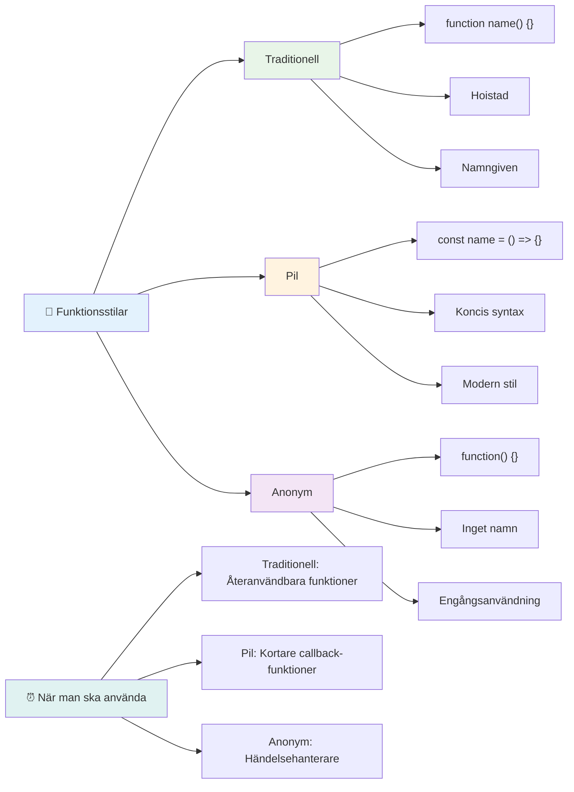
### När ska man använda varje strategi

När bör du använda vilken metod? Vägledande är: om du ska använda funktionen flera gånger, ge den ett namn och definiera den separat. Om det är för en specifik engångssak, överväg en anonym funktion. Både arrow functions och traditionell syntax är giltiga val, men arrow functions är vanliga i moderna JavaScript-kodbaser.

### 🎨 **Funktionstilar Kontroll: Välja Rätt Syntax**

**Testa din syntaxförståelse:**
- När kan du föredra arrow functions framför traditionell funktionssyntax?
- Vad är huvudfördelen med anonyma funktioner?
- Kan du tänka dig en situation där en namngiven funktion är bättre än en anonym?

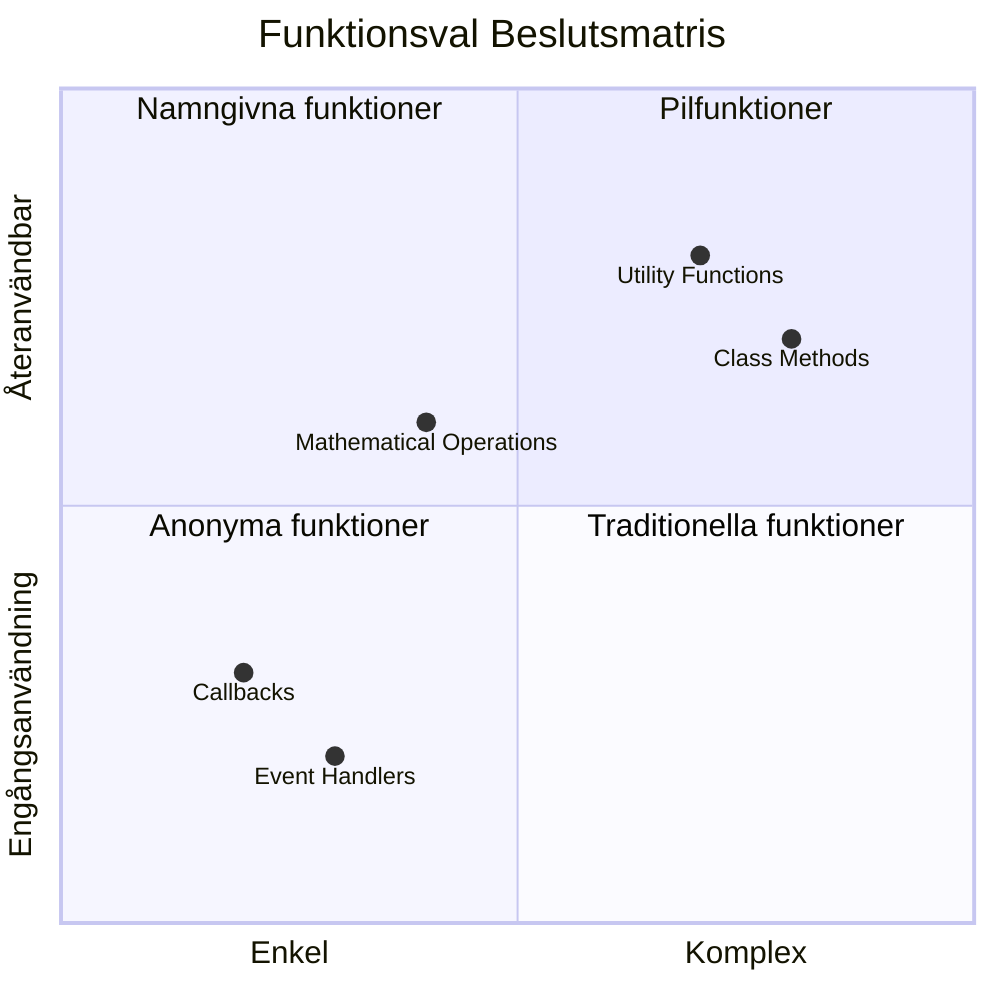
> **Modern trend**: Arrow functions blir standardvalet för många utvecklare tack vare sin kompakt syntax, men traditionella funktioner har fortfarande sin plats!

---


## 🚀 Utmaning

Kan du formulera skillnaden mellan funktioner och metoder i en mening? Prova!

## GitHub Copilot Agent-utmaning 🚀

Använd Agent-läge för att lösa följande utmaning:

**Beskrivning:** Skapa ett verktygsbibliotek med matematiska funktioner som demonstrerar olika funktioner från denna lektion, inklusive parametrar, standardvärden, returvärden och arrow functions.

**Uppgift:** Skapa en JavaScript-fil som heter `mathUtils.js` som innehåller följande funktioner:
1. En funktion `add` som tar två parametrar och returnerar deras summa
2. En funktion `multiply` med standardparametervärden (andra parametern är standard 1)
3. En arrow-funktion `square` som tar ett nummer och returnerar dess kvadrat
4. En funktion `calculate` som tar emot en annan funktion som parameter och två nummer, och sedan tillämpar funktionen på dessa nummer
5. Demonstrera anrop av varje funktion med lämpliga testfall

Läs mer om [agent mode](https://code.visualstudio.com/blogs/2025/02/24/introducing-copilot-agent-mode) här.

## Efterföreläsningsquiz
[Efterföreläsningsquiz](https://ff-quizzes.netlify.app)

## Granskning & Självstudier

Det är värt att [läsa lite mer om arrow functions](https://developer.mozilla.org/docs/Web/JavaScript/Reference/Functions/Arrow_functions), eftersom de används alltmer i kodbaser. Öva på att skriva en funktion, och sedan skriva om den med denna syntax.

## Uppgift

[Kul med Funktioner](assignment.md)

---

## 🧰 **Din JavaScript-Funktionsverktygslådas Sammanfattning**

```mermaid
graph TD
    A["🎯 JavaScript-funktioner"] --> B["📋 Funktionsdeklaration"]
    A --> C["📥 Parametrar"]
    A --> D["📤 Returvärden"]
    A --> E["🎨 Modern syntax"]
    
    B --> B1["function name() {}"]
    B --> B2["Beskrivande namngivning"]
    B --> B3["Återanvändbara kodblock"]
    
    C --> C1["Inmatningsdata"]
    C --> C2["Standardvärden"]
    C --> C3["Flera parametrar"]
    
    D --> D1["return-sats"]
    D --> D2["Avsluta funktion"]
    D --> D3["Skicka data tillbaka"]
    
    E --> E1["Arrow-funktioner: () =>"]
    E --> E2["Anonyma funktioner"]
    E --> E3["Högre ordningens funktioner"]
    
    F["⚡ Viktiga fördelar"] --> F1["Kodåteranvändning"]
    F --> F2["Bättre organisation"]
    F --> F3["Enklare testning"]
    F --> F4["Modulär design"]
    
    style A fill:#e3f2fd
    style B fill:#e8f5e8
    style C fill:#fff3e0
    style D fill:#f3e5f5
    style E fill:#e0f2f1
    style F fill:#fce4ec
```
---

## 🚀 Din Tidslinje för Mästerskap i JavaScript-Funktioner

### ⚡ **Vad du kan göra under de nästa 5 minuterna**
- [ ] Skriv en enkel funktion som returnerar ditt favoritnummer
- [ ] Skapa en funktion med två parametrar som lägger ihop dem
- [ ] Försök att konvertera en traditionell funktion till pilfunktionssyntax
- [ ] Öva på utmaningen: förklara skillnaden mellan funktioner och metoder

### 🎯 **Vad du kan uppnå denna timme**
- [ ] Slutför quizzen efter lektionen och gå igenom eventuella förvirrande begrepp
- [ ] Bygg matematikverktygsbiblioteket från GitHub Copilot-utmaningen
- [ ] Skapa en funktion som använder en annan funktion som parameter
- [ ] Öva på att skriva funktioner med standardparametrar
- [ ] Experimentera med template literals i funktionsreturvärden

### 📅 **Din veckolånga funktionsmästerskap**
- [ ] Slutför uppgiften "Kul med funktioner" med kreativitet
- [ ] Refaktorera något repetitivt kod du har skrivit till återanvändbara funktioner
- [ ] Bygg en liten räknare med endast funktioner (inga globala variabler)
- [ ] Öva på pilfunktioner med arraymetoder som `map()` och `filter()`
- [ ] Skapa en samling verktygsfunktioner för vanliga uppgifter
- [ ] Studera högre ordningens funktioner och koncept inom funktionell programmering

### 🌟 **Din månads-långa förvandling**
- [ ] Bemästra avancerade funktionskoncept som closures och scope
- [ ] Bygg ett projekt som kraftigt använder funktionell komposition
- [ ] Bidra till open source genom att förbättra funktionsdokumentation
- [ ] Lära någon annan om funktioner och olika syntaxstilar
- [ ] Utforska paradigmer inom funktionell programmering i JavaScript
- [ ] Skapa ett personligt bibliotek med återanvändbara funktioner för framtida projekt

### 🏆 **Slutgiltig funktionsexpert check-in**

**Fira din funktionsmästerskap:**
- Vilken är den mest användbara funktionen du har skapat hittills?
- Hur har lärandet om funktioner förändrat sättet du tänker på kodorganisation?
- Vilken funktionssyntax föredrar du och varför?
- Vilket verkligt problem skulle du lösa genom att skriva en funktion?

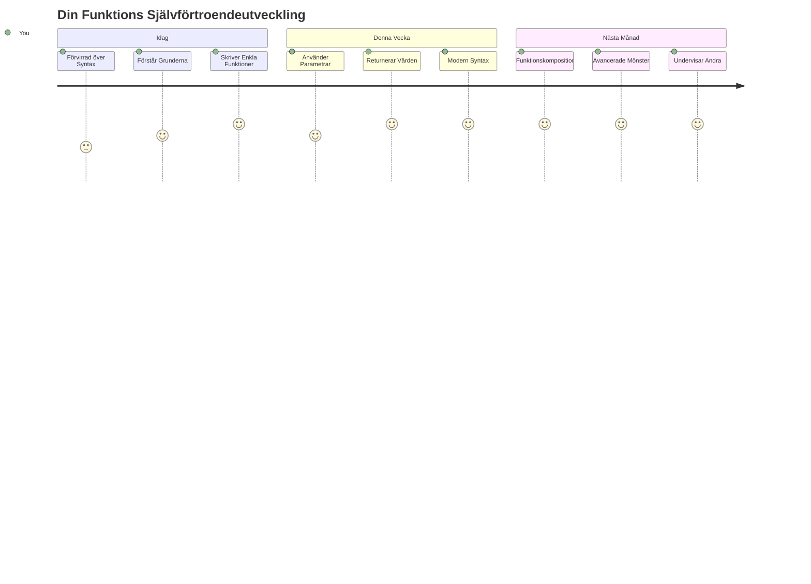
> 🎉 **Du har bemästrat ett av programmeringens mest kraftfulla koncept!** Funktioner är byggstenarna i större program. Varje applikation du någonsin bygger kommer att använda funktioner för att organisera, återanvända och strukturera kod. Du förstår nu hur man paketerar logik i återanvändbara komponenter, vilket gör dig till en effektivare och mer kapabel programmerare. Välkommen till världen av modulär programmering! 🚀

---

<!-- CO-OP TRANSLATOR DISCLAIMER START -->
**Ansvarsfriskrivning**:
Detta dokument har översatts med hjälp av AI-översättningstjänsten [Co-op Translator](https://github.com/Azure/co-op-translator). Även om vi strävar efter noggrannhet, var vänlig observera att automatiska översättningar kan innehålla fel eller brister. Det ursprungliga dokumentet på dess ursprungsspråk ska betraktas som den auktoritativa källan. För kritisk information rekommenderas professionell mänsklig översättning. Vi ansvarar inte för några missförstånd eller feltolkningar som uppstår vid användning av denna översättning.
<!-- CO-OP TRANSLATOR DISCLAIMER END -->