<!--
CO_OP_TRANSLATOR_METADATA:
{
  "original_hash": "c688385d15dd3645e924ea0ffee8967f",
  "translation_date": "2026-01-06T22:41:27+00:00",
  "source_file": "2-js-basics/3-making-decisions/README.md",
  "language_code": "sv"
}
-->
# JavaScript-grunder: Att fatta beslut


> Sketchnote av [Tomomi Imura](https://twitter.com/girlie_mac)

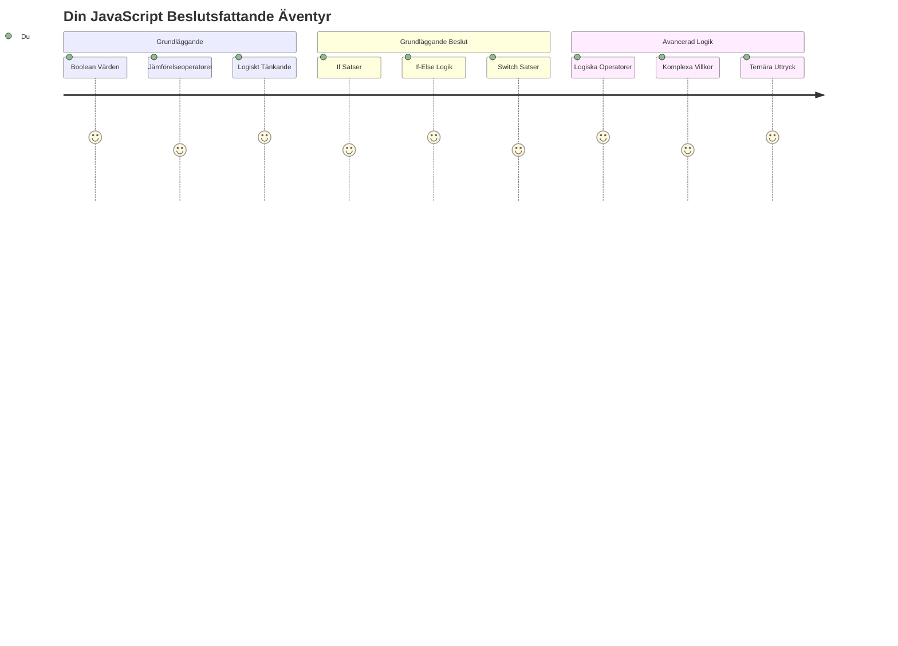
Har du någonsin undrat hur applikationer fattar smarta beslut? Som hur ett navigationssystem väljer den snabbaste rutten, eller hur en termostat bestämmer när värmen ska slås på? Detta är det fundamentala konceptet av beslutsfattande i programmering.

Precis som Charles Babbages Analytical Engine var designad för att följa olika sekvenser av operationer baserat på villkor, behöver moderna JavaScript-program göra val utifrån varierande omständigheter. Denna förmåga att grenleda och fatta beslut är vad som förvandlar statisk kod till responsiva, intelligenta applikationer.

I denna lektion kommer du att lära dig hur du implementerar villkorlig logik i dina program. Vi kommer att utforska villkorssatser, jämförelseoperatorer och logiska uttryck som låter din kod utvärdera situationer och agera på ett lämpligt sätt.

## Förföreläsningsquiz

[Pre-lecture quiz](https://ff-quizzes.netlify.app/web/quiz/11)

Förmågan att fatta beslut och kontrollera programmets flöde är en grundläggande aspekt av programmering. Detta avsnitt täcker hur du styr exekveringsvägen för dina JavaScript-program med hjälp av booleska värden och villkorlig logik.

[](https://youtube.com/watch?v=SxTp8j-fMMY "Making Decisions")

> 🎥 Klicka på bilden ovan för en video om hur man fattar beslut.

> Du kan ta denna lektion på [Microsoft Learn](https://docs.microsoft.com/learn/modules/web-development-101-if-else/?WT.mc_id=academic-77807-sagibbon)!

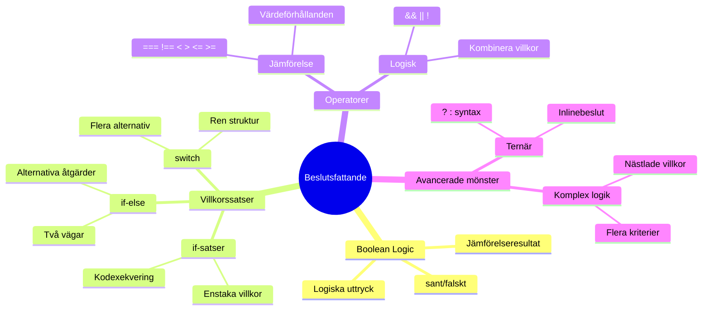
## En kort repetition om Booleans

Innan vi utforskar beslutsfattande, låt oss återbesöka booleska värden från vår tidigare lektion. Namngivna efter matematikern George Boole, representerar dessa värden binära tillstånd – antingen `true` eller `false`. Det finns ingen tvetydighet, inget mellanting.

Dessa binära värden utgör grunden för all beräkningslogik. Varje beslut ditt program fattar reduceras i slutändan till en boolean-utvärdering.

Att skapa booleska variabler är enkelt:

```javascript
let myTrueBool = true;
let myFalseBool = false;
```

Detta skapar två variabler med explicit boolean-värde.

✅ Booleans är uppkallade efter den engelska matematikern, filosofen och logikern George Boole (1815–1864).

## Jämförelseoperatorer och Booleans

I praktiken sätter du sällan booleska värden manuellt. Istället genererar du dem genom att utvärdera villkor: "Är detta nummer större än det andra?" eller "Är dessa värden lika?"

Jämförelseoperatorer möjliggör dessa utvärderingar. De jämför värden och returnerar booleska resultat baserat på förhållandet mellan operanderna.

| Symbol | Beskrivning                                                                                                                                                  | Exempel            |
| ------ | ------------------------------------------------------------------------------------------------------------------------------------------------------------ | ------------------ |
| `<`    | **Mindre än**: Jämför två värden och returnerar `true` om värdet till vänster är mindre än det till höger                                                    | `5 < 6 // true`    |
| `<=`   | **Mindre än eller lika med**: Jämför två värden och returnerar `true` om värdet till vänster är mindre än eller lika med det till höger                      | `5 <= 6 // true`   |
| `>`    | **Större än**: Jämför två värden och returnerar `true` om värdet till vänster är större än det till höger                                                    | `5 > 6 // false`   |
| `>=`   | **Större än eller lika med**: Jämför två värden och returnerar `true` om värdet till vänster är större än eller lika med det till höger                      | `5 >= 6 // false`  |
| `===`  | **Strikt likhet**: Jämför två värden och returnerar `true` om värdena till höger och vänster är lika OCH är av samma datatyp                                | `5 === 6 // false` |
| `!==`  | **Olikhet**: Jämför två värden och returnerar motsatsen till vad en strikt likhetsoperator skulle returnera                                                  | `5 !== 6 // true`  |

✅ Testa din kunskap genom att skriva några jämförelser i din webbläsares konsol. Överraskar något resultat dig?

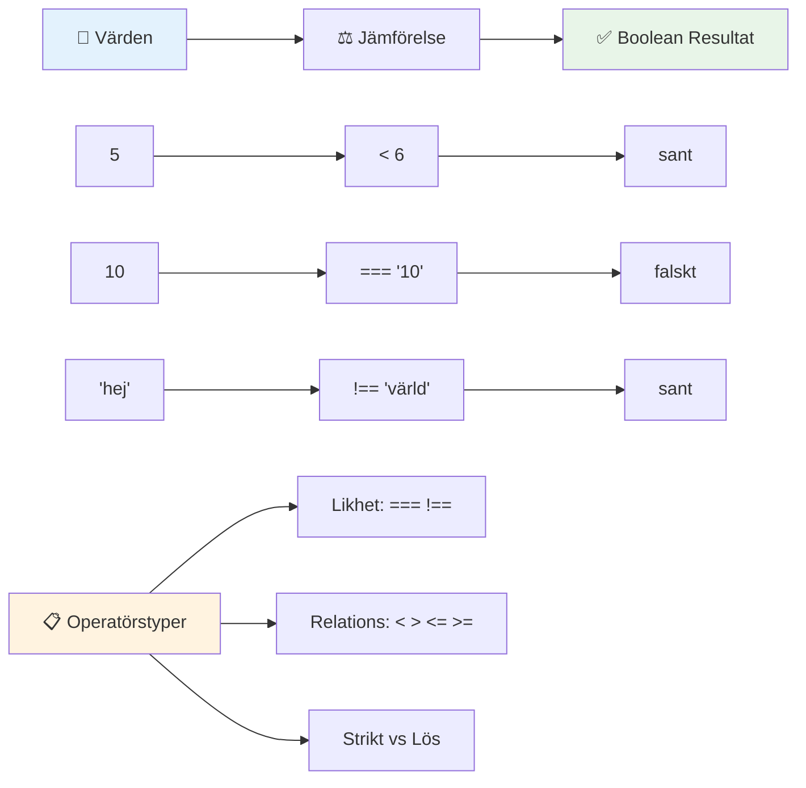
### 🧠 **Jämförelse-mästerskapskontroll: Förståelse av Boolean-logik**

**Testa din förståelse av jämförelser:**
- Varför tror du att `===` (strikt likhet) generellt föredras framför `==` (lös likhet)?
- Kan du förutsäga vad `5 === '5'` returnerar? Hur är det med `5 == '5'`?
- Vad är skillnaden mellan `!==` och `!=`?

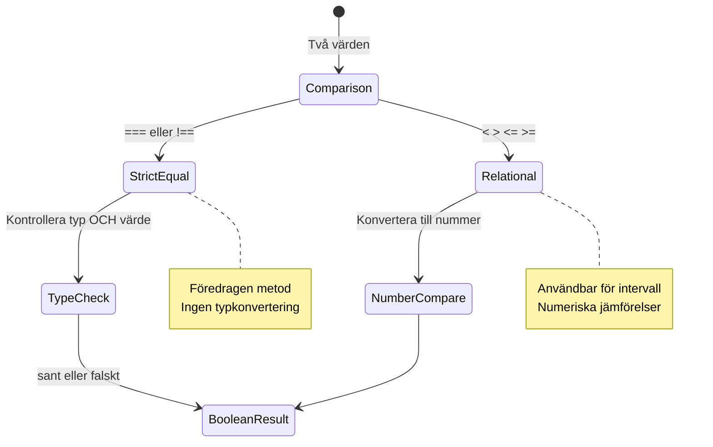
> **Proffstips**: Använd alltid `===` och `!==` för likhetskontroller såvida du inte specifikt behöver typkonvertering. Detta förhindrar oväntat beteende!

## If-sats

`if`-satsen är som att ställa en fråga i din kod. "Om detta villkor är sant, gör då detta." Det är förmodligen det viktigaste verktyget du använder för att fatta beslut i JavaScript.

Så här fungerar det:

```javascript
if (condition) {
  // Villkoret är sant. Koden i detta block kommer att köras.
}
```

Villkoret går inuti parenteserna, och om det är `true`, kör JavaScript koden innanför de klammerparenteserna. Om det är `false` hoppar JavaScript bara över hela blocket.

Du kommer ofta använda jämförelseoperatorer för att skapa dessa villkor. Låt oss se ett praktiskt exempel:

```javascript
let currentMoney = 1000;
let laptopPrice = 800;

if (currentMoney >= laptopPrice) {
  // Villkoret är sant. Koden i den här blocken kommer att köras.
  console.log("Getting a new laptop!");
}
```

Eftersom `1000 >= 800` utvärderas till `true`, körs koden inom blocket och "Getting a new laptop!" visas i konsolen.

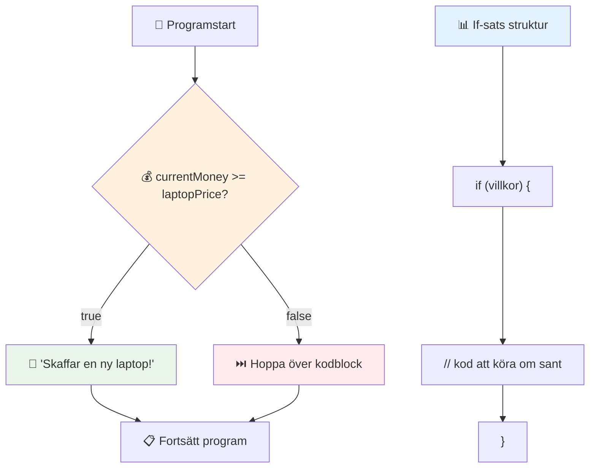
## If..Else-sats

Men vad händer om du vill att ditt program ska göra något annat när villkoret är falskt? Där kommer `else` in – det är som en reservplan.

`else`-satsen ger dig ett sätt att säga "om detta villkor inte är sant, gör istället detta andra."

```javascript
let currentMoney = 500;
let laptopPrice = 800;

if (currentMoney >= laptopPrice) {
  // Villkoret är sant. Koden i denna block kommer att köras.
  console.log("Getting a new laptop!");
} else {
  // Villkoret är falskt. Koden i denna block kommer att köras.
  console.log("Can't afford a new laptop, yet!");
}
```

Nu, eftersom `500 >= 800` är `false`, hoppar JavaScript över det första blocket och kör istället `else`-blocket. Du kommer se "Can't afford a new laptop, yet!" i konsolen.

✅ Testa din förståelse av denna kod och nästa kod genom att köra den i webbläsarens konsol. Ändra värdena på variablerna currentMoney och laptopPrice för att ändra utskriften i `console.log()`.

### 🎯 **If-Else-logik-kontroll: Grenade vägar**

**Utvärdera din förståelse av villkorslogik:**
- Vad händer om `currentMoney` exakt är lika med `laptopPrice`?
- Kan du tänka dig ett verkligt scenario där if-else-logik skulle vara användbar?
- Hur skulle du kunna utöka detta för att hantera flera prisklasser?

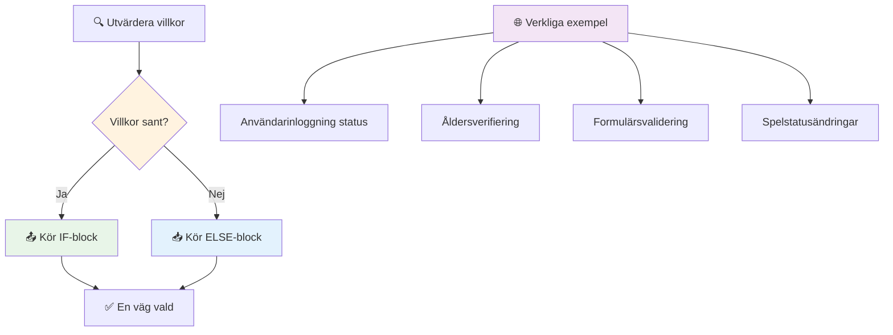
> **Viktig insikt**: If-else säkerställer att exakt en väg tas. Det garanterar att ditt program alltid har ett svar på varje villkor!

## Switch-sats

Ibland behöver du jämföra ett värde mot flera alternativ. Medan du kunde kedja flera `if..else`-satser, blir detta snabbt svåröverskådligt. `switch`-satsen ger en renare struktur för att hantera flera diskreta värden.

Konceptet liknar de mekaniska växelsystem som användes i tidiga telefonväxlar – ett ingångsvärde bestämmer vilken specifik väg exekveringen följer.

```javascript
switch (expression) {
  case x:
    // kodblock
    break;
  case y:
    // kodblock
    break;
  default:
    // kodblock
}
```

Så här är det uppbyggt:
- JavaScript utvärderar uttrycket en gång
- Det tittar igenom varje `case` för att hitta en matchning
- När den hittar en match, kör den den kodblocket
- `break` talar om för JavaScript att sluta och lämna switch-satsen
- Om inga case matchar, körs `default`-blocket (om du har ett)

```javascript
// Program som använder switch-sats för veckodag
let dayNumber = 2;
let dayName;

switch (dayNumber) {
  case 1:
    dayName = "Monday";
    break;
  case 2:
    dayName = "Tuesday";
    break;
  case 3:
    dayName = "Wednesday";
    break;
  default:
    dayName = "Unknown day";
    break;
}
console.log(`Today is ${dayName}`);
```

I detta exempel ser JavaScript att `dayNumber` är `2`, hittar matchande `case 2`, sätter `dayName` till "Tuesday", och bryter sedan ut från switch. Resultatet? "Today is Tuesday" skrivs ut i konsolen.

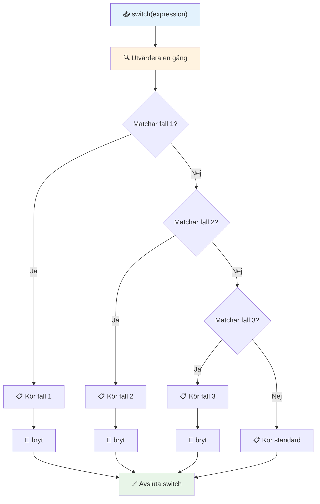
✅ Testa din förståelse av denna kod och den följande genom att köra den i en webbläsarkonsol. Ändra värdet på variabeln a för att förändra outputen i `console.log()`.

### 🔄 **Switch-sats-mästerskap: Flera alternativ**

**Testa din förståelse av switch:**
- Vad händer om du glömmer ett `break`-kommando?
- När skulle du använda `switch` istället för flera `if-else`-satser?
- Varför är `default`-fallet användbart även om du tror att alla möjligheter täcks?

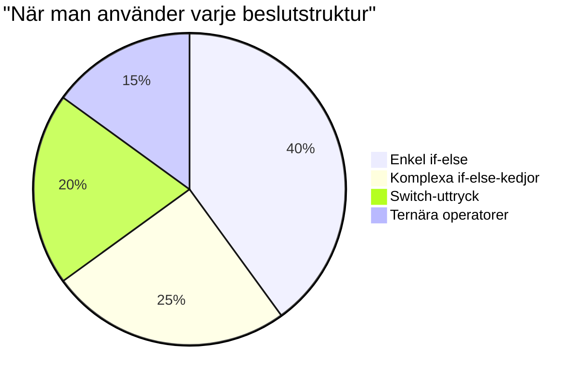
> **Bästa praxis**: Använd `switch` när du jämför en variabel mot flera specifika värden. Använd `if-else` för intervallkontroller eller komplexa villkor!

## Logiska operatorer och Booleans

Komplexa beslut kräver ofta att flera villkor utvärderas samtidigt. Precis som boolesk algebra låter matematiker kombinera logiska uttryck, tillhandahåller programmering logiska operatorer för att koppla ihop flera booleska villkor.

Dessa operatorer möjliggör sofistikerad villkorslogik genom att kombinera enkla sant/falsk-utvärderingar.

| Symbol | Beskrivning                                                                                        | Exempel                                                                |
| ------ | ------------------------------------------------------------------------------------------------ | --------------------------------------------------------------------- |
| `&&`   | **Logiskt OCH**: Jämför två booleska uttryck. Returnerar sant **endast** om båda sidor är sanna  | `(5 > 3) && (5 < 10) // Båda sidor är sanna. Returnerar sant`          |
| `\|\|` | **Logiskt ELLER**: Jämför två booleska uttryck. Returnerar sant om minst en sida är sann          | `(5 > 10) \|\| (5 < 10) // Ena sidan är falsk, den andra sann. Returnerar sant` |
| `!`    | **Logiskt INTE**: Returnerar det motsatta värdet av ett booleskt uttryck                          | `!(5 > 10) // 5 är inte större än 10, så "!" gör det sant`             |

Dessa operatorer låter dig kombinera villkor på användbara sätt:
- OCH (`&&`) betyder att båda villkoren måste vara sanna
- ELLER (`||`) betyder att minst ett villkor måste vara sant  
- INTE (`!`) vänder sant till falskt (och vice versa)

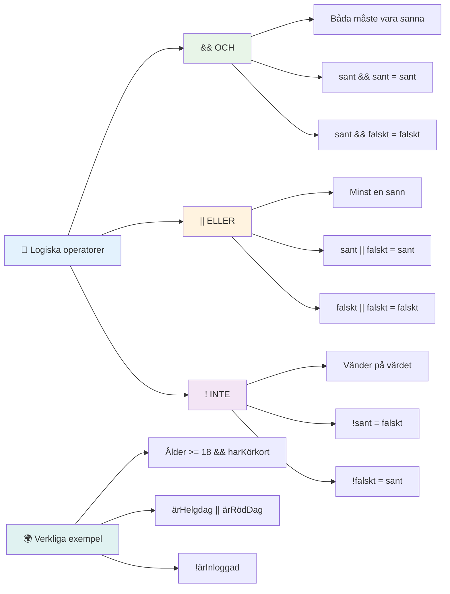
## Villkor och beslut med logiska operatorer

Låt oss se dessa logiska operatorer i aktion med ett mer realistiskt exempel:

```javascript
let currentMoney = 600;
let laptopPrice = 800;
let laptopDiscountPrice = laptopPrice - (laptopPrice * 0.2); // Laptoppris med 20 procent rabatt

if (currentMoney >= laptopPrice || currentMoney >= laptopDiscountPrice) {
  // Villkoret är sant. Kod i detta block kommer att köras.
  console.log("Getting a new laptop!");
} else {
  // Villkoret är falskt. Kod i detta block kommer att köras.
  console.log("Can't afford a new laptop, yet!");
}
```

I detta exempel: vi beräknar ett 20% rabattpris (640), sedan utvärderar vi om våra tillgängliga medel täcker antingen fullt pris ELLER rabattpriset. Eftersom 600 når rabattprisets tröskel på 640, utvärderas villkoret till sant.

### 🧮 **Logiska operatorer-kontroll: Kombinera villkor**

**Testa din förståelse av logiska operatorer:**
- I uttrycket `A && B`, vad händer om A är falskt? Utvärderas B ens?
- Kan du tänka dig en situation där du behöver alla tre operatorer (&&, ||, !) tillsammans?
- Vad är skillnaden mellan `!user.isActive` och `user.isActive !== true`?

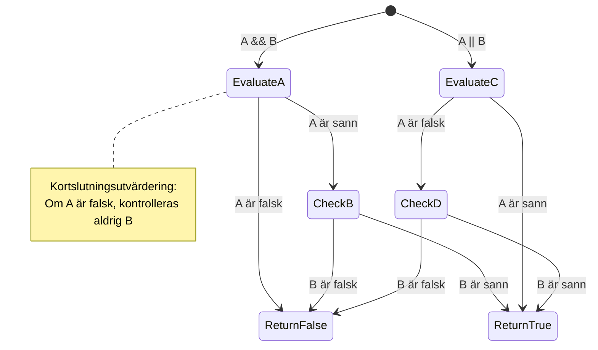
> **Prestandatips**: JavaScript använder "kortslutning-utvärdering" – i `A && B`, om A är falskt, utvärderas inte B. Använd detta till din fördel!

### Negationsoperatorn

Ibland är det lättare att tänka på när något INTE är sant. Istället för att fråga "Är användaren inloggad?", kanske du vill fråga "Är användaren INTE inloggad?" Utropstecknet (`!`) vänder logiken åt dig.

```javascript
if (!condition) {
  // körs om villkoret är falskt
} else {
  // körs om villkoret är sant
}
```

`!`-operatorn är som att säga "det motsatta av..." – om något är `true`, gör `!` det till `false`, och vice versa.

### Ternära uttryck

För enkla villkorsbaserade tilldelningar erbjuder JavaScript den **ternära operatorn**. Denna koncisa syntax låter dig skriva ett villkorsuttryck på en enda rad, användbart när du behöver tilldela ett av två värden baserat på ett villkor.

```javascript
let variable = condition ? returnThisIfTrue : returnThisIfFalse;
```

Det läses som en fråga: "Är detta villkor sant? Om ja, använd detta värde. Om nej, använd det värdet."

Nedan är ett mer påtagligt exempel:

```javascript
let firstNumber = 20;
let secondNumber = 10;
let biggestNumber = firstNumber > secondNumber ? firstNumber : secondNumber;
```

✅ Ta en minut och läs denna kod några gånger. Förstår du hur dessa operatorer fungerar?

Här säger denna rad: "Är `firstNumber` större än `secondNumber`? Om ja, sätt `firstNumber` i `biggestNumber`. Om nej, sätt `secondNumber` i `biggestNumber`."

Den ternära operatorn är bara ett kortare sätt att skriva denna traditionella `if..else`-sats:

```javascript
let biggestNumber;
if (firstNumber > secondNumber) {
  biggestNumber = firstNumber;
} else {
  biggestNumber = secondNumber;
}
```

Båda tillvägagångssätten ger identiska resultat. Den ternära operatorn erbjuder korthet, medan den traditionella if-else-strukturen kan vara mer läsbar för komplexa villkor.

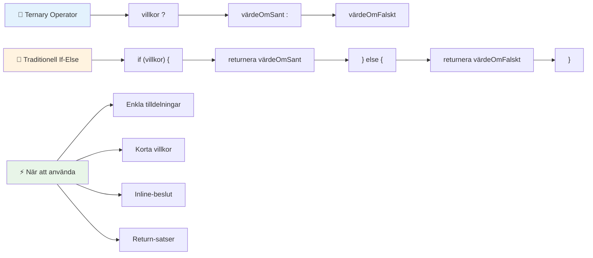
---


## 🚀 Utmaning

Skapa ett program som först skrivs med logiska operatorer, och sedan skriv om det med en ternär uttryck. Vilken syntax föredrar du?

---

## GitHub Copilot Agent-utmaning 🚀

Använd Agent-läget för att slutföra följande utmaning:

**Beskrivning:** Skapa en omfattande betygskalkylator som demonstrerar flera beslutsfattandekoncept från denna lektion, inklusive if-else-satser, switch-satser, logiska operatorer och ternära uttryck.

**Uppgift:** Skriv ett JavaScript-program som tar en elevs numeriska poäng (0-100) och bestämmer deras bokstavsbetyg enligt följande kriterier:
- A: 90-100
- B: 80-89  
- C: 70-79
- D: 60-69
- F: Under 60

Krav:
1. Använd en if-else-sats för att bestämma bokstavsbetyget

2. Använd logiska operatorer för att kontrollera om studenten klarar sig (betyg >= 60) OCH har utmärkelser (betyg >= 90)
3. Använd en switch-sats för att ge specifik återkoppling för varje bokstavsbetyg
4. Använd en ternär operator för att avgöra om studenten är behörig för nästa kurs (betyg >= 70)
5. Inkludera inmatningsvalidering för att säkerställa att poängen ligger mellan 0 och 100

Testa ditt program med olika poäng, inklusive gränsfall som 59, 60, 89, 90 och ogiltiga inmatningar.

Läs mer om [agent mode](https://code.visualstudio.com/blogs/2025/02/24/introducing-copilot-agent-mode) här.


## Post-Lecture Quiz

[Post-lecture quiz](https://ff-quizzes.netlify.app/web/quiz/12)

## Review & Self Study

Läs mer om de många operatorer som finns tillgängliga för användaren [på MDN](https://developer.mozilla.org/docs/Web/JavaScript/Reference/Operators).

Gå igenom Josh Comeaus fantastiska [operator lookup](https://joshwcomeau.com/operator-lookup/)!

## Assignment

[Operators](assignment.md)

---

## 🧠 **Din Sammanfattning av Beslutsfattande Verktyg**

```mermaid
graph TD
    A["🎯 JavaScript Beslut"] --> B["🔍 Boolean Logik"]
    A --> C["📊 Villkorssatser"]
    A --> D["🔗 Logiska Operatorer"]
    A --> E["⚡ Avancerade Mönster"]
    
    B --> B1["sanna/falska värden"]
    B --> B2["Jämförelseoperatorer"]
    B --> B3["Sanningsbegrepp"]
    
    C --> C1["if satser"]
    C --> C2["if-else kedjor"]
    C --> C3["switch satser"]
    
    D --> D1["&& (OCH)"]
    D --> D2["|| (ELLER)"]
    D --> D3["! (INTE)"]
    
    E --> E1["Ternär operator"]
    E --> E2["Kortslutningsutvärdering"]
    E --> E3["Komplexa villkor"]
    
    F["💡 Nyckelprinciper"] --> F1["Tydliga läsbara villkor"]
    F --> F2["Konsekvent jämförelsestil"]
    F --> F3["Korrekt operatorprioritet"]
    F --> F4["Effektiv utvärderingsordning"]
    
    style A fill:#e3f2fd
    style B fill:#e8f5e8
    style C fill:#fff3e0
    style D fill:#f3e5f5
    style E fill:#e0f2f1
    style F fill:#fce4ec
```
---

## 🚀 Din Tidslinje för Mästerskap i JavaScript-beslutsfattande

### ⚡ **Vad du kan göra under de nästa 5 minuterna**
- [ ] Öva på jämförelseoperatorer i din webbläsares konsol
- [ ] Skriv en enkel if-else-sats som kontrollerar din ålder
- [ ] Prova utmaningen: skriv om en if-else med en ternär operator
- [ ] Testa vad som händer med olika "truthy" och "falsy" värden

### 🎯 **Vad du kan uppnå denna timme**
- [ ] Gör klart quizet efter lektionen och gå igenom eventuella förvirrande koncept
- [ ] Bygg en komplett betygskalkylator från GitHub Copilot-utmaningen
- [ ] Skapa ett enkelt beslutsträd för ett verkligt scenario (som att välja vad du ska ha på dig)
- [ ] Öva på att kombinera flera villkor med logiska operatorer
- [ ] Experimentera med switch-satser för olika användningsområden

### 📅 **Din logikmästerskap under veckan**
- [ ] Slutför uppgiften med operatorer med kreativa exempel
- [ ] Bygg en mini-quizapplikation med olika konditionella strukturer
- [ ] Skapa en formulärvalidator som kontrollerar flera inmatningsvillkor
- [ ] Öva på Josh Comeaus [operator lookup](https://joshwcomeau.com/operator-lookup/) övningar
- [ ] Refaktorera befintlig kod för att använda mer lämpliga konditionella strukturer
- [ ] Studera kortslutningsevaluering och prestandaimplikationer

### 🌟 **Din månadslånga förvandling**
- [ ] Bemästra komplexa nästlade villkor och bibehåll kodläsbarhet
- [ ] Bygg en applikation med sofistikerad beslutslogik
- [ ] Bidra till open source genom att förbättra konditionell logik i befintliga projekt
- [ ] Lär någon annan om olika konditionella strukturer och när man ska använda dem
- [ ] Utforska funktionella programmeringsmetoder för konditionell logik
- [ ] Skapa en personlig referensguide för bästa praxis för villkor

### 🏆 **Slutlig Check-in för Beslutsmästarens Mästerskap**

**Fira din mästerskap i logiskt tänkande:**
- Vilken är den mest komplexa beslutslogik du framgångsrikt implementerat?
- Vilken konditionell struktur känns mest naturlig för dig och varför?
- Hur har lärandet om logiska operatorer förändrat ditt problemlösningssätt?
- Vilken verklig tillämpning skulle dra nytta av sofistikerad beslutslogik?

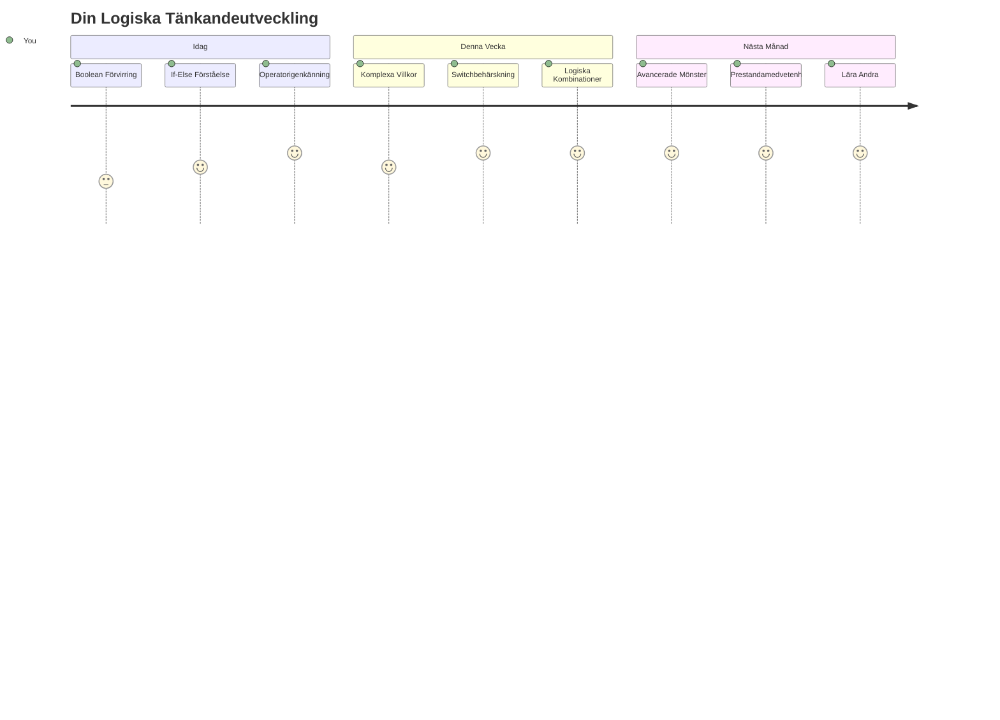
> 🧠 **Du har bemästrat konsten att fatta digitala beslut!** Varje interaktiv applikation är beroende av konditionell logik för att intelligent reagera på användaråtgärder och förändrade förhållanden. Du förstår nu hur du får dina program att tänka, utvärdera och välja lämpliga svar. Denna logiska grund kommer att driva varje dynamisk applikation du bygger! 🎉

---

<!-- CO-OP TRANSLATOR DISCLAIMER START -->
**Ansvarsfriskrivning**:
Detta dokument har översatts med hjälp av AI-översättningstjänsten [Co-op Translator](https://github.com/Azure/co-op-translator). Även om vi strävar efter noggrannhet, vänligen var medveten om att automatiska översättningar kan innehålla fel eller brister. Det ursprungliga dokumentet på dess modersmål ska betraktas som den auktoritativa källan. För kritisk information rekommenderas professionell mänsklig översättning. Vi ansvarar inte för några missförstånd eller feltolkningar som uppstår vid användning av denna översättning.
<!-- CO-OP TRANSLATOR DISCLAIMER END -->