# JavaScript Basics: Arrays och loopar


> Sketchnote av [Tomomi Imura](https://twitter.com/girlie_mac)

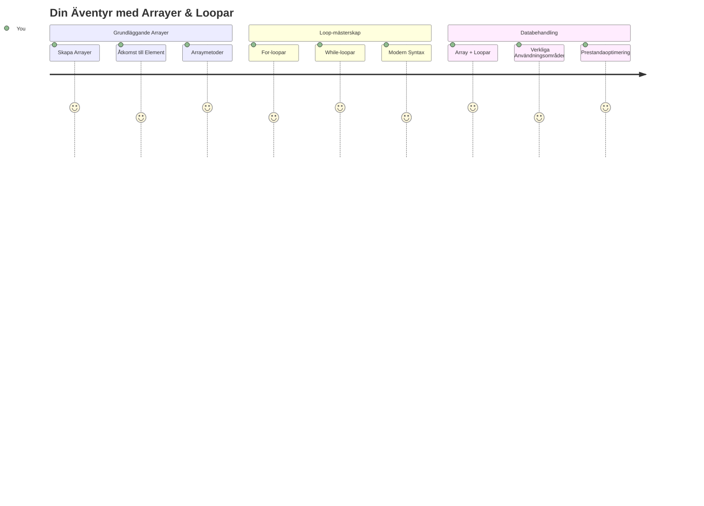
## Förföreläsningsquiz
[Förföreläsningsquiz](https://ff-quizzes.netlify.app/web/quiz/13)

Har du någonsin undrat hur webbplatser håller reda på varukorgsartiklar eller visar din vänlista? Det är där arrayer och loopar kommer in i bilden. Arrayer är som digitala behållare som rymmer flera informationsbitar, medan loopar låter dig arbeta med all denna data effektivt utan upprepande kod.

Tillsammans bildar dessa två koncept grunden för att hantera information i dina program. Du kommer att lära dig gå från att manuellt skriva ut varje steg till att skapa smart, effektiv kod som snabbt kan bearbeta hundratals eller till och med tusentals objekt.

I slutet av denna lektion kommer du att förstå hur du utför komplexa datauppgifter med bara några få kodrader. Låt oss utforska dessa grundläggande programmeringskoncept.

[](https://youtube.com/watch?v=1U4qTyq02Xw "Arrays")

[](https://www.youtube.com/watch?v=Eeh7pxtTZ3k "Loops")

> 🎥 Klicka på bilderna ovan för videor om arrayer och loopar.

> Du kan ta denna lektion på [Microsoft Learn](https://docs.microsoft.com/learn/modules/web-development-101-arrays/?WT.mc_id=academic-77807-sagibbon)!

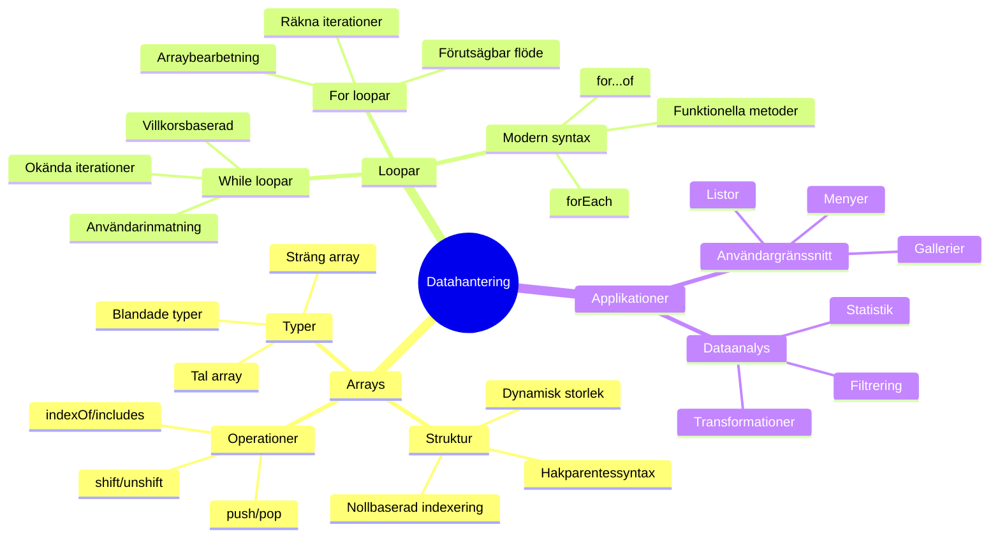
## Arrayer

Tänk på arrayer som ett digitalt arkivskåp – istället för att lagra ett dokument per låda kan du organisera flera relaterade objekt i en enda, strukturerad behållare. I programmeringstermer låter arrayer dig lagra flera informationsbitar i ett organiserat paket.

Oavsett om du bygger ett fotogalleri, hanterar en att-göra-lista eller håller koll på högsta poäng i ett spel, utgör arrayer grunden för dataorganisation. Låt oss se hur de fungerar.

✅ Arrayer finns runt omkring oss! Kan du tänka på ett verkligt exempel på en array, som en solpanelarray?

### Skapa Arrayer

Att skapa en array är supersimpelt – använd bara hakparenteser!

```javascript
// Tom array - som en tom shoppingvagn som väntar på varor
const myArray = [];
```

**Vad händer här?**
Du har precis skapat en tom behållare med de där hakparenteserna `[]`. Tänk på det som en tom biblioteksbokhylla – den är redo att hålla vilka böcker du vill organisera där.

Du kan också fylla din array med initiala värden direkt från början:

```javascript
// Glassaffärens smakmeny
const iceCreamFlavors = ["Chocolate", "Strawberry", "Vanilla", "Pistachio", "Rocky Road"];

// En användares profilinformation (blandning av olika datatyper)
const userData = ["John", 25, true, "developer"];

// Provresultat för din favoritklass
const scores = [95, 87, 92, 78, 85];
```

**Coola saker att lägga märke till:**
- Du kan lagra text, siffror eller till och med sant/falskt-värden i samma array
- Separera bara varje objekt med ett komma – enkelt!
- Arrayer är perfekta för att hålla relaterad information tillsammans

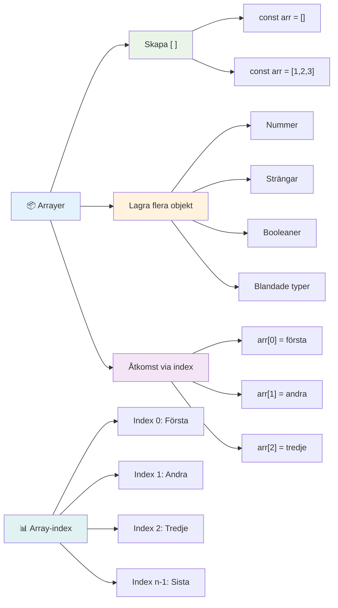
### Array-indexering

Här är något som kan verka ovanligt i början: arrayer numrerar sina objekt från 0, inte 1. Denna nollbaserade indexering har sin rot i hur datorminnet fungerar – det har varit en programmeringskonvention sedan de tidiga dagarna av programspråk som C. Varje plats i arrayen får sitt eget adressnummer kallat ett **index**.

| Index | Värde | Beskrivning |
|-------|-------|-------------|
| 0 | "Chocolate" | Första elementet |
| 1 | "Strawberry" | Andra elementet |
| 2 | "Vanilla" | Tredje elementet |
| 3 | "Pistachio" | Fjärde elementet |
| 4 | "Rocky Road" | Femte elementet |

✅ Blir du förvånad över att arrayer börjar på index noll? I vissa programmeringsspråk börjar index från 1. Det finns en intressant historia om detta, som du kan [läsa om på Wikipedia](https://en.wikipedia.org/wiki/Zero-based_numbering).

**Åtkomst till arrayelement:**

```javascript
const iceCreamFlavors = ["Chocolate", "Strawberry", "Vanilla", "Pistachio", "Rocky Road"];

// Åtkomst till individuella element med hakparentesnotation
console.log(iceCreamFlavors[0]); // "Chocolate" - första elementet
console.log(iceCreamFlavors[2]); // "Vanilla" - tredje elementet
console.log(iceCreamFlavors[4]); // "Rocky Road" - sista elementet
```

**Vad som händer här, steg för steg:**
- **Använder** hakparentesnotation med indexnummer för att komma åt element
- **Returnerar** värdet som lagras på just den positionen i arrayen
- **Börjar** räkna från 0, så det första elementets index är 0

**Modifiera arrayelement:**

```javascript
// Ändra ett befintligt värde
iceCreamFlavors[4] = "Butter Pecan";
console.log(iceCreamFlavors[4]); // "Butter Pecan"

// Lägg till ett nytt element i slutet
iceCreamFlavors[5] = "Cookie Dough";
console.log(iceCreamFlavors[5]); // "Cookie Dough"
```

**I exemplet ovan har vi:**
- **Ändrat** elementet på index 4 från "Rocky Road" till "Butter Pecan"
- **Lagt till** ett nytt element "Cookie Dough" på index 5
- **Utökat** arrayens längd automatiskt när vi lade till utanför befintliga gränser

### Arrayens längd och vanliga metoder

Arrayer har inbyggda egenskaper och metoder som gör det mycket enklare att arbeta med data.

**Hitta arrayens längd:**

```javascript
const iceCreamFlavors = ["Chocolate", "Strawberry", "Vanilla", "Pistachio", "Rocky Road"];
console.log(iceCreamFlavors.length); // 5

// Längd uppdateras automatiskt när arrayen ändras
iceCreamFlavors.push("Mint Chip");
console.log(iceCreamFlavors.length); // 6
```

**Viktiga punkter att komma ihåg:**
- **Returnerar** det totala antalet element i arrayen
- **Uppdateras** automatiskt när element läggs till eller tas bort
- **Tillhandahåller** en dynamisk räkning som är användbar för loopar och validering

**Väsentliga arraymetoder:**

```javascript
const fruits = ["apple", "banana", "orange"];

// Lägg till element
fruits.push("grape");           // Lägger till i slutet: ["apple", "banana", "orange", "grape"]
fruits.unshift("strawberry");   // Lägger till i början: ["strawberry", "apple", "banana", "orange", "grape"]

// Ta bort element
const lastFruit = fruits.pop();        // Tar bort och returnerar "grape"
const firstFruit = fruits.shift();     // Tar bort och returnerar "strawberry"

// Hitta element
const index = fruits.indexOf("banana"); // Returnerar 1 (positionen för "banana")
const hasApple = fruits.includes("apple"); // Returnerar sant
```

**Förstå dessa metoder:**
- **Lägger till** element med `push()` (i slutet) och `unshift()` (i början)
- **Tar bort** element med `pop()` (i slutet) och `shift()` (i början)
- **Hittar** element med `indexOf()` och kontrollerar om de finns med `includes()`
- **Returnerar** användbara värden som borttagna element eller positioners index

✅ Prova själv! Använd din webbläsares konsol för att skapa och manipulera en array du själv skapar.

### 🧠 **Grunder i arrayer: Organisera din data**

**Testa din förståelse för arrayer:**
- Varför tror du att arrayer börjar räkna från 0 istället för 1?
- Vad händer om du försöker komma åt ett index som inte finns (som `arr[100]` i en array med 5 element)?
- Kan du tänka på tre verkliga scenarier där arrayer skulle vara användbara?

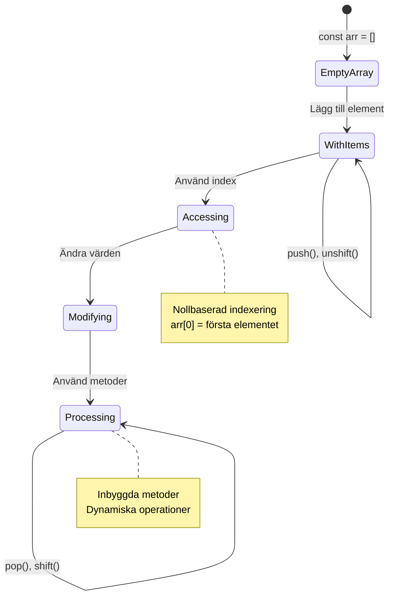
> **Verklig insikt**: Arrayer finns överallt i programmering! Sociala mediers flöden, varukorgar, fotogallerier, spellistor - allt är arrayer bakom kulisserna!

## Loopar

Tänk på det berömda straffet i Charles Dickens romaner där elever fick skriva rader om och om igen på en griffeltavla. Föreställ dig att du bara kunde säga till någon "skriv denna mening 100 gånger" och det skulle göras automatiskt. Det är precis vad loopar gör för din kod.

Loopar är som att ha en outtröttlig assistent som kan upprepa uppgifter utan fel. Oavsett om du behöver kontrollera varje objekt i en varukorg eller visa alla foton i ett album, hanterar loopar upprepningen effektivt.

JavaScript erbjuder flera typer av loopar att välja mellan. Låt oss granska var och en och förstå när de ska användas.

```mermaid
flowchart TD
    A["🔄 Looptyper"] --> B["For-loop"]
    A --> C["While-loop"]
    A --> D["For...of-loop"]
    A --> E["forEach-metod"]
    
    B --> B1["Kända iterationer"]
    B --> B2["Räknarbaserad"]
    B --> B3["for(init; villkor; inkrement)"]
    
    C --> C1["Okända iterationer"]
    C --> C2["Villkorsbaserad"]
    C --> C3["while(villkor)"]
    
    D --> D1["Moderna ES6+"]
    D --> D2["Array-iteration"]
    D --> D3["for(item av array)"]
    
    E --> E1["Funktionell stil"]
    E --> E2["Array-metod"]
    E --> E3["array.forEach(callback)"]
    
    F["⏰ När man ska använda"] --> F1["For: Räkning, index"]
    F --> F2["While: Användarinmatning, sökning"]
    F --> F3["For...of: Enkel iteration"]
    F --> F4["forEach: Funktionell programmering"]
    
    style A fill:#e3f2fd
    style B fill:#e8f5e8
    style C fill:#fff3e0
    style D fill:#f3e5f5
    style E fill:#e0f2f1
    style F fill:#fce4ec
```
### For Loop

`for`-loopen är som att sätta en timer – du vet exakt hur många gånger du vill att något ska hända. Den är superorganiserad och förutsägbar, vilket gör den perfekt när du arbetar med arrayer eller behöver räkna saker.

**Struktur för For Loop:**

| Komponent | Syfte | Exempel |
|-----------|---------|----------|
| **Initiering** | Sätter startpunkt | `let i = 0` |
| **Villkor** | När fortsätta | `i < 10` |
| **Inkremment** | Hur uppdateras | `i++` |

```javascript
// Räkna från 0 till 9
for (let i = 0; i < 10; i++) {
  console.log(`Count: ${i}`);
}

// Mer praktiskt exempel: bearbeta poäng
const testScores = [85, 92, 78, 96, 88];
for (let i = 0; i < testScores.length; i++) {
  console.log(`Student ${i + 1}: ${testScores[i]}%`);
}
```

**Steg för steg, detta händer:**
- **Initierar** räknarvariabeln `i` till 0 i början
- **Kontrollerar** villkoret `i < 10` före varje iteration
- **Utför** kodblocket när villkoret är sant
- **Ökar** `i` med 1 efter varje iteration med `i++`
- **Stoppar** när villkoret blir falskt (när `i` når 10)

✅ Kör denna kod i en webbläsares konsol. Vad händer när du gör små ändringar i räknaren, villkoret eller iterationsuttrycket? Kan du få den att gå baklänges och skapa en nedräkning?

### 🗓️ **For Loop Kontrollfrågor: Kontrollerad repetion**

**Utvärdera din förståelse för for loop:**
- Vilka är de tre delarna av en for-loop och vad gör var och en?
- Hur skulle du loopa igenom en array baklänges?
- Vad händer om du glömmer inkrementdelen (`i++`)?

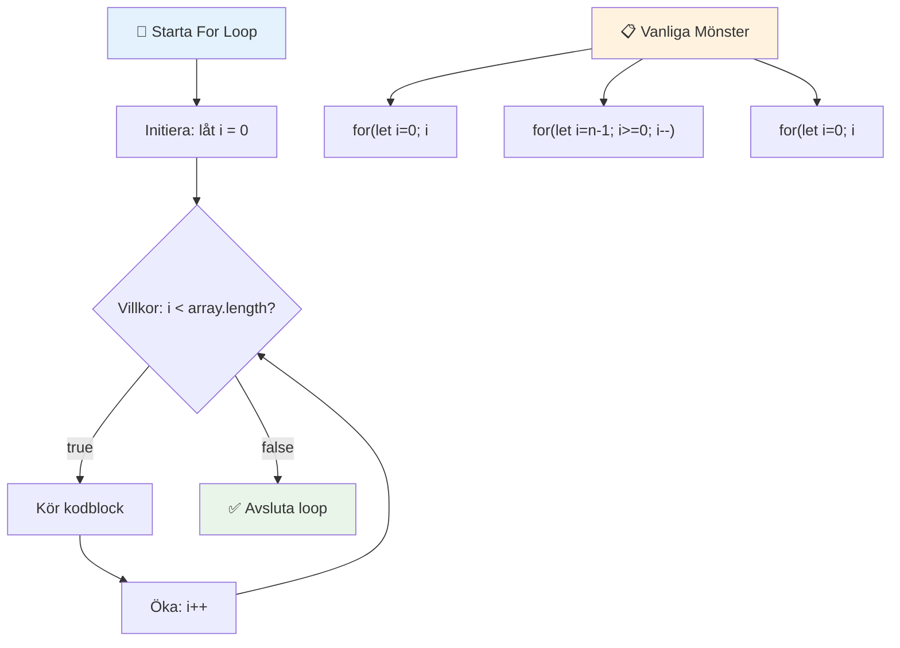
> **Lopplogik**: For-loopar är perfekta när du vet exakt hur många gånger du behöver upprepa något. De är det vanligaste valet för arraybearbetning!

### While Loop

`while`-loopen är som att säga "fortsätt göra detta tills…" – du kanske inte vet exakt hur många gånger den kommer att köras, men du vet när den ska sluta. Den är perfekt för saker som att fråga en användare efter input tills de ger dig det du behöver, eller söka i data tills du hittar det du letar efter.

**Egenskaper hos While Loop:**
- **Fortsätter** exekvera så länge villkoret är sant
- **Kräver** manuell hantering av räknarvariabler
- **Kontrollerar** villkoret innan varje iteration
- **Riskerar** oändliga loopar om villkoret aldrig blir falskt

```javascript
// Grundläggande räkneexempel
let i = 0;
while (i < 10) {
  console.log(`While count: ${i}`);
  i++; // Glöm inte att öka!
}

// Mer praktiskt exempel: bearbetning av användarinmatning
let userInput = "";
let attempts = 0;
const maxAttempts = 3;

while (userInput !== "quit" && attempts < maxAttempts) {
  userInput = prompt(`Enter 'quit' to exit (attempt ${attempts + 1}):`);
  attempts++;
}

if (attempts >= maxAttempts) {
  console.log("Maximum attempts reached!");
}
```

**Förstå dessa exempel:**
- **Hanterar** räknarvariabeln `i` manuellt inuti loopkroppen
- **Ökar** räknaren för att undvika oändliga loopar
- **Visar** praktiskt exempel med användarinmatning och försökbegränsning
- **Inkluderar** säkerhetsmekanismer för att förhindra ändlös exekvering

### ♾️ **While Loop Kontrollfrågor: Villkorsstyrd repetion**

**Testa din förståelse av while-loop:**
- Vad är den största faran med att använda while-loopar?
- När skulle du välja en while-loop över en for-loop?
- Hur kan du förhindra oändliga loopar?

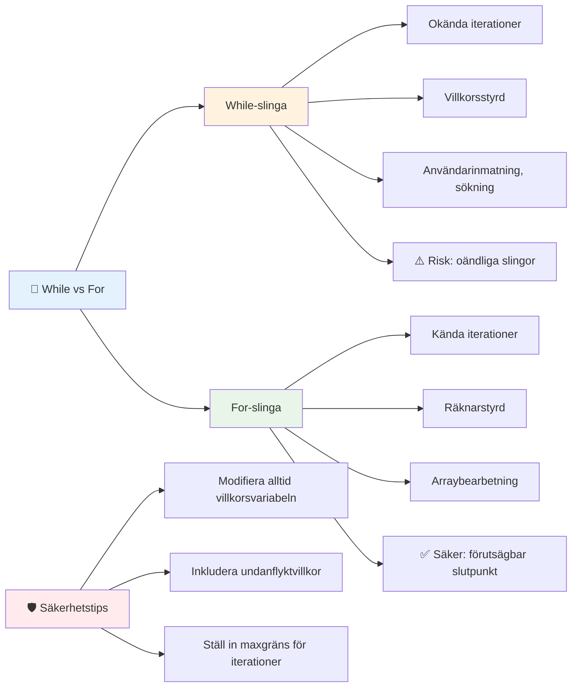
> **Säkerhet först**: While-loopar är kraftfulla men kräver noggrann hantering av villkor. Se alltid till att ditt loopvillkor till slut blir falskt!

### Moderna alternativen till loopar

JavaScript erbjuder modern syntax för loopar som kan göra din kod mer läsbar och mindre felbenägen.

**For...of Loop (ES6+):**

```javascript
const colors = ["red", "green", "blue", "yellow"];

// Modern metod - renare och säkrare
for (const color of colors) {
  console.log(`Color: ${color}`);
}

// Jämför med traditionell for-loop
for (let i = 0; i < colors.length; i++) {
  console.log(`Color: ${colors[i]}`);
}
```

**Viktiga fördelar med for...of:**
- **Eliminerar** hantering av index och potentiella off-by-one-fel
- **Ger** direkt åtkomst till arrayelement
- **Förbättrar** kodläsbarhet och minskar syntaxkomplexitet

**forEach-metoden:**

```javascript
const prices = [9.99, 15.50, 22.75, 8.25];

// Använder forEach för funktionell programmeringsstil
prices.forEach((price, index) => {
  console.log(`Item ${index + 1}: $${price.toFixed(2)}`);
});

// forEach med pilfunktioner för enkla operationer
prices.forEach(price => console.log(`Price: $${price}`));
```

**Vad du bör veta om forEach:**
- **Utför** en funktion för varje arrayelement
- **Ger** både elementvärde och index som parametrar
- **Kan inte** stoppas tidigt (till skillnad från traditionella loopar)
- **Returnerar** undefined (skapar inte en ny array)

✅ Varför skulle du välja en for-loop jämfört med en while-loop? 17K tittare hade samma fråga på StackOverflow och några av åsikterna [kan vara intressanta för dig](https://stackoverflow.com/questions/39969145/while-loops-vs-for-loops-in-javascript).

### 🎨 **Kontrollfrågor om modern loopsyntax: Omfamna ES6+**

**Bedöm din moderna JavaScriptförståelse:**
- Vilka är fördelarna med `for...of` jämfört med traditionella for-loopar?
- När skulle du fortfarande föredra traditionella for-loopar?
- Vad är skillnaden mellan `forEach` och `map`?

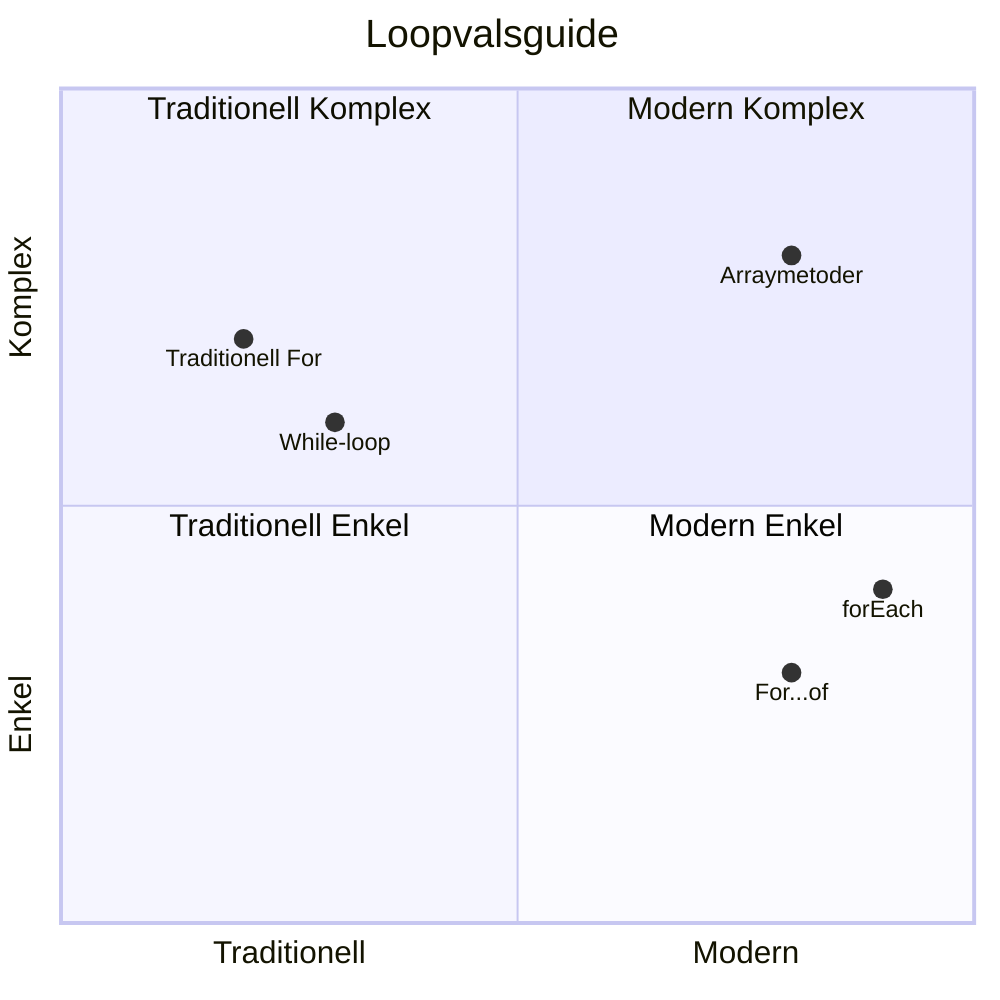
> **Modern trend**: ES6+ syntax som `for...of` och `forEach` blir det föredragna sättet att iterera arrayer eftersom det är renare och mindre felbenäget!

## Loopar och Arrayer

Kombinationen av arrayer och loopar skapar kraftfulla möjligheter för databehandling. Detta par är grundläggande för många programmeringsuppgifter, från att visa listor till att beräkna statistik.

**Traditionell arraybearbetning:**

```javascript
const iceCreamFlavors = ["Chocolate", "Strawberry", "Vanilla", "Pistachio", "Rocky Road"];

// Klassisk for-loopmetod
for (let i = 0; i < iceCreamFlavors.length; i++) {
  console.log(`Flavor ${i + 1}: ${iceCreamFlavors[i]}`);
}

// Modern for...of-metod
for (const flavor of iceCreamFlavors) {
  console.log(`Available flavor: ${flavor}`);
}
```

**Låt oss förstå varje tillvägagångssätt:**
- **Använder** arrayens length-egenskap för att bestämma loopgräns
- **Åtkomst** till element via index i traditionella for-loopar
- **Ger** direkt åtkomst till element i for...of-loopar
- **Bearbetar** varje arrayelement exakt en gång

**Praktiskt exempel på databehandling:**

```javascript
const studentGrades = [85, 92, 78, 96, 88, 73, 89];
let total = 0;
let highestGrade = studentGrades[0];
let lowestGrade = studentGrades[0];

// Bearbeta alla betyg med en enda loop
for (let i = 0; i < studentGrades.length; i++) {
  const grade = studentGrades[i];
  total += grade;
  
  if (grade > highestGrade) {
    highestGrade = grade;
  }
  
  if (grade < lowestGrade) {
    lowestGrade = grade;
  }
}

const average = total / studentGrades.length;
console.log(`Average: ${average.toFixed(1)}`);
console.log(`Highest: ${highestGrade}`);
console.log(`Lowest: ${lowestGrade}`);
```

**Så fungerar denna kod:**
- **Initierar** variabler för summa och extrema värden
- **Bearbetar** varje betyg med en enda effektiv loop
- **Ackumulerar** totalen för genomsnittsberäkning
- **Håller koll på** högsta och lägsta värden under iteration
- **Beräknar** slutgiltig statistik efter loopens slut

✅ Experimentera med att loopa genom en egen skapad array i din webbläsares konsol.

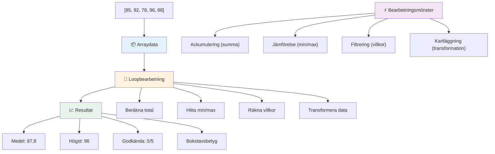
---

## GitHub Copilot Agent-utmaning 🚀

Använd Agent-läget för att slutföra följande utmaning:

**Beskrivning:** Bygg en omfattande databehandlingsfunktion som kombinerar arrayer och loopar för att analysera en datamängd och generera meningsfulla insikter.

**Prompt:** Skapa en funktion kallad `analyzeGrades` som tar en array av studentbetygsobjekt (varje innehållande namn- och poäng-egenskaper) och returnerar ett objekt med statistik inklusive högsta poäng, lägsta poäng, genomsnittspoäng, antal studenter som klarade (poäng >= 70) och en array med namn på studenter som presterat över genomsnittet. Använd minst två olika looptyper i din lösning.

Läs mer om [agent mode](https://code.visualstudio.com/blogs/2025/02/24/introducing-copilot-agent-mode) här.

## 🚀 Utmaning
JavaScript erbjuder flera moderna array-metoder som kan ersätta traditionella loopar för specifika uppgifter. Utforska [forEach](https://developer.mozilla.org/docs/Web/JavaScript/Reference/Global_Objects/Array/forEach), [for-of](https://developer.mozilla.org/docs/Web/JavaScript/Reference/Statements/for...of), [map](https://developer.mozilla.org/docs/Web/JavaScript/Reference/Global_Objects/Array/map), [filter](https://developer.mozilla.org/docs/Web/JavaScript/Reference/Global_Objects/Array/filter), och [reduce](https://developer.mozilla.org/docs/Web/JavaScript/Reference/Global_Objects/Array/reduce).

**Din utmaning:** Refaktorisera exemplet med studentbetyg med hjälp av minst tre olika array-metoder. Lägg märke till hur mycket renare och mer läsbar koden blir med modern JavaScript-syntax.

## Post-lektion Quiz
[Post-lektion quiz](https://ff-quizzes.netlify.app/web/quiz/14)


## Översikt & Självstudier

Arrayer i JavaScript har många metoder kopplade till sig, som är mycket användbara för datamanipulation. [Läs om dessa metoder](https://developer.mozilla.org/docs/Web/JavaScript/Reference/Global_Objects/Array) och prova några av dem (som push, pop, slice och splice) på en array du skapar själv.

## Uppgift

[Loop an Array](assignment.md)

---

## 📊 **Din Sammanfattning av Arrayer & Loopverktyg**

```mermaid
graph TD
    A["🎯 Mästarklass i array och loopar"] --> B["📦 Grundläggande om arrayer"]
    A --> C["🔄 Looptyper"]
    A --> D["🔗 Databearbetning"]
    A --> E["🎨 Moderna tekniker"]
    
    B --> B1["Skapande: [ ]"]
    B --> B2["Indexering: arr[0]"]
    B --> B3["Metoder: push, pop"]
    B --> B4["Egenskaper: length"]
    
    C --> C1["For: Kända iterationer"]
    C --> C2["While: Villkorsbaserad"]
    C --> C3["For...of: Direkt åtkomst"]
    C --> C4["forEach: Funktionell"]
    
    D --> D1["Statistikberäkning"]
    D --> D2["Datatransformation"]
    D --> D3["Filtrering & sökning"]
    D --> D4["Realtidsbearbetning"]
    
    E --> E1["Arrowfunktioner"]
    E --> E2["Metodkedjning"]
    E --> E3["Destrukturering"]
    E --> E4["Mallsträngar"]
    
    F["💡 Viktiga fördelar"] --> F1["Effektiv datahantering"]
    F --> F2["Minskad kodupprepning"]
    F --> F3["Skalbara lösningar"]
    F --> F4["Renare syntax"]
    
    style A fill:#e3f2fd
    style B fill:#e8f5e8
    style C fill:#fff3e0
    style D fill:#f3e5f5
    style E fill:#e0f2f1
    style F fill:#fce4ec
```
---

## 🚀 Din Tidslinje för Mästerskap i Arrayer & Loopar

### ⚡ **Vad Du Kan Göra under Nästa 5 Minuter**
- [ ] Skapa en array med dina favoritfilmer och hämta specifika element
- [ ] Skriv en for-loop som räknar från 1 till 10
- [ ] Testa utmaningen med moderna array-metoder från lektionen
- [ ] Öva på array-indexering i din webbläsares konsol

### 🎯 **Vad Du Kan Uppnå under Denna Timme**
- [ ] Slutför post-lektionsquizzen och gå igenom eventuella svåra koncept
- [ ] Bygg den omfattande betygsanalysatorn från GitHub Copilot-utmaningen
- [ ] Skapa en enkel kundvagn som lägger till och tar bort artiklar
- [ ] Öva på att konvertera mellan olika loop-typer
- [ ] Experimentera med array-metoder som `push`, `pop`, `slice` och `splice`

### 📅 **Din Veckolånga Databehandlingsresa**
- [ ] Slutför uppgiften "Loop an Array" med kreativa förbättringar
- [ ] Bygg en to-do-lista applikation med hjälp av arrayer och loopar
- [ ] Skapa en enkel statistikkalkylator för numeriska data
- [ ] Öva med [MDN array-metoder](https://developer.mozilla.org/docs/Web/JavaScript/Reference/Global_Objects/Array)
- [ ] Bygg ett fotogalleri eller ett musikspellista-gränssnitt
- [ ] Utforska funktionell programmering med `map`, `filter` och `reduce`

### 🌟 **Din Månadslånga Transformation**
- [ ] Bemästra avancerade array-operationer och prestandaoptimering
- [ ] Bygg en komplett dashboard för datavisualisering
- [ ] Bidra till open source-projekt som involverar databehandling
- [ ] Lär någon annan om arrayer och loopar med praktiska exempel
- [ ] Skapa ett personligt bibliotek av återanvändbara databehandlingsfunktioner
- [ ] Utforska algoritmer och datastrukturer baserade på arrayer

### 🏆 **Slutlig Kontrollpunkt för Mästerskap i Databehandling**

**Fira din skicklighet i arrayer och loopar:**
- Vilken array-operation är mest användbar för dig i verkliga tillämpningar?
- Vilken loop-typ känns mest naturlig för dig och varför?
- Hur har förståelsen för arrayer och loopar förändrat ditt sätt att organisera data?
- Vilken komplex databehandlingsuppgift skulle du vilja ta dig an härnäst?

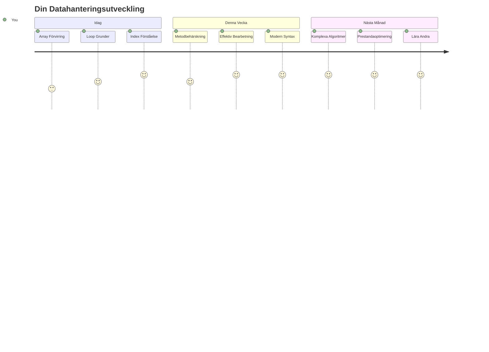
> 📦 **Du har låst upp kraften i dataorganisering och databehandling!** Arrayer och loopar är grunden för nästan varje applikation du någonsin kommer att bygga. Från enkla listor till komplex dataanalys, har du nu verktygen för att hantera information effektivt och elegant. Varje dynamisk webbplats, mobilapp och datadriven applikation är beroende av dessa grundläggande koncept. Välkommen till världen av skalbar databehandling! 🎉

---

<!-- CO-OP TRANSLATOR DISCLAIMER START -->
**Friskrivning**:
Detta dokument har översatts med hjälp av AI-översättningstjänsten [Co-op Translator](https://github.com/Azure/co-op-translator). Vi strävar efter noggrannhet, men var medveten om att automatiska översättningar kan innehålla fel eller brister. Det ursprungliga dokumentet på dess modersmål bör betraktas som den auktoritativa källan. För kritisk information rekommenderas professionell mänsklig översättning. Vi ansvarar inte för eventuella missförstånd eller feltolkningar som uppstår till följd av användningen av denna översättning.
<!-- CO-OP TRANSLATOR DISCLAIMER END -->